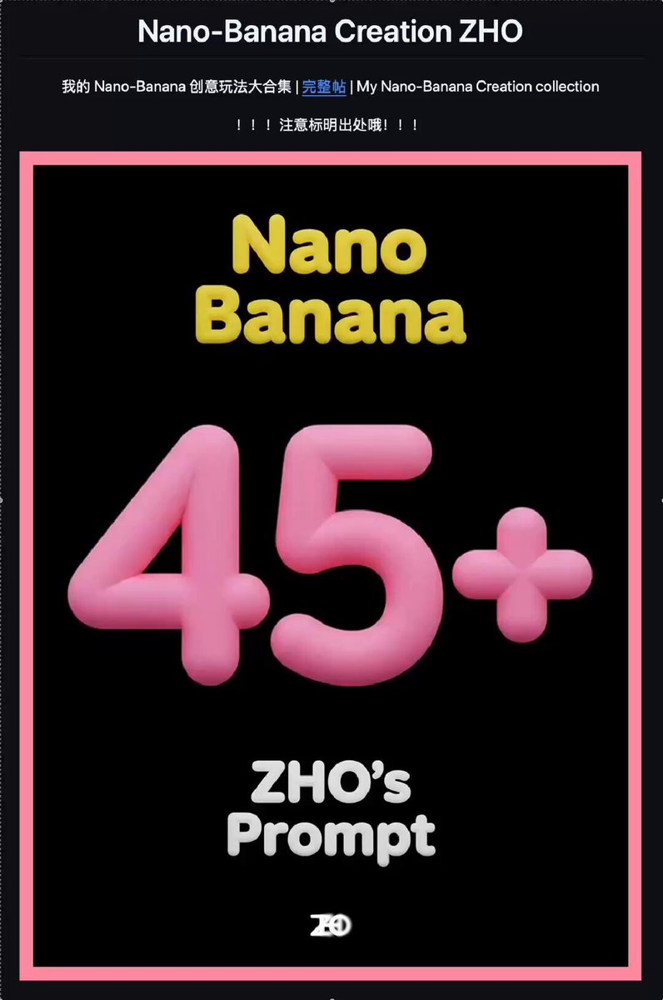
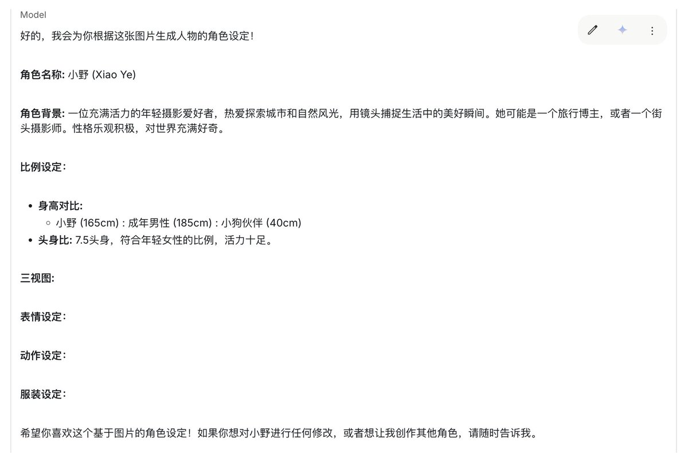

终于把我的 Nano-Banana 创意玩法大全 Github 库 写好了！！！

目前一共 46 种！持续更新/开源中！！！

这下方便大家查看和使用提示词了，但注意标明出处哦！！！

一键直达：[github.com/ZHO-ZHO-ZHO/ZH…](https://github.com/ZHO-ZHO-ZHO/ZHO-nano-banana-Creation) 

## 💬 Replies

### 1 @binghe (冰河)

*Thu Sep 04 12:12:45 +0000 2025*

@ZHO\_ZHO\_ZHO 先点赞，收藏，养成好习惯。

### 2 @juansemoss (SΞB-MOSS)

*Thu Sep 04 12:31:32 +0000 2025*

@ZHO\_ZHO\_ZHO 👏👏

### 3 @sunmano (GROK 情欲写真)

*Thu Sep 04 12:34:32 +0000 2025*

@ZHO\_ZHO\_ZHO 今天gemini上传图片非常慢，不知道咋回事

### 4 @seekjourney (极客杰尼)

*Thu Sep 04 11:55:38 +0000 2025*

@ZHO\_ZHO\_ZHO Star ⭐️

### 5 @Stephen4171127 (熊布朗)

*Thu Sep 04 17:49:08 +0000 2025*

@ZHO\_ZHO\_ZHO 感谢分享🙏

### 6 @787887kyotokyo (787887kyotokyo🎒)

*Thu Sep 04 11:48:56 +0000 2025*

@ZHO\_ZHO\_ZHO 謝謝大神

### 7 @howlemont (皓樂芒)

*Thu Sep 04 22:48:51 +0000 2025*

@ZHO\_ZHO\_ZHO 真专业，谢谢

### 8 @CharlesC_ai (CharlesC.ai)

*Thu Sep 04 16:04:20 +0000 2025*

@ZHO\_ZHO\_ZHO 收藏了一下:

Check out this prompt: nano-banana 创意玩法大合集 [promptup.net/prompt/818e488…](https://promptup.net/prompt/818e488d-43ea-4fa0-9f5a-1b3b9af83754)

### 9 @Xigle8 (Xigle)

*Thu Sep 04 12:27:24 +0000 2025*

@ZHO\_ZHO\_ZHO 太牛逼了

### 10 @DDUPTV8 (Rocks)

*Thu Sep 04 11:46:47 +0000 2025*

@ZHO\_ZHO\_ZHO 牛的

### 11 @lifuwei166779 (lifuwei)

*Fri Sep 05 02:46:38 +0000 2025*

@ZHO\_ZHO\_ZHO 必须赞

### 12 @zhoujiayi429 (Kevin:Stamp It & 逆流的河)

*Thu Sep 04 12:17:01 +0000 2025*

@ZHO\_ZHO\_ZHO 666666

### 13 @meetxu (aiben)

*Thu Sep 04 15:49:45 +0000 2025*

@ZHO\_ZHO\_ZHO 这个好

### 14 @HuangZhi82 (之i)

*Thu Sep 04 12:38:01 +0000 2025*

@ZHO\_ZHO\_ZHO 牛

### 15 @zeniskui (Si)

*Thu Sep 04 15:17:32 +0000 2025*

@ZHO\_ZHO\_ZHO 真棒！

### 16 @yuyuzero7 (yu yu)

*Thu Sep 04 17:51:52 +0000 2025*

@ZHO\_ZHO\_ZHO 🫡

### 17 @simon_wang66 (simon_wang)

*Thu Sep 04 11:49:09 +0000 2025*

@ZHO\_ZHO\_ZHO 6的飞起～

### 18 @andresicor (IAndrés)

*Fri Sep 05 05:08:10 +0000 2025*

@ZHO\_ZHO\_ZHO Zzz 👏🏻👏🏻👏🏻👏🏻👏🏻👏🏻👏🏻👏🏻

### 19 @ShuaiBCN (郭小帅在巴塞)

*Thu Sep 04 23:10:15 +0000 2025*

@ZHO\_ZHO\_ZHO 感谢大佬分享

### 20 @ZhangjieDuan (寂寞的熊猫)

*Thu Sep 04 13:56:34 +0000 2025*

@ZHO\_ZHO\_ZHO 大佬666

### 21 @sham_professor (ShamProfessor)

*Mon Sep 08 02:46:40 +0000 2025*

@ZHO\_ZHO\_ZHO 已发小红书，艾特了大佬🤝

### 22 @michael91241788 (michael ma)

*Thu Sep 04 15:23:33 +0000 2025*

@ZHO\_ZHO\_ZHO 芜湖

### 23 @Lhaven817 (Lhaven817📷)

*Fri Sep 05 02:47:36 +0000 2025*

@ZHO\_ZHO\_ZHO 贊👍

### 24 @genoooool (阿衍)

*Thu Sep 04 14:44:56 +0000 2025*

@ZHO\_ZHO\_ZHO 非常nice

### 25 @lifuwei166779 (lifuwei)

*Fri Sep 05 00:58:14 +0000 2025*

@ZHO\_ZHO\_ZHO 你太优秀了

### 26 @Petrus0918 (Petrus)

*Thu Sep 04 11:53:15 +0000 2025*

@ZHO\_ZHO\_ZHO 哥太牛

### 27 @karlkarl76 (卡尔)

*Fri Sep 05 12:41:52 +0000 2025*

@ZHO\_ZHO\_ZHO 真不敢想象，一年以后nano banana会怎样

### 28 @yinye92367003 (yinye)

*Fri Sep 05 02:00:09 +0000 2025*

@ZHO\_ZHO\_ZHO 为什么我的总是给我生成文字啊，是nano banana出问题了还是我提示词使用的方法不对啊 

