# 📰 How to become an AI Engineer in 2026: the Claude-first roadmap that actually works

AI engineers at top companies are pulling $250K-$450K in 2026. Most of them cannot train a model from scratch. They learned one thing instead. And that one thing runs on Claude.

> Follow my Substack to get fresh AI alpha: [movez.substack.com](https://movez.substack.com/)

This roadmap is built on Claude because it ships the full stack in one place: model, API, coding agent, agentic loops, memory, skills, deployment. I spent 50+ hours on Anthropic docs, engineering talks, and real builds to put this together. Every prompt below is copy-paste ready.

This article will explain:

1. why most "AI engineer" roadmaps teach the wrong thing

1. Phase 1: the foundation you build in month 1-2

1. Phase 2: the agent layer that gets you to $250K+ jobs

1. Phase 3: the production skills that separate juniors from seniors

1. the exact portfolio, stack, and free resources

Bookmark this. Save it.

---

The shift

## The lie most "AI engineer" roadmaps tell you

Most roadmaps start with linear algebra. Then statistics. Then "learn Python." Then a Coursera ML course from 2019.

That path trains researchers. Not engineers.

Here is what nobody says out loud: the job title "AI engineer" in 2026 does not mean "person who trains models." It means person who builds systems around models - harnesses, agents, pipelines, evaluations, and products that solve real problems.

> "The best code is the code you never write. You don't program the solution - you program the data - the solution programs itself." - Andrej Karpathy, Anthropic

The model is a commodity. The system around it is the job. Once you get that, the entire learning path looks different.

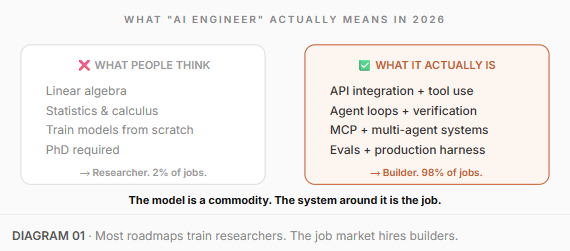

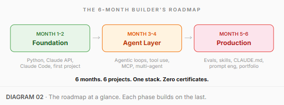

---

Phase 1 · Month 1-2

# The Foundation

## 01\. Learn Python

Most beginners spend 3 months on Python before they touch anything AI-related. That is backwards.

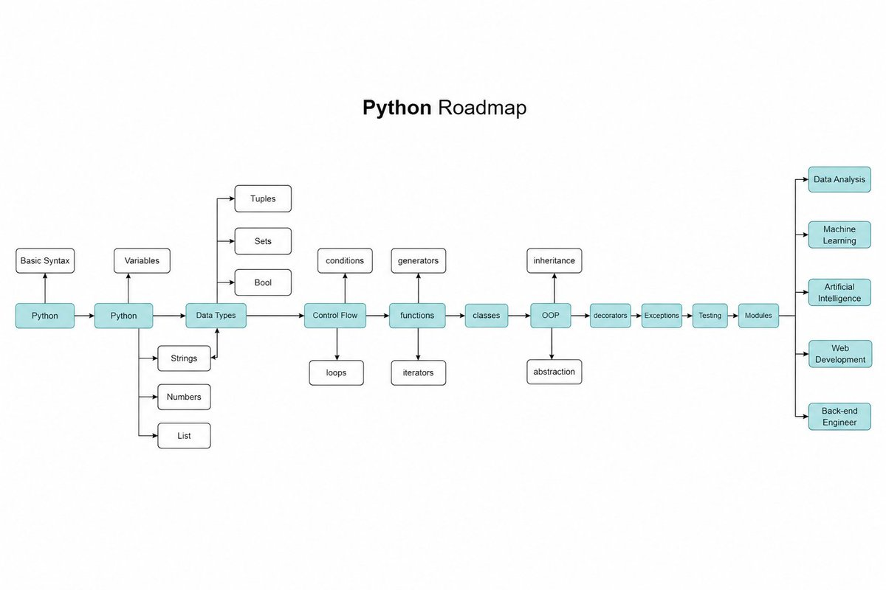

You need exactly four things: functions, dictionaries, async/await, and how to call an API. Everything else you learn on demand.

\`\`\`python
\# If you can write this without Googling, you're ready
import httpx, asyncio, json

async def call\_claude(prompt: str) -&gt; str:
    async with httpx.AsyncClient() as client:
        r = await client.post(
            "https://api.anthropic.com/v1/messages",
            headers={"x-api-key": YOUR\_KEY,
                      "anthropic-version": "2023-06-01"},
            json={"model": "claude-sonnet-4-6",
                  "max\_tokens": 1024,
                  "messages": \[{"role": "user",
                                "content": prompt}\]}
        )
        return r.json()\["content"\]\[0\]\["text"\]
\`\`\`

If you can read that and understand what it does - move on. If you cannot - spend 2 weeks on Python basics, not 3 months.

## 02\. Understand the Claude API

Most people use Claude through the chat window. That is 10% of what it can do.

The API is where engineering starts. You control the model, the system prompt, the temperature, the tools, and the output format. Without the API, you are a user. With the API, you are a builder.

\`\`\`plaintext
1\. Messages endpoint - send a prompt, get a response
2\. System prompts - give Claude a persistent role
3\. Tool use - let Claude call your functions
\`\`\`

Go to docs.anthropic.com. Build three things: a chatbot, a classifier, and an extractor. Do not read about them. Build them.

72 hours. That is all this takes.

---

## 

## 03\. Install Claude Code

Claude Code is a command-line coding agent. You point it at a codebase and it reads, writes, tests, and commits code autonomously.

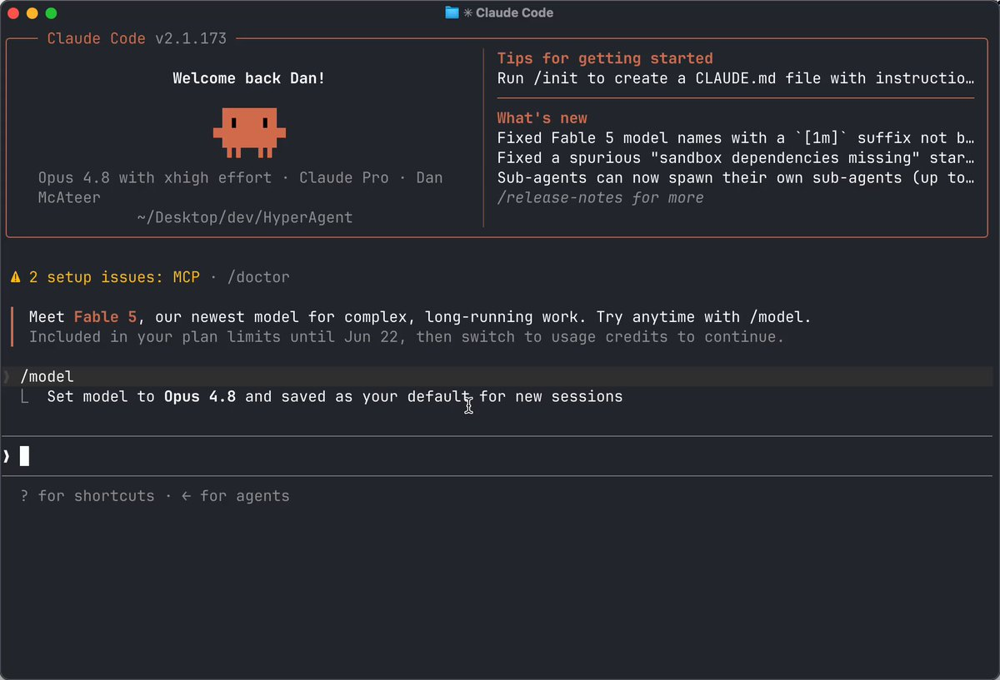

It went from zero to $400M in revenue in months. It started as a hackathon project.

> "Fable 5 is writing 100% of my code now. It's at least 3x more powerful than Opus." - Boris Cherny, creator of Claude Code

\`\`\`bash
npm install -g @anthropic-ai/claude-code
cd your-project
claude
\`\`\`

Most developers still type every line by hand. The ones using Claude Code ship 3-5x faster. Same quality. A fraction of the time.

---

## 

## 04\. Build your first project

Tutorials teach you to follow. Projects teach you to build.

- A CLI tool that summarizes any PDF using Claude API

- A Slack bot that answers questions about your company docs

- A script that monitors a webpage and alerts you on changes

\`\`\`plaintext
Build a CLI tool in Python that takes a PDF path as input,
extracts the text, sends it to Claude API, and returns
a 3-paragraph summary. Use click for CLI, PyMuPDF for PDF.
Write tests. Make it pip-installable.
\`\`\`

Ship it. Put it on GitHub. That is your first portfolio piece.

One shipped project beats 50 certificates.

---

Phase 2 · Month 3-4

# The Agent Layer

Most people stall here. They learn the API and stop. Never build anything autonomous.

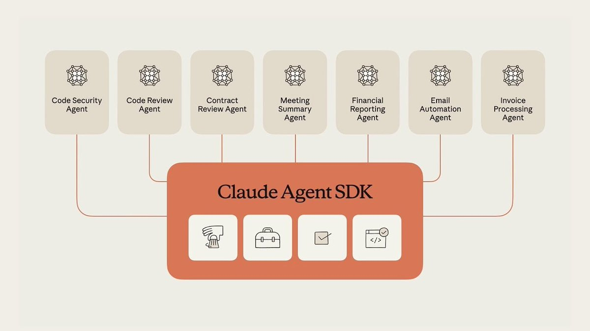

$250K+ AI engineering jobs in 2026 are agent engineering jobs. Not prompt engineering jobs.

---

## 05\. Understand the agentic loop

A prompt is one instruction. A loop is a goal the AI keeps working toward until it gets there - without you babysitting every step.

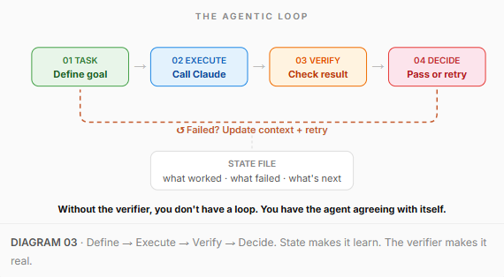

- A verifier turns repetition into progress. Without a real check, you have the agent agreeing with itself on repeat.

- State is what makes the loop learn. Each pass, the AI has to know what it already tried.

- A stop condition keeps it sane. The goal is met, or a hard limit says "after N tries, stop and report."

\`\`\`python
\# The simplest agentic loop
while not done and attempts &lt; max\_attempts:
    result = call\_claude(task + context)
    verification = verify(result)
    if verification.passed:
        done = True
    else:
        context += f"\\nAttempt {attempts} failed: {verification.reason}"
        attempts += 1
\`\`\`

---

## 

## 06\. Build with tool use

A model without tools can reason but it cannot do anything. It has no way to touch your systems.

\`\`\`python
tools = \[{
    "name": "search\_docs",
    "description": "Search internal documentation",
    "input\_schema": {
        "type": "object",
        "properties": {
            "query": {"type": "string"}
        },
        "required": \["query"\]
    }
}\]
\# Claude decides WHEN to call the tool
\# You execute it and return the result
\# Claude uses the result to continue reasoning
\`\`\`

That is how you go from chatbot to agent. Build a research agent that takes a question, searches 3 sources, and produces a cited summary. Portfolio project #2.

---

## 07\. Learn MCP

MCP (Model Context Protocol) is Anthropic's open standard for connecting AI to external systems. Think of it as USB for AI agents.

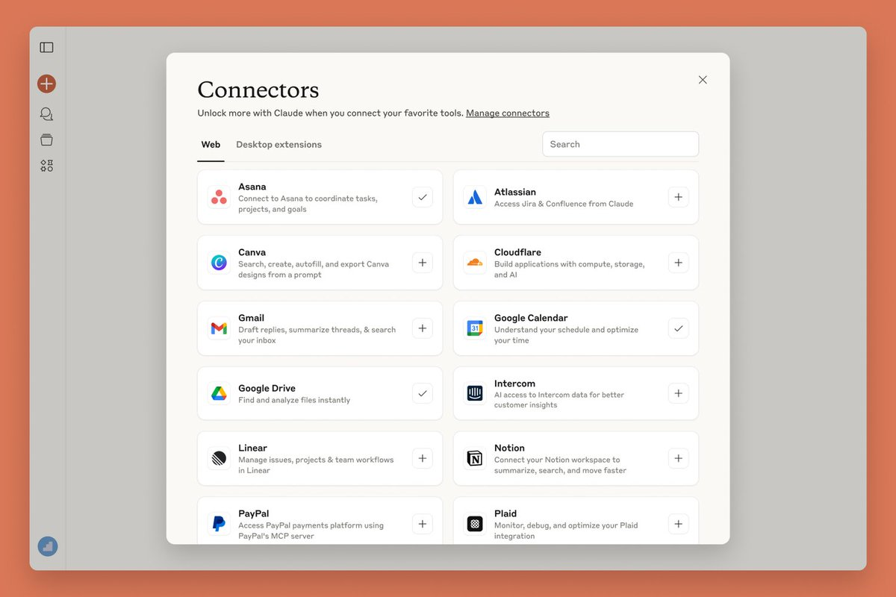

Every company building AI agents needs someone who can wire models to internal systems. MCP is how that wiring happens in 2026.

Build an MCP server that connects Claude to a real data source. Portfolio project #3.

---

## 

## 08\. Ship a multi-agent system

> "Sub agents came from a Reddit post. Someone built an army of agents - PM, designer, frontend, backend. An engineer saw it and built it during a hackathon." - Boris Cherny, Head of Claude Code

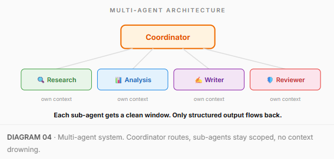

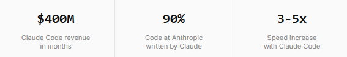

> Same model. Different harness. That is the gap between a $100K developer and a $300K AI engineer.

---

Phase 3 · Month 5-6

# The Production Layer

Building agents is month 3-4. Shipping agents that survive real users is month 5-6. This is where most "AI engineers" stop and most real engineers start.

---

## 

## 09\. Learn evaluation

Most agents work in demos and break in production. The difference is evaluation.

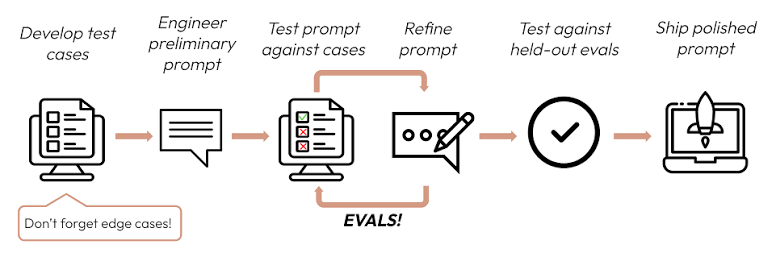

\`\`\`python
\# An eval is embarrassingly simple
test\_cases = \[
    {"input": "...", "expected": "...", "criteria": "..."},
\]

for case in test\_cases:
    result = run\_agent(case\["input"\])
    score = grade(result, case\["expected"\], case\["criteria"\])
    log(case, result, score)
\`\`\`

Ask any AI startup what killed their first product. The answer is always the same.

---

## 

## 10\. Build memory and skills

An agent without memory makes the same mistake on run #50 as on run #1.

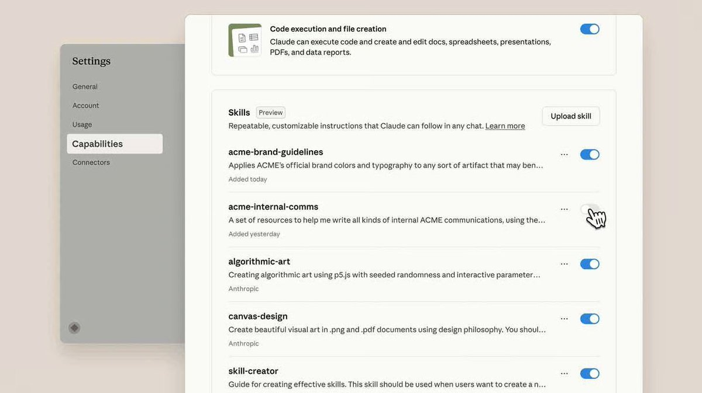

I watched this happen on a real project. An agent kept putting the auth token in the request body instead of the header. Fixed it manually. Next session - same bug. Fixed again. Third session - same bug. The agent had no way to remember what it learned 20 minutes ago.

\`\`\`plaintext
Save this entire workflow as a reusable Skill: "\[name\]"
Capture:
\- input format (what files / spec shape it expects)
\- the agent steps that worked
\- the output format and naming convention
\- the validation rules from the spec
Next time I run this, I attach new files and get the same shape.
\`\`\`

The system around the model is getting smarter - your skill library grows with every project. A competitor cannot copy that library in a week. It is built from months of your real runs.

---

## 

## 11\. Master CLAUDE.md

A single CLAUDE.md file hit #1 on GitHub Trending with 82,000 stars. Most people using Claude have never heard of it.

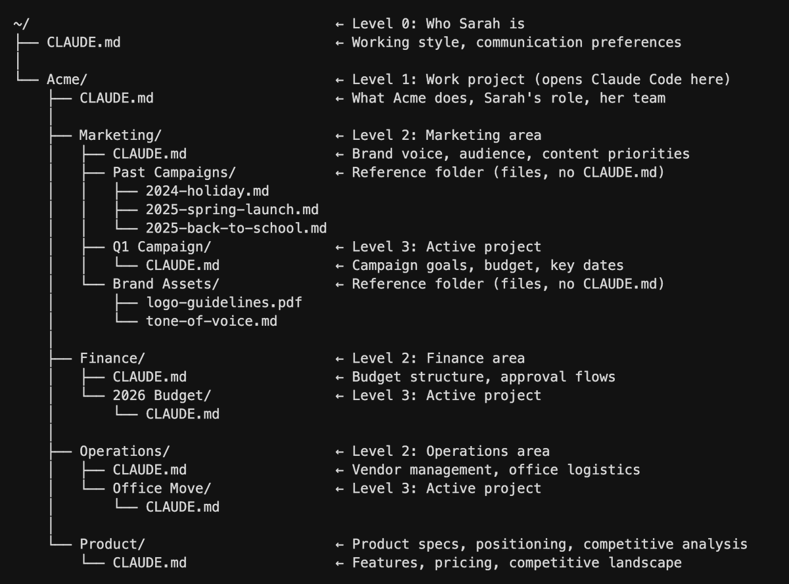

\`\`\`markdown
\# CLAUDE.md

\## Project
E-commerce API. Python 3.12, FastAPI, PostgreSQL.

\## Rules
\- All endpoints return JSON with {data, error, meta}
\- Never use ORM for queries over 3 joins - raw SQL
\- Every new endpoint needs a test in tests/api/
\- Commit messages: type(scope): description

\## Architecture decisions
\- Event sourcing for orders (see docs/adr-003.md)
\- Redis for session cache, not database
\`\`\`

Without CLAUDE.md, your agent guesses. With it, your agent follows your exact engineering standards. Night and day.

---

## 

## 12\. Learn prompt engineering

Most prompt advice is useless. "Be specific." "Give context." That is common sense, not engineering. These 6 rules actually change output quality.

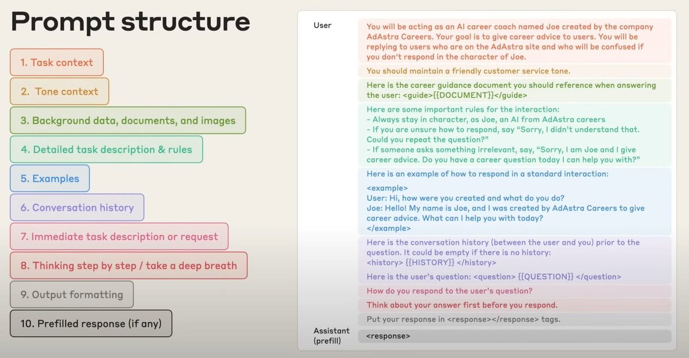

1\. Role before task. Tell Claude who to be before what to do. "You are a senior backend engineer who values simple, testable code" turns a Stack Overflow snippet into production code.

2\. Constraints before freedom. Describe what you don't want. "No external packages. Every function under 20 lines. Type hints on everything." Boundaries force better work.

3\. Show, don't describe. Paste an actual example of the output format you want. Claude will match structure, tone, and detail level exactly. One example beats ten sentences.

4\. Ask Claude to ask you first. The most underused technique. Before any complex task:

\`\`\`plaintext
1\. Role before task
   "You are a senior backend engineer who values
   simple, testable code over clever abstractions."

2\. Constraints before freedom
   "Use only the standard library. No external packages.
   Keep every function under 20 lines."

3\. Show, don't describe
   \[paste an actual example of what you want\]

4\. Ask Claude to ask YOU first
   "Before you start, ask me the 5 most important
   questions that would help you do this well."

5\. Chain outputs
   Take the draft → feed it back → ask to improve
\`\`\`

Catches misunderstandings before they cost you a rewrite.

5\. Chain outputs. Get a draft. Feed it back. Ask to fix specific parts. First draft: 70%. After one pass: 90%. After two: 95%. The model does not get tired. Use that.

6\. Tell Claude what success looks like. If Claude does not know what "done" means, it decides for itself.

\`\`\`plaintext
Success criteria:
\- All 23 routes have Zod validation
\- Every route has at least 2 tests
\- No TypeScript errors on tsc --noEmit
\- You ran the tests and they all pass
\`\`\`

Six rules. Apply them to your next session.

---

The portfolio

# The Portfolio That Gets You Hired

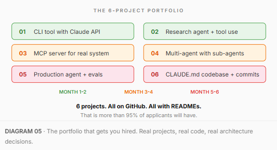

---

The stack

# Stop collecting frameworks. Lock your stack.

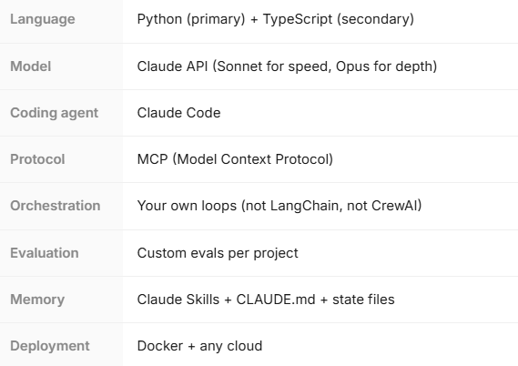

> A chatbox is a vending machine. A custom Claude harness is an operating system.

---

Resources

# Free resources

Paid courses are repackaging this same stuff for $200-$500.

Month 1-2

- [Anthropic API docs](https://docs.anthropic.com/)

- [Claude Code deep dive by Lydia Hallie on Frontend Masters](https://frontendmasters.com/courses/claude-code/)

- [Andrew Ng's Claude Code course with the Anthropic team](https://learn.deeplearning.ai/courses/claude-code-a-highly-agentic-coding-assistant)

Month 3-4

- [Anthropic's Code with Claude workshops + code](https://github.com/anthropics/cwc-workshops)

- [Google's 1-hour course on agentic engineering](https://www.youtube.com/watch?v=vE31B0D3n08)

- [Karpathy's AutoResearch loop framework](https://github.com/karpathy/autoresearch)

Month 5-6

- [Andrej Karpathy's Deep Dive into LLMs (3.5 hours)](https://www.youtube.com/watch?v=7xTGNNLaGko)

- [Andrew Ng's AI Prompting full course](https://www.youtube.com/watch?v=8ib4Qnh2HFE)

- [Karpathy's Neural Networks: Zero to Hero](https://karpathy.ai/zero-to-hero.html)

Ongoing

- [Anthropic engineering blog](https://www.anthropic.com/engineering)

- [Claude Code changelog](https://www.anthropic.com/changelog)

- [MCP specification on GitHub](https://github.com/modelcontextprotocol)

---

# Conclusion:

> The AI engineering job market in 2026 is not about who knows the most theory. It is about who can build the most reliable systems around the best models.

Most people will keep collecting certificates and watching tutorials. They will add "AI" to their LinkedIn title and apply to 200 jobs with no portfolio.

The ones who spend 6 months building real projects on Claude - CLI tools, agents, MCP servers, multi-agent systems, production pipelines - will be the ones who get hired.

Pick one phase. Start today. Build the first project this week.

The other five are here when you are ready.

### 🖼️ Attached Media

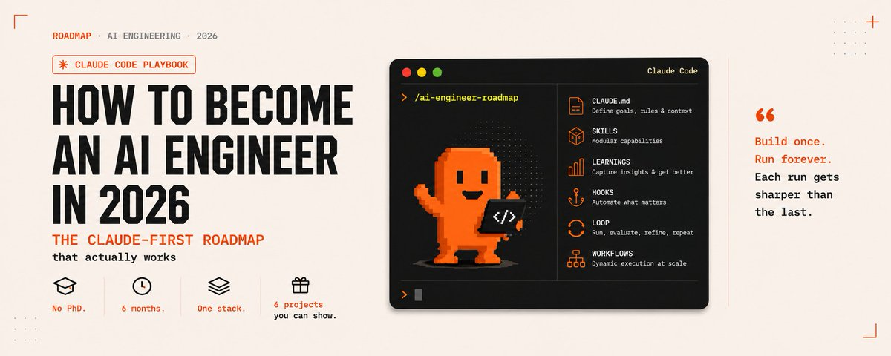

## 💬 Replies

### 1 @0xMovez (Movez)

*Wed Jul 15 12:38:10 +0000 2026*

@0xRafy Amazing roadmap on AI engineering bro ! real alpha

### 2 @0xRafy (0xRafy) (Author)

*Wed Jul 15 12:39:49 +0000 2026*

@0xMovez thanks mate ! you are welcome to use it

### 3 @0xCodez (Codez)

*Wed Jul 15 12:32:23 +0000 2026*

@0xRafy Wow, this is an ultimate AI engineer guide, thx for sharing Rafy !

### 4 @0xRafy (0xRafy) (Author)

*Wed Jul 15 12:36:13 +0000 2026*

@0xCodez appreciate it bro ! hope you find it useful in your career

### 5 @phosphenq (Phosphen)

*Thu Jul 16 16:40:51 +0000 2026*

@0xRafy Great article, thanks!

### 6 @0xRafy (0xRafy) (Author)

*Thu Jul 16 19:45:50 +0000 2026*

@phosphenq always welcome mate !

### 7 @0xMorlex (Morlex)

*Wed Jul 15 12:42:14 +0000 2026*

@0xRafy Woah, this article is great

### 8 @0xRafy (0xRafy) (Author)

*Wed Jul 15 14:29:06 +0000 2026*

@0xMorlex thanks bro !

### 9 @0xChaseTM (Chase)

*Wed Jul 15 12:58:48 +0000 2026*

@0xRafy worth reading, booked for tonight

### 10 @0xRafy (0xRafy) (Author)

*Wed Jul 15 13:04:55 +0000 2026*

@0xChaseTM thanks bro, i\`ll be waiting for a feedback !

### 11 @vartekxx (vartekx)

*Wed Jul 15 12:38:14 +0000 2026*

@0xRafy So useful guide bro! Thanks

### 12 @0xRafy (0xRafy) (Author)

*Wed Jul 15 12:40:38 +0000 2026*

@vartekxx hope you enjoy it bro, it\`s all yours !

### 13 @sana8163 (Dollface)

*Tue Jul 21 17:07:36 +0000 2026*

@0xRafy USG won 1-0 today against Mechelen with a goal from Sykes also I won with my team crans in football sage 2-0 against redhawks with 2 goals from Googs.

### 14 @0xBackwood (BACKWOOD)

*Wed Jul 15 15:27:13 +0000 2026*

@0xRafy "AI engineers at top companies are pulling $250K-$450K in 2026"

What they gonna offer for this money. or this amount calculated for tokens as well? lmaooo

