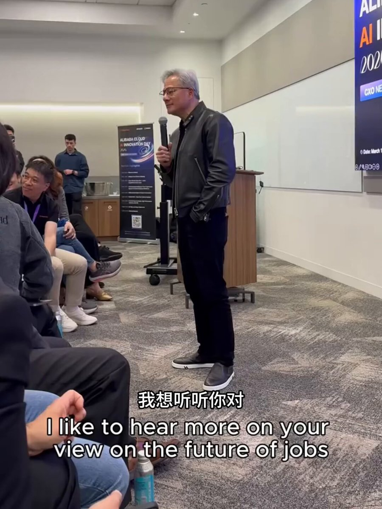

有人问黄仁勋：AI会取代人类的工作吗？ 

没想到黄仁勋的回答震惊了众人。 

## 💬 Replies

### 1 @Gf7Vision (拆墙者)

*Fri Jun 05 19:05:10 +0000 2026*

@LuBtc888 越抹越黑，和衣服一样黑～

### 2 @LuBtc888 (0x鸣人) (Author)

*Sat Jun 06 01:42:06 +0000 2026*

@Gf7Vision 哈哈哈

### 3 @Etudecn (淘沙者(TheSandPicker))

*Sat Jun 06 02:58:39 +0000 2026*

@LuBtc888 会不会变成这样：未来人类不需要工作了，也不愁吃愁喝了，未来我们只为生存而生存，未来我们只探索未知。

### 4 @LuBtc888 (0x鸣人) (Author)

*Sat Jun 06 03:41:21 +0000 2026*

@Etudecn 或许有生之年内

### 5 @stannocturne (Holy Faith)

*Sat Jun 06 06:47:50 +0000 2026*

@LuBtc888 太棒了，有完整視頻嗎

### 6 @LuBtc888 (0x鸣人) (Author)

*Sat Jun 06 07:09:44 +0000 2026*

@stannocturne 只有这段

### 7 @kuk47377341 (Kithe)

*Sat Jun 06 01:40:45 +0000 2026*

@LuBtc888 这回答绝了😂

### 8 @egyptk6 (Udon🍜うどん(🌸, 🌿))

*Sat Jun 06 13:18:03 +0000 2026*

@LuBtc888 那做設計的呢

### 9 @EdwardTsai_TW (Edward Tsai)

*Sat Jun 06 01:56:17 +0000 2026*

@LuBtc888 真奇怪，問這種問題，是希望從Jensen口中得到怎樣的答案呢？
這樣說吧，你去買肉粽，你問老闆肉粽好吃嗎，你覺得老闆會跟你說不好吃嗎？

### 10 @fayedark1999 (grimfury)

*Sat Jun 06 01:43:13 +0000 2026*

@LuBtc888 AI這種會推理和判斷的物種怎麼可能只是工具, 既得利益者把AI包裝成工具只是在溫水煮蛙. 奇怪那麼多人聽到工具就信了😂

### 11 @KCKCCC (KC)

*Fri Jun 05 17:49:48 +0000 2026*

@LuBtc888 黃刀俠還是玩刀吧，這舉例太爛了，現在就是走向診斷疾病整個不需要人類參與的時代

### 12 @emptywhitecloud (White Cloud 🌥)

*Sat Jun 06 04:43:40 +0000 2026*

@LuBtc888 Radiologists 還有工作因為人還不肯完全放手給AI診斷。代替Radiologists 是遲早的問題。

### 13 @guojing525 (路人粉)

*Sat Jun 06 04:42:16 +0000 2026*

@LuBtc888 工具不能取代工作，工作是手段工具是手段的手段。人的行为是有目的的，而手段只能为目的服务而非相反。

