# 📰 AI Coding时代，研发项目管理新范式探索与实践

关注腾讯云开发者，一手技术干货提前解锁👇

开发者公众号专属群聊

扫码加入获取更多一手教程、科技前沿报告

当前 个体提效 ≠ 组织提效 成了很多团队的痛点。本文阐述了腾讯健康从PM视角对这一现象进行Debug的过程。最终取得的结果是：中位交付周期从 19 天降到 9 天 ，提效比例52.6%；P85交付周期 从 52 天降到 23 天，提效比例55.8%；30 天以上的长尾需求占比从 35% 收敛到 7%。

# 01

现象：AI 提升了研发个体效率，但项目交付体感并没有变快

AI 辅助开发后，研发个体产出有明显提升，但把视角拉到"端到端交付周期"，会发现团队收益并没有被充分兑现——研发效率、组织协调、交付效率三者，呈现出明显的"分化"：

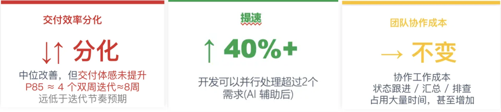

备注：

## 1. 中位交付周期：处于最中间位置的交付时间（反映"简单需求快不快"）

2. P85 交付周期：85% 的需求在此时间内完成，可视为团队对复杂需求的交付承诺线（反映"复杂需求顺不顺"）

中位数在改善，但 P85始终顽固地停在 3 个双周迭代以上——远超“一个双周迭代内交付”的预期。AI 提升的研发个体效率并没有转化为组织交付效率。下面是几个真实的交付周期数据（剔除法定假日和周末，按工作日计算）：

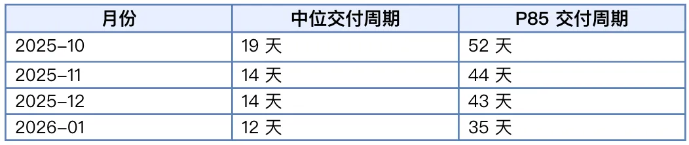

# 02

拆解：交付周期里的时间究竟去哪儿了？

为了回答这个问题，我们重新拆解了需求从开始到上线的全过程。过去，我们更多关注"研发和测试需要多久"，因为这两个环节占用的时间最长。随着 AI Coding 的普及，我们发现：影响交付周期的主要矛盾发生了变化。为了方便讨论，我们拟一个简单的公式来量化评估组织效率（端到端的交付效率）：

**组织效率 = 价值创造时间 /（价值创造时间 + 组织摩擦时间）**

一个需求的交付周期，实际上由两部分组成：

* **价值创造时间**：需求分析、方案设计、研发实现、测试验证等直接创造业务价值的时间。

* **组织摩擦时间**：需求等待排期、资源协调、跨团队协同、联调等待、Bug 返工等在组织协作过程中产生的等待和消耗。

**组织摩擦**：需求在组织协作过程中产生的、不直接创造业务价值的等待与消耗。它不集中在某一个环节，而是随着需求不断流转、在各阶段之间悄悄累积。

组织摩擦究竟有多大？以下是我们分析的四个真实案例。

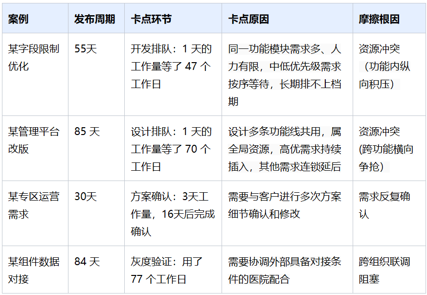

它们的共同点是：真正编码的时间很短，绝大部分周期都耗在了"协作"上。换句话说：**AI Coding 提升了"编码效率"，但组织提效还需要进一步解决"协作效率"问题。**

# 03

解题思路：PM工作视角从"过程管理"调整为"效率治理"

前面的分析让我们意识到，**AI Coding 改变研发方式的同时，组织协作方式也应该被AI改变。**

过去，PM工作更多关注"任务有没有人做""节点有没有延期""风险有没有暴露"。这些工作在今天依然重要，是项目顺利交付的基础。但在 AI 时代，仅仅保障节点不失控已经不够：当AI极大的提升了编码效率之后，项目排期、协作、联调、质量和状态流转等环节中的低效因素被极速放大。项目管理工作需要强化**效率治理**：在保障项目按质交付的基础上，持续发现并消除影响项目过程效率的摩擦与损耗。主要从两个维度入手：

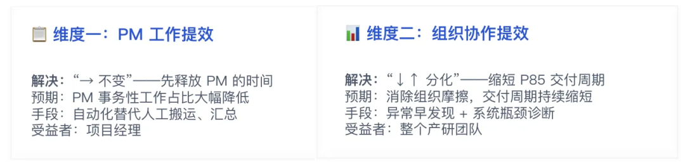

两个独立价值维度：先把 PM 从事务性工作中解放出来，再用解放出来的精力去治理组织摩擦

前者是基础与手段，后者才是目的——通过 AI 实现项目运行状态的持续感知，把项目经理从大量事务性工作中释放出来，投入到风险挖掘、资源对齐和流程治理等有利于提升组织效率的工作中。

# 04

落地策略：PM的工作如何顺应AI潮流？

我们重新梳理了PM的日常工作，发现**大量时间花在了信息收集上，在组织效率debug上的投入远远不够。**

例如每天需要查看多个系统/文档，收集需求状态、分析任务进展、关注资源负荷、整理异常情况，再结合项目背景判断哪些问题需要优先处理，这一过程中信息收集消耗了大量时间，真正体现项目管理价值的风险判断、资源对齐和问题推动时间被挤压，更别提主动debug隐性问题了。

因此，我们需要思考AI如何辅助项目管理这一课题，我们的答案是：用**AI 完成态势感知与问题曝光 ｜ PM负责推动问题解决与长效治理。**

基于此，我们首先需要把项目管理过程中那些可以标准化、持续执行的能力建成可复用的PM-**Skills，**成为项目管理工作流中的**能力节点**。基于这些能力，我们debug项目交付全路径效率的路径逐步清晰起来：**数据可见 → 数据可信 → 异常定位 → 瓶颈挖掘。**

### 4.1 第一步 ·数据可见：为流程与责任机制建模 ###

持续治理的第一步不是 AI，而是**建立统一的项目语义**。

在很多项目中，项目流程虽然存在，但缺少统一、标准化的表达。同一个需求处于什么阶段、什么角色负责、什么情况下算进入下一阶段，不同团队可能有不同理解。这使项目运行过程难以被准确描述，也无法形成可持续分析的数据基础

因此，我们首先对需求交付流程进行标准化建模：把需求从评审到发布拆解为统一阶段，每个阶段对应明确的责任角色和交付条件，并把每个阶段继续拆解到原子化任务，做到"一个任务对应一个责任主体"，PM贯穿全流程，负责进度跟踪、异常协调和资源调度。

当流程被统一描述后，组织运行过程第一次变得**可观测**。系统能够回答：

* 当前需求处于哪个阶段；

* 谁正在等待；

* 哪个阶段耗时最长；

* 哪类需求最容易返工。

这为后续分析组织摩擦，建立了统一的语义基础。

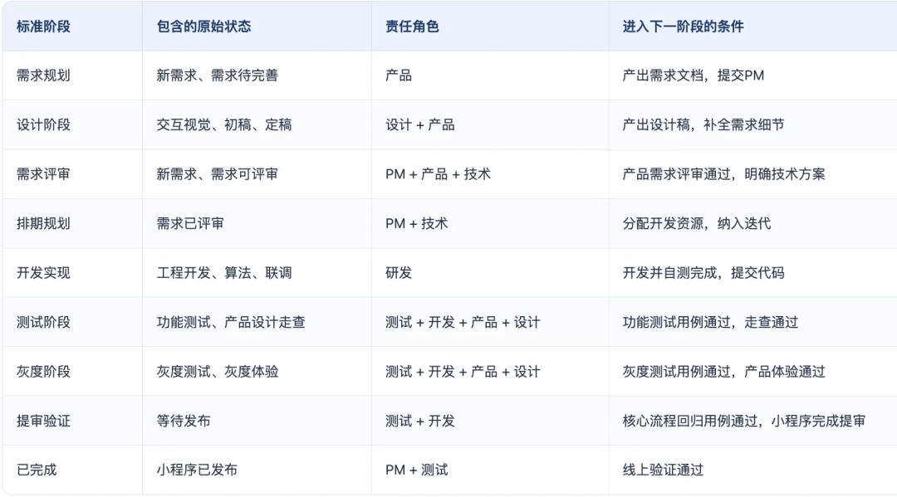

### 4.2 第二步 ·数据可信：校准状态推断 ###

过去，项目状态更多依赖人工维护。如果成员没有及时更新状态，统计出来的等待时间、阶段耗时都会失真，AI 也只能基于错误的数据进行分析。

因此，我们重新设计状态流转机制：借助于 TAPD 自动化规则，由任务状态变化、评审完成、测试流转、发布节点等事件自动驱动状态变化，从"人工汇报状态"转向"系统推断状态"。 

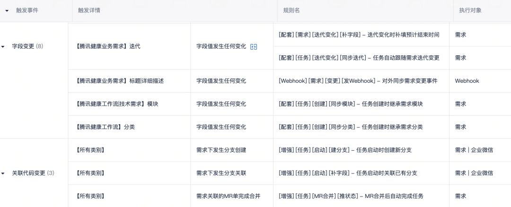

这样，阶段耗时、等待时长、Lead Time 等指标才真正具有统计意义，也为 AI 持续分析提供了可信的数据基础。**数字化不是目的。可信的数据，才是 AI 发挥价值的前提。**

### 4.3 第三步 ·异常定位：推进流程治理 ###

**目标：从"推进任务"转向"治理队列与等待"。**

随着 AI Coding 提升研发效率，新的瓶颈开始从"开发"转向"等待"。需求可能等待排期、等待设计、等待联调、等待测试，也可能因为资源冲突长期停留在某个阶段。这些等待构成了组织摩擦，以前人工巡检的方式难以及时发现或者容易被漏检。

因此，我们构建了**AI持续巡检机制**，让 AI 持续扫描项目运行状态，自动识别异常信号，例如阶段等待超时、需求长期未流转、资源负荷异常、单点依赖风险等。

过去，项目经理每天需要在大量任务中寻找问题；现在，AI 持续完成第一轮筛选，项目经理直接面对需要判断和推动的重点事项。项目管理开始从"推进任务"，转向"治理等待"，及时解决整个项目组协作过程中的问题。

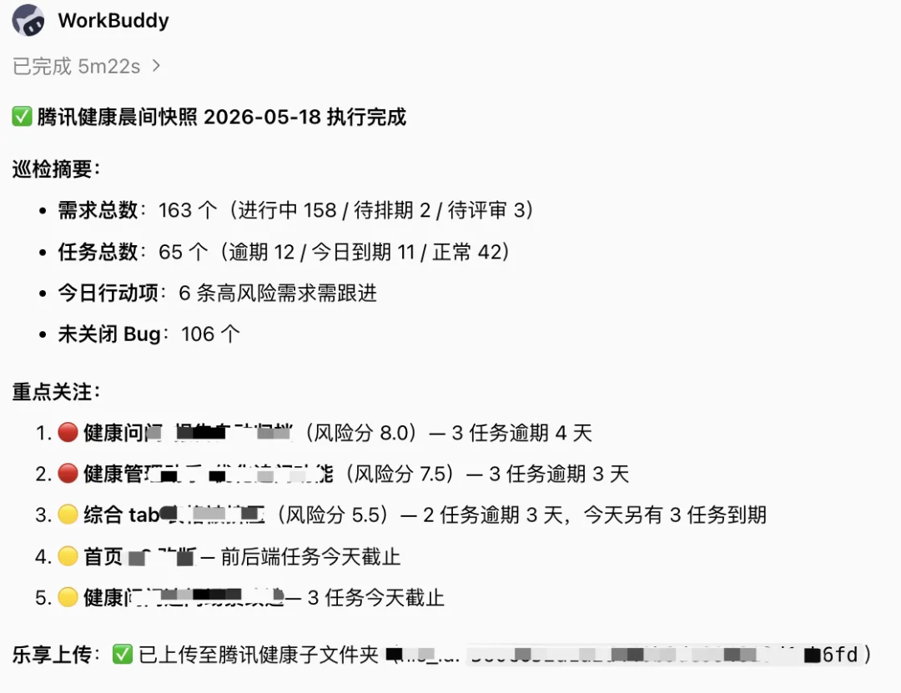

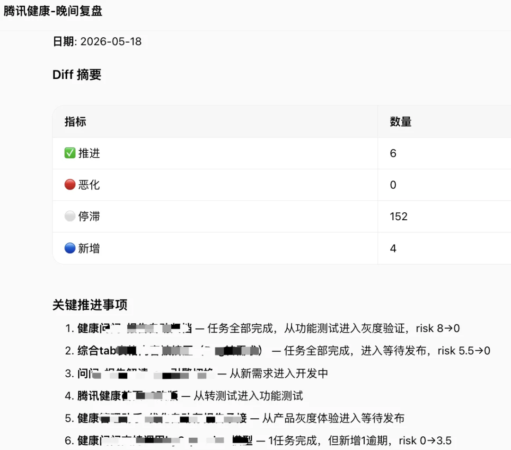

### 4.4 第四步 ·瓶颈挖掘：系统级优化 ###

持续巡检解决的是"每天需要推进什么"，但组织效率的提升，不能停留在每天解决的单个问题上，更需要有全局思维，系统性的看待问题，比如回答：

* 为什么这些问题总是在发生？

* 为什么 P85 一直降不下来？

* 哪些组织摩擦正在持续累积？

因此，我们进一步建立健康分析能力，从双周、月度等更长周期观察组织运行情况，持续分析 Lead Time、等待时长、质量趋势、风险分布等指标，形成组织交付画像。

相比发现单个风险，更重要的是识别长期存在的组织瓶颈，并持续推动优化。项目管理关注的对象，也从"一个个需求、一项项任务"，逐步转向"整个组织交付系统"。 

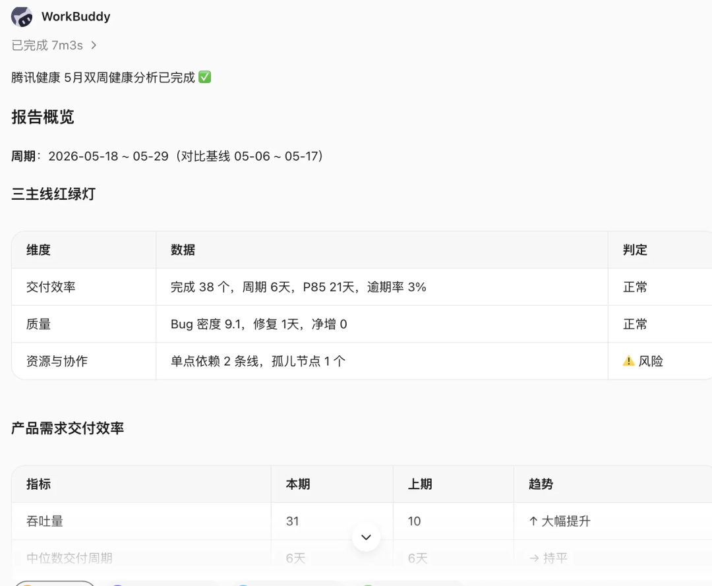

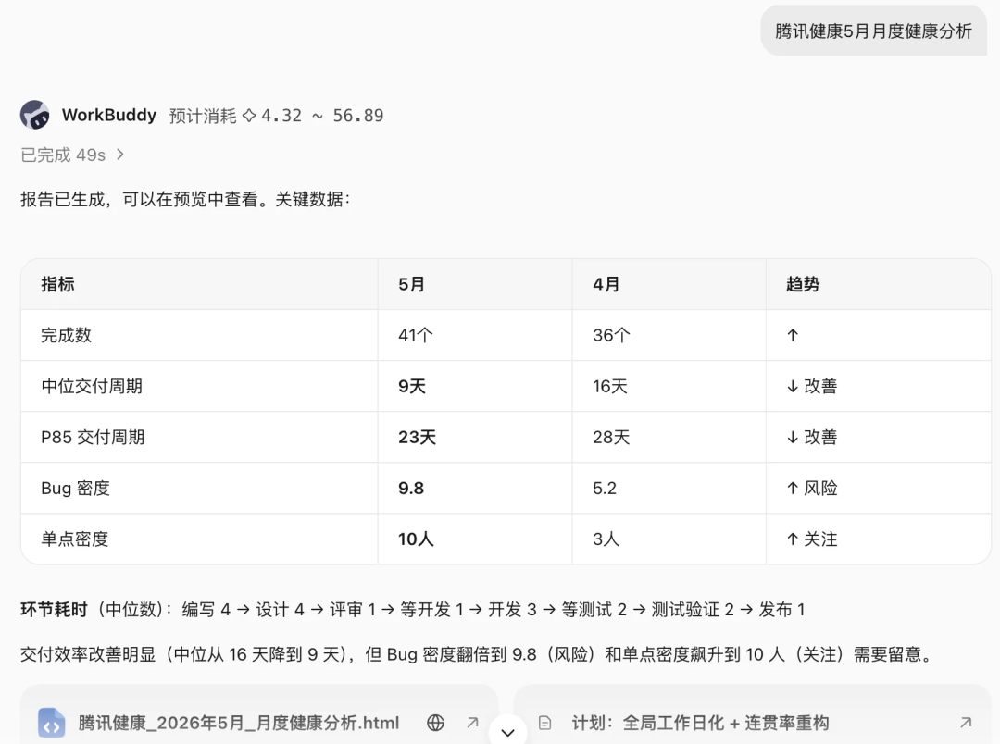

### 4.5 小结：四步是一条递进的治理路径 ###

这四个步骤并不是四项独立能力，而是一条逐层递进的治理路径：

* 建立统一流程，组织才能被描述；

* 建立可信数据，组织才能被分析；

* 持续发现异常，组织才能被治理；

* 持续分析瓶颈，组织才能不断优化。

# 05

落地实践：项目管理 Skills 如何支撑效率治理

为了支撑上述四步法，我们逐步沉淀了一套围绕项目管理工作流的 Skill 能力。它不是新增的工作内容，而是项目经理新的工作方式。协作原则始终如一：

AI 负责：发现问题、定位任务、呈现数据 ｜ PM 负责：判断原因、决定调配、推动解决

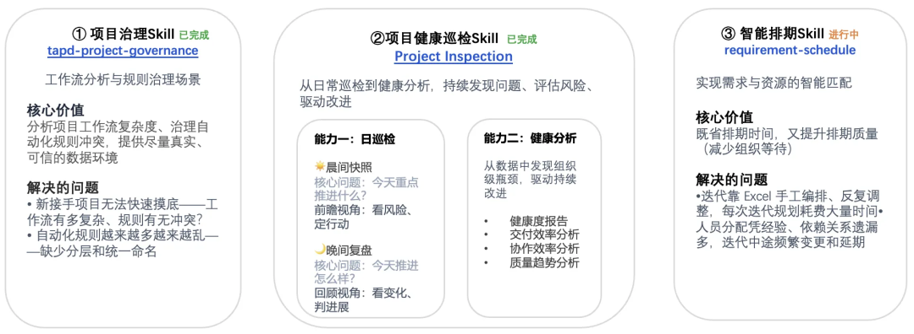

### 5.1 项目治理 Skill：建立项目运行的数字化基础 ###

新接手一个项目时，往往面临两个问题：一是无法快速判断工作流有多复杂、自动化规则是否冲突；二是随着规则越来越多，缺少分层、命名和治理，最终会影响数据可信度。

在腾讯健康项目中，我们先对工作流和自动化规则做治理，把状态流转从"人手动更新"尽量转为"规则触发"。直接结果是：阶段耗时、等待时长、状态停留时间，才真正具有统计意义。

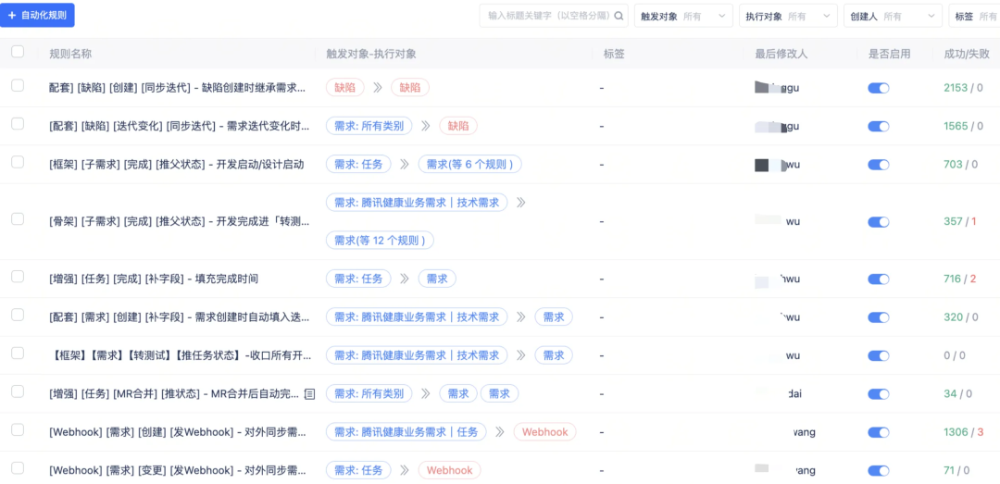

腾讯健康项目治理：自动化 & 工作流

### 5.2 健康巡检 Skill：持续发现组织运行中的异常 ###

健康巡检 Skill 是当前使用频率最高、收益最直观的能力，包含两个互补的模块：**日巡检**与**健康度分析**。

**日巡检-**解决的是"每天的问题"：今天重点推进什么？今天推进得怎么样？

* **晨间快照**自动聚合项目总览、迭代进度、任务看板、风险预警、待规划需求等信息，让 PM 早上不再花大量时间拉数据，而是直接看到优先级最高的风险事项。

* **晚间复盘**自动对比当天变化，回看晨间推进事项有没有进展——哪些需求推进了、哪些未变化、哪些新进入或恶化，从而形成"早上定行动、晚上看结果"的闭环。

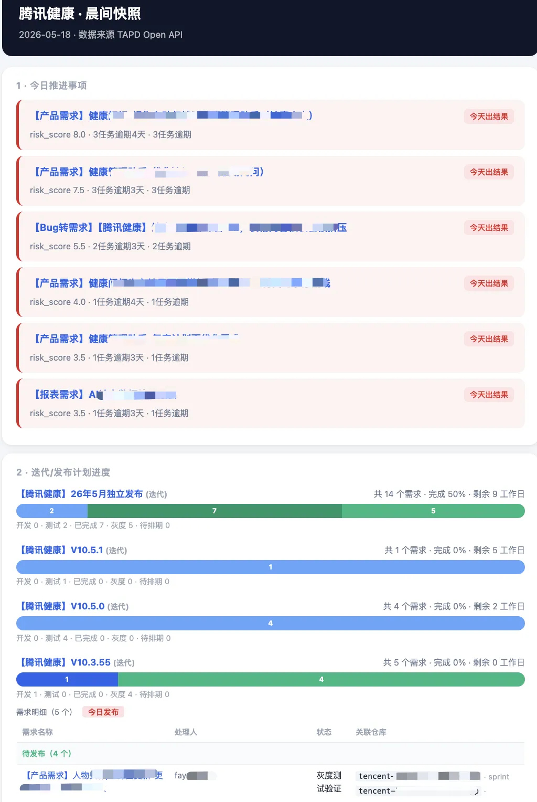

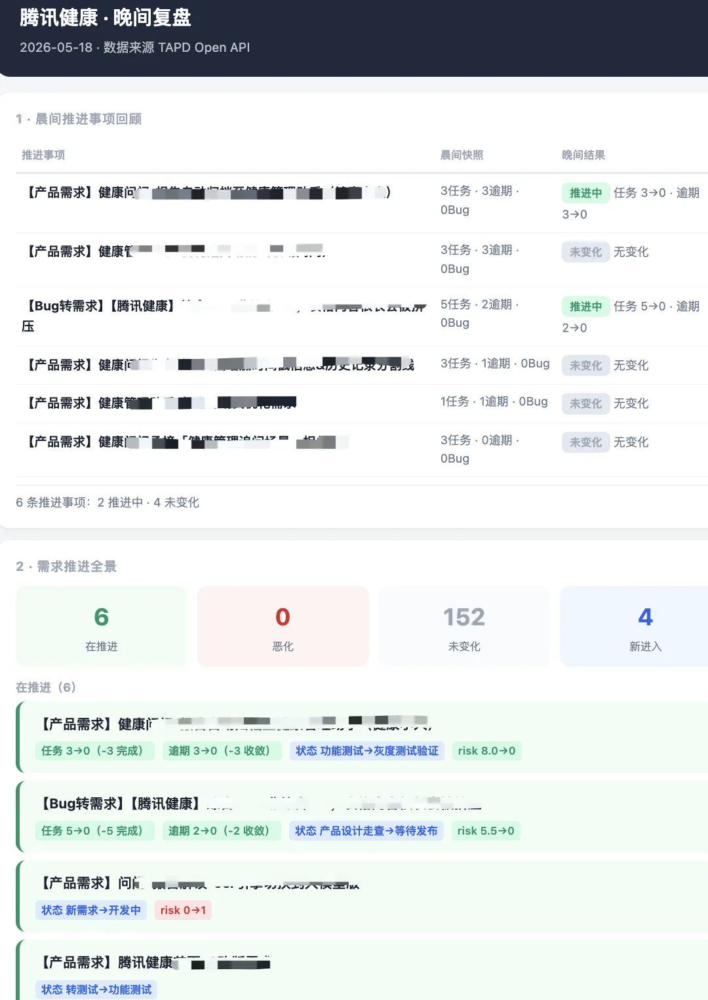

**健康度分析-**解决的是"周期性问题"：项目为什么慢、慢在哪、下一步该治理什么？

基于双周 / 月度数据，持续分析交付效率、协作效率、质量趋势并给出改进建议

把"感觉上很忙""好像一直在返工""某阶段总是在等"，转化成可解释的数据证据。 

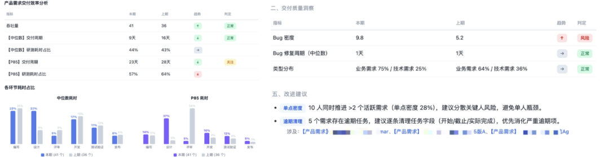

交付效率分析 / 质量分析/改进建议

### 5.3 智能需求排期 Skill：提升项目计划制定效率 ###

需求排期仍在持续建设中，它要解决的是另一个高频痛点：每次迭代规划依赖 Excel 手工编排，人员分配凭经验，依赖关系容易遗漏，迭代中途变更和延期较多。

这个 Skill 的目标不是替代 PM 做排期决策，而是把需求规模、角色依赖、人员负载、阶段先后关系结构化呈现出来，辅助 PM 更快形成可执行的排期方案。

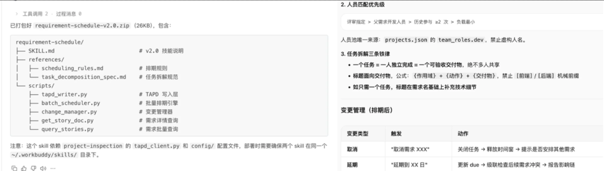

### 5.4 实践成果：用数据说话 ###

成果一 · PM 个体提效：从"找问题"到"解问题"

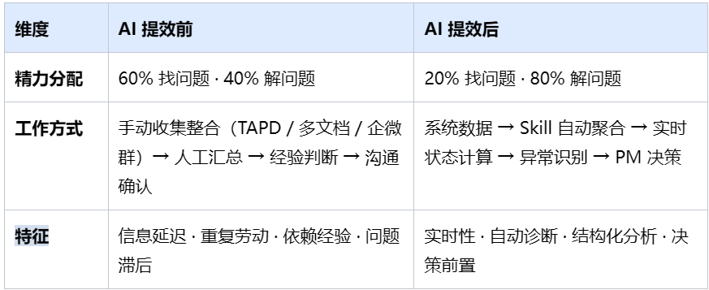

提效后：由 Skill 自动产出晨间快照、晚间复盘、健康度分析，PM 聚焦决策。

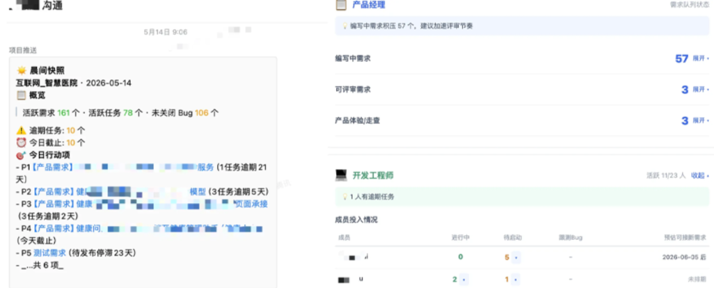

### **成果二 · 组织提效：整体提速，交付可预测性倍增** ###

在 AI 辅助的项目管理新范式下，工具负责持续暴露异常，PM据此实施的协作机制调整，研发效率开始逐步传递到整个项目交付过程。

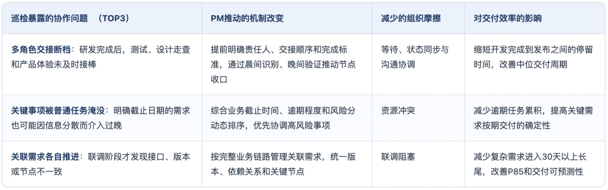

过去这些协作问题通常要等到联调冲突，版本延期或迭代复盘才暴露，滞后1—2周； 

现在问题发现从"事后1—2周"提前到"风险出现的1—3天内"，PM的介入窗口从"延期已成事实"前移到"风险刚开始累积"。以下是实际项目中的几个案例说明：

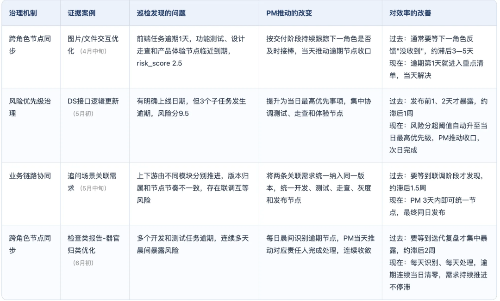

以业务需求交付周期为例，呈现出"整体提速、交付可预测性倍增（P85 与中位数差距缩小）"的良好态势——意味着组织从"部分需求快、部分需求慢"的分化状态，走向更稳定、更可预期的交付节奏。

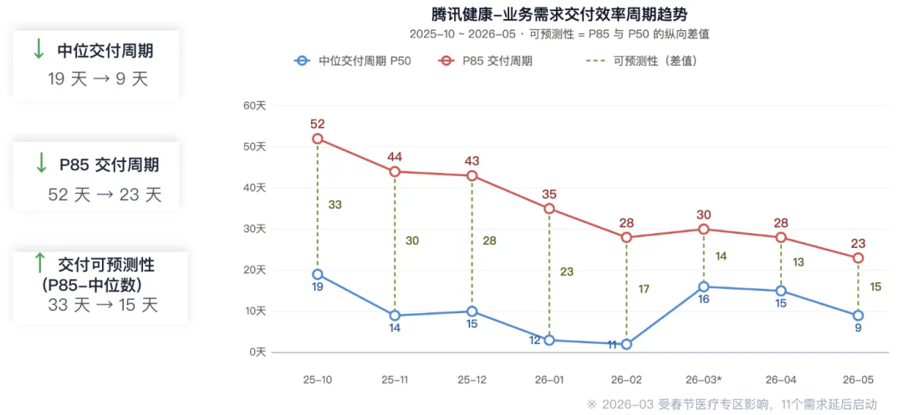

腾讯健康-业务需求交付效率周期趋势（2025-10 \~ 2026-05）：中位数 19→9 天，P85 52→23 天，可预测性 33→15 天

* 长尾显著收敛：30 天以上需求占比从 35% 降至 7%，其中 60 天以上需求从 11% 降至 0%（期间有阶段性回摆，但最终长尾明显收敛）。

* 中位数首次进入个位数（9 天）：意味着项目内一半以上的需求，可以在 2 周（一个双周迭代）内闭环。

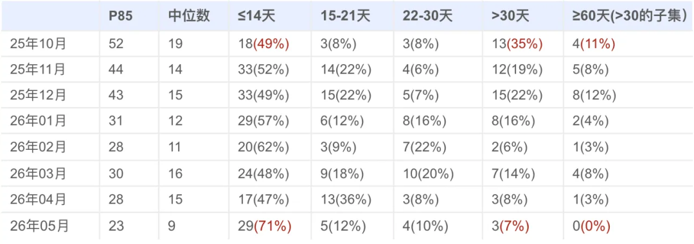

交付周期分布明细：≤14 天占比升至 71%，\>30 天与 ≥60 天持续收敛

AI 工具（代码生成自动化测试）缩短了常规任务的吞吐时间；

项目巡检 Skill 辅助 PM 提前识别风险异常，提前推动治理，压住了长尾；

两端同时收紧，整体节奏才真正变稳。

过去，项目管理更多关注"把项目交付出去"。AI Coding 之后，项目管理的价值，也正从"推进交付"，走向"持续治理组织效率"。这套范式已在部门自研业务线复用，正从单点实验走向常态化的流动治理。欢迎对 探索AI 时代项目管理新范式感兴趣的同学交流探讨。

\-End-

原创作者｜王畅

感谢你读到这里，不如关注一下？👇

扫码领取腾讯云开发者专属服务器代金券！

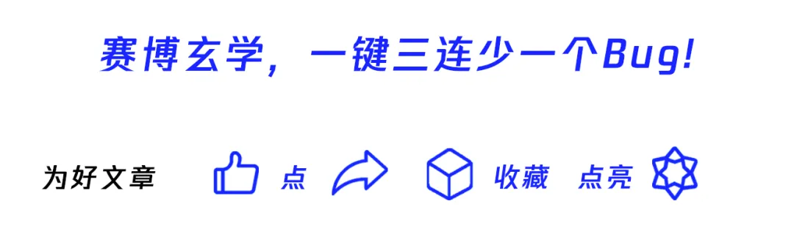

