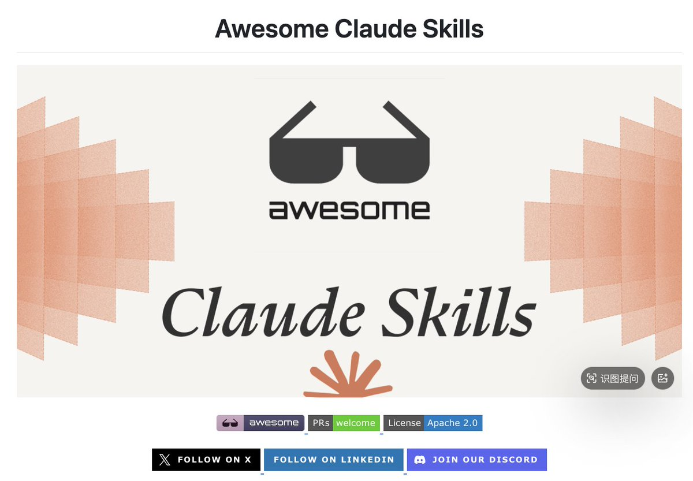

卧槽，一个新的GitHub仓库已经发布，其中包含50多个可随时定制的Claude skill，涵盖：文档处理（Word、PDF、PowerPoint）、开发工具（Playwright、AWS、Git）、数据分析、商业与营销、沟通、创意媒体、生产力、项目管理和安全。每个类别都有自己的文件夹，其中包含清晰的[SKILL.md](http://SKILL.md)文件，详细列出了提示词和逻辑。

这个好！
[github.com/ComposioHQ/awe…](https://github.com/ComposioHQ/awesome-claude-skills)

### 🖼️ Attached Media

## 💬 Replies

### 1 @i_m_m_ (黑眼圈| 美股合约首选Gate)

*Thu Dec 25 19:19:09 +0000 2025*

@AI\_Whisper\_X 太棒了！

### 2 @OiiDev (OSDev)

*Thu Dec 25 19:19:50 +0000 2025*

@AI\_Whisper\_X @readwise save thread

### 3 @dongshu02333081 (嘻嘻)

*Sun Jan 04 18:01:48 +0000 2026*

@AI\_Whisper\_X @readwise 保存

### 4 @lukiyeh (YeZhang)

*Thu Dec 25 18:19:51 +0000 2025*

@AI\_Whisper\_X [x.com/lukiyeh/status…](https://x.com/lukiyeh/status/2003503226491142591?s=46)

