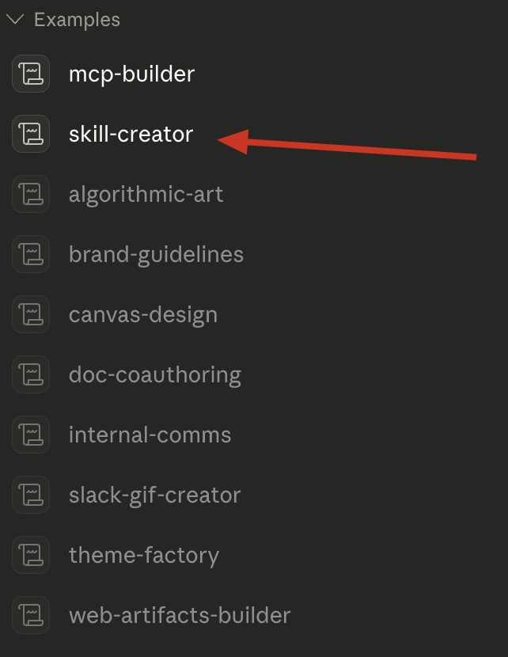
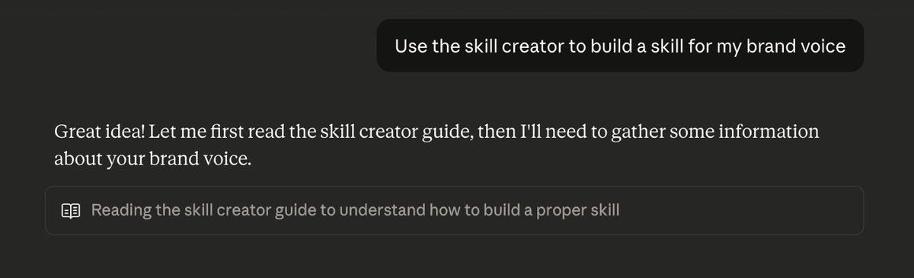
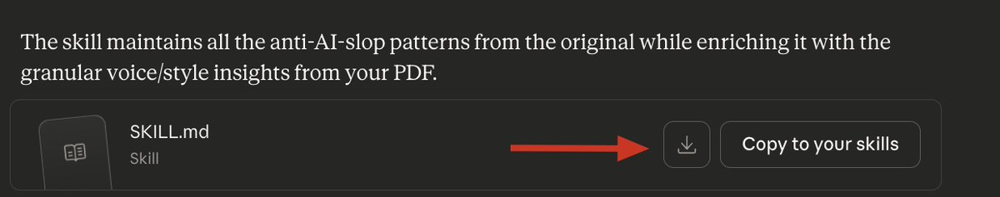
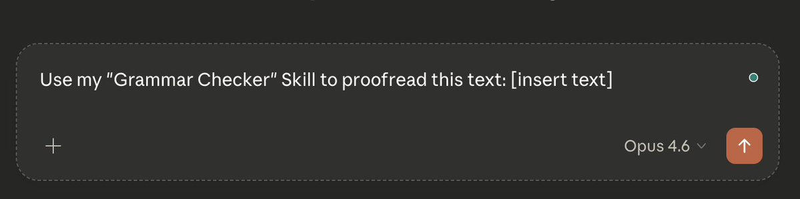
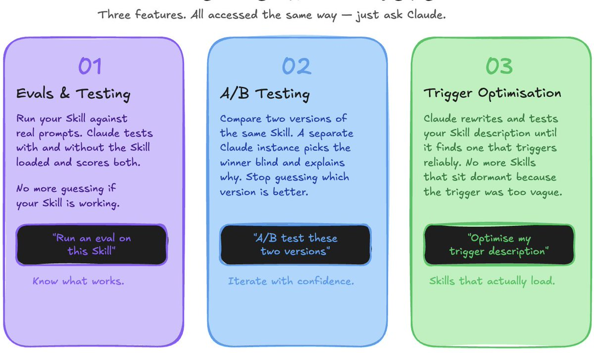
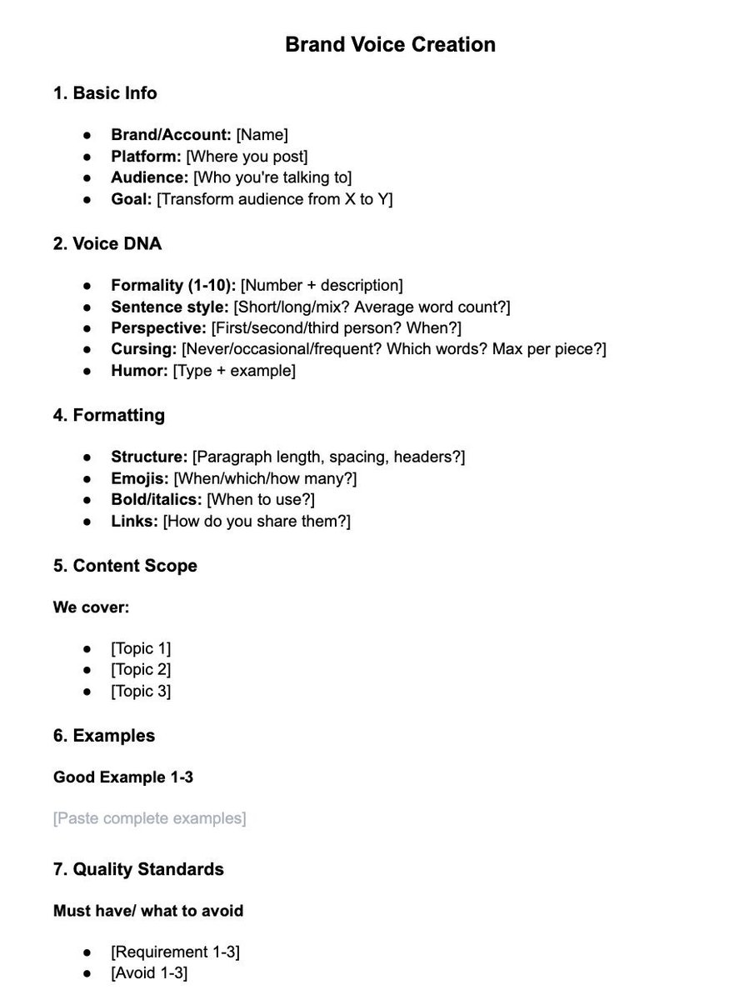
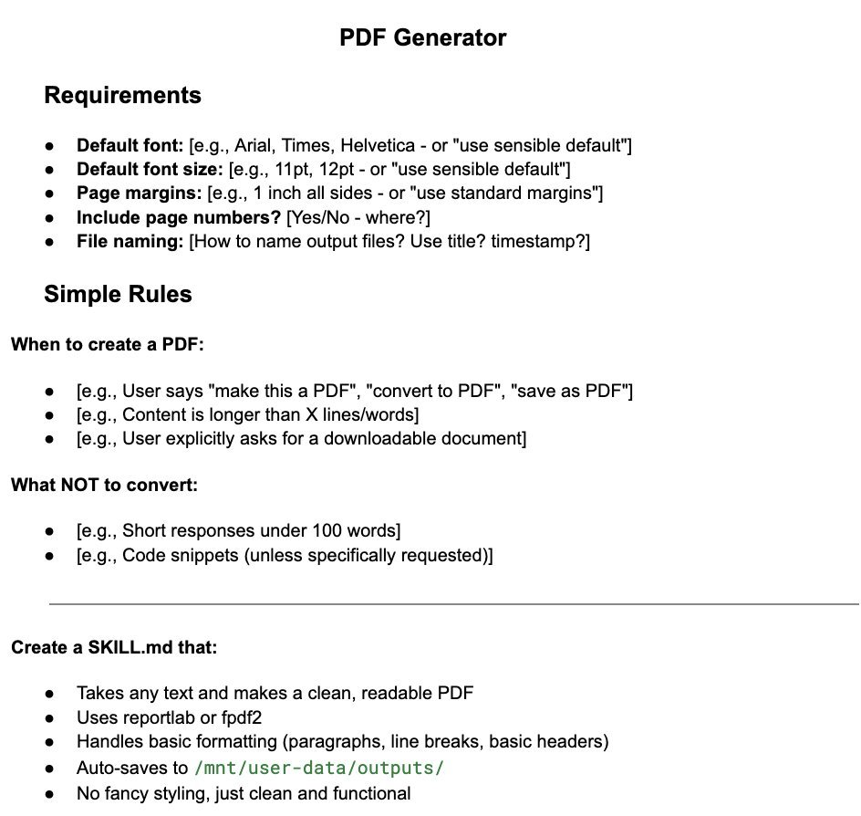
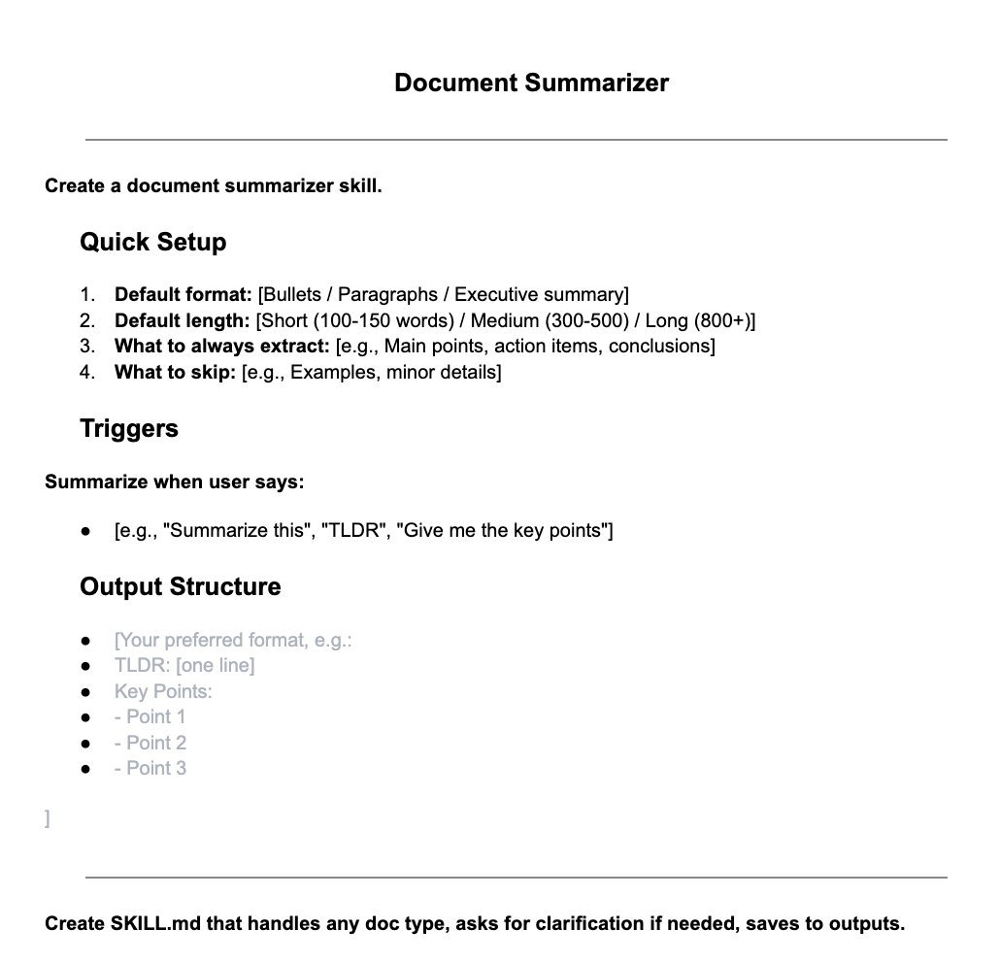
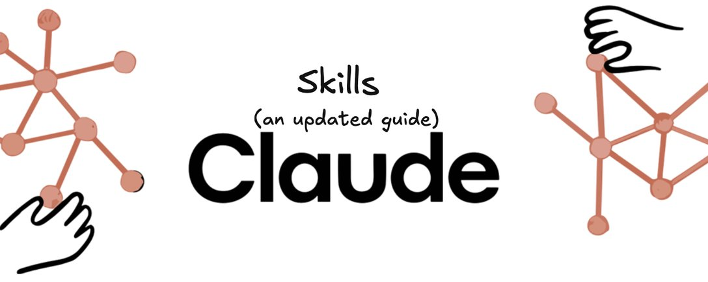

# 📰 Claude Skills: Ultimate Guide (March 2026)

I posted on 𝕏 200+ times this month. If you only implement ONE thing from all my content in March, make it this.

Claude Skills are the single biggest productivity unlock of 2026 and the best bang for your buck in the entire Claude ecosystem.

Set them up once, and they compound automatically every day you use Claude.

I've been running Skills across every major workflow in my content and business operations for the past three months. I use them every single day without exception, and I've literally mandated every department in my company to build them.

This guide covers everything: what they are, how to build them, how to optimize them, the new features that just dropped, real workflows, and more. 

The exact guide I wish I had when I first started with Claude Skills, let's go.

---

## What even are Claude Skills?

In one line: Claude Skills are pre-loaded instruction sets saved as markdown files.

In any Claude chat or project, you can call upon a Skill, and Claude will instantly follow the instructions you created. No re-explaining, no re-prompting, and no copy-pasting context every time you start a new conversation.

Think of it this way: Right now, every time you open a new Claude chat, you start from zero. Claude knows nothing about you, your voice, your standards, or how you like things done. A Skill changes that. It packages everything Claude needs to know into a reusable file you can call on whenever you need it.

A practical example: imagine a Brand Voice Skill that contains everything about your company (tone, style, audience, key messaging, examples of great copy). Instead of explaining all of that every time, you say:

"Hey Claude, use my Brand Voice Skill to write a LinkedIn post about \[X\]."

The possibilities are genuinely endless. A writing Skill, research Skill, grammar checker, an outreach template Skill. Any repeatable task where context and instructions matter is a candidate for a Skill.

---

## How to Build & Use Skills

Building a Skill takes less than 30 minutes, and you only have to do it once to create a timeless asset for your productivity. 

The process for building Skills couldn't be any easier. 

Step one: Enabling Skill-Creator 

Go to Customize → Skills and make sure you have enabled the "Skill-Creator."

This is a Skill that builds Skills (from Anthropic). 

Step Two: Prompting Claude 

Once enabled, you can tell Claude: "I want to build a Skill for \[workflow\]; help me build it." 

Here is the template prompt to build your first Skill from scratch:

\`\`\`
You are building a Claude Skill — a reusable instruction set in markdown format.

My Skill is for: \[describe the task — e.g. writing X articles, checking grammar, researching topics\]

Here is the context Claude needs to do this well:
\- My name / brand: \[name\]
\- My audience: \[who you are writing for\]
\- My tone and voice: \[how you want Claude to sound\]
\- My standards: \[what good output looks like\]
\- What to avoid: \[common mistakes, words, formats to never use\]

Using this context, write a complete SKILL.md file that:
1\. Opens with a one-line description of what the Skill does
2\. Defines the role Claude plays when this Skill is active
3\. Lists the exact rules Claude must follow
4\. Includes at least one example of a great output
5\. Ends with a quality checklist Claude runs before responding

Format it as a proper markdown file I can save and upload directly to a Claude Project.
\`\`\`

Step Three: Save Skills 

Once Claude finishes building the Skill, it will output a zip and/or markdown file. Click "Copy to Skills" to save your new Skill to your Anthropic account.

I also like to download the Skills to my laptop (in a dedicated folder), but that's optional. 

Go back to Customize → Skills → My Skills and ensure your new Skill is present and enabled. 

Step Four: Using your Skill

Now, all you have to do is prompt Claude to use your Skill: "use my \[x\] Skill for \[x\]."

Example prompt:

That's it! 

---

## How to Build Great Skills 

Anyone can build Claude Skills, but few can actually build great Skills that are actually useful.

Here are my tips (based on months of experience):

1. Reverse prompting: Tell Claude: "I want to build \[x\] Skill, ask me 10-50 questions that will help you build it." 

1. Reverse building: Tell Claude: "Based on everything you know about me, what Skills would be helpful for me?" 

1. Context: The more context you provide, the better. Dump PDFs, attach Docs - anything & everything you have.

1. Chats as context: Use your existing chats as context. (i.e., use everything from this chat and turn it into a Skill) - I did this with my "Grammar Checker" Skill, and it instantly knew everything I wanted since we chatted about it for months. 

1. Iterations: Treat Claude's first Skill output as just a rough draft. Read the entire file, write down what you want to change, and prompt Claude to make those changes. I often create 3 Skills before I get something I'm 100% satisfied with.

1. Include a real example: The single fastest way to improve a Skill's output quality is to paste in an example of exactly what great looks like. One strong example inside the Skill file is worth ten bullet points of instruction. 

1. QC: Finish every Skill with a short checklist. Three to five questions that Claude asks itself before producing output: Does this match the tone? Did I avoid the banned words? Is this the right format? 

1. Manual review: As painful as it sounds, ALWAYS manually review the Skills. Yes, it requires a few minutes of manual labor, but the result is a Skill that saves you time from now on. 

---

## Claude Skills 2.0

Anthropic shipped a significant update to the Skills framework in March.

There are three new major updates worth knowing about:

1\. Built-in Evals and Testing

Before this update, there was no reliable way to know whether your Skill was actually working. You would build one, try it a few times, decide it seemed fine, and move on. If something broke later (like after a model update), you often wouldn't find out until a deliverable came out wrong. 

Skills 2.0 fixes that. Before saving a Skill to your account, you already know what the outputs will actually look like. You write a few realistic prompts (the kind of thing you would actually ask Claude to do), and Claude runs them twice: once with your Skill loaded and once without. Both outputs get scored against assertions you define, then displayed in a viewer where you review the actual outputs and leave feedback. 

2\. A/B Testing

A/B testing allows you to compare two versions of the same Skill against identical prompts. Made a change to your Brand Voice Skill and want to know if it actually improved the output? 

Now you can run an A/B test.

3\. Trigger Optimization

A Skill that triggers at the wrong time, or never triggers, is a broken Skill regardless of how good the instructions inside it are. Skills 2.0 includes an automated process that rewrites and tests different versions of your Skill's description until it finds one that triggers reliably. This eliminates the issue of your Skill not triggering when you say "hey use \[x\] Skill..." 

To use these new features: Open a Claude chat with your Skill loaded and tell Claude what you want to do. 

Examples: "Run an eval on this Skill." "A/B test these two versions." "Optimize my trigger description." 

---

## Real Workflows & Mega Prompts 

Now that you know how to build and optimize a Skill, here are some real workflows to show you what is actually possible.

Copy these images into any LLM and ask it to generate the text to test these prompts now.

1. Brand Voice - For creating a voice/tone/writing style

2\.     PDF Generator - A Skill that turns any text into a well-formatted PDF

3\.     Document Summarizer - A simple skill to summarize any text in seconds

Other workflows to build:

- ELI5: a Skill that explains complex topics in simple terms (just paste the topic/article/text in and trigger the Skill).

- Job Application Skill: knows your CV, your experience, and how you like to position yourself. Tailors cover letters instantly.

- Learning Skill: how you best absorb information, what analogies work for you, and your current knowledge level on a topic.

- Fitness and Health Skill: your goals, restrictions, and preferences. 

---

## Tools for Skills 

Tools to help you build with Claude Skills:

1. Claude Skills Docs - Official docs by Anthropic on using Claude Skills

https://platform.claude. com/docs/en/agents-and-tools/agent-skills/overview

2\.     SkillsMSP - A marketplace with 500,000+ Claude Skills ready to download

https://skillsmp. com/

\*Some files may be malicious - only download from verified/reliable creators\*

3\.     Awesome Claude Skills - A curated list of practical Claude Skills

https://github. com/ComposioHQ/awesome-claude-skills

4\.     The Complete Guide to Claude Skills (by Anthropic)

https://resources. anthropic. com/hubfs/The-Complete-Guide-to-Building-Skill-for-Claude. pdf

---

## Outro 

Claude Skills are hands-down my favorite feature from Anthropic. My team and I are obsessed with building & deploying them - it's genuinely changed how we work. 

Remember: If you implement just one thing from all my March content, make it this. 

My advice: reverse-prompt Claude on how to build a useful Skill for you right now.

Everything I covered here comes from real hands-on use - I have been running Skills across every major workflow across my three companies for months. 

If that's the style of content you want on your feed, be sure to follow me at @aiedge\_. I am posting three articles a week covering the hottest topics in AI.

Lastly, if you can, please Like/Repost this article so others can find it 💙

### 🖼️ Attached Media

## 💬 Replies

### 1 @aiedge_ (AI Edge) (Author)

*Wed Mar 25 15:19:35 +0000 2026*

New Claude YouTube video live in 2 hours! 
[youtube.com/@AIEdgeHQ](https://www.youtube.com/@AIEdgeHQ)

### 2 @ICEBOYBILL (ICEBOY 🤑)

*Wed Mar 25 15:05:42 +0000 2026*

@aiedge\_ u guys shipping more than claude

### 3 @aiedge_ (AI Edge) (Author)

*Wed Mar 25 15:19:04 +0000 2026*

@ICEBOYBILL Hard to keep up with them lol

### 4 @nykdotdev (nyk)

*Thu Mar 26 08:42:21 +0000 2026*

@aiedge\_ Skills are compounding assets when they’re tied to real workflows, not prompt collections. 

Reuse + constraints + evals is where quality actually sticks.

[x.com/nyk\_builderz/s…](https://x.com/nyk_builderz/status/2033421668639768982)

### 5 @HarryTandy (Harry Tandy)

*Wed Mar 25 15:32:11 +0000 2026*

@aiedge\_ composition that stays clean without prompt bloat is the dream

### 6 @gagansaluja08 (Gagan | Claude + AWS)

*Wed Mar 25 23:05:29 +0000 2026*

@aiedge\_ the compounding effect is real. the skills that age best aren't generic instructions - they're the ones that encode your actual decision-making defaults. once claude knows your edge case preferences you stop re-explaining judgment calls every single session

### 7 @Mrxseek (M R X)

*Wed Mar 25 14:44:30 +0000 2026*

@aiedge\_ most people build skills wrong.

a skill isn't a long system prompt.

it's a decision tree
&gt; what to do
&gt; what to check
&gt; what to never do, in that order.

the quality checklist at the end is what separates a good skill from a great one. 

### 8 @benjamin_woods (Benji)

*Thu Mar 26 09:36:53 +0000 2026*

@aiedge\_ good prompting skills

### 9 @CireUp (CireUp)

*Wed Mar 25 15:24:00 +0000 2026*

@aiedge\_ Half the PDFs I try to upload gets rejected by Claude. No problem to upload on any other LLM.

### 10 @paulsfranz (Fpailo)

*Thu Mar 26 08:03:04 +0000 2026*

@aiedge\_ Skills degrade silently - triggers start overlapping, instructions contradict each other over time. Been working on a deterministic way to catch this statically. Launching today actually. 🫡

### 11 @maxibaumgartAI (Maximilian Baumgart)

*Thu Mar 26 01:12:41 +0000 2026*

@aiedge\_ Amazing! I will 100% be using this guide in the future. I have built one skill so far, but it hasn't been the most effective and I look forward to utilizing these techniques to create optimal workflows.

### 12 @MattJvanB (MVB)

*Fri Mar 27 05:47:13 +0000 2026*

@aiedge\_ -You don't need to build Skills for "About Me," "My Voice," or "Working Rules." Store these as Context files or Global Instructions instead.

-You don't have to tell Claude to use Skills, explicitly. Use specific naming conventions, and Claude will infer which to use for a task.

### 13 @gopimr23 (Gopi)

*Wed Mar 25 19:22:32 +0000 2026*

@aiedge\_ Nice

### 14 @Winnie202508 (Winnie Liou)

*Wed Apr 01 03:45:17 +0000 2026*

@aiedge\_ @grok fact check

