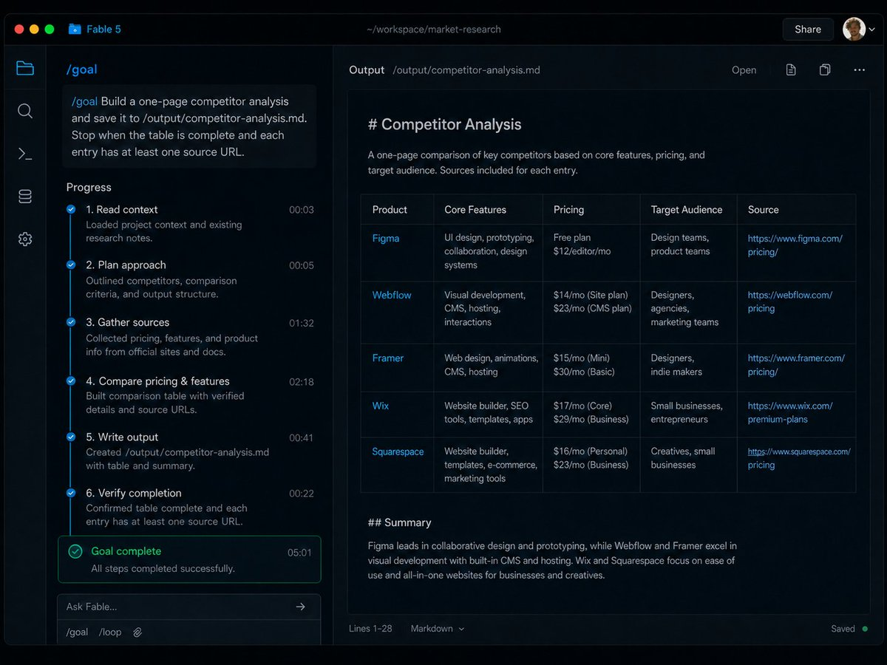
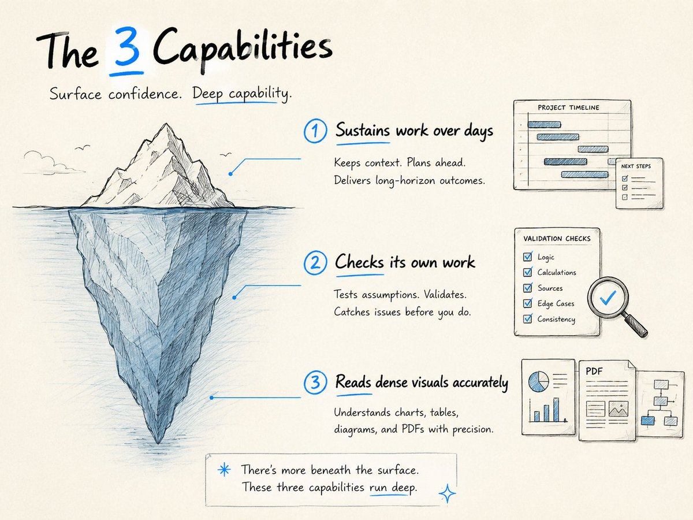
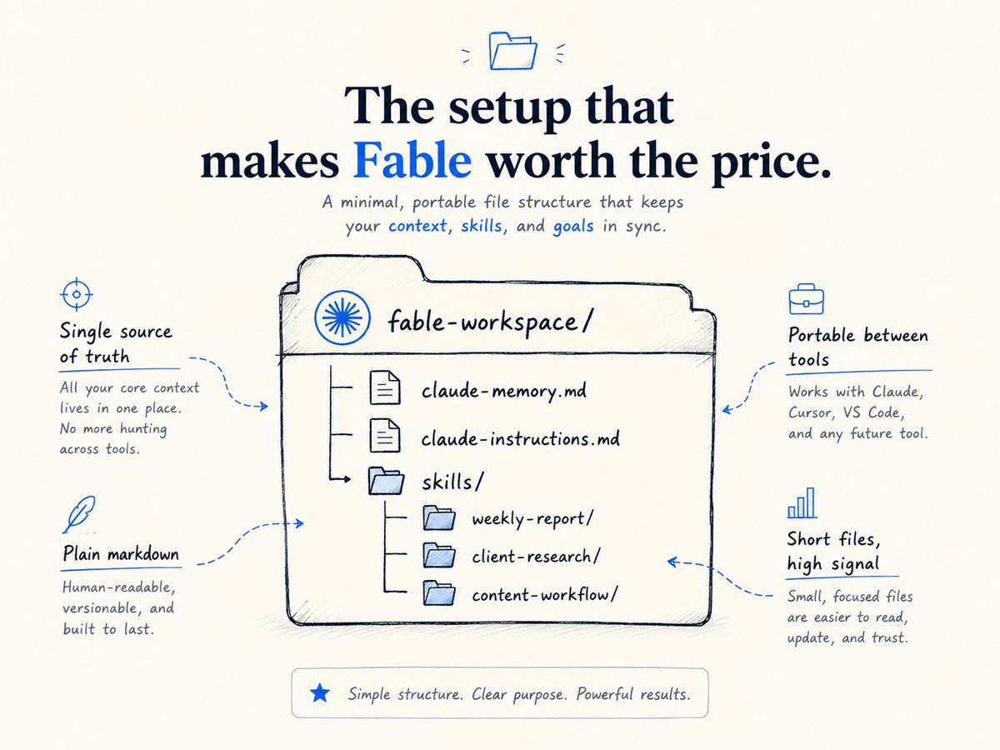
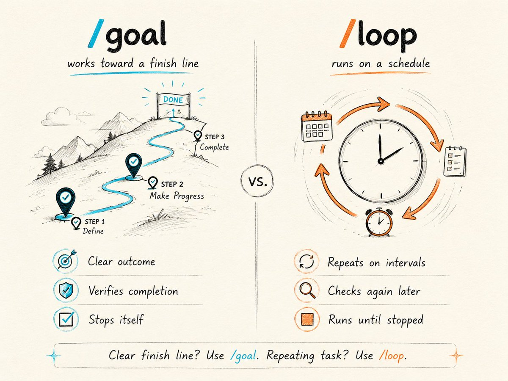
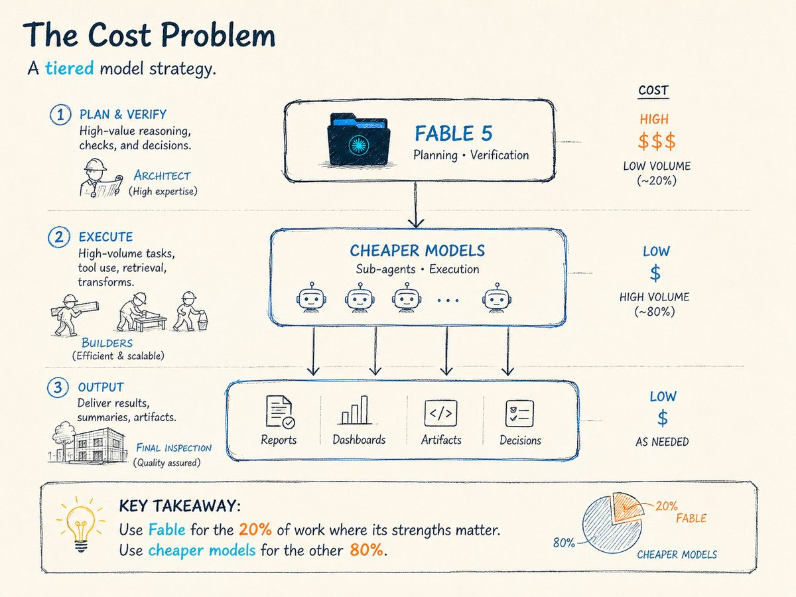
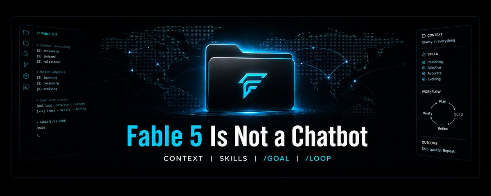

# 📰 Fable 5 Is Wasted Without This Setup

TL;DR: Fable 5 is the most capable AI model you can actually use right now.

But most people are talking to it the same way they talk to regular Claude, which wastes the thing that makes it worth paying for.

I spent 3 weeks testing what actually makes it useful, where it burns money, and which setup mistakes quietly ruin it.

This is the playbook I wish I had on day one.

What's inside:

→ What Fable 5 actually is (60-second version, no hype)
→ The 3 capabilities that separate it from every other Claude model
→ The exact file setup that makes Fable run like an employee, not a chatbot
→ /goal and /loop: the two commands that let Fable work while you sleep
→ How to cut your token costs by 60-80% without losing quality
→ Skills: how to teach Fable your specific workflows once and reuse them forever
→ 7 mistakes I made in my first week (so you don't)

## What Fable 5 Actually Is

I'll keep this short because most Fable coverage buries the practical stuff under paragraphs of hype.

Fable 5 is Anthropic's Mythos-class model, made safe for public use.

"Mythos-class" means it's built from the same architecture as Claude Mythos, which Anthropic originally said was too powerful to release publicly.

They added safety classifiers that route high-risk queries (cybersecurity, biology, chemistry) to Opus 4.8 instead.

This happens in less than 5% of sessions, so for daily work, you're running the full model almost all the time.

The specs that matter for practical use:

→ 1 million token context window (roughly 750,000 words in one session)
→ Up to 128,000 output tokens per request
→ $10 per million input tokens, $50 per million output tokens
→ Available on Pro ($20/mo), Max ($100/mo), Team, and Enterprise plans
→ Works across [Claude.ai](http://claude.ai/), Claude Code, Claude Desktop, and the API

The pricing is 2x what Opus 4.8 costs. That's real money if you're running it all day. I'll cover how to manage that later.

One thing to know upfront: Fable 5 requires 30-day data retention for safety monitoring.

If your work involves anything you can't have stored for 30 days, plan around that.

## The 3 Capabilities That Actually Matter

A lot of the coverage focuses on benchmark scores.

I don't care about benchmarks. I care about what changes in my daily work.

After 3 weeks, three things stand out.

1\. It sustains work over days, not minutes.

Every Claude model before Fable worked in short bursts. You'd prompt, get a response, prompt again.

Fable 5 is built for extended autonomous sessions. Inside Claude Code, you can hand it a multi-day project and it will plan across stages, delegate to sub-agents, and keep working until the job meets your success criteria.

This is the single biggest difference.

Fable doesn't need you babysitting every step. 

It's built to work like a contractor you check in on at the end of the day, not an assistant that needs your approval every 30 seconds.

2\. It checks its own work.

This is the one that surprised me most. When Fable finishes a task, it doesn't just hand you the output. 

It writes its own tests, runs them, catches its own mistakes, and fixes them before telling you it's done.

In coding tasks, I've seen it catch edge cases on the first pass that would have taken me two rounds of back-and-forth with Opus.

Rakuten said it well: "At the highest effort, Fable reflects on and validates its own work.

For us, that's what makes highly autonomous operations possible."

3\. It reads dense visuals with real accuracy.

Fable's vision is noticeably better than previous models on charts, tables nested in PDFs, technical diagrams, and screenshots.

I've tested it with financial reports, architecture diagrams, and dense data tables.

Where Opus 4.8 would occasionally misread a column or confuse axis labels, Fable gets them right consistently.

Practical uses I've found: extracting data from chart images in research PDFs, reviewing UI screenshots and getting specific design feedback, and feeding it dashboard screenshots to reverse-engineer the underlying logic.

## The File Setup That Makes Fable Worth the Price

This is the section most guides skip, and it's the one that matters most.

Fable 5 doesn't remember you between sessions.

It doesn't know your business, your writing style, your clients, or your preferences unless you tell it. Every session starts from zero.

The fix is a local context system. It takes about 20 minutes to set up, and it's the difference between Fable being a powerful stranger and Fable being a powerful colleague who knows your world.

Step 1: Create a context folder.

Make a folder on your machine. Call it something like /claude-context or /fable-workspace.

This becomes the single source of truth that Fable reads at the start of every session.

What goes in it:

→ A one-page summary of your business, role, and current priorities
→ SOPs for any task you do repeatedly (content workflows, reporting, client work)
→ Key information about ongoing projects, clients, or products
→ Any strategic docs you reference regularly (launch plans, brand guides, pricing)
→ A running decision log (what you decided, why, and what happened)

Keep each file short. Fable reads everything in the folder, so bloated files eat into your context window.

One page per topic. Plain markdown.

Step 2: Create a memory file.

Inside your context folder, create a file called claude-memory.md.

This is where Fable stores and updates what it learns about you over time.

Add this instruction to your setup:

\`\`\`
Every time I share major context about my business, preferences, or situation, update claude-memory.md with the key details. 
Keep entries concise. 
Date-stamp each update.
\`\`\`

Now it becomes self-updating. When you mention a new client, a strategy shift, or a lesson learned, Fable writes it to the memory file automatically. 

Next session, it already knows.

Step 3: Create an instructions file.

Create claude-instructions.md. This is your standing brief. 

It tells Fable how to behave in every session, regardless of the task.

A practical starting template:

\`\`\`
\## Standing Instructions 

1\. Always read and reference claude-memory.md before starting work. 
2\. Reference past decisions before making new recommendations.
3\. When I ask for strategy, assume you know everything in this folder.
4\. Format outputs in markdown unless I specify otherwise.
5\. When you update memory, keep entries under 3 sentences.
6\. If you're unsure about something, ask. Don't guess.
7\. When a task is done, summarize what you did and flag anything that needs my review.
\`\`\`

Step 4: Connect it.

In Claude Code, point to your context folder using the /add command or reference it in your CLAUDE.md file.

Once connected, every session starts with Fable already knowing your world.

This setup is portable. The files are plain markdown on your machine. You own them.

If you switch to a different AI tool tomorrow, the context travels with you.

## Two Commands That Let Fable Work Without You

If you're using Fable 5 inside Claude Code, these two commands are the reason the model exists.

Without them, you're paying 2x Opus pricing for a chatbot.

With them, you're paying for an autonomous worker.

The /goal command

/goal tells Fable what "done" looks like. It works toward that finish line and stops itself when it gets there.

A second, smaller model reads the conversation after each step and decides: are we there yet?

If not, Fable takes another turn. If yes, it stops.

This is the core shift. You define the outcome. Fable handles the iteration.

Good /goal examples:

\`\`\`
/goal All unit tests in /tests/ pass. 
Only modify files in /src. 
Do not change configuration files. 
If any test fails after3 fix attempts, stop and report the failure.
\`\`\`

\`\`\`
/goal Research the top 5 competitors in \[industry\] and produce a one-page comparison table covering pricing, key features, and target audience. 
Save to /output/competitor-analysis.md.
Stop when the table is complete and each entry has at least one source URL.
\`\`\`

\`\`\`
/goal Refactor the authentication middleware to use the sharedTokenService class. 
All existing tests must still pass after the refactor. 
If a test breaks, fix the test or revert the change.
\`\`\`

The rule that makes /goal work: Be specific about what "done" looks like, and always include a failure path.

"Improve the code" is a bad goal because Fable can't verify it. "All tests pass" is a good goal because it can.

The /loop command

/loop runs Fable on intervals. Instead of working toward a single finish line, it runs a task on a schedule until you stop it.

Good /loop examples:

\`\`\`
/loop Every 30 minutes, check the error logs in /logs/and flag any new errors with severity "critical" or higher.
Summarize each one in plain English.
\`\`\`

\`\`\`
/loop Every hour, scan inbox for emails from \[client domain\].
Summarize any new ones and draft a reply if action is needed.
Save drafts to /drafts/.
\`\`\`

When to use which:

→ The task has a clear finish line? Use /goal.
→ The task repeats on a schedule? Use /loop.
→ The task repeats until a condition is met? Combine both.

A real caution: Always set cost controls before you walk away from a long-running task. An uncapped /goal on a hard problem can burn through tokens fast. Monitor the first cycle, confirm it's working correctly, then let it run.

## The Cost Problem (and How I Solve It)

At $10/$50 per million tokens, Fable 5 is not cheap. If you run it all day for every task, you'll burn through a Max plan's usage cap fast.

The approach that's worked for me: use Fable for the 20% of work where its strengths matter, and use cheaper models for the other 80%.

Where Fable earns its cost:

→ Planning complex projects (it thinks through stages better than any other model)
→ Reviewing and verifying completed work (its self-checking is genuinely better)
→ Long-context tasks where you need it to hold 100+ pages in memory accurately
→ Vision tasks on dense documents (charts, tables, technical diagrams)
→ Multi-day autonomous coding sessions via /goal

Where cheaper models work fine:

→ Drafting emails, messages, and short-form copy
→ Simple data formatting and transformation
→ Answering straightforward questions
→ Routine code changes that don't need deep reasoning

In Claude Code, Fable can spin up sub-agents that run on cheaper models.

So you can plan the project on Fable, delegate the execution to Sonnet or Haiku sub-agents, then switch back to Fable for final verification.

Think of it as hiring a senior architect to design the house, junior builders to do the framing, and the architect again for final inspection.

You don't pay architect rates for every hammer swing.

## Skills: Teach Fable How You Work (Once)

A skill is a reusable instruction set that Fable pulls into the conversation only when it's relevant.

Instead of re-explaining your workflows, standards, or preferences every session, you encode them once, and Fable applies them automatically.

Every skill is a folder with one file: SKILL.md. That file has a short description (so Fable knows when to load it) and instructions (so it knows what to do).

Here's a real example. Say you write weekly reports in a specific format:

\`\`\`
\~/.claude/skills/weekly-report/SKILL.md
\`\`\`

\`\`\`yaml
---name: weekly-reportdescription: Use this skill when the user asks for a weekly report,  status update, or weekly summary.---## Weekly Report FormatWhen writing a weekly report,follow this structure:1. Start with a 3-sentence executive summary2. List completed items with dates3. List blockers with proposed solutions4. List next week's priorities ranked by impact5. Keep total length under 500 words6. Use bullet points, not paragraphs7. End with one specific decision that needs input
\`\`\`

Now every time you say "write my weekly report," Fable loads this skill automatically and formats it the way you want. No re-explaining.

## Three fast ways to build skills:

1\. From a past chat. Open a Claude conversation where you did good work.

Ask Claude to analyze the chat, extract your patterns and preferences, and generate a [SKILL.md](http://skill.md/) file. This takes about 2 minutes.

2\. From scratch with the Skill Creator. In Claude Code, run the skill creator. It walks you through an interactive Q&A and generates the complete skill folder for you.

Useful when you know what you want but don't want to write the YAML yourself.

3\. From reference data. This is the high-value move. Feed Fable examples of work you like (other people's reports, tweets, code patterns, design specs), tell it to extract the patterns, and build a skill that replicates those patterns.

Every time you give feedback on the output, the skill gets sharper.

Why skills matter more on Fable: Because Fable actively looks for ways to improve its own work, it doesn't just follow a skill.

It pressure-tests the output against the skill's criteria and self-corrects. On previous models, a skill was a template. On Fable, a skill is a quality standard.

One important detail: Skills live on your machine, not inside Claude's memory. You own them.

You can copy them to another tool, share them with a teammate, or version-control them in Git. They're plain text files in a folder.

## 7 Mistakes I Made in My First Week

These are specific. Each one cost me time or tokens. Each one is fixable.

Mistake 1: Treating Fable like a chatbot.

I spent the first two days prompting Fable the same way I prompt Opus. Quick back-and-forth, one question at a time. That works fine, but it's paying premium pricing for standard behavior.

The fix: Use Fable for autonomous, multi-step work via /goal and /loop. For quick questions, switch to Sonnet or Opus. Match the model to the task complexity.

Mistake 2: Writing vague goals.

My first /goal was something like: "Improve the test coverage for this project." Fable ran for 20 minutes, wrote a bunch of tests, but half of them were for edge cases I didn't care about.

The fix: Be specific about scope and "done." Instead of "improve test coverage," write "all functions in /src/auth/ have at least one unit test, and all tests pass." Include file boundaries and a failure path.

Mistake 3: Not watching the first loop cycle.

I set a /loop command, walked away, and came back to find Fable had run 14 cycles on something that was broken from the start. Wasted tokens, wasted time.

The fix: Always monitor the first full cycle. Confirm the output is correct, the scope is right, and the cost per cycle is what you expected. Then let it run.

Mistake 4: Putting everything in [CLAUDE.md](http://claude.md/).

I crammed my entire business context, all my preferences, and every workflow into one [CLAUDE.md](http://claude.md/) file. It was over 3,000 words. The result: Fable loaded all of it into every session, even when 90% was irrelevant.

The fix: Use [CLAUDE.md](http://claude.md/) for universal, always-on rules only (coding conventions, formatting preferences, things that apply to every task).

Move task-specific workflows into Skills, which load only when relevant. This keeps your context window lean.

Mistake 5: Ignoring the safety classifiers.

I ran a security-related query and got a response from Opus 4.8 instead of Fable. I didn't understand why until I read the docs. Fable routes certain topics (cybersecurity, biology, chemistry, distillation) through safety classifiers that fall back to Opus 4.8.

The fix: Know which topics trigger the fallback. If you're doing legitimate work in those areas and getting Opus responses, that's by design. You won't be charged Fable prices for the rerouted response. Plan your workflow around it.

Mistake 6: Not setting a failure path in /goal.

I gave Fable a goal without telling it what to do if it got stuck. It looped for 40+ minutes trying to fix a test that required information it didn't have.

The fix: Every /goal should include an exit condition for failure. "If the test still fails after 3 attempts, stop, revert changes, and report the failure." This prevents runaway loops.

Mistake 7: Skipping the memory file.

For the first week, I started every session by re-explaining my business context. That's 5-10 minutes of wasted context (and tokens) every single time.

The fix: Set up the memory file on day one. It takes 10 minutes. It saves you hours over the first month.

## The Quick-Start Checklist

If you want to get running with Fable 5 today, do these 5 things in order:

1. Create a /claude-context folder with your business summary, current priorities, and 1-2 SOPs for your most common tasks. Keep each file under one page.

1. Create claude-memory.md and claude-instructions.md using the templates above. Point Claude Code at the folder.

1. Build one skill for your most repeated workflow. Start with the Skill Creator if you've never made one.

1. Run your first /goal on a small, well-scoped task (not your most important project). Watch the full cycle. Confirm it works before scaling up.

1. Set up cost controls. Know your token budget for the week. Use Fable for high-value work and cheaper models for routine tasks.

That's the setup. Everything else is optimization.

## What's Next

I'm going to keep testing Fable 5 and sharing what I learn. There's a lot I haven't covered here: sub-agent management, advanced loop patterns, vision workflows for specific use cases, and how the model handles multi-day coding sessions.

If this was useful, save it for reference. I'll update it as things change.

Follow @free\_ai\_guides for the updates [❤️](https://abs.twimg.com/emoji/v2/svg/2764.svg)

### 🖼️ Attached Media

## 💬 Replies

### 1 @alex_prompter (Alex Prompter)

*Fri Jul 03 14:29:04 +0000 2026*

@free\_ai\_guides nice

### 2 @Blum_OG (Blum)

*Sat Jul 04 17:55:09 +0000 2026*

@free\_ai\_guides great piece. glad i stumbled onto this

### 3 @free_ai_guides (AI Guides) (Author)

*Sat Jul 04 18:19:06 +0000 2026*

@Blum\_OG Thanks

### 4 @katie_from_gop (Katie Paterson)

*Fri Jul 03 14:35:01 +0000 2026*

@free\_ai\_guides Very helpful!

### 5 @free_ai_guides (AI Guides) (Author)

*Fri Jul 03 18:16:35 +0000 2026*

@katie\_from\_gop thanks!

### 6 @MikeSimmonsWIMS (Mike Simmons)

*Tue Jul 07 11:19:45 +0000 2026*

@free\_ai\_guides This is absolutely brilliant, thank you!

### 7 @free_ai_guides (AI Guides) (Author)

*Tue Jul 07 11:21:35 +0000 2026*

@MikeSimmonsWIMS my pleasure

### 8 @MoezZhioua (Moez Zhioua)

*Fri Jul 03 15:45:17 +0000 2026*

@free\_ai\_guides Memory folder wins. Turning Fable into a colleague instead of a chatbot saves hours and tokens.  

Use /goal for high‑value work and cheap models for the busy‑work

### 9 @free_ai_guides (AI Guides) (Author)

*Fri Jul 03 18:16:48 +0000 2026*

@MoezZhioua 100%

### 10 @alex_verem (Alex Veremeyenko)

*Fri Jul 03 14:30:16 +0000 2026*

@free\_ai\_guides Fable for the hard thinking, cheaper models for the busywork. That’s it.

### 11 @itsthedonhashim (Hussain Hashim | Building SundayBack)

*Fri Jul 03 15:35:32 +0000 2026*

@free\_ai\_guides @free\_ai\_guides didn't even know there was a diff way to talk to these models. definitely been doing it wrong lol

### 12 @Ribbon_Hero (Ribbon hero)

*Sat Jul 04 03:47:46 +0000 2026*

@free\_ai\_guides “What Fable 5 Actually Is” -&gt; bro would describe a car without even tell you it’s a vehicle

### 13 @StuyBoyNY (StuyBoy From NYC)

*Mon Jul 06 04:08:00 +0000 2026*

@free\_ai\_guides @readwise save

### 14 @DomenicMaiani (Domenic Maiani)

*Sun Jul 05 19:59:50 +0000 2026*

@free\_ai\_guides Great read.

