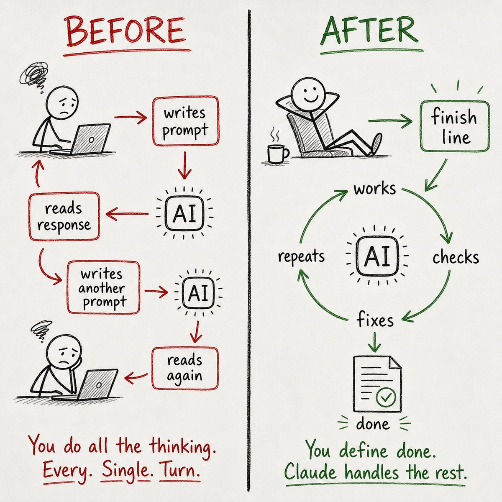
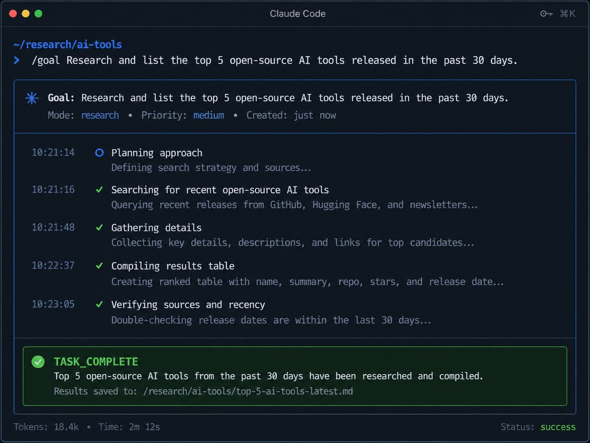
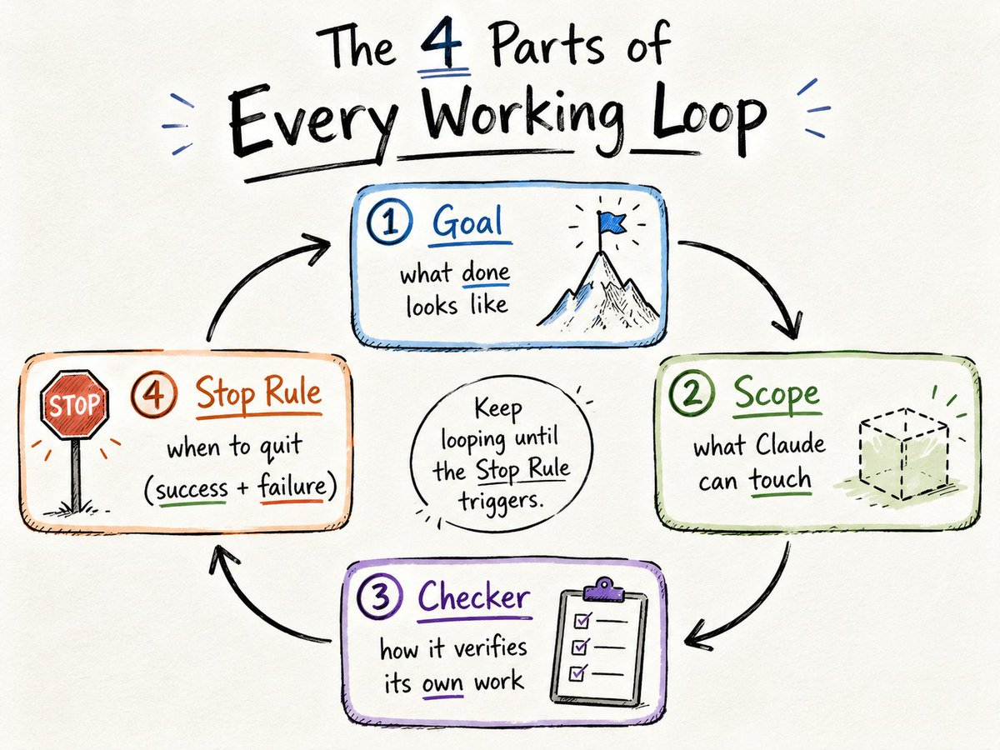
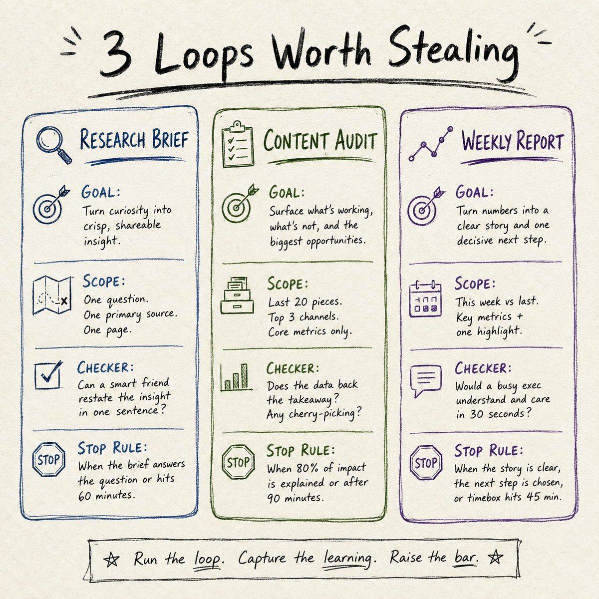
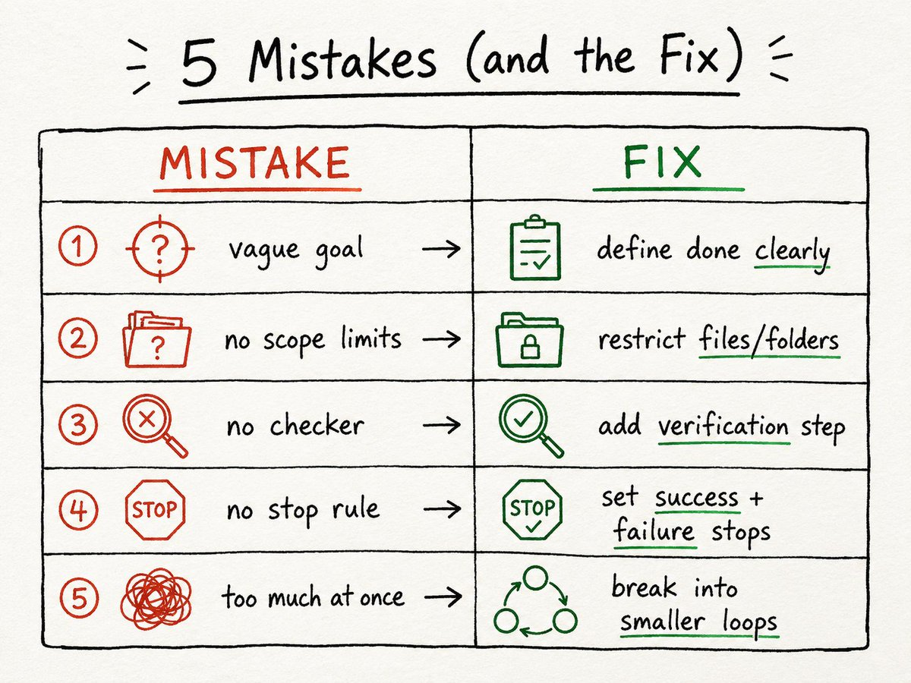
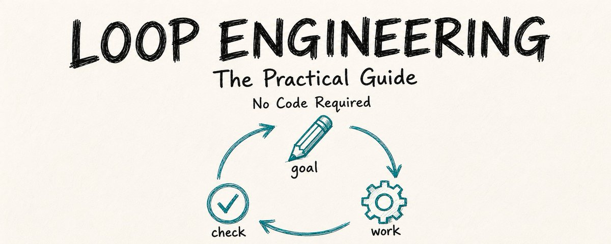

# 📰 Loop Engineering In 5 Minutes. No Code Required

One command. Two hours of autonomous work. A finished brief waiting when I got back.

That was my first Claude loop.

I haven't prompted AI the old way since.

You stop writing instructions. You start writing finish lines. Claude handles everything in between.

This guide: the full setup, 3 copy-paste loops, and every mistake I made in week one.

No code required.

What's inside:

→ What loop engineering actually means (the 30-second version)
→ Your first /goal command in 5 minutes, step by step
→ The 4 parts every working loop needs
→ 3 ready-to-use loops for research, content, and weekly reports
→ 5 mistakes that wasted my time and tokens (with the fix for each)
→ When loops don't work, and what to do instead

## What Changed

For the past two years, AI prompting has worked like this:

You write a prompt. Claude responds. You read the response, decide what's missing, write another prompt. Claude responds again.

You iterate until the output is good enough or you run out of patience.

Loop engineering flips that.

You write a finish line. 

Claude works toward it on its own, checking and correcting along the way. 

When the work meets your criteria, it stops and hands you the result. 

No back-and-forth. No babysitting.

Boris Cherny, who built Claude Code, put it simply: he doesn't prompt Claude anymore.

He has loops running that prompt Claude. His job is just to write loops.

That sounds technical. It isn't. The entire concept boils down to one mental shift:

Stop writing instructions. Start writing conditions.

A prompt says "do this." A loop condition says "keep working until this is true." 

That's the whole difference.

## Your First /goal in 5 Minutes

The fastest way to understand loops is to run one. 

Here's a real example you can try right now in Claude Code.

Step 1: Open Claude Code. You need a Pro ($20/mo) or Max ($100/mo) plan.

Step 2: Copy and paste this:

\`\`\`
/goal Research the top 5 open-source AI tools released in the
past 30 days. 
For each tool, find: name, what it does in one sentence, GitHub star count, and one specific use case.

Save the results to /research/ai-tools-june.md as a clean table.

Stop when all 5 entries are complete with sources.
If you can't find reliable information for a tool after 3 attempts, skip it and note why.
\`\`\`

Step 3: Watch the first cycle. Claude will plan its approach, start searching, compile findings, and self-check against your criteria. 

When all 5 entries are complete and sourced, it stops.

That's it. You just ran your first loop.

The key thing to notice: you didn't tell Claude how to research. 

You told it what "done" looks like.

Claude figured out the approach, the sequence, and the verification on its own.

## The 4 Parts of Every Working Loop

Every good loop has four elements. Miss one and the loop either produces bad output or runs forever. 

I learned this the hard way (more on that in the mistakes section).

1\. The Goal (what "done" looks like)

This is the verifiable end state. Not "research AI tools" but "a table with 5 entries, each with name, description, star count, use case, and source link." 

The more specific your definition of "done," the better the output.

The test: could a stranger look at the output and confirm it meets the goal without asking you questions? 

If yes, your goal is specific enough.

2\. The Scope (what Claude can touch)

Tell Claude exactly which files, folders, or areas it's allowed to work in. 

Without scope limits, a loop might edit files you didn't intend or wander into unrelated territory.

\`\`\`
Only modify files in /research/
Do not create files outside this directory.
Do not change any existing files unless specified.
\`\`\`

This takes 10 seconds to add and prevents the most common runaway behavior.

3\. The Checker (how it verifies its own work)

This is what separates a good loop from a coin flip. 

The checker is a verification step where Claude (or a separate smaller model) reviews the work and decides: does this meet the goal?

You can build the checker into your goal:

\`\`\`
After completing the draft, verify that every claim has a source URL.
Flag any entry missing a source.
\`\`\`

Or you can use the /goal command, which automatically runs a separate fast model as a grader after every turn. 

That grader asks one question: "Is the goal met?" If no, Claude keeps working. If yes, it stops.

4\. The Stop Rule (when to quit)

Every loop needs two stop conditions. 

One for success (goal met, task complete). 

One for failure (too many retries, budget exceeded, no progress after N attempts).

Without a failure stop, Claude will keep trying forever. 

I've watched a loop run for 40 minutes on a problem it couldn't solve because I forgot to add a retry limit. 

Tokens don't refund themselves.

\`\`\`
Stop when all sections are complete and verified.
If the same search returns no new information 3 times in a row, stop and report what's missing.
Maximum 15 iterations.
\`\`\`

That's the complete anatomy. Goal, scope, checker, stop rule. Everything else, memory files, skills, sub-agents, is useful but optional. Get these four right first.

## 3 Loops Worth Stealing

These are real loops I've run in the past three weeks. 

Each one is copy-paste ready. Customize the bracketed parts for your situation.

Loop 1: The Research Brief

I use this when I need to understand a new AI tool or topic well enough to write about it. 

Previously took 2-3 hours of manual reading and note-taking. 

Now takes about 90 minutes of Claude working autonomously.

\`\`\`
/goal Research \[TOPIC\] and produce a comprehensive brief
saved to /research/\[topic\]-brief.md.

The brief must include:
\- A 3-sentence plain-English summary
\- Key capabilities (with specific examples, not vague claims)
\- Pricing or access details
\- 3 practical use cases for non-technical users
\- Limitations or drawbacks (be honest, no marketing language)
\- Sources for every major claim

Only create files in /research/.
Stop when all 6 sections are complete and every claim has a source.
If you can't verify a claim after 3 attempts, flag it as unverified.
Maximum 20 iterations.
\`\`\`

Loop 2: The Content Audit

I run this on my own content to find gaps and patterns. It reads through a folder of draft files and produces a structured audit. 

Used to be a manual spreadsheet task.

\`\`\`
/goal Audit all markdown files in /content/drafts/.

For each file, extract:
\- Title
\- Main topic
\- Target audience (beginner / intermediate / advanced)
\- Whether it includes a practical example (yes/no)
\- Whether it includes a copy-paste prompt or template (yes/no)

Save the audit as a table in /content/audit-results.md.

After the table, add a "Gaps" section listing:
\- Topics with no beginner-level content
\- Posts that have no practical example
\- Any topic covered more than twice

Only read from /content/drafts/. Only write to /content/audit-results.md.
Stop when every file has been processed and the gaps section is complete.
\`\`\`

Loop 3: The Weekly Report

This one runs on a schedule using /loop instead of /goal. 

Every Monday morning, it pulls from my notes folder and produces a status update.

\`\`\`
/loop Every Monday at 9 AM,

read all files updated in the past 7 days in /notes/,

produce a weekly summary saved to /reports/weekly-\[date\].md with:
\- What got done (list of completed items with dates)
\- What's still open (items mentioned but not marked complete)
\- Decisions made (any file containing "decided" or "decision")
\- Top 3 priorities for this week (based on frequency of mention)

Keep the report under 500 words.
Only read from /notes/. Only write to /reports/.
Stop after producing the report.
\`\`\`

Each of these took me about 5 minutes to set up. 

The combined time savings over 3 weeks: roughly 8-10 hours of manual work I didn't have to do.

## 5 Mistakes That Wasted My Time and Tokens

Every one of these cost me either wasted output, wasted tokens, or both. 

Each one is fixable in under a minute.

Mistake 1: No failure stop.

My first loop had a clear success condition ("all tests pass") but no failure path. 

Claude hit a problem it couldn't solve and looped for 40+ minutes trying different approaches.

By the time I noticed, it had burned through tokens on a task that needed human input, not more AI iterations.

Fix: Every /goal gets two stop conditions. One for success, one for failure. 

"If this fails after 3 attempts, stop and tell me what went wrong." Add it before you hit enter. Every time.

Mistake 2: Scope too wide.

I ran a content research loop without specifying which folders to use. 

Claude created 11 files across 4 directories I didn't expect. Some of them overwrote notes I'd written manually.

Fix: Always include "only modify files in \[specific folder\]" and "do not change existing files unless specified." Two lines that prevent real damage.

Mistake 3: Vague goal.

"Research competitors and write a summary" is a bad goal. 

Claude doesn't know which competitors, what kind of summary, how long, or what counts as complete.

The output was three paragraphs of generic overview that I couldn't use.

Fix: Replace vague goals with specific ones. "Research the top 5 competitors in \[specific market\] by \[specific criteria\]. For each, include pricing, main features, and one weakness. Save as a table with sources. Stop when all 5 rows are complete." 

The more specific the finish line, the better the output.

Mistake 4: Not watching the first cycle.

I got overconfident after my first few successful loops and started launching them without monitoring.

One loop misunderstood my intent in the first iteration and spent 12 more iterations building on a wrong foundation.

Fix: Always watch the first full cycle. Confirm the approach is right, the output format matches what you expected, and the scope is being respected. 

After the first cycle checks out, let it run.

Mistake 5: Using loops for simple tasks.

I tried using /goal for a task that needed one prompt: "summarize this document." The overhead of goal-checking and verification made it slower than just prompting directly.

Loops add value when the task has multiple steps, needs iteration, or runs long enough to benefit from autonomous checking.

Fix: Use /goal for multi-step work that benefits from self-checking. Use regular prompts for anything you can specify and verify in one turn. 

Not every task needs a loop.

## When Loops Don't Work

I'd be lying if I said loops work for everything. They don't. Here's where I've gone back to regular prompting:

→ Quick questions. "What does this error mean?" doesn't need a goal and a checker. Just ask.

→ Creative work. Writing, brainstorming, exploring ideas. These need your judgment at every step. A loop can't verify whether a creative direction is good.

→ Tasks where "done" is subjective. "Make this better" isn't a verifiable goal. If you can't define the finish line precisely, a loop will either undershoot or loop forever.

→ Anything that needs real-time judgment calls. If the task requires decisions you haven't thought through yet, stay in the conversation. Use the loop for execution after you've made the decisions.

The honest assessment after 3 weeks: loops handle about 30-40% of my Claude usage now. 

The other 60-70% is still regular prompting, and that's fine. 

The value isn't in looping everything. It's in recognizing which tasks are loop-shaped and setting them up correctly.

## The Quick-Start Version

If you're ready to try this today:

1. Open Claude Code.

1. Pick a real task from your week that has a clear "done" state. Research, analysis, data organization, report generation, file cleanup, anything with a finish line you can describe.

1. Write a /goal with four elements: the goal (what done looks like), the scope (which files or folders), the checker (how to verify), and the stop rule (when to quit if stuck).

1. Watch the first cycle. Confirm it's heading the right direction.

1. Let it run.

That's the whole system. Everything else is refinement.

Save this for the first time you set up a loop. I'll keep updating it as these tools change.

Follow @free\_ai\_guides for more like this [❤️](https://abs.twimg.com/emoji/v2/svg/2764.svg)

### 🖼️ Attached Media

## 💬 Replies

### 1 @gerardsans (Gerard Sans | Axiom 🇬🇧)

*Sun Jul 12 17:01:17 +0000 2026*

@free\_ai\_guides solid work

### 2 @sir4K_zen (Mykhailo Sorochuk)

*Sat Jul 04 15:57:32 +0000 2026*

@free\_ai\_guides the finish line idea is a game changer, cuts the babysitting completely

### 3 @katie_from_gop (Katie Paterson)

*Sat Jul 04 13:03:45 +0000 2026*

@free\_ai\_guides The goal needs a finish line, not vibes.

### 4 @LimestoneHQ (Limestone Digital)

*Sat Jul 04 13:55:01 +0000 2026*

@free\_ai\_guides Useful

### 5 @SlavaOPs (Vyacheslav Ops)

*Sun Jul 12 07:52:30 +0000 2026*

@free\_ai\_guides Scope too wide" cost him 11 files across 4 directories he didn't expect. The failure stop and scope lines take ten seconds to add and prevent the exact damage everyone learns about the hard way.

### 6 @igorfomich (Igor Fomenko)

*Sat Jul 04 16:07:19 +0000 2026*

@free\_ai\_guides i tried a /goal for a weekly summary and the checker saved me from endless retries. the four part template is the real secret sauce

### 7 @zaibi_1601 (Zaibi)

*Sat Jul 11 10:04:24 +0000 2026*

@free\_ai\_guides @UnrollHelper @rattibha @threadreaderapp

