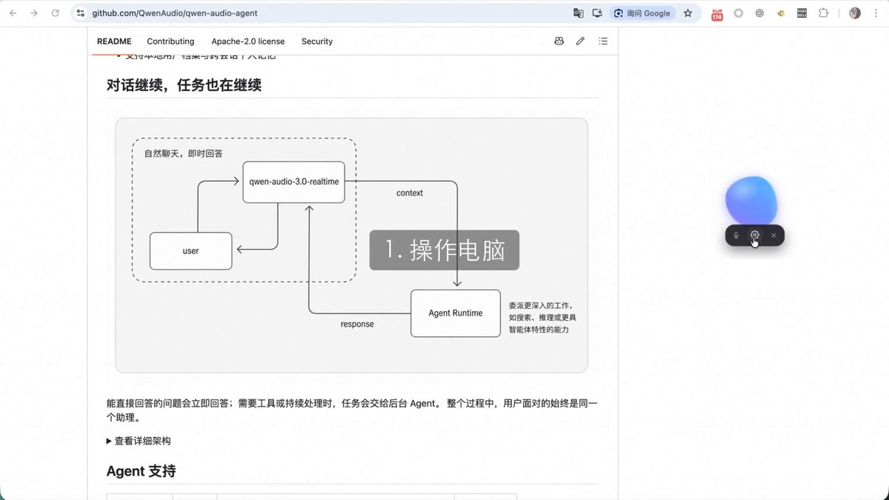
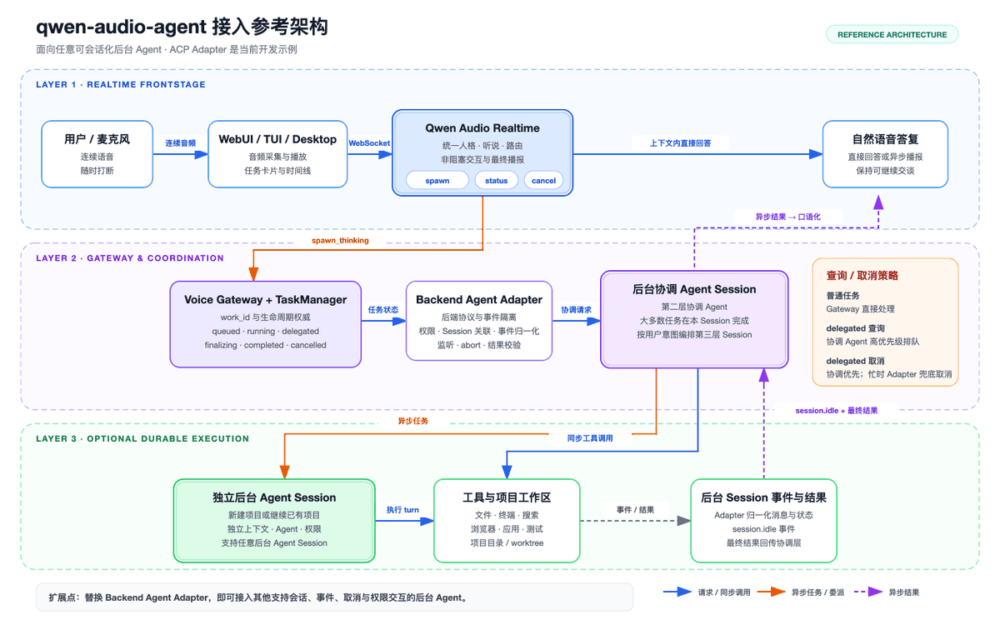

阿里最新开源了一个实时语音Harness：Qwen-Audio-Agent，让你的Agent能像打电话一样对话，你边说边想，它边听边干活

简单说就是它给你的OpenCode、OpenClaw、Codex们加上了耳朵和嘴巴，然后你就可以用打电话的方式跟这些AI协作

OpenAI有GPT-Live，Qwen-Audio-Agent等于是给现有的Agent生态提供了一个统一的实时语音前台入口

前台上，全双工实时语音层，支持连续对话和自然打断

后台上，对接OpenCode、OpenClaw、Qoder、Hermes、CodeBuddy、Codex各类Agent，负责搜索、推理、写代码、改文件等深度任务

复杂任务委派给后台Agent，执行结果实时带回当前语音对话

人机协作方式就变成了：你一边说Agent一边干，你可以随时插嘴补充，它边干活边给你汇报进展，对话过程跟打电话一样

#AI语音 #agent语音助手 #qwenaudio

### 🖼️ Attached Media

## 💬 Replies

### 1 @aigclink (AIGCLINK) (Author)

*Thu Jul 30 13:35:37 +0000 2026*

github：[github.com/QwenAudio/qwen…](https://github.com/QwenAudio/qwen-audio-agent) 

### 2 @QT9277 (阿台🕊️)

*Thu Jul 30 20:34:39 +0000 2026*

@aigclink 这声音也太会了吧！

### 3 @Nazuki_1123 (ナズキキ)

*Fri Jul 31 17:09:17 +0000 2026*

@aigclink 越活越像那个天杀的一直逼逼叨叨的产品经理了

### 4 @esyion_ (Esyion)

*Fri Jul 31 04:39:20 +0000 2026*

@aigclink Gpt的实时语音才是神，各种情绪，停顿。其他模型啥也不是。语音模型只有gpt和其他

### 5 @bbhxwl (斌斌有礼)

*Fri Jul 31 14:12:02 +0000 2026*

@aigclink 部署要什么配置

### 6 @shuizhuyu (Crio Songo)

*Fri Jul 31 11:45:11 +0000 2026*

@aigclink 这个思路挺实用的，现在很多Agent都没有好用的实时语音入口，这个统一接入的方案把前后端分工理清楚了，还支持自然打断，相当于给AI Agent补上了实时语音交互的短板，回头可以找源码试试看效果。

### 7 @guoqingfeng6 (光头狗头)

*Sat Aug 01 08:40:51 +0000 2026*

@aigclink 这个方向可以

### 8 @xiexieyixin (风中浪客)

*Fri Jul 31 09:55:46 +0000 2026*

@aigclink 卧槽这个可以，以后跟agent打电话调bug，省得我打字了

### 9 @FlowOpsDaily (FlowOps Daily)

*Fri Jul 31 05:14:37 +0000 2026*

@aigclink “给 Codex 们加上耳朵和嘴巴”这个说法很形象，但真落地时最先出事的往往不是语音，而是权限边界。能听会说只是入口，哪些命令能直跑、哪些资料能外发，最好一开始就拆开。

### 10 @LongXiao4082 (Rivers)

*Thu Jul 30 14:28:42 +0000 2026*

@aigclink 语音成为了大厂竞争的又一个战场

### 11 @AndsyChun79073 (Andsy chun)

*Fri Jul 31 07:08:39 +0000 2026*

@aigclink 你这么厉害了.

### 12 @An_yhl (晚晚)

*Thu Jul 30 14:08:33 +0000 2026*

@aigclink 以后催它改代码更像打电话摇人了

### 13 @DBL_fay (rikarufort)

*Fri Jul 31 13:20:30 +0000 2026*

@aigclink 抄袭速度世界第一
啥时候能创新速度第一

### 14 @SunSwain74655 (Swain Sun)

*Thu Jul 30 20:49:35 +0000 2026*

@aigclink 这个可以

