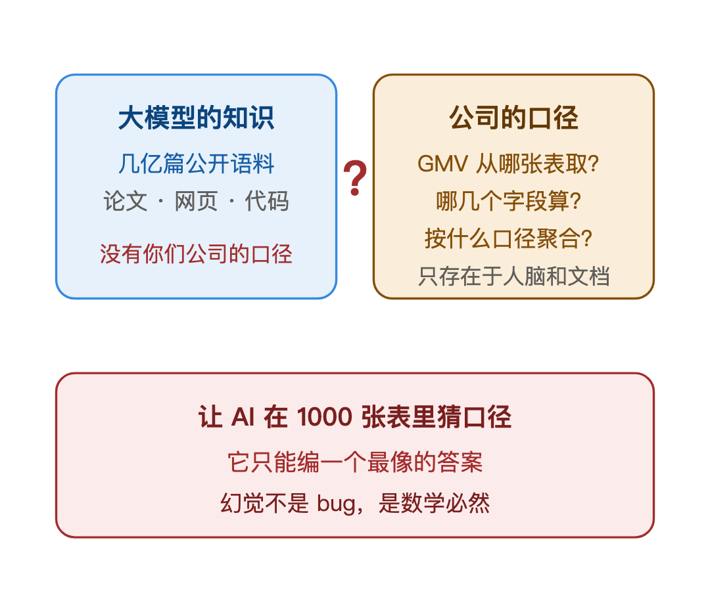
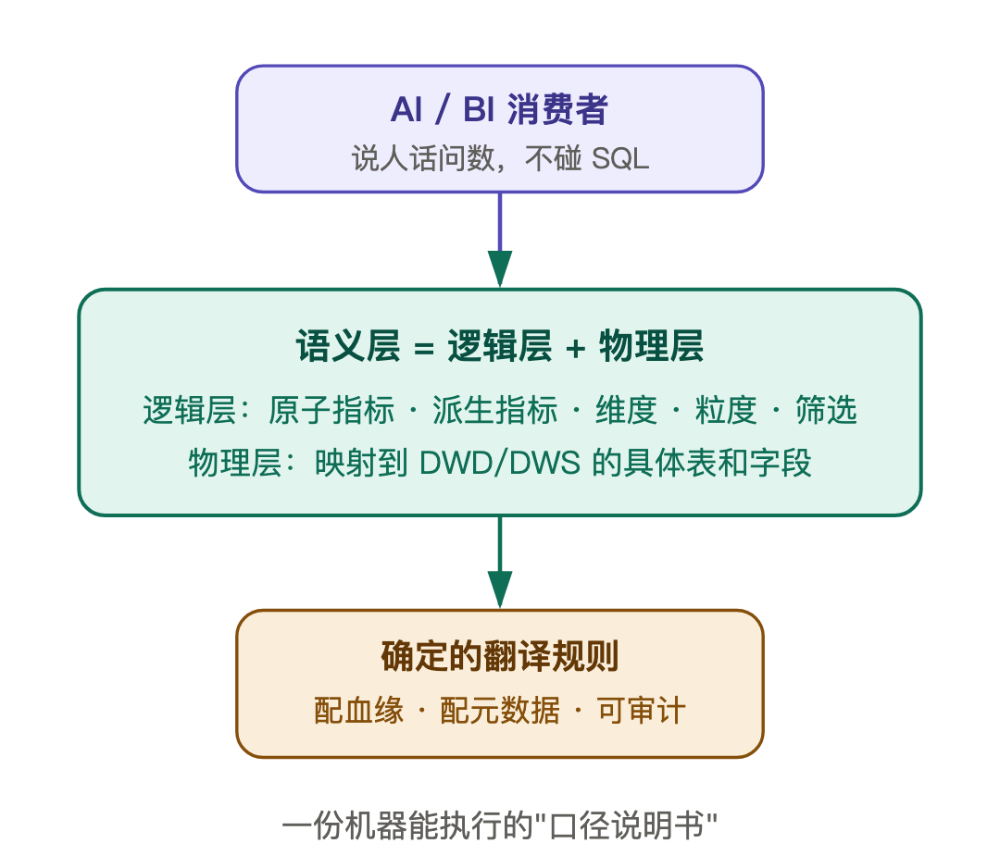
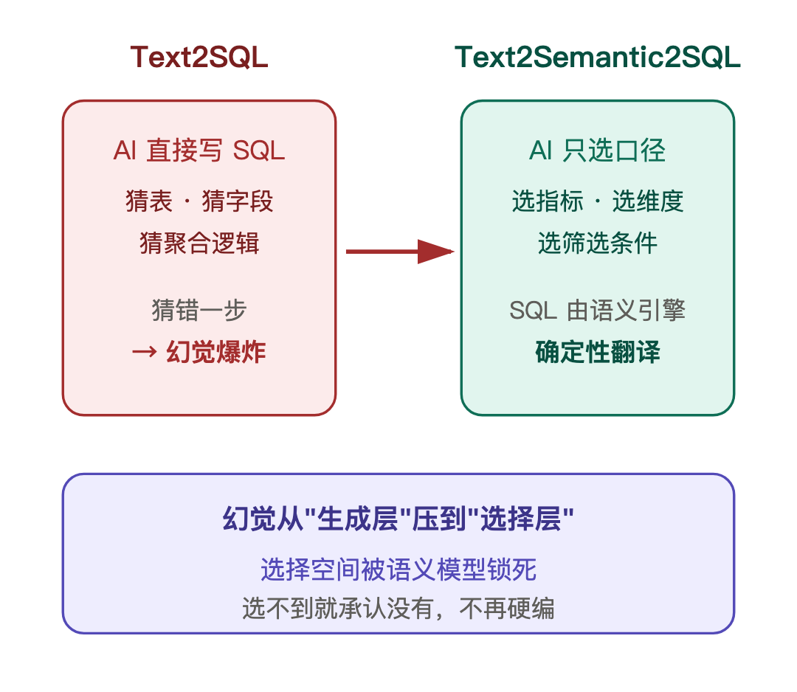
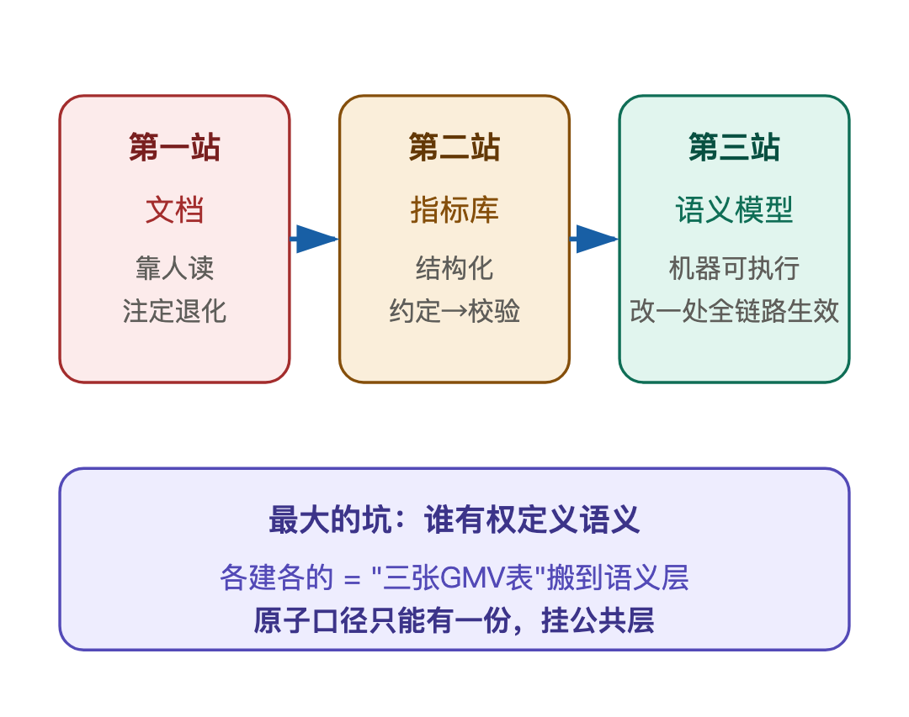
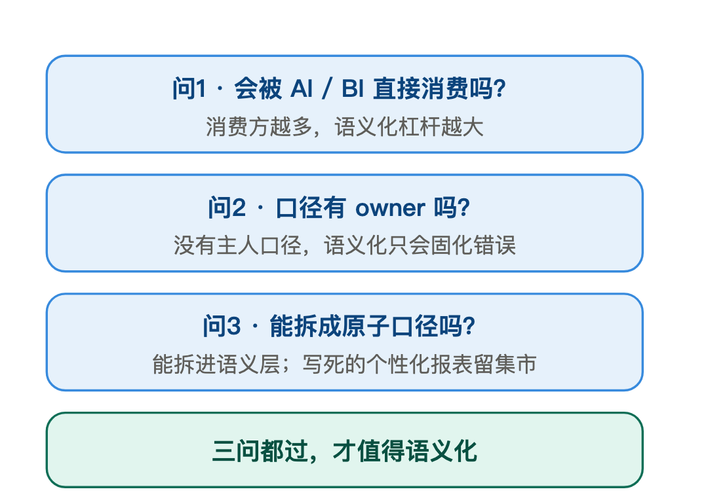

# 📰 AI写SQL总在胡编？因为你的数仓没有语义层

大家好，我是挽风。

去年我们给业务上线了一个 ChatBI——说句话就出数的 AI 查数工具。上线那天演示很完美，问什么答什么。

直到财报会前，业务老大问了一句："上月华东区高价值用户的 GMV 环比多少？"AI 张口就答：涨了 12%。财务当场脸绿——按财务口径，环比是跌了 3%。

不是模型笨，是语义缺失。今天聊聊我对这个问题的思考。

### 01 幻觉的根因：口径不在语料里

遇到 AI 查数不准，很多人第一反应是"模型不行，换个更大的"。这个方向就错了。

大模型的知识来自公开语料。它读过几亿篇文档，但"你们公司的 GMV 从哪张表取、哪几个字段算、按什么口径聚合"——这些根本不在训练数据里。让它在 1000 张表里自己猜"GMV 是什么意思"，它只能编一个最像的答案。

不是它不想答对，是它真的不知道。所以幻觉不是模型 bug，是数学必然：**让 AI 在没有答案的地方找答案，它只能编。** 换 GPT-100 也一样。

### 02 语义层：把口径搬进机器

解法不是多喂文档，是给数仓建一个语义层。一句话定义：**语义层是把口径知识工程化——指标、维度、粒度、筛选规则，从人脑和文档里，搬进机器可读的结构。** 原子指标、派生指标、维度关系全部定义清楚，横在物理表和 AI 之间。

语义层长什么样？粗看是几行指标定义，细看是两层：逻辑层定义口径，物理层映射到具体表和字段——中间是确定的翻译规则，配上血缘元数据。它不神秘，就是一份机器能执行的"口径说明书"。

有了语义层，AI 查数的方式整个变了。它不再写 SQL——写 SQL 等于让它猜表、猜字段、猜聚合逻辑。它变成"选口径"：选哪个指标、按哪个维度、加什么筛选。选完之后，SQL 由语义引擎确定性地翻译。

这一步是范式级的：从 Text2SQL，变成 Text2Semantic2SQL。幻觉从"生成层"被压到"选择层"，而选择空间被语义模型锁死——AI 只能在有定义的口径里选，选不到就承认没有。

顺带说一句，有人问用 RAG 喂口径文档行不行。RAG 检索的是文档碎片，口径在文档里是自然语言，模型还是要"理解再翻译"，幻觉空间没被真正关掉。语义层是结构化约束，不是检索，两码事。

### 03 语义层不是 BI 升级，是治理的第三站

再往深一层。语义层常被当成 BI 平台的新功能，我不同意。它是治理的延续，口径工程化的第三站：

第一站，口径写在文档里，靠人读——靠人看的规则，注定退化。 第二站，口径落进指标库，结构化、可校验——从"约定"变"校验"。 第三站，就是语义层——口径变成机器可执行的模型，AI 和 BI 直接消费，口径改一处，全链路生效。

走到第三站，最大的坑已经不是技术，是"谁有权定义语义"。每个业务线各建各的语义模型，等于把"三张 GMV 表"的问题，从物理表层面搬到了语义层面——表对不上变成模型对不上，更隐蔽。所以语义模型的原子口径，只能有一份，挂在公共层。宪法要延伸到语义层。

### 04 语义建设三问

现在评估一组指标要不要语义化，我问三问。

第一，会被 AI 或 BI 直接消费吗？消费方越多，语义化的杠杆越大，值得建。

第二，口径有 owner 吗？没有主人、没有评审的口径，语义化只会把错误固化，不如不建。

第三，能拆成原子口径吗？能拆成原子指标加维度组合的，进语义层；只能写死的个性化报表，留集市。

---

AI 查数这件事，点破了数仓的一个转向：数据资产的定义，正在从"表好不好用"，变成"语义清不清楚"。表和字段只是实现，语义才是数仓对外发布的接口。

>
>
> 《论语》讲："知之为知之，不知为不知，是知也。"语义层做的，就是让 AI 学会这句话——口径定义范围内，答得准；超出范围，老实说不知道。对 AI 来说，这才是真正的"智"。
>
>

你们团队上过 ChatBI 吗？AI 答错过数没？欢迎留言聊聊。

— 见世界，见众生，见自己 —

