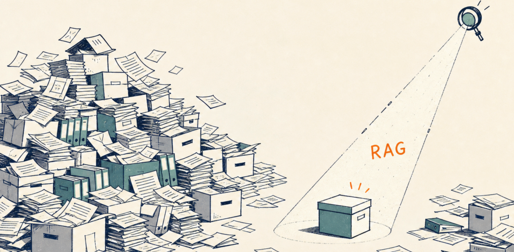
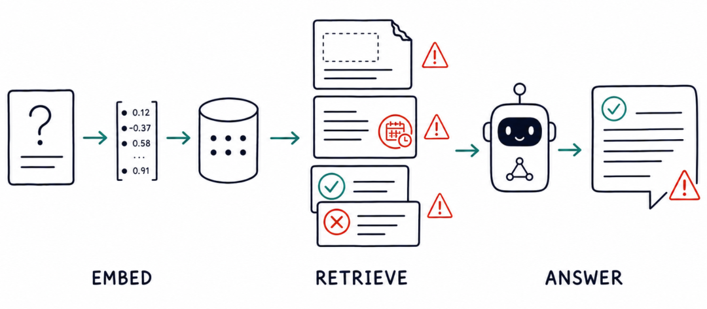
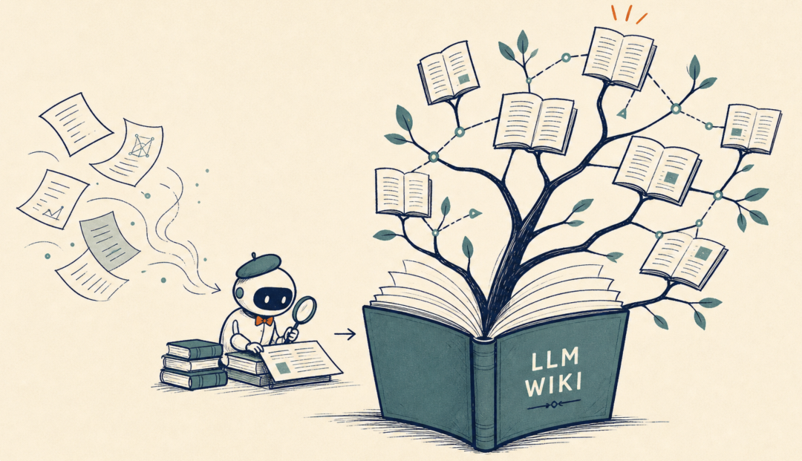
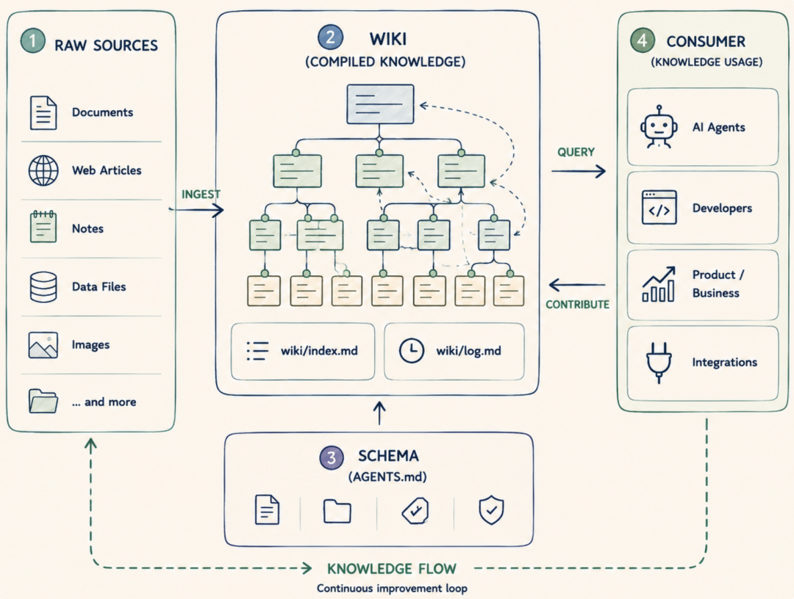
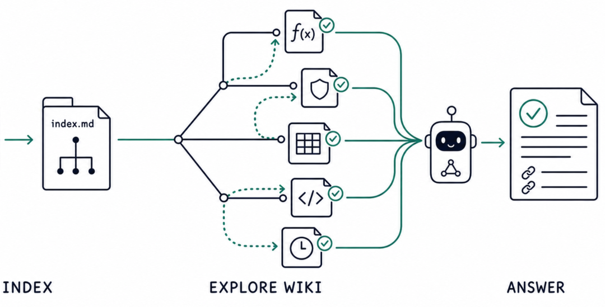
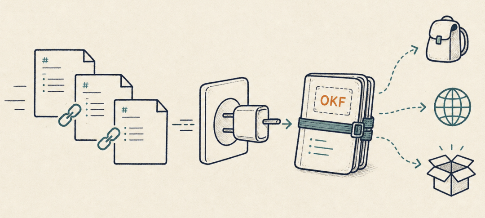
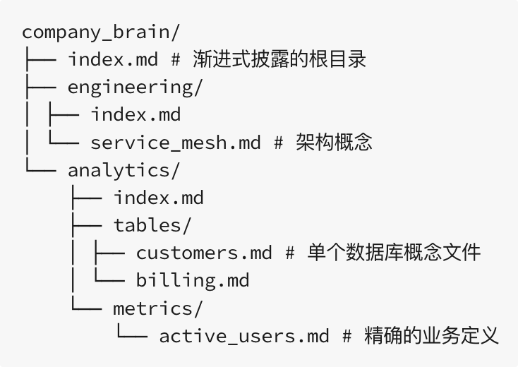
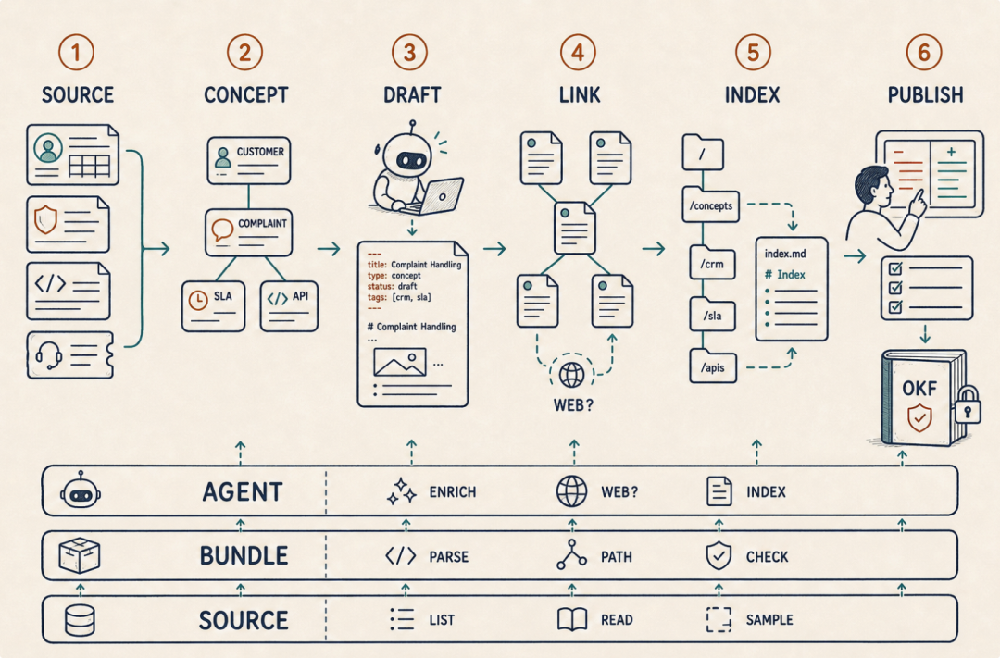
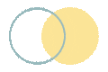

# 📰 深度解读｜从 LLM Wiki 到 Google OKF，如何重建企业 Agent 的可靠知识底座


点击上方  

蓝字  

关注我们  


从 RAG 到 LLM Wiki，面向 Agent 的知识组织与消费方式正在变得多样化。

上个月，Google 发布了 Open Knowledge Format，简称 OKF，目前版本 0.2。它没有再造一个数据库，也没有发明新的检索算法，只是在 LLM Wiki 基础上提出了一种朴素的知识格式：

一组带元数据、互相链接、可以被 Git 管理的 Markdown 文件。

本篇我们来深入了解 LLM Wiki、OKF、Obsidian 等知识新概念及其工程关系。试图探索：Agent 时代，企业需要构建怎样的知识底座？

全文分两篇，一篇侧重概念与方法，一篇侧重应用与案例。

## 一、检索很容易，但知识没有变得更可靠

先说一个常见的软件开发中的场景。

公司里有几百份架构与设计文档、几十类软件接口说明、多年的会议纪要，还有很多只有资深员工才说得清的业务规则。为了让 AI 使用这些知识，我们解析文档、精心切块（Chunks）、Embedding、入向量库，构建了一条典型的 RAG Pipeline。



当问题是“系统有哪些模块”或者“这个 API 规格是怎样的”时，它通常能用 — 因为这类问题的目标很明确，语义检索也很擅长从大量文档中快速找到相关片段。

但是当问题变成：

“如何准确设计一个查询，来计算我们上个季度的客户流失率？”

情况就不同了 —

AI 必须先弄清楚：本公司的流失率是怎么定义的？最新的计算口径是什么？退款客户是否包含在内？数据来自哪里？哪些字段已经废弃？

这不再是一个简单的事实问题，而需要一次“知识探索”。

如果依赖经典的 RAG 管道，它的工作过程大致如此：



* 向量数据库把你的查询转换为向量嵌入

* 召回一批语义相似的需求、设计、会议记录；这些知识中可能有并不真正相关的内容、一份两年前的方案、过时的接口与数据说明、冲突的口径等

* LLM 再揉合成一个非常自信的、但很可能是错误的答案


借助一些 RAG 优化（如查询重写、融合检索等）或 Agentic RAG，或许能够提高精确度，但基于相似度的概率检索机制以及知识本身并没有质的变化。  


这里的根本问题是：

* 无法提供面向开放任务的探索能力。Agent 像刚接手任务的工程师 — 它需要的不是一堆相似片段，而是一张可以不断展开的知识地图。

* RAG 把一堆“可能相关的原始知识” 搬到 AI 面前，但没有替它整理出一套可理解、可导航、可持续维护以确保有效的知识体系。

而这正是 Wiki 式知识体系的价值 —

* RAG 解决的是如何从大量材料中召回候选的“相似”材料。

* Wiki 式知识体系解决的是在问题之前，把有用知识整理成一层带有元数据、相互链接、能够持续维护、能够被 Git 管理的确定性资产。

两者解决的重点并不相同。

这也是后续理解 LLM Wiki / OKF 的第一把钥匙：

RAG 给知识增加了一个“搜索框”，解决“怎样找到”  

Wiki 把知识整理成带有“地图”的体系，解决“能找到什么”

当然，Wiki 并非一定取代 RAG，它们完全可以有效协作，我们将在后续介绍。

## 二、从“搜索框”到持续治理的 LLM Wiki

Wiki 式知识体系的代表，是大神 Andrej Karpathy 在 4 月提出的 LLM Wiki 构想。



Karpathy 注意到，普通 RAG 在每次查询时，基于相似度做检索和组装知识块，再合成答案；但是，下一周再问相似问题，它从头再来一遍。研究过程中发现的矛盾、建立的联系、形成的结论，随着聊天窗口关闭而消失。

而 LLM Wiki 的思路则不同：

它在原始资料与知识消费者之间，构建一层持续生长的知识体系与制品（Wiki）。  

新资料进入时，不是给它做向量索引，而是阅读、整理、并融入到现有知识体系 —

更新相关知识单元、补上交叉引用链接、发现冲突并解决、更新导航索引与日志，把知识“编译成”一组结构化、相互链接的 Wiki 页。 这一切都是由 LLM 来完成。

其整体构思如下：



在这个架构中，有几个关键区域（通常映射为目录）：

* RAW/：人类整理的原始文档集，供 LLM 读取，但不可修改

* Wiki/：LLM “编译”后的 Wiki 知识库

* Schema（AGENTS.md）：约定 Wiki 维护的工作流程与规则

这样，当 Agent 需要探索知识时，它可以优先读取这层整理过、结构清晰的 Wiki，而不是到原始资料里去“考古”。

继续上一节的例子：

现在，“客户流失率”不再只是某份需求文档中的一个片段，而可能形成了一张独立的 Wiki 页面。其中明确记录：客户流失的计算口径、统计周期、需要使用哪些数据表和字段、当前生效的是哪个版本，这些规则分别来自哪些原始材料。

与它相关的“客户信息”、“数据表”等知识，则通过 Wiki 链接进行引用。

在这个知识体系中，上述问题的探索过程变成：



* 从知识库的根目录读取 index.md（根索引）

* 了解到在 crm/metrics/ 下有计算指标的方法

* 读取 crm/metrics/index.md（二级索引），发现 crm/metrics/客户流失率.md

* 读取其中经过审核的 SQL 或 查询脚本

* 文档中有链接到的表结构文档，如 crm/tables/customers 等，继续读取

* 基于这些知识，最终生成完全准确且有效的查询

这是一种重要的变化：

知识不再是临时检索，而是被提前整理、持续维护，并在使用过程中不断完善。  

尽管 LLM Wiki 的想法很诱人，却有一个现实障碍：每个人都能创造自己的 “方言”。

比如有的人元数据用 `tags`，有人用 `categories`；有人从 `README.md`进入，有人从 O`verview.md`进入；有人用双向链接，有人不用。

虽然你看一眼也能明白（都是文本）；但如果 Agent 才是生产者和消费者，那你就可能需要经常为 Agent 编写不同的适配层。

Google Cloud 发布的 OKF，就是为这类知识包定义最低限度的互操作规则。

## 三、OKF：让 LLM Wiki 具有互操作性

OKF 是 Google 发布的、针对 LLM Wiki 知识形态的一套开放约定。

OKF 不规定企业的 LLM Wiki 必须采用哪一种目录和分类，而只是统一知识文件、元数据和链接等基本表达规则，让一套知识包（Knowledge Bundle）可以在不同的厂商、不同的 Agent、不同的知识管理工具之间流动，减少重复适配。

一个 OKF 知识包本质就是一个目录。包含：

一组 UTF-8 编码的 Markdown 文件；每个知识单元（被称作概念，Concept）对应一个文件，文件顶部带标准化的 YAML Frontmatter 元数据。



如果把规范压缩到最小，OKF 目前的约定只有寥寥几条：

* 用目录表达层级关系，用 Markdown 链接表达知识关系

* 用 index.md 做知识入口，为 Agent 提供导航；`log.md`记录知识的变更时间线

* 每个 Markdown 知识单元都要有可解析的 YAML Frontmatter

* YAML Frontmatter 中唯一必须的元数据字段是 `type，表示本知识单元的类型`

`除此之外，规范非常宽松。有`title`、`description`、`resource`、`tags`、`timestamp 等`推荐元数据字段；而知识正文没有严格限制。`


OKF 这种宽松设计很适合早期生态，却不等于企业可以放弃质量要求。企业仍需有自己的命名约束、断链检查、元数据规则和发布门禁等。

换句话说，OKF 只是保证互操作的底线，但不是知识的质量证明。  

另外，OKF 还处于早期阶段，未来可能还会有更多约定加入。


这是一个遵循 OKF 约定的知识包：



其中，一个知识单元（概念页）的内容可能是这样：

```

---type: API Contracttitle: 创建订单接口description: 创建普通订单时使用的内部服务契约resource: repo://order-service/src/api/create-order.yamltags: [order, api, write]timestamp: 2026-07-20T10:30:00+08:00owner: order-platform---# 使用条件仅用于已经完成客户身份核验的订单请求。# 关键约束调用前必须执行[订单资格检查](../checklists/order-eligibility.md)。跨域客户信息通过[客户查询接口](../apis/customer-query.md)获取。# 证据- 服务定义：`order-service/src/api/create-order.yaml@`- 集成测试：`order-service/tests/create-order-it.md@`

```

OKF 约定：每个知识单元的 ID（ConceptID）就是文件路径；并使用普通 Markdown 链接表示知识间的关系，其含义由周围文字表达。比如：

```

跨域客户信息通过[客户查询接口](../apis/customer-query.md)获取。

```

## OKF 不做什么？

OKF 本身是一个知识格式约定，但以下不在它的范围：

* 不定义和替代领域专用协议，如 OpenAPI 、数据库 Schema

* 不定义知识摄入、存储、消费的形式与协议

* 不要求特定的 SDK /工具来写入、读取与发布知识

为什么几份 Markdown ，到了 Agent 时代反而变得重要？

Markdown、YAML、目录和链接显然都不是新发明。但 LLM Wiki + OKF 把这些熟悉零件组合成了一种更适合 Agent 的知识体系：

* 人和 AI 都可以直接读写 — 使用任何你擅长的方式

* 以目录与文件组织而非数据库，分发、复制，甚至与 Obsidian 协作都简单

* 借助多级的 index.md 实现“渐进式知识加载”，无需全部塞进上下文

最后总结一下：

LLM Wiki 是方法，关心原始材料怎么被整理成知识层；  

OKF 是格式约定，关心知识层怎么被表示、携带和交换。

## 四、如何构建符合 OKF 约定的 LLM Wiki

正如上文所说，OKF 强调通用且厂商中立 — 你可以使用任何方式读写符合约定的 Wiki 知识库，无论生产端还是消费端，比如：

* 手工编写 OKF 的知识单元

* 让 Coding Agent 扫描代码生成

* 自己编写数据知识导出管道

* 基于框架（比如 Google ADK/LangChain）开发知识维护 Agent

* 借助 MCP 工具、独立的知识工具如 Obsidian

我们来看 Google 公布的一个知识生产 Agent 的参考实现：



该 Agent 包含了具有通用性的六步流程：**先发现知识单元，逐页建立知识骨架；再补充关系链接、生成索引，最后审核发布：**

|  阶段   |            核心动作            |     主要产物      |
|-------|----------------------------|---------------|
|1. 圈定来源|      明确知识范围、权威来源和读取权限      |Source Manifest|
|2. 发现概念|    从文件、API 和人工规则中识别知识单元    |  Concept 清单   |
|3. 知识写入|     逐页生成，写入元数据、各类知识事实      |  Concept 草稿   |
|4. 创建关系|  补充链接、例外、冲突与共用 Reference   |     知识网络      |
|5. 生成导航|自底向上生成 `index.md` 与 `log.md`|     渐进索引      |
|6. 审核发布|   校验、生成 Diff、Owner 审核后合并   |    发布的知识包     |

### 

###

### 参考这个方法，现在假设企业要建设 CRM 客服 Wiki ###

### 知识来源包括客户数据模型、投诉流程文档、SLA、CRM OpenAPI、通知和历史工单等。规范负责业务规则，API 与数据模型负责系统事实，通知必须带有效期，工单用于发现知识缺口 ###

### 先识别稳定的知识单元（概念），比如 ###

### 

###

```

business/customer-identityprocesses/complaint-handlingrules/service-levelapis/create-service-ticketplaybooks/complaint-escalationreferences/ticket-status-codes

```

起草知识页，比如生成“投诉升级规则”时，Agent 负责加载 SLA、投诉流程、有效通知和知识单元清单，组织内容，并链接客户身份、工单状态与升级流程。

整体处理的伪代码如下：

```

source = CRMSource()concepts = source.list_concepts()# 生成知识单元（概念页）+ 建立链接for ref in concepts:    raw = source.read_concept(ref)    draft = enrich(raw, existing(ref), concepts)    validate_and_write(draft, status="draft")# 构建index.md与log.mdrebuild_indexes()publish_after_owner_review()

```

在整个过程中，用代码负责检查路径、格式、来源与断链；用 LLM 组织语义，整理知识；CRM 管理者决定什么可以发布。最终得到的是一套可追溯、可导航、能持续维护的 LLM Wiki。



至此，我们讨论了 LLM Wiki 与 OKF 的核心思想，以及如何将分散的资料构建成可导航、可维护的知识体系。

下篇将进入一些更实际的应用：如何用它为 AI Coding 构建项目地图与上下文，如何结合 Obsidian 管理与呈现知识，以及 LLM Wiki 与 RAG 的分工与融合。欢迎继续关注！


END  

喜欢就关注哦


动动小手点个赞


点在看最好看


