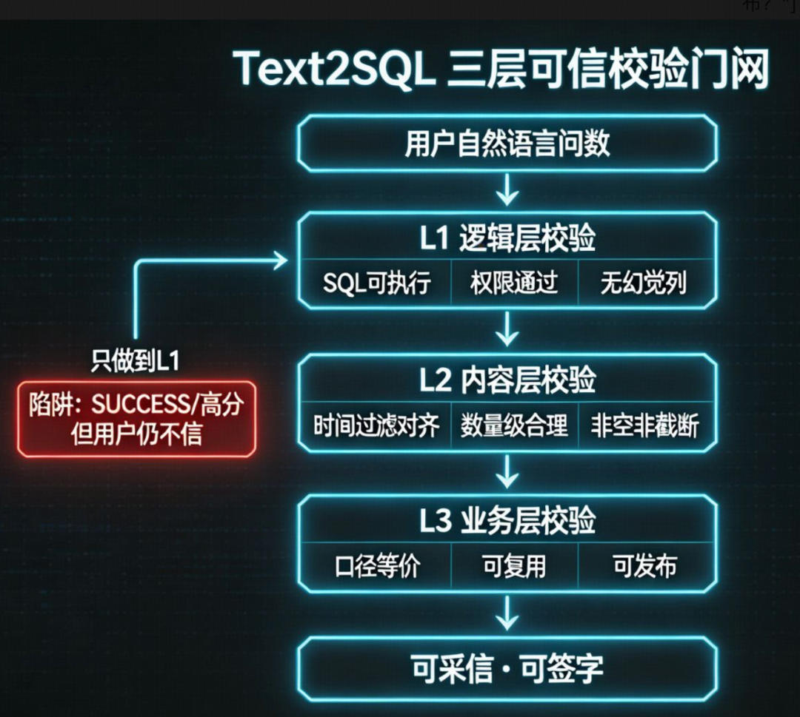
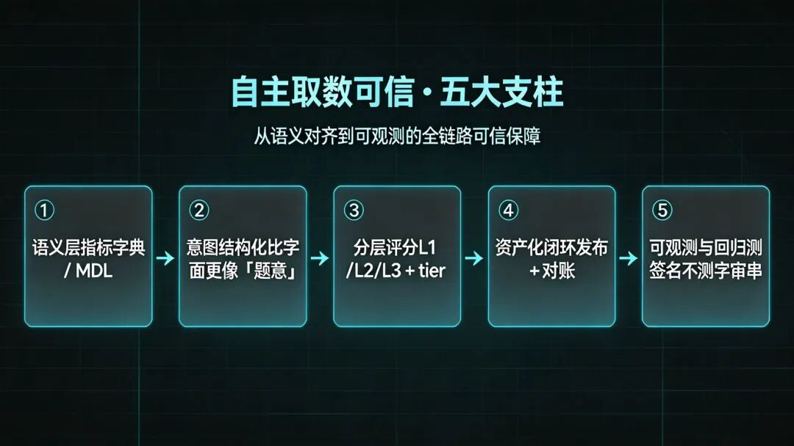
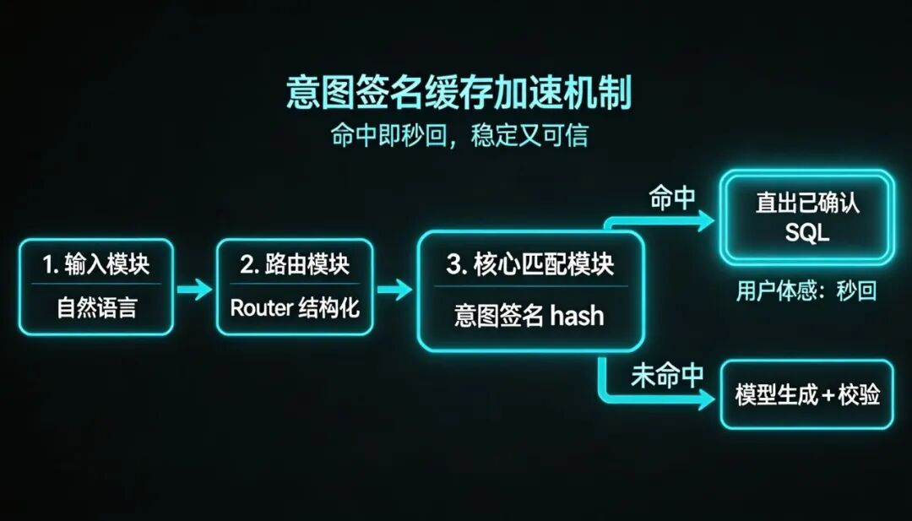
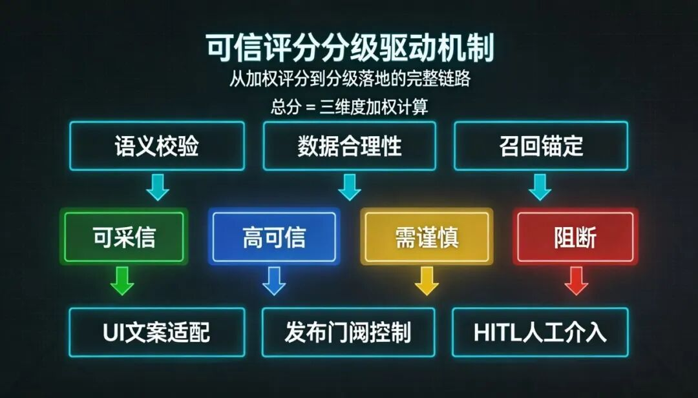
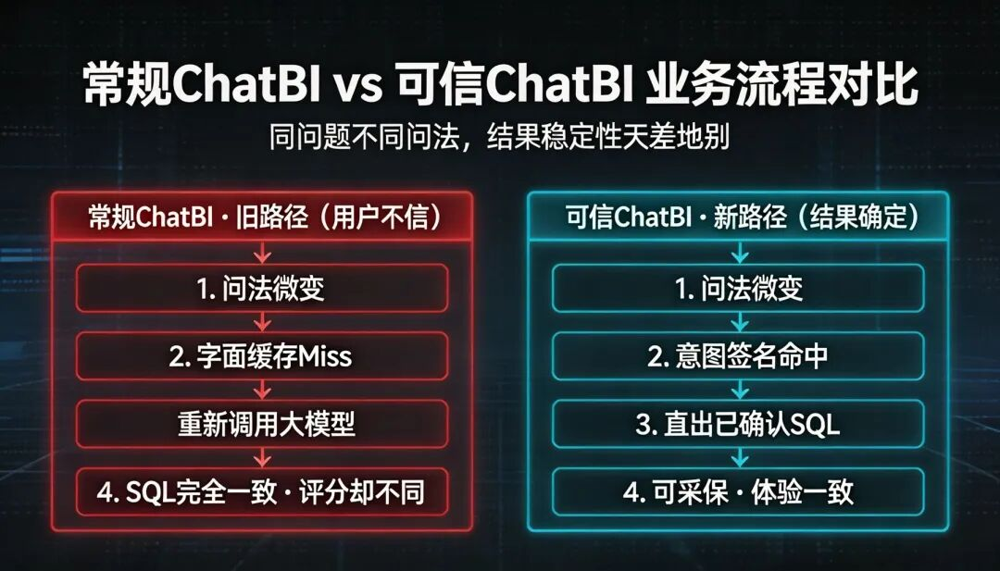

# 📰 Data Agent二篇：查数Agent 你们的是否可信?

上篇介绍了Data Agent的全景架构图，本篇就从Data Agent中的查数Agent(chat bi) 开始介绍，做过chatbi的应该都清楚,最难的不是做这个功能,是查询出来的数据怎么让别人相信，本篇就一起讨论可信的data agent怎么建设。

# 1 核心问题

首篇自检里有两条典型问题，大多团队做chat bi都会遇到过：

```

第 ② 条：用户点过 👍 的问法，少几个字还要重跑 LLM（大语言模型）吗？
第 ④ 条：业务拿问数结果开会，系统敢标「可采信」吗？

```

下面是一个线上真实案例:

|   角色   |          业务过程           |  核心结论  |     问题      |
|--------|-------------------------|--------|-------------|
|**业务用户**|上次问对，这次少两个字需重新查询 感觉数据还不一致| 系统没学会  |   用户感觉不准    |
|**数据开发**|   SQL 执行成功，分区正常，监控无告警   | 链路没问题  | 数据开发感觉没有问题  |
|  算法开发  |     语义识别正常 生成sql正常      |识别生成逻辑正常|算法开发觉得是谁会更新问题|

涉及到的多个环节 都觉得自己没有问题， 结果用户感觉数据不准确 不敢用。这就需要一个评分或者一个描述告诉用户是否这次查询数据高可用。

比如如下：

```

置信度评分等级：

85 - 95  高可信
95 - 100 完全可行
60 - 85  谨慎评估
0  - 60  不可信

```

用户看到这个可信度的描述 就知道这个数据是否可以使用了。分数较低和谨慎评估或者用户明确标记错误的 都是数据开发和算法开发的一些修正样本的输入 ，等数据飞轮流转之后,高可信的越来越多 当占比超过一定程度比如95%的时候 就可以把置信度去掉 因为已经给用户营造出来查询即可用的良好印象 。保留反馈正确或者错误的入口 进行数据飞轮即可。

---

# 2 常见的几个问题

## 1 响应时效性：一个典型问题（行业常见形态）

下面这类场景，在 ChatBI 上线后反复出现（形态通用，细节因厂而异）：

|    步骤    |       用户输入       |                    系统表现                    |
|----------|------------------|--------------------------------------------|
|第一次（用户点 👍）|查最近 3 个月**月月**的 UV|                    记为正确                    |
|   第二次    |   查最近 3 个月的 UV   |未能识别到是相同语义,缓存未命中；重新调模型；SQL 与上次实质相同；界面显示「高可信」|

用户体感：我明明教过你了,为什么还要等那么久 不是应该很快就生成吗？ 对用户体感感觉非常慢。

这个问题原因：系统没有把「已确认的正确」迁移到「语义等价的下一次查询」。需要对于用户标记正确的问法缓存 下次同等语义执行sql查询结果 速度会非常快 置信度也非常高 给用户一种又快又准的体感。

>
>
> **术语速查**
>
>
>
> * **Text2SQL / NL2SQL**：自然语言转 SQL，ChatBI 自主取数的核心能力。
>
>
> * **UV**：独立访客（Unique Visitor），常见指标，口语里常说「日活」「访客数」。
>
>
> * **缓存 / Shortcut**：命中历史正确问法则直出 SQL，不再调大模型——快、省、体验稳定。
>
>
>
>
>
>
>
>

## 2 语义识别的准确性

语义的缓存不能按照中文进行相似度的匹配 需要按照抽取出来的语义层进行缓存。比如以下例子:

|  步骤  |       用户输入        |   是否复用上次 SQL？    |
|------|-------------------|------------------|
|第一次（👍）|「最近 60 天**独立访客数**」 |        —         |
| 第二次  |「最近 60 天**每天**的 UV」|**不该**——粒度从汇总变成了按日|

表面看都是「UV + 60 天」，但业务含义不同：一个是总数，一个是趋势。

若系统因为字面相似就复用，比「不复用」更危险——导致数据错误。

```

注意 ①：自主取数最难的不是「查不到」，而是「该复用的没复用」和「不该复用的复用」。

```

## 3 语义层建设完整性和模型的不确定性

还有一类产问题：

>
>
> 用户问题合理、SQL 合理、**数据也出来了**，系统却因「语义层未登记某列」整单标为「不可用」。
>
>

或者反过来：

>
>
> 数据集根本没有 `device_brand` 字段，系统却生成含该列的 SQL，执行后就会报错。
>
>

主要就是缺语义约束 + 模型编造。

出现这些问题 用户都会质疑数据 因为他们看到的是：「数明明在那，你说不能用」或「数出来了，口径不对」。

明确这三类问题，就明白：可信不是 简单UI 文案加一个评分，是一套分层系统化工程。

---

# 3 可信是什么

一般行业可以把「用户信不信」拆成三层。这不是营销概念，对应不同验收标准：



|   层级    |   回答什么   |       典型信号       |  谁最关心  |
|---------|----------|------------------|--------|
|**L1 逻辑**|查询在技术上成立吗？|执行成功、语义校验通过、权限 OK | 开发、平台  |
|**L2 内容**|结果在数据上合理吗？| 时间窗对齐、无异常波动、非空结果 |数据分析、QA |
|**L3 业务**|结果能进业务流程吗？|与已确认口径一致、可复用、可对账发布|产品、业务负责人|

对比一下你们chat bi ，做到了哪个层级 欢迎评论区讨论？

---

产品和工程必须先对齐语言，建议把「可信」拆成三个产品承诺，再映射到工程等级：

| 产品承诺  |    用户白话    |    工程上至少要做到哪一步    |
|-------|------------|-------------------|
|**可用** |  数能看、能导出   |   L1 通过 + 基础 L2   |
|**可复核**| 说得清为什么是这个数 | 证据链：用了哪些指标、过滤、表列  |
|**可采信**|敢拿去开会、敢发布到看板|L3 通过 + 对账 + 明确等级门闸|

可信度分级（行业通行做法）不要把所有「分数不低」都叫「高可信」。成熟系统至少分三档：

|  tier（等级）  |      建议产品话术       |      默认行为       |
|------------|-------------------|-----------------|
|  **可采信**   |  系统可有限担保，有证据可回放   |允许一键发布 / 导出 / 进看板|
|  **高可信**   |风险较低，**关键结论建议人工复核**|   默认可看，发布需确认    |
|**需谨慎 / 阻断**|  口径存疑、幻觉风险、权限问题   |    展开证据或阻断发布    |

>
>
> **术语速查**
>
>
>
> *
> * **tier**：可信度等级，比单一分数更适合驱动产品行为（展示、发布、告警）。
>
>
> * **Trust Receipt（可信回执）**：一次查询的「承诺书」——用了什么口径、过了哪些校验、有何警告。
>
>
> * **HITL（Human-in-the-loop，人在回路）**：低可信自动转人工确认，不硬自动。
>
>
>
>
>
>

误区：「高可信」≠「可采信」。

```

前者是「建议用，休要用户自己再一眼」；
后者是「系统愿意为这次结果承担有限担保」。

```

---

# 04 怎么建：可信的五大支柱

自主取数要让人信，靠的不是 Prompt 写得好，而是五根工程柱子一起立住。



## ① 语义层：没有字典，谈不上可信

模型不知道「销售额」在你们公司算含税还是不含税、算不算退款。

指标字典 + 语义建模层（MDL，Metric Definition Layer）是可信的地基——人和模型看同一份口径定义。

未登记的真列 vs 编造的列，必须区分（OK / 部分满足 / 违规三态）

指标别名（UV = 独立访客数）应在语义层收敛，而不是每次靠模型猜

后续文章会专讲地基；本篇只强调：没有 ①，后面四根柱子都是空中楼阁。

## ② 意图结构化：复用键不能只用语言字面

「3 个月月月 UV」和「3 个月 UV」字面不同，题意相同。

「60 天 UV 汇总」和「60 天每天 UV」字面相似，题意不同。

正确做法是：Router（路由解析）产出结构化意图——指标 ID、时间窗、粒度（汇总/按日/按月）、筛选条件——再算意图签名（Intent Signature）作为复用主键。



|     复用层级     |       匹配什么       |     适用场景      |
|--------------|------------------|---------------|
|   **字面缓存**   |    问句归一化后完全相同    |  最快，扛不了口语噪声   |
|   **意图签名**   |  指标+时间+粒度等结构相同   |抗「月月」类噪声；区分粒度变化|
|**SQL 指纹事后对齐**|生成后 SQL 与历史正样本实质相同| 兜底抬分，但不替代意图命中 |

>
>
> **术语速查**
>
>
>
>
> * **Router**：把自然语言解析成结构化查询意图，决定走缓存还是生成。
>
>
> * **grain（粒度）**：汇总 summary / 按日 day / 按月 month 等。
>
>
> * **正样本**：用户明确认可（👍）的正确问法及对应 SQL。
>
>
>
>
>
>

## ③ 分层评分：分数要服务行为，不是装饰

单一「85 分」不够，需要：



关键设计原则：

分数解释给用户看：不是「85.7」，而是「时间过滤已对齐；但未命中您上次确认的问法」

tier 驱动行为：发布看板默认要求「可采信」，探索态允许「高可信」

冷路径降分要诚实：重新调模型不等于数错了，但应反映「未复用已确认口径」

## ④ 资产化闭环：探索态的结果要能「升格」

ChatBI 停在探索：每次对话是一次性消费。

Data Agent 要求：问对的数，能发布、能刷新、能对账。

|  阶段  |是否调大模型|             必须产出              |
|------|------|-------------------------------|
|**探索**|  是   |       结构化 State + 可信回执        |
|**发布**|仅抽取规格 |查询规格（query spec）+ **parity 对账**|
|**消费**|**否** |        同参同结果，看板刷新确定性执行        |

>
>
> **parity（对账）**：发布前对比「探索时看到的数」与「按规格重跑」的聚合值，误差在阈值内才允许发布——防止「当时看是一个数，上线变另一个数」。
>
>

## ⑤ 可观测与回归：可信是测出来的

手工只能看结果，测试用例需要覆盖：

意图签名是否相同

该命中时是否走了缓存

该 miss 时是否重新生成

tier 是否符合预期

建议核心指标：

|  指标   |     说明      |
|-------|-------------|
|意图命中准确率| 噪声问法是否正确复用  |
| 误命中率  |粒度变化却被复用（高危） |
| 可采信占比 | 真正达到发布门槛的比例 |
|发布对账失败率|   口径漂移信号    |
| 用户否决率 |👎 与 tier 是否校准|

---

# 05 对照：ChatBI 典型态 vs 可信自主取数

| 维度 | ChatBI 典型态  |     可信自主取数目标态     |
|----|-------------|-------------------|
|成功定义|有结果 / SUCCESS|L1+L2+L3 分层 + tier |
| 复用 |   无或仅字面缓存   |  意图签名 + SQL 指纹兜底  |
|输出物 |自然语言 + 当次 SQL|State + 查询规格 + 可信回执|
| 发布 |   截图 / 收藏   |  对账 + 门闸 + 零模型刷新  |
|用户反馈|    点赞即结束    |    反馈写入结构化学习单元    |
| 治理 |   事后人工对口径   |   语义层约束 + 在线回归集   |



---

# 06 价值跃迁

ChatBI 自主取数解决的是「我现在想问一个数」。

可信自主取数要解决的是「这个数下周还能用、会上能讲、看板上能刷、出了问题能追责」。

对应首篇文章中的四态：

探索：允许模型试错，但必须留下结构化证据

发布：对账钉死口径

消费：确定性执行，不再赌模型

监控：异常主动找人，而不是让人天天刷 Chat

下一篇讲地基——没有指标字典和语义层，UV、销售额、留存将永远有多个版本；Agent 再强，也是在三个版本里选一个看起来最对的。
