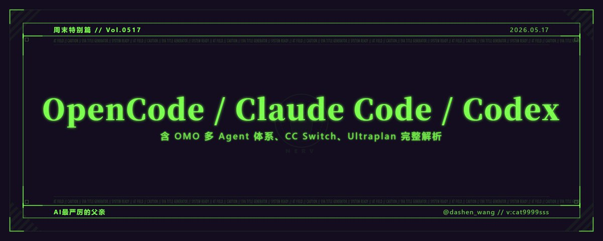

# 📰 2026 年 AI 编程三强横评：OpenCode / Claude Code / Codex（新人向）

> 我用过最好的 AI 编码 Agent 框架，然后它开始崩了

所有人都在问同一个问题：GPT-5 还是 Claude Opus？

这个问题问错了。

2026 年，模型能力的差距正在以每四到七个月缩短一半的速度收敛。真正拉开差距的，是模型外面那一层。你怎么编排它，怎么让多个 Agent 分工协作，怎么在对的任务上用对的模型，然后在你不看屏幕的时候它们还能不能继续工作。

这一层叫 harness，或者叫 agent 框架。

我在这个领域折腾了很长时间，从深度使用 OpenCode + oh-my-openagent（OMO），到被稳定性问题逼着迁移，再到把 Claude Code 和 Codex 都接进来跑。这篇文章是我的真实使用记录，外加全面调研三家 2026 年的最新进展。

该夸的夸，该骂的骂，最后给推荐。

> 最后，用什么工具其实并不重要，这篇文章更偏向新手。

## 一、OMO 是怎么设计的，为什么值得单独说

oh-my-openagent（前身是 oh-my-opencode，社区简称 OMO）是 OpenCode 的插件，但说它是"插件"有点委屈它。

它是一套完整的多 Agent 编排哲学的工程化实现。GitHub star 超过 53,000，npm 下载量超过 160 万次。

OMO 用希腊神话原型命名每个 Agent，这不是噱头，每个名字背后对应严格定义的职责边界。

- [⚡](https://abs.twimg.com/emoji/v2/svg/26a1.svg) Sisyphus，主编排者。整个系统的大脑，prompt 约 1100 行，专为需要在数十次工具调用中保持跨轮次一致性的复杂任务设计。它不写代码，只负责理解意图、拆解任务、把工作分发给对的 Agent。

- [⚡](https://abs.twimg.com/emoji/v2/svg/26a1.svg) Prometheus，战略规划师。按 Tab 键进入采访模式，主动问你问题直到理解任务全貌，然后生成并行任务图。

- [⚡](https://abs.twimg.com/emoji/v2/svg/26a1.svg) Atlas，执行层。接 Prometheus 的计划，分发给子 Agent，跨任务积累学习，独立验证完成情况。

- [⚡](https://abs.twimg.com/emoji/v2/svg/26a1.svg) Hephaestus，写代码的那个。GPT 系列驱动，原则驱动型 prompt，自主执行风格。

- [⚡](https://abs.twimg.com/emoji/v2/svg/26a1.svg) Oracle，高 IQ 架构顾问，只读。遇到跨系统架构决策、安全问题时调用，不写代码，只给判断。

- [⚡](https://abs.twimg.com/emoji/v2/svg/26a1.svg) Metis，计划审查员，在定稿前找出 Prometheus 遗漏的 gap。

- [⚡](https://abs.twimg.com/emoji/v2/svg/26a1.svg) Momus，无情的 reviewer，验证计划的清晰度和可验证性。

- [⚡](https://abs.twimg.com/emoji/v2/svg/26a1.svg) Explore + Librarian，实用工具 Agent，刻意使用最便宜最快的模型跑 grep 级别的检索，把 API 预算留给需要高智能的任务。

- [⚡](https://abs.twimg.com/emoji/v2/svg/26a1.svg) Multimodal Looker，视觉和截图分析。

这套体系最聪明的地方，不是有多少个 Agent，而是每个 Agent 的 prompt 针对不同模型家族分别写了两套版本。

Claude 系列响应"机制驱动型"prompt，包括详细清单、模板、逐步流程，规则越多执行越精准。Sisyphus 的 Claude 版本约 1100 行。

GPT 5.2+ 响应"原则驱动型"prompt，包括简洁原则、XML 结构、明确决策标准。同样是 Prometheus，GPT 版本只有约 121 行，但达到相同输出质量。

OMO 的运行时会检测你连接的模型家族，自动切换对应的 prompt 版本。这个设计，目前在其他所有工具里看不到。

然后是 ultrawork 模式，输入 ulw 触发。

激活 Sisyphus 高精度 prompt，强制并行规划，所有专家 Agent 同时展开，模型精度自动升级到 max/high 档，通过 Ralph/ULW Loop 自我修正循环持续运行直到真正完成。

不是"感觉好一点"的提升，是可量化的质量差异。

## 二、OpenCode 的问题是什么

这是这篇文章最重要的一段。

OpenCode 是 OMO 运行的底层，而它本身的工程质量，近几个月已经影响到正常使用。

🔴 启动性能退化

从 v1.2.1 开始，大量用户报告冷启动时间显著变长，部分环境下等待数十秒。严重情况卡在启动阶段，Ctrl+C 无响应，只能 SIGKILL 强制终止。GitHub issue 追踪记录跨越多个版本。

🔴 TUI 渲染缺陷

终端缓冲区（framebuffer）未正确清除，历史帧残留叠加在新内容上，终端输出变成乱码字符。Windows 平台尤为严重。

🔴 进程死锁

某些操作完成后 OpenCode 停在"thinking"状态无法返回，只能从任务管理器强杀。v1.14.25 的"Loading plugins..."卡死 bug 约 50% 概率复现。

这些不是边缘场景的偶发问题，是真实用户每天遇到的阻断性体验。

我自己迁移到 Codex 和 Claude Code 的原因很简单：工作流里不能加"重启 OpenCode"这个步骤。

## 三、三家 2026 年最新状态全扫描

在横评之前，先把三家近几个月的重大更新说清楚。这些东西不了解，讨论就停留在去年。

> 🤖 Claude Code：从终端工具变成云端开发平台

桌面端全面重构（2026 年 4 月 14 日）

Claude Code 在今年 4 月彻底重写了桌面端。新版本是 IDE 风格的工作台，支持多 session 侧边栏管理、拖拽面板布局、集成终端和文件编辑器、HTML/PDF 预览、Git worktree 隔离。

过去跑四个 Claude Code session 需要开四个终端窗口，现在一个界面全管了。

Ultraplan（云端规划，4 月进入预览）

这是 Claude Code 最激进的一步。/ultraplan 把规划阶段从本地终端 offload 到 Anthropic 云端容器，你的终端立即释放。规划完成后在浏览器里 review，可以对具体段落内联评论、要求修订，然后选择云端直接执行（自动创建 PR）或传送回终端本地执行。

本质上是把 AI 规划从"你等它"变成"它在后台跑，你随时来看"。

Routines（云端自动化）

Pro 用户每天 5 个，Max 15 个，Team/Enterprise 25 个。可以按时间计划、GitHub 事件、或 API 调用触发模板化 Agent 任务。不用开终端，不用人守着。

Ultrareview（4 月 16 日）

/ultrareview 是并行多 Agent 代码审查。Ultraplan 出规划，Ultrareview 做审查，加上 Routines 的计划调度。Claude Code 正在从终端 Agent 变成一套完整的云端开发流水线。

移动端

4 月起，长任务完成或 Claude 需要你回应时，直接推送到手机。Claude Code 的 web/移动端是 Anthropic 自己早先推出的，已稳定运行数月。

最新模型：Claude Opus 4.7 已成为 Max/Team Premium 的默认模型，带 xhigh 努力等级，并有 /effort 滑块可调。

> 🤖 Codex：桌面 + 移动 + 企业全覆盖

Codex App（2026 年 2 月 Mac，3 月 Windows）

OpenAI 推出了 Codex 桌面 App，定位是"多 Agent 指挥中心"。每个 Agent 跑在独立的 git worktree 里，互不冲突，可视化界面监控所有 session，同步 Codex CLI 的历史和配置。

Codex 移动端（2026 年 5 月 14 日，本文写作时三天前刚上线）

Codex 通过 ChatGPT 移动 App（iOS + Android）接入，所有 ChatGPT 订阅层级包括免费用户均可使用。

机制是：Codex 不在手机上运行代码，手机通过安全中继层连接到你桌面机器上跑着的 Codex，实时同步终端输出、代码 diff、测试结果、截图，全部流式传到手机屏幕。从手机可以查看所有 thread、审批命令、切换模型、发起新任务。

Anthropic 在去年秋天先做了 Claude Code 的远程控制，Codex 的移动端是直接的跟进动作。目前仅支持 macOS，Windows 支持即将推出。每周已有超过 400 万开发者在使用 Codex。

原生 per-agent 模型配置

Codex 的 custom agent 通过 \~/.codex/agents/ 下的 TOML 文件单独配置 model、reasoning\_effort、sandbox 模式等，每个 Agent 可以跑完全不同的模型。规划用 GPT-5.2，执行用 GPT-5.3-codex，这套配置在 Codex 里是原生能力。

Symphony（OpenAI 官方开源编排框架）

把 Linear 等项目管理工具变成 Agent 控制平面，每个 issue 自动分配 Agent 持续执行，支持依赖关系 DAG 并行调度。OpenAI 内部使用后，部分团队 PR 合并数量提升了 500%。

Remote SSH GA + Hooks GA（5 月 14 日）

Remote SSH 正式可用，Codex 桌面 App 可以自动检测 SSH config 里的主机，在远程环境里直接跑开发 thread。Hooks 同日 GA，支持扫描 prompt、记录对话、自定义 Codex 行为。

🛠 CC Switch：被忽视的现役工具

CC Switch 是跨平台桌面 App（Windows/macOS/Linux），目前 67,200 GitHub star，125 个贡献者，最新版本 v3.15.0，支持六个 CLI 工具：Claude Code、Codex、Gemini CLI、OpenCode、OpenClaw、Hermes Agent。

它解决的问题很具体：这六个工具各有自己的配置格式、provider 语法、MCP 配置方式。同时用多个工具，手动改 JSON、TOML、.env 文件是日常折磨。

CC Switch 把这些统一进一个界面：

- [✅](https://abs.twimg.com/emoji/v2/svg/2705.svg) 一键切换 provider，无需重启终端，Claude Code 支持热重载

- [✅](https://abs.twimg.com/emoji/v2/svg/2705.svg) 统一管理所有工具的 MCP 服务器

- [✅](https://abs.twimg.com/emoji/v2/svg/2705.svg) Skills marketplace，一键从 GitHub 安装扩展

- [✅](https://abs.twimg.com/emoji/v2/svg/2705.svg) Prompt 管理，写一次同步到 CLAUDE.md / AGENTS.md / GEMINI.md

- [✅](https://abs.twimg.com/emoji/v2/svg/2705.svg) Session manager，搜索浏览五个工具的历史对话

- [✅](https://abs.twimg.com/emoji/v2/svg/2705.svg) WebDAV 云同步，多设备配置共享

- [✅](https://abs.twimg.com/emoji/v2/svg/2705.svg) 系统托盘快速切换，两次点击完成 provider 切换

v3.15.0 还把 Claude Desktop 变成一等公民，支持通过代理网关做第三方 provider 切换和角色模型映射。

[⚠️](https://abs.twimg.com/emoji/v2/svg/26a0.svg) 注意：CC Switch 完全免费开源，最近出现了多个冒牌收费网站，有用户已经遭受财务损失。唯一官方地址是 ccswitch.io 和 GitHub 仓库，任何要求付费的"CC Switch"都是假的。

## 四、横评：三家的真实优劣

> 🟢 OpenCode + OMO

核心优势

模型自由度目前最高。OpenCode 内置超过 70 个 provider，覆盖大量免费和低成本选项，从本地 Ollama 到 Kimi K2、DeepSeek V4、GLM-5、Qwen3 系列，全部可以直接接入 OMO 的 Agent 体系。

你可以在完全不付任何额外订阅费的情况下，把 Explore 和 Librarian 这类 utility agent 接到免费模型上跑，把真实的 API 预算留给 Sisyphus 和 Oracle 这类需要高智能的角色。

OMO 的 Agent 体系是目前工程化程度最高、设计最完整的开源多 Agent 框架。11 个专职 Agent、独立 fallback 链、按模型家族动态切换 prompt、ultrawork 自主循环。目前没有任何其他工具在同等深度上实现了这些。

LSP 集成是额外加分：OpenCode 通过语言服务器理解代码库，有符号感知、跳转定义上下文、类型信息，重构时知道所有调用方和类型约束，不是纯文本匹配。

桌面端覆盖 macOS、Windows、Linux，基于 Tauri 构建，内置 inline diff 审查、approval 队列、系统托盘日志、自动更新。client-server 架构还允许在服务器上跑 OpenCode，从任意客户端远程驱动。

MIT 开源，跨平台，160,000+ GitHub star，900+ 贡献者，每月约 750 万开发者在用，OMO 单独 53,000+ star。

核心劣势

OpenCode 本身的稳定性问题，如上所述，是当前最大的制约。

桌面端有，但没有经历过类似 Claude Code 4 月那样的全面重构，目前是持续迭代更新，没有统一的 IDE 式多 session 工作台。

移动端有社区第三方 App（MobileCode、opencode-remote-android、iOS 上的 Remote Code 等），但没有官方原生移动 App。第三方方案大多需要同一局域网或 VPN 才能连接，不如 Codex 和 Claude Code 的官方远程控制体验顺滑。

云端规划功能目前没有。没有对标 Ultraplan 的云端 offload 规划，也没有类似 Routines 的定时触发机制。这是 OpenCode 相比另外两家目前最明显的产品层面差距。

配置门槛高。要把多模型路由发挥到最大效用，需要理解每个 Agent 的模型偏好、fallback 配置、category 路由规则。对不愿意折腾的用户不友好。

> 🟢 Claude Code

核心优势

稳定性和工具集成深度是护城河。本地运行，工具调用成熟，没有崩溃，没有渲染问题。

产品迭代速度在三家里最快。桌面端重构、Ultraplan、Ultrareview、Routines、移动推送通知，这些功能在几个月内密集发布，方向清晰：从终端 Agent 变成云端开发平台。

插件生态爆炸式增长，第三方 marketplace 有 270+ 插件，hook 系统成熟，可以在 session 任意生命周期节点注入自定义逻辑。

Ultraplan 是目前三家里独有的云端规划加浏览器协作 review 体验，这个工作流对大型重构任务有实质价值。

核心劣势

原生锁定 Anthropic 模型。要接入第三方，需要额外配 CCR（claude-code-router）做本地代理，工具链多一层。

多模型路由的深度没有 OMO。CCR 做的是网络层路由，按任务类型分 default/background/think/longContext，不涉及 prompt 针对不同模型家族的深度适配。

> 🟢 Codex

核心优势

per-agent 模型配置是原生能力。TOML 文件给每个 Agent 指定不同模型，这是 Codex 对 OMO 理念最接近的实现，而且是官方支持的正式功能。

移动端是本周刚上线的新能力，目前是三家里覆盖最广的（iOS + Android，全 ChatGPT 订阅层级含免费），体验是手机作为远程控制面板，不是在手机上直接跑代码。

Symphony 编排加 Remote SSH GA 让 Codex 在企业级远程开发场景有独特优势。

桌面 App 的多 Agent 可视化监控体验，对习惯 GUI 操作的用户更友好。

核心劣势

生态相对封闭。TOML 里的模型选项实际上仍主要绑定 OpenAI 体系，没有像 OpenCode 那样 70+ provider 的广度。

没有开箱即用的 Agent 角色预设库。Codex 的 custom agent 需要自己写 TOML 和系统 prompt，没有 OMO 那套经过迭代的现成体系。

> 📊 综合评分

OpenCode + OMO

模型自由度 ★★★★★ 

Agent 预设深度 ★★★★★ 

智能模型路由 ★★★★★ 

稳定性 ★★ 

云端功能 无 

移动端 第三方社区 App 

桌面 App ★★★★（macOS/Win/Linux，Tauri） 

成本控制 极强（70+ provider，大量免费） 

开源程度 完全开源

Claude Code

模型自由度 ★★★（需 CCR） 

Agent 预设深度 ★★★★ 

智能模型路由 ★★★ 

稳定性 ★★★★★ 

云端功能 ★★★★★（Ultraplan / Routines） 

移动端 ★★★★（去年秋季上线） 

桌面 App ★★★★★（4 月全面重构） 

成本控制 中 

开源程度 开源（CLI）

Codex

模型自由度 ★★★ 

Agent 预设深度 ★★ 

智能模型路由 ★★★ 

稳定性 ★★★★ 

云端功能 ★★★★（Symphony / Remote SSH） 

移动端 ★★★（本周上线，预览版） 

桌面 App ★★★★（2 月上线） 

成本控制 中 

开源程度 开源（CLI）

## 五、CC Switch 在这套体系里的位置

如果你同时在用 Claude Code 和 Codex，CC Switch 不是可选的，是必须的。

每个工具的 provider 配置格式不同，API key 存储位置不同，MCP 配置方式不同。CC Switch 把这些统一进一个面板，系统托盘两次点击完成 provider 切换，MCP 配置修改一次自动同步到所有启用的工具。

我自己的现役配置：Claude Code 接官方 Anthropic（跑需要 Opus 级别的任务），同时通过 CC Switch 切换一个第三方 relay（跑日常编码），Codex 同样通过 CC Switch 管理 provider，OpenCode 在需要 ulw 深度跑复杂项目时启动。

三个工具的 MCP 服务器配置在 CC Switch 里统一管理，不需要分别编辑三份配置文件。

## 六、我的推荐：继续用 OpenCode，但睁眼用

给推荐理由之前先说前提：如果稳定是你的第一优先级，去用 Claude Code。这不是踩 OpenCode，是在尊重不同人的不同需求。

但如果你认同下面这些判断：

第一，模型价格分化是结构性趋势。

GPT-5.5 输出 token 约 $30/M，DeepSeek V4-Flash 约 $0.28/M，差距约 100 倍。按任务类型把对的任务路由到对的价格区间，在 API 成本层面的优化是实质性的，不是小聪明。

第二，OpenCode 内置的 70+ provider 是真实的生产力杠杆。

Explore、Librarian 这类 utility agent 用免费模型完全够用，把 API 预算集中在需要高智能的任务上，这是 OMO 体系在成本维度的最大优势。

第三，OMO 的 Agent 设计理念，其他工具短期内追不上。

"prompt 跟着模型家族走"不是一个功能，是长期工程资产的积累。Sisyphus 的 1100 行 prompt，Prometheus/Atlas 的双版本 prompt 自动检测，这类工作的复制门槛很高。

第四，OpenCode 的 bug 是工程问题，不是架构缺陷。

161,000 GitHub star，社区规模持续扩大，issue 追踪活跃。稳定性问题有解，只是还没解干净。

我自己的实际分配：稳定性要求高的项目跑 Claude Code + Ultraplan，需要 Agent 深度加成本优化的项目跑 OpenCode + OMO，三个工具的 provider 和 MCP 统一在 CC Switch 里管。

不是二选一，是按场景分配工具。

## 七、一个值得留意的信号

2026 年这场竞争的真正分水岭，不是哪个模型更强，而是谁先把多 Agent 协作做得足够稳定、足够便宜、足够可以在你睡觉的时候继续跑。

Claude Code 在往云端平台的方向走：Ultraplan、Routines、Ultrareview 是一套完整的"你不在也能干活"的基础设施。

Codex 在往控制中心的方向走：桌面 App 是指挥室，移动端是随身监控屏幕，Symphony 是让 Agent 自主从任务板拿活的调度层。

OpenCode + OMO 在往最大自由度的方向走：任意模型、任意 provider、最深的 Agent 角色分工。

三条路的终点不同。

OMO 的文档里有一句话：Claude Code doesn't have this.

说的不是某个具体功能，是"不同模型用不同方式思考，所以要用不同方式和它们对话"这个底层认知。

到今天，这个认知依然是对的。

如果你现在要开始：

📦 OpenCode 安装：

\`\`\`
npm install -g opencode-ai
\`\`\`

📦 OMO 安装：npm install -g oh-my-opencode，然后在 OpenCode 里 /plugin install oh-my-opencode

📦 CC Switch 下载：ccswitch.io（macOS 可用 brew install --cask cc-switch）

建议至少配两个 provider：一个 Claude Opus 跑 Sisyphus，一个便宜模型跑 Explore/Librarian。第一个任务用 ulw，观察整个 Agent 协作过程。

然后等它崩一次。

当它重启回来继续工作的时候，你会理解为什么值得继续用它。

你现在用哪套组合？OpenCode 的 bug 你碰过哪几个？

## 八、为什么我带人，永远从 OpenCode + 国产模型开始

这是我个人实践里最有价值的一段经验，放在最后说。

我现在带的人，起点都是 OpenCode 加国内厂商的模型，原因很具体，不是情怀，是工程现实。

第一关：接入海外模型对大多数人来说是有真实障碍的。

支付方式、网络环境、账号注册，随便哪一关都能卡掉一半人。而 OpenCode 的 70+ provider 里，国内厂商的 API 是直接内置支持的。阿里云百炼、智谱、火山引擎、硅基流动、Kimi、DeepSeek，接入方式和接海外模型完全一样，填 API key，选模型，跑起来。

你可以直接告诉你的 AI 你想接入哪家厂商，让它帮你生成配置。国内厂商的 API 文档是中文的，客服是中文的，支付是微信支付宝，这对新手来说省掉了大量认知摩擦。

第二关：国产模型 + OMO 的 Agent 体系，能把 token 消耗压到很低。

OMO 最聪明的设计之一是分层调用。Explore 和 Librarian 这类做检索的 utility agent，刻意使用最便宜最快的模型。国产模型里 DeepSeek V4-Flash、Kimi K2-Flash、Qwen3 系列的价格都极低，把这些接进 utility agent 的位置，主力任务用稍好的模型，整体 token 成本可以压得非常可控。

对于刚入门、还不确定自己会不会持续用 AI 辅助开发的人，"几乎不花钱就能跑起来"是一件很重要的事。把试错成本压到接近零，才能让人真正动手。

第三关：OpenCode 是最好的跳板，不是终点。

当跑了一段时间，感受到 OpenCode 的稳定性问题，或者觉得现有的国产模型满足不了更复杂的需求。这个时候他们已经理解了 Agent 体系是怎么运作的，理解了 multi-provider 路由是怎么配的，理解了 AGENTS.md 是干什么用的。

从这个基础出发，迁移到 Claude Code 或者 Codex，学习成本会大幅下降。Claude Code 的 CLAUDE.md、Codex 的 AGENTS.md、CC Switch 的 provider 配置，这些概念他们在 OpenCode 里都见过。

OpenCode 是一所开放的学校，学完你可以去任何地方。

我吐槽 OpenCode 的 bug，但吐槽和喜欢并不矛盾。

真正让我持续推荐它的，是两个字：Open。

开源意味着它不会因为商业决策突然下线，意味着你遇到的问题可以去 issue 里找到别人也遇到过，意味着你有能力的时候可以直接去改它。OMO 53,000 star 的社区，是真实的工程师在用自己的时间把它做得更好。

我有一个期待：如果更多用 Claude Code 或者 Codex 的开发者，把他们在闭源大模型和商业工具上积累的使用理念，带回来用在 OpenCode 的贡献里。那会是一件非常有意思的事情。闭源的经验反哺开源的基础设施，这条路在很多领域都走通过。

AI 编码工具这个领域，还早。

希望 OpenCode 做得越来越好。

## 尾声：十七个朋友

我目前带出了十七个朋友，用"朋友"这个词是因为我带他们都是免费的。收费带的人另说，那是另一件事。

有人会觉得，就这么点？

我的性格比较适合一对一。每个人学习的路径和节奏都不一样，一套课程批量发出去我没办法做到。所以我宁愿少，但每个人都是真正走进来过的。

这十七个人来自不同的领域和身份，多多少少都拿到了实打实的收益。有人在自动化方向做得很深，尤其是 RPA。我最得意的一个，在自己做 AI 交易平台。其他人各有各的出路，但几乎都没有空手而回。

让我印象最深的是一个 41 岁的人。虽然我现在也 36 了，说"印象深"有点奇怪，但确实是他。

他没有任何编程底子，零基础。我们一起做的事情也不复杂：在他的行业里出教程、出考题、写视频文案、自动生成封面，教了他一段时间数字人，也聊过很多流量方面的判断。

他的内容定价很低，9 块 9。但他本人在行业里有真实积累，帮客户写诉状这类事情服务费其实不低。AI 把这套东西的效率拉上来了，他能服务的客户量直接上去了。

现在他在 OpenClaw 的路上越走越远，16 个 AI 在帮他分工干活，对飞书 CLI 的理解可能比我还深。我不确定这是好事还是坏事，但他找到了自己的路径，这就够了。

这十七个人我筛选的标准，说起来很虚，但没法说得更具体：脾气对得上，愿意真正去探索，性格和理念都没问题。这三条缺任何一条，学再多工具也没用。

这也是为什么我把 OpenCode 作为所有人的起点。一个愿意探索的人，从免费模型、国产 API 开始，零成本把整个 Agent 协作的逻辑跑通，然后再根据自己的需求决定要不要往 Claude Code 或者 Codex 走。这条路是我自己走过的，我知道它走得通。

AI 这件事，工具只是入口。入口之后走多远，还是看人。

### 🖼️ Attached Media

## 💬 Replies

### 1 @Ryrenz (Ren)

*Sun May 17 09:33:21 +0000 2026*

我一开始就是 OpenCode 入门的，看中的就是开源可以自己魔改，当时还学习 OpenCode AgenticFlow 搭了自己的小 Agent， 但之后碰到几次 bug 再加上 Claude Code 被吹得神乎其神就换了

之后在能用 Claude 和 GPT 模型的情况下感觉 ClaudeCode 和 Codex 对自己家模型也是有优化的就很久没有回去看了

看来想要适当分配不同模型的使用的话 OpenCode + OMO仍然是一个不错的选择

大神还收“朋友”吗🥺

### 2 @dashen_wang (AI最严厉的父亲) (Author)

*Sun May 17 10:11:24 +0000 2026*

@ryrenz 你已经很棒了。

### 3 @ZhuiDao760 (追道)

*Sun May 17 06:23:10 +0000 2026*

@dashen\_wang 每次看到你写的文章，都能从中学到不少

### 4 @dashen_wang (AI最严厉的父亲) (Author)

*Sun May 17 10:11:30 +0000 2026*

@ZhuiDao760 谢谢阅读。

### 5 @aijiangxiaobai (江小白)

*Sun May 17 07:52:41 +0000 2026*

@dashen\_wang 太专业了。告诉我用什么怎么用就行

### 6 @dashen_wang (AI最严厉的父亲) (Author)

*Sun May 17 10:11:52 +0000 2026*

@SanJieing 这几天在沉迷爱马仕

### 7 @Stanleysobest (Stanley)

*Sun May 17 06:48:18 +0000 2026*

@dashen\_wang 我居然看完了

### 8 @PandaMing88 (Ming)

*Sun May 17 23:47:14 +0000 2026*

@dashen\_wang 谢谢大神，也是从opencode作出我第一个作品开始，我真的相信我可以使用AI定制作品。这份相信是继续使用的力量。

### 9 @forkhouhou (张二一)

*Mon May 18 10:44:56 +0000 2026*

@dashen\_wang 我觉得如果不差钱，并且一个模型够强，那用Clade Code就行了。   当我手上有好几个模型的时候，我也有不同的任务用不同的模型去跑的想法，为了省钱。

### 10 @yungui_ml (云归)

*Mon May 18 15:44:10 +0000 2026*

@dashen\_wang 不过从身边人感受来看，单论同样的任务执行，opencode + omo 的 token 消耗远高于 claude code，claude code 在缓存优化这块做的很棒

### 11 @Kaikaifilu_323 (初级魔法师达文七🏹)

*Sun May 17 10:38:08 +0000 2026*

@dashen\_wang 这个呢 [x.com/gitlawb](https://x.com/gitlawb)
\`\`\`npm install -g @gitlawb/openclaude\`\`\`

### 12 @yanchang1 (yanchang)

*Sun May 17 06:45:03 +0000 2026*

@dashen\_wang opencode适合学生之类学习研究可以白嫖各种模型，生产力还得Claude Code / Codex，cursor也行啊

### 13 @AINoSleep (AINoSleep)

*Sun May 17 07:02:02 +0000 2026*

@dashen\_wang 41岁零基础那哥们儿看完我直接笑出声。

### 14 @tomandmickey (tomandmickey)

*Sun May 17 11:02:52 +0000 2026*

@dashen\_wang claude code的劣势完全不成立，修改配置文件，第三方随便接。ccswitch 一键切换。ccswitch 为什么叫ccswitch?因为cc是claude code的缩写。

### 15 @Nonamedexiuzi (吃不胖的瘦子)

*Mon May 18 02:35:54 +0000 2026*

@dashen\_wang 大神的文章真的是一点一点看的，虽然很多还是看不懂，但还是感受到了文字的真诚，对于新人也算更好的了解自己该从哪里起步，寻找适合自己的。

### 16 @oknixus (金字塔)

*Sun May 17 11:26:46 +0000 2026*

@dashen\_wang mark,以后再学习

