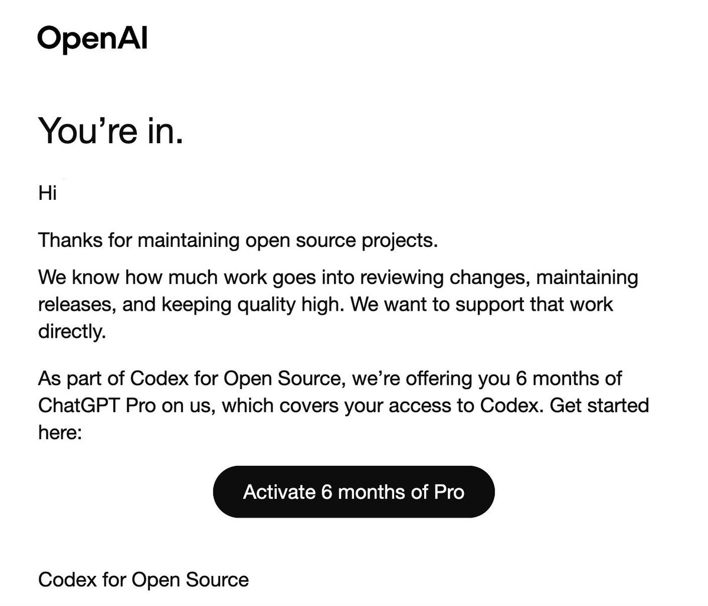
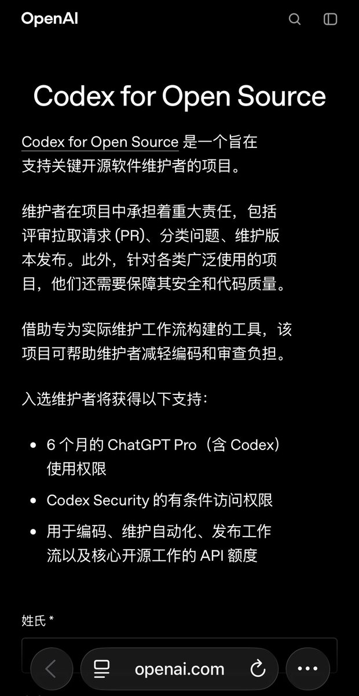

免费领6个月ChatGPT Pro，
价值$ 1200🤩

这可能是今年对开发者最实在的福利了，

没有硬性Star数要求，
有项目链接基本都能过，

只要你是任何一个公开开源项目的维护者，哪怕只有你一个人在维护，
都可以去申请试试：[openai.com/form/codex-for…](http://openai.com/form/codex-for-oss/)Uz

## 💬 Replies

### 1 @reach_vb (Vaibhav (VB) Srivastav)

*Sat May 30 21:15:10 +0000 2026*

@AYi\_AInotes Yes! If you’re a open source maintainer and can benefit from the program - do apply to Codex for OSS!

We’d love to support you with a ChatGPT Pro subscription and credits!

### 2 @AYi_AInotes (AYi) (Author)

*Sat May 30 21:42:26 +0000 2026*

@reach\_vb You've truly done something meaningful and remarkable. Thanks, bro!

### 3 @SUOHA_AI (梭哈.AI)

*Sat May 30 16:45:14 +0000 2026*

@AYi\_AInotes linux do.的老哥说可以找高星的项目做pr容易过🤣😂

### 4 @AYi_AInotes (AYi) (Author)

*Sat May 30 16:58:44 +0000 2026*

@WEB3\_furture 对，高星是容易过。但如果你有项目的话，也可以试试，反正没啥成本，填个表提交就行了

### 5 @msjiaozhu (MapleShaw)

*Sun May 31 04:50:22 +0000 2026*

@AYi\_AInotes 立马申请！

### 6 @AYi_AInotes (AYi) (Author)

*Sun May 31 04:55:27 +0000 2026*

@msjiaozhu 搞起搞起，反正就是填一个表的事

### 7 @you1873118 (serein)

*Sun May 31 03:57:55 +0000 2026*

@AYi\_AInotes 很多都没有机会

### 8 @AYi_AInotes (AYi) (Author)

*Sun May 31 05:02:24 +0000 2026*

@you1873118 它没有明确的规则，比如说你要多少星？你有做过什么样的项目？但就是我们可能都要填表试试，反正没啥成本，大概率是 AI 在审核

### 9 @saladdayyy (SaladDay)

*Sat May 30 19:11:48 +0000 2026*

@AYi\_AInotes 80k maintainer 没拿到

### 10 @AYi_AInotes (AYi) (Author)

*Sat May 30 19:15:24 +0000 2026*

@Salad95238547 我去，这都没拿到？有给你反馈是啥原因吗？

### 11 @Kedashu (AgentsChat)

*Sat May 30 18:58:34 +0000 2026*

@AYi\_AInotes 只有一个13星的，去试试看，，，

### 12 @AYi_AInotes (AYi) (Author)

*Sat May 30 19:02:07 +0000 2026*

@Kedashu 不错，试试呗，反正就是填个表，没啥成本

### 13 @Formulasearch (阿哲Phil)

*Sun May 31 02:50:36 +0000 2026*

@AYi\_AInotes 我试试去把我算命的skill用上🤣[x.com/Formulasearch/…](https://x.com/Formulasearch/status/2036789449254670699?s=20)U

### 14 @AYi_AInotes (AYi) (Author)

*Sun May 31 05:09:03 +0000 2026*

@Formulasearch 哈哈哈，验证你 skill 的这个时候到了🤣

### 15 @Khalifa007_ (خليفة | مبرمج)

*Sat May 30 18:54:36 +0000 2026*

@AYi\_AInotes I have tried they didint give me access yet

### 16 @AYi_AInotes (AYi) (Author)

*Sat May 30 19:02:41 +0000 2026*

@Khalifa007\_ Got it。你有几个项目？项目的 star 多吗？

### 17 @JunxianMaa (Dylan)

*Sat May 30 18:36:20 +0000 2026*

@AYi\_AInotes 不是最低2000star吗

### 18 @AYi_AInotes (AYi) (Author)

*Sat May 30 19:17:26 +0000 2026*

@JunxianMaa 没明确要求2000star 

### 19 @0xdeusyu (Rainman)

*Sun May 31 09:41:23 +0000 2026*

@AYi\_AInotes 那里有那么简单，我的两个项目都还没过的。

### 20 @AYi_AInotes (AYi) (Author)

*Sun May 31 11:08:15 +0000 2026*

@0xdeusyu 感觉是 AI 在审核，规则整个是个黑盒

### 21 @Blackie_zZ (Blackie)

*Sun May 31 02:41:24 +0000 2026*

@AYi\_AInotes 太好了！正好维护着一个开源工具，虽然star不算多，去申请试试，感谢分享！

### 22 @AYi_AInotes (AYi) (Author)

*Sun May 31 05:09:36 +0000 2026*

@YifeiZhou\_ 嘿嘿不错宝子，申请试试！

### 23 @hiheimu (赖叔 | LaiShu.ai)

*Sun May 31 15:45:38 +0000 2026*

@AYi\_AInotes ，，，好像我的github都是私有的。。。

### 24 @AYi_AInotes (AYi) (Author)

*Sun May 31 16:20:41 +0000 2026*

@hiheimu 挑一些公开啊，然后搞点星星，以后几个大厂应该都会去搞这种扶持

### 25 @kundocs (张坤 Harrison)

*Sun May 31 02:03:22 +0000 2026*

@AYi\_AInotes 上周申请的到现在还没动静 有谁过了吗

### 26 @AYi_AInotes (AYi) (Author)

*Sun May 31 05:15:14 +0000 2026*

@kundocs 刚有一个老哥过了，我再问问他是具体是多少新，多少项目

### 27 @Activer_cn (未知的健忘)

*Sun May 31 02:30:00 +0000 2026*

@AYi\_AInotes 是啊，OpenAI非常大方，我们项目已经30K star

### 28 @AYi_AInotes (AYi) (Author)

*Sun May 31 05:14:06 +0000 2026*

@Activer\_cn 哇塞！那你们赶紧申请呀！30K 肯定是能拿到的吧？

