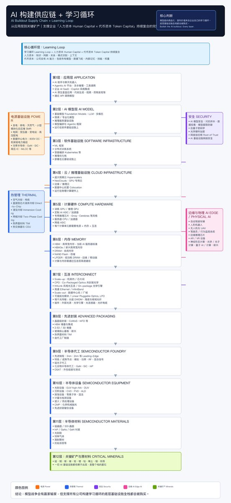

微软CEO Satya Nadella这篇文章
是我今晚睡前必须看完的，

我觉得他把AI时代公司到底该怎么活这件事，说得很透。

他说，以前的软件工具，本质上是“帮人干活的辅助工具”，
你用Word，Word不会因为你用了十年就变得更懂你，

但AI不一样——它能跟人形成一个实时循环：你给它经验，它反过来让你更强。

他用两个词来拆解这件事，

第一个叫“人类资本”，

就是公司里人的判断力、创造力、人脉、那些在走廊上聊出来的经验，

第二个叫“token资本”，

就是公司自己拥有、持续改进的AI能力。

然后他给了一句最关键的话：
人类的价值不会因为AI变强而降低，反而会变得更重要。

我当时读到这句，脑子嗡了一下，
因为它跟很多人的直觉是反的，大家都在焦虑AI会不会取代人，他说不会，因为总要有人指方向，有人做跨领域的连接，有人在模糊地带拍板，

没有人的引导，AI就是在空转。

但真正让我耳目一新的地方，是他对公司护城河的定义。

他说公司真正的护城河，不是一个更好的大模型，而应该是一个“学习循环”，就是把公司自己的工作流程、领域知识、做了十年才攒下来的判断经验，喂给AI，让它在这个过程中不断变聪明。

这个系统越用越强，慢慢变成公司独有的“机构记忆”，
别人挖不走，复制不了，

因为底层模型可以换，但这个长期积累下来的东西，谁也拿不走。

然后他说了一句让我意识到他真正在担心什么的话，

他说，如果少数几个大模型把所有行业的知识都吸走，普通公司会越来越没价值，最终只剩调用权限——就像当年全球化把制造业外包后，很多国家只剩组装线一样。

所以我反复看他这段话，发现他讲的不仅仅是技术战略，
更像是一个CEO在坦白自己最深的恐惧：别让一个行业，最后只剩下调用按钮的权力。

### 🖼️ Attached Media

## 💬 Replies

### 1 @AYi_AInotes (AYi) (Author)

*Mon Jun 15 16:10:45 +0000 2026*

感觉大模型迟早会变成标准化的水电煤，真正能拉开差距的，是每个公司自己喂出来的专属能力，别人抄不走，也带不走～

### 2 @0xSlyth (0xSlyth)

*Tue Jun 16 13:13:13 +0000 2026*

@AYi\_AInotes AI won't replace you but companies using it will

### 3 @AYi_AInotes (AYi) (Author)

*Tue Jun 16 13:14:41 +0000 2026*

@0xSlyth Yeah, that's true.

### 4 @QT9277 (阿台🕊️)

*Mon Jun 15 15:44:37 +0000 2026*

@AYi\_AInotes 这观点太戳心了，AI时代的核心竞争力果然还是人啊！

### 5 @AYi_AInotes (AYi) (Author)

*Mon Jun 15 16:10:03 +0000 2026*

@QT9277 所以说AI时代公司最容易踩的坑是花大价钱买顶级模型，却丢了自己的核心资产

### 6 @antiAIvo (纳米AI)

*Tue Jun 16 04:28:16 +0000 2026*

@AYi\_AInotes 为何
国内的大厂CEO
譬如马化腾、李彦宏、张小龙、雷军
都是技术出身➕管理能力
站在这么高的高度
为什么没有输出任何观点文章？
是国内太敏感，怕出错吗？

### 7 @AYi_AInotes (AYi) (Author)

*Tue Jun 16 04:32:30 +0000 2026*

@antiAIvo 好问题，一方面说国内没有这个氛围，另外跟中国人的中庸有关，尤其是到一定位置，都主张谨言慎行

### 8 @e177777 (Jack Sun)

*Tue Jun 16 11:56:35 +0000 2026*

@AYi\_AInotes 確實，而且微軟真的很會"賣產品" lol
但我覺得"霸權"依舊會在AI時代發揮的淋漓盡致，最強的2\~3的模型捕獲絕大數經濟價值的可能較高，微軟真的要趁現在的分發/治理/信任優勢努力些，他們的執行力真的令人擔憂...市場可不會等他們

### 9 @An_yhl (晚晚)

*Mon Jun 15 17:25:21 +0000 2026*

@AYi\_AInotes 这篇适合收藏，但睡前看容易越看越精神

### 10 @wks2307 (外壳四)

*Tue Jun 16 04:36:02 +0000 2026*

@AYi\_AInotes 所以远景不是超级智能，而是人类认知的外骨骼（在赛博朋克到来前😄）

### 11 @davidleekachiu (Jennie Lee)

*Mon Jun 15 16:39:06 +0000 2026*

@AYi\_AInotes 就是微軟做不出大模型才說這些幹話，間接認輸

