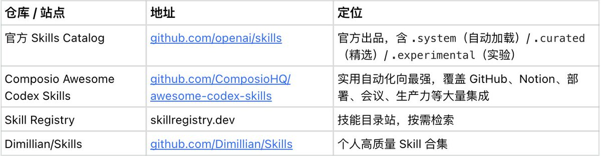
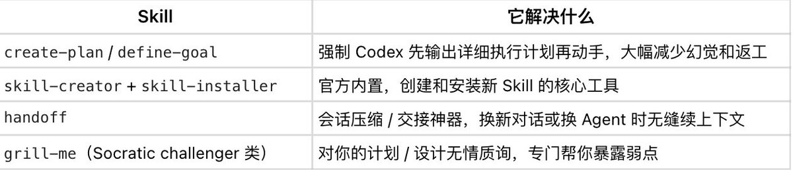
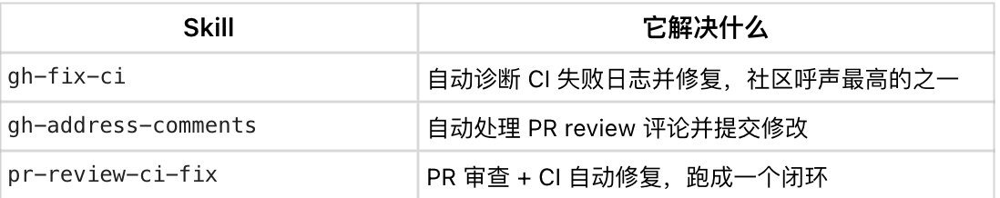
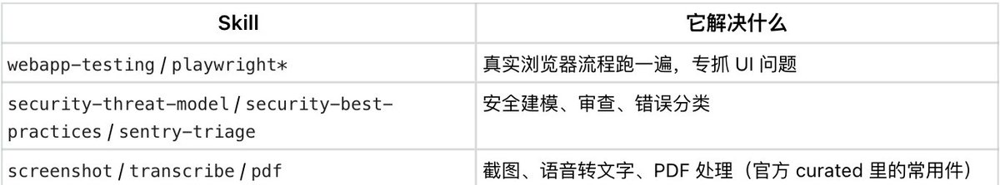
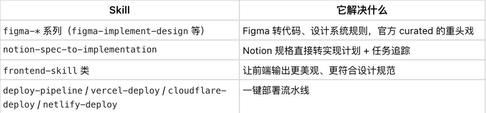
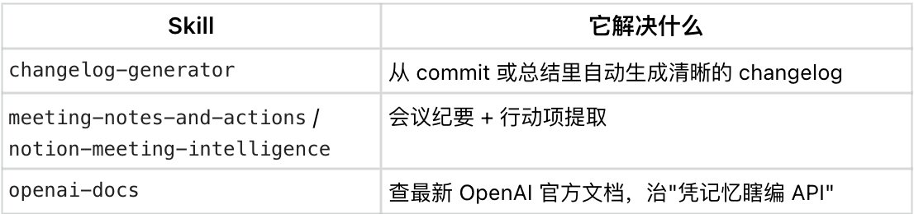
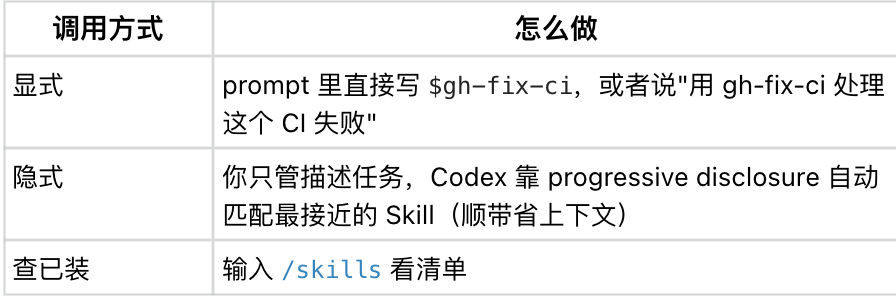
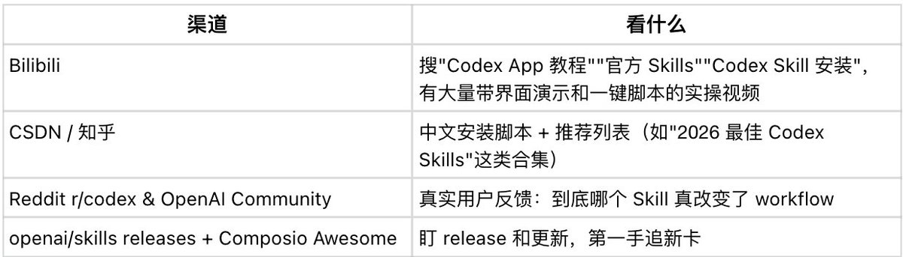

# 📰 我把全网的 Codex Skill 扒了一遍：最该装的几个、安装方法、资源仓库都整理好了，看这一篇就够了！

先说结论：装对 create-plan + gh-fix-ci 和几个核心 curated Skill，Codex 立刻从会写代码的聊天机器人变成靠谱的工程师团队。 这篇我把全网挖到的整理成五块——必 star 的仓库、按场景分的神级 Skill、保姆级安装、进阶组合技、持续追更的资源， 以及装哪几个、去哪装、怎么喊它干活，看完直接抄。

说实话，大部分人手里的 Codex，性能只发挥了一半。你让它写代码，它可以kuku写，你让它改 bug，它二话不说kuku改，但它该先规划的时候不规划，该查文档的时候却靠记忆瞎编，CI 挂了还得你一行行喂日志，初始版本质上还是个聪明点的聊天框。

## 真正把它盘活的开关，叫 Skill。

打个比方说，Skill 就是给 Agent 装的一张张岗位 SOP 卡：一个 SKILL.md（外加可选的脚本和参考资料），把遇到这类活该怎么干写死成可复用、可安装、可团队共享的标准动作。

比 prompt 工程稳定得多——你不用每次都重新念一遍咒语，Codex 自己会在合适的时候把对应的卡掏出来用。

我把官方仓库、Awesome 列表、Reddit、CSDN、B 站、Medium 翻了一遍，把那些被反复点名的神级 Skill、安装方法和资源,全给你整理在这了。

## 这篇讲五块：

## 1、必 star 的核心 Skill 仓库（去哪找）

## 2、按场景分类的神级 Skill 精选（装哪些）

## 3、保姆级安装与调用教程（怎么装、怎么喊）

## 4、进阶玩法（组合技、自定义、跨平台迁移）

## 5、持续跟进的全网资源（去哪追更新）

先把结论甩在前面，你记住这一句就行：

装对 create-plan + gh-fix-ci + 几个核心 curated Skill，Codex 就从会写代码的聊天机器人变成靠谱的工程师团队。

好了，话不多说，咱们往下扒放干货。

## 一、核心资源仓库（必 star）

找 Skill 别瞎搜，盯住下面这几个源头就够了。

1. 这张表怎么用：官方仓库管地基和精选：[github.com/openai/skills](http://github.com/openai/skills)

1. Composio 那个管花活和集成：[github.com/ComposioHQ/awesome-codex-skills](http://github.com/ComposioHQ/awesome-codex-skills)

1. 剩下两个当补充弹药库：

> skillregistry.dev 

>    [github.com/Dimillian/Skills](http://github.com/Dimillian/Skills)

两个主仓的 star 都已经过万， 20k+ 量级，热度摆在那，先 star 再说。

# 二、神级 Skill 精选（按场景装）

不用一口气全装，按你手头的活对号入座，先把高频的几张卡装上。

## 规划与元能力（最该先装的前排）

这一组是管 Codex 怎么干活的元能力层，社区几乎所有神级"单都把它们排在第一。

一句话总结这组：让 Codex 先想清楚再动手，干完能交接，方案还有人帮你挑刺，这是整套打法里收益最高的一档，可别跳过去。

## GitHub & CI/CD（工程必备）

CI 红了那一下最磨人，装了 gh-fix-ci，它自己去读日志、定位、改，你只管 review 结果——光这一个，很多人就觉得值回票价了。

## 测试、质量、安全

## 前端、设计与集成

## 生产力与内容

这些大多来自官方 .curated + Composio Awesome + 社区高赞，不是我拍脑袋选的。

# 三、安装与调用（保姆级）

## 第 0 步：先把 Codex 装到最新

\`\`\`
npm install -g @openai/codex@latest
\`\`\`

国内网络慢的话，换镜像源加速。

## 第 1 步：装 Skill（推荐用内置工具，最稳）

直接在 Codex 里喊内置的 installer：

\`\`\`
$skill-installer gh-fix-ci
$skill-installer create-plan
\`\`\`

想从 GitHub 路径精确装某一个，也行：

\`\`\`
$skill-installer install https://github.com/openai/skills/tree/main/skills/.curated/gh-fix-ci
\`\`\`

手动安装（适合批量）

把 Skill 文件夹丢到对应目录，重启 Codex 就生效：

重启方式：CLI 重开终端，App 重启应用。

> Windows 用户注意：有些教程用 PowerShell 脚本，调 .system/skill-installer/scripts/install-skill-from-github.py 来批量装官方 curated Skill，按你看到的脚本走就行。

## 第 2 步：怎么喊它干活

隐式那条是关键：装好之后你甚至不用记 Skill 名字，把活描述清楚，它自己会去翻卡。

# 四、进阶玩法（给 Agent 玩家）

到这一步，基础已经够用了，下面是几个能再上一个台阶的打法。

- 组合技：一个任务同时挂多张卡，比如 create-plan + gh-fix-ci + security-threat-model——先规划、边修 CI、边过安全，一条龙。

- 自定义神级 Skill：用 $skill-creator 快速生成，或者手写 SKILL.md，核心就一条原则——One Skill, One Job：一张卡只干一件事，输入、输出、完成标准写清楚。

- 跨平台迁移：很多 Skill 遵循开放的 Agent Skills 标准，Claude Code、Cursor 之间能互搬，基本就是把路径从 .codex 改成 .claude 的事。

- 当 coding sub-agent 用：把 Codex 塞进你的多代理系统里当强力 coding 子代理，Skill 负责具体 workflow，Codex 负责出活。

- 团队 / 仓库级沉淀：把常用 Skill 放进项目 .agents/skills/，新人一拉代码就自动拥有同一套能力——团队的隐性经验，第一次有了可以打包带走的形态。

# 五、持续跟进的资源

Skill 生态更新很快，这几个地方值得长期蹲：

# 最后

很多人还把 Codex 当一个更聪明的搜索框，问一句答一句。 

但它真正的威力从来不在那个对话框里，在你给它装了多少张会自己掏出来用的技能卡上。

只不过装备只是其中一半， Skill 会一直更新，今天的神级 Skill，半年后可能就被官方内置了。

真正能跟着你换工具、不贬值的，是另一半——你怎么判断这活该拆几步、哪张卡该上、它给的方案到底靠不靠谱。

这也是我一直在做的事：一边分享今天就能上手的 AI 实践，一边聊工具之外的那层认知，前者让你现在就用得起来，后者决定你半年后还在不在牌桌上。

工具的上限是它自己定的，你的上限是你怎么判断、怎么用它。

从混乱到清晰，我们一起慢慢来。

—— （这类能上手 + 有认知的内容我会一直发，觉得有用就关注一下 @AYi\_AInotes，也欢迎转发给在用 Codex 的朋友。）

#Codex #OpenAI #AIagent #vibecoding

（本文基于 openai/skills、Composio Awesome Codex Skills 等公开仓库，以及 Reddit、CSDN、B 站等社区资料综合整理。文中 star 数、Skill 命名、命令语法以各仓库官方页面为准，安装前建议点开链接再核一眼。）

### 🖼️ Attached Media

## 💬 Replies

### 1 @zhouluobo (zhouluobo)

*Sun Jun 07 05:43:23 +0000 2026*

@AYi\_AInotes 结尾的那段话说的真好，学习几个skill很容易，困难的是怎么掌握一种思维，我觉得相比学习skill的用法，更应该学习别人优秀skill的写作思维，掌握了这种思维，以后时代和工具再怎么变化，我们也有足够的底气。

### 2 @AYi_AInotes (AYi) (Author)

*Sun Jun 07 06:48:36 +0000 2026*

@zhouluobo 对，非常认同，这就是我一直讲的，用 AI 的最高境界是以道御术，这种思维其实就是道，有了自己的道，那 AI 在你手里就是可以一通百通的工具

### 3 @Samleoohw (派叔Ai)

*Sun Jun 07 13:51:58 +0000 2026*

@AYi\_AInotes 请教一下：多个 Skill 同时使用时，怎么避免规则冲突和上下文膨胀？

### 4 @AYi_AInotes (AYi) (Author)

*Mon Jun 08 01:10:21 +0000 2026*

@Samleoohw 不要装功能高度重叠的，比如装 3 个不同的，规划 Skill，推荐先装核心 3-5 个高频的：create-plan + gh-fix-ci + 1-2 个你日常最常用的

### 5 @hiheimu (赖叔 | LaiShu.ai)

*Sun Jun 07 14:37:11 +0000 2026*

@AYi\_AInotes 我的天！CSDN跟知乎居然能出现在帖子里。感觉这已经是上个世纪的东西了。

### 6 @AYi_AInotes (AYi) (Author)

*Sun Jun 07 15:15:56 +0000 2026*

@hiheimu 不至于啊，不是所有人都是程序员会用GitHub

### 7 @mufenglabs (沐风)

*Sun Jun 07 01:50:51 +0000 2026*

@AYi\_AInotes 值得一一体验下

### 8 @AYi_AInotes (AYi) (Author)

*Sun Jun 07 09:09:12 +0000 2026*

@mufenglabs 非常推荐。我昨天花了几个小时，把这一套必装的 skill 和教程跟大家分享出来

### 9 @TTkitty_ (兔子Chole_)

*Sun Jun 07 03:27:57 +0000 2026*

@AYi\_AInotes 我今天来试试

### 10 @AYi_AInotes (AYi) (Author)

*Sun Jun 07 09:08:57 +0000 2026*

@TTkitty\_ 搞起来啊，把自己的 Codex 配置好，就是用到了目前最顶的生产力工具

### 11 @xiao18kuma (kuma 18)

*Sun Jun 07 01:23:09 +0000 2026*

@AYi\_AInotes 装 skill 这步确实比继续调提示词更省心。

### 12 @AYi_AInotes (AYi) (Author)

*Sun Jun 07 04:43:24 +0000 2026*

@xiao18kuma 是的，它其实本质是一种 SOP 思维，就可以养成一个习惯，把日常你觉得非常好的方法，都可以沉淀，迭代成 skills

### 13 @slgxmf (Archer Sun)

*Sat Jun 06 19:08:43 +0000 2026*

@AYi\_AInotes codex插件

### 14 @Annjh666 (rspect)

*Tue Jun 16 17:59:45 +0000 2026*

@AYi\_AInotes 安装和文件归纳路径也比较重要，我现在codex所有的文件都在/文档/codex目录下，c盘剩余空间充足的情况下需不需要迁移到其他磁盘呢？有没有大佬给点建议

### 15 @yg1725906 (yg1725906 👾🛡️ 知识分享 X粉 持续耕耘中。。。)

*Sun Jun 07 12:39:13 +0000 2026*

@AYi\_AInotes 今天装了Codex, skill 那部分Codex自己解决了，我用了Agense的API，费了几个小时搞好了，想着可以免费使用图片视频生成，结果只生成了一张图片，就over了，郁闷S

### 16 @aches_cn (sehca)

*Sun Jun 07 11:24:28 +0000 2026*

@AYi\_AInotes @readwise save

### 17 @krill98090 (0xLIN)

*Sun Jun 07 09:56:21 +0000 2026*

@AYi\_AInotes 关注了哥，要不然写代码一时爽，改代码改到死

### 18 @krill98090 (0xLIN)

*Sun Jun 07 09:52:52 +0000 2026*

@AYi\_AInotes 这是CLI吗，哥我是WIN系统的APP也是同样思路吗

### 19 @ailands19 (ailands19)

*Sun Jun 07 01:29:16 +0000 2026*

@AYi\_AInotes 感谢分享👍

