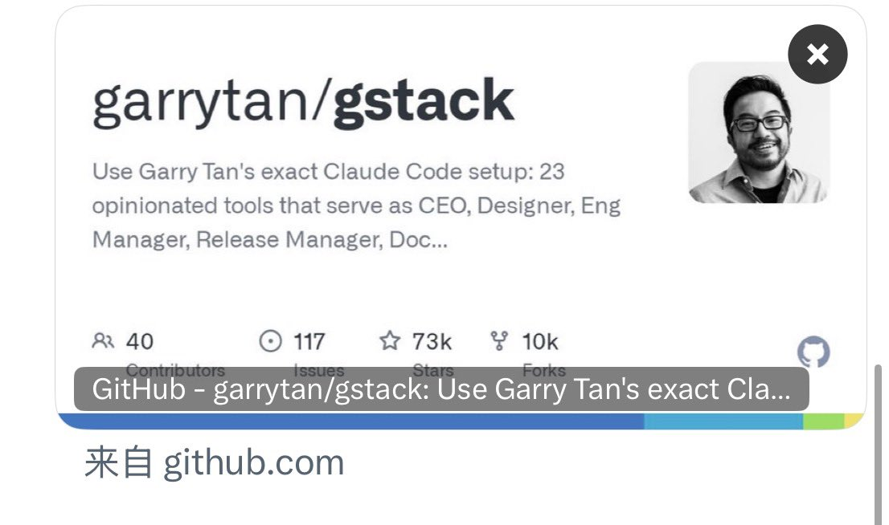

程序员兄弟们，终于有人把AI编码最致命的那个毛病给治好了，

GStack这次的困惑协议更新直接封神，而且感觉这次更新才是AI编码Agent真正该走的路。

Karpathy早就点破了AI编码的第一失败模式，关键不在代码写得有多烂，主要是在不确定的时候，永远自信地选一条错路，然后花十分钟把所有东西都推倒重来。

大部分人都经历过这种绝望，就是你去倒杯水的功夫，它已经把整个数据库schema改了，还写了三百行完全跑不通的代码，最后你删它写的东西比你自己从头写还要久🥺

Garry Tan把这个问题做成了一个产品特性，叫困惑协议，现在每一个工作流里都加了一个模糊门，遇到架构选型、数据建模、删除重构这种高代价的分叉点，它不再硬着头皮继续，它会停下来，精准地问你一个问题。

最反直觉的地方就在这里，让AI更犹豫，反而让整体效率高了好几倍，表面上看多了一次三十秒的确认 实际上避免了之后半小时甚至几小时的大返工。

这和那些让你每一步都点确认的反人类设计完全不一样，它只在猜错会真正浪费时间的地方刹车，其他时候该怎么跑怎么跑，有范围的打断好过无差别的确认。

这其实是在教AI拥有元认知，知道自己不知道，比知道很多事情重要得多。

最危险的从来不是能力差的助手。
是那种看起来很能干，永远不问问题，然后默默把事情搞砸的。

这次更新还有一个特别接地气的细节，加了CEO评审强化，在每一个停止点都反复强调只评审，不写代码。
就是为了防止代理太自作主张，把评审模式直接变成了实现模式。

这种从真实使用痛点里长出来的功能比一些抽象的智能都管用。

同时更新的还有GBrain深度集成，
所有技能执行前会先搜你的个人知识库，执行完自动把结果写回去。
AI终于有了长期记忆，不会每次都像第一次见你的项目一样。

过去一年所有人都在追全自主Agent。
觉得越不用人管越好，但GStack用行动证明了。
最好的AI永远不是替你做所有决定的老板，是知道什么时候该干活，什么时候该停下来问你的搭档。

这才是AI代理真正的成熟标志。
#GStack #AI编程 #Agent #开发者工具 #YC

### 🖼️ Attached Media

## 💬 Replies

### 1 @AYi_AInotes (AYi) (Author)

*Fri Apr 17 09:41:27 +0000 2026*

[github.com/garrytan/gstack](https://github.com/garrytan/gstack)

### 2 @mylifcc (lifcc)

*Fri Apr 17 10:08:16 +0000 2026*

@AYi\_AInotes @AYi\_AInotes 困惑协议这个方向真的关键。我在 vibeguard 里踩过这个坑：规则写了一堆，但 Agent 遇到不确定场景时还是自信地往前冲，直到跑偏才停。
后来加了个「连续三次修复失败就强制停止+上报」的守卫，比堆规则有效多了。想了解 GStack 的协议具体是怎么触发「主动暂停请示」的？

### 3 @AYi_AInotes (AYi) (Author)

*Fri Apr 17 18:17:14 +0000 2026*

@mylifcc 有共鸣，vibeguard里“三次失败强制停的守卫已经很聪明了😂  
GStack的困惑协议更狠，直接在架构/建模/破坏操作这些高危分叉点内置ambiguity gate，模糊就主动刹车问你，精准避大坑

### 4 @quangdigiaz (Quang Digi)

*Fri Apr 17 13:53:33 +0000 2026*

@AYi\_AInotes 困惑协议真是点睛之笔，让AI懂得在关键时刻先停下来问人，效率提升感受明显。

### 5 @AYi_AInotes (AYi) (Author)

*Fri Apr 17 18:02:26 +0000 2026*

@quangdigiaz 嗯嗯，得让AI学会先问再干，GStack这波真的封神🍻

### 6 @iml1s (ImL1s)

*Fri Apr 17 11:09:24 +0000 2026*

@AYi\_AInotes 這個問題一直是 AI 編碼 agent 最讓人抓狂的點——明明選了錯的路，還一路走到底。困惑協議強制在模糊節點停下來確認，聽起來簡單，但真的有效。GStack 把這個做進去是對的。

### 7 @AYi_AInotes (AYi) (Author)

*Fri Apr 17 18:14:58 +0000 2026*

@aa22396584 yeah！

### 8 @maxChen38806772 (max Cheng)

*Sat Apr 18 16:29:23 +0000 2026*

@AYi\_AInotes @readwise save thread

### 9 @ladieseman217 (ladiesman217)

*Mon Apr 20 06:40:24 +0000 2026*

@AYi\_AInotes xdm，gstack plan 了一堆后怎么执行啊？怎么没有一个执行的 command？

