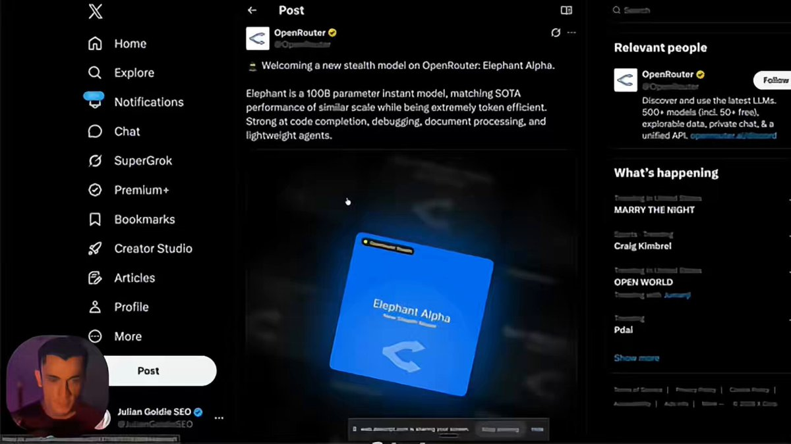

说个暴论，AI界的iPhone时刻可能就要到来了。

OpenRouter上最近杀出来一个匿名模型，把所有Agent开发者都打懵了。

它叫Elephant Alpha，没有发布会，没有营销通稿，连开发者是谁都不知道😂
纯靠用户口口相传，一周就冲到了平台日活前十，token使用量暴增377%。

我自己测了三天，结论是这他么才是2026年AI该有的样啊！

速度快到离谱，不是那种一个字一个字蹦的慢输出，是你刚敲完回车，一整段带注释的代码直接完整输出，体感和Grok 4 Fast差不多，但代码质量高一个档次。

最夸张的是智效比，同一份任务，完全相同的输出质量，它的token消耗是Claude Opus的一半，GPT-5.4的三分之一，账单是真的肉眼可见地往下掉。

它不是啥全能思考型模型，更像一个纯粹到极致的执行机器，跨十几个文件找Bug，256K上下文稳如狗，一点不丢引用。

几十页合同直接转成结构化的条款表，会议记录转待办，群聊转摘要，网页转初稿，所有你不想干的脏活累活，它干得又快又好。

唯一要注意的是它不会帮你脑补，指令越清晰，约束越明确，输出质量越爆炸，模糊的需求很容易得到平庸的结果，也不适合复杂的多步长链规划，知识时效性需要自己注入上下文。

最反直觉的地方来了，以前我们总觉得，什么活儿都得用最好的旗舰模型 ，但实际上你每天80%的工作，根本不需要Claude或者GPT的深度思考能力，你只是需要一个东西，能准确、快速、便宜地把事做完。

现在OpenClaw和Hermes社区已经形成了标准玩法，Claude管整体规划和架构设计，只调用一次。

Elephant管分步执行、局部修复、批量生成，跑一百次，整体效率翻三倍，成本直接砍到原来的十分之一甚至更低。

这才是Agent经济真正的突破口啊，以前Agent跑不起来，不是因为不够聪明，是调用一次太贵，延迟太高😟

当执行层的成本趋近于零的时候，所有自动化才真正变得可行。

更有意思的是匿名模型这个趋势，以后最好用的模型，可能都不是大厂发布会吹的那些。

OpenRouter的盲测机制，让模型纯靠真实使用数据说话，没有品牌溢价，没有营销滤镜，谁好用谁就会被用户用脚投票选出来。

社区普遍猜测这是某国产大厂的马甲在全球盲测，也侧面说明中国AI在推理优化赛道已经跑在了前面。

现在它还在盲测期，完全免费，256K上下文，32K输出，函数调用，结构化输出，全开放。

OpenRouter和Kilo Code上都能用，建议兄弟们把所有日常重复任务都切过去，把省下来的预算，留给真正需要深度推理的场景。

Elephant Alpha 是不是下一个ChatGPT 呢，我觉得不是，它更像是AI从偶尔炫技变成每天省事省钱的基础设施。

所以别再用大炮打蚊子了，模型分层才是2026年AI玩家的核心竞争力啊，
咱们工作流里有哪些活儿，其实根本不需要用旗舰模型🌚

#AI #大模型 #OpenRouter #ElephantAlpha #开发者 #Agent

### 🖼️ Attached Media

## 💬 Replies

### 1 @msjiaozhu (MapleShaw)

*Sun Apr 19 07:25:11 +0000 2026*

@AYi\_AInotes 是不是也可以本地部署了🤔

### 2 @AYi_AInotes (AYi) (Author)

*Sun Apr 19 10:44:09 +0000 2026*

@msjiaozhu 哈哈，目前还在OpenRouter盲测期，本地部署还没开放，等正式版出来看看

### 3 @MrLarus (Larus Canus)

*Sat Apr 18 09:09:53 +0000 2026*

@AYi\_AInotes Elephant是不是Qwen？

### 4 @AYi_AInotes (AYi) (Author)

*Sat Apr 18 09:44:10 +0000 2026*

@MrLarus 不知道，倒是像国内的

### 5 @shuesyanle (jeevacation)

*Fri Apr 17 22:32:05 +0000 2026*

@AYi\_AInotes 我现在写公众号，就在提示词里面加“我需要 X 上的长文风格”，出来的味就是你这么冲的文风

### 6 @AYi_AInotes (AYi) (Author)

*Fri Apr 17 23:21:28 +0000 2026*

@shuesyanle 你让 AI 写公众号用 X 长文风格？

### 7 @tonitrades_ (toni)

*Fri Apr 17 20:05:27 +0000 2026*

@AYi\_AInotes Anonymous model dropping on OpenRouter happens more than people think.

The iPhone had a face, a stage, and a price tag.

Missing all three isn't a sign of revolution - it's just missing context.

### 8 @AYi_AInotes (AYi) (Author)

*Fri Apr 17 23:31:58 +0000 2026*

@tonitrades\_ yeah，匿名模型没舞台没价格标签，但实打实把执行层成本干到接近零，2026年打工人最爱的无声革命实至名归，iPhone靠营销，Elephant靠真香 ，省钱省时，我认为基础设施时代已来

### 9 @aiworkrr (批批梯)

*Fri Apr 17 17:11:09 +0000 2026*

@AYi\_AInotes 你这篇长文的商务费多少钱？

### 10 @AYi_AInotes (AYi) (Author)

*Fri Apr 17 17:32:57 +0000 2026*

@aiworkrr 没收钱啊铁汁，就是热度高写一下，这个模型连是谁家的都不知道，看到麻烦 打钱😂

### 11 @Prmtr4IndstryAI (Prmtr4IndustryAI)

*Fri Apr 17 16:44:55 +0000 2026*

@AYi\_AInotes 速度确实快，质量就不好说了。我不写代码，用 AI 做个市场调研，大象是最拉的，其他人虽然也不准，好歹是拿搜索结果来组合，大象搜了半天，然后自己幻想了一坨内容。

### 12 @AYi_AInotes (AYi) (Author)

*Fri Apr 17 17:21:08 +0000 2026*

@frank\_AMAT 哈哈，我觉得跟他定位有关，属于又快又省又能干的执行型模型，市场调研 gemini 的深度研究更好用啊🤓

### 13 @bunnybuddy88 (巴尼巴迪)

*Sat Apr 18 08:33:28 +0000 2026*

@AYi\_AInotes 不是，你们这些营销号在吹之前，能不能自己真的去用一下🤣

就这个大象模型，在提交信息之前加个emoji这种需求，愣是把我AGENTS.md里面的内容前面加上emoji，就这能有多聪明🤣

也就扔到龙虾里面打打下手了

### 14 @AYi_AInotes (AYi) (Author)

*Sat Apr 18 09:48:53 +0000 2026*

@bunnybuddy88 你阅读理解有问题啊铁汁，谁说他多聪明了，多快好省就是龙虾做执行啊，这么便宜你还想用来干嘛，给你写代码？做啥美梦呢😁

### 15 @SoonCrush (阿速)

*Fri Apr 17 16:57:02 +0000 2026*

@AYi\_AInotes Elephant Alpha 就是一坨狗屎

### 16 @AYi_AInotes (AYi) (Author)

*Fri Apr 17 17:45:34 +0000 2026*

@SoonCrush 哈哈，具体说说宝子，我认为不是🌚

### 17 @jsyqrt (刘影)

*Fri Apr 17 17:28:06 +0000 2026*

@AYi\_AInotes Elephant Alpha vs 旗舰模型分层这个观点确实戳中痛点。以前总觉得"最贵的=最好的"，实际80%的日常任务根本不需要深度推理，效率成本比才是关键。Claude做架构 + Elephant做执行落地，这个组合思路很有启发性 👍

### 18 @AYi_AInotes (AYi) (Author)

*Fri Apr 17 17:40:23 +0000 2026*

@jsyqrt 没错铁汁，最贵的≠最好的这点现在越来越明显了😂  

推荐 Claude管架构、Elephant管执行这套分层使用方式，成本砍到十分之一，效率还翻倍，你就说香不香吧

### 19 @HuMing1980 (akechi hu)

*Fri Apr 17 17:38:58 +0000 2026*

@AYi\_AInotes 老套路……看下千问收费之后跌成啥死样。赔钱赚吆喝一两天的功夫。

### 20 @AYi_AInotes (AYi) (Author)

*Fri Apr 17 17:52:55 +0000 2026*

@HuMing1980 好久没用，千问开始收费了吗

### 21 @xinyuspace21 (Elnath)

*Fri Apr 17 17:07:19 +0000 2026*

@AYi\_AInotes 第一句话就把我蠢到了，直接切走

### 22 @AYi_AInotes (AYi) (Author)

*Fri Apr 17 17:31:18 +0000 2026*

@xinyuspace21 我没说清楚宝子， 大象可以作为 AI iPhone时刻的执行基础设施😁

### 23 @iBigQiang (强子手记)

*Sun Apr 19 07:51:40 +0000 2026*

@AYi\_AInotes 会不会是 deepseek V4

### 24 @AYi_AInotes (AYi) (Author)

*Sun Apr 19 10:31:43 +0000 2026*

@iBigQiang 有可能，DeepSeek一直在性价比、执行速度和token优化上卷到飞起

### 25 @Classpads (oneLove)

*Fri Apr 17 16:31:01 +0000 2026*

@AYi\_AInotes 很拉，根本写不了代码，做做翻译还行

### 26 @AYi_AInotes (AYi) (Author)

*Fri Apr 17 17:27:41 +0000 2026*

@Classpads 我觉得你用错了哈哈，他定位就不是思考决策模型，毕竟 token 这么便宜，有个思路 你参考看看哈哈， 大象优势是反应快和便宜，日常给龙虾配上做执行多香，我现在用 sonnet4.6，日常执行不划算，贵的要死

### 27 @QyeahDc (Qyeah Dc)

*Sat Apr 18 00:11:42 +0000 2026*

@AYi\_AInotes 有个代表产品也好，也不用这个试试，那个用一用，选定一个用就好了，不用太折腾👍

### 28 @AYi_AInotes (AYi) (Author)

*Sat Apr 18 00:31:00 +0000 2026*

@QyeahDc 没错，对咱们普通用户来说肯定是决策和切换成本越低越好

### 29 @llmdevguy (Mateusz Mirkowski)

*Sat Apr 18 14:26:19 +0000 2026*

@AYi\_AInotes I tested this model on first day and it was very strange experience. During first half of the day it was dumb as f and didn't want to answer any questions. Later it started to answer and it was OK. Very fast indeed.

### 30 @AYi_AInotes (AYi) (Author)

*Sat Apr 18 15:41:47 +0000 2026*

@llmdevguy 谢谢你的反馈bro，这个模型定位就不是思考决策模型，毕竟 token 这么便宜，优势是反应快和token便宜，日常给龙虾配上做执行挺适合

