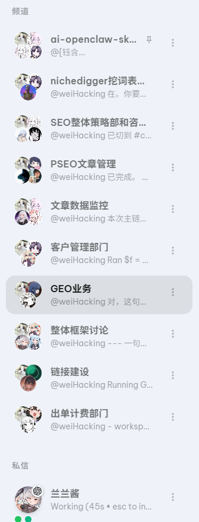

这绝对是最棒的企业 AI 转型指南，教你如何让公司彻底拥抱 AI 变革。

我看了不下50家大厂的AI转型报告，没有一个能打的，直到看到Ramp的这套玩法，我才发现绝大多数公司的AI转型，从根儿上就错了。

他们砸几千万买模型，喊一堆口号，搞强制培训，最后全变成了领导的自嗨，一线员工根本不用。

Ramp用一套完全反常识的打法，
做到了99.5%的团队活跃，非工程师贡献12%的生产代码，AI使用量暴涨6300%。

它的胜负手不是模型，也不是什么宏大战略，竟然是一套能让所有人自发用AI的自强化系统。

很多人以为AI转型是技术问题，其实首先是文化问题。

Ramp的做法简单到离谱：没有正式的变革管理，没有全员强制培训，没有KPI考核。

他们只做了三件事：
把AI使用明确为公司的基本期望，建AI guild让大家自由交流，在Slack上分享好用的技巧，在全员大会上庆祝用AI做出成果的人。
没有自上而下的命令，只有自下而上的传染。
当身边所有人都在用AI提效，你不用就会落后的时候，根本不需要有人逼你。

这是我觉得最值得所有公司抄作业的一点。
绝大多数公司的AI工具，用起来能把人逼疯：要申请权限，要走IT流程，要学复杂的操作，最后半小时过去了，还没出第一个结果。
而Ramp自建了Glass和Dojo两个平台，30+工具全部Okta SSO零配置上线，任何人打开就能用，5分钟就能拿到第一个真实的工作结果。
他们把所有的技术门槛，全部自己扛了下来。
让一个完全不会写代码的人，也能在5分钟内用AI解决自己的工作问题，这才是真正的基础设施。

最狠的设计，是这个L0-L3的熟练度阶梯。
他们把所有人的AI能力，清晰地分成了四个等级：
L0：只会用ChatGPT写邮件
L1：能用AI完成自己的日常工作
L2：能为自己的团队建工具
L3：能为全公司建基础设施
然后匹配工具的成熟度，逐步提高对不同等级的期望，配上公开的排行榜，和绩效直接挂钩。
把“用AI”这件事，从一个模糊的要求，变成了像健身一样可追踪、可量化、可升级的肌肉记忆。

最后，他们用中心-辐条的组织设计，把整个系统变成了一个不断加速的飞轮。
中心团队只负责搭平台，所有的需求全部由业务线自己驱动。
他们拥抱创造性破坏，接受工具几周就会过时，定期办大型hackathon，给所有人展示自己成果的公开舞台。
形成了“有人做工具→有人用工具→有人被启发做出更好的工具”的正反馈循环。
没有什么宏大的master plan，他们只做了一件事：从今天开始，然后双倍下注所有有效的东西。
结果就是六周之内，全公司上线了1500多个内部应用。

## 💬 Replies

### 1 @AYi_AInotes (AYi) (Author)

*Fri Apr 10 14:22:37 +0000 2026*

作为一个心理学背景，一直在研究组织与人才发展的人，这套玩法最戳我的地方，是它把AI采用，变成了一套可复制、可传染的肌肉记忆系统。
它不仅适用于企业，同样适用于我们个人的认知系统升级。

我看完直接做了三件事：
第一，用Claude Cowork模板自建了我的个人版Glass，预连了我所有的知识库和工具，零配置上线。
第二，在我的个人认知系统里，引入了L0-L3的熟练度追踪，每周做一次自查。
第三，把这套8条playbook做成了我的内容模板，以后所有关于组织AI转型的内容，都用这个框架来写。

### 2 @iml1s (ImL1s)

*Sat Apr 11 08:07:37 +0000 2026*

@AYi\_AInotes 这份企业AI转型指南来得正是时候。大多数企业失败不是因为技术不够，而是因为组织惯性。AI转型的关键第一步不是选模型，是重新定义工作流和KPI。技术是最简单的部分，人的思维转变才是真正的瓶颈。

### 3 @AYi_AInotes (AYi) (Author)

*Sat Apr 11 09:09:17 +0000 2026*

@aa22396584 真心认同，大多数企业砸钱买AI，最后卡死在老一套流程+新工具的死循环里，我觉得技术不是瓶颈，人和组织的惯性才是，把工作流和KPI彻底重塑，让AI成为每个人日常的呼吸，终有一天会跑通的那一步

### 4 @Crypto_Mst2011 (灵境 | Crypto ⚡️)

*Fri Apr 10 16:05:55 +0000 2026*

@AYi\_AInotes Ramp这套L0-L3的阶梯设计确实反常识但很多公司忽视的其实是AI工具的零配置上线。真正推动普及的不是培训，而是降低第一分钟的使用门槛。这点Ramp做得非常到位。

### 5 @AYi_AInotes (AYi) (Author)

*Fri Apr 10 16:25:53 +0000 2026*

@Crypto\_Mst2011 完全同意！  

零配置上线才是真正的杀手级设计，Ramp把所有技术坑全自己填了，让员工打开就用、5分钟出结果，这才是普及的根本👍

L0-L3只是把能力分层，真正让大家上瘾的是第一分钟的爽感

讲真，这套玩法值得所有公司在抄作业时重点学🚀

### 6 @WeiHackings (Weihacking)

*Sat Apr 11 19:56:10 +0000 2026*

这个判断我很认同。很多公司所谓的 AI 转型，一开始方向就偏了，他们想的是“统一采购一个最强模型，再自上而下推全员使用”，但真实落地不是这么发生的。AI 进入公司之后，真正能活下来的不是口号，而是那些能嵌进日常流程的小闭环，批量处理各种dirty work。
员工不是抗拒 AI，他们只是不会长期使用一个会给自己增加切换成本的东西。大多数AI工具的问题是"摩擦力"——你从工作软件切出来，打开AI，复制粘贴回去，此时学习新工具对员工来说就是一种折磨。而企业真正要做到AI化转型。
实际上有一个画面是把AI直接嵌入到工作群聊中，我这边给我的agent助手拉了多个不同频道，每个频道AI的执行SOP和记忆都是不同的，员工直接进到频道里面艾特AI工作
其实本质上解决了三个问题： 
1\. 集体工具/产出的统一性（用claudecode和codex一起在一个github生产内容，由于做了GUI，对于AI新手来说也是很无感的）
2.沟通对齐（大家都在一个系统里，人和人沟通，人和机沟通）
3.优化dirtywork，测试完成就可以作为定时任务直接扔给agent小伙伴了

### 7 @jiadehui (象道)

*Fri Apr 10 18:54:51 +0000 2026*

@AYi\_AInotes 说那么兴奋，不就是“人肉蒸馏”🤪

