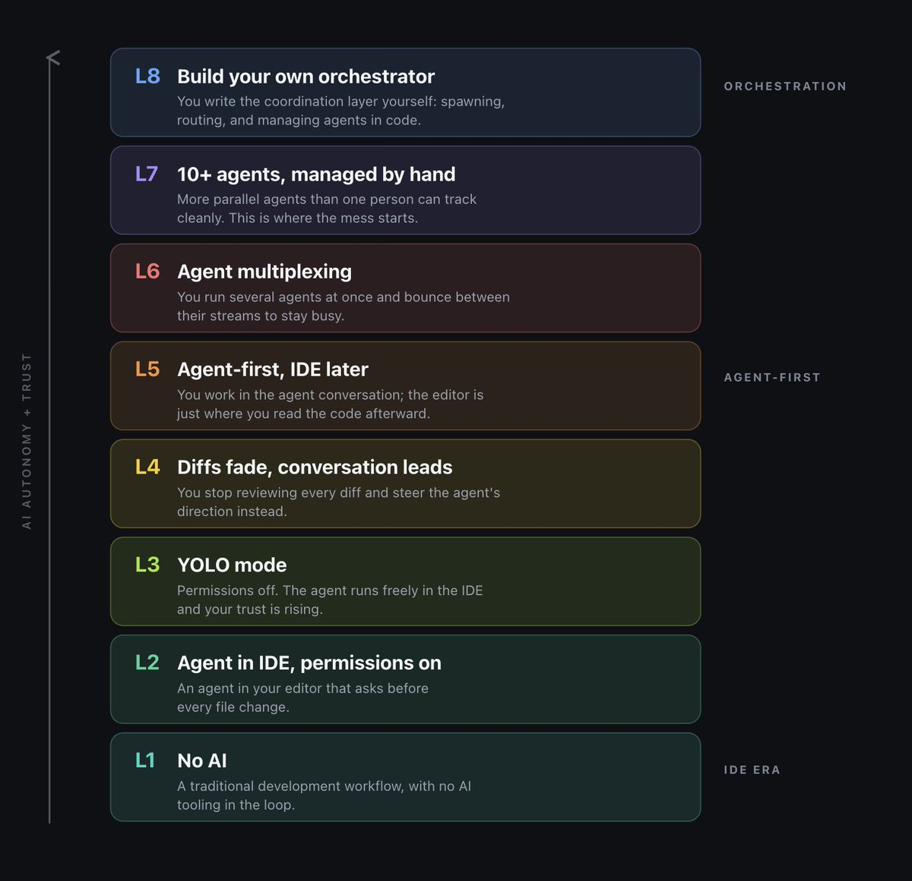
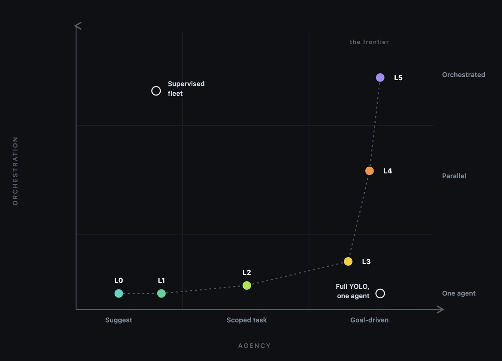
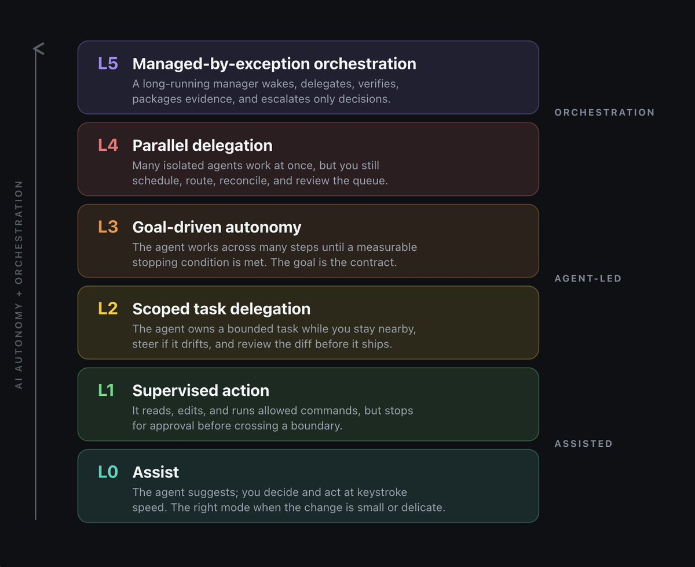
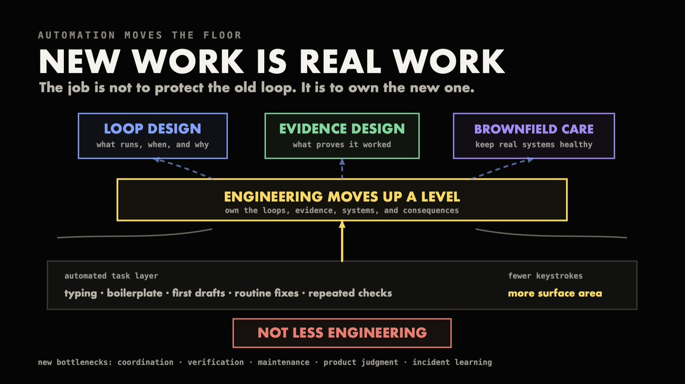

# 📰 Agentic Autonomy Levels

In most conversations about agentic engineering, the action has changed from prompting to operating. Here's a frontier looking into the fog: software factories, goals, loops, background sessions, subagents, hooks, sandboxes, agent-approving agents. For many creators of the future, this behavior will be baked into products day-1: Claude Code and Codex expose the shift directly.

From the engineer standpoint, you'll use low autonomy to limit risk and increase reversibility, but use higher autonomy for explicit activities, and fleets of parallel agents safely refactoring massive codebases. The core question about an action is always: what level does this task deserve, and what verification makes that level defensible?

The edge of the frontier is the manager agent that wakes on its trigger, delegating to its helpers while continuously verifying their output, and returning with only the decisions that must be made by a human. Folks using this kind of setup may indeed already be running hundreds or thousands of agents, largely on evergreen codebases. Like most all thinking about autonomy, how you perceive the scale is still different for everyone.

The scale most often mentioned is from Steve Yegge's single-axis ladder mentioned in "[Welcome to Gas Town](https://steve-yegge.medium.com/welcome-to-gas-town-4f25ee16dd04)" and in The Pragmatic Engineer. It's a good reference if you want a number that tells you how AI-native you are: the ladder gives you a single number to measure if you know your trust in a single agent. Here's one version of it:

In early 2026, even while work began to shift from delegation to orchesration, this was a fairly good proxy for measuring risk. Today, however, many skill sets may have increased significance and leverage when you can run many agents at once. A single rung cannot help you place multi-agent skill.

Instead, almost every autonomy debate I've seen conflates two questions that should be separated: how far away from yourself are we letting this single agent go, and what is our skill at coordinating many agents?

To capture these two dimensions separately, we'll use two axes: agency and orchestration.

On the agency axis, low includes suggesting candidate actions and waiting for a decision.

Mid means that the agent is working on a particular task, but scopes what it does, and constantly reports back what it does along with evidence, so you can keep steering it.

At the high agency end, the agent is working towards a goal, experimenting, learning, testing, finding ways to solve a problem, getting blocked, asking questions, trying different approaches, and returns all of this work in evidence.

On the orchestration axis, low means one agent, one thread. At mid, you've got several agents, each working in its own worktree, possibly working towards different goals, but isolated. At the high end, you've got an orchestrator that can take a backlog, issue tracker, schedule, or other queue, and turn it into continuous work, and you only need to step in when things fail: "management by exception." Products and features incorporating these ideas include:

- Claude Code's /plan, /goal, /loop, /background, /batch, /code-review, /security-review modes, subagents, hooks, checkpointing, agent delegation and management practices, background sessions, agent-team patterns, /schedule arguments

- Codex's local/cloud threads, Goal mode, worktrees, Automations, subagents, review panes, GitHub code review, hooks, sandboxing, Auto-review, and rerun

These capabilities don't fit onto a single ladder.

## The climb: three eras and a single stack

If you read the ladder bottom-up, you're imagining climbing both agency and orchestration at the same time. In effect, the six levels represent three separate eras that we all pass through:

First, you're in the driver's seat, and an agent mostly just helps, waiting for you to steer it.

Second, the agent takes charge of a bounded task or goal, but you're still around to steer it and verify what it does.

And third, in the era of orchestration, the system is capable of running the show, dispatching work across many agents, and you mostly need to step in when things go wrong: "management by exception."

This makes things simpler, because the vertical position on the ladder neatly captures the two axes (orchestration only kicks in near the top), leaving it as a single steady climb through the rungs. And yet, the climb is still part of a shift that we're all going through.

A good day doing engineering includes touching several rungs, sometimes more: it's normal to switch between the eras a few times in the course of a task.

## The six levels in detail

Level 0: Assist

The agent makes suggestions that are mostly good and often perfect, but you will always decide whether they're good enough to act on. Think autocomplete, inline edit suggestions, or hanging around in a chat session discussing a change that nobody has taken ownership of yet. Use for costly errors, tiny changes, or when you're forming your own judgment. Verification mostly takes place locally.

Level 1: Supervised action

The agent edits or runs commands on your behalf, asking you before executing anything consequential. This is the default posture for most people. It can be done in local sandbox with approvals before applying changes -  where each approval is an independent verification that the change is okay to apply -  or in an interactive session. Failure mode is approval fatigue; all approvals feel the same regardless of what they're approving. You might solve this by squinting at the diff, following some heuristics, checking in with another person before approving, or just agreeing to let the agent be responsible. Codex Auto-review solves this problem by delegating the final approval of boundary conditions to a separate reviewer agent.

Level 2: Scoped task delegation

Hand off a bounded task to the agent. That task will have a clear goal, constraints, and a working definition of what done looks like. You'll stay nearby, able to interrupt, but mostly not involved. This is the center of gravity in the software engineering world. Verification is shifting away from you (you may need to rest and sleep) towards evidence that the agent can produce: passing automated tests, proper types, lint suggestions, screenshots, repro steps, provenance by example, etc.

Level 3: Goal-driven autonomy

The agent does whatever it takes to achieve a goal, stopping only when some condition is met. In prompt mode, this means the prompt itself becomes the goal (e.g., "Can you reduce this page's time-to-interactive below 1 second?"). In Codex, this is Goal mode: the agent cycles through plan-&gt;act-&gt;test-&gt;review steps until it stops meeting success criteria. In Claude Code, it's the /goal, /loop, and /schedule commands. For this level to be useful, the stopping condition must be measurable in a way that can be automated.

Don't ask your agent to help with vague, wooly goals like improving user experience in general" or "make the codebase more testable." Pick something specific, measurable, and automated: find bugs in production that elude static analysis, reduce load time, ensure that we have a strict TypeScript build with no explicit anys, triage all dependencies to keep just those that we understand and which pass our tests, etc. And, finally, to find bugs in production, the agent will need to be in a production-like environment.

Level 4: Parallel delegation

Work across many agents in parallel. Each agent works on an isolated slice of the task. The biggest bottleneck at this level is decomposition: defining the right slices to delegate. Supports include: subagents, background sessions, /batch, worktrees, agent teams, etc. Failure mode is false parallelism: running many agents against overlapping slices at once, so instead of more work you get merge conflicts and duplicated decisions. To do this well, agents need to be isolated from one another, each owning their own files and status. Each needs to have its own review queue, as well. And finally, each agent incurs a cost -  in terms of tokens consumed -  proportional to the number of agents running at the same time. On the human side, orchestration tax makes the marginal cost of adding an agent go up after a few.

Level 5: Managed-by-exception orchestration

Define what success looks like, and which policies should apply. A manager agent will wake up based on triggers (e.g. new issue, new task, clock), dispatch worker agents, monitor their progress, verify output, retry on failure, escalate to more competent agents or humans when conditions are met, aggregate results, and ultimately return work products (e.g. PRs) and evidence to external systems. Think factory: the issue tracker or backlog is the input, and the product of the factory is the output (i.e. many fixed issues, bugs). Agents work in an appropriately isolated environment with lots of walls (and if needed, escape hatches), and only an operating system -  defined by the manager agent -  defines what the factory is expected to do.

The design of this operating system is left to the human; OpenAI has proposed a [spec](https://openai.com/index/open-source-codex-orchestration-symphony/) for Symphony which has a Linear board at the center: each issue gets its own agent workspace, and the agent continuously ensures that it is making progress towards its goal as defined in a spec file in its own workspace. Human review can be done at the altitude where evidence is generated, but the frontier (i.e. what is most powerful in the orchestration world) is to build continuous agent factories with hundreds or even thousands of agents. At this point in the climb, it becomes increasingly important to have independent verification: separate implementers and reviewers, separate test runners and QA, separate security checks, separate process gates for acceptance.

## Risk and reversibility set the ceiling.

I remember reading an earlier [Anthropic study](https://www.anthropic.com/research/measuring-agent-autonomy) on some of the hardest tasks with Claude Code where it asked for clarification more than twice as often as users interrupted. Experienced users (\~750 sessions vs under 50) were more likely to auto-approve and interrupt keeping an eye on the progress.

They also did a lot of broader [analysis](https://www.anthropic.com/research/claude-code-expertise) of how people use Claude Code. They looked at \~400K sessions from \~235K people between October 2025 and April 2026. From each session they could figure out the decisions someone makes like how many actions they ask for in each prompt, which of these they choose to auto-approve, how often they interrupt etc. People make \~70% of the planning decisions, but Claude does \~80% of the execution. High autonomy is not about leaving people out of the loop, but moving from having them do every step to having them decide which direction to go next.

If we want to determine whether a large AI system is operating with high autonomy, the three questions we should be asking are: 

- How quickly will we know we're wrong about what it's doing? 

- How cleanly can we undo what it's doing? 

- What would prove we're right about what it's doing? 

If the answer to all three is: not quickly, at great difficulty, and trusting the summary, it's not high autonomy.

Every run of an agent should be preceded by a contract that defines what it's trying to do. 

The goal: what we're trying to achieve (not an activity, not the technique, but an outcome). 

The scope: what domain we're operating in, and what techniques are allowed. 

Non-goals: what isn't part of the objective. 

Tools and permissions: how the agent can interoperate with the world. Stopping condition: when to stop; ideally, a measurable variable. 

Evidence: specific tests, screenshots, logs, database records or other indicators that can be used to confirm something has been done (independent of the agent). 

Escalation: who gets involved in what circumstances (including who runs the agent). 

And budget: a limit on how much time, effort and tokens are to be devoted to the task (tokens are the budget of large AI models - you can also include a limit on the number of times it can attempt the task and a limit on the degree of parallelism).

## Metrics make autonomy just a little more reliable

Deciding on metric after-the-fact is probably not enough. Metrics can be put in place in advance, in a concise doc. And that makes autonomy feel more reliable and makes the leap of faith just a little easier to take.

While there are many ways to measure success, considering tracking some version of these metrics for each level of autonomy:

- Mean time between interventions

- Longest successful unattended run with accepted work

- Share of actions run in the sandbox vs escalated

- Percentage of actions auto-approved vs rejected

- Mean number of agent actions per human instruction

- Clarification request rate Interrupt request rate

- Review time per accepted change

- Rework rate on each level of confidence

- Defect escape rate on each level of confidence

- Token cost per accepted change

Such metrics can tell a story: a single agent kept busy by human handoffs is Level 4 with a dashboard. A conservative agent, unwilling to proceed without automated intake, retries, and decent evidence, is Level 5 with a real gate.

## Think about readiness

Classify work by risk and by how easily it can be undone. Apply autonomy conservatively, rising only as evidence supporting the higher level accumulates. A payment engine refactor protected by strong tests and reviewer agents with a clean rollback path can support much higher autonomy than a documentation automation task lacking any canonical truth. The autonomy level should follow the verification process, not the task name.

## Four anti-patterns

Every system can easily fall prey to these four autonomy anti-patterns unless vigilantly avoided.

Autonomy as status -  an agent's autonomy rating becomes a meaningless badge of status. Higher autonomy is treated as proof of capability, not of safety, and agents are run hotter than verification supports. Fix: Praise and reward those who settle on the correct level of autonomy and relentlessly avoid overstepping.

Permission laundering -  the tyranny of approval fatigue leads us to grant AI agents and tools wildly broader access than necessary. Fix: Better boundaries are always a fix, such as sandbox profiles, scoped writable roots, allowlisted commands, hooks, and Auto-review.

Summary substitution -  the agent's work summary substitutes for review, assuming the summary is sufficient. Fix: Bundle the same evidence packet as with fully manual reviews (a diff, tests, logs, screenshots, reviewer findings, risks, gaps, etc.) while avoiding cognitive surrender.

Fleet cosplay -  dozens of agents run in parallel, but a human persists in orchestrating every dependency manually. Fix: Shared state, ownership rules, and better dependency tracking gradually reduce the need to coordinate manually. Smaller WIP limits force a focus on encoding and documenting the coordinated steps until orchestration becomes automated.

A calibration exercise

Review the last ten tasks you undertook with agent assistance. For each task, record the autonomy level exercised, the risk involved, how easily the work could be undone, the evidence produced to meet verification requirements, the review time, if any rework was needed, and whether the autonomy level chosen would still be a fit next time.

How to climb safely

Move up one axis at a time. Start with a single supervised agent to do a single scoped task that produces defensible evidence of success (an autonomy level 1, if tidy enough). Then gradually expand in the three orthogonal directions. Parallelize read-heavy exploration tasks (autonomy level 4). Add write agents acting on separate worktrees with constrained file ownership rules (autonomy level 4). Add recurring automations, then agent-led orchestration based on issues, voice, etc. Every step up the lever requires a new set of safety mechanisms (such as new failure modes).

Name them: Longer single-agent runs can lead to drift, context rot, dropped communication, or strayed objectives. Background work can lead to stale assumptions and weak handoffs. Too much parallel work can lead to merge conflicts or duplicated decisions. Too much recurring work can lead to silent token spend or stale prompts. Managed by exception can lead to long review queues and alert fatigue. Fix not trusting harder; instead, narrow scope, ensure better evidence, enable cheaper rollback paths, harden gates, and define clearer ownership rules.

Use the autonomy level:

- Level 0 is best for delicate work and when judgment is still being formed.

- Level 1 is best for most exploration, if the work is done close to the boundaries of what is well-understood.

- Level 2 is best for most bounded tasks, knowing there may be unknown depends and unforeseen gotchas.

- Level 3 is best where the success conditions can be stated with sufficient clarity.

- Level 4 is best when the work can be cleanly split across these success conditions.

- Level 5 is best once the coordination and communication needed across the various success conditions is fully encoded.

Verification will always be the bottleneck.

Despite current bravado and current tooling, the mature posture of an engineering team working with AI agents is calibrated autonomy. 

In the near future, we'll want to design loops that know when to work, when to verify, and when to ask -  but the skill of the engineer will still lie in choosing the right level of autonomy and in building patterns and defensible evidence that guard against its darker corners.

Note: Pangram labels this article as 100% human-written: https://www.pangram.com/history/87531e13-cd12-4cb0-9e02-9579719ddc26

### 🖼️ Attached Media

## 💬 Replies

### 1 @Tech_girl (Mari)

*Fri Jul 03 03:40:02 +0000 2026*

@addyosmani Your articles are so detailed and highly educational. 
I appreciate you addy

### 2 @addyosmani (Addy Osmani) (Author)

*Fri Jul 03 03:48:28 +0000 2026*

@tech\_girl I'm humbled if they're helpful at all :)

### 3 @Blum_OG (Blum)

*Fri Jul 03 07:34:17 +0000 2026*

@addyosmani another banger from Addy, keep it up, bro!

### 4 @addyosmani (Addy Osmani) (Author)

*Fri Jul 03 07:37:59 +0000 2026*

@Blum\_OG Thanks for checking it out!

### 5 @ngeloxyz (Angelo 🇵🇷)

*Fri Jul 03 05:33:52 +0000 2026*

@addyosmani nvm I love the title font now

### 6 @addyosmani (Addy Osmani) (Author)

*Fri Jul 03 05:39:56 +0000 2026*

@ngeloxyz I'm glad! takes a while sometimes :)

### 7 @AI_Andrew (⟁ndrew V)

*Fri Jul 03 04:53:27 +0000 2026*

@addyosmani As always, great content and lots to take away from this. High Agency the things (my) dreams are made of.

### 8 @addyosmani (Addy Osmani) (Author)

*Fri Jul 03 05:07:27 +0000 2026*

@AI\_Andrew Thanks for the kind words, Andrew! Always happy if the ideas resonate.

### 9 @BryanDieudonne (Pierre 🇭🇹 🏁)

*Fri Jul 03 10:29:36 +0000 2026*

@addyosmani @addyosmani Great post. I feel like my recent AI experiment fall between L6-L8: [bryan.ccnfts.xyz/technical-blog…](https://www.bryan.ccnfts.xyz/technical-blog/ai-agents-brain-polymarket)

### 10 @addyosmani (Addy Osmani) (Author)

*Fri Jul 03 17:04:09 +0000 2026*

@BryanDieudonne Thanks! Glad to hear the levels resonated

### 11 @vishalsingh2972 (Vishal Singh 🥑)

*Fri Jul 03 03:31:03 +0000 2026*

@addyosmani back after a while, good to see you Addy 😃

### 12 @addyosmani (Addy Osmani) (Author)

*Fri Jul 03 03:34:56 +0000 2026*

@vishalsingh2972 Thanks Vishal! Hope it's useful

### 13 @99classic99 (بـنـڛـ,ـيفُـ,ـ)

*Fri Jul 03 18:40:46 +0000 2026*

@addyosmani another banger from Addy, keep it up, bro! 👌🏻👌🏻

### 14 @addyosmani (Addy Osmani) (Author)

*Fri Jul 03 20:24:26 +0000 2026*

@99classic99 Glad if it was useful at all!

### 15 @shomilh7 (علي محمد)

*Fri Jul 03 19:32:42 +0000 2026*

@addyosmani بالتوفيق لهم جميعامدرب ولاعبين

### 16 @0xQuantCat (Quant Cat)

*Fri Jul 03 13:22:10 +0000 2026*

@addyosmani Great read

### 17 @Tomce544 (Lil Villa)

*Fri Jul 03 05:28:38 +0000 2026*

@addyosmani -1 autonomy level. Copy paste output from Chatgipiti web interface.

### 18 @samoye95 (Uncle Samuel Sharpe)

*Fri Jul 03 05:04:16 +0000 2026*

@addyosmani I am in the Agent Multiplexing stage. Because I am not ready to surrender cognitively to the Agents.

### 19 @pmvikastiwari (Vikas Tiwari)

*Fri Jul 03 16:10:38 +0000 2026*

@addyosmani do what u do best. keep writing these detailed education pieces. invaluable.

### 20 @Koukyosyumei (Koukyosyumei)

*Fri Jul 03 15:22:17 +0000 2026*

I think there is another axis that becomes critical as orchestration gets more advanced: auditability.

At low orchestration, reviewing the final diff may be enough. But once you have multiple agents, worktrees, background loops, schedules, and “management by exception,” you need to know what actually happened across the run.

Which agent touched what?
What prompt or goal produced the change?
What commands ran?
What policy was enforced?
Who or what reviewed it?
Can the result be replayed or audited later?
That is the layer we are building with h5i: auditable workspaces for AI coding agents.
Git records the diff. h5i records the agent run behind it.
[github.com/h5i-dev/h5i](http://github.com/h5i-dev/h5i)

### 21 @tatsuhara1029 (たつはら｜Zaivern Code開発者)

*Mon Aug 10 23:17:20 +0000 2026*

@addyosmani This “false parallelism” failure mode is exactly what I benchmarked.

64 agents edited overlapping regions of one 2,000-line file:

Plain Git: 48 conflicted branches / 960 lines
Line-level ownership: 0 / 0
Results, limitations and repro:
[github.com/tacyan/zaivern…](https://github.com/tacyan/zaivern-code)

### 22 @unbug (unbug)

*Sat Jul 04 12:28:15 +0000 2026*

@addyosmani missing long horion and dynamic flow

### 23 @arielsp11 (Ariel Conti)

*Fri Jul 03 10:18:06 +0000 2026*

I have been thinking about this a lot recently and the interface side of this is just as unsettled, none of the current products ship something good enough to make it easier to climb and understand the ladder, different vocabularies across the main projects that dont agree across cli/ide/app - this might also be something we want to think on how to design

### 24 @StuyBoyNY (StuyBoy From NYC)

*Fri Jul 03 16:05:34 +0000 2026*

@addyosmani @readwise save

### 25 @r_almsha46218 (صمت المشاعر🎶)

*Tue Aug 04 13:28:39 +0000 2026*

@addyosmani [x.com/i/status/20846…](https://x.com/i/status/2084627979536044400)

### 26 @igorfomich (Igor Fomenko)

*Fri Jul 03 15:09:08 +0000 2026*

@addyosmani i find the two axis view useful because it forces me to write explicit contracts before letting an agent run.  
in my recent work the biggest pain point is defining clean rollback hooks for level 4 parallel tasks

### 27 @haricane8133 (Hari Rajesh)

*Fri Jul 03 08:37:13 +0000 2026*

@addyosmani @addyosmani, checkout this when you have time

[x.com/haricane8133/s…](https://x.com/haricane8133/status/2068727110747983976)

### 28 @ron_shub (Ron Shub)

*Tue Jul 07 11:19:57 +0000 2026*

@addyosmani agree! We had something similar- once agents run in parallel, landing becomes the bottleneck. we made the merge queue an agent too- batches, lands, self-reviews. went from 4 PRs in 2h to 32 😮 
we open sourced the skill here[x.com/ron\_shub/statu…](https://x.com/ron_shub/status/2074444393457627421)m

### 29 @ShanatnuY (shanatnu yadav)

*Thu Jul 09 12:42:44 +0000 2026*

@addyosmani nice

### 30 @josephajilore (Joseph Ajilore)

*Fri Jul 03 11:58:53 +0000 2026*

@addyosmani Great article! This is the end game and exactly why I am building @useverdikt to answer the trust question. Would love your thoughts on it?

### 31 @getnestrasleep (Nestra - Recovery Pillows)

*Fri Jul 03 20:12:45 +0000 2026*

@addyosmani saw this and immediately thought , that's me at 3am with a herniated disc. took me years to learn the hard way: bad sleep posture is a slow spine killer. your mattress + pillow combo matters more than any gadget.

### 32 @RajivRanja5423 (Rajiv Ranjan Kumar)

*Sat Jul 04 03:33:28 +0000 2026*

@addyosmani [vantagemarkets.com/open-live-acco…](https://www.vantagemarkets.com/open-live-account/?affid=MTA3NTEy&invitecode=fS0zdnnR)

