# 📰 Vibe Coding 网页动效词典（上篇）：教你准确描述页面怎么动

来源：[X 状态](https://x.com/AdrianPunk115/status/2099485951701721585) · [X 文章](https://x.com/i/article/2098669987930210304)

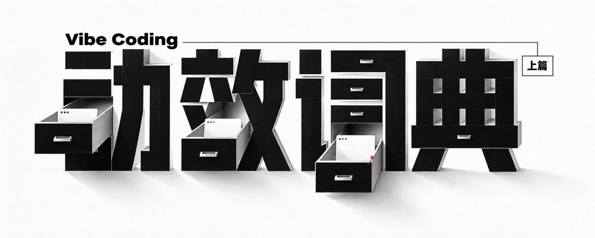

你让 AI“给网页加点高级动效”，它通常会把标题、图片和卡片一起淡入。

页面动了，但所有东西一个节奏、一个方向，还是很像模板。

Vibe coding 做动效，最容易卡在表达上。你脑中能看到效果，却叫不出它的名字；只会说“丝滑一点”“高级一点”“像苹果官网那样”，AI 只能根据自己的理解发挥。

把描述换成下面这样，执行方向会清楚很多：

> 页面打开时，主标题使用按行显现（Line reveal），说明文字随后淡入（Fade in），三张卡片交错出现（Stagger）。整体柔和、克制，正文不要逐字播放。

接下来先讲什么动作会触发动效，再进入内容入场和文字显现。读完以后，你会知道鼠标悬停、滚动、点击和状态变化该怎样描述，也会分清淡入（Fade）、滑入（Slide）、交错出现（Stagger）、模糊显现（Blur reveal）和按行显现（Line reveal）。

# 一、先认识 UI、UX 和 Vibe coding

## UI：用户界面

UI 是 User Interface 的缩写，中文叫“用户界面”。按钮、卡片、导航栏、输入框、弹窗、图标、颜色、字体和页面布局，都属于 UI。

## UX：用户体验

UX 是 User Experience 的缩写，中文叫“用户体验”。它关注页面用起来是否顺畅：用户能不能看出哪里可点，操作后有没有反馈，键盘和手机能不能正常使用，动画会不会干扰阅读或引起眩晕。

UI 更接近“页面长什么样”，UX 更接近“页面用起来怎么样”。网页动效同时影响两者：它能改变画面，也能解释操作结果。

## Vibe coding：用自然语言描述网页

Vibe coding 是用自然语言描述页面、行为和功能，让 AI 生成、修改并调试代码。描述越具体，AI 越容易做出你脑中的画面。

“有科技感”只是一种感受。“深色背景、标题按行显现、卡片依次进入、按钮悬停时出现磁吸反馈”才包含可以执行的动作。

# 二、网页动效的四层结构

看到一个网页效果，可以沿着四层往下拆：

- 技术工具： 用什么实现，例如 CSS、Motion、GSAP、Three.js、Lottie、Rive。
- 触发方式： 什么动作让动画开始，例如 Hover、Scroll、Pointer、Gesture、Route。
- 动效类型： 页面具体怎么动，例如淡入（Fade）、交错出现（Stagger）、视差滚动（Parallax）、磁吸光标（Magnetic cursor）。
- UX 规则： 动效怎样帮助用户，例如 Feedback、Affordance、Focus、Reduced motion。

四层各自回答一个问题。Motion 是实现工具，鼠标悬停（Hover）是触发方式，磁吸按钮（Magnetic button）是动效类型，减少动效（Reduced motion）是使用边界。把它们混在一起，AI 很容易选错实现方式或漏掉移动端处理。

这套词典会按四层顺序往下讲。上篇先讲工具、触发方式和第三层的基础部分；滚动、空间、鼠标跟随、组件反馈与页面转场会在后续继续补齐。等第三层的常用动效讲完，最后再进入 UX 规则。

# 三、第一层：技术工具——用什么实现

工具决定代码怎样完成效果。先记住下面六种常见分工：

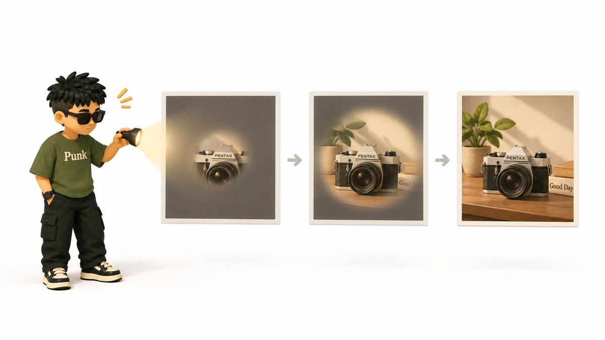

如果你不知道当前项目用了什么，直接告诉 AI：

> 先检查当前项目的技术栈，优先复用已有方案。简单动效优先使用 CSS，不要为了一个淡入或悬停效果额外安装大型动画库。

工具名称的作用是帮 AI 选实现路径。描述动效时，仍然要告诉它由什么触发、画面怎样变化。

# 四、第二层：触发方式——什么时候开始

触发方式决定动画什么时候开始。同一种淡入（Fade），可以在页面打开时播放，也可以在内容滚入视口、鼠标悬停或状态变化时播放。

网页里常见的触发方式包括鼠标悬停、键盘焦点、点击或轻触、指针移动、页面滚动、拖拽手势、页面切换、状态变化和定时播放。下面从最常见的鼠标悬停开始，逐个讲清楚它们分别在什么情况下使用。

## 1. 鼠标悬停（Hover）

Hover 指光标停在一个元素上方。它只说明什么时候触发，悬停之后是变色、抬升、显示图片还是产生磁吸，需要继续写明。

常见的 Hover 触发写法：

- 进入悬停（Hover enter）： 光标刚进入元素时开始动画。
- 离开悬停（Hover leave）： 光标移出后反向播放或恢复原位。
- 持续悬停（Hover state）： 光标留在元素上方时保持另一种状态。
- 悬停意图（Hover intent）： 光标停留片刻后才打开菜单，减少误触。
- 父级悬停（Group hover / Parent hover）： 鼠标放在整张卡片上，内部标题、图片和箭头一起响应。
- 临近触发（Proximity hover）： 光标还没进入元素，只要靠近一定范围就开始轻微响应。

Hover 经常和这些效果组合：

- 悬停显现（Hover reveal）： 显示说明、按钮、遮罩或第二张图片。
- 悬停抬升（Hover lift）： 卡片轻微上移，同时改变阴影。
- 悬停替换（Hover swap）： 图片、文字或图标切换成另一种内容。
- 悬停下划线（Hover underline）： 链接下划线从一侧展开。
- 悬停倾斜（Hover tilt）： 卡片根据光标位置产生轻微立体倾斜。
- 磁吸悬停（Magnetic hover）： 按钮或文字向光标方向靠近，移开后回位。

提示词例子：

```
切换标签页时使用交叉淡化（Crossfade）：旧内容淡出的同时，新内容在相同位置淡入。保持容器高度稳定，快速切换时取消上一段未完成动画。
```

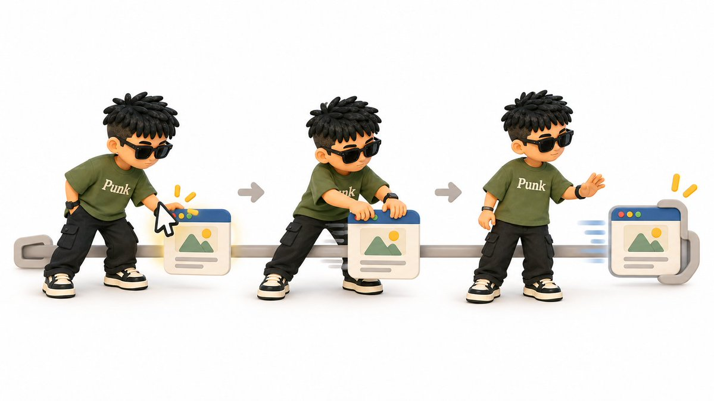

## 2. 键盘焦点（Focus）

Focus 指用户用键盘 Tab 键移动到按钮、链接或输入框。它和 Hover 都能表示“当前正在关注这个元素”，但 Focus 服务于键盘操作，也可能在点击输入框后出现。

常见写法包括：

- 焦点（Focus）： 元素获得操作焦点。
- 可见焦点（Focus-visible）： 主要在键盘操作时显示焦点环，避免鼠标点击后到处出现轮廓。
- 内部焦点（Focus-within）： 表单或搜索框中的子元素获得焦点时，整个容器一起高亮。

提示词例子：

```
主标题使用按行显现（Line reveal）。每行从下方轻微进入，按照阅读顺序依次出现；保持句子完整，不要拆成单个字符。
```

## 3. 点击、轻触与按住（Click / Tap / Press）

Click 是鼠标点击，Tap 是触屏轻触，Press 或 Active 是按钮正在被按住的瞬间。它们经常被混写，结果是 AI 只做了点击后的动作，漏掉按下反馈和再次点击后的状态。

常见类型：

- 单击或轻触（Click / Tap）： 执行一次操作或打开内容。
- 按下状态（Press / Active）： 按住时按钮轻微收缩，松开后执行操作。
- 开关切换（Toggle）： 第一次点击打开，第二次点击关闭。

```

当功能卡片进入视口（In view）后触发入场动画，每张卡片只播放一次。不要等到卡片完全进入屏幕才开始；用户向上滚动返回时保持最终状态，不重复闪烁。
```

- 双击（Double click）： 连续点击两次后触发，网页里应少量使用。
- 长按（Long press）： 持续按住后打开菜单或进入特殊状态，主要用于触屏。

提示词例子：

```
谁触发
→ 在什么条件下开始
→ 触发后使用什么动效
→ 结束或离开后怎样恢复
→ 键盘和触屏怎样替代
```

```
请为页面建立统一的动画时长：按钮和图标短促，卡片与菜单适中，主视觉揭示稍慢。先使用常见网页参数，保证连续操作时不会让用户等待。
```

## 4. 指针位置、移动与距离（Pointer）

Pointer 是鼠标、触控笔等指针设备的统一叫法。它可以读取光标的位置、移动方向、速度和与元素之间的距离，因此比普通 Hover 更适合鼠标跟随、视线跟随和互动背景。

常见类型：

- 指针移动（Pointer move）： 光标移动时持续更新动画。
- 位置映射（Pointer position）： 把光标横纵坐标映射到倾斜角度、光照或渐变中心。
- 距离感应（Pointer proximity）： 越靠近元素，效果越明显。
- 移动方向（Pointer direction）： 根据光标从哪一侧进入，决定图片或文字的进入方向。
- 移动速度（Pointer velocity）： 光标移动越快，拖尾、拉伸或惯性越明显。

提示词例子：

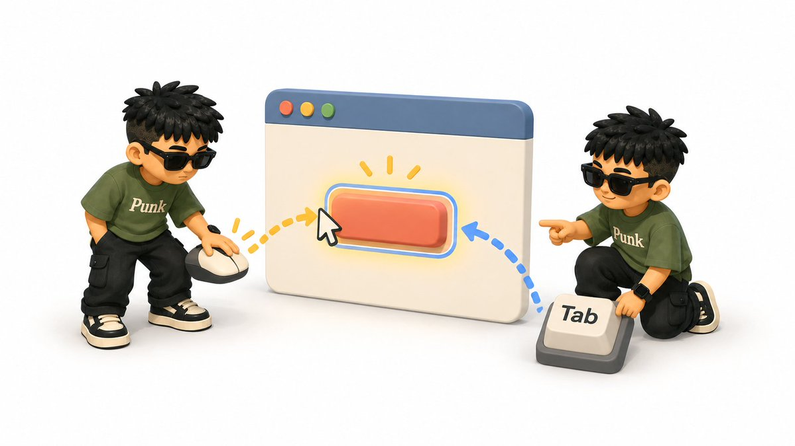

## 5. 进入视口（In view / Scroll-triggered）

进入视口指页面滚动到某个位置后，元素出现在屏幕可见区域，此时播放一次动画。它适合标题、卡片、数据和章节内容入场。

描述时还可以补充：

- 进入视口（Enter viewport）： 元素进入可见区域时开始。
- 离开视口（Leave viewport）： 元素滚出屏幕后触发离场或复位。
- 播放一次（Once）： 第一次看到时播放，往回滚动不重复。
- 重复播放（Replay）： 每次重新进入视口都播放。
- 滚动方向（Scroll direction）： 向下和向上滚动时使用不同状态。
- 触发位置（Trigger point）： 元素刚露出、进入一部分或接近屏幕中央时开始。

提示词例子：

```
首屏标题使用模糊显现（Blur reveal），从轻微模糊逐渐变清晰，同时淡入并小幅上移。只用于主标题和重点图片，正文保持稳定清晰。
```

## 6. 跟随滚动进度（Scroll-linked）

跟随滚动进度指动画和页面滚动直接绑定。用户滚动一部分，动画也只完成相应部分；用户往回滚，动画同步倒放。

常见搭配：

- 滚动驱动（Scroll-driven）： 使用滚动位置控制动画进度。
- 进度同步（Scrub）： 动画紧跟滚动，也可以加入少量跟随延迟。
- 固定内容（Pin）： 某个区块暂时固定，旁边内容继续变化。
- 滚动进度（Scroll progress）： 用进度条、章节编号或图形变化显示阅读位置。

这里要分清：进入视口（Scroll-triggered）像按下播放键，触发后动画自己播完；跟随滚动（Scroll-linked）像拖动视频进度条，滚到哪里就播放到哪里。

提示词例子：

```
提交表单后，根据状态变化（State change）切换反馈：加载时按钮显示处理中，成功后变成完成状态，失败时显示错误提示。各状态平滑衔接，错误信息不能只靠颜色区分。
```

```
图片卡片支持拖拽手势（Drag）：拖拽时跟随指针，松开后吸附到最近位置；快速向左滑动（Swipe）时切换到下一张。设置明确边界，避免与页面纵向滚动冲突。
```

## 7. 拖拽、滑动与缩放手势（Gesture）

Gesture 指用户直接操纵元素。它比“点击后播放一段动画”更接近真实物体，元素需要跟手移动，并在松开后吸附、回弹或继续滑行。

常见类型：

- 开始拖拽（Drag start）： 按住元素，进入可拖动状态。
- 拖拽中（Drag move）： 元素跟随手指或鼠标移动。
- 结束拖拽（Drag end）： 松开后吸附到目标位置或回到原位。
- 快速滑动（Swipe）： 根据滑动方向切换卡片、图片或页面。
- 双指缩放（Pinch）： 两指靠近或分开，控制图片和画布缩放。
- 旋转手势（Rotate）： 两指旋转对象，多见于图片和设计工具。

交给 AI：

```
产品拆解区使用跟随滚动进度（Scroll-linked）：页面向下滚动时，产品图按照滚动进度逐步展开；向上滚动时同步倒放。该区块暂时固定（Pin），滚动结束后自然释放。
```

```
图片使用蒙版显现（Mask reveal），通过柔和渐变蒙版从中央向外显现。边缘保持自然，不要出现生硬矩形；只用于主视觉区域。
```

## 8. 页面加载与路由切换（Load / Route）

页面首次打开、组件挂载和页面切换也能触发动画。这类触发决定首屏怎样进入，以及离开旧页面、进入新页面时如何衔接。

常见类型：

- 页面加载（Page load）： 首次打开页面时播放。
- 组件挂载（On mount）： 某个组件被加入页面时播放。
- 进入页面（Route enter）： 新页面出现时触发。
- 离开页面（Route exit）： 旧页面关闭前触发。
- 转场完成（Transition complete）： 页面切换结束后，再播放内部内容。
- 数据就绪（Data ready）： 数据加载完成后，从骨架屏切换到真实内容。

提示词例子：

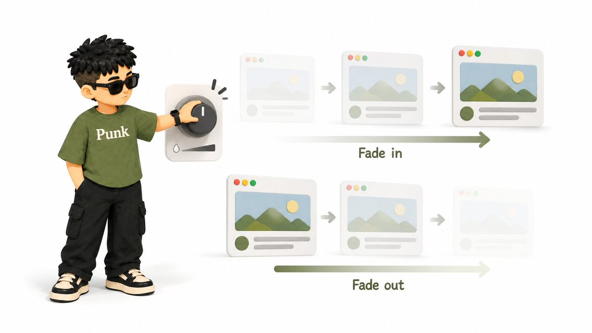

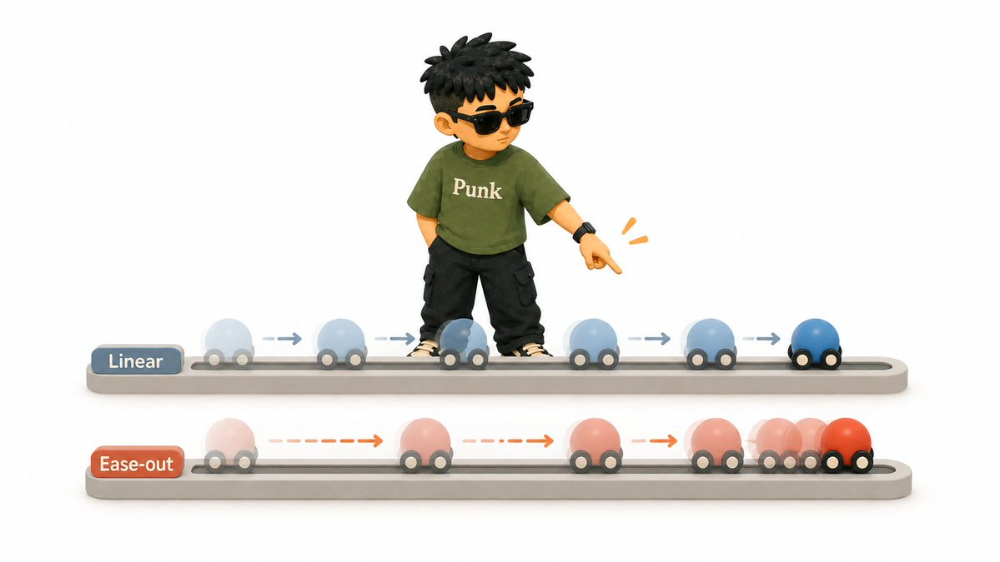

## 9. 组件状态变化（State change）

组件从一种状态变成另一种状态，也会触发动效。它常用于解释“刚才的操作带来了什么变化”，比纯装饰动画更重要。

常见状态：

- 展开与收起（Expand / Collapse）
- 选中与取消（Select / Deselect）
- 加载、成功与失败（Loading / Success / Error）
- 开启与关闭（On / Off）
- 内容更新（Content update）
- 数值变化（Value change）

提示词例子：

---

---

## 10. 延时、自动播放与空闲（Timer / Idle）

有些动画不等待用户操作，而是在经过一段时间、页面空闲或上一段动画结束后自动开始。轮播、提示消失、演示动画和循环背景常用这种触发。

常见类型：

- 延时开始（Delay）： 等待片刻后播放。
- 自动播放（Autoplay）： 页面就绪后自动开始。
- 定时切换（Interval）： 每隔一段时间更新内容。
- 空闲触发（Idle）： 用户一段时间没有操作后播放提示或环境动画。
- 循环播放（Loop）： 动画完成后重新开始。

自动播放不要抢走用户的控制权。用户开始操作、切换标签页或开启减少动效后，持续动画应该暂停或简化。

提示词例子：

```
交错显现：staggered reveal
子元素交错：stagger children
依次入场：sequential entrance
级联动画：cascade animation
```

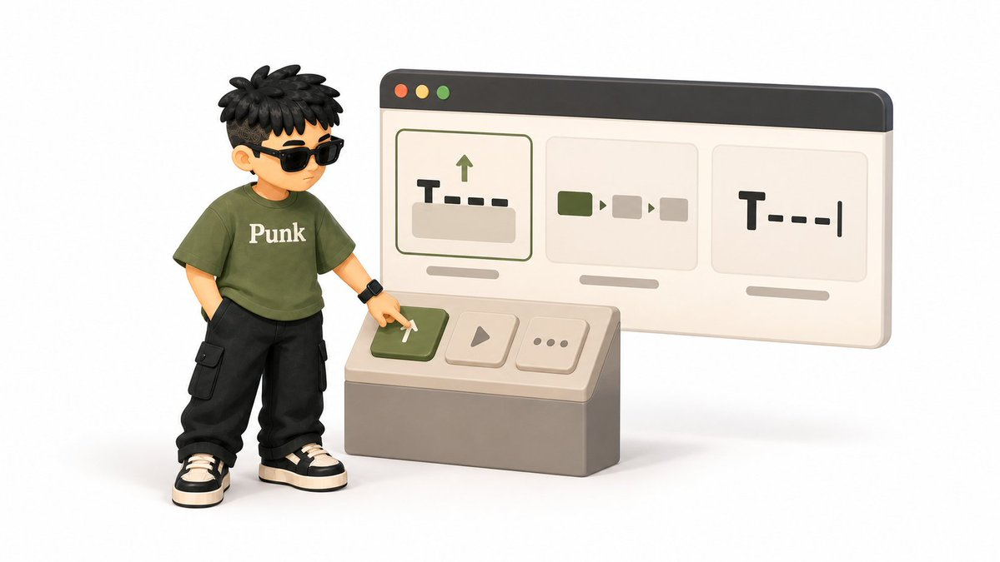

描述触发方式时，可以沿着这条顺序检查：


```
进入新页面（Route enter）时先完成页面容器的淡入，再播放标题和卡片入场；离开页面（Route exit）时快速收起。用户连续切换页面时取消尚未完成的动画，不能阻塞导航。
```

# 五、第三层：动效类型（第一部分）——页面具体怎么动

接下来是词典的主体。每个词条都会说明画面表现、常见变体、适用位置，并附上一句可以直接交给 AI 的描述。

## A. 控制动画手感的五个词

这一组词不决定元素往哪里移动，它们控制动画的速度、等待时间、先后顺序和回弹感。相同的 Fade 动画，换一套 Duration 和 Easing，给人的感觉会完全不同。

## 1. Easing：缓动

Easing 决定动画怎样加速和减速。完全匀速的物体看起来像被机器拖动；加入缓动后，启动和停下会更自然。

常见类型：

- Linear：匀速。 适合进度条、持续旋转和跑马灯。
- Ease-in：慢慢加速。 常用于元素离开画面。
- Ease-out：开始较快，结束时慢下来。 按钮、菜单和内容进入时很常用。
- Ease-in-out：两头慢，中间快。 适合来回移动和状态切换。
- Cubic-bezier：自定义速度曲线。 用来调出更具体的品牌手感。

适合： 几乎所有移动、缩放和显隐动画。刚开始可以先选减速缓动（Ease-out），页面通常会比匀速自然。

提示词例子：

```
章节切换时使用擦除转场（Wipe transition）：一个纯色遮罩从左向右扫过，覆盖旧内容后带出新内容。动作清楚、节奏利落，用户快速导航时允许跳过。
```

```
首屏按照阅读顺序进入：主标题先出现，说明文字经过短暂延迟（Delay）后出现，按钮最后进入。延迟只用于建立层级，不能让用户明显感觉在等待。
```

## 2. Duration：时长

Duration 是一次动画从开始到结束持续多久。按钮和图标需要迅速反馈，弹窗和卡片可以稍慢，大图揭示和页面转场还能再柔和一点。

时长先记住三档：

- 短促： 按钮、图标、开关、按下反馈。
- 适中： 卡片进入、菜单展开、弹窗出现。
- 偏慢： 大图揭示、品牌首屏、页面转场。

适合： 所有动画。页面里应该有统一的快慢关系，避免一个按钮很快，旁边另一个按钮慢吞吞。

提示词例子：


## 3. Delay：延迟

Delay 指动画触发后先等待一会儿，再开始播放。它经常用来建立阅读顺序，例如标题先出现，说明文字稍后出现，按钮最后出现。

常见用法：

- 标题出现后，正文稍晚开始。
- 弹窗背景先变暗，弹窗内容随后出现。
- 图片加载完成后，文字再显现。
- 页面转场结束后，再播放新页面内容。

适合： 少量元素之间的先后关系。等待太久会让用户误以为页面卡住，因此按钮点击、加载和错误反馈不要随意增加延迟。

提示词例子：

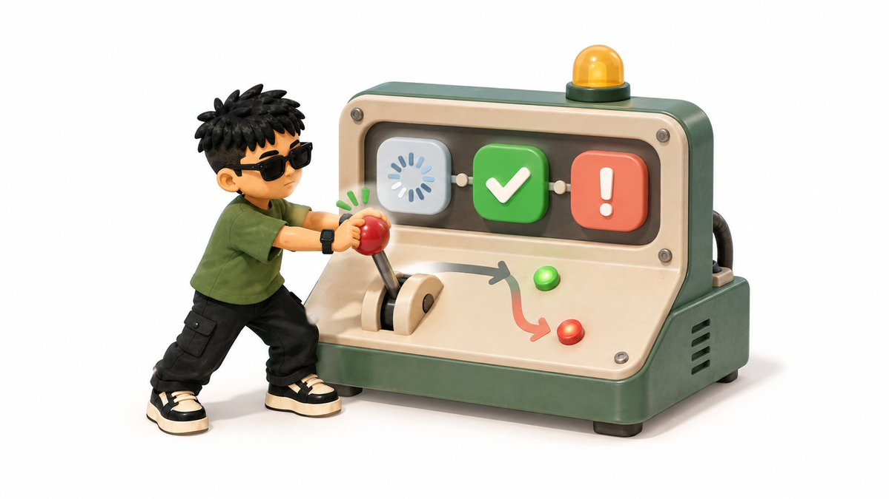

```
按钮被按下时显示短促的按压反馈（Press），松开后执行操作；筛选按钮使用开关切换（Toggle），再次点击恢复默认状态。触屏使用轻触（Tap），不要依赖双击完成主要操作。
```

## 4. Stagger：交错出现

Stagger 指一组相似元素依次开始动画，中文常叫“交错出现”或“错峰动画”。Delay 通常控制一个元素等待多久，Stagger 负责给列表中的每个元素自动错开一点时间。

常见类型：

- 卡片从左到右依次出现。
- 列表从上到下依次出现。
- 导航菜单逐项展开。
- 标题按行、按词或按字符出现。
- 数据柱按照顺序增长。

常见英文写法：

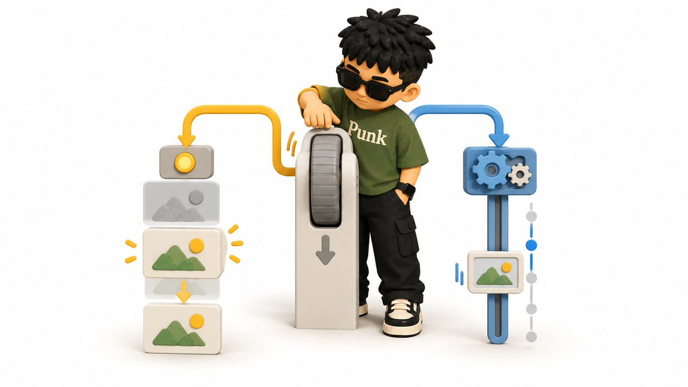

适合： 卡片列表、菜单、照片墙、数据面板、步骤流程和文字标题。整组要像连续动作，间隔太大会变成排队等候。

提示词例子：

---

```
页面内容进入时使用柔和的减速缓动（ease-out），开始响应要及时，结束时慢慢停稳。持续旋转和进度动画保持匀速（linear），不要让所有动画使用同一种缓动。
```

## 5. Spring：弹簧动画

Spring 模拟物体的惯性和回弹。它常用于拖拽回位、按钮按下、弹窗出现和卡片吸附，画面会比普通缓动更有重量。

常见手感：

- 少量回弹： 越过终点一点，很快停稳。
- 偏硬： 响应快，适合按钮和开关。
- 偏软： 移动柔和，适合卡片和拖拽回位。
- 果冻感： 来回弹动明显，只适合少量趣味页面。

专业参数包括 Stiffness、Damping、Mass 和 Initial velocity。描述时只要说明“少量回弹”“快速停稳”“不要果冻感”，让 AI 负责选择参数。

适合： 拖拽、吸附、弹窗、开关、按钮和带重量感的组件。长正文和大面积背景不需要到处弹。

提示词例子：

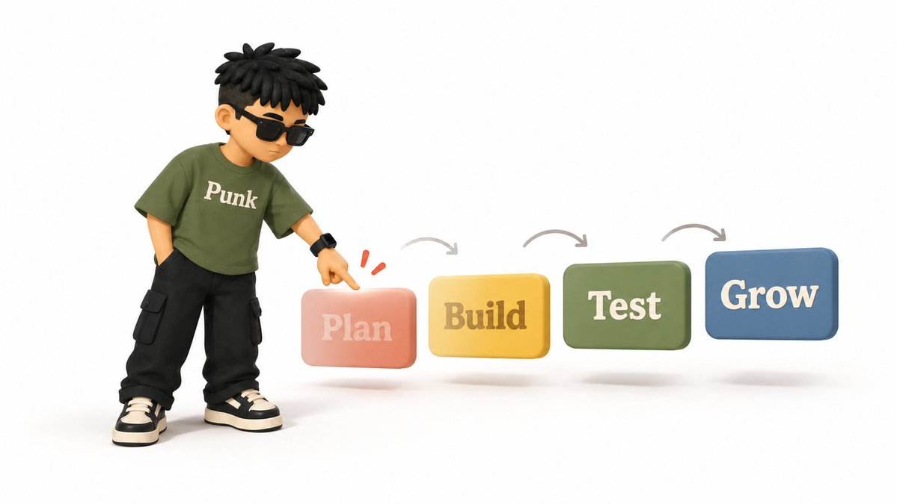

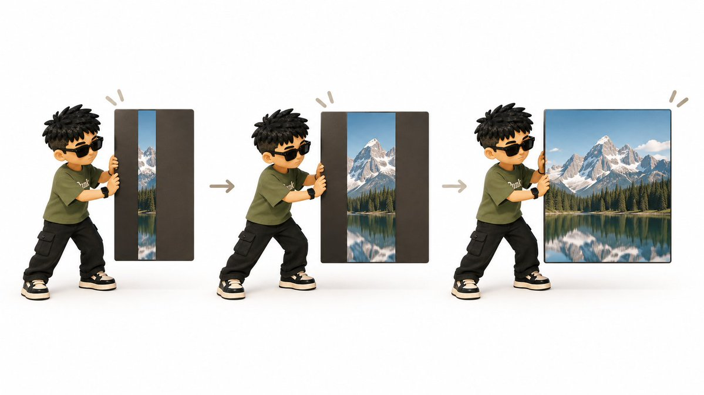

https://x.com/@AdrianPunk115

## B. 内容进入和离开的八个词

内容入场通常由透明度、位置、大小、模糊和遮罩组成。一个元素可以同时淡入并轻微上移，但每个区块最好只有一个主动作。

## 6. Fade in / Fade out：淡入与淡出

Fade 通过透明度变化让元素出现或消失。Fade in 是从看不见变成可见，Fade out 是从可见慢慢消失。

常见类型：

- 页面内容淡入。
- 弹窗背景淡入。
- 提示气泡淡入淡出。
- 图片切换时旧图淡出。
- Toast 提示停留后淡出。

适合： 页面加载、弹窗、菜单、图片、提示和状态切换。它很稳妥，但整个网站只使用 Fade 会缺少层次。

提示词例子：

```
页面内容使用柔和的淡入（Fade in）。标题先出现，正文随后淡入；关闭弹窗时使用更快的淡出（Fade out）。避免整页所有元素同时显现。
```

```
主标题使用文字显现（Text reveal）。按照每一行分别处理，文字从自己的裁剪容器中向上显现，并带轻微淡入；正文只使用普通淡入。
```

## 7. Crossfade：交叉淡化

Crossfade 指旧内容淡出的同时，新内容淡入。两个画面会短暂重叠，因此切换过程比“旧内容先消失，新内容再出现”更连贯。

常见类型：

- 两张图片交叉淡化。
- 标签页内容切换。
- 产品配色预览切换。
- 背景图或背景颜色渐变切换。
- 音乐封面和播放信息更新。

适合： 两个位置相同、内容不同的状态。新旧内容尺寸差异很大时，还要配合布局动画，避免容器突然跳动。

提示词例子：

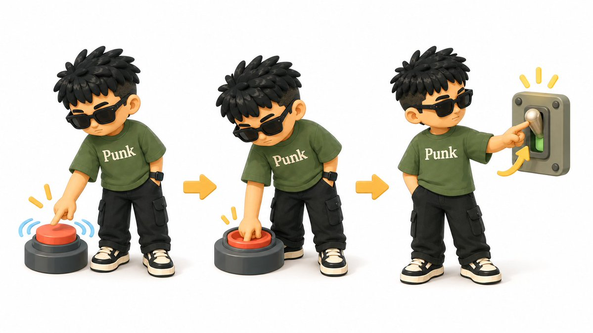

```
移动端菜单从右侧滑入（Slide in），关闭时沿原方向滑出（Slide out）；章节标题从下方轻微滑入。保持位移克制，让用户看得出方向即可。
```

## 8. Slide in / Slide out：滑入与滑出

Slide 指元素从上、下、左、右某个方向进入或离开。方向会传达空间关系：右侧抽屉从右边进入，底部操作面板从下方升起。

常见类型：

- Slide up： 从下方进入。
- Slide down： 从上方展开。
- Slide from left： 从左侧进入。
- Slide from right： 从右侧进入。
- Drawer slide： 抽屉菜单滑入。

适合： 菜单、侧边栏、底部面板、轮播、章节标题和步骤切换。位移方向要和组件所在位置一致。

提示词例子：

```
鼠标进入整张作品卡片时触发悬停（Hover）：卡片轻微抬升，封面显示半透明遮罩，标题和箭头一起显现。鼠标移开后沿原路径恢复；键盘聚焦时提供同样反馈，触屏设备改为点击展开。
```

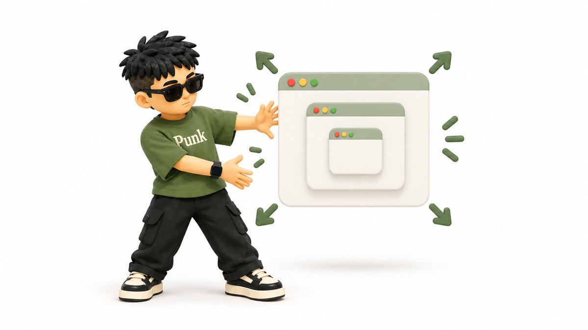

## 9. Scale in / Scale out：缩放进入与离开

Scale 通过大小变化表现元素出现、强调或关闭。Scale in 从较小尺寸回到正常大小，Scale out 则逐渐缩小离开。

常见类型：

- 弹窗从小到正常尺寸。
- 按钮按下时轻微缩小。
- 图片从缩略图放大。
- 成功图标弹出。
- 菜单从触发点展开。

适合： 弹窗、图片预览、按钮、菜单和成功提示。长段文字频繁缩放会影响阅读稳定性。

交给 AI：

```
展示区在页面就绪后自动播放（Autoplay），用户悬停、拖拽或切换到其他标签页时暂停。循环播放（Loop）之间保留自然停顿；开启减少动效后停止循环，显示静态最终状态。
```

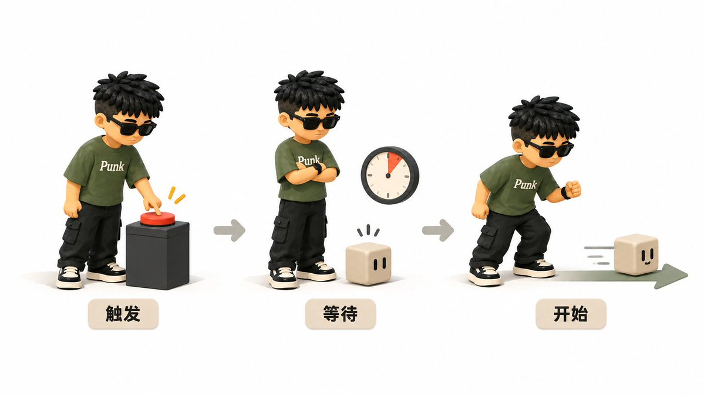

## 10. Blur reveal：模糊显现

Blur reveal 指元素先处于模糊状态，再逐渐恢复清晰，通常还会配合淡入和少量移动。

常见类型：

- 标题从模糊变清晰。
- 图片加载完成后去除模糊。
- 多行文字依次聚焦。
- 背景从虚化状态恢复清楚。
- 页面切换时旧内容逐渐失焦。

适合： 大标题、摄影作品、产品主视觉和少量重点内容。整页文字都使用模糊会增加渲染压力，也会拖慢阅读。

交给 AI：

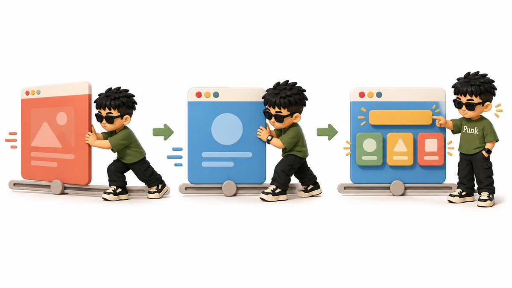

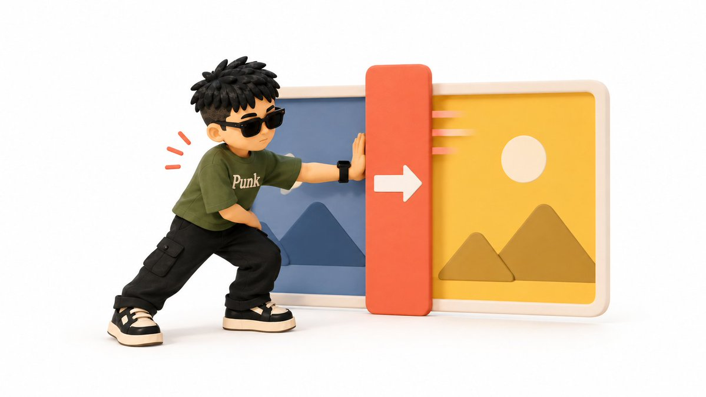

## 11. Clip-path reveal：裁剪揭示

Clip-path reveal 通过改变一个裁剪区域，让内容从某个方向或形状中逐步露出来。效果像打开一扇窗，窗外的图片一直存在，只是可见范围慢慢扩大。

常见类型：

- 从左到右展开。
- 从下到上露出。
- 从中央向两侧打开。
- 圆形区域向外扩张。
- 多边形裁剪逐渐变成完整矩形。

适合： 产品图片、作品集、品牌首屏、章节封面和重点标题。普通信息卡片大量使用会显得太重。

交给 AI：

---

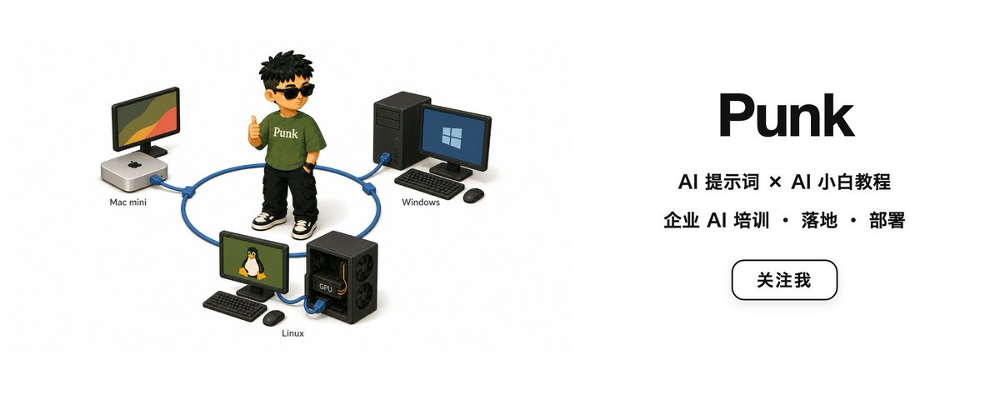

## 12. Mask reveal：蒙版显现

Mask reveal 通过蒙版的透明区域控制内容哪里可见。它和 Clip-path 都能揭示内容，Mask 还能使用渐变、纹理和柔和边缘，画面更像光线扫过、墨迹扩散或渐变擦出。

常见类型：

- 渐变蒙版从一侧扫过。
- 光线扫过后露出文字。
- 墨迹或笔刷形状揭示图片。
- 噪点逐渐消散。
- 柔边圆形区域向外扩散。

适合： 品牌视觉、海报式网页、摄影、艺术作品集和产品主视觉。需要清楚几何边界时优先用 Clip-path。

交给 AI：

```
标题使用按词显现（Word reveal），按照中文语义拆成几个短语，再依次显现。关键词可以稍微强调，整句要快速完成，不能影响阅读。
```

```
主视觉图片使用裁剪揭示（Clip-path reveal），从左向右平滑展开。图片本身保持稳定，只改变可见区域；效果干净，不叠加旋转和夸张缩放。
```

## 13. Wipe transition：擦除转场

Wipe transition 指一个色块、遮罩或画面沿某个方向扫过，把旧内容盖住并带出新内容。它强调方向感和切换动作。

常见类型：

- 从左向右擦过。
- 从上向下覆盖。
- 两个色块从两侧合拢。
- 对角线扫过。
- 圆形区域扩张覆盖全屏。

适合： 页面切换、作品集项目、大图轮播、品牌章节和视频式叙事。功能型页面频繁使用会让切换显得很重。

交给 AI：

```
普通按钮、卡片和文字动画：CSS
React 组件动画：Motion
复杂时间线和滚动叙事：GSAP
网页 3D 场景：Three.js
播放做好的矢量动画：Lottie
有多个互动状态的角色：Rive
```

---

```
让六张卡片交错出现（Stagger），按照从左到右、从上到下的阅读顺序依次进入。相邻卡片只保留很短的间隔，整组动画连贯、轻快。
```

## C. 文字怎么出现的三个基础词

文字动效首先要保证阅读。标题可以有表现力，正文应该尽快稳定下来。字数越多，越要减少逐字动画。

## 14. Text reveal：文字显现

Text reveal 是文字进入动画的总称。它可以按行、按词、按字符处理，也可以结合裁剪、淡入、模糊和位移。

常见类型：

- Line reveal：按行显现。
- Word reveal：按词显现。
- Character reveal：按字符显现。
- Masked text reveal：文字从裁剪窗口中出现。
- Blur text reveal：文字从模糊变清晰。

适合： 首屏标题、章节标题、宣传语和少量重点文字。提示词最好继续说明按行、按词还是按字符。

交给 AI：

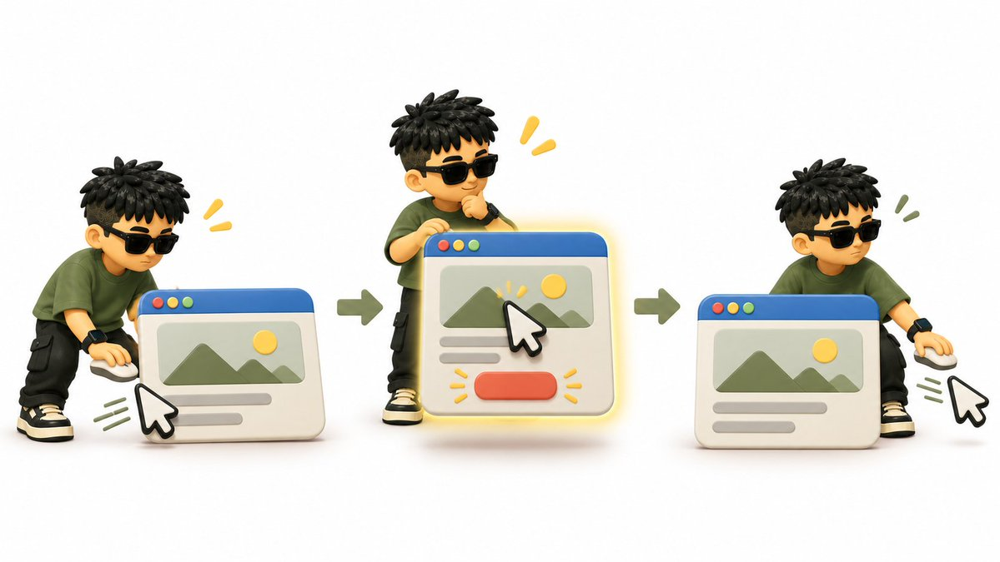

```
弹窗使用缩放进入（Scale in）配合淡入，从较小尺寸自然回到正常大小；关闭时快速缩小并淡出。按钮按下只保留轻微缩放反馈。
```

## 15. Line reveal：按行显现

Line reveal 把标题或段落拆成多行，每一行分别进入。它保留了完整语句，比逐字动画更容易阅读。

常见类型：

- 多行标题从下向上依次出现。
- 每行从裁剪窗口中升起。
- 当前行清晰，下一行稍后显现。
- 多行文字轻微交错淡入。

适合： 两到五行的大标题、引言、章节标题和品牌文案。正文很多时，只给开头几行使用。

交给 AI：


## 16. Word reveal：按词显现

Word reveal 把一句话拆成多个词，每个词依次或分组出现。它比按行更有节奏，又比逐字符更容易读。

常见类型：

- 每个词依次淡入。
- 关键词先出现，其他词随后补齐。
- 每个词从下方轻微进入。
- 词语从模糊逐渐变清晰。

中文没有天然空格，AI 通常需要根据语义切词。如果切分不合理，可以直接告诉它按短语分组。

适合： 简短标题、口号、数据结论和重点句。长段落不要按词播放。

交给 AI：

```

卡片内部光晕跟随指针位置（Pointer position）移动，靠近中心时更明显，离开卡片后平滑回到默认位置。限制效果范围，不能让卡片文字跟着晃动；触屏设备关闭指针跟随。
```

```
弹窗出现时使用弹簧动画（Spring），保留一点重量感和很小的回弹，随后快速停稳。不要产生夸张的果冻效果。
```

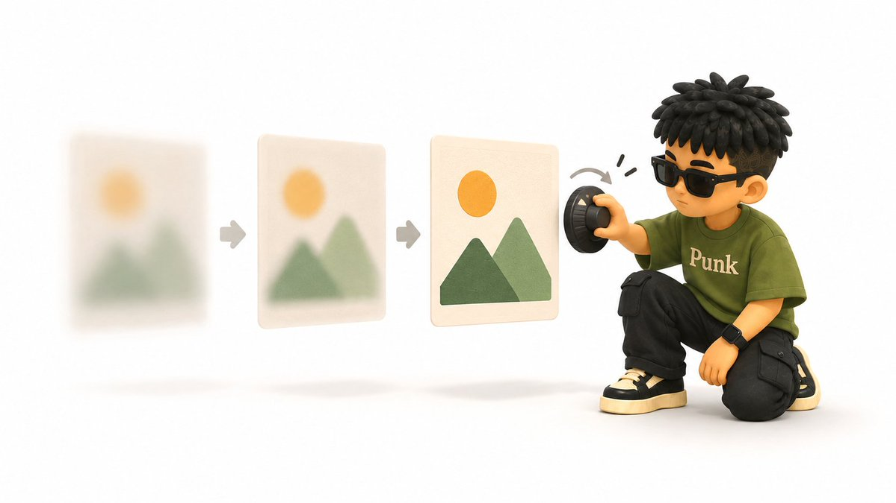

# 第三层还没有讲完

上篇先收住最常用的触发方式，以及缓动、交错、淡入、滑入和基础文字显现。接下来还有视差滚动、横向滚动、滚动叙事、磁吸按钮、鼠标跟随、卡片倾斜、光标聚光灯、布局过渡和页面转场。

下一篇从第 17 个词继续。等这些常用动效类型全部讲清楚，再进入第四层 UX 规则，并把四层组合成可以直接交给 AI 的完整提示词。

```
为所有按钮、链接和输入框补充清楚的键盘焦点（Focus-visible）状态。焦点反馈与悬停状态保持同一套颜色语言，但使用可见焦点环，不能只靠轻微位移表示。
```

## 关于作者

Punk｜中科大管理学硕士｜AI提示词、AI小白教程｜Punk系列Skills作者｜3个月赚了8位数｜Learn in Public｜FDE文章浏览量240w｜@AdrianPunk115


