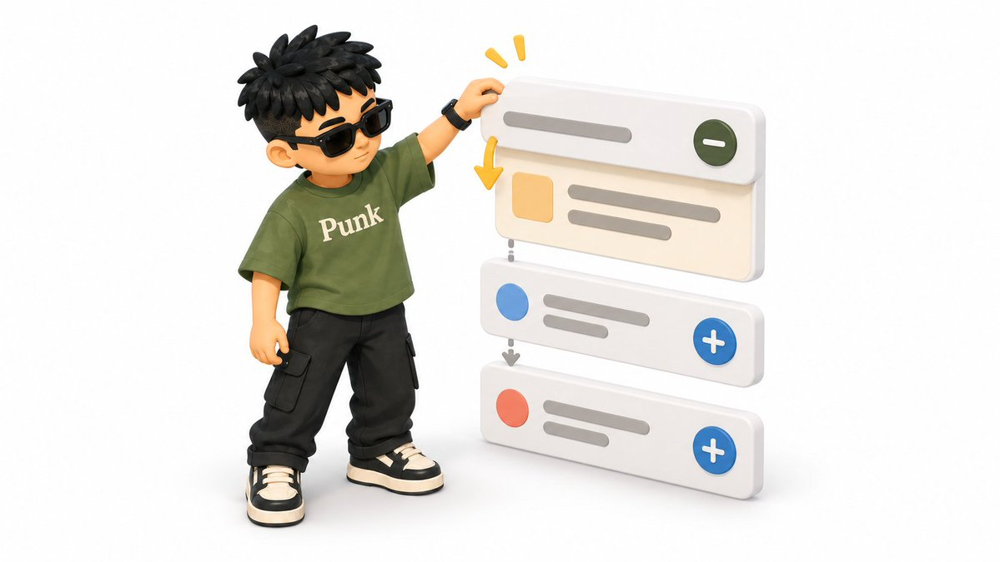
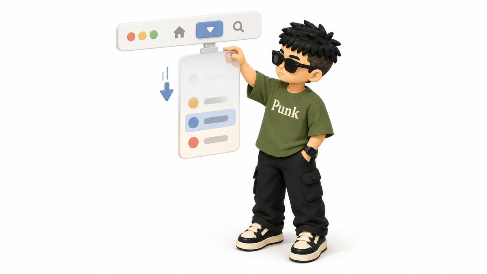
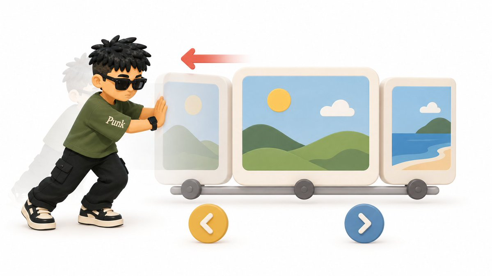
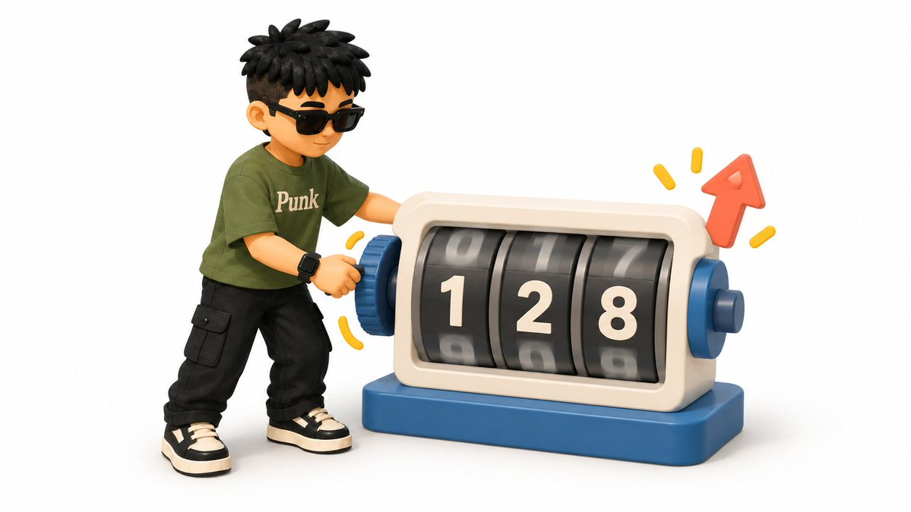
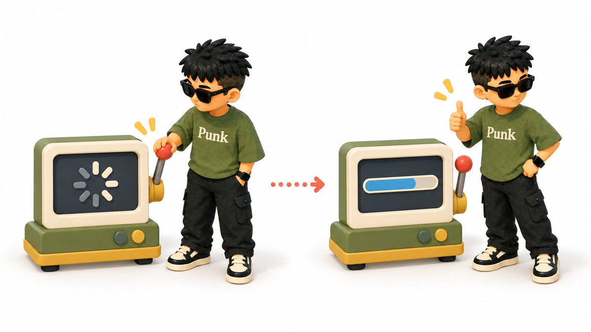
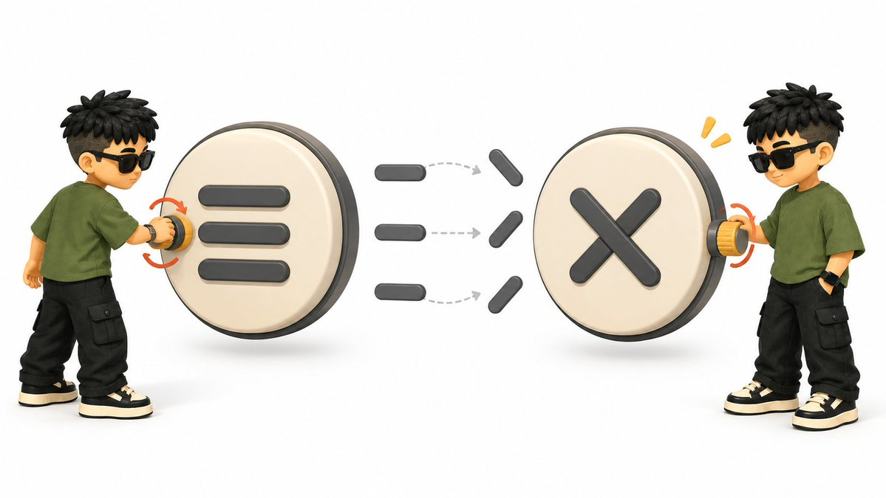
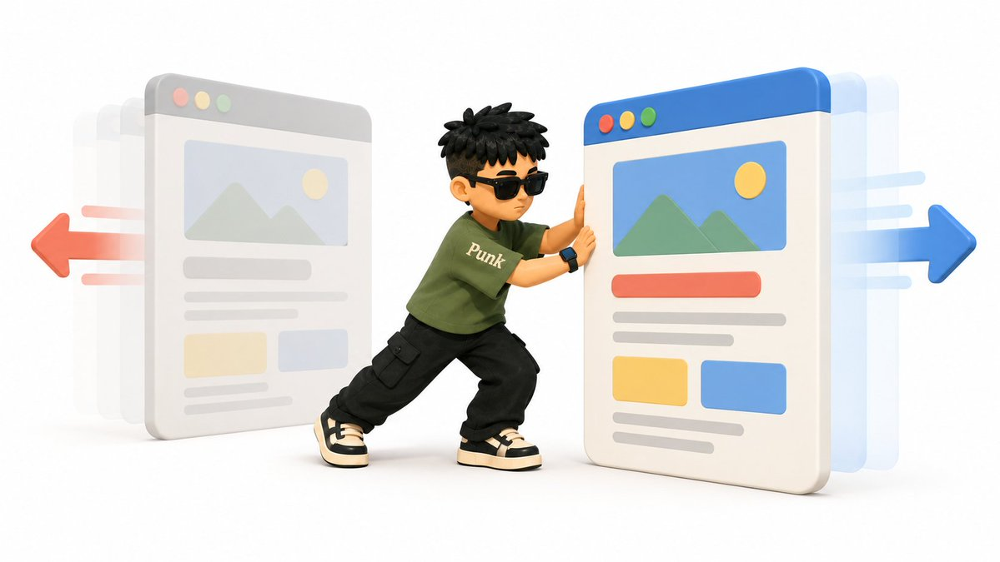
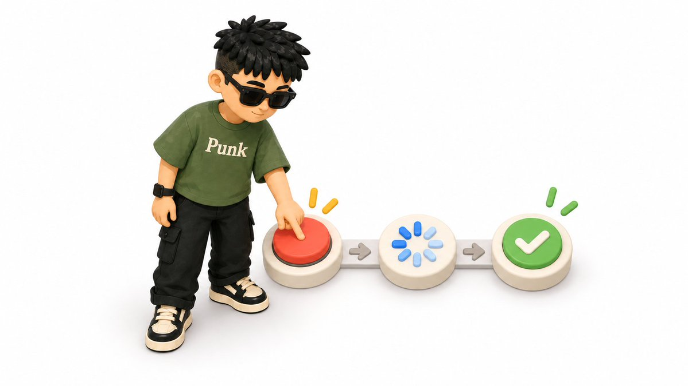
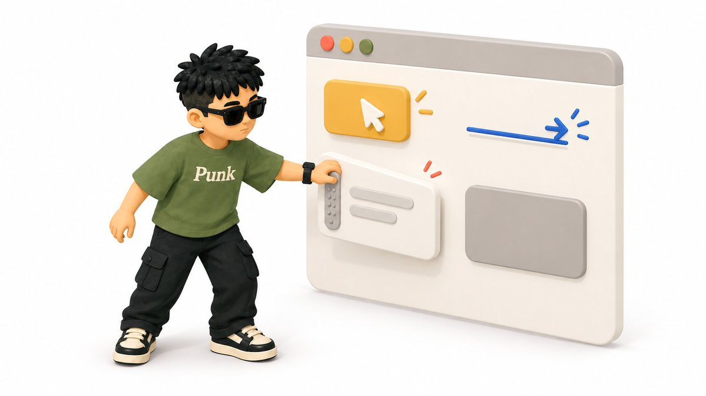
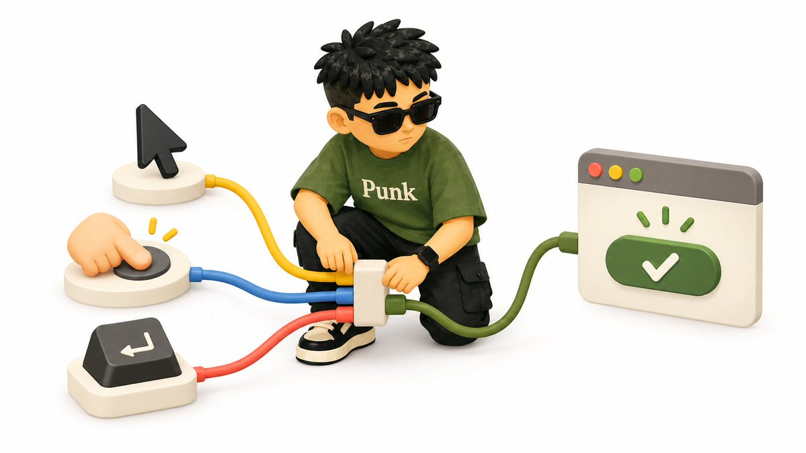

# Vibe Coding 网页动效词典（下篇）：组件反馈、布局过渡与页面转场

你已经会让内容淡入、让卡片交错出现，也知道视差滚动、磁吸按钮和鼠标跟随该怎么说。可一到产品页面，新的问题又来了：弹窗突然蹦出来，菜单展开像页面坏了一下，加载时整块内容凭空消失，切到详情页以后用户不知道自己去了哪里。

这些都属于第三层剩下的内容：组件改变状态时，画面具体怎么过渡。比如“点击按钮”是触发方式，“弹窗从触发按钮附近放大并出现”才是动效类型。

这套词典仍然按照四层结构来组织：

上篇已经讲过工具和触发方式，中篇补了文字、滚动和指针动效。下篇从第 37 个词继续，先补齐第三层，最后再讲第四层的五条 UX 规则。

一、组件打开、关闭与切换

组件动效经常由点击触发，但“点击”无法告诉 AI 菜单该从哪里出现、背景要不要变暗、关闭时怎样返回。下面七个词，覆盖导航、弹窗、标签页和消息提示中最常见的状态变化。

## 37. Accordion：折叠展开

折叠展开用于隐藏和显示一段内容。点击标题后，内容区域沿垂直方向打开；再次点击时收起，并让下面的内容平稳让位。

常见类型：

- 问答列表向下展开答案。
- 设置面板展开更多选项。
- 侧边栏展开二级目录。
- “查看详情”打开一段补充内容。
- 加号在展开后变成减号。
适合： 常见问题、设置项、目录和需要节省空间的长列表。收起后要保留清楚的标题，用户才能再次找到它。

交给 AI：

## 38. Dropdown / Tooltip / Popover：锚定浮层

这几个名字都指依附在某个触发点附近的浮层。Tooltip 是短提示，通常由悬停或键盘聚焦触发；Popover 可以放按钮等可操作内容；Dropdown 是一组选项；Mega menu 则是导航栏展开的大型多列菜单。它们出现和关闭时，都要让用户看出浮层属于哪个触发点。

常见类型：

- 点击头像后展开账号菜单。
- 悬停导航项后显示多列菜单。
- 选择框向下打开选项列表。
- 图标旁边出现一条短提示。
- 点击按钮后打开带操作项的小浮层。
- 空间不足时改为向上展开。
适合： 导航、账号操作、筛选器、图标说明和选择框。浮层要从触发点附近出现，关闭时也回到同一位置；重要操作不能只放在悬停才会出现的 Tooltip 里。

交给 AI：

## 39. Modal / Dialog transition：弹窗过渡

Modal 和 Dialog 都指覆盖在当前页面上方的弹窗。出现时通常先让背景变暗，再让弹窗淡入、放大或从下方进入；关闭时沿相反方向离开。

常见类型：

- 确认弹窗在画面中央轻微放大。
- 登录弹窗从触发按钮附近出现。
- 图片预览从缩略图扩展到中央。
- 警告弹窗快速出现并保持稳定。
- 手机端弹窗从底部进入。
适合： 确认操作、登录、图片预览、重要提醒和短表单。弹窗打开后，背景内容不能继续抢注意力。

交给 AI：

## 40. Drawer / Bottom sheet：抽屉与底部面板

Drawer 是从页面边缘滑出的抽屉，Bottom sheet 是从屏幕底部升起的面板。它们适合承载比弹窗更多的内容，同时保留用户对原页面的方位感。

常见类型：

- 购物车从右侧滑入。
- 手机导航从左侧打开。
- 筛选条件从页面边缘进入。
- 分享选项从手机底部升起。
- 向下拖动关闭底部面板。
适合： 导航、购物车、筛选器、详情面板和移动端操作。抽屉从哪一侧进入，就从哪一侧离开，不要换方向。

交给 AI：

## 41. Tab transition：标签页切换

标签页切换发生在同一块区域内部。用户点击另一个标签后，选中指示器先移动到新标签，下面的内容再切换，让操作与结果连成一次动作。

常见类型：

- 下划线滑到新的标签。
- 胶囊背景在标签之间移动。
- 内容交叉淡化。
- 新内容按左右方向滑入。
- 数据加载完成后再切换内容。
适合： 价格周期、商品详情、设置页面和数据面板。标签很多时不要让内容大幅飞来飞去，短距离移动或交叉淡化已经足够。

交给 AI：

## 42. Carousel / Slider transition：轮播与滑块切换

Carousel 和 Slider 都用于在固定区域里切换多张图片或卡片。常见动作是左右滑动、交叉淡化，或者让当前卡片缩小后退到旁边。

常见类型：

- 图片左右滑动切换。
- 两张图片交叉淡化。
- 中央卡片放大，两侧卡片缩小。
- 拖拽后吸附到最近一张。
- 自动播放，用户操作后暂停。
适合： 商品图、案例、评价、作品和短步骤介绍。轮播里要有上一张、下一张和当前位置，不能只靠自动播放。

交给 AI：

## 43. Toast / Snackbar：轻提示消息

Toast 或 Snackbar 是短暂出现的操作反馈，常见于“保存成功”“已复制”“网络断开”。它不会像弹窗一样中断任务，显示片刻后会自动离开。

常见类型：

- 从页面顶部或底部滑入。
- 在角落淡入并停留。
- 多条消息依次堆叠。
- 带一个撤销按钮。
- 错误消息保持更久，等待用户处理。
适合： 保存、复制、加入购物车、网络状态和不需要立刻回答的提示。关键错误不能只闪一下就消失，要给用户继续处理的入口。

交给 AI：

二、数字、加载与结果反馈

这一组动效出现在用户等待结果的时候。它们要告诉用户系统正在做什么、已经完成到哪里、最终成功还是失败。只放一个旋转图标，往往回答不了这些问题。

## 44. Animated counter / Odometer：数字计数与翻牌

数字计数让数值从旧结果平滑变化到新结果。Odometer 指像里程表一样逐位翻动数字，常用于关键数据和统计结果。

常见类型：

- 数字从零增长到最终值。
- 旧数值平滑更新到新数值。
- 每一位数字上下翻动。
- 百分比与进度条同步增长。
- 金额变化时短暂标出增减方向。
适合： 数据概览、销售额、里程、完成率和关键成绩。数字必须停在准确结果上，动画不能让用户误读数值。

交给 AI：

## 45. Skeleton loading：骨架屏加载

骨架屏先用灰色占位块展示页面大致结构，真实内容加载完成后再替换进去。用户能提前看到标题、图片和列表会出现在哪里，页面也不容易突然跳动。

常见类型：

- 卡片标题与正文使用灰色条占位。
- 图片位置显示固定比例的色块。
- 列表先显示多行相同骨架。
- 占位块缓慢明暗呼吸。
- 一道柔和高光从骨架表面经过。
适合： 信息流、商品列表、个人主页和结构已经确定的异步内容。等待时间很短时直接显示内容，没必要让骨架闪一下。

交给 AI：

## 46. Loading indicator：加载指示与进度

加载指示分成两类。系统不知道何时完成时，用旋转图标、跳动圆点或循环进度条，只表达“还在工作”；系统知道已经完成多少时，用百分比、进度条或步骤编号显示真实进度。

常见类型：

- 按钮内部出现小型旋转图标。
- 三个圆点依次跳动，表示正在生成。
- 文件上传显示完成百分比。
- 圆形进度环逐渐填满。
- 批量任务显示已完成数量。
适合： 提交、搜索、生成、上传、下载和导出。等待变长以后，要补充状态文字和取消入口；能够计算进度时，就不要一直让用户看着圆圈旋转。

交给 AI：

## 47. Success / Error feedback：成功与错误反馈

成功和错误动效负责确认结果。成功常用勾选、颜色变化和轻微放大；错误常用边框变色、提示文字或一次短促抖动。

常见类型：

- 对勾沿路径绘制出来。
- 按钮从加载状态变成成功状态。
- 输入框错误时短促左右抖动。
- 错误字段出现说明文字。
- 操作完成后内容更新并高亮一次。
适合： 表单提交、付款、保存、上传和关键操作。颜色只能辅助表达，成功与错误还要有图标或文字说明。

交给 AI：

## 48. Icon morphing：图标形变

图标形变让一个图标平滑变成另一个图标，常用来表示同一按钮的状态已经改变。汉堡菜单变成关闭叉号、播放变成暂停，都是这一类。

常见类型：

- 三条菜单线变成关闭叉号。
- 加号变成减号。
- 播放三角形变成暂停双线。
- 收藏空心图标变成实心。
- 箭头旋转表示展开与收起。
适合： 同一个按钮承担两种相反状态时。图标变化以后，按钮的位置和点击范围要保持稳定。

交给 AI：

三、布局变化与页面转场

组件内部的动效解决局部状态，下面三个词负责更大的空间变化：卡片重新排序、一个元素跨页面延续，以及整张页面进入和退出。它们的共同任务，是让用户看懂“旧位置怎样变成新位置”。

## 49. Layout animation：布局过渡

布局过渡用于元素增删、排序或尺寸变化。旧位置与新位置之间会出现连续移动，周围内容也会一起让位，不会瞬间跳到结果。

常见类型：

- 筛选后卡片重新排列。
- 删除一项后，下面的列表向上补位。
- 拖拽卡片时其他卡片自动让出位置。
- 展开卡片后周围布局平稳调整。
- 网格在不同列数之间重新排布。
前端资料中常见的 FLIP animation，就是实现布局过渡的一种思路。零基础写提示词时直接描述“从旧位置平滑移动到新位置”已经够用。

交给 AI：

## 50. Shared element transition：共享元素转场

共享元素转场会让两个界面中的同一个元素保持连续。比如点击商品卡片后，卡片里的图片一边放大、一边移动到详情页主图的位置，用户能看到自己点的东西去了哪里。

常见类型：

- 卡片图片扩展为详情页主图。
- 头像移动到个人主页顶部。
- 小播放器扩展成完整播放页。
- 缩略图放大为全屏预览。
- 列表中的标题移动到详情页标题栏。
适合： 列表到详情、图库预览、音乐播放和具有明确主物体的页面。两端没有同一个可识别元素时，普通页面转场更清楚。

交给 AI：

## 51. Page transition：页面转场

页面转场描述旧页面怎样离开、新页面怎样进入。它发生在路由切换或章节跳转时，范围比组件动效更大。

常见类型：

- 旧页面淡出，新页面淡入。
- 新页面从右侧进入，表示继续前进。
- 返回时沿相反方向退出。
- 一块色幕扫过画面完成切换。
- 页面先轻微缩小，再进入下一个空间。
适合： 作品集、品牌网站、应用页面和章节式故事。普通内容网站使用短促淡化就够了，复杂转场会让每次点击都变慢。

交给 AI：

四、第四层：UX 规则——怎样动才好用

到这里，第三层的常用词已经讲完。第四层不再增加视觉花样，它负责约束前面所有动效：用户能不能看懂、能不能继续操作、在手机和键盘上能不能完成同一件事。

## 52. Feedback：反馈

反馈是用户做出操作后，界面立即告诉他“我收到了”。悬停变色、按钮按下、出现加载、保存成功和错误说明，都属于反馈。

检查一个操作时，可以顺着这条线看：

- 操作前：用户看得出哪里能点。
- 操作时：按钮有按下或加载状态。
- 操作后：页面明确显示成功或失败。
- 失败后：用户知道怎样修正或重试。
交给 AI：

## 53. Affordance：操作暗示

Affordance 常翻译为“可供性”，对零基础读者更好记的说法是操作暗示。按钮的形状告诉用户可以点击，下划线告诉用户这是一条链接，拖拽把手告诉用户这里能移动。

常见操作暗示：

- 按钮拥有清楚的边界和文字。
- 链接使用下划线、颜色或箭头。
- 可拖拽区域显示把手或抓取光标。
- 可展开项带箭头、加号或状态文字。
- 输入框拥有标签、边框和键盘焦点样式。
动效要强化这些信号。一个看起来像普通文字的按钮，即使悬停后很炫，用户也可能根本不会把鼠标移过去。

交给 AI：

## 54. Focus：焦点与注意力

Focus 在网页里有两层含义：视觉上把注意力引向当前任务，操作上让键盘焦点落在正确位置。弹窗打开后背景变暗属于前者，键盘光标进入弹窗属于后者。

常见要求：

- 主操作比次要操作更醒目。
- 弹窗打开后，注意力留在弹窗内。
- 键盘聚焦状态清楚可见。
- 关闭弹窗后，焦点回到原按钮。
- 动画结束后，用户知道下一步看哪里。
交给 AI：

## 55. Reduced motion：减少动态

有些用户会在系统中开启“减少动态”，因为大幅缩放、视差和持续跟随可能引起眩晕。网页可以读取这项偏好，为他们换成更安静的版本。

需要优先减弱的效果：

- 大幅视差和滚动缩放。
- 长距离飞入飞出。
- 自动循环和持续旋转。
- 光标拖尾、背景追随和强烈闪烁。
- 无法暂停的图片序列与自动轮播。
减少动态以后，状态变化仍然要看得懂。可以保留短促淡化、颜色变化、进度和成功提示，让功能继续正常工作。

交给 AI：

## 56. Input modality support：鼠标、触屏与键盘适配

Input modality 指用户通过鼠标、触屏还是键盘操作页面。网页不能把关键功能只交给鼠标悬停：手机没有持续悬停，键盘用户也不会移动鼠标，所以同一个功能要为不同输入方式准备入口。

常见替代关系：

- 鼠标悬停，对应键盘聚焦。
- 桌面端悬停展开，手机端点击展开。
- 拖拽排序，同时提供上移和下移按钮。
- 光标跟随效果，触屏端改为静态。
- 左右滑动，同时保留上一项和下一项按钮。
交给 AI：

五、最后把四层写进一句提示词

现在再看一条完整的 Vibe coding 动效描述：

这段话里，四层已经齐了：

- 技术工具： 使用项目现有方案，不随意增加依赖。
- 触发方式： 点击卡片、加入购物车、返回页面。
- 动效类型： 共享元素转场、加载、成功反馈、轻提示。
- UX 规则： 焦点、触屏替代、减少动态。
六、把喜欢的网页变成自己的动效素材库

三篇动效词典到这里就结束了。这 56 个词不用一次背完，它们更像一套观察网页的坐标。以后遇到喜欢的页面，先亲手操作一遍：移动鼠标、点击按钮、滚动页面、打开菜单，再留意画面怎么回应你。

观察时按四层往下拆：

触发方式： 是悬停、点击、滚动、拖拽，还是页面加载后自动开始？

动效类型： 是淡入、交错出现、视差滚动、磁吸、布局过渡，还是共享元素转场？

结束状态： 鼠标移开以后怎样恢复？返回上一页时是否按原路径回去？加载完成以后显示什么？

UX 规则： 操作有没有反馈？用户看得出哪里能点吗？手机和键盘能完成同样的任务吗？减少动态以后还能看懂吗？

看到一个好动效，就截张图或录一小段屏幕，把它记成下面这几行：

比如你收藏了一张会跟随鼠标倾斜的作品卡片，发给AI帮你分析触发方式、动效类型、如何互动的。

然后把它放到自己的网站里，只试一个局部。确认文字仍然好读、按钮仍然好点、手机上没有问题，再决定是否保留。这样的记录积累十几条以后，你会慢慢形成自己的动效素材库，也会知道哪些效果适合自己的内容。

下一次再向 AI 描述网页，你说的就不会只有“高级一点”“丝滑一点”。你能说清楚谁触发、什么东西动、怎样结束、需要照顾哪些用户，AI 才能把你脑子里的感觉做出来。

先从收藏夹里最喜欢的一张网页开始：操作一遍，拆一个动效，记下一条，再放进自己的网站。

## 往期回顾

## 关于作者

Punk｜中科大管理学硕士｜AI提示词、AI小白教程｜Punk系列Skills作者｜3个月赚了8位数｜Learn in Public｜FDE文章浏览量240w｜[@AdrianPunk115](https://x.com/@AdrianPunk115)

