# 📰 Vibe Coding 网页动效词典（中篇）：视差滚动、磁吸按钮与鼠标跟随

来源：[X 状态](https://x.com/AdrianPunk115/status/2099772129478869309) · [X 文章](https://x.com/i/article/2099517692135034880)


上篇讲完以后，你已经知道鼠标悬停、点击、进入视口和跟随滚动都属于触发方式。但知道“什么时候开始”，还不等于知道“画面具体怎么动”。

比如滚动页面，可以让标题淡入，也可以让背景与前景以不同速度移动。前者是滚动触发淡入，后者才叫视差滚动。滚动是第二层的触发方式，视差是第三层的动效类型。

这一篇继续第三层，从第 17 个词讲到第 36 个词。先补齐四种文字效果，再讲滚动与空间，最后进入鼠标和指针互动。

```text
用户滚动页面时，背景和前景使用轻微视差滚动，前景移动更明显，手机端减弱位移。

作品卡片进入视口后依次显现；鼠标悬停时轻微立体倾斜，移开后平稳回正。

光标靠近主按钮时触发磁吸效果，按钮向光标轻微靠近；触屏设备改用普通按下反馈。

用户继续向下滚动时，产品图片按照连续帧播放；向上滚动时按相反顺序返回。
```

```text
首屏背景增加光标聚光灯（Cursor spotlight）。一块柔和圆形亮区跟随光标，经过网格时让局部纹理变清楚；光晕移动保持平滑，不改变正文亮度，手机端显示固定的静态光区。
```

# 一、进阶文字动效

上篇的按行显现和按词显现适合大多数标题。下面四种效果存在感更强，更适合短词、状态和少量视觉重点。整段正文都使用它们，读者会一直等动画播完。

## 17. Character reveal：按字符显现

Character reveal 把文字拆成单个字符分别动画。它的视觉节奏最明显，也最容易让用户等待。

常见类型：

- 字符依次淡入。
- 字符从不同高度落入。
- 字符轻微旋转后归位。
- 字符从模糊恢复清晰。
- 鼠标经过时字符依次响应。

适合： 很短的英文单词、Logo、数字和四到八个字的标题。中文长句、正文和按钮文字通常不需要逐字动画。

交给 AI：

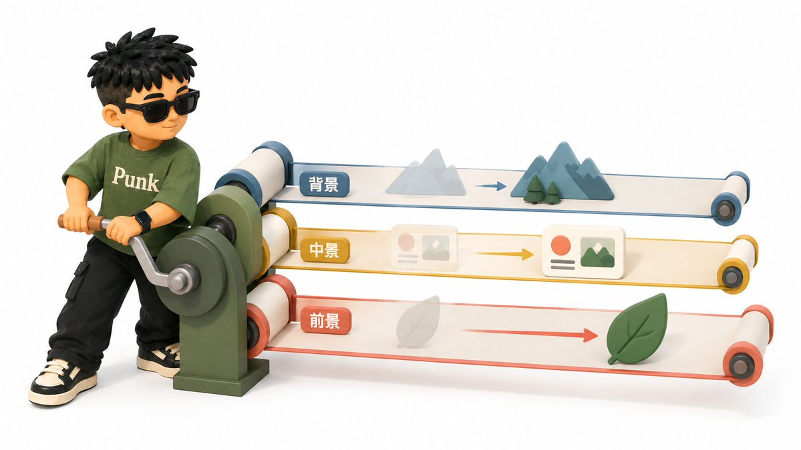

## 18. Typewriter：打字机效果

Typewriter 模拟文字被逐个输入的过程，通常会带一个闪烁光标。它强调“内容正在生成”或“有人正在输入”。

常见类型：

- 命令行逐字输入。
- AI 回答正在生成。
- 搜索框自动输入示例。
- 多个短句循环打出并删除。
- 输入完成后光标继续闪烁。

适合： 命令行、聊天、搜索示例、AI 产品和短标题。正文介绍不适合让用户等着逐字打完。

交给 AI：

```text
标题中的关键词使用文字变形（Text morphing），在三个短词之间依次变化。切换时使用轻微模糊和交叉淡化，容器宽度平滑过渡，用户悬停后暂停循环。
```

```text
功能介绍使用固定式滚动叙事（Sticky scrollytelling）。右侧产品界面暂时固定，左侧三个功能说明随滚动依次进入并高亮；每换一段，右侧只更新对应区域。最后一段结束后恢复正常滚动。
```

## 19. Scramble text：乱码解码

Scramble text 会先显示随机字符，再逐渐替换成正确文字，看起来像系统正在解密或加载数据。

常见类型：

- 随机英文字符逐渐组成标题。
- 数字快速跳动后停在最终结果。
- 鼠标悬停时文字短暂乱码。
- 页面进入时关键词完成解码。
- 状态从 Processing 变成 Complete。

适合： 科技感标题、系统状态、数据页面、游戏界面和少量互动彩蛋。中文乱码容易难看，可以只让英文或数字部分变化。

交给 AI：

```text
横向案例区使用滚动吸附（Scroll snap）。用户停止滑动后，让最近的卡片自然对齐到容器中央；吸附不要突然跳动，正文页面仍保持自由滚动。
```

```text
在命令行演示区使用打字机效果（Typewriter），逐字输入一条短命令，并显示闪烁光标。文字完成后立即保持可见，不要循环删除重打。
```

## 20. Text morphing：文字变形

Text morphing 指一个词平滑变化成另一个词。变化过程可以使用字符替换、模糊交叉、宽度调整或形状变形。

常见类型：

- 一个职业名称轮换成另一个。
- 产品状态从 Loading 变化为 Ready。
- 数字和单位平滑更新。
- 同一位置的关键词循环替换。
- SVG 字形从一个形状变成另一个。

适合： 短词、状态、数字、轮换关键词和品牌实验页面。新旧文字长度差异很大时，要让容器宽度平滑变化，避免旁边内容跳动。

交给 AI：

```text
首屏使用指针响应背景（Pointer-reactive background）。背景网格在光标附近轻微弯曲，远处保持稳定；响应带一点延迟，光标停止后缓慢恢复。正文和按钮不能发生位移，手机端使用静态背景。
```

```text
这一段使用横向滚动（Horizontal scroll）。用户继续向下滚动时，四张作品卡片从右向左依次经过视口；进入和离开横向区域时保持自然衔接，手机端恢复为普通纵向列表。
```

```text
首屏使用轻微视差滚动（Parallax scrolling）。背景插图移动最慢，中间装饰稍快，前景标题保持正常滚动，让三层产生清楚但克制的前后深度。手机端减弱位移。
```

# 二、滚动与空间动效

滚动动效最容易混淆，因为同一个滚轮动作可以承担两件事：滚到某处再播放，或者让动画进度一直跟着滚动位置。下面的词条都在描述画面怎么变化，提示词中仍然要补一句由滚动触发还是跟随滚动。

## 21. Parallax scrolling：视差滚动

视差滚动让前景、中景和背景以不同速度移动。人的眼睛会把速度差理解成距离差，于是平面的网页看起来有了前后深度。

常见类型：

- 背景移动得慢，正文正常滚动。
- 前景装饰移动得快，背景移动得慢。
- 图片内部景物轻微移动，图片外框保持不变。
- 某一层向相反方向移动，制造更明显的空间感。
- 鼠标移动时产生小范围视差，不依赖页面滚动。

适合： 品牌首页、产品介绍、作品集和带大图的故事页面。正文阅读页只需要很轻的速度差，大幅反向移动容易让人眩晕。

交给 AI：

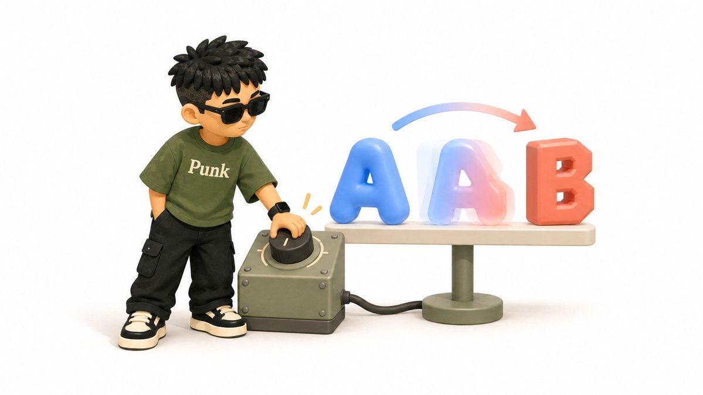

---

## 22. Multi-layer parallax：多层视差

多层视差是视差滚动的扩展版本。页面会把画面拆成三层或更多层，每一层拥有不同方向、速度和移动范围，像在橱窗中前后摆放了多块透明玻璃。

常见类型：

- 天空、山体、人物和前景植物分层移动。
- 背景网格、中间产品和前景文字分层移动。
- 多张透明图片叠成具有景深的场景。
- 不同层在横向与纵向同时产生轻微位移。

适合： 视觉叙事、游戏宣传、电影网站、3D 产品页和氛围型首页。层数越多，越要减少每层的移动幅度，否则画面会散掉。

交给 AI：

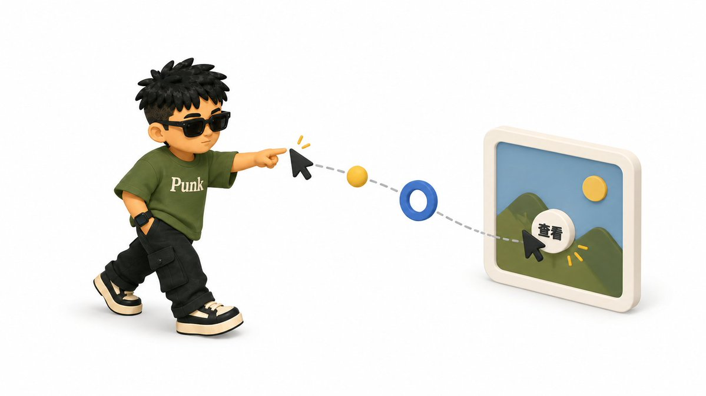

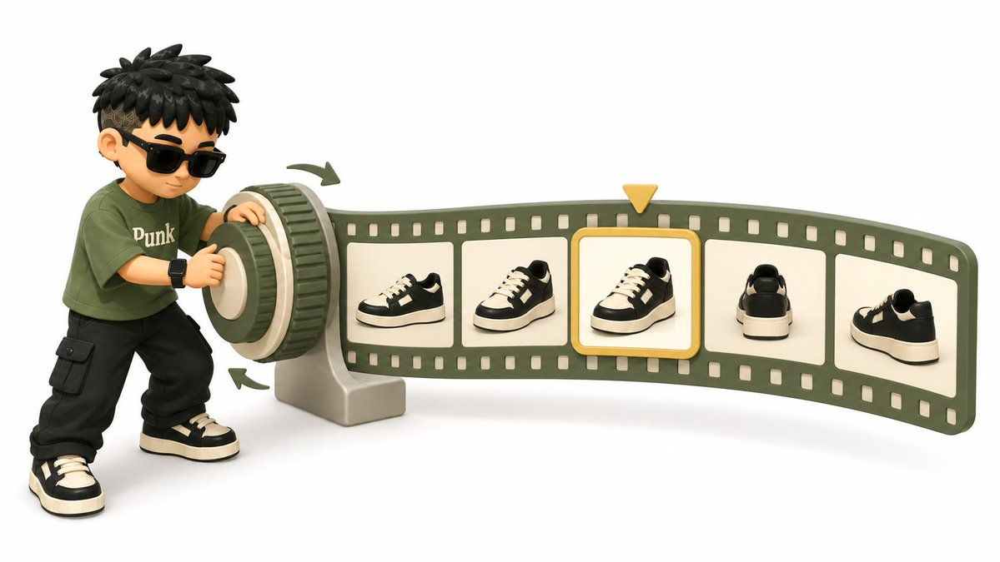

## 23. Horizontal scroll：横向滚动

横向滚动让内容沿左右方向移动。网页常把用户的纵向滚轮转换成横向浏览，用来展示一排作品、时间轴或连续章节。

常见类型：

- 作品卡片从右向左经过视口。
- 产品功能按照横向章节依次展开。
- 一条时间轴随滚动向右推进。
- 图片画廊保持一行横向浏览。
- 桌面端横向叙事，手机端改回纵向列表。

适合： 作品集、品牌故事、产品功能、时间轴和图片画廊。手机上的左右滑动可能与系统返回手势冲突，移动端通常需要单独简化。

交给 AI：

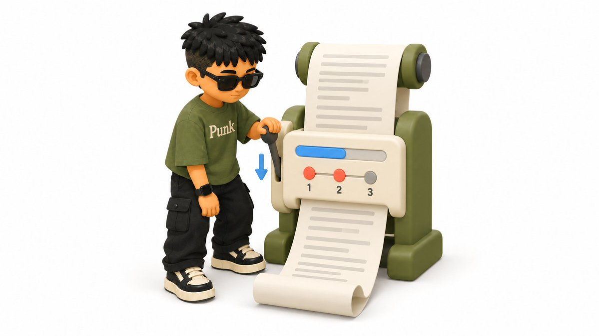

## 24. Scroll zoom：滚动缩放

滚动缩放把滚动进度映射到画面大小。用户继续滚动时，图片、文字或 3D 物体逐渐靠近，也可以从局部慢慢退回全景。

常见类型：

- 首屏图片从小卡片扩展成全屏。
- 产品从远处逐渐靠近镜头。
- 地图从全局缩放到一个城市。
- 一张照片放大后进入照片内部的下一段内容。
- 滚回上方时按原路径缩小。

适合： 产品亮相、章节转场、地图故事、摄影作品和 3D 展示。文字跟着大幅缩放时容易模糊，通常让图片或主物体承担缩放。

交给 AI：

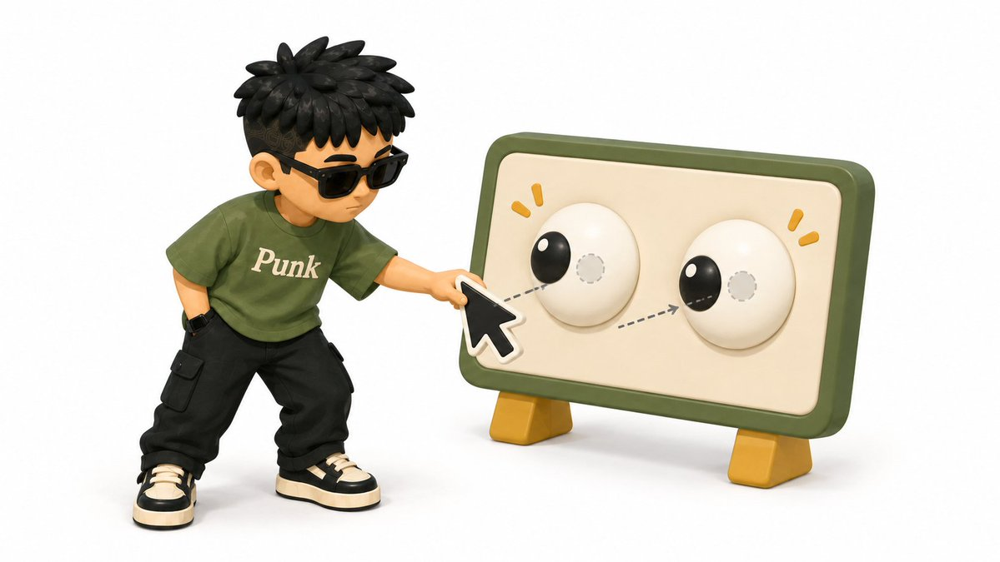

```text
把首屏插图拆成背景、中景和前景三层，使用多层视差（Multi-layer parallax）。滚动时三层保持不同速度，前景变化最明显，背景最轻。各层始终对齐成一个完整画面，不要漂散。
```

## 25. Sticky scrollytelling：固定式滚动叙事

固定式滚动叙事会暂时把一个区域留在视口中，用户继续滚动时，只替换其中的图片、数据或说明。常见画面是左侧文字继续换章节，右侧产品图保持固定并同步变化。

常见类型：

- 左侧步骤依次高亮，右侧界面同步切换。
- 产品固定在中央，零件随章节逐个出现。
- 一张地图保持不动，地点和路线持续更新。
- 长图保持固定，旁边的解释逐段推进。
- 背景固定，前景章节依次覆盖或离开。

适合： 产品拆解、案例讲解、数据故事、教程步骤和品牌叙事。固定时间太长会让用户误以为页面卡住，需要保留清楚的章节变化。

交给 AI：

---

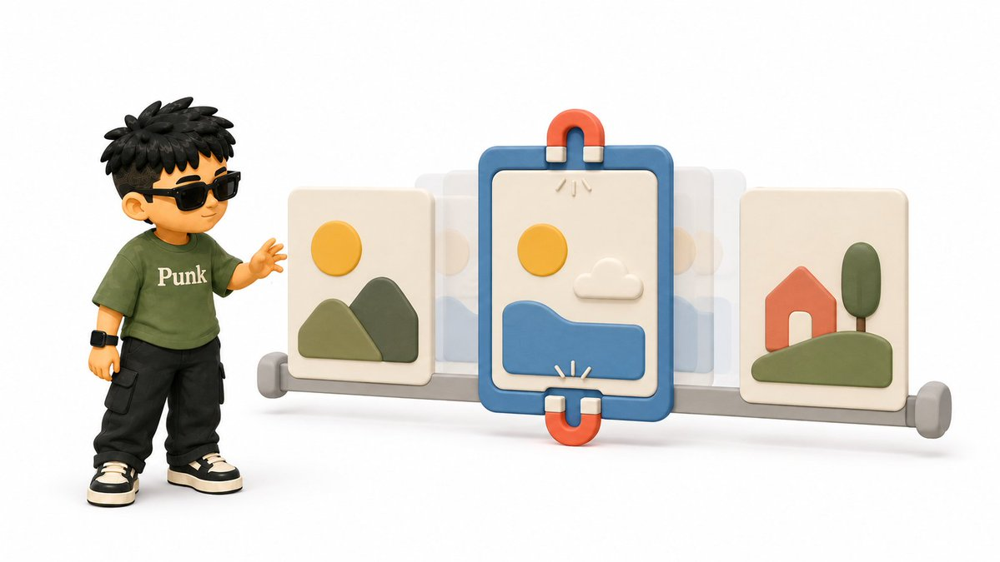

## 26. Image sequence：图片序列滚动

图片序列滚动会准备一组连续画面，再根据滚动位置切换当前帧。它像一段由用户滚轮控制前进和后退的视频。

常见类型：

- 产品随着滚动完成一圈旋转。
- 设备外壳逐步拆开，露出内部结构。
- 一组照片从白天变化到夜晚。
- 插画角色随滚动完成一段动作。
- 滚动向上时按相反顺序倒放。

适合： 汽车、手机、硬件、服装、产品拆解和强视觉故事。连续图片较多时要提前加载，并为加载失败准备一张静态主图。

交给 AI：

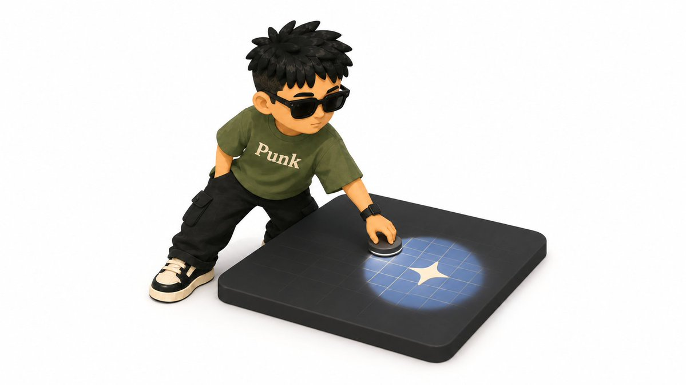

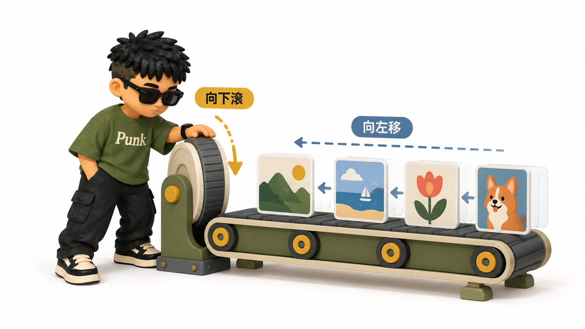

## 27. Scroll snap：滚动吸附

滚动吸附会在用户停止滚动后，把页面自动对齐到最近的章节或卡片。画面不会停在两个区块中间，阅读位置更明确。

常见类型：

- 每次滚动对齐到一个全屏章节。
- 横向卡片自动吸附到容器中央。
- 图片轮播停在完整图片上。
- 手机端功能页一次显示一个步骤。
- 只在靠近目标时轻微吸附，保留自由滚动感。

适合： 全屏故事、横向画廊、功能轮播和短章节页面。正文很长时不适合强制整屏吸附，否则用户很难停在想读的位置。

交给 AI：

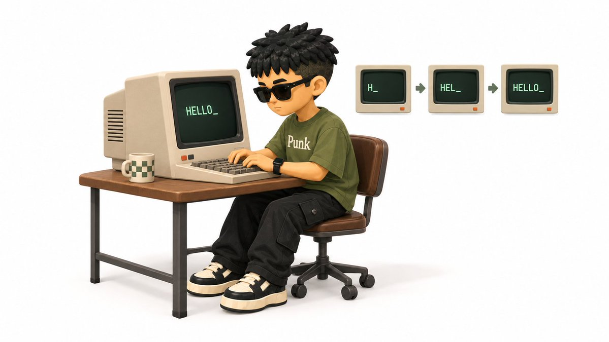

---

## 28. Progress indicator：滚动进度提示

滚动进度提示把用户当前的位置显示出来。它可以是一条线、一个数字、一组章节圆点，也可以是侧边目录中的当前章节高亮。

常见类型：

- 页面顶部的阅读进度条。
- 章节编号从 1 逐步更新到 5。
- 侧边目录跟随滚动高亮。
- 圆环随着阅读进度逐渐填满。
- 横向时间轴标出当前位置。

适合： 长文、教程、产品故事、多步骤表单和章节式页面。它提供的是位置反馈，视觉上要比正文安静，不能抢走阅读注意力。

交给 AI：

```text
产品展示使用图片序列滚动（Image sequence）。滚动时按照顺序切换连续产品帧，让设备完成平滑旋转；向上滚动时反向播放。图片未加载完成前显示静态主图，手机端减少帧数。
```

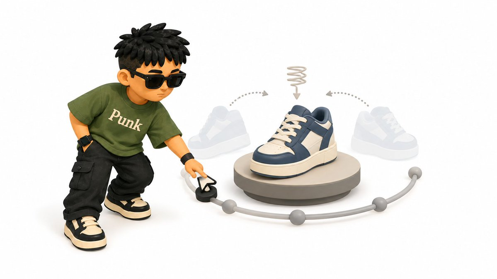

# 三、鼠标与指针动效

这一组动效会读取光标的位置、方向或距离。它们很适合桌面端的产品首页和作品集，但手机没有持续悬停，也没有一直存在的鼠标坐标。提示词里要同时交代触屏设备怎样简化。

## 29. Magnetic button：磁吸按钮

磁吸按钮会在光标靠近时轻微向光标移动，看起来像按钮与鼠标之间存在吸引力。光标离开后，按钮回到原位。

常见类型：

- 整个按钮向光标方向靠近。
- 按钮保持不动，内部文字轻微偏移。
- 圆形图标靠近光标并扩大感应范围。
- 按钮边缘产生柔和形变。
- 离开时带少量弹性回到中心。

适合： 首要行动按钮、作品集入口和少量重点链接。每个按钮都磁吸会让界面显得不稳定，一页保留一两个重点即可。

交给 AI：

```text
桌面端增加自定义光标跟随（Cursor follower）。小圆点准确跟随系统光标，外层圆环稍微延迟；进入作品图片时显示“查看”，离开后恢复。输入框和手机端使用系统默认光标。
```

## 30. Tilt card：立体倾斜卡片

立体倾斜卡片会根据光标在卡片中的位置，向不同方向轻微旋转。卡片的高光和阴影同步变化，就会产生一层可感知的厚度。

常见类型：

- 卡片跟随光标向四周倾斜。
- 卡片表面高光跟随光标移动。
- 图片与文字产生轻微前后分层。
- 悬停时卡片抬起并增加透视。
- 光标离开后平稳回正。

适合： 作品卡片、产品卡片、游戏道具和视觉型首页。文字很多的卡片不宜大幅倾斜，阅读时页面需要保持稳定。

交给 AI：

```text
让英文标题使用乱码解码（Scramble text）：先出现短暂的随机字符，再迅速收敛为正确标题。只播放一次，中文正文保持稳定。
```

```text
让角色瞳孔使用鼠标跟随眼睛（Mouse-following eyes）。瞳孔根据光标方向在眼白内部小幅移动，始终不能越过眼睛边缘；光标离开页面后回到中央，手机端保持静态。
```

## 31. Cursor follower：自定义光标跟随

自定义光标跟随会用圆点、圆环、图标或短文字替代或陪伴系统光标。跟随元素通常会稍微落后于真实指针，形成柔和的追随感。

常见类型：

- 小圆点紧跟指针，大圆环延迟跟随。
- 进入图片后显示“查看”。
- 进入视频后变成播放图标。
- 进入可拖拽区域后显示“拖动”。
- 光标经过链接时改变大小和颜色。

适合： 作品集、图片画廊、品牌首页和需要强化操作提示的区域。系统光标仍要保持可定位，不能因为自定义效果变得迟钝或消失。

交给 AI：

---

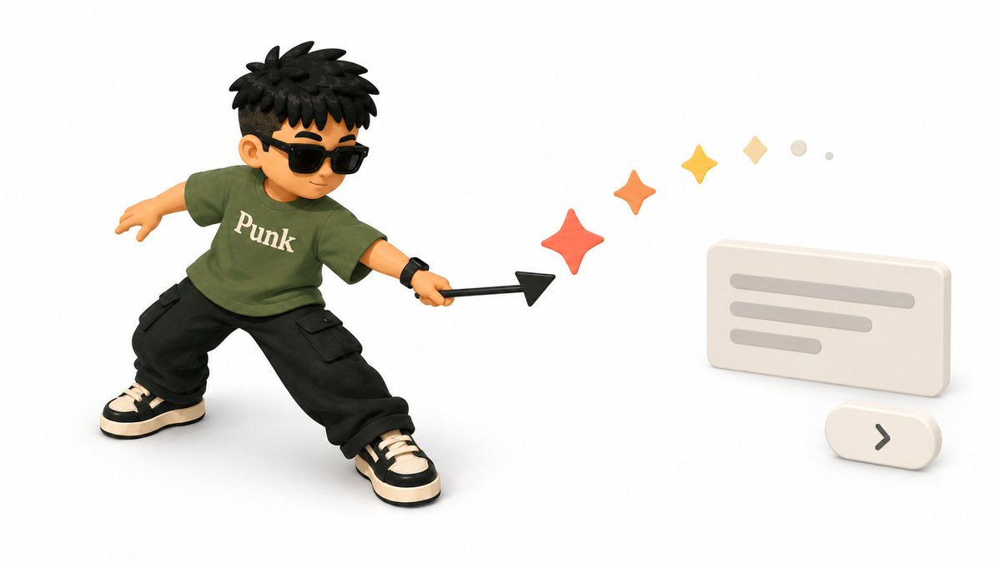

## 32. Cursor spotlight：光标聚光灯

光标聚光灯会让一块亮区跟随鼠标移动。亮区可以照亮深色背景，也可以在浅色页面中揭示隐藏纹理、网格或第二层内容。

常见类型：

- 圆形光晕跟随光标。
- 渐变中心随着指针改变位置。
- 光标经过时显示背景中的隐藏文字。
- 聚光区域内的卡片边框变亮。
- 一束柔和光线照向当前内容。

适合： 深色产品页、创意作品集、科技首页和局部探索区域。正文区域不适合持续追光，亮度变化会干扰阅读。

交给 AI：

```text
滚动进入产品章节时使用滚动缩放（Scroll zoom）。产品图片从画面中央的小尺寸逐渐放大到接近全屏，缩放进度跟随滚动；标题保持清晰稳定，继续滚动后自然进入详情内容。
```

```text
长文顶部增加滚动进度提示（Progress indicator）。进度条随着阅读位置平滑增长，章节切换时同步高亮侧边目录。样式保持细、轻、克制，不遮挡标题和正文。
```

## 33. Mouse-following eyes：鼠标跟随眼睛

鼠标跟随眼睛会让角色的瞳孔朝光标方向移动。眼白保持不动，瞳孔只在眼睛内部的小范围内移动，于是角色看起来一直在观察用户。

常见类型：

- 两只瞳孔同时跟随光标。
- 多个角色分别看向同一个位置。
- 光标离开页面后瞳孔回到中央。
- 点击时角色眨眼或改变表情。
- 手机端保持静态，或短暂看向触摸位置。

适合： 吉祥物、登录页、404 页面、儿童产品和有角色 IP 的品牌页面。瞳孔必须限制在眼白内部，移动范围过大会像眼睛坏掉。

交给 AI：


## 34. Cursor trail：光标拖尾

光标拖尾会在鼠标经过的位置留下短暂痕迹。痕迹可能是圆点、线条、图形、文字或图片残影，并在片刻后消失。

常见类型：

- 一串逐渐缩小的圆点。
- 柔和的连续线条。
- 光标移动时依次出现小图片。
- 快速移动时产生文字或图标残影。
- 粒子从路径上散开并消失。

适合： 活动页、作品集、音乐网站、互动艺术和少量彩蛋。按钮和正文附近要保持清爽，拖尾太密会遮挡点击目标。

交给 AI：

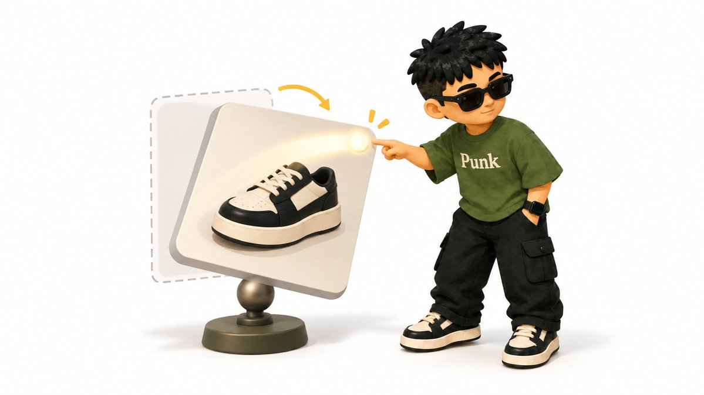

```text
首屏产品模型使用 3D 物体跟随（3D object follow）。光标在页面中移动时，模型只做小幅旋转并保持主体正面可见；光标离开后缓慢回正。加载前显示静态产品图，手机端改为轻微自动旋转。
```

## 35. Pointer-reactive background：指针响应背景

指针响应背景会让背景中的渐变、网格、粒子或图形根据鼠标位置发生变化。它的范围通常比光标聚光灯更大，整个首屏都可能产生轻微响应。

常见类型：

- 渐变中心跟随光标缓慢移动。
- 网格在光标附近轻微弯曲。
- 粒子靠近光标时避让或聚集。
- 背景图片按指针方向产生小幅位移。
- 多层图形根据距离产生不同响应。

适合： 产品首页、创意工具、AI 网站、数据可视化和互动作品集。背景响应要慢于光标，不能让整个页面像贴在鼠标上。

交给 AI：

```text
进阶文字：按字符显现、打字机、乱码解码、文字变形
滚动与空间：视差、横向滚动、滚动缩放、固定式滚动叙事、图片序列
鼠标与指针：磁吸按钮、倾斜卡片、光标跟随、聚光灯、眼睛跟随
```

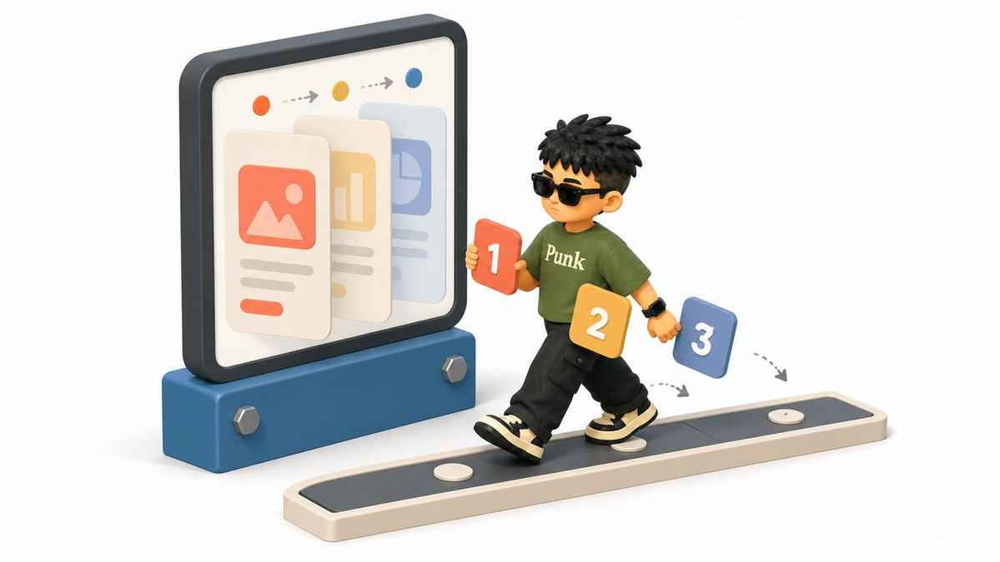

## 36. 3D object follow：3D 物体跟随

3D 物体跟随会让网页中的立体模型根据鼠标位置旋转、偏移或改变观察角度。它常由 Three.js 之类的 3D 工具实现，但效果名称描述的是画面行为，工具名称只决定怎样完成。

常见类型：

- 产品模型朝光标方向轻微旋转。
- 3D 角色的头部跟随指针转动。
- 相机根据光标位置绕物体小幅移动。
- 模型的灯光方向随指针变化。
- 光标离开后物体缓慢回到正面。

适合： 硬件、汽车、鞋服、3D 角色、游戏和科技产品首页。模型加载较慢时需要静态图片作为替代，手机端可以改成自动缓慢旋转。

交给 AI：

---

```text
只让主标题中的四个关键词使用按字符显现（Character reveal），字符依次淡入并轻微上移。其他文字保持整行出现，整段动画快速完成。
```

```text
在首屏空白区域加入克制的光标拖尾（Cursor trail）。鼠标移动时留下少量圆点，圆点逐渐缩小并淡出；经过正文、按钮和输入框时暂停拖尾，手机端关闭。
```

# 四、把“触发方式”和“动效类型”组合起来

写提示词时，先说由什么触发，再说画面怎样变化。下面几句已经可以覆盖这一篇的大多数效果：

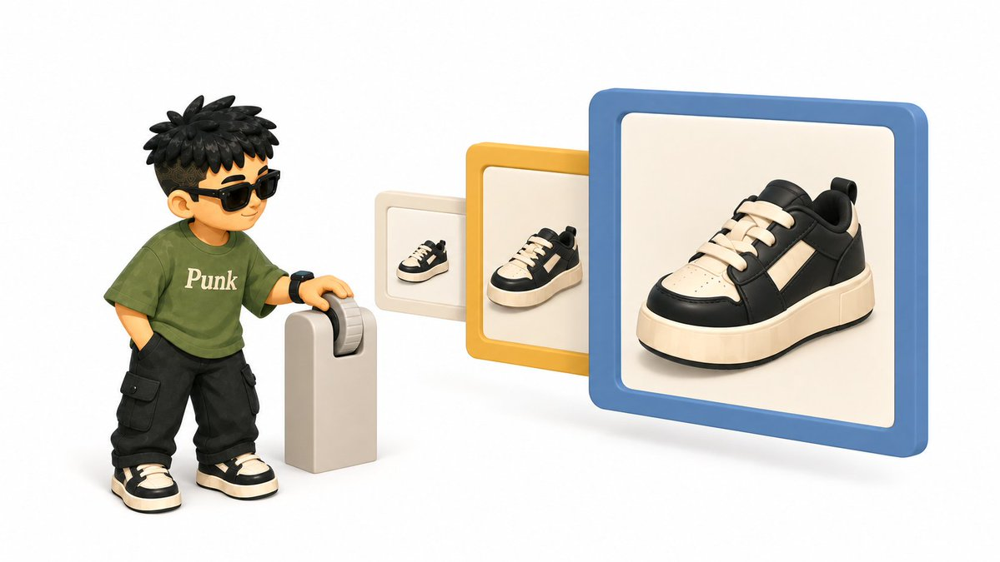

一条完整描述至少要交代四件事：操作对象、触发方式、动效名称、结束或替代状态。先把这四项说清，再让 AI 采用项目里已有的工具实现。

第三层还剩最后一组：组件展开、数字变化、加载反馈、布局过渡和页面转场。下一篇把这些产品网页里最常见的状态动效讲完，随后再进入第四层 UX 规则。

```text
作品卡片使用轻微立体倾斜（Tilt card）。卡片根据光标位置向对应方向小幅旋转，表面高光同步移动；文字层保持清晰，光标移开后平稳回正，手机端关闭倾斜。
```

## 往期前端类作品回顾：

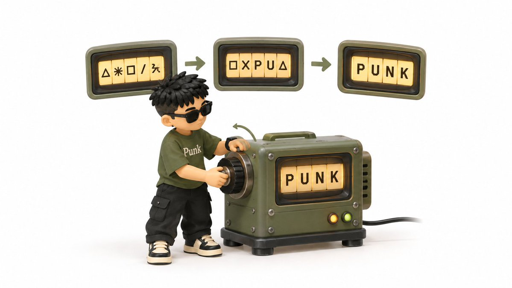

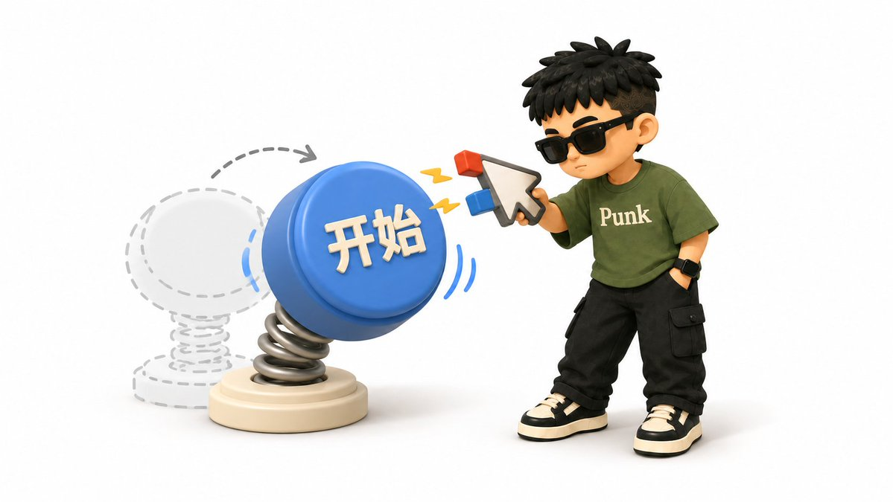

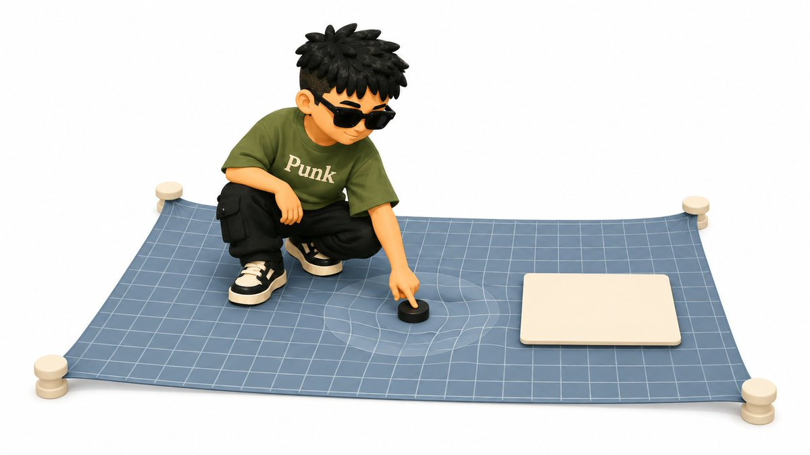

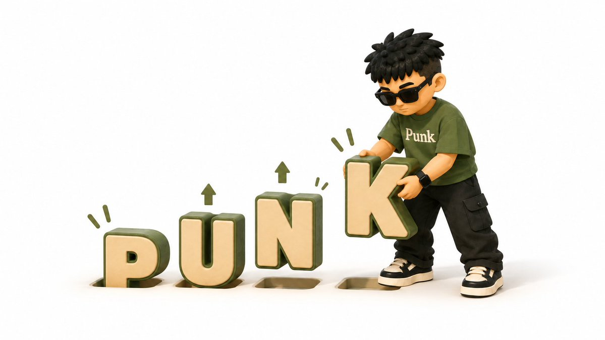

## 关于作者

Punk｜中科大管理学硕士｜AI提示词、AI小白教程｜Punk系列Skills作者｜3个月赚了8位数｜Learn in Public｜FDE文章浏览量240w｜@AdrianPunk115

```text
主按钮使用磁吸效果（Magnetic button）。光标靠近时，按钮和文字轻微向光标方向移动；移开后柔和回到原位。只应用在主按钮，触屏设备保持普通点击反馈。
```

