# 📰 Vibe Coding 视觉词典（上篇）：布局、页面结构、导航与常用组件

很多人让 AI 做网页时，只会说：

> 帮我做一个高级、简洁、有设计感的网站。

问题在于，“高级”“简洁”“有设计感”都不是明确的网页结构。AI 不知道内容应该怎么排，也不知道用户应该怎么浏览和操作。

[Embedded Tweet: https://x.com/i/status/2083832138462605504]

一个完整网页可以先拆成四层：

1. 页面布局 Layout：页面上的内容怎么排。

1. 页面结构 Page Structure：用户先看到什么，接着看到什么。

1. 导航 Navigation：用户如何移动、跳转和切换。

1. 组件 UI Components：用户如何点击、展开、输入和获得反馈。

下面所有示例都以 Punk 的个人网站为例子。每个词条只保留三部分：概念说明、适用场景、可直接复制给 AI 的提示词。

---

# 第一章：页面布局 Layout

页面布局决定内容如何占据屏幕：是整齐排列、错落排列、左右分屏，还是由大小不同的模块组成。它回答的是“页面上的东西怎么排”。

# 1\. 卡片式布局 Card-based Layout

把内容拆成一张张独立卡片，每张卡片承载一个项目、一篇文章、一项服务或一组信息。卡片之间边界清楚，浏览速度快，也是 AI 最容易稳定实现的布局之一。

适合： 作品集、博客列表、功能介绍、工具导航、商品列表、个人主页。

\`\`\`text
为 Punk 的个人网站创建一个响应式卡片式布局，
项目区展示 6 张独立卡片，每张卡片包含项目封面、项目名称、两行简介、技术标签和“查看项目”按钮；
桌面端三列，平板端两列，手机端单列；
使用米白背景、深绿色强调色、细边框、克制圆角和轻微阴影。
\`\`\`

# 2\. 瀑布流 Masonry Layout

卡片宽度大致一致，但高度不统一，内容像瀑布一样自然错落。它不会强迫每一行严格对齐，因此特别适合不同尺寸的图片和视觉作品。

适合： AI 生图作品集、摄影集、灵感墙、案例封面、视觉型博客。

\`\`\`text
为 Punk 创建一个瀑布流作品画廊，
使用三列 Masonry Layout 展示不同宽高比的 AI 作品，保留图片原始比例，不要裁切成统一高度；
桌面端三列，平板端两列，手机端单列；
图片进入视口附近时再加载，点击后打开全屏预览。
\`\`\`

# 3\. 便当盒布局 Bento Grid

用大小不同的矩形模块组成页面。最大的区域负责展示核心内容，小模块放技能、文章、联系方式、数字或状态，依靠尺寸差异建立视觉优先级。

适合： 个人主页、产品首页、SaaS 首页、创作者网站、AI 工具展示页。

\`\`\`text
为 Punk 设计一个 Bento Grid 个人主页，
左侧使用一张大型 Hero 卡片展示姓名、身份介绍和主要按钮，右
侧使用大小不同的模块卡片展示 About、Skills、Latest Writing 和 Contact，底部放一张横向 Featured Project 卡片；
不要做成平均九宫格，要通过模块大小突出主次关系。
\`\`\`

# 4\. 分屏布局 Split-screen Layout

把页面分成左右两部分，常见形式是左边文字、右边视觉，或者一边固定、另一边滚动。它能让信息和视觉同时成为主角。

适合： 个人首页、产品介绍、登录页、创意作品集、对比页面。

\`\`\`text
为 Punk 的个人主页设计一个 Split-screen Hero，
左侧占 45%，展示姓名、身份、简介和两个操作按钮，右侧占 55%，
展示抽象的网页界面与空间化视觉；
桌面端保持左右分屏，手机端改为上下结构，文字在前、视觉在后。
\`\`\`

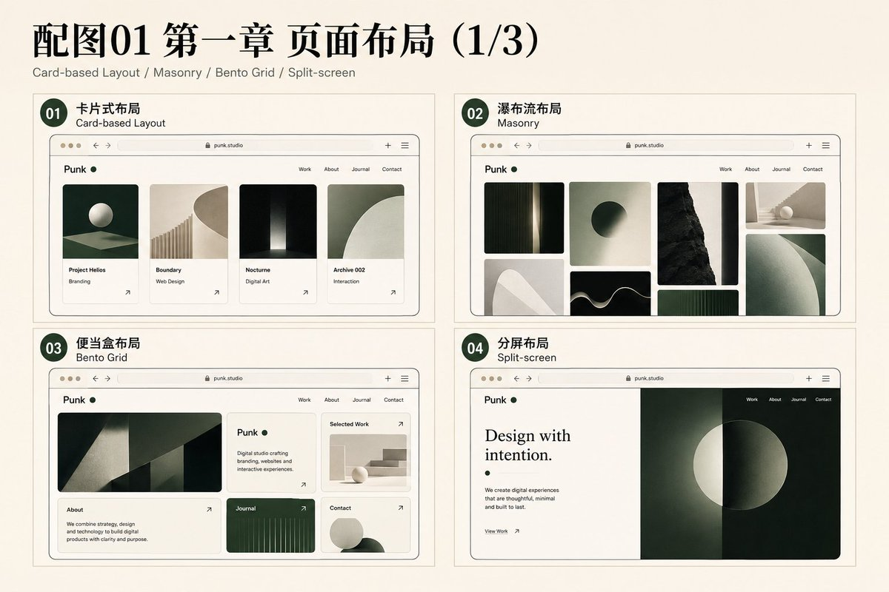

# 5\. CSS 网格布局 CSS Grid Layout

按照明确的行和列组织页面，适合处理二维关系。它可以让不同模块占据不同列宽，构建规则或非对称的复杂页面。

适合： 复杂首页、杂志排版、Dashboard、非对称作品集、响应式模块。

\`\`\`text
使用 CSS Grid 构建 Punk 的作品页面，
桌面端采用 12 列网格，主项目占 8 列，项目说明占 4 列，其余项目每张占 4 列；
900px 以下改为 6 列，640px 以下改为单列；
使用 grid-template-columns 和 gap，不要用绝对定位硬拼布局。
\`\`\`

# 6\. 弹性布局 Flexbox

让一组元素沿一个主要方向排列，最适合处理一行或一列中的对齐、间距和顺序。它常出现在导航栏、按钮组和卡片内部。

适合： 顶部导航、工具栏、按钮组、标签、头像与文字组合、卡片内部。

\`\`\`text
Punk 网站的顶部导航使用 Flexbox，左侧显示 Punk Logo，右侧显示 Work、About、Writing、Contact 和主题切换按钮；
使用 justify-content: space-between 和 align-items: center，
小屏幕时隐藏文字导航并显示 Hamburger Menu。
\`\`\`

# 7\. 侧边栏布局 Sidebar Layout

页面一侧长期保留一条栏，另一侧显示主要内容。侧边栏可以承载个人信息、分类、目录、筛选器或后台导航。

适合： 博客、文档站、后台、作品归档、设置页。

\`\`\`text
为 Punk 的 Journal 页面添加左侧 Sidebar，宽度为 260px，
包含头像、个人简介、文章分类、标签和社交链接，右侧为文章列表；
桌面端侧边栏保持 Sticky，手机端把侧边栏内容折叠到顶部筛选按钮中。
\`\`\`

# 8\. 仪表盘布局 Dashboard Layout

通常由侧边导航、顶部工具栏、统计卡片、图表、表格和最近活动构成，强调信息密度与任务效率。

适合： 个人内容后台、项目管理、数据产品、CMS、AI 工具控制台。

\`\`\`text
为 Punk 制作一个个人创作后台 Dashboard，
左侧导航包含 Overview、Projects、Writing、Analytics 和 Settings，
顶部包含搜索框、通知和头像，主内容区展示 4 张统计卡片、最近项目列表和访问趋势图；
桌面端侧栏固定，手机端转换为 Drawer。
\`\`\`

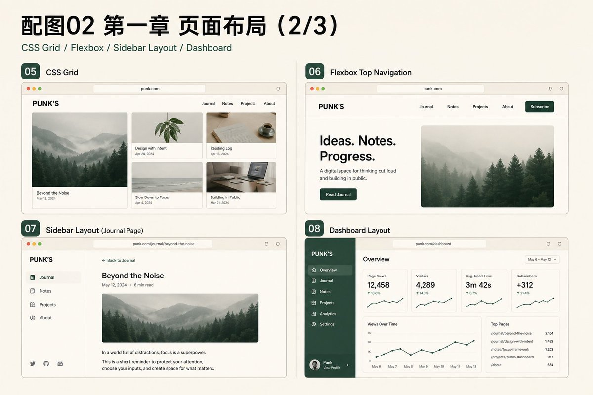

# 9\. 响应式布局 Responsive Layout

同一个网页根据屏幕尺寸重新排列，而不是把桌面页面整体缩小。桌面、平板和手机应该有不同的布局状态。

适合： 几乎所有公开网页。

\`\`\`text
让 Punk 的个人网站完全响应式，设置 desktop、tablet、mobile 三种布局状态；
桌面端内容最大宽度为 1200px，平板端卡片两列，手机端单列并把顶部导航改成 Hamburger Menu；
保证正文不出现横向滚动，所有按钮在触屏设备上都有清晰点击区域。
\`\`\`

# 10\. 全出血布局 Full-bleed Layout

图片、视频或颜色区域一直延伸到屏幕边缘，不受普通内容容器限制。它常被用来制造沉浸式首屏或章节过渡。

适合： 品牌首页、作品开场、摄影网站、产品发布页、沉浸式故事。

\`\`\`text
为 Punk 的首页创建一个 Full-bleed Hero，
背景视觉铺满浏览器宽度并占据 90vh，不受主内容 max-width 限制，
前景放置大标题、简短介绍和 View Work 按钮；
Hero 下方的正文重新回到 1120px 的居中容器，并保证文字与背景有足够对比度。
\`\`\`

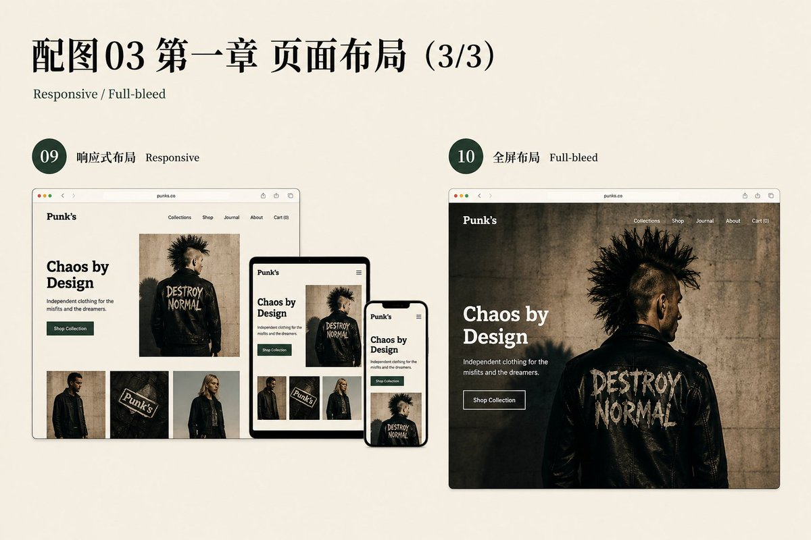

# 第二章：页面结构 Page Structure

页面结构决定用户先看到什么、接着看到什么，以及一个页面如何讲完一件事。它回答的是“内容按什么顺序出现”。

# 11\. 单页网站 Single-page Website

所有主要内容都放在同一页面中，用户通过滚动或锚点导航浏览 Hero、About、Projects、Writing 和 Contact。

适合： 个人名片、轻量作品集、活动页、早期产品介绍、信息量不大的官网。

\`\`\`text
为 Punk 制作一个单页个人作品网站，页面顺序为 Hero、About、Selected Work、Writing、Contact 和 Footer；
顶部导航通过 Anchor Links 跳转到对应区块，
使用平滑滚动但尊重 prefers-reduced-motion，每个区块都设置清晰的 id 和语义化标题。
\`\`\`

# 12\. 多页网站 Multi-page Website

不同内容拥有独立页面和网址，例如首页、作品列表、项目详情、关于、文章和联系页面。它更适合长期扩展。

适合： 成熟作品集、博客、企业官网、内容站、项目较多的网站。

\`\`\`text
把 Punk 的网站设计为多页网站，包含 Home、Work、Project Detail、About、Journal、Article 和 Contact；
所有页面共享统一的 Header 与 Footer，
当前导航项显示 active 状态，项目卡片点击后进入独立详情页。
\`\`\`

# 13\. 落地页 Landing Page

围绕一个明确目标组织页面，用户被引导完成注册、购买、预约、下载或联系。页面中的每一部分都服务于同一个行动。

适合： AI 产品、课程、活动、Newsletter、个人服务、作品发布。

\`\`\`text
为 Punk 的 AI 设计服务制作一个 Landing Page，唯一目标是引导访客预约咨询；
页面包含 Hero、服务价值、工作流程、三个案例、客户评价、FAQ 和最终 CTA，所有主要按钮统一使用“预约一次沟通”，
不要加入与转化目标无关的复杂导航。
\`\`\`

# 14\. 案例研究页 Case Study Page

不仅展示最终效果，还讲清项目背景、问题、过程、关键决策、方案、结果和复盘。

适合： 设计师作品集、开发者项目、产品项目、品牌案例、求职作品集。

\`\`\`text
为 Punk 创建一个项目案例研究页，
包含项目概览、背景问题、Punk 的职责、设计过程、关键决策、最终方案、结果数据和复盘；
顶部使用大封面，正文保持窄阅读宽度，过程图片可全宽穿插，桌面端右侧提供 Sticky Table of Contents。
\`\`\`

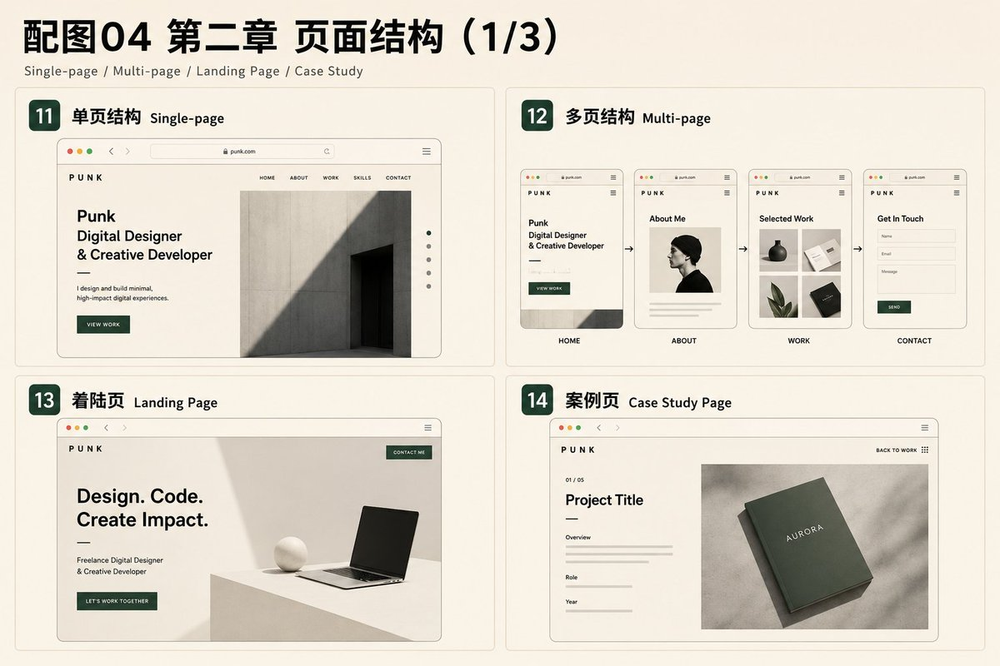

# 15\. 首屏 Hero Section

用户打开页面最先看到的区域，负责快速回答你是谁、你做什么、为什么值得继续看，以及下一步该点哪里。

适合： 几乎所有首页和 Landing Page。

\`\`\`text
为 Punk 的个人主页创建一个清晰的 Hero Section，
主标题为“Punk designs and builds AI-native experiences.”，副标题控制在两行以内，包含 View Work 和 Contact 两个按钮；
右侧使用抽象、低饱和的网页界面意象，不要使用办公桌、家居产品或商业图库人物。
\`\`\`

# 16\. 功能网格 Feature Grid

用三到六个并列模块介绍能力、服务或产品功能，每个模块通常包含图标、标题和短说明。

适合： 能力介绍、产品功能、服务清单、优势展示。

\`\`\`text
在 Punk 的 About 区块下方添加一个四列 Feature Grid，四项内容为 Design、Frontend、AI Prototyping 和 Writing，每项包含一个线性图标、标题和不超过两行的说明；桌面端四列，平板两列，手机单列，避免夸张阴影。
\`\`\`

# 17\. 固定叙事区 Sticky Storytelling

一侧内容固定，另一侧随着滚动依次出现不同阶段，让复杂过程像讲故事一样被阅读。

适合： 产品故事、项目过程、时间线、复杂功能解释、品牌叙事。

\`\`\`text
为 Punk 的项目详情页设计一个 Sticky Storytelling Section，桌面端左侧 38% 区域保持 Sticky 并展示当前阶段标题和说明，右侧依次滚动展示 Discover、Design、Build 三个内容面板；当前阶段进入视口时更新左侧文字，手机端取消 Sticky 并改为正常纵向排列。
\`\`\`

# 18\. 时间线 Timeline

用一条线和多个节点按时间顺序展示经历、版本、里程碑或项目进展。

适合： 职业经历、项目里程碑、产品版本、公司历史、学习路径。

\`\`\`text
在 Punk 的 About 页面添加一条 Vertical Timeline，每个节点包含年份、事件名称和两行说明；桌面端内容位于时间线右侧，手机端保持单列；使用细绿色线条和圆形节点，不要做成复杂路线地图。
\`\`\`

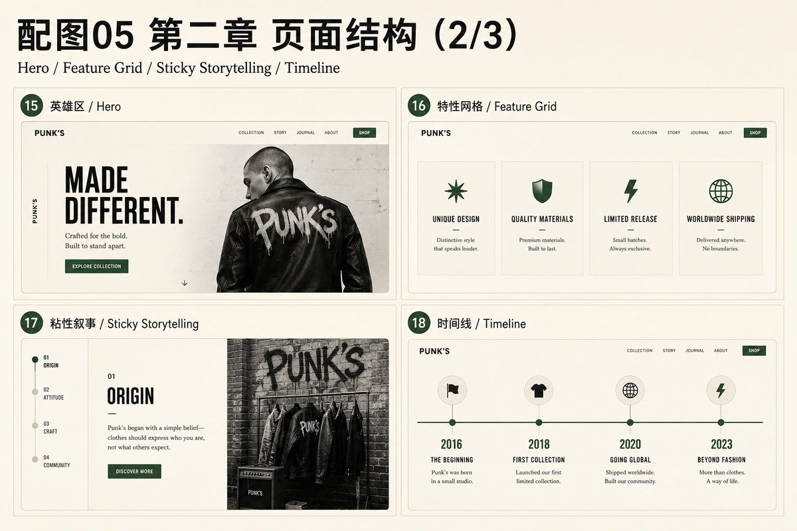

# 19\. 常见问题 FAQ Section

把常见问题集中放在页面末段，通常通过折叠面板展开答案，帮助用户快速消除疑虑。

适合： 服务说明、产品定价、课程、合作流程、常见疑问。

\`\`\`text
在 Punk 的 Contact 页面之前添加 FAQ Section，
包含 6 个问题，例如 Punk 接受什么项目、合作周期多久、是否提供开发、如何开始合作；
答案默认折叠，同一时间只允许打开一个问题，使用原生 button 并正确设置 aria-expanded。
\`\`\`

# 20\. 页脚 Footer

页面最底部的收尾区域，用来承载站点导航、社交链接、联系方式、版权信息和订阅入口。

适合： 所有完整网站。

\`\`\`text
为 Punk 的个人网站设计一个完整 Footer，左侧显示 Punk Logo 和一句简介，中间分为 Explore、Connect、Elsewhere 三组链接，
右侧显示邮箱和 Newsletter 订阅框，底部显示版权与隐私链接；
使用深绿色背景和米白文字，与页面主体形成明确收尾。
\`\`\`

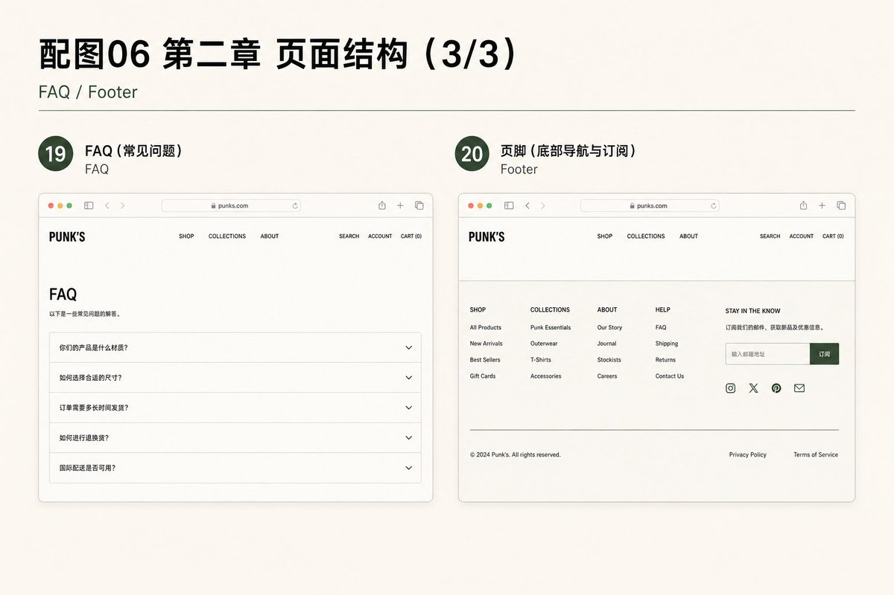

# 第三章：导航与切换 Navigation

导航决定用户怎样在页面和内容之间移动。它回答的是“我在哪里、我还能去哪里、点击后会发生什么”。

# 21\. 固定导航 Sticky Navbar

页面向下滚动时，顶部导航仍然保持可见，适合长页面和需要频繁跳转的内容。

适合： 长页面、单页网站、文档、Landing Page、作品集。

\`\`\`text
为 Punk 的网站添加 Sticky Navbar，
初始状态使用透明背景，滚动超过 40px 后变为米白背景并增加细边框和轻微 backdrop blur；
导航高度保持稳定，移动端使用 Hamburger Menu。
\`\`\`

# 22\. 汉堡菜单 Hamburger Menu

手机端右上角常见的三条横线按钮，点击后展开或滑出完整导航。

适合： 移动网站、小屏界面、极简导航、导航项较少的网站。

\`\`\`text
Punk 网站在 768px 以下使用 Hamburger Menu，
右上角显示三条横线按钮，点击后从右侧滑出 Drawer，
包含 Home、Work、About、Writing 和 Contact；
打开后锁定背景滚动，支持 Esc 关闭、点击遮罩关闭和键盘焦点管理。
\`\`\`

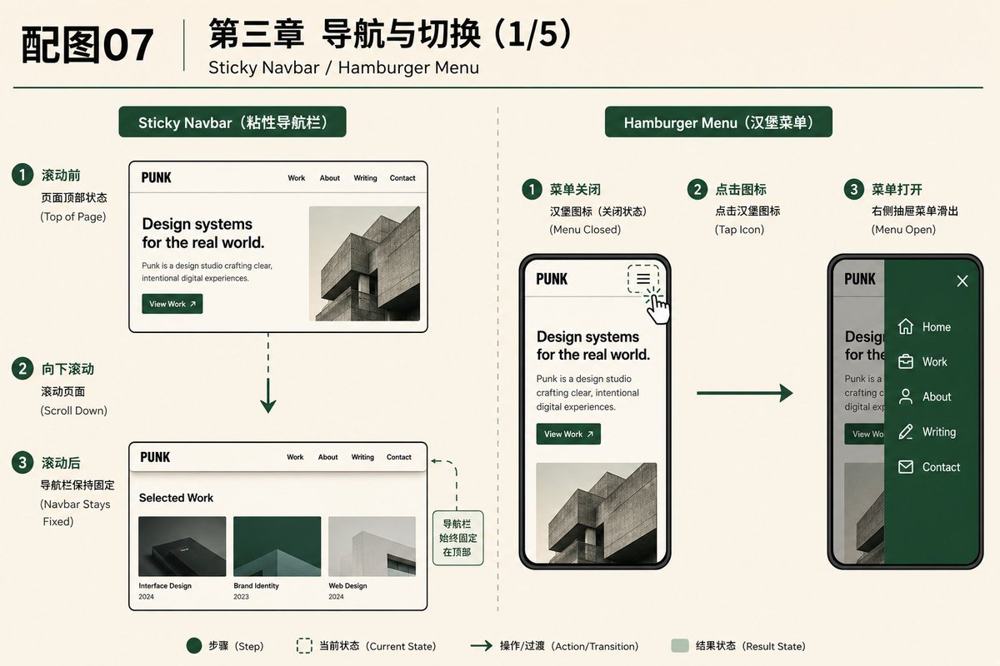

# 23\. 面包屑 Breadcrumb

在页面顶部显示层级路径，例如“首页 › 作品 › AI 工具 › 项目详情”，帮助用户理解当前页面在网站结构中的位置。

适合： 多层级网站、电商、博客、文档、项目详情页。

\`\`\`text
在 Punk 的项目详情页顶部添加 Breadcrumb，
路径为 Home › Work › AI Tools › Project Detail；
使用 nav aria-label="Breadcrumb" 和有序列表，
最后一项表示当前页面，不设置链接，并添加 aria-current="page"。
\`\`\`

# 24\. 锚点跳转 Anchor Link

点击导航后不打开新页面，而是移动到当前页面中的指定区块。

适合： 单页网站、长文章、Landing Page、文档目录、页面内目录。

\`\`\`text
为 Punk 的单页网站添加 Anchor Links，About、Work、Writing、Contact 分别链接到对应 section id；
点击后平滑滚动，到达区块时预留 Sticky Header 高度，
并让当前所在区块对应的导航项显示 active 状态。
\`\`\`

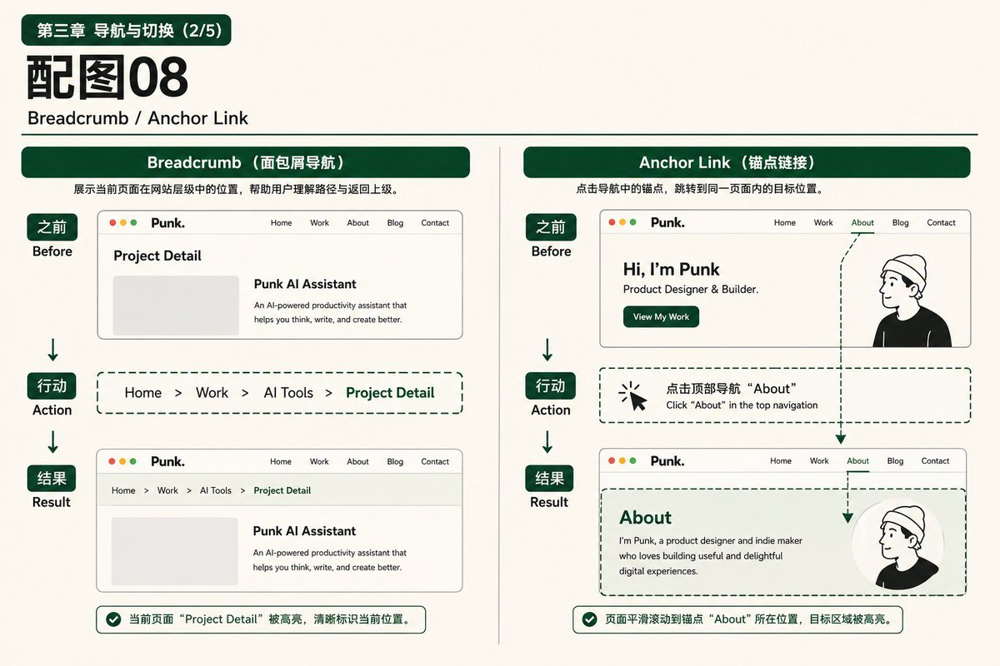

# 25\. 标签切换 Tabs

多个标签共用同一块内容区域，一次只显示其中一个同等级视图。

适合： 内容分类、数据视图、设置、作品分类、月度与年度图表。

\`\`\`text
在 Punk 的作品区添加 Tabs，标签为 All、Web、AI、Experiments，默认显示 All；
切换标签时只更新下方项目网格，不刷新整个页面；
使用 tablist、tab 和 tabpanel 语义，支持左右方向键切换并显示清晰 active 状态。
\`\`\`

# 26\. 侧边导航 Sidebar Navigation

把主要导航长期放在页面左侧或右侧，适合入口较多、层级较深的系统。

适合： 后台、文档、设置页、复杂工具、个人内容管理。

\`\`\`text
为 Punk 的创作后台添加 Sidebar Navigation，
包含 Overview、Projects、Posts、Media、Analytics 和 Settings，当前页面使用绿色背景和图标强调，二级菜单允许折叠；
桌面端固定显示，手机端收起为 Drawer。
\`\`\`

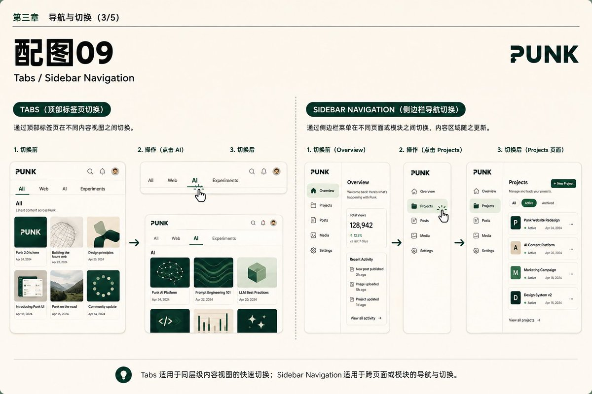

# 27\. 超级菜单 Mega Menu

点击主导航后展开一个面积较大的多列菜单，可以同时展示分类、子页面和精选内容。

适合： 内容很多的网站、产品矩阵、资源中心、复杂作品分类。

\`\`\`text
Punk 网站的 Work 导航项使用 Mega Menu，
展开后显示 Projects、Experiments、Resources 三列，并在右侧增加一个 Featured Project 预览；
菜单通过点击打开，不依赖 hover，支持键盘导航和 Esc 关闭，手机端改为 Accordion Menu。
\`\`\`

# 28\. 底部导航 Bottom Navigation

在手机屏幕底部长期显示三到五个最重要的入口，适合需要频繁切换核心区域的移动产品。

适合： 移动 Web App、Dashboard、内容工具、创作工具。

\`\`\`text
为 Punk 的移动端创作工具添加 Bottom Navigation，
固定在屏幕底部，包含 Home、Projects、Create、Notes 和 Profile，
当前项使用绿色填充图标，并考虑 iPhone safe-area-inset-bottom；
桌面端不显示该组件。
\`\`\`

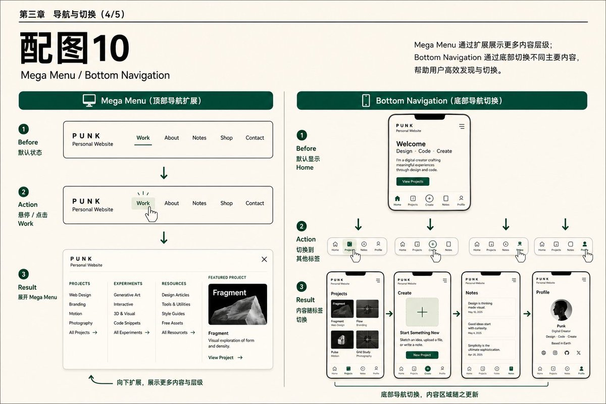

# 29\. 分页 Pagination

把长列表拆成多个固定页面，用户通过页码或上一页、下一页进行切换。

适合： 博客归档、搜索结果、后台表格、作品列表、数据量较大的列表。

\`\`\`text
为 Punk 的 Journal 文章列表添加 Pagination，
每页显示 10 篇文章，底部显示 Previous、页码和 Next，
当前页具有明显状态，并在 URL 查询参数中保存页码，例如 ?page=2；
按钮使用真实链接，便于刷新、分享和返回。
\`\`\`

# 30\. 返回顶部 Back to Top

页面滚动到一定距离后，右下角出现返回顶部按钮，帮助用户快速回到页面开头。

适合： 长文章、长作品页、文档、长列表。

\`\`\`text
为 Punk 的长篇文章页添加 Back to Top 按钮，
滚动超过 800px 后淡入显示并固定在右下角，点击后返回页面顶部；
按钮提供 aria-label="返回顶部"，并在 reduced motion 模式下取消平滑动画。
\`\`\`

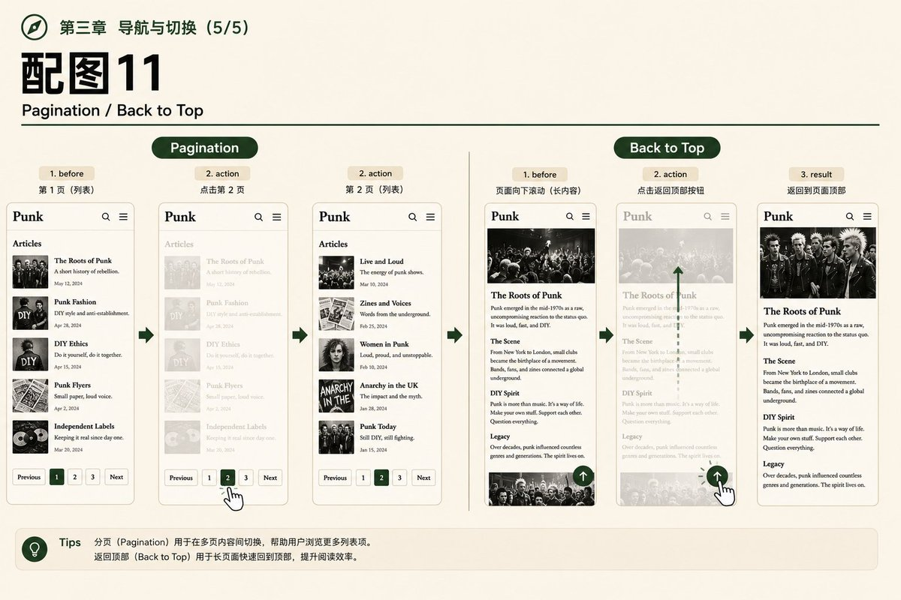

# 第四章：常用组件 UI Components

组件是页面中的局部交互单元。它回答的是“点击、输入、展开、关闭和反馈应该如何发生”。

# 31\. 模态框 Modal

一个覆盖在当前页面之上的对话框，背景被遮罩，用户需要先处理或关闭它才能回到页面。

适合： 联系表单、确认操作、登录、快速预览、必须立即处理的任务。

\`\`\`text
Punk 网站点击 Contact 后打开 Modal，
Modal 内包含姓名、邮箱、项目类型和留言；
打开时把键盘焦点移动到标题或第一个输入框，关闭后把焦点返回触发按钮；
使用原生 dialog 和 showModal()，支持 Esc 关闭，并阻止背景内容被键盘访问。
\`\`\`

# 32\. 抽屉 Drawer

一个从屏幕左侧、右侧或底部滑出的面板，可以展示导航、筛选、设置或详情。

适合： 移动导航、筛选、设置、详情预览、购物车、通知中心。

\`\`\`text
Punk 的项目列表点击卡片后，从右侧打开一个 Project Detail Drawer，桌面端宽度为 420px，
显示封面、简介、技术栈和访问链接；
页面主体仍然可见但不可操作，手机端让 Drawer 从底部打开并接近全屏。
\`\`\`

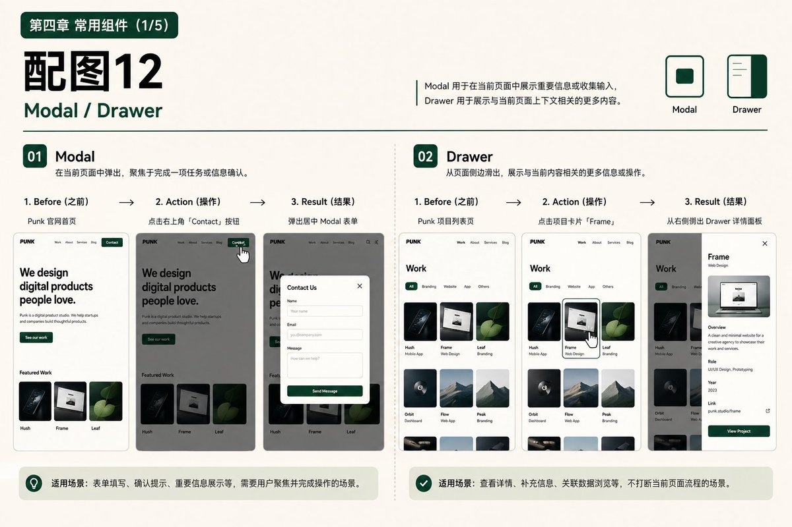

# 33\. 手风琴 Accordion

多组标题纵向排列，点击标题后展开或收起对应内容。

适合： FAQ、移动菜单、筛选器、课程目录、分组说明。

\`\`\`text
为 Punk 的 FAQ 创建 Accordion，每个标题使用 button，
右侧显示加号或箭头，展开时更新 aria-expanded，并通过 aria-controls 关联内容面板；
同一时间只展开一个项目，动画控制在 200ms 左右。
\`\`\`

# 34\. 气泡提示 Tooltip

鼠标悬停或键盘聚焦到图标时，旁边出现一小块简短说明。它只适合补充短信息。

适合： 图标解释、术语补充、按钮名称、图表数据说明。

\`\`\`text
在 Punk 的项目卡片图标上添加 Tooltip，鼠标 hover 或键盘 focus 时显示，
内容控制在一句话以内，Tooltip 不获得独立焦点，离开触发元素或按 Esc 后消失；
不要只支持 hover，触屏设备需要提供可理解的替代方式。
\`\`\`

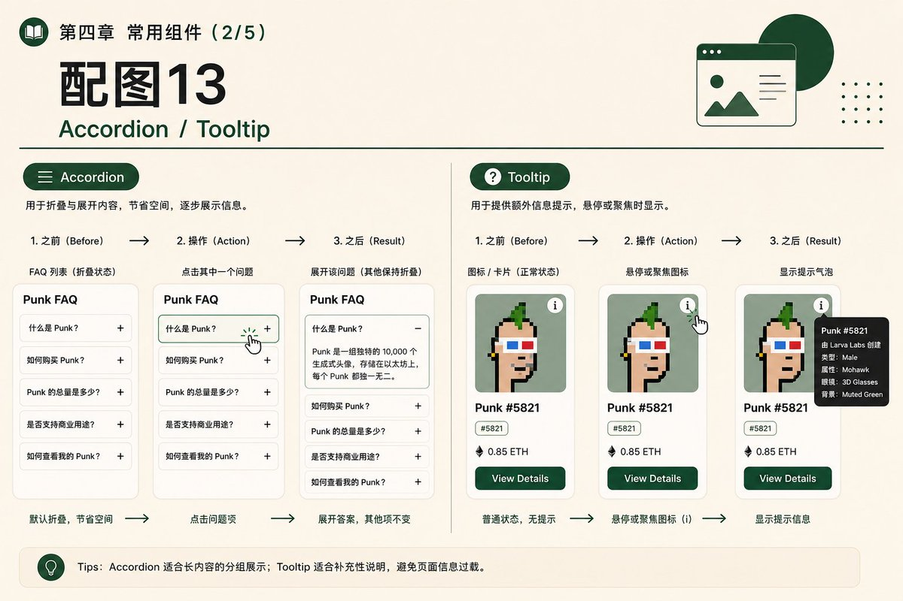

# 35\. 轻提示 Toast

完成操作后在页面角落短暂出现的状态消息，不会像 Modal 一样中断用户。

适合： 保存、复制、发布、删除、网络状态和轻量操作反馈。

\`\`\`text
Punk 后台保存文章后，在右上角显示 Success Toast“文章已保存”，
Toast 包含状态图标、文字和关闭按钮，4 秒后自动消失；
错误 Toast 不要快速自动消失，并提供重试操作；
使用 aria-live 向辅助技术宣布状态。
\`\`\`

# 36\. 轮播图 Carousel

在有限空间中轮流展示多个项目，通常带有左右箭头、圆点指示和当前序号。

适合： 精选项目、客户评价、产品截图、活动 Banner。

\`\`\`text
在 Punk 首页添加 Featured Projects Carousel，
一次展示 1 个主项目和下一项目的一小部分预览，提供 Previous、Next 按钮和 01 / 05 序号；
默认不自动播放，支持触摸滑动和键盘操作，用户启用 reduced motion 时取消滑行动画。
\`\`\`

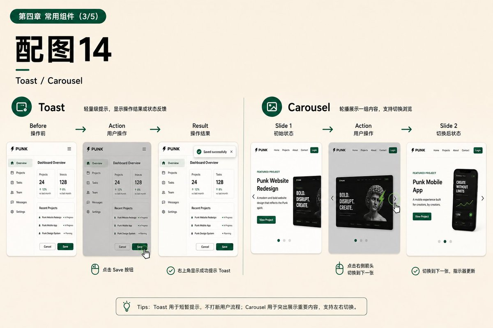

# 37\. 图片灯箱 Lightbox

点击缩略图后，在遮罩层上放大显示原图，并支持关闭、切换和查看标题。

适合： 摄影、AI 作品、插画、项目截图、视觉作品集。

\`\`\`text
为 Punk 的 AI Gallery 添加 Lightbox，
点击缩略图后全屏显示原图，支持左右切换、Esc 关闭和图片标题，打开后锁定背景滚动；
缩略图使用 button 或 link 触发，所有图片提供准确的 alt 文本。
\`\`\`

# 38\. 表单 Form

由输入框、标签、选择器、复选框和提交按钮组成，用来完成联系、订阅、登录或设置等任务。

适合： 联系、订阅、登录、搜索、预约、设置。

\`\`\`text
为 Punk 的 Contact 页面创建一个可访问的联系表单，
字段包括 Name、Email、Project Type、Budget Range 和 Message；
每个输入框都有可见 label，必填项和错误信息清晰，
提交中显示 loading 状态，成功后显示 Toast，并在确认提交成功前保留用户输入内容。
\`\`\`

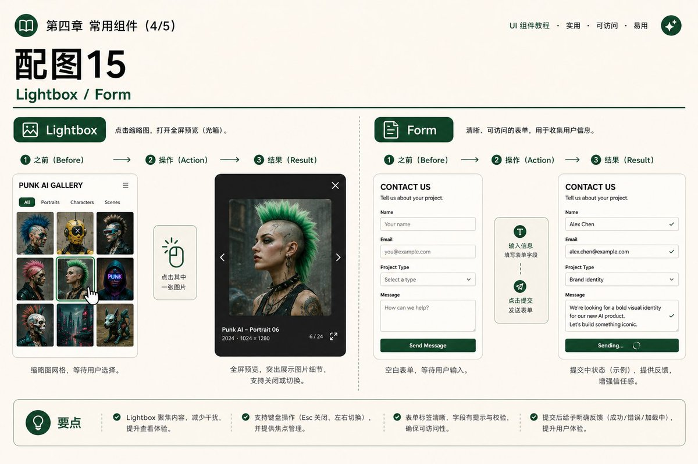

# 39\. 命令面板 Command Palette

按下快捷键后弹出的快速搜索与操作面板，用户可以通过键盘跳转页面或执行命令。

适合： 开发者工具、文档站、复杂个人网站、Dashboard、效率工具。

\`\`\`text
为 Punk 的网站添加 Command Palette，用户按 Command+K 或 Ctrl+K 后打开，可以搜索并执行 Go to Work、Open About、Read Journal、Toggle Theme 和 Contact Punk；支持上下方向键选择、Enter 执行、Esc 关闭，并按页面与操作分组显示结果。
\`\`\`

# 40\. 悬浮操作按钮 Floating Action Button

固定在界面角落的主要操作按钮，不随内容滚走，通常代表新增、创建或快速联系。

适合： Dashboard、移动工具、创作应用、快速联系、主要新增操作。

\`\`\`text
在 Punk 的项目后台右下角添加 Floating Action Button，
使用加号图标并固定在视口右下角，点击后展开 New Project、New Post 和 Upload Image 三个快捷操作；
按钮不能遮挡底部导航或重要内容，并考虑移动端安全区域。
\`\`\`

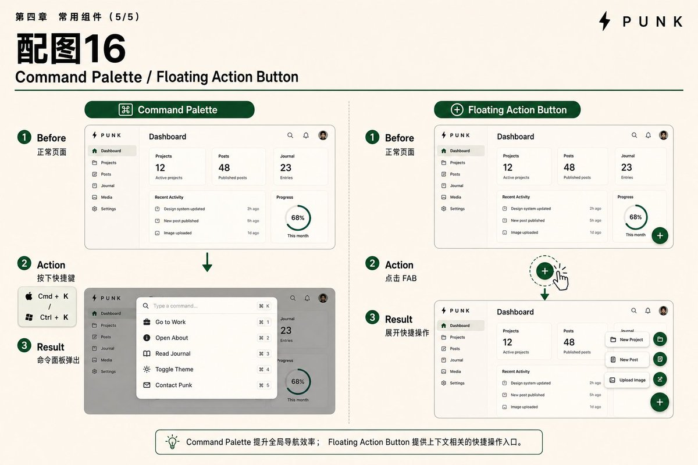

# 一段可以直接复制的完整网页提示词

\`\`\`text
请为 Punk 设计并实现一个响应式个人作品网站。

网站包含 Home、Work、Project Detail、About、Journal 和 Contact。

首页使用 Split-screen Hero：左侧展示 Punk 的姓名、身份介绍、简介和主要按钮，右侧展示抽象的网页界面与空间化视觉。Hero 下方使用 Bento Grid，展示 Featured Project、About、Skills、Latest Writing 和 Contact。

作品页面使用响应式 Card-based Layout，桌面端三列、平板端两列、手机端单列；AI 图片作品使用 Masonry Gallery，并保留不同图片的原始宽高比。

项目详情使用 Case Study Page，包含 Overview、Problem、Role、Process、Key Decisions、Solution、Outcome 和 Reflection，桌面端右侧提供 Sticky Table of Contents。

桌面端使用 Sticky Navbar，移动端使用 Hamburger Menu 并从右侧打开 Drawer；项目详情顶部显示 Breadcrumb；单页区块使用 Anchor Links。

联系表单使用 Modal，作品图片支持 Lightbox，保存和复制操作使用 Toast，FAQ 使用 Accordion，站内快速跳转使用 Command Palette。

整体使用米白背景、深绿色强调色和黑色正文，视觉元素采用低饱和抽象图形、半透明网页面板和空间层次；不要使用家居产品、办公桌摆拍、商业图库人物或卡通插画。

所有页面 Mobile-first，使用语义化 HTML、CSS Grid 和 Flexbox；交互组件支持键盘操作、清晰焦点状态和屏幕阅读器；尊重 prefers-reduced-motion；图片设置 width、height 和 alt，首屏以下图片使用 Lazy Loading。
\`\`\`

---

## 关于作者

Punk｜中科大 MBA｜HerName 首席设计师｜Stanley 商学院执行院长｜ ｜AI提示词｜3个月赚了8位数｜Learn in Public｜[@AdrianPunk115](https://x.com/@AdrianPunk115)

### 🖼️ Attached Media

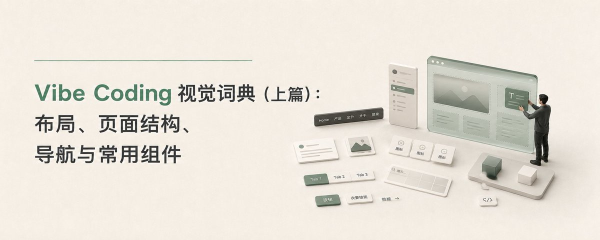

## 💬 Replies

### 1 @AdrianPunk115 (Adrian Punk) (Author)

*Thu Aug 06 04:09:44 +0000 2026*

结合起来把八个部分看完，一个完整带交互、带功能性的网站就能按照你的意志完成，且效率翻倍[x.com/adrianpunk115/…](https://x.com/adrianpunk115/status/2084932520953753985?s=46)

### 2 @isnail (蜗牛King 👑)

*Tue Aug 04 13:38:50 +0000 2026*

@AdrianPunk115 我一直觉得vibecoding 是艺术，是需要审美的活

### 3 @AdrianPunk115 (Adrian Punk) (Author)

*Tue Aug 04 13:47:44 +0000 2026*

@isnail 的确是这样 必然就是vibe slap

### 4 @0008luna (月月| 现货首选CoinUp·0手续费)

*Tue Aug 04 07:21:17 +0000 2026*

@AdrianPunk115 最近我也想折腾AI了，来学一下

### 5 @AdrianPunk115 (Adrian Punk) (Author)

*Tue Aug 04 07:27:32 +0000 2026*

@0008luna 折腾起来

### 6 @Stanleysobest (Stanley)

*Tue Aug 04 07:17:22 +0000 2026*

@AdrianPunk115 这也太全面了吧

### 7 @AdrianPunk115 (Adrian Punk) (Author)

*Tue Aug 04 07:19:01 +0000 2026*

@Stanleysobest 那必须的手把手教学如何写网页

### 8 @kingzw888 (king | 来Gate事件合约抢百万积分)

*Tue Aug 04 07:17:58 +0000 2026*

@AdrianPunk115 会使用Ai真的帮助很大呀

### 9 @AdrianPunk115 (Adrian Punk) (Author)

*Tue Aug 04 07:18:50 +0000 2026*

@kingzw888 确实降低了门槛，不过提示词依然很重要

### 10 @ziru999 (子儒)

*Tue Aug 04 07:26:14 +0000 2026*

@AdrianPunk115 非常有价值的文章

### 11 @AdrianPunk115 (Adrian Punk) (Author)

*Tue Aug 04 07:29:07 +0000 2026*

@ziru999 谢谢 希望能给大家做网页的时候提供一些参考

### 12 @zhuahua1 (Flora_花花)

*Tue Aug 04 07:15:53 +0000 2026*

@AdrianPunk115 太详细了，收藏起来了

### 13 @AdrianPunk115 (Adrian Punk) (Author)

*Tue Aug 04 07:41:32 +0000 2026*

@zhuahua1 喂给知识库

### 14 @mnmn94253156337 (撸毛吃猪脚饭| 美股合约首选Gate)

*Tue Aug 04 07:15:33 +0000 2026*

@AdrianPunk115 学习了 这个不错

### 15 @AdrianPunk115 (Adrian Punk) (Author)

*Tue Aug 04 07:41:13 +0000 2026*

@mnmn94253156337 做一个自己的网页

### 16 @Mizaza1997_ (Mi1997_ 🧡 来Gate事件合约抢百万积分)

*Tue Aug 04 07:20:04 +0000 2026*

@AdrianPunk115 这个感觉是我的刚需

### 17 @AdrianPunk115 (Adrian Punk) (Author)

*Tue Aug 04 07:40:59 +0000 2026*

@Mizaza1997\_ 哈哈哈那你持续关注下一节

### 18 @zhoguwn2782184 (小赵|🕊️| 🎒)

*Tue Aug 04 07:16:31 +0000 2026*

@AdrianPunk115 很实用内容，谢谢分享

### 19 @AdrianPunk115 (Adrian Punk) (Author)

*Tue Aug 04 07:41:48 +0000 2026*

@zhoguwn2782184 感谢支持

### 20 @proven018 (ProvenDaily🔶BNB)

*Tue Aug 04 07:17:05 +0000 2026*

@AdrianPunk115 很详细 先去学习一下

### 21 @AdrianPunk115 (Adrian Punk) (Author)

*Tue Aug 04 07:41:59 +0000 2026*

@proven018 放在知识库里😬

### 22 @TTZTTS (加密旺哥)

*Tue Aug 04 08:09:16 +0000 2026*

@AdrianPunk115 Vibe Coding这波确实方便了

### 23 @AdrianPunk115 (Adrian Punk) (Author)

*Tue Aug 04 08:09:39 +0000 2026*

@TTZTTS 是的 知道点准确的词 更方便

### 24 @davinci_seven (达芬七Seven)

*Tue Aug 04 12:05:33 +0000 2026*

@AdrianPunk115 根本没有创作瓶颈啊

### 25 @AdrianPunk115 (Adrian Punk) (Author)

*Tue Aug 04 12:18:44 +0000 2026*

@davinci\_seven 已经瓶颈

### 26 @cryozerolabs (冰零)

*Tue Aug 04 09:05:09 +0000 2026*

@AdrianPunk115 非常清晰的分享！很舒服的设计

### 27 @AdrianPunk115 (Adrian Punk) (Author)

*Tue Aug 04 10:01:39 +0000 2026*

@cryozerolabs 感谢🙏

### 28 @HoodyLiu (Hoody)

*Tue Aug 04 10:19:03 +0000 2026*

@AdrianPunk115 建议把punk的文章作为大学教材，培养一下计算机学生的审美！

### 29 @AdrianPunk115 (Adrian Punk) (Author)

*Tue Aug 04 10:22:54 +0000 2026*

@HoodyLiu 哈哈哈大学教材 不愧作为院长了

### 30 @zhanghedongya (zhanghedong)

*Tue Aug 04 15:23:47 +0000 2026*

@AdrianPunk115 文章是细节满满

### 31 @AdrianPunk115 (Adrian Punk) (Author)

*Tue Aug 04 15:59:51 +0000 2026*

@zhanghedongya 😄明天发下一期

### 32 @syjwanya (sun的分享)

*Wed Aug 05 06:20:22 +0000 2026*

@AdrianPunk115 太干了 必须收藏

### 33 @AdrianPunk115 (Adrian Punk) (Author)

*Wed Aug 05 06:30:49 +0000 2026*

@syjwanya 哈哈今天发下一期

### 34 @AomyYing (Aomyying)

*Tue Aug 04 07:36:08 +0000 2026*

@AdrianPunk115 我收藏了 对我是真的有用

### 35 @AdrianPunk115 (Adrian Punk) (Author)

*Tue Aug 04 07:39:16 +0000 2026*

@AomyYing 哈哈敬请期待下一节

