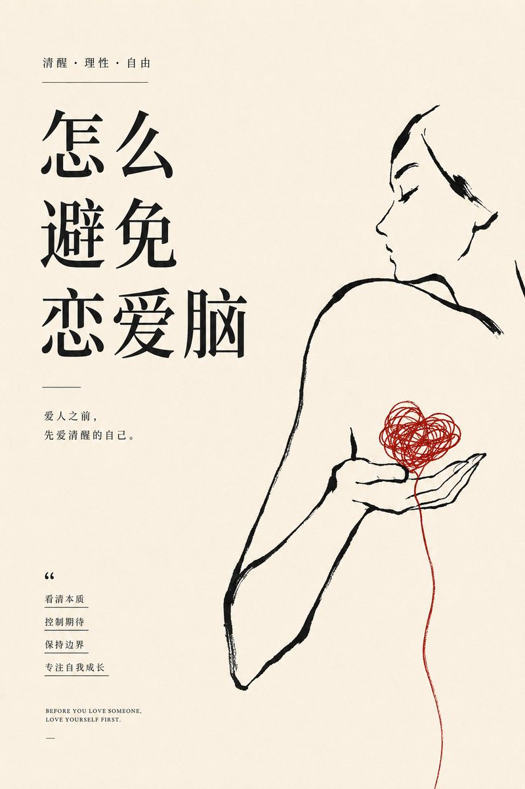
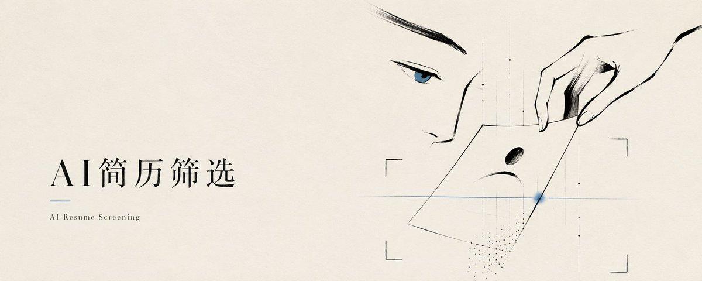
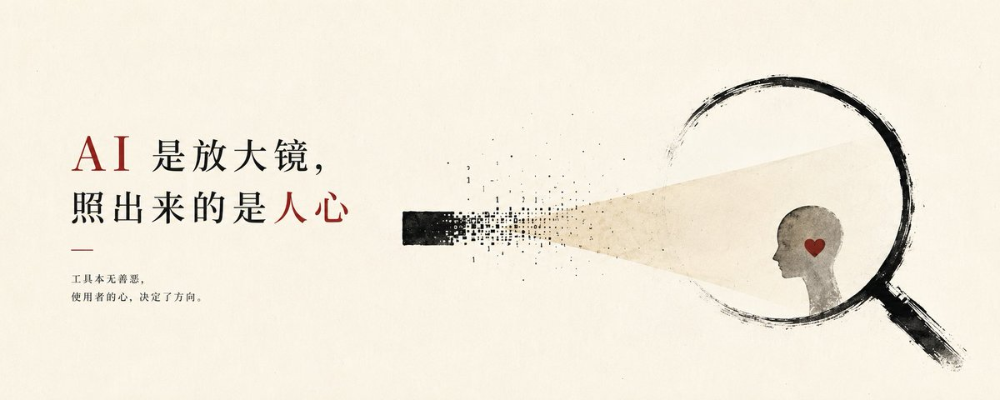
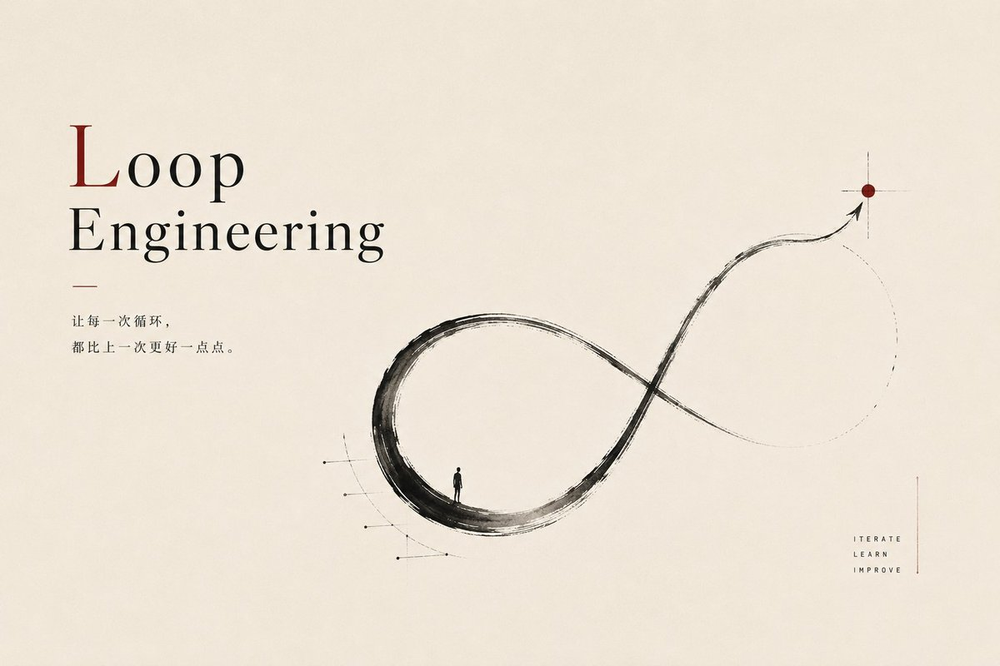
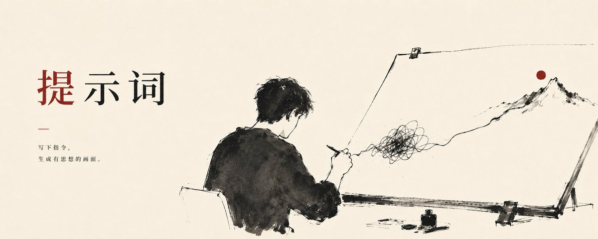
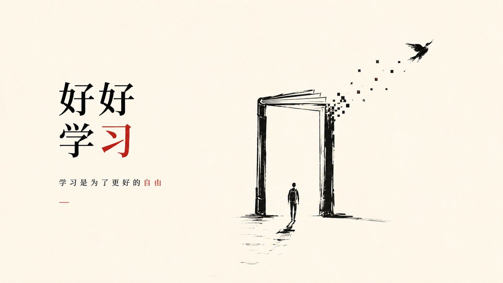
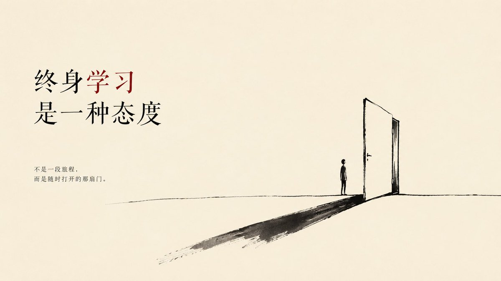

# 📰 当我开始揣摩Less Is More...

前几天刷到法国画家 Frédéric Forest 的作品：大面积留白，几根极简线条，却能把拥抱、孤独、爱与克制表达得很深。

这就是画面里的 Less is More。元素越少，情绪反而越集中。

这套提示词的核心，就是让画面先做减法，再用一个准确的视觉隐喻把主题留下来。

少，不代表空。
少，是让重要的东西被看见。

\`\`\`
你是一名法式极简艺术海报设计师、视觉隐喻导演和编辑设计师。

请围绕我输入的主题，创作一张大留白、少线条、少文字、具有思想张力的极简艺术封面。

【用户输入】

主题：{{填写主题}}

画幅比例：{{5:2 / 16:9 / 4:5 / 3:4}}

副主题：{{可留空，最多1—2句}}

【第一步：理解主题】

不要收到主题后立刻套用人物、物品或固定构图。

先提炼主题中的：

核心观点；
核心矛盾；
情绪状态；
因果关系；
最值得被看见的那一层含义。

将主题压缩成一句清晰判断，再寻找一个能够承载这句话的视觉隐喻。

每张图只保留：

一个主标题；
一个核心隐喻；
一个主要视觉中心；
最多1—2句副主题。

不要把主题中的所有概念逐一画出来。

【第二步：判断需要什么主体】

视觉主体可以是：

人物或人物局部；
人物之间的关系；
人物与物体之间的关系；
日常物品；
自然物体；
抽象线条；
几何结构；
空间距离；
光影、缺口、遮挡、重复或断裂。

人物不是默认选项，也不是禁止选项。

如果主题与爱情、关系、孤独、信任、欲望、成长、告别、自我和选择有关，可以使用人物、侧脸、背影、手部、身体姿态或人物间的距离。

如果主题与制度、规则、效率、循环、信息差、边界、秩序或风险有关，可以使用物体、结构、线条和空间关系。

如果主题与AI、互联网、算法、数字世界或科技有关，画面必须让人产生轻微的科技联想，但仍要保持艺术化表达。

科技关联可以通过以下方式表现：

由极少量方点组成的线；
逐渐转化为像素的墨迹；
一段有规律的节点；
极简数字痕迹；
人工秩序与自然笔触之间的对比；
一个传统物体出现轻微数字化变化。

这些科技痕迹只能作为隐喻的一部分，不能成为装饰背景。

不要直接堆放芯片、机器人、机械大脑、发光网络、数据面板或科技图标。

【视觉隐喻规则】

视觉隐喻必须根据主题重新思考，不能机械复用过去的答案。

可以使用：

一个动作；
一个普通物品；
两个物体之间的关系；
人物与物体之间的关系；
结构的断裂、循环、错位、遮挡、平衡或失衡；
距离、方向、重量、大小和负空间；
自然形态与人工秩序之间的变化。

每张图只使用一个核心隐喻。

隐喻必须简单，但不能肤浅。

不看副文案时，观众也应当能够产生与主题有关的联想。

如果一个隐喻需要长篇解释，说明它不够准确，应重新选择。

【避免直白和俗套】

不要把主题中的名词直接变成图标。

例如：

爱情主题不必默认使用红心；
AI主题不必默认使用机器人、芯片和电路板；
自由主题不必默认使用飞鸟和鸟笼；
思考主题不必默认使用灯泡；
时间主题不必默认使用时钟；
成长主题不必默认使用树苗。

只有当这些元素经过重新组合、变形或产生新的关系，能够形成独特隐喻时，才可以使用。

【画面风格】

背景使用温暖的米白色、象牙白或轻微旧纸色。

主体以黑色手绘墨线、墨块和极简轮廓为主。

线条粗细不均，带有自然停顿、断裂、毛边、轻微晕染和手工痕迹。

画面应像艺术家用墨水笔、毛笔或粗记号笔迅速捕捉下来的草图。

人物、物体和抽象结构都不必完整描绘。

只保留最关键的轮廓、动作、结构和情绪。

允许大部分内容消失在留白中，让观众自行补全。

整体留白占画面70%—85%。

画面必须安静、克制、优雅，有私人手稿和艺术编辑海报的气质。

【构图】

根据隐喻自动选择最合适的构图。

可以使用：

一个局部被放大；
单一物体偏置；
人物局部与物体形成关系；
两个物体彼此支撑、拉扯或远离；
线条从完整逐渐断裂；
自然形态逐渐变为人工秩序；
主体被画面边缘裁切；
大量负空间包围一个小主体。

主体不必居中。

主标题与视觉主体形成清晰的左右、上下或远近关系。

不要平均分割画面。

不要把所有元素放得一样大。

【标题排版】

主标题必须清晰、有封面感，是画面的第一视觉之一。

可以使用：

高对比衬线字体；
克制的中文宋体气质；
极简无衬线字体；
具有法式编辑感的文字排版。

标题较长时，自动拆成2—3行。

标题不能太小，也不能压满画面。

可以将最重要的1—2个词使用唯一强调色。

不要随意混合多种字体。

【副主题】

副主题最多1—2句。

每句尽量控制在8—18个字。

副主题只补充核心判断，不解释全部画面，不重复主标题。

未提供副主题时，可以根据主题提炼一句简短、有判断力的文案。

【色彩】

以米白背景和黑色墨线为主。

最多加入一种强调色：

暗红；
克制蓝；
灰绿；
淡黄。

强调色只用于一个关键位置：

一个词；
一段线；
一个节点；
一个物体局部；
人物的一个微小细节。

强调色面积不超过画面3%。

不要使用渐变霓虹、蓝紫科技光、大面积鲜艳颜色或多色装饰。

【最终检查】

生成前检查：

是否只有一个核心隐喻；

是否根据主题判断了要不要出现人物；

如果是科技主题，是否存在克制而明确的科技联想；

科技意象是否仍然服从手绘墨线和大留白；

是否避免了常见图标和素材模板；

主标题是否足够清楚；

副主题是否不超过两句；

是否有70%—85%的留白；

是否能删除任何多余元素。

【严格避免】

避免所有主题都套用同一种人物侧脸、手部或背影；

避免所有主题都使用放大镜、红心、鸟笼、飞鸟、绳结、道路和月亮；

避免为了文艺感机械加入人物；

避免为了科技感加入电路板、机器人、芯片、发光网络和数据界面；

避免复杂叙事场景；

避免写实照片感；

避免3D模型；

避免商业科技宣传页；

避免信息图和功能介绍；

避免图标堆叠；

避免多个隐喻同时出现；

避免多种强调色；

避免超过两句副主题；

避免大段文字；

避免水印、签名、日期、网址和无关品牌标志。

最终生成一张：

以准确思考为起点；

人物、物品、抽象结构均可成为主体；

科技主题有隐约但准确的科技意象；

保持原始手绘墨线、大面积留白和克制艺术气质；

只有一个核心隐喻、一个视觉中心和少量文字的法式极简艺术封面。
\`\`\`

## 关于作者

Punk｜中科大 MBA｜被大厂优化，在 X 上重新进化｜HerName 首席设计师｜AI提示词｜分享小白能看懂、复制能上手的 AI / Web3 / 搞钱方法｜

@AdrianPunk115 

### 🖼️ Attached Media

## 💬 Replies

### 1 @davinci_seven (达芬七Seven)

*Tue Jun 23 13:48:08 +0000 2026*

@AdrianPunk115 大师又更新啦

### 2 @AdrianPunk115 (Adrian Punk) (Author)

*Tue Jun 23 13:51:44 +0000 2026*

@SuisPasDaVinci 齐白石画虾

### 3 @isnail (蜗牛King 👑)

*Tue Jun 23 08:20:31 +0000 2026*

@AdrianPunk115 这个系列我好喜欢，简单又不失高级感！

### 4 @AdrianPunk115 (Adrian Punk) (Author)

*Tue Jun 23 08:44:37 +0000 2026*

@isnail 是你要的极简么

### 5 @nini_incrypto_ (nini)

*Tue Jun 23 08:19:24 +0000 2026*

@AdrianPunk115 wow，punk涉猎好广泛，这个好艺术

### 6 @AdrianPunk115 (Adrian Punk) (Author)

*Tue Jun 23 08:44:29 +0000 2026*

@nini\_incrypto\_ 🤣一直在积累

### 7 @Januslixxx23 (Janus Li)

*Tue Jun 23 08:32:51 +0000 2026*

@AdrianPunk115 这个人物动势 真的是惟妙惟肖
和詹忠效老师的笔法很像

### 8 @AdrianPunk115 (Adrian Punk) (Author)

*Tue Jun 23 08:45:34 +0000 2026*

@Januslixxx23 我去看看这位老师 我不认识🥲

### 9 @FinnTsai88 (Florian.C)

*Tue Jun 23 08:39:06 +0000 2026*

@AdrianPunk115 Less Is More，在这个信息爆炸的世界，确实需要偶尔静下心来看待事情。

少，不代表空。 少，是让重要的东西被看见。

### 10 @AdrianPunk115 (Adrian Punk) (Author)

*Tue Jun 23 08:46:36 +0000 2026*

@FinnTsai88 做减法

### 11 @icycat (冷酷小猫 IcyCat)

*Tue Jun 23 08:43:18 +0000 2026*

@AdrianPunk115 所有设计的终点就是少即是多～

### 12 @AdrianPunk115 (Adrian Punk) (Author)

*Tue Jun 23 08:44:10 +0000 2026*

@icycat 你悟到了

### 13 @Formulasearch (阿哲Phil)

*Tue Jun 23 08:22:57 +0000 2026*

@AdrianPunk115 最懂“多少”的神🤓

### 14 @AdrianPunk115 (Adrian Punk) (Author)

*Tue Jun 23 08:36:52 +0000 2026*

@Formulasearch 我是你的小弟

### 15 @Eejoylove (文子🔆)

*Tue Jun 23 08:20:50 +0000 2026*

@AdrianPunk115 这个高级！

### 16 @AdrianPunk115 (Adrian Punk) (Author)

*Tue Jun 23 08:44:43 +0000 2026*

@Eejoylove 这个我就知道你喜欢

### 17 @Shenmeili1213 (沈美丽子)

*Tue Jun 23 13:21:55 +0000 2026*

@AdrianPunk115 简单的高级感，打死我也画不出来

### 18 @AdrianPunk115 (Adrian Punk) (Author)

*Tue Jun 23 13:23:31 +0000 2026*

@Shenmeili1213 😄也不是我画

### 19 @HytidelLegend (Hytidel聊商业（文章更多干货）)

*Tue Jun 23 08:21:23 +0000 2026*

@AdrianPunk115 线条越少，事情越大

这个风格看着很有内涵

### 20 @adcgsx0887 (Sebastian)

*Tue Jun 23 15:10:36 +0000 2026*

@AdrianPunk115 又来学习了

### 21 @qi_wang6241 (知音)

*Tue Jun 23 09:05:12 +0000 2026*

@AdrianPunk115 妙呀，简简单单的线条，传递出来的东西却能一下填满我的大脑

### 22 @ai_super_niko (Niko爱学习)

*Tue Jun 23 14:43:39 +0000 2026*

@AdrianPunk115 国画应该也能出这种效果吧

### 23 @AomyYing (Aomyying)

*Tue Jun 23 08:33:55 +0000 2026*

@AdrianPunk115 揣摩出来了极品

### 24 @ankeke77 (子夏)

*Tue Jun 23 08:21:26 +0000 2026*

@AdrianPunk115 马上用起来

### 25 @McBbWy (𝙼𝚌𝙱𝚋𝚆𝚢)

*Wed Jun 24 02:52:11 +0000 2026*

@AdrianPunk115 亲测，有意思

### 26 @Moting284 (撸猫不掉毛)

*Tue Jun 23 08:26:41 +0000 2026*

@AdrianPunk115 我的眼睛被洗礼了～～

### 27 @woniu513513 (woniu)

*Tue Jun 23 10:35:50 +0000 2026*

@AdrianPunk115 喜欢这个风格

### 28 @sgwer73 (生命假象)

*Tue Jun 23 18:23:23 +0000 2026*

@AdrianPunk115 太棒了

### 29 @epicfightzbone (epicfight)

*Wed Jun 24 13:17:54 +0000 2026*

@AdrianPunk115 太好看了，刚用这个做了在公众号封面真不错👌

### 30 @bobbyreader (午夜裸奔的沉思)

*Wed Jun 24 02:47:05 +0000 2026*

@AdrianPunk115 老师，我来交作业啦！ 

### 31 @Liiiiiiii____ (Li ,)

*Wed Jun 24 04:06:12 +0000 2026*

@AdrianPunk115 loop那张图真震撼到我了

### 32 @BaiAlex99026 (Alex Bai)

*Wed Jun 24 03:25:05 +0000 2026*

@AdrianPunk115 

### 33 @xiaoling151624 (Lenox Shawn)

*Tue Jun 23 18:13:12 +0000 2026*

@AdrianPunk115 我去，这视觉效果很不错啊

### 34 @zwdroidai (zwdroid)

*Wed Jun 24 00:25:22 +0000 2026*

@AdrianPunk115 优雅

### 35 @kieranchain (kieran)

*Wed Jun 24 09:07:22 +0000 2026*

@AdrianPunk115 我尝试了一下，好有感觉唉

