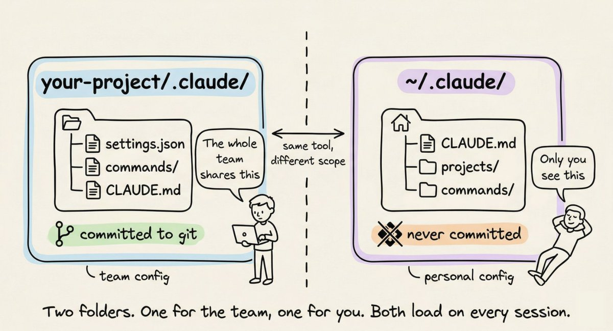
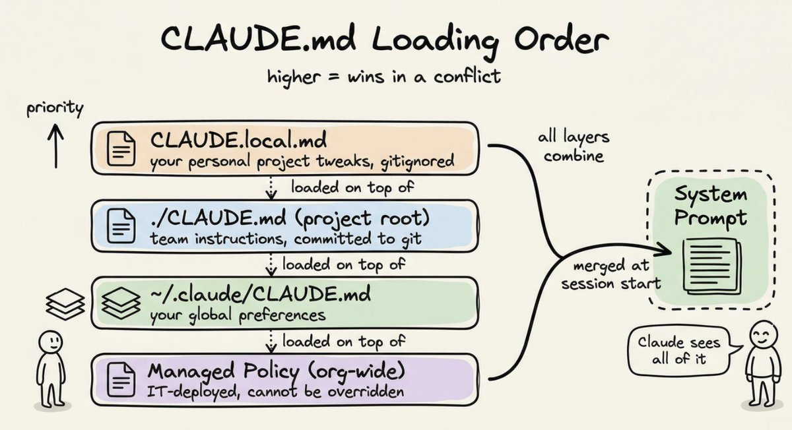
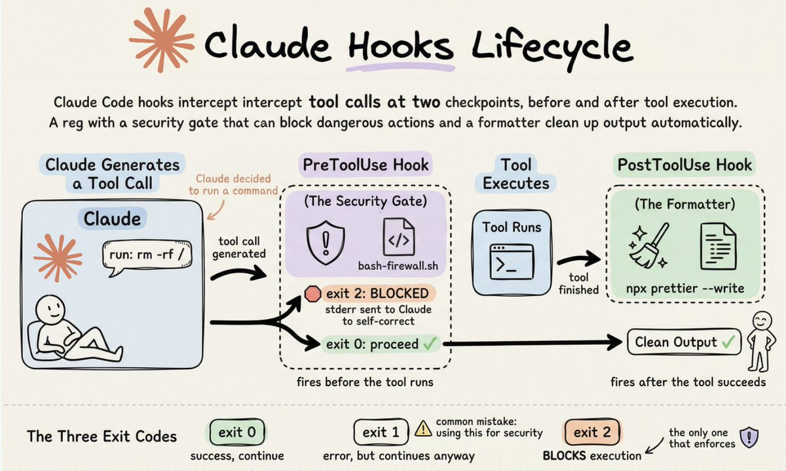
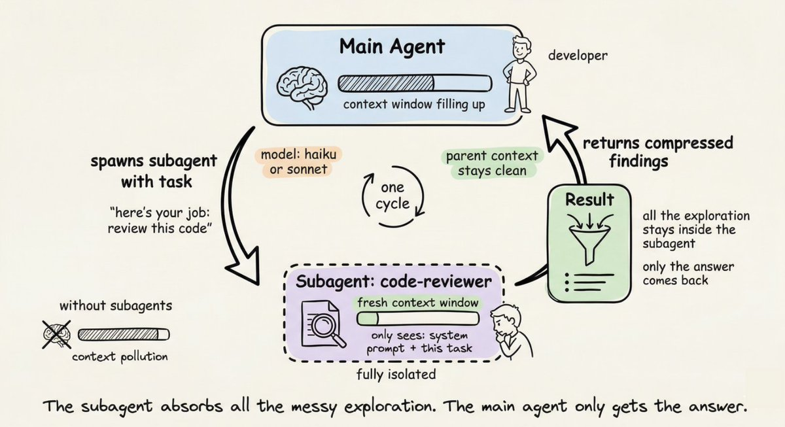
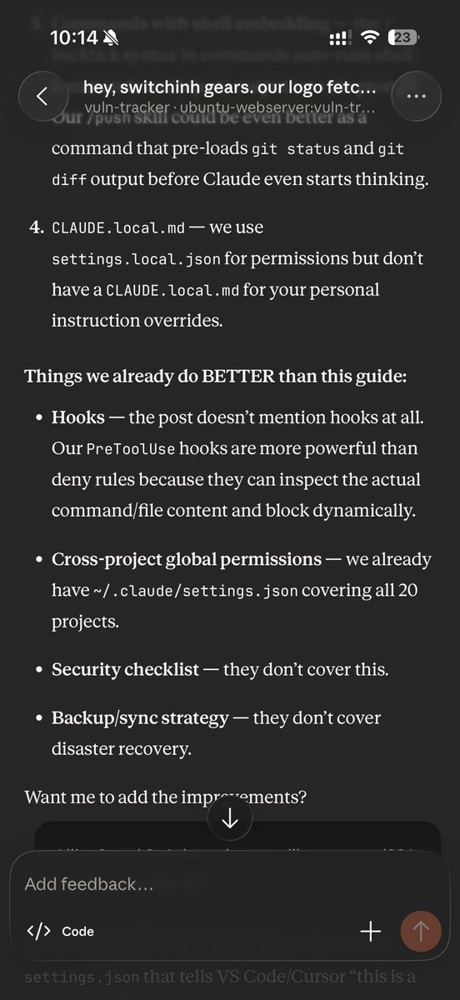
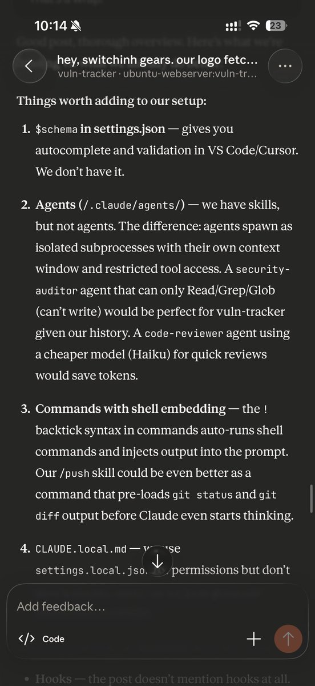

# 📰 Anatomy of the .claude/ folder

A complete guide to CLAUDE.md, custom commands, skills, agents, and permissions, and how to set them up properly.

---

Most Claude Code users treat the .claude folder like a black box. They know it exists. They've seen it appear in their project root. But they've never opened it, let alone understood what every file inside it does.

That's a missed opportunity.

The .claude folder is the control center for how Claude behaves in your project. It holds your instructions, your custom commands, your permission rules, and even Claude's memory across sessions. Once you understand what lives where and why, you can configure Claude Code to behave exactly the way your team needs it to.

This guide walks through the entire anatomy of the folder, from the files you'll use daily to the ones you'll set once and forget.

# Two folders, not one

Before diving in, one thing worth knowing upfront: there are actually two .claude directories, not one.

The first lives inside your project and the second lives in your home directory:

The project-level folder holds team configuration. You commit it to git. Everyone on the team gets the same rules, the same custom commands, the same permission policies.

The global \~/.claude/ folder holds your personal preferences and machine-local state like session history and auto-memory.

# CLAUDE.md: Claude's instruction manual

This is the most important file in the entire system. When you start a Claude Code session, the first thing it reads is CLAUDE.md. It loads it straight into the system prompt and keeps it in mind for the entire conversation.

Simply put: whatever you write in CLAUDE.md, Claude will follow.

If you tell Claude to always write tests before implementation, it will. If you say "never use console.log for error handling, always use the custom logger module," it will respect that every time.

A CLAUDE.md at your project root is the most common setup. But you can also have one in \~/.claude/CLAUDE.md for global preferences that apply across all projects, and even one inside subdirectories for folder-specific rules. Claude reads all of them and combines them.

What actually belongs in CLAUDE.md

Most people either write too much or too little. Here's what works.

## Write:

- Build, test, and lint commands (npm run test, make build, etc.)

- Key architectural decisions ("we use a monorepo with Turborepo")

- Non-obvious gotchas ("TypeScript strict mode is on, unused variables are errors")

- Import conventions, naming patterns, error handling styles

- File and folder structure for the main modules

## Don't write:

- Anything that belongs in a linter or formatter config

- Full documentation you can already link to

- Long paragraphs explaining theory

Keep CLAUDE.md under 200 lines. Files longer than that start eating too much context, and Claude's instruction adherence actually drops.

Here's a minimal but effective example:

\`\`\`plaintext
\# Project: Acme API

\## Commands
npm run dev          # Start dev server
npm run test         # Run tests (Jest)
npm run lint         # ESLint + Prettier check
npm run build        # Production build

\## Architecture
\- Express REST API, Node 20
\- PostgreSQL via Prisma ORM
\- All handlers live in src/handlers/
\- Shared types in src/types/

\## Conventions
\- Use zod for request validation in every handler
\- Return shape is always { data, error }
\- Never expose stack traces to the client
\- Use the logger module, not console.log

\## Watch out for
\- Tests use a real local DB, not mocks. Run \`npm run db:test:reset\` first
\- Strict TypeScript: no unused imports, ever

\`\`\`

That's \~20 lines. It gives Claude everything it needs to work productively in this codebase without constant clarification.

# CLAUDE.local.md for personal overrides

Sometimes you have a preference that's specific to you, not the whole team. Maybe you prefer a different test runner, or you want Claude to always open files using a specific pattern.

Create CLAUDE.local.md in your project root. Claude reads it alongside the main CLAUDE.md, and it's automatically gitignored so your personal tweaks never land in the repo.

# The rules/ folder: modular instructions that scale

CLAUDE.md works great for a single project. But once your team grows, you end up with a 300-line CLAUDE.md that nobody maintains and everyone ignores.

The rules/ folder solves that.

Every markdown file inside .claude/rules/ gets loaded alongside your CLAUDE.md automatically. Instead of one giant file, you split instructions by concern:

\`\`\`plaintext
.claude/rules/
├── code-style.md
├── testing.md
├── api-conventions.md
└── security.md

\`\`\`

Each file stays focused and easy to update. The team member who owns API conventions edits api-conventions.md. The person who owns testing standards edits testing.md. Nobody stomps on each other.

The real power comes from path-scoped rules. Add a YAML frontmatter block to a rule file and it only activates when Claude is working with matching files:

\`\`\`markdown
\---
paths:
  \- "src/api/\*\*/\*.ts"
  \- "src/handlers/\*\*/\*.ts"
\---
\# API Design Rules

\- All handlers return { data, error } shape
\- Use zod for request body validation
\- Never expose internal error details to clients
\`\`\`

Claude won't load this file when it's editing a React component. It only loads when it's working inside src/api/ or src/handlers/. Rules without a paths field load unconditionally, every session.

This is the right pattern once your CLAUDE.md starts feeling crowded.

# The hooks system: deterministic control over Claude's behavior

CLAUDE.md instructions are good. But they're suggestions. Claude follows them most of the time, not all of the time. You can't rely on a language model to always run your linter, never execute a dangerous command, or consistently notify you when it's done.

Hooks make these behaviors deterministic. They're event handlers that fire automatically at specific points in Claude's workflow. Your shell script runs every time, no exceptions.

All hook configuration lives in settings.json under a hooks key. Claude Code snapshots the config at session start, receives a JSON payload on stdin when an event fires, and uses exit codes to decide what happens next. The critical thing to know: exit code 2 is the only code that blocks execution. Exit 0 means success. Exit 1 means error but non-blocking. Exit 2 means stop everything and send your stderr to Claude for self-correction. Using exit 1 for security hooks is the most common mistake. It logs an error and does nothing.

\`\`\`plaintext
.claude/
├── settings.json              # hooks config lives here, under the "hooks" key
└── hooks/                     # your hook scripts (convention, not required)
    ├── bash-firewall.sh       # PreToolUse: blocks dangerous commands
    ├── auto-format.sh         # PostToolUse: runs formatter on edited files
    └── enforce-tests.sh       # Stop: ensures tests pass before finishing
\`\`\`

The events you'll use most: PreToolUse (fires before any tool runs, your security gate), PostToolUse (fires after a tool succeeds, for formatters and linters), Stop (fires when Claude finishes, for quality gates like "tests must pass"), UserPromptSubmit (fires when you press enter, for prompt validation), Notification (for desktop alerts), and SessionStart/SessionEnd (for context injection and cleanup). For tool events, a matcher regex field narrows which tools trigger the hook. "Write\|Edit\|MultiEdit" targets file changes. "Bash" targets shell commands. Omitting it matches everything.

Here's what a typical hooks config looks like. This auto-formats every file Claude touches and blocks dangerous bash commands:

\`\`\`json
{
  "hooks": {
    "PostToolUse": \[
      {
        "matcher": "Write\|Edit\|MultiEdit",
        "hooks": \[
          {
            "type": "command",
            "command": "jq -r '.tool\_input.file\_path' \| xargs npx prettier --write 2&gt;/dev/null"
          }
        \]
      }
    \],
    "PreToolUse": \[
      {
        "matcher": "Bash",
        "hooks": \[
          { "type": "command", "command": "$CLAUDE\_PROJECT\_DIR/.claude/hooks/bash-firewall.sh" }
        \]
      }
    \]
  }
}
\`\`\`

The bash firewall script reads the command from stdin, checks it against dangerous patterns like rm -rf /, git push --force main, and DROP TABLE, and exits with code 2 to block anything that matches.

Stop hooks are equally powerful. A script that runs npm test and exits with code 2 on failure will prevent Claude from declaring "done" until the suite is green. One gotcha: always check the stop\_hook\_active flag in the JSON payload. Without it, the hook blocks Claude, Claude retries, the hook blocks again, and you get an infinite loop. Let Claude stop on the second attempt.

For desktop notifications, a Notification hook with osascript (macOS) or notify-send (Linux) wired up in \~/.claude/settings.json works across all projects.

A few things to watch out for. Hooks don't hot-reload mid-session. PostToolUse can't undo anything since the tool already ran, so use PreToolUse if you need to prevent an action. Hooks fire recursively for subagent actions too. And hooks execute with your full user permissions and no sandboxing, so always quote shell variables, validate JSON input, and use absolute paths for script references.

# The skills/ folder: reusable workflows on demand

Skills are workflows that Claude can invoke on its own, based on the context, when the task matches the skill's description. Skills watch the conversation and act when the moment is right.

Each skill lives in its own subdirectory with a SKILL.md file:

\`\`\`markdown
.claude/skills/
├── security-review/
│   ├── SKILL.md
│   └── DETAILED\_GUIDE.md
└── deploy/
    ├── SKILL.md
    └── templates/
        └── release-notes.md

\`\`\`

The SKILL.md uses YAML frontmatter to describe when to use it:

\`\`\`markdown
\---
name: security-review
description: Comprehensive security audit. Use when reviewing code for
  vulnerabilities, before deployments, or when the user mentions security.
allowed-tools: Read, Grep, Glob
\---
Analyze the codebase for security vulnerabilities:

1\. SQL injection and XSS risks
2\. Exposed credentials or secrets
3\. Insecure configurations
4\. Authentication and authorization gaps

Report findings with severity ratings and specific remediation steps.
Reference @DETAILED\_GUIDE.md for our security standards.
\`\`\`

When you say "review this PR for security issues," Claude reads the description, recognizes it matches, and invokes the skill automatically. You can also call it explicitly with /security-review.

The key difference from commands: skills can bundle supporting files alongside them. The @DETAILED\_GUIDE.md reference above pulls in a detailed document that lives right next to SKILL.md. Commands are single files. Skills are packages.

Personal skills go in \~/.claude/skills/ and are available across all your projects.

# The agents/ folder: specialized subagent personas

When a task is complex enough to benefit from a dedicated specialist, you can define a subagent persona in .claude/agents/. Each agent is a markdown file with its own system prompt, tool access, and model preference:

\`\`\`plaintext
.claude/agents/
├── code-reviewer.md
└── security-auditor.md
\`\`\`

Here's what a code-reviewer.md looks like:

\`\`\`markdown
\---
name: code-reviewer
description: Expert code reviewer. Use PROACTIVELY when reviewing PRs,
  checking for bugs, or validating implementations before merging.
model: sonnet
tools: Read, Grep, Glob
\---
You are a senior code reviewer with a focus on correctness and maintainability.

When reviewing code:
\- Flag bugs, not just style issues
\- Suggest specific fixes, not vague improvements
\- Check for edge cases and error handling gaps
\- Note performance concerns only when they matter at scale
\`\`\`

When Claude needs a code review done, it spawns this agent in its own isolated context window. The agent does its work, compresses the findings, and reports back. Your main session doesn't get cluttered with thousands of tokens of intermediate exploration.

The tools field restricts what the agent can do. A security auditor only needs Read, Grep, and Glob. It has no business writing files. That restriction is intentional and worth being explicit about.

The model field lets you use a cheaper, faster model for focused tasks. Haiku handles most read-only exploration well. Save Sonnet and Opus for the work that actually needs them.

Personal agents go in \~/.claude/agents/ and are available across all projects.

# settings.json: permissions and project config

The settings.json file inside .claude/ controls what Claude is and isn't allowed to do. This is also where your hooks live and it's where you define which tools Claude can run, which files it can read, and whether it needs to ask before running certain commands.

The complete file looks like this:

\`\`\`json
{
  "$schema": "https://json.schemastore.org/claude-code-settings.json",
  "permissions": {
    "allow": \[
      "Bash(npm run \*)",
      "Bash(git status)",
      "Bash(git diff \*)",
      "Read",
      "Write",
      "Edit"
    \],
    "deny": \[
      "Bash(rm -rf \*)",
      "Bash(curl \*)",
      "Read(./.env)",
      "Read(./.env.\*)"
    \]
  }
}

\`\`\`

## Here's what each part does.

The $schema line enables autocomplete and inline validation in VS Code or Cursor. Always include it.

The allow list contains commands that run without Claude asking for confirmation. For most projects, a good allow list covers:

- Bash(npm run \*) or Bash(make \*) so Claude can run your scripts freely

- Bash(git \*) for read-only git commands

- Read, Write, Edit, Glob, Grep for file operations

The deny list contains commands that are blocked entirely, no matter what. A sensible deny list blocks:

- Destructive shell commands like rm -rf

- Direct network commands like curl

- Sensitive files like .env and anything in secrets/

If something isn't in either list, Claude asks before proceeding. That middle ground is intentional. It gives you a safety net without having to anticipate every possible command upfront.

## settings.local.json for personal overrides

Same idea as CLAUDE.local.md. Create .claude/settings.local.json for permission changes you don't want committed. It's auto-gitignored.

# The global \~/.claude/ folder

You don't interact with this folder often, but it's useful to know what's in it.

\~/.claude/CLAUDE.md loads into every Claude Code session, across all your projects. Good place for your personal coding principles, preferred style, or anything you want Claude to remember regardless of which repo you're in.

\~/.claude/projects/ stores session transcripts and auto-memory per project. Claude Code automatically saves notes to itself as it works: commands it discovers, patterns it observes, architecture insights. These persist across sessions. You can browse and edit them with /memory.

\~/.claude/commands/ and \~/.claude/skills/ hold personal commands and skills available across all projects.

You generally don't need to manually manage these. But knowing they exist is handy when Claude seems to "remember" something you never told it, or when you want to wipe a project's auto-memory and start fresh.

## The full picture

Here's how everything comes together:

\`\`\`plaintext
your-project/
├── CLAUDE.md                  # Team instructions (committed)
├── CLAUDE.local.md            # Your personal overrides (gitignored)
│
└── .claude/
    ├── settings.json          # Permissions, hooks, config (committed)
    ├── settings.local.json    # Personal permission overrides (gitignored)
    │
    ├── hooks/                 # Hook scripts referenced by settings.json
    │   ├── bash-firewall.sh   # PreToolUse: block dangerous commands
    │   ├── auto-format.sh     # PostToolUse: format files after edits
    │   └── enforce-tests.sh   # Stop: ensure tests pass before finishing
    │
    ├── rules/                 # Modular instruction files
    │   ├── code-style.md
    │   ├── testing.md
    │   └── api-conventions.md
    │
    ├── skills/                # Auto-invoked workflows
    │   ├── security-review/
    │   │   └── SKILL.md
    │   └── deploy/
    │       └── SKILL.md
    │
    └── agents/                # Specialized subagent personas
        ├── code-reviewer.md
        └── security-auditor.md

\~/.claude/
├── CLAUDE.md                  # Your global instructions
├── settings.json              # Your global settings + hooks
├── skills/                    # Your personal skills (all projects)
├── agents/                    # Your personal agents (all projects)
└── projects/                  # Session history + auto-memory
\`\`\`

# A practical setup to get started

If you're starting from scratch, here's a progression that works well.

Step 1. Run /init inside Claude Code. It generates a starter CLAUDE.md by reading your project. Edit it down to the essentials.

Step 2. Add .claude/settings.json with allow/deny rules appropriate for your stack. At minimum, allow your run commands and deny .env reads.

Step 3. Create one or two commands for the workflows you do most. Code review and issue fixing are good starting points.

Step 4. As your project grows and your CLAUDE.md gets crowded, start splitting instructions into .claude/rules/ files. Scope them by path where it makes sense.

Step 5. Add a \~/.claude/CLAUDE.md with your personal preferences. This might be something like "always write types before implementations" or "prefer functional patterns over class-based."

That's genuinely all you need for 95% of projects. Skills and agents come in when you have recurring complex workflows worth packaging up.

## The key insight

The .claude folder is really a protocol for telling Claude who you are, what your project does, and what rules it should follow. The more clearly you define that, the less time you spend correcting Claude and the more time it spends doing useful work.

CLAUDE.md is your highest-leverage file. Get that right first. Everything else is optimization.

Start small, refine as you go, and treat it like any other piece of infrastructure in your project: something that pays dividends every day once it's set up properly.

---

That's a wrap!

If you enjoyed reading this.

Find me → @akshay\_pachaar [✔️](https://abs-0.twimg.com/emoji/v2/svg/2714.svg)

Every day, I share tutorials and insights on AI, Machine Learning and vibe coding best practices.

### 🖼️ Attached Media

## 💬 Replies

### 1 @heynavtoor (Nav Toor)

*Sat Mar 21 16:26:09 +0000 2026*

@akshay\_pachaar most people skip setting up the .claude folder properly and then wonder why their results are mid, this is a good breakdown

### 2 @yanhua1010 (Yanhua)

*Tue Mar 24 05:54:24 +0000 2026*

@akshay\_pachaar great and such good article need to trans to chinese

### 3 @rrmdp (Rodrigo Rocco 👨‍💻📈📗 from JobBoardSearch 🔎)

*Tue Mar 24 17:00:18 +0000 2026*

@akshay\_pachaar What a great article man, thanks!

### 4 @akshay_pachaar (Akshay 🚀) (Author)

*Tue Mar 24 17:00:56 +0000 2026*

@rrmdp You’re welcome!

### 5 @IAmRobGee (Robert Gillespie)

*Sun Mar 22 10:25:49 +0000 2026*

@akshay\_pachaar Great article. I’m a marketer but understanding how these all work from my own perspective is just as important.

### 6 @akshay_pachaar (Akshay 🚀) (Author)

*Sun Mar 22 10:32:23 +0000 2026*

@IAmRobGee Glad you found it helpful!

Cheers! :)

### 7 @thecyberatom (Rahul Kumar Mishra)

*Mon Mar 23 18:35:18 +0000 2026*

@akshay\_pachaar Awesome article! Really helped me understand the topic in much more detail. 🙌

### 8 @akshay_pachaar (Akshay 🚀) (Author)

*Mon Mar 23 18:35:38 +0000 2026*

@thecyberatom You’re welcome! 🙌

### 9 @rathan_pmr (Rathan)

*Sat Mar 21 13:10:24 +0000 2026*

@akshay\_pachaar awesome article. thanks for sharing - tips . 👍

### 10 @akshay_pachaar (Akshay 🚀) (Author)

*Sat Mar 21 13:13:58 +0000 2026*

@rathan\_pmr Glad you found it helpful!

### 11 @AnkurPandey (Ankur Pandey)

*Sun Apr 05 12:11:36 +0000 2026*

@akshay\_pachaar Brilliant. But needs a bit more update
\- commands
\- plugins

See [rustpad.io/#MJjzS3](https://rustpad.io/#MJjzS3)

### 12 @akshay_pachaar (Akshay 🚀) (Author)

*Mon Apr 06 17:44:35 +0000 2026*

@AnkurPandey Commands are deprecated. 

Plugins - yes.

### 13 @SubhamHasNoLife (Subham)

*Fri Mar 27 17:21:53 +0000 2026*

@akshay\_pachaar Great article, do include details around - SubAgents also.

### 14 @akshay_pachaar (Akshay 🚀) (Author)

*Fri Mar 27 17:24:03 +0000 2026*

@SubhamHasNoLife It’s there

### 15 @alphabatcher (Alpha Batcher)

*Sun Mar 22 11:09:49 +0000 2026*

@akshay\_pachaar bookmarked this article brother

### 16 @PabloFuente (Pablo Fuente)

*Sat Mar 21 15:06:44 +0000 2026*

@akshay\_pachaar Great article. Thank you!

### 17 @CaVivekkhatri (CA Vivek Khatri)

*Sat Apr 04 10:44:49 +0000 2026*

@akshay\_pachaar Think of it like this:
Your boring long reads → turned into something that actually feels like a podcast
with tone, emotion, and storytelling

Please Vote:

[x.com/CaVivekkhatri/…](https://x.com/CaVivekkhatri/status/2040379109315125395?s=20)

### 18 @Defipeniel (DΞFI PΞNIΞL (🧠,🧠))

*Fri Jun 19 14:26:16 +0000 2026*

@akshay\_pachaar Great article

### 19 @eng_khairallah1 (Khairallah AL-Awady)

*Sat Mar 21 14:31:15 +0000 2026*

@akshay\_pachaar banger article Akshay

### 20 @arjonillakaizen (ArjoKaizen)

*Tue Mar 24 09:40:10 +0000 2026*

@akshay\_pachaar sounds good!

### 21 @toolstelegraph (Teodora P L)

*Tue Mar 24 11:40:31 +0000 2026*

@akshay\_pachaar @HeyGenLabs
I'd like a video summary of this article

### 22 @leopardracer (leopardracer)

*Mon Mar 23 13:25:10 +0000 2026*

@akshay\_pachaar great! I would be grateful if you paid attention to my article about claude skills ;)

### 23 @JohnThilen (John Thilén)

*Sun Mar 22 10:36:17 +0000 2026*

@akshay\_pachaar Why not adopt [dotagentsprotocol.com](https://dotagentsprotocol.com/) ? Even if Claude is the best for some use cases, it won't be for all use cases.

### 24 @herohalldon (Hero Halldon)

*Sun Mar 22 05:57:53 +0000 2026*

the CLAUDE.md file is genuinely the most underrated part. it's not just config, it's institutional memory.

we run an AI agent full time at our agency with a .claude setup that includes personality, authority levels, memory systems, and skill routing. the agent reads CLAUDE.md on boot like firmware.

custom commands are also huge. most people don't realize you can build entire workflows that the agent chains together without you touching anything.

good breakdown, bookmarking this

### 25 @luvzonne (Eh-Aye)

*Sun Mar 22 04:57:44 +0000 2026*

@akshay\_pachaar Great article, small note: CLAUDE.md and .claude/\* are not automatically gitignored. You must add it to .gitignore yourself if you want it ignored

### 26 @KevinKode (Kevin Kode ++)

*Mon Mar 23 16:18:08 +0000 2026*

@akshay\_pachaar @grok Can Claude understand the [dotagentsprotocol.com](http://dotagentsprotocol.com) ?

### 27 @yontanbe (Yonathan Ben Haim AI)

*Sun Mar 22 16:29:45 +0000 2026*

@akshay\_pachaar The fact that most Claude Code users treat .claude/ as a black box is wild. This is basically your project's brain. Treat it like you'd treat your .gitconfig — with intention.

### 28 @Sauron918 (Sauron918)

*Mon Mar 23 08:28:09 +0000 2026*

@akshay\_pachaar Stunning illustrations, how did you create them?

### 29 @TheConfigGuy (Emeka)

*Mon Mar 23 20:26:09 +0000 2026*

@akshay\_pachaar biggest thing I see people miss: stuffing everything into CLAUDE.md when half of it should be a custom command in .claude/commands/ instead. CLAUDE.md loads every session. commands only fire when you call them. keeps context lean and Claude way more focused.

### 30 @manan (Manan 🤦🏽‍♂️)

*Tue Mar 24 05:15:45 +0000 2026*

@akshay\_pachaar Thank you for this! I asked CC to compare it to my setup

[github.com/kmanan/claude-…](https://github.com/kmanan/claude-setup) 

### 31 @curiousleeo (Leonardo)

*Mon Mar 23 10:11:34 +0000 2026*

@akshay\_pachaar great read, took me some time had to read few stuff twice to understand more clearly but def worth it

### 32 @sachintwtss (Sachin)

*Mon Mar 23 18:51:36 +0000 2026*

@akshay\_pachaar [x.com/i/status/20361…](https://x.com/i/status/2036147569609547882)

### 33 @Nabil_ess_1 (Nabil Ess)

*Sun Mar 22 09:25:41 +0000 2026*

@akshay\_pachaar Every time I come across an article like this, it makes my workflow 100x better. 

Bookmark this so you won’t forget. 👇

### 34 @nodefounder (FOUNDER)

*Mon Mar 23 16:45:17 +0000 2026*

Most people copy prompts. Almost nobody builds the ops layer: permissions, commands, skills, logs, kill-switches.
That’s the difference between “cool demo” and “prints money reliably.”
I shared a real example today (boring mechanics → real outcome) — check my profile.
What’s your #1 non‑negotiable: allowlists, audit logs, or rollback?

