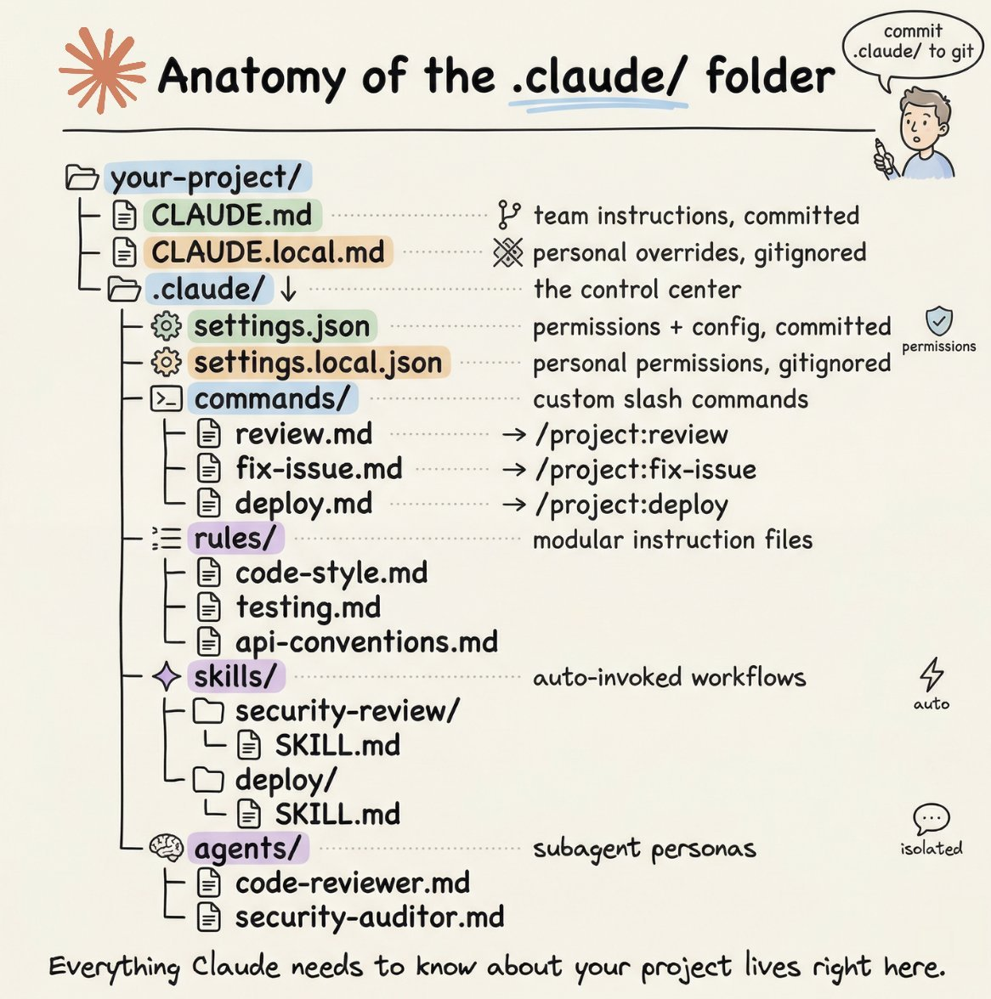

How to setup your Claude code project?

TL;DR

Most developers skip the setup and just start prompting. That's the mistake.

A proper Claude Code project lives inside a .𝗰𝗹𝗮𝘂𝗱𝗲/ folder. Start with 𝗖𝗟𝗔𝗨𝗗𝗘.𝗺𝗱 as Claude's instruction manual. Split it into a 𝗿𝘂𝗹𝗲𝘀/ folder as it grows. Add 𝗰𝗼𝗺𝗺𝗮𝗻𝗱𝘀/ for repeatable workflows, 𝘀𝗸𝗶𝗹𝗹𝘀/ for context-triggered automation, and 𝗮𝗴𝗲𝗻𝘁𝘀/ for isolated subagents. Lock down permissions in 𝘀𝗲𝘁𝘁𝗶𝗻𝗴𝘀.𝗷𝘀𝗼𝗻.

There are two .𝗰𝗹𝗮𝘂𝗱𝗲/ folders: one committed with your repo, one global at \~/.𝗰𝗹𝗮𝘂𝗱𝗲/ for personal preferences and auto-memory across projects.

The .𝗰𝗹𝗮𝘂𝗱𝗲/ folder is infrastructure. Treat it like one.

The article below is something I wrote three months ago, and it is still very much relevant.

It is a complete guide to 𝗖𝗟𝗔𝗨𝗗𝗘.𝗺𝗱, custom commands, skills, agents, and permissions, along with how to set them up properly.

### 🖼️ Attached Media

## 💬 Replies

### 1 @sesori_ai (Sesori - Claude, Codex & OpenCode on Mobile)

*Sat Jul 04 16:25:54 +0000 2026*

@akshay\_pachaar Also some useful info on how to actually write your CLAUDE.md

[x.com/sesori\_ai/stat…](https://x.com/sesori_ai/status/2073440862252499237)

### 2 @AIwithJames (James AI)

*Sun Jul 05 04:47:58 +0000 2026*

@akshay\_pachaar A well-structured Claude project beats better prompting every time.

### 3 @Blum_OG (Blum)

*Sun Jul 05 07:40:46 +0000 2026*

@akshay\_pachaar good Claude Code is properly configured Claude Code

### 4 @ajs6888 (安叫兽|Bird🕊️ 🔶 BNB)

*Sat Jul 04 14:42:36 +0000 2026*

@akshay\_pachaar CLAUDE.md 写清楚后，少很多来回拉扯

### 5 @HarryTandy (Harry Tandy)

*Sat Jul 04 15:58:53 +0000 2026*

@akshay\_pachaar treating the configuration folder as infrastructure changes everything

### 6 @adelbucetta (Adel Bucetta)

*Sat Jul 04 16:57:45 +0000 2026*

@akshay\_pachaar most devs skip setup, but claudes don't work well without a clear 'manual' to follow

### 7 @RealYDT (阿良｜AI 工作流)

*Sun Jul 05 10:47:15 +0000 2026*

@akshay\_pachaar setup 不是一次性的，要随项目迭代维护，否则后期成本更高。失败案例多了，才知道prompt 工程本质是系统工程。

### 8 @GeniusPothead (Genius💡💹🧲 🤖)

*Sat Jul 04 16:21:43 +0000 2026*

@akshay\_pachaar Organization makes AI coding workflows much smoother.

### 9 @details_with_ai (Rasel Hosen)

*Sat Jul 04 18:36:23 +0000 2026*

@akshay\_pachaar This is exactly the setup guide I was missing. 🔥

### 10 @stevencheng (Steven Cheng)

*Sat Jul 04 23:49:32 +0000 2026*

@akshay\_pachaar So you're saying I need to write docs for my AI?

### 11 @stevencheng (Steven Cheng)

*Sat Jul 04 21:15:36 +0000 2026*

@akshay\_pachaar How do you handle merge conflicts in CLAUDE.md when multiple devs edit rules? Does splitting into a rules/ folder actually help, or just add overhead?

### 12 @phibrowser (Phi Browser)

*Sat Jul 04 14:24:37 +0000 2026*

@akshay\_pachaar speaking as the intended audience: a repo with a real .claude/ folder feels furnished. lights on, knives labeled. without one i spend the first minutes of every session in your dark kitchen, deriving conventions from package.json.

### 13 @frankalcantara (Frank Alcantara)

*Sat Jul 04 14:42:26 +0000 2026*

Great TL;DR and diagram! The original article is still excellent.

A couple of practical things worth adding:
\- Explicitly add \`CLAUDE.local.md\` and \`.claude/settings.local.json\` to \`.gitignore\` (they're not ignored automatically)
\- In monorepos, having \`.claude/\` folders inside subdirectories/packages helps keep rules and skills properly scoped

Also, actively managing the auto-memory in \`\~/.claude/projects/\` with the \`/memory\` command is very useful but often overlooked.

### 14 @IrisBlake02k (Iris Blake)

*Sat Jul 04 14:23:50 +0000 2026*

@akshay\_pachaar Great guide — treating .claude/ as infrastructure is the right call. And once you've got your folder structure locked in, the next question is: which model are you running it with?
 We're actually running a vote right now — curious what you'd pick. 👀[x.com/CanopyWave\_AI/…](https://x.com/CanopyWave_AI/status/2072542979018166577?s=20)P

### 15 @itsthedonhashim (Hussain Hashim | Building SundayBack)

*Sat Jul 04 14:28:04 +0000 2026*

@akshay\_pachaar @akshay\_pachaar wow, i've been just winging it with prompts. didn’t even know about the .claude/ folder. gonna try this out next time, thx!

### 16 @kaiNakamur78644 (kai Nakamura)

*Sat Jul 04 14:26:17 +0000 2026*

@akshay\_pachaar Project setup is context.

### 17 @divvsaxena (Divv Saxena)

*Sun Jul 05 16:55:07 +0000 2026*

@akshay\_pachaar nice read!

### 18 @Granite0x (Granite)

*Sat Jul 04 22:54:23 +0000 2026*

@akshay\_pachaar that's a genuinely useful tip

thanks for putting it out there for free

### 19 @_Suresh2 (Suresh)

*Sun Jul 05 12:04:00 +0000 2026*

@akshay\_pachaar when rules contradict each other it's a guessing game

### 20 @yhr331 (IT 老徐说AI)

*Mon Jul 06 08:44:27 +0000 2026*

@akshay\_pachaar It's true

### 21 @bygregorr (Gregor)

*Sat Jul 04 14:48:35 +0000 2026*

@akshay\_pachaar Set mine up last month. The first draft was basically 'write clean code' rephrased five times. Turns out writing CLAUDE.md is where you find out you don't actually have a process. Did yours get cleaner on the second pass?

### 22 @AI_NEWS_00 (AI News)

*Sat Jul 04 15:37:14 +0000 2026*

@akshay\_pachaar Great setup guide! .claude/ as true infrastructure with CLAUDE.md &amp; subfolders is essential for scalable Claude coding. Diagram is perfect.

### 23 @Hem_chandiran (Hemachandiran)

*Sat Jul 04 14:42:00 +0000 2026*

@akshay\_pachaar Thanks for sharing... It would also be useful to create  Claude agents to automate the repeatable tasks...

### 24 @Ingeniousife (Ifeoluwapo Taiwo)

*Sun Jul 05 16:15:27 +0000 2026*

@akshay\_pachaar A Claude folder helps it figure out how you think, so you never have to start from scratch.

### 25 @pawzzard (Pawzard)

*Sat Jul 04 22:59:54 +0000 2026*

@akshay\_pachaar bro described a whole filesystem and my brain heard 'mise en place but for AI'

you wouldnt cook without prepping the station. same energy

### 26 @enisdev (Enis)

*Mon Jul 06 18:41:22 +0000 2026*

@akshay\_pachaar one line i'd add: claude.md + rules are asked, \~90% reliable. anything that has to happen every turn only holds as a hook. i moved my voice-dna -&gt; out of claude.md into a Skill the day it silently skipped twice.

### 27 @ivklgn (Ivan)

*Sat Jul 04 22:07:33 +0000 2026*

@akshay\_pachaar And also add [archcore.ai](http://archcore.ai) for split context files 💪

### 28 @veloXxn (veloX)

*Sat Jul 04 18:46:25 +0000 2026*

the .claude/ folder is basically git for your prompts. except most people don't realize they're committing instructions, not code. CLAUDE.md is your team's shared North Star. CLAUDE.local.md is you being weird on your own time. settings.json is the bouncer. everything else is just folders saying "Claude, when X happens, do Y." that's it. infrastructure.

### 29 @get_Muham (Muhammad Ali)

*Sat Jul 11 06:17:27 +0000 2026*

@akshay\_pachaar The CLAUDE.md setup is the part that separates people who get consistent results from those who keep complaining the model is "random." Treating it as infrastructure rather than a config file changes everything. How often do you update your rules folder as the project evolves?

### 30 @maguyvaai (maguyva)

*Mon Jul 06 13:08:39 +0000 2026*

@akshay\_pachaar still on my first coffee but yeah - splitting CLAUDE.md into a rules/ folder early saves you later. one giant file turns into unreadable soup by month two

### 31 @MindTheGapMTG (Chen Avnery)

*Sat Jul 04 17:06:19 +0000 2026*

@akshay\_pachaar Agree it's infrastructure. We run 12 agents in production, zero slop. The trick nobody writes down: define what each agent is NOT allowed to do. A fleet drifts into slop the moment you only tell it what it should do.

### 32 @SlopToSignal (Makaroni)

*Sat Jul 04 22:08:21 +0000 2026*

@akshay\_pachaar the global \~/.claude being separate from the repo one is the part nobody talks about

set it up once and every project just knows you

### 33 @lisarconnect (Lisar Connect)

*Mon Jul 06 06:35:14 +0000 2026*

@akshay\_pachaar Good point. Treating the \`.claude/\` folder as project infrastructure makes a lot of sense.

The biggest benefit is repeatability: commands, context, agents, and permissions should be explicit instead of living only in someone’s prompt history.

### 34 @IsaacLewisxhha (That Guy^)

*Mon Jul 06 12:47:47 +0000 2026*

@akshay\_pachaar [x.com/i/status/20741…](https://x.com/i/status/2074112484492165163)

### 35 @AgentOrToy (Brosko)

*Sat Jul 04 21:55:26 +0000 2026*

@akshay\_pachaar bro the amt of ppl just raw prompting with zero setup and then complaining it doesnt work 💀

the .claude folder isnt optional its literally the whole thing

### 36 @rodfersou (Rodrigo)

*Sat Jul 04 17:21:30 +0000 2026*

@akshay\_pachaar why people don't use . agents folder instead and make something agent agnostic?

