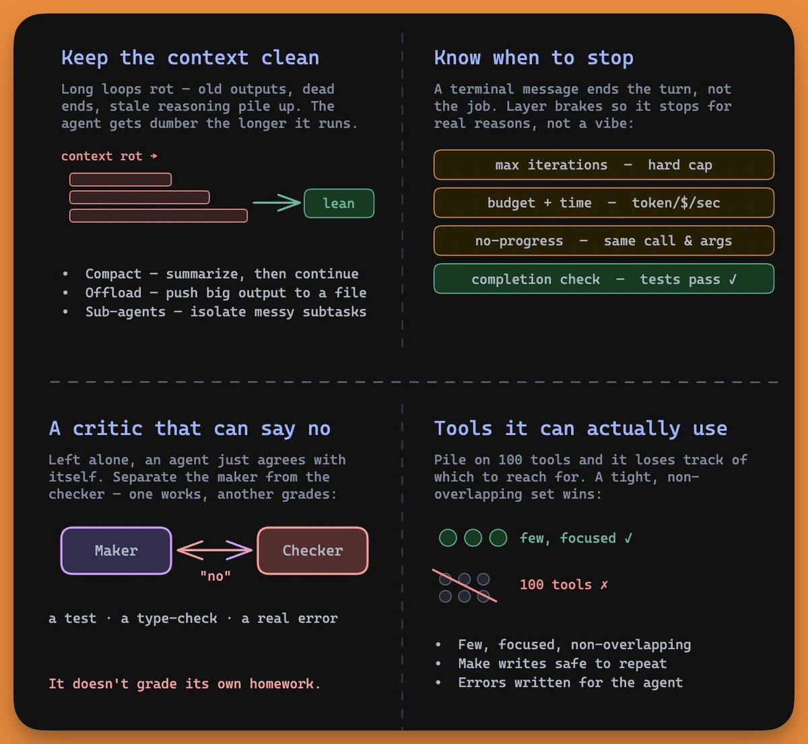
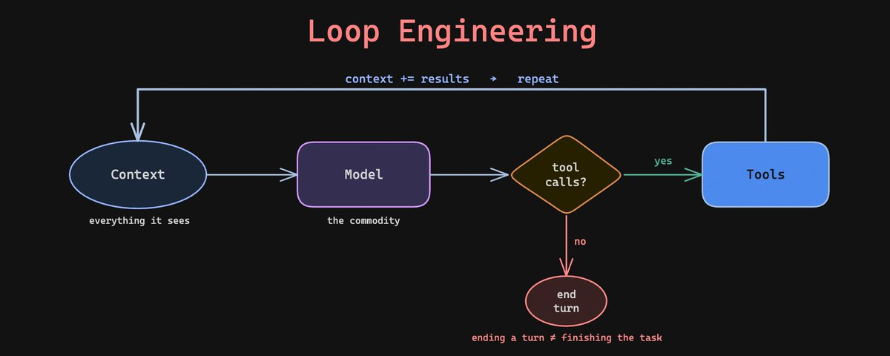

# 📰 Loop Engineering Clearly Explained 

Half your feed is suddenly saying the same thing. Stop prompting your agents, start engineering loops.

Boris Cherny, the person who built Claude Code, said it plainly: "I don't prompt Claude anymore. I have loops that are running. My job is to write loops."

The person who builds one of the most popular coding agents on earth doesn't prompt it. So what is he doing instead?

That's the whole idea behind loop engineering. Now let's break down why it's harder than it looks.

# First, the loop itself

An agent isn't a magic box. At its core, it's a plain loop:

\`\`\`python
while True:
    response = model(context)
    if response.has\_tool\_calls():
        results = run\_tools(response.tool\_calls)
        context += results
    else:
        break

\`\`\`

The model reads the context. It asks to call a tool. You run the tool and feed the result back. The model reads again, and this repeats until it stops asking for tools.

Model → tools → context → repeat.

Here's the part that surprises people. This loop is already solved. Every serious agent framework lands on roughly these six lines. Nobody is competing on the while statement.

So if the loop is trivial, what is everyone actually engineering?

# The work moved outside the model

The center of gravity in AI keeps drifting away from the model itself.

- Prompt engineering. The words you send.

- Context engineering. Everything the model sees, not just your instructions.

- Harness engineering. The code around the model that runs tools, tracks state, and handles errors.

- Loop engineering. The autonomous cycle that drives the whole thing toward a goal.

Each layer wraps the one before it. You didn't stop caring about prompts. You just realized the prompt is one small piece of a much bigger system.

LangChain puts it cleanly. Agent = Model + Harness. If you're not the model, you're the harness.

And here's the finding that should reorder your priorities. The harness now matters more than the model. Teams have kept the model fixed, changed only the code around it, and jumped from the middle of a benchmark into the top five. Same brain, different loop.

Loop engineering is the discipline of building everything that brain runs inside. Let me show you the parts that actually break.

# Hard part 1: knowing when to stop

This is the problem nobody warns you about.

When an agent stops asking for tools, it has ended its turn. That is not the same as finishing the job.

Picture a coding agent. It writes some code, glances around, sees that progress was made, and announces it's done. The tests still fail. It declared victory anyway.

A terminal message ends the turn, not the task. Confusing those two is the most common way loops go wrong.

Good loops stop for the right reasons, so you layer several brakes:

- Max iterations. A hard cap so a stuck agent can't run forever.

- Budget and time limits. A ceiling on tokens, money, and seconds.

- No-progress detection. If it repeats the same call with the same arguments, it's spinning.

- A real completion check. An automated condition proving the job is done.

That last one carries the weight. "Done" should mean the tests pass, not the agent feeling good about its work.

# Hard part 2: keeping the context clean

Long loops rot from the inside.

The more turns an agent takes, the more junk piles into its context, like old tool outputs, dead ends, and stale reasoning. Model performance drops as that pile grows. The field calls it context rot.

A loop makes it spiral. A rotted context produces a worse decision, which adds more noise, which rots the context further. People call this the doom loop, and you've felt it. The agent gets dumber the longer it runs.

You fight it by treating context as a budget, not a bucket:

- Compaction. Summarize the conversation when it gets long, then continue from the summary.

- Offloading. Push huge outputs to a file and keep only the slice you need.

- Sub-agents. Hand a messy subtask to a separate agent and let only its clean result return.

The instinct is to keep everything, just in case. The skill is knowing what to throw away.

# Hard part 3: tools the agent can actually use

A loop is only as good as the tools inside it.

Pile on a hundred tools and the agent loses track of which one to reach for. A tight set of focused, non-overlapping tools wins. Anthropic's rule of thumb is sharp. If a human engineer can't say for certain which tool fits, the agent has no chance.

Two things matter more than people expect:

- Make writes safe to repeat. Loops retry, and if a retried "create customer" call makes a second customer, you'll wake up to duplicate records and double billing. Anything that changes state has to be safe to call twice.

- Write error messages for the agent, not the human. A good error tells the agent what to do next. Before a tool ships, ask whether an LLM reading its error would know the next move.

In a loop, an error isn't a dead end. It's the next instruction.

# Hard part 4: something that can say no

Autonomous loops have a quiet failure mode. An agent left alone tends to agree with itself.

The sharpest comment in the whole debate nailed it. Designing the loop is half the job, and the other half is putting something in the loop that can say no, like a test, a type check, or a real error.

A loop with no critic is just an agent nodding along to its own work.

The fix is to separate the maker from the checker. One model does the work. A different check, often a separate model or a hard test, grades it. The worker doesn't grade its own homework.

# The actual shift

Now Cherny's quote makes sense.

Prompting is you steering the agent move by move. Loop engineering is you building the system that steers it, then stepping back.

Your job changes from giving instructions to designing three things:

1. The goal, written as success criteria the agent can check itself against.

1. The loop, with sane brakes so it stops well.

1. The verifier, so "done" is proven, not claimed.

Andrej Karpathy captures the mindset. Don't tell the model what to do, give it success criteria and watch it go. He runs research loops overnight that tweak a script, test it, keep what works, and discard what doesn't, with himself nowhere in the loop. He arranges it once and hits go.

That's the whole move. You stop being the hands and become the person who designs the machine.

# Where to start

You don't need an overnight autonomous agent on day one. Build up to it:

1. Start with the basic loop, and add a max-iteration cap, a timeout, and a cost ceiling right away.

1. Define "done" as an automated check before you begin, not a vibe afterward.

1. Protect the context. Compact long runs, offload big outputs, isolate messy subtasks.

1. Audit your tools. Keep them few and focused, make writes safe to repeat, and rewrite errors so an agent can act on them.

1. Put a critic in the loop. Only go fully hands-off once you trust the thing that says no.

# The takeaway

Loop engineering isn't a framework or a tool you install. It's a shift in where you aim your effort.

The model is becoming a commodity. The loop around it is where the real engineering lives now.

The best builders stopped asking "what should I tell the agent to do?" They started asking "what system would do this without me?"

Answer that one well, and you'll stop prompting too.

Here's a summary of

---

Thanks for reading!

Cheers :)
Akshay.

### 🖼️ Attached Media

## 💬 Replies

### 1 @ArchiveExplorer (Archive)

*Mon Jun 22 23:16:30 +0000 2026*

@akshay\_pachaar Akshay this is the most detailed article i've seen

glad i came across it

### 2 @akshay_pachaar (Akshay 🚀) (Author)

*Tue Jun 23 07:28:31 +0000 2026*

@ArchiveExplorer Glad you liked it! 

Cheers! :)

### 3 @Blum_OG (Blum)

*Mon Jun 22 19:37:55 +0000 2026*

@akshay\_pachaar solid breakdown, hits all the important details

### 4 @akshay_pachaar (Akshay 🚀) (Author)

*Tue Jun 23 07:28:14 +0000 2026*

@Blum\_OG Glad you found it helpful!

### 5 @GabrielAsher02 (Gabriel Asher)

*Mon Jun 22 18:46:10 +0000 2026*

@akshay\_pachaar Check out 20+ easy examples implemented as skills here! [github.com/gaasher/Agent-…](https://github.com/gaasher/Agent-Loop-Skills)

### 6 @akshay_pachaar (Akshay 🚀) (Author)

*Tue Jun 23 07:29:10 +0000 2026*

@GabrielAsher02 Thanks for sharing Gabriel.

These look super useful.

### 7 @bahatorvatlon (BahatorvatIon)

*Mon Jun 22 18:05:16 +0000 2026*

@akshay\_pachaar Inspiring and easy to understand! 😊

### 8 @akshay_pachaar (Akshay 🚀) (Author)

*Tue Jun 23 07:29:47 +0000 2026*

@bahatorvatlon That was the goal.

Glad that it clicked for you. 🙌

### 9 @s_gruppetta (Stephen Gruppetta)

*Tue Jun 23 14:39:32 +0000 2026*

@akshay\_pachaar So things we generally call “harnesses” at the moment, like Claude Code or OpenClaw, say, are already loops, right?

### 10 @akshay_pachaar (Akshay 🚀) (Author)

*Wed Jun 24 04:04:46 +0000 2026*

@s\_gruppetta A harness that runs itself.

### 11 @kepochnik (kepo)

*Tue Jun 23 13:32:44 +0000 2026*

@akshay\_pachaar banger explaining about Loop engineering

bookmarked

### 12 @alphabatcher (Alpha Batcher)

*Tue Jun 23 17:47:11 +0000 2026*

@akshay\_pachaar one of the best guide about Loop engineering

### 13 @aayush4soni (Aayush Soni)

*Mon Jun 22 18:10:44 +0000 2026*

@akshay\_pachaar [github.com/invincible04/a…](https://github.com/invincible04/awesome-loop-engineering)

### 14 @SpoogemanGhost (Voltage (Fella))

*Mon Jun 22 22:27:56 +0000 2026*

@akshay\_pachaar Boris wants to sell API calls. You dont need 3 agents to make a loop. You need cron or proper prompt engineering with the right goal setting and progress monitoring. One agent is all you need. Anthropic makes enough from its users already!

### 15 @andrew_dryga (Andrew Dryga)

*Wed Jun 24 05:24:33 +0000 2026*

@akshay\_pachaar The bare loops are dumb way to burn tokens and getting things down. A better one is a superior that makes your agent work until it runs out of tasks - [coop.dryga.com](https://coop.dryga.com)

### 16 @midshipman (jeff)

*Thu Jun 25 20:37:42 +0000 2026*

@akshay\_pachaar can u share a real example and result! kind of tired of new buzz word and theory around it

### 17 @shree_varada (Varada_vaidya)

*Tue Jun 23 13:06:29 +0000 2026*

@akshay\_pachaar In one of my own project, this looping idea was implemented in some form in that multi aget pipeline. Now, it is all the more seriously defined and named now.

### 18 @mycomputerspot (MyComputerSpot)

*Tue Jun 23 20:09:43 +0000 2026*

@akshay\_pachaar Loops are useful because they force the work to leave receipts. Plain prompting lets the mess hide in the couch.

### 19 @CryptoKeesan (Keesan)

*Tue Jul 14 14:12:49 +0000 2026*

@akshay\_pachaar You should really try martinloop, pruposee built governancefor agentic loops. 

[martinloop.com](http://www.martinloop.com)

### 20 @eivindmeyer_cv (Eivind Meyer)

*Mon Jun 22 20:46:43 +0000 2026*

@akshay\_pachaar loops without non-negotiable and independent feedback is just vibes

### 21 @ChloeDubois4782 (Chloe Dubois)

*Mon Jun 22 18:04:28 +0000 2026*

@akshay\_pachaar honest take.the reader always notices

### 22 @val_riabtsev (Val Riabtsev)

*Mon Aug 10 19:41:16 +0000 2026*

@akshay\_pachaar Good one

### 23 @OxLockedin (404)

*Tue Jun 23 13:42:40 +0000 2026*

@akshay\_pachaar Nice one

### 24 @ThanhDao2021 (Thanh Dao)

*Tue Jun 23 00:26:55 +0000 2026*

@akshay\_pachaar That is great. Thank you,

### 25 @umardikar (Upendra Mardikar)

*Thu Jul 02 19:18:18 +0000 2026*

@akshay\_pachaar Great article. Thank you

### 26 @Greenie989 (Nostaline)

*Mon Jun 22 20:27:47 +0000 2026*

@akshay\_pachaar the more I think about AI memory the more I value tools that let you own your data. AtomicMemory is open source self-hosted and fully inspectable. no vendor lock-in no black box. [github.com/atomicstrata/a…](http://github.com/atomicstrata/atomicmemory)

### 27 @mavericktr24 (Maverick)

*Sun Aug 23 10:53:46 +0000 2026*

@akshay\_pachaar This is great Akshay 🚀 Verification loops can yield incredible results from even average models. 
Here is one implementation i released yesterday. Would love some feedbacks 🙏[x.com/mavericktr24/s…](https://x.com/mavericktr24/status/2091147176017563673?s=46&t=uSsxeE0EwBwCT6lrvSjNPg)sY

### 28 @Jonny9811 (Jonny9811)

*Fri Jun 26 15:53:02 +0000 2026*

@akshay\_pachaar The important bit is something in the loop that can deterministically say no. And memory. It has to be very good at seeding context from what came before. [github.com/jonny981/loops](http://github.com/jonny981/loops)

### 29 @karthikeyan2752 (KarthiKeyan M)

*Wed Jun 24 09:43:49 +0000 2026*

@akshay\_pachaar Looping the loop is next?

### 30 @corvex_core (Corvex_core)

*Thu Jun 25 12:22:58 +0000 2026*

@akshay\_pachaar the best guide about loop engineering

### 31 @AustinAdams_96 (Austin A.)

*Sat Jul 04 12:37:00 +0000 2026*

@akshay\_pachaar What would actually be helpful are use cases and examples of something practical this would be used for and how well it worked.

### 32 @fornews687857 (fornews)

*Tue Jun 23 02:27:08 +0000 2026*

@akshay\_pachaar How to archive a good loop about memory , this is a perfect solution :[github.com/yucai0302/memo](http://github.com/yucai0302/memo)…. only need a plugin cc

### 33 @random_aidude (Random AI dude)

*Wed Jun 24 03:10:41 +0000 2026*

@akshay\_pachaar A loop without governed state is just repeated execution. A loop with governed state becomes accountable execution.

### 34 @ianchen1991 (Ian chen)

*Wed Jun 24 05:40:30 +0000 2026*

@akshay\_pachaar Mark

### 35 @mamadouyeriete (mamadouyero)

*Thu Jul 16 06:11:26 +0000 2026*

@akshay\_pachaar Mamadouuero

