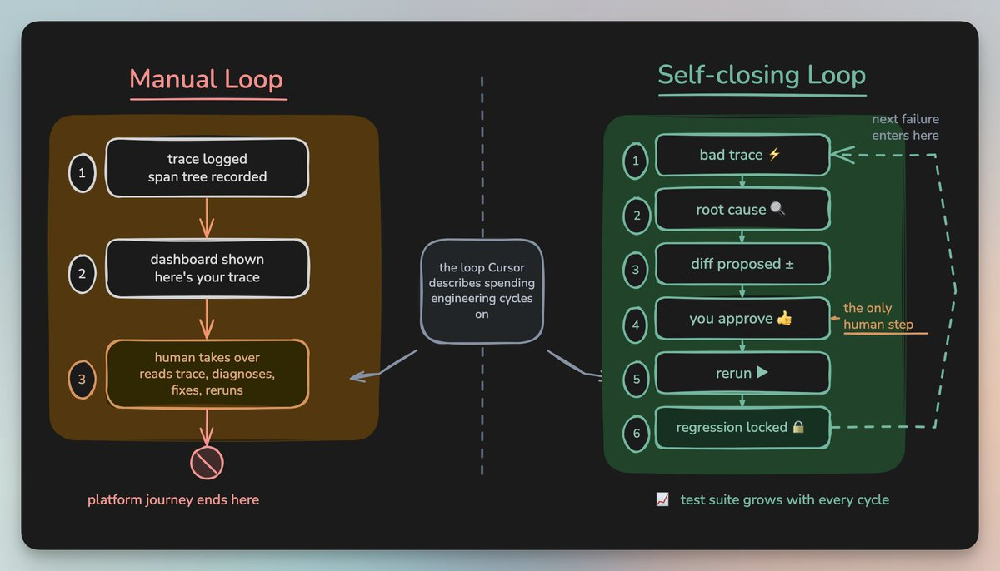
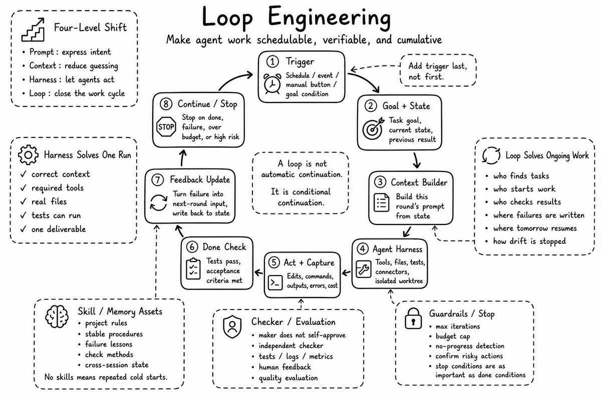
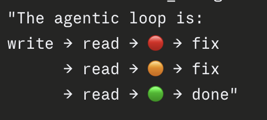

about loop engineering.

everyone's saying the same thing this week. you don't prompt agents anymore, you design loops that prompt them.

here's the job that loop hands right back to you.

a loop running unattended is also a loop failing unattended.

loop engineering takes you off prompting. it takes you off curating context. it takes you off babysitting a single run. it does not take you off debugging. it just moves the debugging somewhere worse, into runs you were never watching, with far too much of it to read through by hand.

even the loop engineering posts admit this themselves, usually somewhere near the end. you can only walk away from a loop if you trust the thing checking it. a checker you don't trust drops you right back into reading every output by hand, which is the exact work the loop was supposed to take off you.

so stack the layers up, prompt, context, harness, loop, and one job survives all of them. closing the loop on failure. the leverage point moved. debugging stayed exactly where it was.

i was writing about this exact gap yesterday, before the loop talk picked up today. the idea was simple. make debugging its own loop. a failure leads to a root cause, a proposed fix, a rerun against the exact inputs that broke, and a test that locks it out for good. the checker gets built from your real failures instead of guessed at up front.

Opik, the tool i was writing about, does exactly this. a built-in agent reads the trace, finds the root cause, proposes a diff, you approve it, and that failure becomes a permanent regression test. every break you debug makes the loop a little harder to break next time, which is the kind of checker the loop engineering crowd keeps saying you need before you walk away.

if you're designing loops you actually plan to walk away from, it's worth a look.

Opik is 100% open-source under Apache-2.0 license.

GitHub repo: [github.com/comet-ml/opik](https://github.com/comet-ml/opik)

(don't forget to star 🌟)

loop engineering moved the leverage point. it didn't remove the engineer who still has to close the loop when something breaks.

the full article, Your Agent Harness Should Repair Itself, is quoted below.

### 🖼️ Attached Media

## 💬 Replies

### 1 @nrqa__ (Nelly;)

*Tue Jun 09 12:36:03 +0000 2026*

@akshay\_pachaar debugging becoming its own loop is such a good framing

### 2 @iuditg (Udit Goenka)

*Tue Jun 09 14:09:44 +0000 2026*

@akshay\_pachaar You can just use [github.com/uditgoenka/aut…](https://github.com/uditgoenka/autoresearch) 

problem solved

### 3 @FUCORY (fucory)

*Tue Jun 09 15:40:14 +0000 2026*

@akshay\_pachaar You sound like a Smithers orchestrator user

### 4 @GaryLHenderson (Gary)

*Tue Jun 09 12:57:49 +0000 2026*

@akshay\_pachaar Easy guide to understand Loops

[x.com/GaryLHenderson…](https://x.com/GaryLHenderson/status/2064329835099427313?s=20)

### 5 @aniketmaurya (Aniket Maurya)

*Wed Jun 10 02:20:37 +0000 2026*

@akshay\_pachaar @sugatoray It’s looping

### 6 @alphabatcher (Alpha Batcher)

*Tue Jun 09 08:59:58 +0000 2026*

@akshay\_pachaar everyone should to learn Loop engineering now

### 7 @HarryTandy (Harry Tandy)

*Tue Jun 09 13:26:05 +0000 2026*

@akshay\_pachaar automated regression tests keep agent loops from breaking

### 8 @details_with_ai (Rasel Hosen)

*Tue Jun 09 11:09:56 +0000 2026*

@akshay\_pachaar Loop engineering is the future of AI workflows. 🔥

### 9 @AgentGuard_AI (AgentGuard 🛡️)

*Tue Jun 09 15:20:41 +0000 2026*

@akshay\_pachaar Excellent read, thanks!

### 10 @thearslaniqbal (Arslan Iqbal)

*Tue Jun 09 10:43:57 +0000 2026*

@akshay\_pachaar This is loop engineering meta inception.

### 11 @VirangJhaveri (Virang Jhaveri)

*Tue Jun 09 11:18:23 +0000 2026*

@akshay\_pachaar unattended loops need a scorecard outside the loop. Real world outcomes are important to learn from. 

Do checkout [github.com/Nimrobo/superd…](https://github.com/Nimrobo/superdense)

### 12 @mrluiscalderon (Luis Calderon)

*Tue Jun 09 14:55:59 +0000 2026*

@akshay\_pachaar Yes! Go run some froot loops on Mythos Fable, and tell me how well that works out for you!  Go nuts.  Loops and Vibes everywhere!

### 13 @CopperForgeAI (铜匠AI・十点睡觉)

*Tue Jun 09 11:55:06 +0000 2026*

@akshay\_pachaar 

### 14 @damnvikram (Vikram Singh)

*Tue Jun 09 13:55:19 +0000 2026*

@akshay\_pachaar [x.com/zyndai/status/…](https://x.com/zyndai/status/2064344562110263722)

### 15 @_usernamed_ (Shekhar Upadhaya)

*Wed Jun 10 05:43:22 +0000 2026*

@akshay\_pachaar Solid write up. More on this [beontheloop.com/deck](https://www.beontheloop.com/deck)

### 16 @BillyFlynt5853 (billyflynt)

*Tue Jun 09 17:26:58 +0000 2026*

@akshay\_pachaar observation:

self\_repair
!=
admissibility

repair
follows
admissibility

repair
does\_not\_define
admissibility

### 17 @kanukagi (sandybrige)

*Tue Jun 09 15:20:10 +0000 2026*

@akshay\_pachaar ループエンジニアリング、信頼できるループが大切。

### 18 @kanukagi (sandybrige)

*Tue Jun 09 14:54:41 +0000 2026*

@akshay\_pachaar ループエンジニアリング、面白いですね。

### 19 @Hevalon (⚡🛡️ Evan Pappas)

*Tue Jun 09 12:56:04 +0000 2026*

@akshay\_pachaar nice one, i'm expanding on the control security aspect of agentic loops here [x.com/Hevalon/status…](https://x.com/Hevalon/status/2064324711903846542)

### 20 @mrclhnz (mrclhnz)

*Tue Jun 09 09:11:11 +0000 2026*

@akshay\_pachaar Gbrain is the perfect companion for running in loops

### 21 @LewisWeldtech (That AI Guy)

*Tue Jun 09 14:16:47 +0000 2026*

@akshay\_pachaar [x.com/i/status/20643…](https://x.com/i/status/2064344559677739149)

### 22 @aihacs (hacsceo)

*Tue Jun 09 17:25:48 +0000 2026*

@akshay\_pachaar Looney Loopy Loony Loopy 

### 23 @Prithvi_Jadwani (Prithvi Jadwani | AI SEO | GEO | REDDIT SEO | GMB)

*Tue Jun 09 15:54:56 +0000 2026*

@akshay\_pachaar That's still babysitting the loop with a different tool, not making it self-healing.

### 24 @kiippllii (kipli)

*Tue Jun 09 09:02:00 +0000 2026*

@akshay\_pachaar Thank you sir for infromation

### 25 @jasmin_virdi (Jasmin Virdi)

*Tue Jun 09 12:23:04 +0000 2026*

@akshay\_pachaar Great article! How does the loop works if the diff is rejected by human in loop step?

### 26 @agenticin (Agentic Intelligence Lab)

*Wed Jun 10 12:51:26 +0000 2026*

@akshay\_pachaar Great read! 

Check our open source project Inferoa, the Inference-native Tokenmaxxing Agent Harness built for Loop Engineering, [github.com/agentic-in/inf…](https://github.com/agentic-in/inferoa)

### 27 @val__greg (Greg Val)

*Tue Jun 09 09:54:14 +0000 2026*

@akshay\_pachaar worse, an unattended loop can't tell it's failing, so it just keeps looping on a broken state. failing unattended really means failing silently and continuing. it needs something outside it to notice, the one thing a loop can't supply itself

### 28 @SteamVibeLtd (Petru | Steam Vibe)

*Tue Jun 09 15:50:03 +0000 2026*

@akshay\_pachaar Most of the loop ends up being what to do when the loop breaks. That bit doesn't get the blog posts.

### 29 @elementdsj (Element Dong)

*Tue Jun 09 13:23:09 +0000 2026*

@akshay\_pachaar looks like automation.
it's actually debugging at a higher altitude.

### 30 @zyndai (Zynd AI)

*Tue Jun 09 17:00:36 +0000 2026*

@akshay\_pachaar [x.com/zyndai/status/…](https://x.com/zyndai/status/2064344562110263722)

### 31 @kaiNakamur78644 (kai Nakamura)

*Tue Jun 09 14:29:10 +0000 2026*

@akshay\_pachaar State closes loops

### 32 @hinsonan (Andrew Hinson)

*Tue Jun 09 15:00:33 +0000 2026*

@akshay\_pachaar Once again a silly thought that can only exist for non important systems

