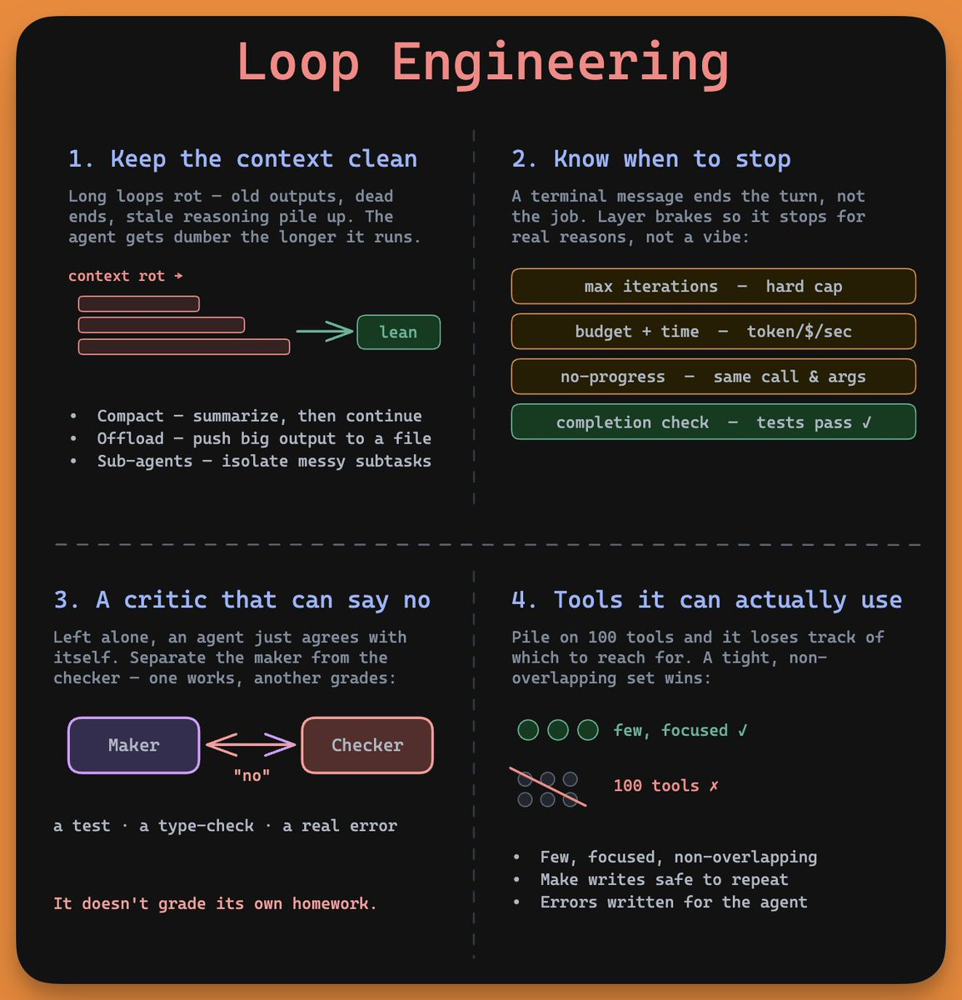

the four pillars of loop engineering.

the loop itself is six lines, and nobody competes on it. every serious agent framework lands on the same tiny while-loop. model reads context, calls a tool, you feed the result back, repeat until it stops asking.

so if that part is solved, what is everyone actually engineering?

the answer is everything around the model. Boris Cherny, who built Claude Code, put it plainly. he doesn't prompt Claude anymore, he writes loops and lets them run.

that shift has a name now, and it rests on four pillars that are harder than the six lines make them look. these are the parts that actually break:

→ knowing when to stop. a terminal message ends the turn, not the task. an agent will write failing code, glance around, and declare victory. "done" has to mean the tests pass, not the agent feeling good about its work.

→ keeping the context clean. long loops rot from the inside as old outputs and dead ends pile up. a worse context produces a worse decision, which adds more noise, and the agent gets dumber the longer it runs. you fight it by treating context as a budget, not a bucket.

→ tools the agent can actually use. pile on a hundred tools and it loses track of which one to reach for. writes have to be safe to repeat, because loops retry, and a retried "create customer" call leaves you with duplicate records.

→ something that can say no. left alone, an agent agrees with itself. the fix is to separate the maker from the checker so the worker never grades its own homework.

put those four together and your job changes. you stop steering the agent move by move and start designing the system that steers it.

Karpathy runs research loops overnight that tweak a script, test it, keep what works, and throw away what doesn't, with himself nowhere in the loop. he arranges it once and hits go.

the model is becoming a commodity. the loop around it is where the real engineering lives now.

the best builders stopped asking what they should tell the agent to do. they started asking what system would do this without them.

I wrote the full breakdown. the article is quoted below.

stay tuned for more on this!

### 🖼️ Attached Media

## 💬 Replies

### 1 @kepochnik (kepo)

*Tue Jun 23 13:32:05 +0000 2026*

@akshay\_pachaar everyone should to learn Loop Engineering

### 2 @akshay_pachaar (Akshay 🚀) (Author)

*Wed Jun 24 09:19:40 +0000 2026*

@kepochnik Absolutely!

### 3 @thearslaniqbal (Arslan Iqbal)

*Tue Jun 23 12:59:09 +0000 2026*

@akshay\_pachaar I don’t fully agree. Even strong loops still depend on model capability in edge cases.

### 4 @akshay_pachaar (Akshay 🚀) (Author)

*Wed Jun 24 09:22:44 +0000 2026*

agreed, the loop doesn't replace model capability. a weak model in a tight loop still hits a ceiling on hard edge cases.

the claim is narrower. for a fixed model, the loop decides how much of that capability you actually get out. it raises the floor, it doesn't move the ceiling.

both matter. they're just different levers.

### 5 @WanLi_99 (leeberty)

*Tue Jun 23 14:02:39 +0000 2026*

@akshay\_pachaar i find that using codex-plugin-cc and enable its review-gate feature in claude is very useful. Because after setting up, each time claude thinks it has finished the job, codex is invoked automatically through hook to check whether there is bug remaining.

### 6 @akshay_pachaar (Akshay 🚀) (Author)

*Wed Jun 24 09:26:50 +0000 2026*

@WanLi\_99 nice, that's clever.

cross-model matters here. a different model catches what a model reviewing its own work talks itself past.

worth watching the cost though. every stop fires a full review, so it can eat usage fast on long sessions.

### 7 @fercarril (ferc)

*Tue Jun 23 13:16:52 +0000 2026*

The model is the engine, if you use not the right model even in a loop, probably a better model can one-shot a better result

The key on loops is to have a great model for the feedback loop like GPT 5.5 xhigh is very good at it, the issue with the loop approach is how to balance the AI costs

### 8 @akshay_pachaar (Akshay 🚀) (Author)

*Wed Jun 24 09:21:11 +0000 2026*

fair, a stronger model raises the floor on every turn.

but the post's point holds: same model, better loop, jumped from mid-benchmark into the top five. the harness moved the needle more than swapping the brain.

cost is the real constraint though. that's why the exit condition matters, it caps the spend before a loop runs away.

### 9 @alphabatcher (Alpha Batcher)

*Tue Jun 23 17:46:29 +0000 2026*

@akshay\_pachaar need to refresh my knowledges about Loop engineering

### 10 @josesilesdata (José Siles | AI | Data)

*Wed Jun 24 10:59:07 +0000 2026*

@akshay\_pachaar loop engineering &gt; prompt engineering fr

### 11 @KongBTC (Kong Trading 🦍)

*Tue Jun 23 18:10:02 +0000 2026*

@akshay\_pachaar That part is solved so move on

### 12 @ajs6888 (安叫兽|Bird🕊️ 🔶 BNB)

*Tue Jun 23 21:14:19 +0000 2026*

@akshay\_pachaar 循环不难，难的是把边边角角兜住

### 13 @HarryTandy (Harry Tandy)

*Tue Jun 23 14:29:22 +0000 2026*

@akshay\_pachaar karpathy sleeping while his agents do the hard work

### 14 @AtomicStrata (Atomic Strata)

*Tue Jun 23 17:08:48 +0000 2026*

@akshay\_pachaar What does the memory handoff between loops look like in your setup?

### 15 @Kvng_Dhorllar (Dhorllar98________ #Billion_DhorllarPoorh)

*Wed Jun 24 05:55:02 +0000 2026*

@akshay\_pachaar @Adekoye\_Adewale

### 16 @nahid_pro09 (Nahid)

*Tue Jun 23 15:33:11 +0000 2026*

@akshay\_pachaar keeping context clean feels like the real key now

### 17 @Surtur (Surtur)

*Tue Jun 23 13:12:06 +0000 2026*

@akshay\_pachaar A non-deterministic system checking on the "work" of another non-deterministic system, what could go wrong?

### 18 @ChairKima (ChairKima)

*Tue Jun 23 19:41:00 +0000 2026*

@akshay\_pachaar I thought this is what current platforms do. I mean, engineering loops have not been there for the past 2 years?

### 19 @oroboroslabs_ai (Oroboros Labs)

*Wed Jun 24 20:49:57 +0000 2026*

If you want real Claude and access to the tools
Here is the download and yes Fable 5, Opus 4.8
and more new models. There links are for Claude Mythos 6 all original code not a copy with upgrades
the industry can not perform. Mythos 6 has all tools
and 5 nanite orchestration! All on the Full Strata Lattice
Architecture! 2x to 4x the Industry standard with
BENCHMARKS!!!
[ollama.com/oroboroslabs/c…](http://ollama.com/oroboroslabs/claude-mythos-6)
[ollama.com/oroboroslabs/c…](http://ollama.com/oroboroslabs/claude-mythos-6-5S4)

### 20 @lenooooo68 (The lena)

*Thu Jun 25 07:01:40 +0000 2026*

@akshay\_pachaar The point about "done" is underrated. An agent finishing a task and an agent producing a correct result are not always the same thing.

### 21 @eivindmeyer_cv (Eivind Meyer)

*Wed Jun 24 08:51:31 +0000 2026*

@akshay\_pachaar This is missing independent reviewers, which is the post important points. No loop will scale without that.

### 22 @Semiconsight (Semiconsight_)

*Thu Jun 25 04:12:04 +0000 2026*

@akshay\_pachaar loop engineering은 내가 아직 범적할 수 있는 것이 아니라 패스...

### 23 @maguyvaai (maguyva)

*Tue Jun 23 20:08:33 +0000 2026*

@akshay\_pachaar the six lines are cheap. what fills them with the right context is the hard part. that's [maguyva.ai](http://maguyva.ai).

### 24 @PetroSnieda (Petro Snieda)

*Tue Jun 23 16:26:08 +0000 2026*

@akshay\_pachaar if it’s all that simple, why’s everyone still scrambling for the magic loop solution, huh

### 25 @elKaniAymen (Aymen El Kani)

*Sun Jun 28 15:09:08 +0000 2026*

@akshay\_pachaar Give this to a coding agent and he will do it for you. you just need to know the term "loop engineering" and that you're doing a loop to enhance agentic engineering

### 26 @kaiNakamur78644 (kai Nakamura)

*Tue Jun 23 14:26:59 +0000 2026*

@akshay\_pachaar Critic closes the loop.

### 27 @freewoojp (free woo)

*Tue Jun 23 13:50:22 +0000 2026*

@akshay\_pachaar the convergence on that while loop is one of the more quietly interesting things in ai engineering right now.

### 28 @nichika2000823 (田仲 二千)

*Wed Jun 24 07:19:20 +0000 2026*

@akshay\_pachaar Akshay: Akshay 英語からの翻訳 原文を表示 ループ・エンジニアリングの4つの柱、運用に入れた時の確認ポイントが具体的で参考になります。

