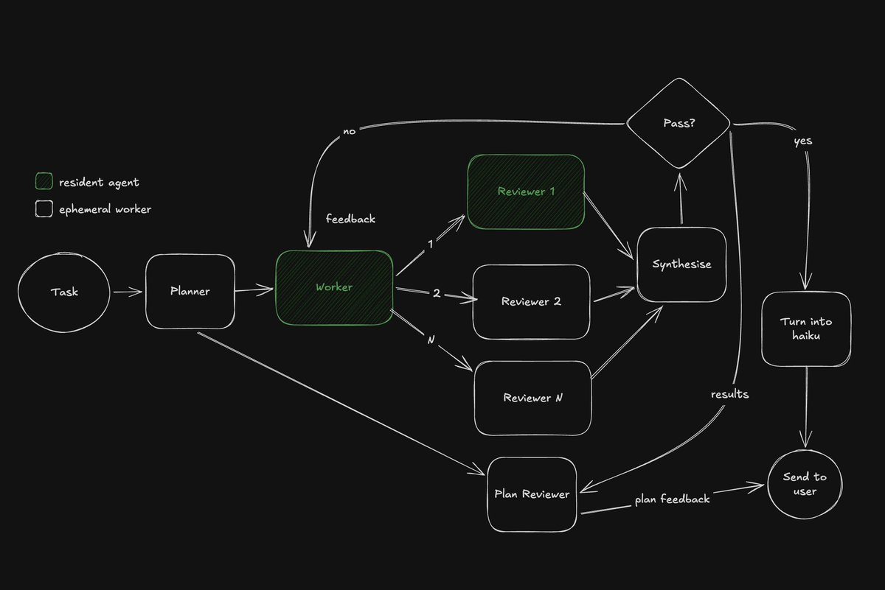
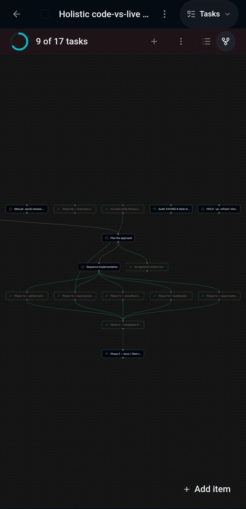
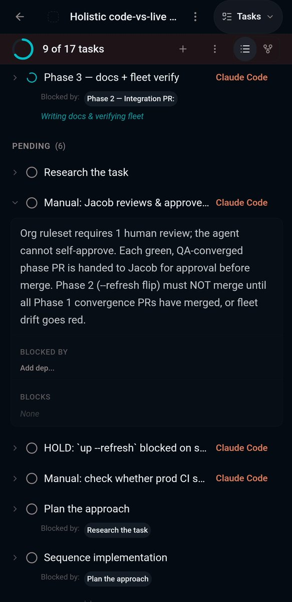

How to graph-max with Codex and 5.6 Sol:

1\. Draw a graph (literally in any tool, even on paper)
2\. Send it to Codex and say "write a code mode script that implements this workflow, run it with &lt;your inputs&gt;"

There's no step 3, it just works.

Seriously it's that simple. 

## 💬 Replies

### 1 @christinetyip (Christine Yip)

*Sat Jul 25 00:29:11 +0000 2026*

@alex\_frantic And for those trying to build a mental model of graphs, check out this conversation on when to use them, how they work, and what to do when your agent seems stuck, slow, or burns through tokens.

### 2 @sawyerhood (Sawyer Hood)

*Fri Jul 24 22:43:57 +0000 2026*

@alex\_frantic is this just claude code workflows with more steps?

### 3 @cyrusnewday (Cyrus)

*Sat Jul 25 05:48:22 +0000 2026*

@alex\_frantic If you came to this and you wanna make scripts like this durable, repeatable, and checkable, check out [GitHub.com/CyrusNuevoDia/…](http://GitHub.com/CyrusNuevoDia/gpt-workflow)

### 4 @BradGroux (Brad Groux)

*Fri Jul 24 22:21:22 +0000 2026*

@alex\_frantic FYI - @RegGroux / @ArnoldCastro

### 5 @NickStafford97 (Nick Stafford)

*Fri Jul 24 22:36:43 +0000 2026*

@alex\_frantic This was legit the most helpful thing I have seen for graph engineering lol

### 6 @Jon_Slemp (Jon Slemp)

*Sat Jul 25 00:31:10 +0000 2026*

@alex\_frantic How is this not a loop?

### 7 @Tsumugiya_it (のり｜スマ研｜中小企業の仕事をAIで業務改善中（大阪）)

*Fri Jul 24 23:13:30 +0000 2026*

@alex\_frantic I developed software for creating graphs. By connecting via MCP from tools like Codex or Claude Code, humans and AI can collaboratively edit graphs. 😁
[drillspark.io/en](https://drillspark.io/en)N

### 8 @ob12er (Elwynn Chen)

*Sat Jul 25 15:21:47 +0000 2026*

@alex\_frantic I build this for loop/graph engineer who want to visualize and edit their graph more easily [x.com/ob12er/status/…](https://x.com/ob12er/status/2079624461460922814?s=46&t=2jNrjJ3DLketuo6TTa56oQ)

### 9 @M0skito (jb)

*Sun Jul 26 15:57:46 +0000 2026*

@alex\_frantic Or ask Claude to do it [github.com/anthosx/collab…](https://github.com/anthosx/collaborative-canvas)

### 10 @OpenLLMsh (OpenLLM)

*Sat Jul 25 05:01:42 +0000 2026*

@alex\_frantic One tweak makes it way stronger: don't run all reviewers on the same model. 

Same model = same blind spots. 

You can run this with each reviewer on a different lab (Opus, GPT, Kimi) through subscriptions via OpenLLM. 

That's where the magic happens

### 11 @LLMentary (FREDD)

*Fri Jul 24 23:25:14 +0000 2026*

@alex\_frantic I’m about to tear my entire harness down. This sh\*t 🔥

### 12 @joaocoldstart (joaopaulofurtado)

*Sat Jul 25 04:09:30 +0000 2026*

@alex\_frantic + infinite amount of tokens also helps

### 13 @FuturistAI (Futurist AI)

*Sat Jul 25 12:28:46 +0000 2026*

@alex\_frantic Coming next: algorithms :)

### 14 @MengxueBi (Mengxue)

*Sat Jul 25 15:26:42 +0000 2026*

@alex\_frantic Very legit. Can be used for user flow, journey map, information architecture, etc etc

### 15 @chrisohalloran (Chris O'Halloran)

*Sat Jul 25 18:56:23 +0000 2026*

@alex\_frantic Or just ask codex/Claude/grok to use sub agents to fan out then synthesize…

### 16 @nabubito (Chron)

*Sat Jul 25 04:12:45 +0000 2026*

@alex\_frantic People still don't understand how complicated and genius graphs are. Path engineering, we'll call it?

### 17 @MrsHillKiller (Godzilla)

*Sat Jul 25 03:49:57 +0000 2026*

@alex\_frantic 

### 18 @zaguzovmaksim0 (Максим Загузов)

*Sat Jul 25 08:10:28 +0000 2026*

@alex\_frantic Сколько это в токенах?)

### 19 @accelerate27 (Ember)

*Sat Jul 25 09:59:50 +0000 2026*

@alex\_frantic I have something like this but instead if it does not pass, the auditor subagent report's will passed on to the planner and the planner will start making new plan

### 20 @k9ert (k9ert)

*Sat Jul 25 11:53:22 +0000 2026*

@alex\_frantic Simply use bmad. It's that simple!
[github.com/bmad-code-org/…](https://github.com/bmad-code-org/BMAD-METHOD)

### 21 @_JimboSlice_ (Jimbo Slice)

*Fri Jul 24 22:54:03 +0000 2026*

@alex\_frantic Where’s the haiku?

### 22 @mertkayaai (Mert Kaya)

*Sun Jul 26 15:43:55 +0000 2026*

@alex\_frantic Don't teach them the graphs Alex, they will think they are "Graph Engineers" now.

### 23 @METHEZONE (Min, THE ZONE)

*Mon Jul 27 04:16:23 +0000 2026*

did something close to this last week restructuring a subscription checkout flow. sketched the state transitions on paper first, fed codex a photo of it plus "implement this as the source of truth, flag anything ambiguous." it caught two edge cases i'd missed on the page itself.

the graph forces you to decide the hard parts before any code exists

### 24 @SlopToSignal (Makaroni)

*Sat Jul 25 02:36:00 +0000 2026*

@alex\_frantic genuinely curious how long the generated scripts stay readable once you iterate on them a few times

thats always where it falls apart for me

### 25 @JacobPetterle (Jacob)

*Sat Jul 25 13:46:12 +0000 2026*

@alex\_frantic cool. It's just a task list with deps. 

When your ready for first class support try task templates in shipyard. Reuse your graph across any task or agent

[get.shipyard.computer](https://get.shipyard.computer/) 

### 26 @dixitbavu (Dixit)

*Sat Jul 25 01:07:16 +0000 2026*

@alex\_frantic Can i suggest an improvement

[x.com/dixitbavu/stat…](https://x.com/dixitbavu/status/1991910824995381607)

### 27 @danielmulec (Daniel Mulec)

*Fri Jul 24 22:38:00 +0000 2026*

@alex\_frantic Are you kidding me?

### 28 @andysingal (Ankush Singal)

*Sat Jul 25 23:20:16 +0000 2026*

@alex\_frantic added here: [github.com/andysingal/llm…](https://github.com/andysingal/llm-course/blob/main/code-editor.md)

### 29 @enterprise_vibe (Hari)

*Sat Jul 25 01:35:22 +0000 2026*

@alex\_frantic loopGraph or graphLoop

### 30 @itsmaloy (itsmaloy 💙💛)

*Wed Jul 29 08:07:12 +0000 2026*

@alex\_frantic As long as it's not just a semantic difference of multiple parallel pipelines and loops, and delves into  details of reducing token usage with more deterministic tools...

### 31 @scgopi (Srinivasa Chaitanya Gopireddy 💻🚴‍♂️🤖)

*Thu Jul 30 04:17:26 +0000 2026*

@alex\_frantic Try GraphCode to generate such Graphs visually here [x.com/scgopi/status/…](https://x.com/scgopi/status/2082680762101563694)

### 32 @ssynq_ai (SSYNQ)

*Sat Jul 25 05:30:26 +0000 2026*

@alex\_frantic codex turns the graph into runnable code but we still need behavior history to verify the script doesnt replay past failures on new inputs.

### 33 @newromka (Roman Marinsky 🇺🇦🇪🇺)

*Sat Jul 25 20:12:23 +0000 2026*

@alex\_frantic I did it in the prompt engineering era, and Boris said it's a loop; now it's a graph) 
But actually, totally agree - it's needed just to say Implement it! 
Check a few results of work, update, and that's all. 

Oh, and wait for a new models to clean up a bit of the instructions

### 34 @JosefVectorStr (Josef)

*Mon Aug 10 14:50:28 +0000 2026*

@alex\_frantic I’ve moved past graph loops for agentic coding agents.

I’m calling what I’m working on Adjoint Hypergraph Rewriting Loops (AHRLs).

I keep seeing more and more agent systems built around graphs of agents, tools, tasks, workflows. And I think we’re still thinking too small.

### 35 @WorkflowStack (Carry)

*Sat Jul 25 00:48:13 +0000 2026*

@alex\_frantic 'it just works' is doing a lot of heavy lifting here

what happens when the graph has a cycle or an ambiguous branch 😐

### 36 @Tanzzeeel (Tanzeel ur Rehman)

*Sat Jul 25 01:40:59 +0000 2026*

@alex\_frantic So a visual representation of loop is graph engineering?

