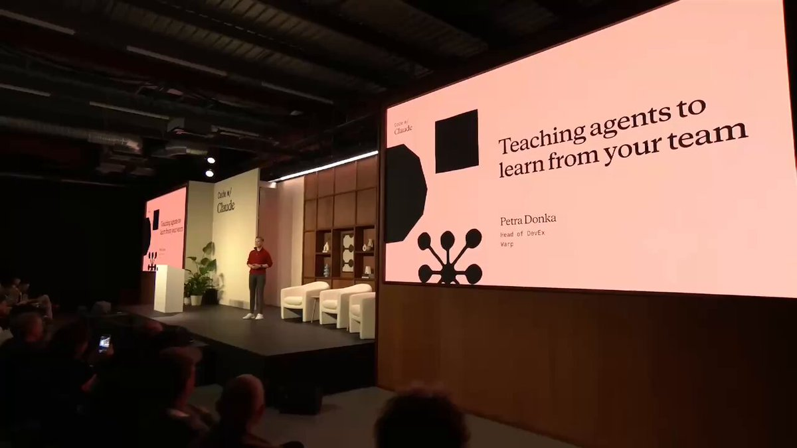

Anthropic just released 5 Claude workshops on the new skill every AI builder needs: Loop Engineering:

00:00 - Stop babysitting your agents
37:07 - Build a proactive Claude Code loop
1:11:23 - Build a production-ready Managed Agent
1:38:46 - Teach agents to learn from your team
2:07:15 - Hill-climb your agent with eval loops

It is a 2 hour and 25 minute blueprint for Loop Engineering: proactive workflows, managed agents, team feedback, evals, and self-improvement.

Watch it today, and read the article below to improve your skills with Fable 5.

### 🖼️ Attached Media

## 💬 Replies

### 1 @adelbucetta (Adel Bucetta)

*Wed Jul 08 11:57:00 +0000 2026*

@de1lymoon that's the part that gets lost in all the excitement around ai: making them not just work, but actually do the heavy lifting for you in prod

### 2 @de1lymoon (Alex) (Author)

*Wed Jul 08 12:01:03 +0000 2026*

@adelbucetta Yeah, you're absolutely right

### 3 @RohOnChain (Roan)

*Wed Jul 08 17:51:14 +0000 2026*

@de1lymoon great sessions alex, thank you

### 4 @de1lymoon (Alex) (Author)

*Wed Jul 08 17:53:59 +0000 2026*

@RohOnChain 

### 5 @0xMortyx (Morty)

*Wed Jul 08 11:22:20 +0000 2026*

@de1lymoon damn, add to my smart watch list, thanks Alex

### 6 @de1lymoon (Alex) (Author)

*Wed Jul 08 11:23:55 +0000 2026*

@0xMortyx I really hope this will be helpful

### 7 @0xMorlex (Morlex)

*Wed Jul 08 11:34:59 +0000 2026*

@de1lymoon My favorite part it's "Teach agents to learn from your team"

### 8 @de1lymoon (Alex) (Author)

*Wed Jul 08 11:47:54 +0000 2026*

@0xMorlex Me too, Morlex

### 9 @0xChaseTM (Chase)

*Wed Jul 08 11:29:30 +0000 2026*

@de1lymoon building a loop part is must-watch, ngl

### 10 @de1lymoon (Alex) (Author)

*Wed Jul 08 11:32:55 +0000 2026*

@0xChaseTM I'm glad you liked it

### 11 @ajs6888 (安叫兽|Bird🕊️ 🔶 BNB)

*Wed Jul 08 11:44:52 +0000 2026*

@de1lymoon loop engineering 这词一出来，感觉又要开新坑了

### 12 @Nekt_0 (Nekt0)

*Wed Jul 08 12:33:29 +0000 2026*

@de1lymoon That seems like a fair take

### 13 @stateoftheart (State of The Art™ - AI / AGI (e/acc))

*Wed Jul 08 11:46:45 +0000 2026*

@de1lymoon Loop engineering looks cool

### 14 @NgoTomek (Minh Danh Ngo)

*Thu Jul 09 05:32:09 +0000 2026*

@de1lymoon Mastering the loop

### 15 @Yumzlef (Yumzlef)

*Wed Jul 08 13:46:48 +0000 2026*

@de1lymoon Wow this is very impressive, the implementation is clean

### 16 @qmatrix_ai (Qmatrix)

*Wed Jul 08 16:02:38 +0000 2026*

@de1lymoon We treat loop engineering as specialist-attestation problem. Domain experts label the eval loops that actually drive agent self-improvement.

