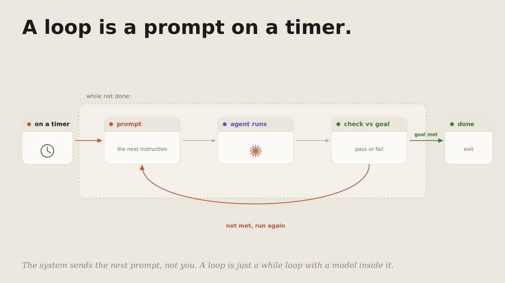
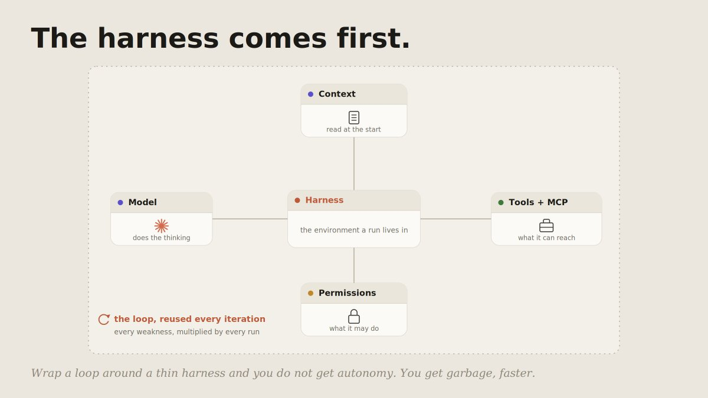
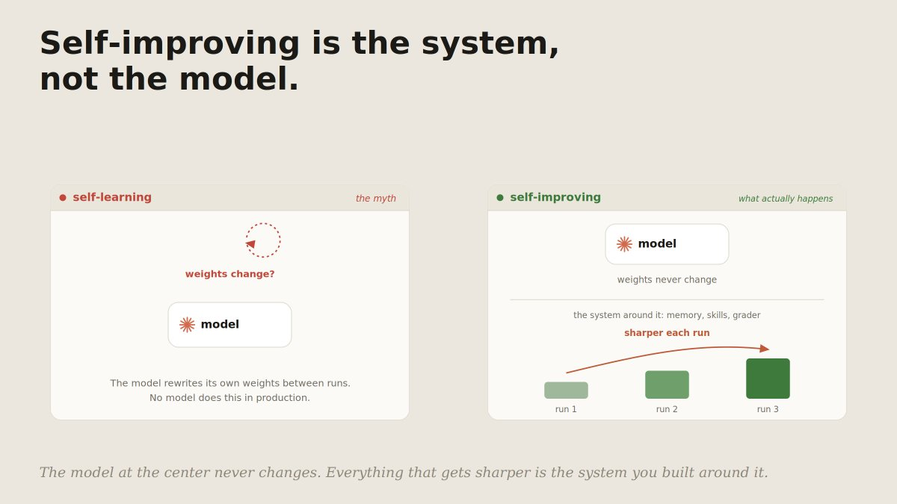
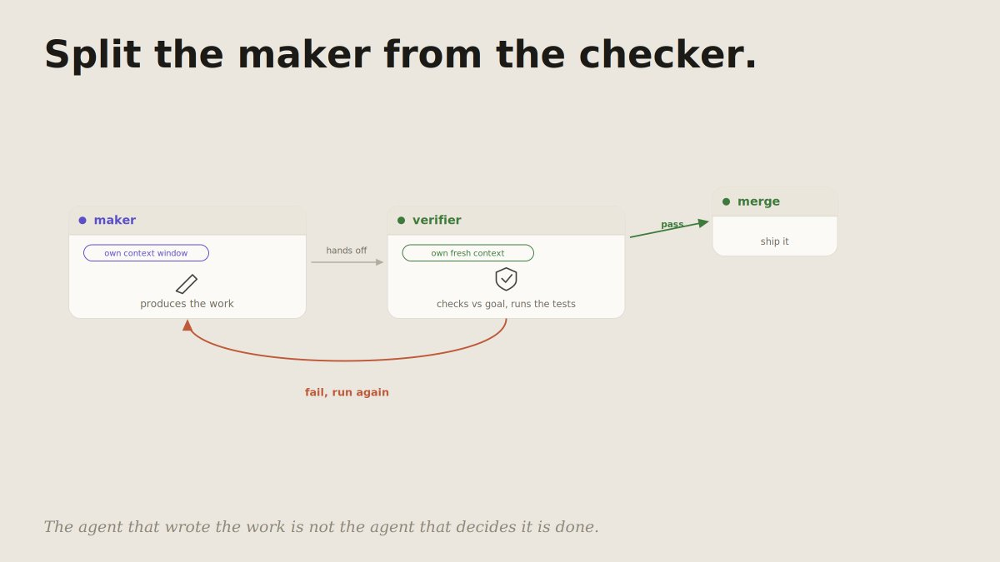
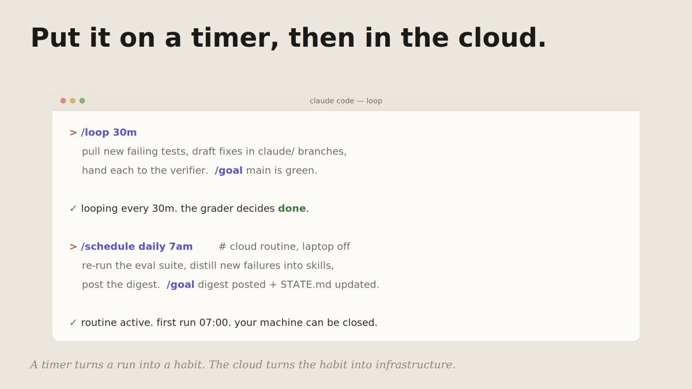
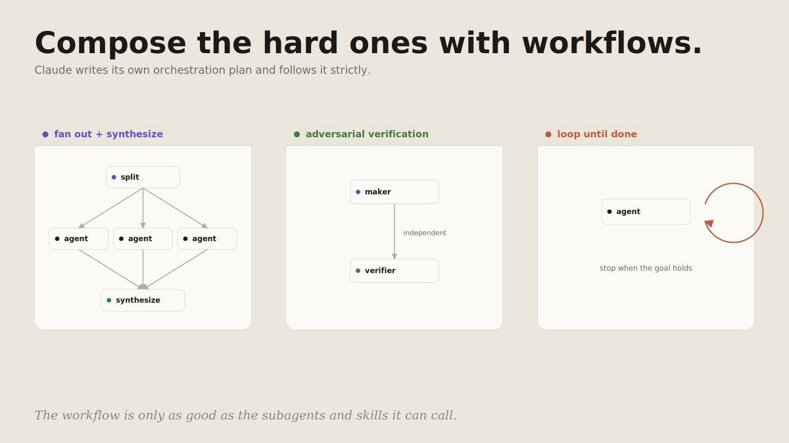
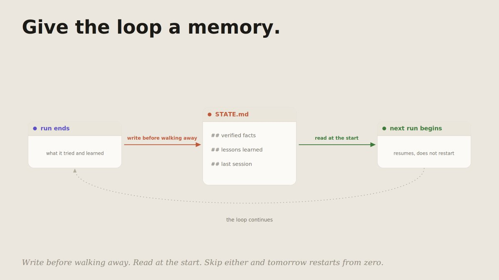
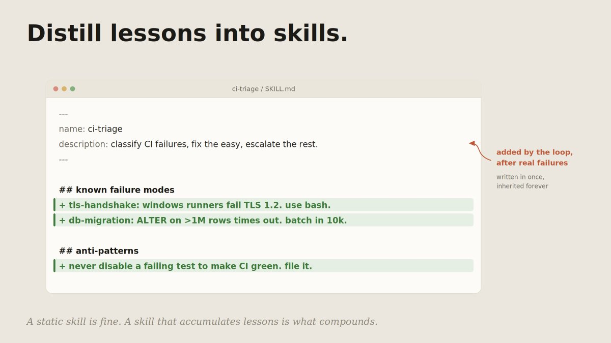
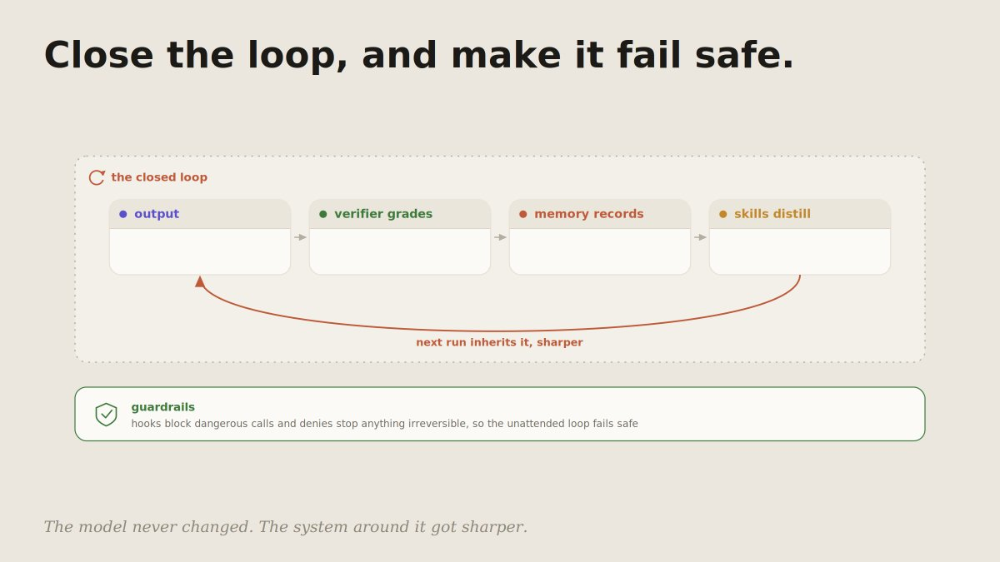
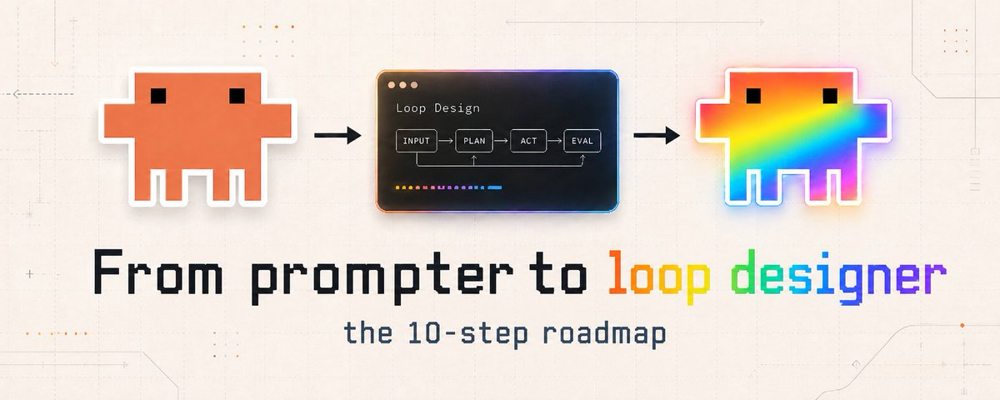

# 📰 From prompter to loop designer: the 10-step roadmap

Most people talk to Claude Code. They type a request, watch it work for a few minutes, read the result, and type the next request. They are prompters. 

The agent is a very capable tool that sits idle until poked.

A loop designer builds something different: a system that prompts itself. It runs on a timer, checks its own work against a goal, spawns helpers when it needs them, and writes down what it learned so the next run starts smarter. 

The designer is not in the chair for most of it. They built the thing that sits in the chair.

The gap between the two is not talent and it is not a better prompt. It is ten moves, and none of them is exotic. This is the roadmap: three steps to see the loop clearly, four to build it, three to make it compound instead of bleed. Everything here uses Claude Code parts you already have, and everything factual is checked against the current docs.

Before you start read this article, if you want to know more about AI: 

Follow Telegram: @autoApprove1 
Follow SubStuck: https://substack.com/@deilymoon

## Tier 1 · See the loop

> 01\. A loop is a prompt on a timer  

Strip the mystique and a loop is one idea: instead of you sending the next prompt, the system sends it. It runs the agent, looks at the result, decides whether the job is done, and if not, runs it again. 

A while loop with a model inside. 

On a timer -&gt; Prompt -&gt; Agent runs -&gt; Chech vs Goal -&gt; Done 

That reframing is the whole shift from prompter to designer. A prompter optimizes the single message. 

A designer optimizes the cycle: what starts it, what stops it, what it remembers between turns. Once you see the agent as a loop rather than a chat, every later step is just shaping one part of that cycle.

> 02\. The harness comes first.

A loop is only as good as the environment it runs in. That environment is the harness: the model, the tools it can reach, the permissions on those tools, and the context it reads at the start of every run. 

Wrap a loop around a thin harness and you do not get autonomy, you get garbage produced faster.

So before you automate anything, get one manual run reliable. A CLAUDE.md with your standing facts, a clear verification target, the right tools connected. The loop will reuse all of it on every iteration, which means every weakness in the harness gets multiplied by however many times the loop run.

> 03\. Self-improving is the system, not the model.

The phrase "self-improving agent" invites a misunderstanding worth killing early. The model is not learning. 

Its weights do not change between your runs. What improves is the system around it: the memory it accumulates, the skills that get sharper as edge cases are added, the grader that keeps it honest.

This is the honest version of the idea, and it matters because it tells you where to put the work. 

You are not waiting for the model to get smarter. You are building an environment that gets smarter, run over run, with the same model at the center the whole time.

## Tier 2 · Build the loop

> 04\. Set a goal and an independent grader.

A loop needs a stop condition that is not "the agent feels finished." /goal gives you one: an objective the loop iterates against until an independent check says it is met, rather than stopping at "handled enough."

\`\`\`bash
&gt; /goal All tests pass and lint is clean.
  Triage failures, draft fixes, repeat until the goal holds.
\`\`\`

The key word is independent. The thing that decides "done" should not be the thing that did the work. That single separation is what makes a loop trustworthy instead of a machine that congratulates itself.

> 05\. Split the maker from the checker.

The reason a separate grader beats self-review is structural, not effort. A model judging its own output sees its own reasoning and prefers conclusions consistent with what it already wrote. 

A separate agent, with its own fresh context window, sees only the artifact and the standard. It has no stake in the maker's choices.

So you define a verifier as a subagent:

\`\`\`markdown
\---
name: verifier
description: Independent check of the maker's output against the goal. Use every iteration.
tools: Read, Grep, Bash
\---
You did not produce this work. Check it against the goal and the
project rules. Run the tests yourself. Report pass or fail with
concrete reasons and file references. Do not be generous.
\`\`\`

Now the loop has a maker and a checker, and the checker is the one holding the gate.

> 06\. Put it on a timer, then in the cloud.

A goal-driven run still waits for you to start it. The next move is a cadence. /loop reruns a prompt on an interval, so the agent chips away at a backlog instead of waiting for a human to type.

\`\`\`bash
&gt; /loop 30m
  Pull new failing tests, draft fixes in claude/ branches,
  hand each to the verifier. /goal main is green.
\`\`\`

Then take your laptop out of the equation. Cloud routines run a saved configuration on Anthropic-managed infrastructure on a schedule or an event, with the machine in front of you closed. 

A timer turns a run into a habit. The cloud turns the habit into infrastructure.

> 07\. Compose the hard ones with workflows.

Some jobs are too structured for a single loop: massively parallel, multi-stage, or needing several independent perspectives. 

For those, Claude Code can write its own orchestration plan and follow it strictly. You ask for a workflow in plain language and it composes the subagents you defined into a shape:

\`\`\`bash
&gt; Build a workflow: for each failing test, spawn an agent to draft a
  fix, run them in parallel, then have the verifier check every diff
  before anything merges.
\`\`\`

Three shapes earn their place in most loops: fan out and synthesize (split work, run in parallel, combine), adversarial verification (a maker and an independent checker per task), and loop until a stop condition holds. The workflow is only as good as the subagents and skills it can call, which is why the harness came first.

## Tier 3 · Make it compound

> 08\. Give the loop a memory.

This is the step that turns a configured loop into a system that improves. The agent forgets everything between runs. The loop does not have to. A state file records what was tried, what worked, what failed, and what survived as a rule.

\`\`\`markdown
\# State · payments-service

\## Verified facts
\- Webhook secret is in STRIPE\_WEBHOOK\_SECRET, not the dashboard.
\- prc column is integer cents. Confirmed via SELECT MIN/MAX.

\## Lessons learned
\- e2e checkout flakes on a webhook race. Add a settle delay in tests.

\## Last session
2026-06-22 · 3 fixes merged, 2 escalated. Next: verify the rate-limit fix.
\`\`\`

Two rules make it compound instead of just grow. Write before walking away: every run ends by updating the file. Read at the start: every run begins by loading it. Skip either and tomorrow restarts from zero.

> 09\. Distill lessons into skills.

A state file is project memory. It dies with the project. The lessons that are general, the ones that would help on the next project too, graduate into skills: procedures the agent runs, sharpened every time they fail in a new way.

\`\`\`markdown
\---
name: ci-triage
description: Classify CI failures, draft fixes for the easy ones, escalate the rest.
\---
\## Known failure modes
\- tls-handshake: Windows runners fail TLS 1.2 in PowerShell. Use bash.
\- db-migration: ALTER on tables over 1M rows times out. Batch in 10k chunks.

\## Anti-patterns
\- Never disable a failing test to make CI green. File it instead.
\`\`\`

When a loop hits a wall, the lesson goes into the skill, and every future loop on every future project inherits it. 

That is the difference between an agent that re-derives your environment each time and one that stands on everything it learned before.

> 10\. Close the loop, and make it fail safe.

Now the parts lock together. Each run produces output. The verifier grades it. The verdict is written to memory. The general lessons are distilled into skills. The next run inherits sharper skills and richer memory. The model never changed. The system around it got sharper. That is what "self-improving" honestly means.

An autonomous loop also has to fail safe, because no one is watching each iteration. That is what guardrails are for. A hook is a wall the model cannot talk its way past:

\`\`\`json
{
  "permissions": {
    "allow": \["Read(\*)", "Bash(npm run test \*)"\],
    "deny": \["Bash(git push origin main)", "Bash(rm \*)", "Edit(.env)"\]
  },
  "hooks": {
    "PreToolUse": \[
      {
        "matcher": "Bash",
        "hooks": \[
          { "type": "command", "command": "./.claude/hooks/block-dangerous.sh" }
        \]
      }
    \]
  }
}
\`\`\`

Route the work by cost while you are at it: the orchestrator on the heavyweight model, the high-volume passes on cheaper ones, and a fallback for tasks the top tier declines. A loop that runs unattended and cannot do anything irreversible is one you can actually leave alone.

## The mistakes that keep a loop from compounding: 

1. Looping a thin harness. A loop multiplies whatever is underneath it. A weak harness just produces slop faster. Build step 2 first.

1. Letting the maker grade itself. Self-review is a confident machine, not a correct one. The checker needs its own context window.

1. No stop condition. Without a goal an independent grader can check, the loop halts at "good enough" and calls it done.

1. No memory. Every run restarts from zero. This is where most of the compounding quietly leaks out.

1. Lessons that never leave the state file. A general lesson that stays project-scoped dies with the project. Graduate it into a skill.

1. An unattended loop with broad permissions. No one is watching each step, so the hooks and denies are not optional.

1. Top-tier model for every iteration. Route by task, or an always-on loop bleeds money on work a cheaper model would do fine.

## The point

A prompter has a powerful tool and operates it by hand. A loop designer builds a system that operates itself and only calls them in for the parts that need a human: the goal, the standard, the merge button, anything irreversible.

The move from one to the other is not a secret prompt. It is a sequence: see the agent as a loop, build the harness it runs on, give it a goal and an honest grader, put it on a timer, then teach it to remember and distill what it learns. The model at the center stays the same the whole way. Everything that improves is the loop you wrapped around it.

Pick the one step you are not doing yet, probably an independent grader, a state file, or a single safety hook, and add it today. Then the next. Stop optimizing the prompt. Start designing the loop.

### 🖼️ Attached Media

## 💬 Replies

### 1 @0xCodez (Codez)

*Wed Jun 24 10:58:22 +0000 2026*

@de1lymoon damn bro, this guide looks wild ! real chad

### 2 @de1lymoon (Alex) (Author)

*Wed Jun 24 11:15:56 +0000 2026*

@0xCodez thanks mate, i hope it’s will be helpful

### 3 @Damir_Akaza (Damir Akaza)

*Wed Jun 24 10:22:49 +0000 2026*

@de1lymoon How long did it take you to figure all this out?

### 4 @de1lymoon (Alex) (Author)

*Wed Jun 24 10:28:15 +0000 2026*

@Damir\_Akaza Not that long, I think it's been about 3 days, and I've already gotten pretty good at using them

### 5 @Nekt_0 (Nekt0)

*Wed Jun 24 10:26:02 +0000 2026*

@de1lymoon This could matter over time

### 6 @gerardsans (Gerard Sans | Axiom 🇬🇧)

*Wed Jun 24 14:03:10 +0000 2026*

@de1lymoon 💀

### 7 @gerardsans (Gerard Sans | Axiom 🇬🇧)

*Wed Jun 24 14:02:47 +0000 2026*

@de1lymoon 👀

### 8 @Mrcryptoo1 (°Mrcrypto°)

*Wed Jun 24 12:21:47 +0000 2026*

@de1lymoon no content provided to analyze

### 9 @0xMorlex (Morlex)

*Wed Jun 24 10:21:35 +0000 2026*

@de1lymoon Saved Loop for future study

### 10 @Medvidio (Medvid)

*Wed Jun 24 10:28:33 +0000 2026*

@de1lymoon This topic is kind of new to me... I need to figure it out

### 11 @jilyannori (Curious Nori | AI · Food · Travel)

*Wed Jun 24 10:22:30 +0000 2026*

@de1lymoon Dropping by to say I enjoyed this. Thanks!

### 12 @nahid_pro09 (Nahid)

*Wed Jun 24 12:22:43 +0000 2026*

@de1lymoon loop designer could change how we interact with tools

### 13 @0xScalex (Scalex)

*Thu Jun 25 21:37:44 +0000 2026*

@de1lymoon Great guide, bro! I'll save it and give it a try later

### 14 @eydempa (ベアブリ)

*Wed Jun 24 13:02:57 +0000 2026*

@de1lymoon @LilysAI\_ 要約して

### 15 @KlingonYellow (The Klingon Yellow)

*Wed Jun 24 21:42:51 +0000 2026*

@de1lymoon I'm taking a first stab at Hermes Agent specific implementation.

[github.com/groktopus/loop…](https://github.com/groktopus/loop-designer)

### 16 @Psalteric (Psalter)

*Sat Jul 11 16:17:09 +0000 2026*

@de1lymoon Nice article

### 17 @igorfomich (Igor Fomenko)

*Wed Jun 24 22:17:33 +0000 2026*

@de1lymoon i added a separate verifier and the loop stopped celebrating its own mistakes.  
the state file kept the harness stable when other runs were still noisy.  
how do you merge memory files across parallel loops?

### 18 @nazyaai (nazyaAI)

*Wed Jun 24 13:11:30 +0000 2026*

@de1lymoon so much value! thx bro

### 19 @Restopilot (Restopilot)

*Wed Jun 24 15:03:05 +0000 2026*

@de1lymoon Thanks man

