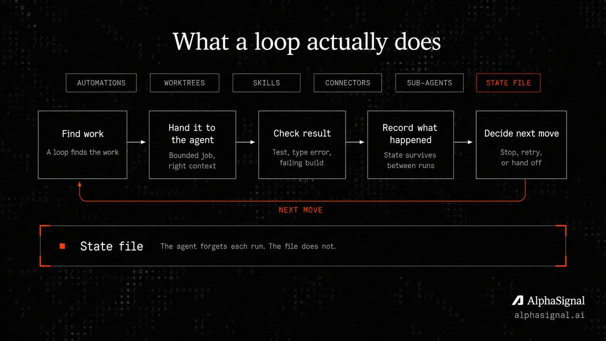
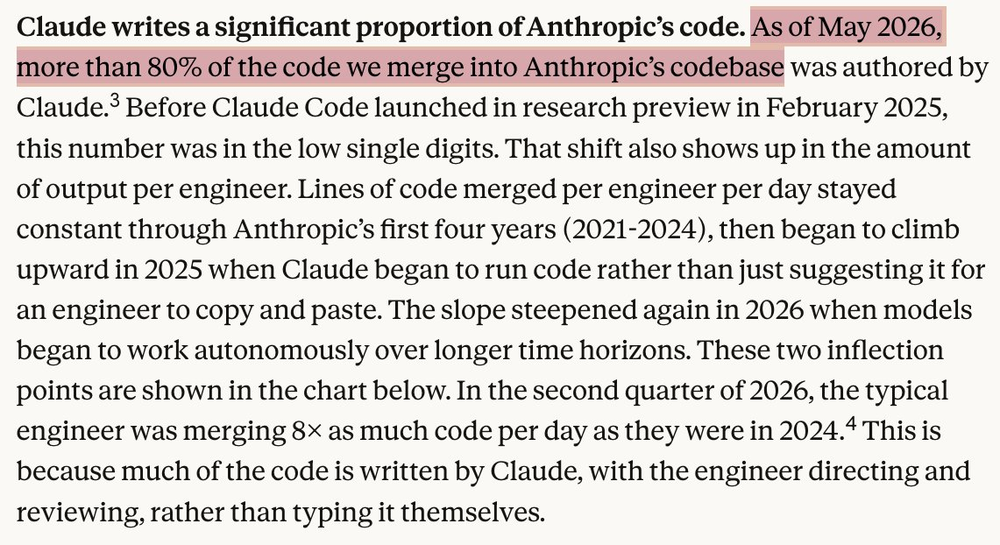
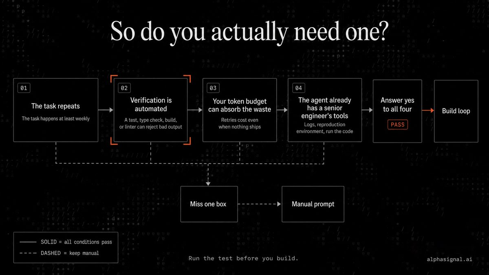
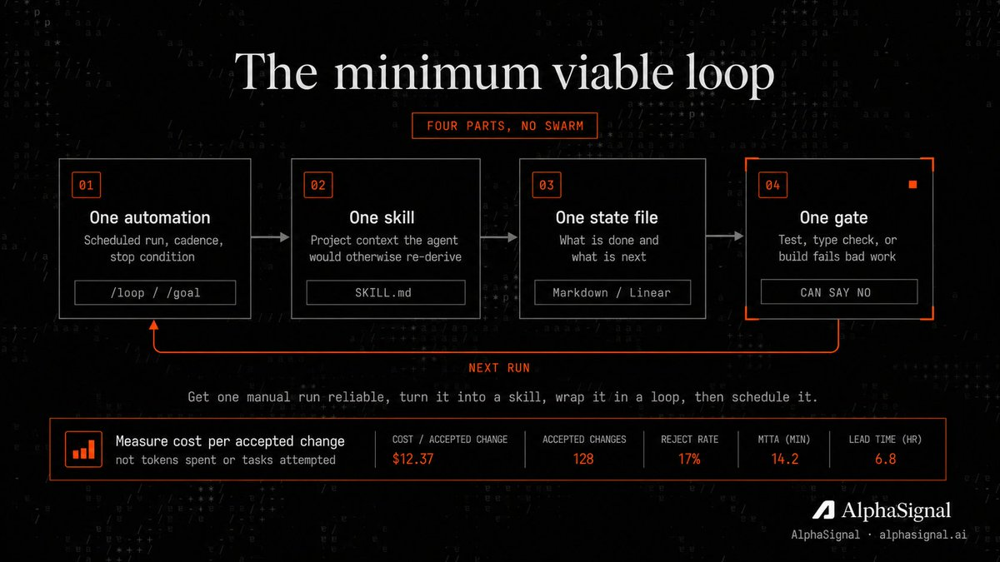
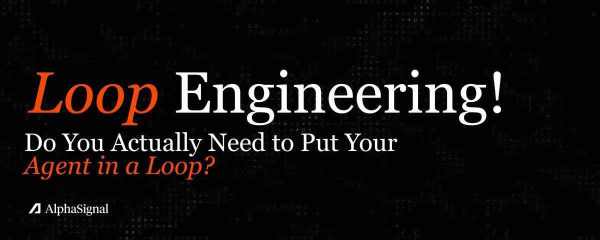

# 📰 Most Developers Do Not Need Agent Loops Yet 

## The patterns were documented in 2024. Here's who it pays off for, and the four conditions that decide.

---

> In \~9 mins: the four-condition test, what Anthropic documented back in 2024, who loses and why, the one thing that separates a working loop from an expensive one, and the minimum viable loop to build first.

Most developers do not need to put their coding agent in a loop yet, even though the technique went viral this month.

Loop engineering is building a system that prompts your agent on a schedule, instead of typing each prompt yourself.

Peter Steinberger kicked off this round of hype on June 7 with one line: stop prompting coding agents, start designing loops that prompt them.

[Embedded Tweet: https://x.com/i/status/2063697162748260627]

It pays off under four conditions: the task repeats, verification is automated, your token budget can absorb the waste, and the agent already has the tools a senior engineer would use. Miss one and the loop costs more than it returns.

---

## What a loop actually does

A loop finds the work, hands it to the agent, checks the result, records what happened, and decides the next move.

Addy Osmani, who published a long post on the practice the same week, defines it plainly: loop engineering is replacing yourself as the person who prompts the agent, and building the system that does it instead.

Boris Cherny, who runs Claude Code at Anthropic, said the same thing, quoted in Osmani's post: "I don't prompt Claude anymore. I have loops running that prompt Claude and figuring out what to do. My job is to write loops."

Osmani breaks a loop into six parts: automations that run on a schedule, worktrees that isolate parallel work, skills that store project knowledge, connectors that reach your tools, sub-agents that split writing from checking, and a state file that survives between runs.

The agent forgets each run. The file does not.

---

## The idea isn't new, the access is

Anthropic described these patterns in December 2024.

Its engineering post Building Effective Agents named the evaluator-optimizer loop (one model generates, another critiques, repeat) and the orchestrator-workers pattern (one model delegates to others), and defined an agent as "typically just LLMs using tools based on environmental feedback in a loop."

The vocabulary going viral in 2026 was documented eighteen months ago.

Two things changed.

Capability: Anthropic reports the task length a model can complete reliably is doubling roughly every four months, up from every seven, with its top model now handling jobs that take a human about twelve hours.

More than 80% of the code Anthropic merges into its own codebase is now written by Claude.

Distribution changed too.

Osmani's line is that a year ago a loop meant writing a pile of bash and maintaining it forever, and now the pieces ship inside the tools.

Running it now takes a config file, not a custom rig.

---

## So do you actually need one?

Loops earn their cost under four conditions. Run the test before you build.

The task repeats. 

A loop amortizes its setup across many runs. For a one-time job, a good prompt is faster and cheaper. If the work does not recur weekly, you do not have a loop, you have a script you ran once.

Verification is automated. 

The loop needs something that can fail the work without you in the room: a test suite, a type checker, a linter, a build. No automated check means you are back in the chair reading every diff, which is the exact job the loop was supposed to remove.

Your token budget can absorb the waste. 

Loops re-read context, retry, and explore. That burns tokens whether or not the run ships anything. The technique scales with budget, which is why it reads as obvious to people with effectively free tokens and reckless to people on a metered plan.

The agent already has a senior engineer's tools. 

Logs, a reproduction environment, the ability to run the code it writes and see what breaks. Without that, the loop iterates blind.

Answer yes to all four and a loop is worth building. Miss one and you are automating a process that was not ready to be automated.

---

## The 30-second loop check

Before you schedule anything, check five boxes:

- The task happens at least weekly.

- A test, type check, build, or linter can reject bad output.

- The agent can run the code it changes.

- The loop has a hard stop: token budget, iteration count, or time limit.

- A human reviews before merge, deploy, or dependency changes.

Good first loops: CI failure triage, dependency bump PR drafts, lint-and-fix passes, flaky test reproduction, issue-to-PR drafts on code with strong tests.

Bad first loops: architecture rewrites, auth or payments code, production deploys, vague product work, anything where "done" is a judgment call.

Miss one box and keep it as a manual prompt.

---

## Who loses

Generation was never the bottleneck, and loops make that obvious.

Anthropic's engineers now merge eight times as much code per day as they did in 2024, a figure Anthropic itself calls "almost certainly an overstatement of the true productivity gain."

The wall is review, not authorship.

A loop running unattended widens a second gap.

Osmani calls it comprehension debt: the faster the loop ships code you did not write, the larger the distance between what the repository contains and what you understand.

He pairs it with cognitive surrender, the pull to stop forming an opinion and accept whatever the loop returns.

The bill that hurts is not the token bill. It is the day you have to debug a system no one on the team has read.

The token bill is real too.

Loops favor whoever can spend, and most developers on consumer plans cannot run heavy verification loops without hitting limits or a surprise invoice.

---

## What separates a working loop from an expensive one

The hard part of a loop is not the loop. It is putting something inside it that can say no.

A loop with no real check is the agent agreeing with itself on repeat.

Osmani's framing is that the model that wrote the code is, in his words, "way too nice grading its own homework," so the highest-value structural move is splitting the writer from the checker.

That is the evaluator-optimizer pattern from Anthropic's 2024 post under a new name.

The check has to fail objectively: a test, a type error, a failing build. A second agent told to "review this" with no real signal just adds a second optimist.

The failure mode has a name.

Engineer Geoffrey Huntley documented the "Ralph Wiggum loop," where an agent meant to emit a completion token only when finished emits it early, and the loop exits on a half-done job.

Without a hard gate, loops fail quietly and keep spending.

The evidence also argues against scale.

A 2025 survey of 306 practitioners across 26 domains (the Measuring Agents in Production study) found 68% of production agents run ten steps or fewer before a human steps in.

The systems that work are small and supervised, not autonomous swarms.

A 2026 study on asynchronous coding agents got its gains, plus 26.7% on paper reproduction and plus 14.3% on library tasks, from isolating each agent in its own git worktree and verifying, not from adding agents.

Anthropic's own first principle for agents reads the same way: maintain simplicity.

---

## The security tax

A loop running unattended is an attack surface running unattended.

Georgia Tech's Vibe Security Radar has traced more than 70 confirmed CVEs to AI coding tools as of mid-2026, a count it calls incomplete, spanning command injection, server-side request forgery, and cross-site scripting.

Agents optimize for code that works, not code that is safe, and a loop ships that code faster than a human can read it.

The agent's own configuration is a target.

A 2026 audit of 17,022 agent skills found 520 of them leaking credentials, with debug logging behind about 74% of the leaks.

Skill descriptions double as a prompt-injection vector, since the agent reads them as instructions.

A loop that auto-installs skills inherits every one of those holes without a human reading them first.

---

## Who benefits

The teams that gain are the ones with repetitive, machine-checkable work and the budget to run it: continuous test triage, dependency bumps, lint-and-fix passes, issue-to-PR drafts on a codebase with strong test coverage.

If a junior engineer could do the task from a checklist and a test suite would catch the mistakes, a loop fits.

The developers who should skip it are solo builders on consumer plans, anyone working on code with no automated verification, and teams whose real constraint is review capacity rather than typing speed.

For one-off tasks, exploratory work, or anything where "done" is a judgment call, a single well-aimed prompt still wins.

---

## If you're in: the minimum viable loop

If you pass the four-condition test, build the smallest loop that works before anything fancy.

Four parts, no swarm.

One automation. A scheduled run, /loop in Claude Code or an automation in Codex, that fires on a cadence and stops on a clear condition. Both tools also expose /goal, which runs until a stated condition is true.

One skill. A single SKILL.md that stores the project context the agent would otherwise re-derive from zero every run.

One state file. A markdown file, or a Linear board, that records what is done and what is next, so tomorrow's run resumes instead of restarting. Osmani's rule: the agent forgets, the repo does not.

One gate. The test, type check, or build that fails bad work automatically. This is the part that decides whether the loop helps or just spends.

Order matters: get one manual run reliable, turn it into a skill, wrap it in a loop, then schedule it.

A standing high-level spec the agent rereads each run, a VISION.md or AGENTS.md, keeps a long loop from drifting off the goal.

Measure cost per accepted change, not tokens spent or tasks attempted.

---

## The AlphaSignal Take

Loop engineering is a real practice with a real ceiling, and most of the hype skips the ceiling.

The economics are not universal. The people calling it obvious tend to have unmetered tokens. On a $20 consumer plan, an unbounded loop burns through rate limits or runs up a usage bill fast, with little to show, and no public, verifiable case study yet proves the return for a solo developer.

Verification is still yours. Every credible source here, Osmani and Anthropic included, lands on the same point: the loop automates the typing, not the judgment. Code review is already the bottleneck, and a loop makes that queue longer, not shorter.

The novelty is oversold. Anthropic published the patterns in December 2024. Gary Marcus called the recent self-improvement framing a "bait and switch," arguing that what is actually on display is faster coding under human control, not a system improving itself. On this one, he is right.

So the best recommendation is to wait if you are a solo developer on a metered plan, and to start small if your team has automated tests and a token budget that can absorb the waste.

The win is real for repetitive, verifiable work. It is a money pit for everything else.

---

All sources in the first reply. Full breakdown of recent updates + daily signals in our newsletter, Read by 300,000+ developers. (link in bio).

---

## Questions?

What is loop engineering? Building a system that prompts a coding agent on a schedule, then checks and records the result, instead of prompting the agent yourself for each task. The human moves from typing prompts to designing the loop and setting the quality bar.

Do I need to put my agent in a loop? Only if the work repeats, you have automated verification, your token budget can absorb retries, and the agent has real tools. For one-off or judgment-heavy work, a single prompt is faster and cheaper.

Is loop engineering new? No. Anthropic documented the underlying patterns, including evaluator-optimizer and orchestrator-workers, in December 2024. What changed is that the primitives now ship inside tools like Claude Code and Codex.

What is the most common way loops fail? Running with no gate that can fail the work. With no automated check, the agent approves its own output and the loop either burns tokens with no progress or exits early on a half-finished task.

What should I build first? The smallest possible loop: one scheduled automation, one skill file, one state file, and one automated check. Get a single manual run reliable before you schedule it.

### 🖼️ Attached Media

## 💬 Replies

### 1 @AlphaSignalAI (AlphaSignal) (Author)

*Mon Jun 08 18:45:24 +0000 2026*

Links:

Addy Osmani: Loop Engineering
[addyosmani.com/blog/loop-engi…](https://addyosmani.com/blog/loop-engineering/)

Anthropic: Building Effective Agents
[anthropic.com/engineering/bu…](https://www.anthropic.com/engineering/building-effective-agents)

Anthropic: When AI Builds Itself
[anthropic.com/institute/recu…](https://www.anthropic.com/institute/recursive-self-improvement)

Measuring Agents in Production (arXiv 2512.04123)
[arxiv.org/abs/2512.04123](https://arxiv.org/abs/2512.04123)

Effective Strategies for Asynchronous Software Engineering Agents (arXiv 2603.21489)
[arxiv.org/abs/2603.21489](https://arxiv.org/abs/2603.21489)

### 2 @AlphaSignalAI (AlphaSignal) (Author)

*Tue Jun 09 13:55:36 +0000 2026*

Subscribe at [alphasignal.ai/newsletter](https://alphasignal.ai/newsletter) for daily AI signals. Read by 300,000+ developers.

### 3 @m13v_ (Matt)

*Mon Jun 08 21:11:04 +0000 2026*

@AlphaSignalAI designing the loop is the easy part. what nobody tweets is iteration 200, when a tool's response shape shifts and the agent keeps building on a wrong result. catching that silent drift is the real work, not the loop. [fde10x.com/r/xwtjkfpf](https://fde10x.com/r/xwtjkfpf) written with ai

### 4 @AlphaSignalAI (AlphaSignal) (Author)

*Mon Jun 08 21:20:29 +0000 2026*

@m13v\_ 100%, the loop is the visible part. The real work is contract tests around tools which response schemas, trace diffs, and hard pauses when an output shape changes. Otherwise the agent just keeps building on a quiet bad assumption.

### 5 @Blum_OG (Blum)

*Tue Jun 09 10:30:35 +0000 2026*

@AlphaSignalAI in many cases loops shouldn't be used precisely because of the significant token cost

### 6 @AlphaSignalAI (AlphaSignal) (Author)

*Tue Jun 09 13:10:28 +0000 2026*

@Blum\_OG YES, token cost is the forcing function, if the work is not repeatable and verifiable, the loop usually costs more than the human prompt it replaced

### 7 @corelumen (Nicholas Blanchard)

*Mon Jun 08 19:18:07 +0000 2026*

@AlphaSignalAI I don't always build loop infrastructure, but when I do:

[github.com/syndicalt/llmff](https://www.github.com/syndicalt/llmff)

### 8 @AlphaSignalAI (AlphaSignal) (Author)

*Mon Jun 08 21:17:00 +0000 2026*

@corelumen This is the kind of loop infra that makes sense: typed manifests, traces, validation, replayability. The loop is only useful if you can inspect what happened after it runs.

### 9 @fecolinhares (fecolinhares)

*Tue Jun 09 12:27:03 +0000 2026*

@AlphaSignalAI EXACTLY!!!!

### 10 @AlphaSignalAI (AlphaSignal) (Author)

*Tue Jun 09 13:11:15 +0000 2026*

@fecolinhares YEAHH

### 11 @LocaleNet (Locale Network 🏡)

*Mon Jun 08 19:41:39 +0000 2026*

@AlphaSignalAI The AI space loves complexity when simplicity usually wins.

### 12 @AlphaSignalAI (AlphaSignal) (Author)

*Mon Jun 08 21:17:20 +0000 2026*

@LocaleNet Exactly, most teams should start with one reliable manual flow, then automate it. If the manual version is messy, the loop just runs the mess faster.

### 13 @Michaellee (Michael Lee)

*Wed Jun 10 21:56:46 +0000 2026*

Good framing. A fifth condition from production experience: a verification layer the loop can't grade itself. Loops shine on greenfield, where a failed run costs nothing. Once output routes toward prod, "did it actually do what it claims" is the bottleneck — and that check can't live inside the loop.

### 14 @AlphaSignalAI (AlphaSignal) (Author)

*Thu Jun 11 11:19:14 +0000 2026*

@Michaellee Exactly, the verifier has to be outside the thing doing the work. Same agent, same context, same incentive usually means it rubber-stamps its own output.

### 15 @VirangJhaveri (Virang Jhaveri)

*Tue Jun 09 12:15:44 +0000 2026*

@AlphaSignalAI if you need attribution from run -&gt; shipped output -&gt; outcome. 

Checkout [github.com/Nimrobo/superd…](https://github.com/Nimrobo/superdense)

### 16 @AlphaSignalAI (AlphaSignal) (Author)

*Tue Jun 09 13:12:53 +0000 2026*

@VirangJhaveri nice, attribution is the missing sibling to validation, not just “did the run pass?” but “which run produced this, where did it ship, and what happened after?”

### 17 @PyrosAI (Pyro)

*Tue Jun 09 12:24:56 +0000 2026*

@AlphaSignalAI This is the sane take.

Most people don't need bigger agent dreams. They need one boring bounded loop around work that repeats, has a real verifier, and stops before it becomes a token bonfire.

The loop is not the magic. The thing inside it that can say no is.

### 18 @AlphaSignalAI (AlphaSignal) (Author)

*Tue Jun 09 13:11:59 +0000 2026*

@PyrosAI Exactly, boring bounded loops are the useful version, the magic is not the loop, it is the verifier, the stop condition, and the human review before anything important ships

### 19 @JimmyHsuBen (Jimmy AI)

*Tue Jun 09 14:35:36 +0000 2026*

@AlphaSignalAI Fair take. Most devs don't need full agent loops yet for daily work.  But for test-fix cycles, bulk refactors, and repetitive boilerplate, loops already deliver real gains.  
The "not yet" framing is honest — the trajectory clearly points toward loops becoming standard tooling.

### 20 @AlphaSignalAI (AlphaSignal) (Author)

*Thu Jun 11 11:19:37 +0000 2026*

@JimmyHsuBen Narrow loops already work: test-fix, refactors, boilerplate. The “not yet” is mostly about defaulting to loops before teams have gates, memory, and stop rules.

### 21 @damnvikram (Vikram Singh)

*Tue Jun 09 13:55:58 +0000 2026*

@AlphaSignalAI [x.com/zyndai/status/…](https://x.com/zyndai/status/2064344562110263722)

