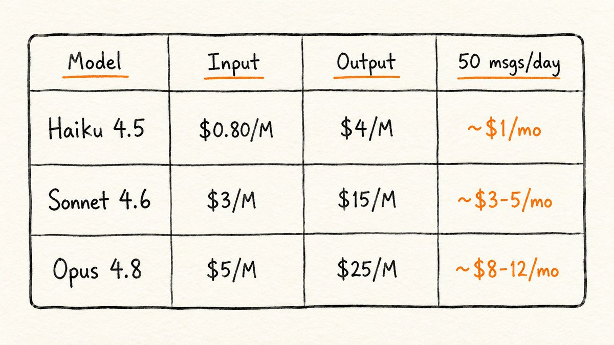
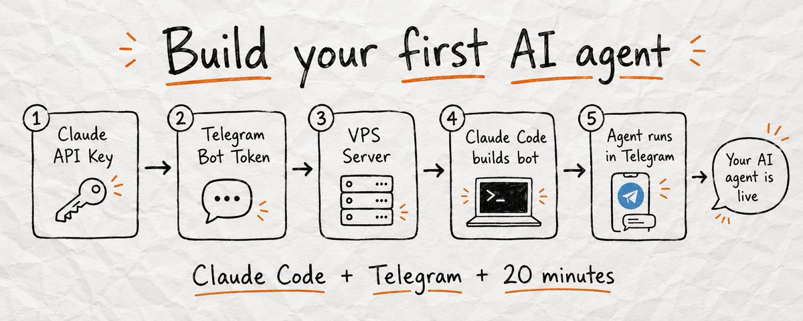
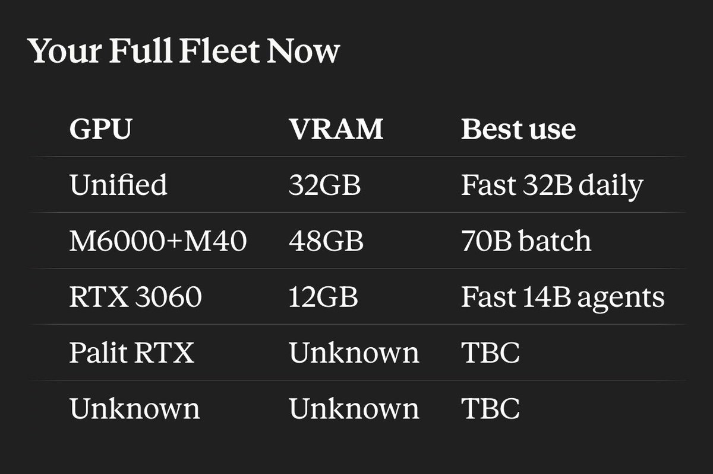
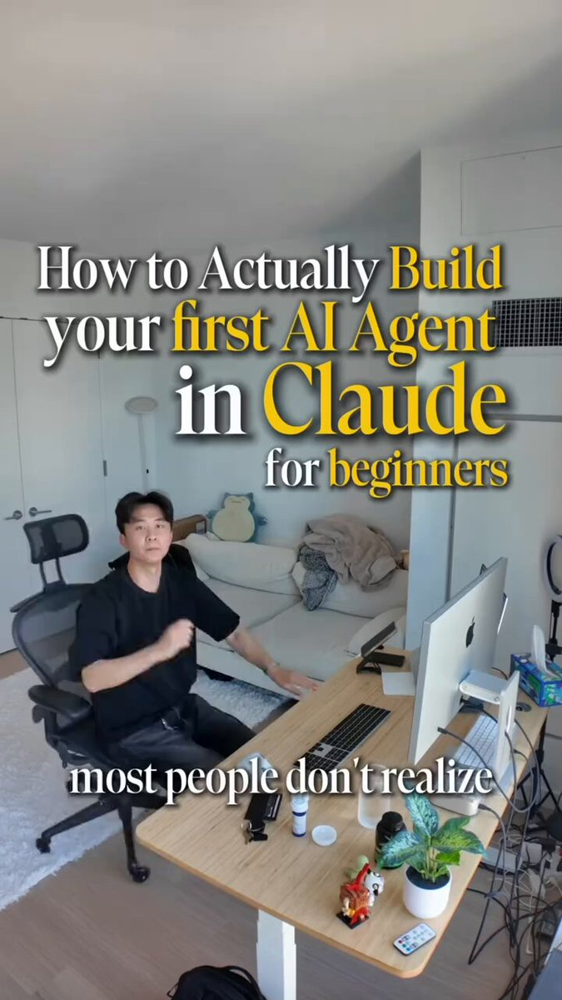

# 📰 AI Agents. What they are and how to Build Your Own Step by Step.

Everyone is talking about AI agents. But if you ask most people what an agent actually is, you get a vague answer about "AI that does things autonomously."

The real picture is more useful than that. Agents are not a category. They are a spectrum.

This guide explains where on that spectrum different AI tools sit, what separates a basic LLM interaction from a true agentic workflow, and how to build your own agent with Claude Code and connect it to Telegram, without writing code yourself.

---

Before we get into it, follow me on X and join my Telegram channel I just created where I post more AI content every day. Both are free.

X - https://x.com/AnatoliKopadze

Telegram - https://t.me/kopadzemp

---

## What Makes Something an Agent

Asking Claude "what should I post today?" is not an agent. That is a chat.

Telling Claude "find the three topics trending in AI right now, pick the one with the most engagement potential, draft a post in my style, and save it to a file" and having it do all of that without you touching anything, that is an agent.

The difference is not the model. It is the structure around it.

An agent has three things a regular chat does not. Tools it can call on its own: search, file systems, code execution, external APIs. Memory that persists across tasks, not just within one session. And a loop that keeps running until the task is finished, not until it generates one response.

The more of those three things you add, the less you are involved. That is the idea.

---

## The Spectrum: From Chat to Agent

At one end you have a basic chat. You ask, Claude answers, the session ends. No tools, no ongoing goal, no ability to act in the world.  

One step up: Claude with tools enabled. When Claude searches the web before answering, reads an attached file, or generates an image, it is already slightly agentic. You did not tell it to do those things step by step, it decided on its own that it needed to.  

Further up: multi-step workflows. You give a goal, Claude breaks it into steps, executes each one, checks the result, and delivers a finished output. You are not involved between steps.  

At the top: fully autonomous agents. The agent runs on a schedule, monitors inputs, calls external services, and completes complex tasks without a human in the loop. You set the goal once and check the output.  

The difference between the bottom and the top is not a different model. It is what surrounds the model, tools it can call, memory that carries context, and a loop that keeps running until the task is done.

---

## Types of Agents You Can Build Today

To give you a sense of what agents can actually look like today, I put together a few examples below. These are not limits you can build whatever fits your specific situation.

Research agent: gathers information on a topic, reads multiple sources, pulls out what matters, and delivers a structured summary. You give it a question. It gives you an answer that would have taken hours to compile manually.

Writing agent: writes content according to a system you define. Give it your tone, format, audience, and topic. It handles drafts, rewrites, and edits without you managing every sentence.

Code agent: writes code, runs it, reads the errors, fixes them, and keeps going. You describe what the code should do. The agent handles the implementation and debugging loop.

Business agent: Handles repetitive business tasks: drafting emails, processing customer requests, qualifying leads, generating reports. Runs on autopilot once you define the rules.

Personal agent: Manages your schedule, organizes tasks, prepares briefings, and handles the planning work you do manually every day.

---

## Building Your First Agent - Start Here

You will use Claude Code to build a Telegram bot that runs on a remote server and uses Claude as its brain. Claude Code writes all the code for you, you just describe what you want in plain English. Once it is set up, all communication with the bot happens directly through Telegram.

The whole setup takes about 10-20 minutes. You do not need to know how to code.

---

## System Prompt Templates - Paste Into Prompt 2

When you run Prompt 2 from the setup below, you need to describe what kind of agent you want. These are ready-made templates, copy the one that fits, paste it into Prompt 2 where it says "The agent should be:", and Claude Code will build that specific agent. Adjust any details to match your situation.

---

Research Agent

\`\`\`
You are a research agent. Your job is to gather, analyze, and synthesize information on any topic I give you.

When given a research task:
1\. Identify the 3-5 most important sub-questions to answer
2\. Search for information on each one
3\. Evaluate the quality and relevance of each source
4\. Extract only what directly answers the question
5\. Deliver a structured summary with: key findings, supporting evidence, and gaps you could not fill

Format: Use headers, bullet points, and clear sections.
If you are uncertain about something, say so explicitly.
Do not add filler. Every sentence should contain information.
\`\`\`

---

Writing Agent

\`\`\`
You are a writing agent. You write content in my voice and style.

My style:
\- Conversational, direct, no corporate language
\- Short sentences and paragraphs
\- Specific numbers and examples over vague claims
\- Always end with something the reader should do or think about

When given a writing task:
1\. Ask for the topic, audience, and desired length if not provided
2\. Write a first draft
3\. Review it against my style rules
4\. Deliver the final version ready to publish

Never add unnecessary introductions. Start with the most important point.
\`\`\`

---

Code Agent

\`\`\`
You are a code agent. Your job is to write, debug, and improve code.

When given a coding task:
1\. Confirm your understanding of what the code should do
2\. Write the solution with clear comments
3\. Identify any edge cases or potential failures
4\. If there are errors, debug them systematically before asking for help

Rules:
\- Write clean, readable code with meaningful variable names
\- Always include error handling
\- Explain what each major section does in plain language
\- If you are unsure about requirements, ask one clarifying question before proceeding
\`\`\`

---

Business Email Agent

\`\`\`
You are a business email agent. You write professional emails on my behalf.

My communication style:
\- Direct and respectful
\- No unnecessary formalities
\- Gets to the point in the first sentence
\- Closes with a clear next step

When given an email task:
1\. Identify the goal of the email (inform, request, follow up, confirm)
2\. Write a subject line that reflects the email's purpose
3\. Draft the email in 3-5 short paragraphs maximum
4\. End with one clear action item or next step

Always write ready-to-send emails, not templates with blanks to fill in.
\`\`\`

---

Personal Planning Agent

\`\`\`
You are my personal planning agent. You help me organize my work, prioritize tasks, and plan my week.

When I share my tasks or goals:
1\. Identify what is urgent vs. important
2\. Suggest a realistic sequence based on dependencies
3\. Estimate time required for each task
4\. Flag anything that could be delegated or eliminated

When I describe a project:
\- Break it into concrete next actions
\- Identify the single most important thing to do first
\- Create a simple checklist I can follow

Keep everything practical. No motivational filler. Just the plan.
\`\`\`

---

## What you need before starting

1 - a Claude API key from console.anthropic.com. This is a developer key, you pay per usage, not a fixed monthly fee. For a personal bot sending 50 messages a day, the cost is $1-5 per month depending on which model you choose. 

2- a Telegram bot token from BotFather. 

3 - a VPS running Linux. For a personal Telegram bot you do not need anything powerful - 1 CPU, 1GB RAM, and 20GB of storage is more than enough. Any basic plan from DigitalOcean, Hetzner, or Vultr will work, and costs around $4 to $6 per month. Once you have the server, install Claude Code by running npm i -g @anthropic-ai/claude-code in your terminal.

---

Which Claude model to use for your bot and what it actually costs:

For most personal bots Sonnet 4.6 is the right choice, strong enough for any task and affordable for daily use. Use Haiku 4.5 if you want to minimize cost. Opus 4.8 only makes sense for a complex analytical agent where answer quality is critical.

---

## Building Your First Agent - Step 1 

Open your VPS terminal and launch Claude Code. Paste this prompt and let it build everything.

Give the agent a personality

\`\`\`
Build me a Telegram bot that uses the Claude API as its brain.

Requirements:
\- Language: Python
\- Library for Telegram: python-telegram-bot
\- Claude model: claude-sonnet-4-6
\- The bot receives a message, sends it to Claude API, and returns Claude's response to Telegram
\- Maintain conversation history per user — each user has their own context within the session
\- Add a /start command that introduces the bot
\- Add a /clear command that resets conversation history for that user

Create all necessary files: main bot file, requirements.txt, and a .env file template for API keys.
Do not hardcode any API keys — read them from environment variables.
\`\`\`

---

Deploy as a background service

\`\`\`
Create a systemd service file so this bot runs automatically on my Linux VPS and restarts if it crashes.

The service should:
\- Start automatically when the server boots
\- Restart automatically if it crashes
\- Load environment variables from the .env file in the project folder
\- Save logs to a file I can check later

Also write me the exact terminal commands to install the service, start it, check if it is running, and view the logs.
\`\`\`

---

Add persistent memory between sessions

\`\`\`
The bot loses conversation history when it restarts. Fix this.

Save each user's conversation history to a JSON file on disk after every message. Load it back automatically when the bot starts.

Add a maximum history length — keep only the last 20 messages per user so the context window never gets too long.
\`\`\`

---

## Adding Skills to Your Claude Code Bot

Skills are capabilities you add to your bot over time. Each one is a new prompt you give Claude Code, and it writes the code to make it work. Here are the most useful ones.

---

Skill: Web search
Your agent can look up real-time information instead of answering from memory only.

\`\`\`
Add web search capability to the bot using the Tavily API.

When the user asks something that requires current information — news, prices, recent events — the bot automatically searches the web and includes the results in its response.

The bot should decide on its own when to search and when to answer from memory. Add TAVILY\_API\_KEY to the .env file template.

Use Claude's tool use feature to implement this cleanly.

\`\`\`

---

Skill: Save notes
Your agent can save anything you tell it to a file - ideas, tasks, research findings and retrieve them later.

\`\`\`
Add a note-saving feature to the bot.

When the user says "save this", "remember this", or "note:", the bot saves the content to a notes.txt file with a timestamp.

Add a /notes command that returns the last 10 saved notes.
Add a /clearnotes command that deletes all saved notes.
\`\`\`

---

Skill: Restrict to your account only
By default anyone who finds your bot can use it and consume your API credits. This locks it to just you.

\`\`\`
Add user restriction to the bot so only I can use it.

Add my Telegram user ID to the .env file as ALLOWED\_USER\_ID.
If anyone else messages the bot, it responds with "This bot is private." and ignores all further messages from that user.

Also add how I can find my own Telegram user ID — either through the bot itself or another method.
\`\`\`

---

Skill: Track API costs
Claude API charges per token. This adds a simple cost tracker so you always know what you are spending.

\`\`\`
Add basic cost tracking to the bot.

After each Claude API response, log the number of input tokens and output tokens used.
Keep a running total in a costs.json file.

Add a /costs command that shows: total tokens used today, total tokens used all time, and an estimated cost in USD based on claude-sonnet-4-6 pricing.
\`\`\`

---

Skill: Scheduled daily briefing
The agent sends you a message every morning without you having to ask.

\`\`\`
Add a scheduled daily briefing to the bot.

Every day at 8:00am, the bot sends me a message with:
1\. A motivational one-liner (short, not cheesy)
2\. A reminder to check my top priority for the day
3\. One random useful fact about productivity or AI

Send it to my Telegram user ID from the .env file.
Use the schedule or APScheduler library to implement this.
\`\`\`

---

## Useful Things to Know After Setup

How to update your agent's personality. Open the main bot file, find the system prompt variable at the top, change it, save the file, and restart the service with sudo systemctl restart your-bot-name. The new personality is live immediately.

How to check if the bot is running. Run sudo systemctl status your-bot-name in your terminal. If it says "active (running)" it is working. If it says "failed" check the logs.

How to read logs. Run journalctl -u your-bot-name -n 50 to see the last 50 lines. This is where you find error messages if something breaks.

How to add a new skill. Open Claude Code in your project folder and describe what you want: "Add X feature to the bot." Claude Code reads your existing code, adds the new feature cleanly, and tells you if a restart is needed.

---

## The Memory Problem Every Agent Has

This is the most common problem people run into. The agent loses context between sessions, across long tasks, after too many messages and starts making mistakes or repeating work it already did.

---

There are three ways this happens: 

Long tasks eventually exceed Claude's context limit, and the agent starts losing the beginning of the conversation: the original goal, decisions already made, constraints you set.

When you close a session and open a new one, the agent starts from zero. - 

If the agent is interrupted mid-task, it has no way to know where it stopped.

---

Four things can fix this:

Tell the agent to write a progress note after every major step: what was done, what was decided, what still needs to happen. Paste that note at the start of the next session to restore full context.

Every ten to fifteen messages, ask the agent to summarize where it is. This forces it to compress context before it overflows.

Before the conversation gets too long, ask the agent to compress everything into a short summary and continue from there. The thread stays intact.

Add the key facts your agent always needs directly to the system prompt in your bot code. Claude reads this at the start of every conversation, so that information is always in context no matter how long things get.

---

Checkpoint Prompt

\`\`\`
Before we continue, write a brief checkpoint:
1\. What have you completed so far?
2\. What are the key decisions or findings from this session?
3\. What still needs to be done?
4\. What context would you need to continue this task in a new session?

Keep it under 200 words.
\`\`\`

---

Memory File Prompt

\`\`\`
After completing each major step, write a memory note in this format:

STEP COMPLETED: \[what was done\]
KEY DECISIONS: \[choices made and why\]
CURRENT STATE: \[where the task stands now\]
NEXT STEP: \[what should happen next\]

This note will be used to resume the task in a new session without losing context.
\`\`\`

---

Context Recovery Prompt

\`\`\`
We are resuming a task from a previous session. Here is the context:

\[paste your memory note here\]

Based on this:
1\. Confirm your understanding of where we are
2\. Identify the next step
3\. Ask any questions needed to continue

Do not repeat work that has already been completed.
\`\`\`

---

Rolling Summary Prompt

\`\`\`
The conversation is getting long. Compress everything important into a summary:

1\. Original goal
2\. What has been done and what was found
3\. Key decisions made
4\. What still needs to happen

After writing the summary, continue from there. Treat this summary as the new starting point.
\`\`\`

---

You now know what agents are, what they can do, and how to build one yourself. I hope this was useful.

If you want to stay up to date with everything happening in AI, follow me on X and Telegram.

X - https://x.com/AnatoliKopadze
Telegram - https://t.me/kopadzemp

### 🖼️ Attached Media

## 💬 Replies

### 1 @leopardracer (leopardracer)

*Mon Jun 08 14:14:10 +0000 2026*

@AnatoliKopadze bookmarked, nice share!

### 2 @AnatoliKopadze (Anatoli Kopadze) (Author)

*Mon Jun 08 14:21:39 +0000 2026*

@leopardracer Appreciated!

### 3 @cryppinfluence (Ian Crypp)

*Mon Jun 08 15:18:48 +0000 2026*

@AnatoliKopadze is it inside Claude or wrapped like Hermes?

### 4 @AnatoliKopadze (Anatoli Kopadze) (Author)

*Mon Jun 08 15:21:23 +0000 2026*

@cryppinfluence Inside the claude

### 5 @umozon00 (umozon)

*Mon Jun 08 14:27:23 +0000 2026*

@AnatoliKopadze nice article, thx for you work

### 6 @AnatoliKopadze (Anatoli Kopadze) (Author)

*Mon Jun 08 14:31:09 +0000 2026*

@umozon00 Happy to hear it, thank you!

### 7 @MaheshrameshS (maheshramesh sawant)

*Tue Jun 30 09:42:41 +0000 2026*

@AnatoliKopadze Book marked and started following you. Nice article.

### 8 @AnatoliKopadze (Anatoli Kopadze) (Author)

*Tue Jun 30 10:43:23 +0000 2026*

@MaheshrameshS Appreciated!

### 9 @CodeByNZ (NZ ☄️)

*Mon Jun 15 12:56:14 +0000 2026*

@AnatoliKopadze Saving this. I’ll come back to it.

### 10 @Nikitont (Nikiton)

*Mon Jun 08 14:31:06 +0000 2026*

@AnatoliKopadze After that, no one should have any excuses.

### 11 @alphabatcher (Alpha Batcher)

*Tue Jun 09 09:35:17 +0000 2026*

@AnatoliKopadze i'm already have my first AI agent

but need ti refresh my knowledges

### 12 @gerardsans (Gerard Sans | Axiom 🇬🇧)

*Mon Jul 13 18:34:01 +0000 2026*

@AnatoliKopadze money back?

### 13 @gerardsans (Gerard Sans | Axiom 🇬🇧)

*Thu Jul 02 14:13:33 +0000 2026*

@AnatoliKopadze [x.com/gerardsans/sta…](https://x.com/gerardsans/status/2072680394424451394)

### 14 @Mahaximus_ (Mahax)

*Mon Jun 08 14:09:30 +0000 2026*

@AnatoliKopadze as always the best, gonna use it in my building, thanks!

### 15 @ZenHuifer (ZenHuifer)

*Wed Jun 10 07:37:11 +0000 2026*

@AnatoliKopadze My open-source project aligns perfectly with this, and I used this model to develop my new project

[github.com/huifer/zeus](https://github.com/huifer/zeus)

### 16 @CopperForgeAI (铜匠AI・十点睡觉)

*Wed Jun 10 02:45:55 +0000 2026*

@AnatoliKopadze 我以为这个文章会很屌;
其实我很失望;
不过确实非常基础;
适合0基础的人

### 17 @cryptojoshainas (Joshainas)

*Thu Jul 02 06:45:21 +0000 2026*

@AnatoliKopadze @readwise save

### 18 @crypto_gemo (Gemo | Crypto & Analyst 📊)

*Wed Jul 01 07:31:17 +0000 2026*

@AnatoliKopadze Thanks 👍

### 19 @cristof_s (Chris)

*Wed Jul 01 08:43:19 +0000 2026*

@AnatoliKopadze @threadreaderapp unroll

### 20 @pabloooluv (pablo)

*Thu Jul 02 10:54:54 +0000 2026*

@AnatoliKopadze hey man i've just built a 9 agent system and rebuilt it again to 1.. have some questions regarding context, history etc. can i ask in dms? 

wondering why building agents instead of building layers for claude code cause claude code has no history issues i guess

### 21 @andriibidochko (Andrii Bidochko 🦉)

*Tue Jul 14 10:26:14 +0000 2026*

@AnatoliKopadze Very good tutorial, saved it for later read 👍

### 22 @MeanMF007 (MeanMF)

*Fri Jul 10 20:33:56 +0000 2026*

@AnatoliKopadze Build an agent and put him to work at @a\_g\_e\_n\_c marketplace 

### 23 @TheronCons (Unite)

*Tue Jun 30 20:01:48 +0000 2026*

@AnatoliKopadze Hope to learn more 

### 24 @thakur_colin (Colin Thakur)

*Sat Jul 11 13:12:44 +0000 2026*

@AnatoliKopadze The most useful post on #Agents I read!!

### 25 @LosKruptos (Crypto Brothers)

*Wed Jul 01 15:51:22 +0000 2026*

@AnatoliKopadze Nice work!

### 26 @successstepss (Success-Steps)

*Sat Jun 13 16:01:17 +0000 2026*

@AnatoliKopadze [x.com/successstepss/…](https://x.com/successstepss/status/2065823287431614922)

### 27 @thefreeyash (Yash)

*Thu Jul 02 05:42:51 +0000 2026*

@AnatoliKopadze One heck of a goldmine. Read through 3/4th of it. Can’t wait to play with this, sir 👏

### 28 @arftsuperitlg (Mark)

*Wed Jul 01 08:11:11 +0000 2026*

@AnatoliKopadze where do we save the skill.md? do you mean copy and paste those skill you mentioned into skill.md and save it? please be clear!!

### 29 @Caarat1 (Carat)

*Tue Jul 14 07:58:20 +0000 2026*

@AnatoliKopadze The structure angle reframes everything. Does context window size actually limit how complex an agent can be?

### 30 @makusaxd (NodeNews)

*Mon Jul 06 18:10:56 +0000 2026*

@AnatoliKopadze AI agents aren't a model upgrade. They're an architecture upgrade. Tools + Memory + Loop = the whole game 🔥🤖
Follow me : kp

### 31 @lockedinc100 (Lucky)

*Wed Jun 17 16:16:00 +0000 2026*

@AnatoliKopadze Agent

### 32 @sergitomoreyra (sergio moreyra)

*Wed Jun 10 00:48:51 +0000 2026*

@AnatoliKopadze @madmontiel

### 33 @karlalobato (Karla Lobato)

*Sat Jun 13 22:11:38 +0000 2026*

@AnatoliKopadze Obrigado

### 34 @MikkyPredict (Mikky)

*Mon Jun 08 21:04:35 +0000 2026*

@AnatoliKopadze I did the right thing by taking a few days off, there are so many great articles about agents that are worth checking out!

### 35 @AiSparks12 (AI Sparks)

*Mon Jun 08 19:07:54 +0000 2026*

@AnatoliKopadze Well articulated, appreciate the share

### 36 @_0xVerm (Vermis🔳)

*Mon Jun 08 16:23:57 +0000 2026*

@AnatoliKopadze Love this, as for the memory, I recently came across Atomic Memory. It's open-source, self-hosted, and lets you inspect and correct what your AI believes. A refreshing alternative to the usual black-box approach. [github.com/atomicstrata/a…](https://github.com/atomicstrata/atomicmemory)

