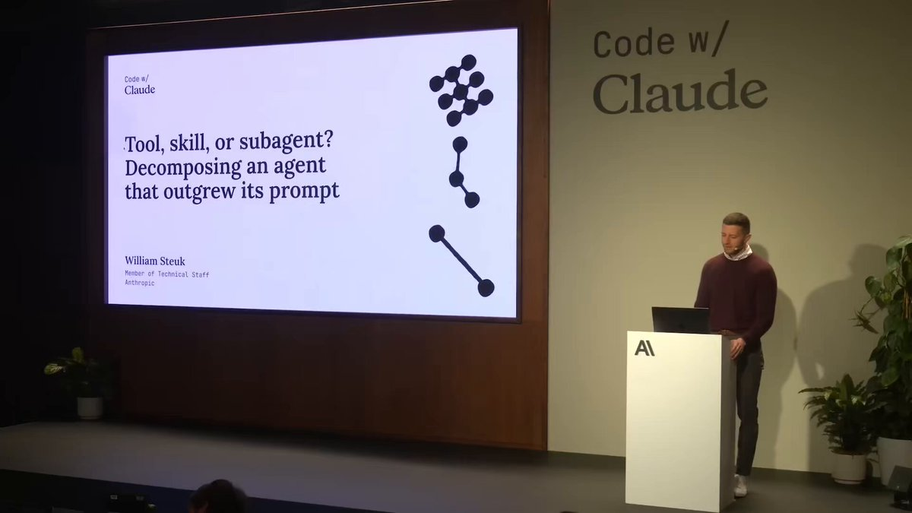

Anthropic engineer:

"You can build 5 assistants in one afternoon. Each one handles a task you've been doing manually every single day."

In 45 minutes he shows exactly how to do it from scratch, step by step.

Most people are still doing all of this by hand.

Watch the session, then save the guide below.

### 🖼️ Attached Media

## 💬 Replies

### 1 @techyoutbe (Tech Fusionist | Kushal Gangil)

*Tue Jun 30 19:02:40 +0000 2026*

@AnatoliKopadze That's what is the need of hour...thanks for sharing! Bookmarked to go through later

### 2 @cyrilXBT (CyrilXBT)

*Tue Jun 30 17:21:11 +0000 2026*

@AnatoliKopadze Alpha

### 3 @sean_a_mcclure (Sean McClure)

*Wed Jul 01 04:17:32 +0000 2026*

@AnatoliKopadze At what point does the title “engineer” no longer make sense?

### 4 @Blum_OG (Blum)

*Wed Jul 01 05:09:06 +0000 2026*

@AnatoliKopadze automation takes more time upfront, but saves way more time in the long run

### 5 @kepochnik (kepo)

*Tue Jun 30 18:15:50 +0000 2026*

@AnatoliKopadze Anthropic engineers always said only great and smart things

### 6 @rewind02 (rewind)

*Tue Jun 30 18:20:44 +0000 2026*

@AnatoliKopadze manual tasks are getting cooked

### 7 @kar4arodon (karcharodon)

*Wed Jul 01 10:08:51 +0000 2026*

@AnatoliKopadze Thats the solid guide to learn

### 8 @alphabatcher (Alpha Batcher)

*Wed Jul 01 08:11:44 +0000 2026*

@AnatoliKopadze listening Anthropic engineers is good feeling

### 9 @HarryTandy (Harry Tandy)

*Wed Jul 01 08:22:55 +0000 2026*

@AnatoliKopadze need to test this out before the weekend

### 10 @2xnmore (2xnmore)

*Wed Jul 01 07:53:02 +0000 2026*

@AnatoliKopadze This is the edge you need.

### 11 @laki_0x (laki)

*Wed Jul 01 22:06:30 +0000 2026*

@AnatoliKopadze 45 minutes to save hours every week sounds like a great trade

### 12 @0xSlyth (0xSlyth)

*Wed Jul 01 05:17:35 +0000 2026*

@AnatoliKopadze magic

### 13 @AI_303030 (Gaurav)

*Tue Jun 30 19:15:12 +0000 2026*

@AnatoliKopadze @grok Can you find the original source of these videos? Does Anthropic have a channel or page where they post all of them? I’d like to see everything in one place. Also, why aren’t these available on Anthropic’s official YouTube channel?

### 14 @FungibleUnicorn (Kenji)

*Wed Jul 01 01:06:11 +0000 2026*

@AnatoliKopadze Every post like this is utter fucking bullshit trash.

### 15 @mayimedham (Mayi)

*Wed Jul 01 10:27:59 +0000 2026*

@AnatoliKopadze Why does everything need to be an agent? What will humans do with all the 'saving'? Outsourcing simple things to AI and burning the planet for some shit that can be done by a human brain

### 16 @emmjay0907 (Magnus Jonsson)

*Wed Jul 01 03:54:18 +0000 2026*

@AnatoliKopadze Been trying for weeks to build someone to fix my rooftiles, no luck yet!

### 17 @LorenCharnley (Loren Charnley)

*Wed Jul 01 01:31:20 +0000 2026*

@AnatoliKopadze Link to YouTube original source:

[youtube.com/watch?v=mWvtOH…](https://www.youtube.com/watch?v=mWvtOHlZM-I)

### 18 @maxkruger (Max Kruger)

*Tue Jun 30 20:46:18 +0000 2026*

@AnatoliKopadze And then use [agentping.io](http://agentping.io) to keep an eye on the agents you’ve built

### 19 @BreathAndBeta (BreathAndBeta)

*Thu Jul 02 07:26:49 +0000 2026*

@AnatoliKopadze So Anthropic should have only one or two working days and no one should be coming to the office. But in reality they are hiring more engineers every day.

### 20 @JulienCePain (Julien ce Pain)

*Tue Jun 30 21:55:53 +0000 2026*

@AnatoliKopadze Works for stupid tasks not tasks needing judgment

### 21 @vitobotta (Vito Botta)

*Tue Jun 30 20:29:11 +0000 2026*

@AnatoliKopadze Easy to say for someone at Anthropic. The rest of us are still wiring API keys into YAML files.

### 22 @Spoony47 (Chazbags)

*Wed Jul 01 03:40:35 +0000 2026*

@AnatoliKopadze Wow...god forbid we do stuff ourselves 

### 23 @mrgadgetstudio (mrgadget)

*Wed Jul 01 02:10:18 +0000 2026*

@AnatoliKopadze The issue is cost, not the technical stuff! You’ve ever used Anthropic models?

### 24 @Damir_Akaza (Damir Akaza)

*Tue Jun 30 17:19:03 +0000 2026*

@AnatoliKopadze I need an assistant to build an assistant lol

### 25 @Primee32 (Primee32)

*Tue Jun 30 17:38:42 +0000 2026*

@AnatoliKopadze five assistants in one afternoon sounds like a flex until you realize it's just five tasks you've been doing manually for years

### 26 @spaces_inside (🎶)

*Wed Jul 01 02:20:54 +0000 2026*

@AnatoliKopadze 🙏

### 27 @bangles65 (Sandeep)

*Wed Jul 01 07:07:37 +0000 2026*

@AnatoliKopadze But Anthropic is designed to bankrupt you

### 28 @tv_remote (tv remote)

*Wed Jul 01 02:17:00 +0000 2026*

@AnatoliKopadze i find it crazy how easy this is and people need a step by step to build agents via routines. it’s not even coding

### 29 @Brnx_3000 (Branx)

*Wed Jul 01 03:40:09 +0000 2026*

@AnatoliKopadze Im waiting for a dish washing connector

### 30 @DarrylKechnie (Darryl Kechnie)

*Wed Jul 01 02:58:41 +0000 2026*

@AnatoliKopadze How does this work if you work a large company with thousands of employees and security and governance protocols? I’m always seeing these kinds of videos, but it seems to me they only work in startups and small turnkey operations.

### 31 @sarimarton (Marton Sari)

*Mon Sep 07 01:07:09 +0000 2026*

@AnatoliKopadze tldr someone pls?

### 32 @PusalkarSamarth (Samarth Pusalkar)

*Thu Jul 02 14:44:22 +0000 2026*

@AnatoliKopadze Can I just wait till I can use AI to prompt these agents into existence, I just feel too lazy..

### 33 @lfrodriguesit (Luís Rodrigues)

*Sun Jul 05 14:03:20 +0000 2026*

@AnatoliKopadze The biggest win is automating the small tasks you repeat every day. Those time savings add up faster than people expect.

### 34 @lfrodriguesit (Luís Rodrigues)

*Wed Jul 01 10:15:22 +0000 2026*

@AnatoliKopadze I think many people overcomplicate automation when one simple assistant would solve most of their workflow.

### 35 @FuzzyIntel (Fuzzy Intelligence 🧠)

*Wed Jul 01 11:20:20 +0000 2026*

@AnatoliKopadze [youtube.com/watch?v=mWvtOH…](https://www.youtube.com/watch?v=mWvtOHlZM-I)

### 36 @ZappaDappaDu (Rolling Stone)

*Thu Jul 02 05:16:37 +0000 2026*

@AnatoliKopadze But can Anthropic staff real sales people instead of putting Fin their sales bot in a fucking loop?

