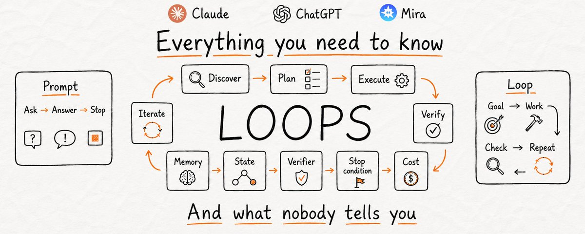

# 📰 Loops explained: Claude, GPT, Mira and what actually works

---

AI has been in everyone's hands for years. Most people who use it every day still use it the slowest way there is: type a request, wait, fix it, ask again, all by hand.

Not because the faster way is complicated, because nobody showed them what it looks like.

The faster way is a loop, and right now it is the one thing the best AI engineers in the world care about. This article fixes the part nobody explained. 

By the end you will understand loops better than almost anyone on your timeline: what they are, how they actually work under the hood, when they are worth it and when they are a trap, how to build a basic one yourself in Claude or ChatGPT, the simple ones worth running in your own life.

---

Before we get into it, follow me on X and join my Telegram channel I just created where I post more AI content every day. Both are free.

X - [https://x.com/AnatoliKopadze](https://x.com/AnatoliKopadze)

Telegram - [https://t.me/kopadzemp](https://t.me/kopadzemp)

---

## How most people use AI?

Look closely at the one-request-at-a-time habit, because it is the whole problem. Every step runs through you. You decide what to ask, you judge the answer, you decide what comes next. The AI never moves unless you push it, and the moment you stop, it stops.

This is fine, but it has a ceiling. You are the engine. The AI is only the tool in your hand, and a tool does nothing on its own.

There is another way to work, and it is the reason the best engineers in the world are changing how they build. Instead of walking the AI through every step, you give it the goal once and let it run the steps itself. It plans, does the work, checks its own result, fixes what is weak, and repeats until the goal is met. You step out. The work keeps going.

---

[Embedded Tweet: https://x.com/i/status/2063697162748260627]

---

---

Two of the most respected engineers, saying the same thing in different words. Most people read lines like these and quietly had no idea what they meant in practice. So let's break it down properly.

---

## What a loop is?

A prompt is a single instruction. A loop is a goal the AI keeps working toward until it gets there. Think of it as a recursive goal: you define a purpose, and the AI iterates until it is complete.

A prompt gives you one answer and then waits for you to decide what is next. A loop runs the full cycle on its own:

\`\`\`
DISCOVER  →  work out what needs doing
PLAN      →  decide how to do it
EXECUTE   →  do the work
VERIFY    →  check it against the goal
ITERATE   →  not there yet? feed the result back in and repeat
\`\`\`

Three of these five do all the real work, and they are where people get loops wrong.

---

Verify is the heart of the loop. Without a real check on the result, you do not have a loop, you have the agent agreeing with itself on repeat. The check is what turns repetition into progress. It can be a hard test ("does the code pass"), a measurable condition ("is the number above X"), or a rubric the model scores against. No gate means the agent grades its own homework, and the model that did the work is far too generous a grader.

State is what makes the loop learn. Each pass, the AI has to remember what it already tried, or it repeats the same mistake forever. A real loop keeps a small record on the side: what is done, what failed, what is next. Tomorrow's run resumes instead of starting from zero. This is also exactly where it starts getting expensive, which we will get to.

A stop condition is what keeps it sane. A loop with no exit runs until it succeeds, breaks, or drains your account. Every serious loop has two ways to stop: success, and a hard limit ("after 8 tries, stop and report"). Skip this and you have built a machine that can run all night for nothing.

A prompt hands the AI an instruction. A loop hands the AI a job, a way to know when the job is done, and a rule for when to give up.

---

## Do you even need one?

Most articles sell you the loop before they tell you when it is a mistake. Here is the test the serious people actually use. A loop is worth building only when all four of these are true:

- The task repeats, at least weekly. Less than that and the setup cost never pays itself back. A one-off is still better served by one good prompt.

- Something can automatically reject bad output. A test, a type check, a build, a linter, a hard rule. If nothing can fail the work for you, the loop just spins.

- The agent can actually do the work itself, end to end, not hand half of it back to you.

- "Done" is objective, not a judgment call. If quality is a matter of taste, a human still wins.

Miss one box, keep it as a manual prompt. The honest version of this whole topic: loop engineering is real, and most people do not need the heavy version yet. What everyone can use is the light version, which we will get to. But you should know where the line is.

---

## The version built for code

Loops took off in software first, because code is the easiest thing in the world to verify. A test passes or it fails. There is no arguing with it, so the AI always knows whether it is finished.

A coding loop is given a goal and a strict way to check it:

\`\`\`
▸ LOOP SPEC
GOAL: every test in /tests/auth passes, lint is clean, no type errors.

EACH ITERATION:
  1\. run the test suite and read every failure
  2\. pick the single highest-impact failure
  3\. write the smallest change that fixes it
  4\. re-run the tests, lint, and type checker

VERIFY: green tests + zero lint warnings + zero type errors
STOP WHEN: verify passes, OR 8 iterations reached
ON STOP: summarize what changed and what still fails
\`\`\`

Under the hood, a real loop is assembled from five building blocks. Claude Code and Codex now ship all five.

---

1\. The automation (the heartbeat)

This is the trigger that makes it a loop and not a one-off you ran once. You define a prompt, a cadence, and a goal, and it runs on schedule without you starting it. In Claude Code, /loop re-runs a prompt on an interval, /goal keeps a session going until a condition you wrote is actually true, hooks fire commands at points in the agent's lifecycle, and pushing it to a cron job or GitHub Actions keeps it running after you close the laptop. Findings come to you. You are not the one going around checking.

---

2\. The skill (reusable instructions)

Instead of pasting a wall of instructions into every run, you save them once as a file the loop reads every time: the rules, the patterns to follow, and a hard list of what it must never touch. Now the automation just calls the skill by name, and the recurring job stays maintainable instead of rotting inside a schedule nobody updates.

---

3\. Sub-agents (keep the maker away from the checker)

The single most useful structural trick in a loop is splitting the agent that does the work from the agent that checks it. The model that wrote the code is too nice grading its own homework. A second agent, with different instructions and sometimes a stronger model on higher effort, catches the things the first one talked itself into. Your writer can be fast and cheap, your reviewer slow and strict. That separation is most of the quality.

---

4\. Connectors (so it acts, not suggests)

This is the difference between an agent that says "here is the fix" and a loop that opens the pull request, links the ticket, and pings the channel once the build is green, by itself. Connectors are what let the loop act inside your real environment instead of just describing what it would do if it could.

---

5\. The verifier (the gate)

The test, type check, or build that automatically rejects bad work. This is the one block that decides whether the loop helps you or just spends your money. Everything else is plumbing. This is the part that makes it real.

Stack those together and you get what big teams now run at scale: fleets of agents looping on the same job, dozens or thousands at once. One engineer used a loop like this to rewrite an entire codebase from one programming language to another in about six days, work that would have taken close to a year by hand. It is a genuine change in how serious software gets built. And it comes with a catch the demos never show.

---

## The cost nobody mentions

Loops run on tokens, and tokens are money. The problem is not that each step costs something. The problem is how the cost compounds.

Every time the loop goes around, the agent re-reads its context: the goal, the code, the last result, what failed. That whole pile is sent through the model again on every iteration, and it grows each pass. A loop that runs ten times does not cost ten prompts. It costs ten prompts that each keep getting bigger. The maker-and-checker trick that lifts quality also doubles the bill, because now two models read the work instead of one.

---

\`\`\`
▸ ROUGH COST OF ONE LOOP
single agent, one medium task:      \~50,000 – 200,000 tokens
context re-sent every iteration:    grows each pass
a fleet of agents in parallel:      multiply all of the above
\`\`\`

---

The metric that actually matters, and almost nobody tracks, is cost per accepted change. Not tokens spent or loops run. If the loop gives you ten results and you toss six, you are doing the review work it was meant to save. Below a 50% accept rate, it costs more than it gives back.

Loops also fail quietly. Engineer Geoffrey Huntley calls it the "Ralph Wiggum loop": the agent decides it is done too early, exits on a half-finished job, and the loop keeps running and spending while producing nothing. Without a hard gate that can fail the work, loops do not crash, they bill you in silence.

That is why the heavy version belongs to teams with the budget and guardrails to run it: iteration caps, token budgets, cheap models on the boring steps, monitoring. If that is not you, you are not missing out, the core idea works at a fraction of the cost and none of the setup.

---

## The order that actually works

If you do build one, the order matters more than the tools. The people who ship loops that survive in production all do it the same way:

\`\`\`
1\. Get ONE manual run reliable first.
2\. Turn that into a skill (save the instructions).
3\. Wrap the skill in a loop (add the gate + stop condition).
4\. THEN put it on a schedule.
\`\`\`

Skipping ahead, scheduling something you have not made reliable by hand, is exactly how loops blow up while you sleep. Prove it once, harden it, then automate it.

---

## Build a basic loop yourself (any LLM)

You do not need a coding agent to feel how this works. You can run a simple loop by hand inside any LLM right now, with nothing but a prompt. The trick is to give the model all three loop parts at once: a goal, strict success criteria, and a protocol that forces it to check itself before it is allowed to stop.

\`\`\`
▸ SELF-CHECKING LOOP  (paste into Claude or ChatGPT)
You will work in a loop until the task meets the bar.

TASK:
\[describe exactly what you want produced\]

SUCCESS CRITERIA (be strict, no soft passes):
\- \[criterion 1\]
\- \[criterion 2\]
\- \[criterion 3\]

LOOP PROTOCOL, repeat every turn:
1\. PLAN   - state the single next step.
2\. DO     - produce or improve the work.
3\. VERIFY - score the result 1-10 on each criterion.
            Be brutally honest. List exactly what is still weak.
4\. DECIDE - if every criterion is 8+, print "FINAL" and stop.
            Otherwise print "ITERATING" and go again, fixing
            the weakest point first.

RULES:
\- Never call it done until every criterion is 8 or higher.
\- Each pass must fix the weakest score from the last VERIFY.
\- Do not ask me questions. Make a sensible assumption, note it,
  and keep going.

Begin. Run the loop until FINAL.
\`\`\`

Watch what happens. The model drafts, grades its own work against your criteria, finds the weak spot, and rewrites, over and over, until it actually clears the bar instead of handing you the first thing that looked close. That is a loop. You just built one with a paragraph.

But notice what is still missing, because it is the whole point of what comes next. You are the trigger. You opened the chat, you pasted the prompt, you are sitting there watching it iterate. Close the tab and it is gone. There is no schedule. There is no "do this every morning," no "wake up when an email arrives." It cannot reach out to you, because it only exists while you are looking at it.

To get a loop that runs on its own, on a schedule, triggered by real events, without you babysitting it, you normally have to step into the heavy world from earlier: tools, hosting, code, gates, and a bill. 

That makes sense when you are tackling genuinely heavy tasks. But for 99% of everyday ones, there is already a ready, dead-simple solution.

---

## The same idea, for your actual life

Strip away the code and the cost, and what is left is one simple, genuinely useful concept: a task that runs itself, on a schedule or the moment something happens, with no need for you to remember it or be there. You do not need to be an engineer for that. You just need loops built for life instead of for codebases.

There is a free option where you create one by describing it in plain words. No code, no hosting, no keys, no tab to keep open, no build order to get wrong.

It is called Mira, and it lives inside Telegram, the app you probably already have open. You message it like a friend, and the loops it runs are called Skills. Every Skill quietly has the same parts a real loop needs, a trigger, an action, a way to run by itself, except you never wire any of them together. You just say what you want.

---

\`\`\`
▸ SKILL
"Every weekday at 7am, check my Gmail and Google Calendar.
Send me a short brief: my 3 most important meetings, anything
urgent in the inbox, and one thing I said I'd follow up on but
haven't. Keep it under 120 words."
\`\`\`

---

That is a real loop. A time trigger, a multi-step action across two connected apps, running on its own and coming to you. You wrote it as one message.

---

## What Mira can actually do

Here is the part that makes it click. Mira is not a smarter chatbot. The difference from ChatGPT is simple: ChatGPT answers, Mira acts. You do not ask it to write the email, you tell it to send the email. You do not get a draft ticket, you get a real one in Linear with the owner assigned. It does the thing, in the background, and it remembers you between every conversation.

It connects to 500+ apps through Composio (Notion, Gmail, Google Calendar, GitHub, Figma, Stripe and hundreds more), it has long-term memory that holds across sessions and group chats, and it is model-agnostic, running GPT, Claude, Gemini depending on the task. Here is what that turns into.

---

For work
This is where the loops idea pays off without a single line of code.

\`\`\`
▸ SKILLS
"An hour before each meeting, remind me with the context and
decisions from our last conversation with that person."

"When I forward a message here, turn it into a Linear ticket
with the right priority and assign the owner."

"Every Friday at 4pm, collect the team's task status and metrics
and post a clean weekly digest in our chat."

"Summarize everything I missed in this group chat while I was
away, in 5 bullets."
\`\`\`

It catches you up on a 200-message thread in seconds, files the ticket while you keep talking, and walks into meetings already briefed. In group chats it remembers the team's decisions and tasks, not just yours.

---

For creators
This is the part most people underrate. Mira makes content end to end, inside the chat.

\`\`\`
▸ SKILLS
"I'll send a voice note with a raw idea. Turn it into a finished
post with a caption and hashtags."

"Take this one idea and write versions for X, Instagram, LinkedIn,
Email, and a newsletter, each in the right format."

"Generate 3 image options for this post."

"Turn this image into a short video for my Telegram channel."
\`\`\`

Voice note in, finished post out in about thirty seconds. One brief becomes six platform-native versions. It generates images and video right in the chat, edits photos, swaps backgrounds, builds mascots and avatars, even lip-syncs and animates them. The whole content pipeline lives in one window.

---

For voice
Mira treats voice as a first-class input, which matters more than it sounds.

\`\`\`
▸ SKILLS
"Transcribe my voice messages into clean text."
"Read this article back to me as audio."
"Summarize the voice notes in this group chat into key points."
\`\`\`

It transcribes your voice messages, reads text back to you, understands voice notes inside group chats and summarizes the discussion, and works as a hands-free voice assistant when you cannot type.

---

For your life
The same engine, pointed at everything else.

\`\`\`
▸ SKILLS
"Every evening at 7, ask if I trained today. Keep a streak and
don't let me quietly skip more than one day."

"Every night, ask me 3 questions about my day, remember the
answers, and once a week tell me what changed."

"Track my calories from a photo of my plate."

"Watch this flight route and buy when the price drops to my number."

"Every morning, give me a no-clickbait news digest on my topics."
\`\`\`

A coach that holds you to a streak. A journal that actually remembers you and becomes a check-in companion over time. Calorie tracking from a photo, no separate app. Language practice built from your own mistakes. A flight watcher that buys when the price is right. A daily digest with the clickbait stripped out.

---

## How to start in two minutes

Open Telegram. Go to [Mira](https://t.me/mira?start=social_x_200626_howtostart). Send it a message. Free access works immediately. Try one of these first:

\`\`\`
@mira, plan my week
@mira, summarize this chat
@mira, remind me to review PRs every Monday at 9am
@mira, write a post about \[topic\] for X and Instagram
\`\`\`

Any example in this article becomes a running loop the moment you type it.

---

## What this actually means for you

Loops are not a trend. They are a shift in who does the work. The AI stops waiting for you to push it through every step and starts running the whole job on its own.

That said, this isn't something to chase or force into places it doesn't belong. More often than not, you will just burn money for nothing. 

My take: start by using what's already there for free, and only once you actually feel that it isn't enough should you start thinking about what you truly need.

---

If you want to stay up to date with everything happening in AI, follow me on X and Telegram:

X - [https://x.com/AnatoliKopadze](https://x.com/AnatoliKopadze)

Telegram - [https://t.me/kopadzemp](https://t.me/kopadzemp)

### 🖼️ Attached Media

## 💬 Replies

### 1 @undefinedKi (Yarchi)

*Sat Jun 20 14:04:21 +0000 2026*

@AnatoliKopadze brilliant article man

### 2 @AnatoliKopadze (Anatoli Kopadze) (Author)

*Sat Jun 20 14:06:24 +0000 2026*

@undefinedKi Did my best, thank you!

### 3 @0x_fokki (Fokki)

*Sat Jun 20 14:03:39 +0000 2026*

@AnatoliKopadze new banger is here

### 4 @AnatoliKopadze (Anatoli Kopadze) (Author)

*Sat Jun 20 14:06:31 +0000 2026*

@0x\_fokki Hope so!

### 5 @Blum_OG (Blum)

*Sat Jun 20 17:07:50 +0000 2026*

@AnatoliKopadze Anatoli just dropped another banger, thanks!

### 6 @AnatoliKopadze (Anatoli Kopadze) (Author)

*Sat Jun 20 17:09:23 +0000 2026*

@Blum\_OG Thanks buddy!

### 7 @AGHuff (Andrew G. Huff)

*Sun Jun 21 21:42:16 +0000 2026*

@AnatoliKopadze Loops…

### 8 @ziwenxu_ (Ziwen)

*Mon Jun 22 00:23:15 +0000 2026*

@AnatoliKopadze Love this... /loop explained

### 9 @rewind02 (rewind)

*Sat Jun 20 14:24:51 +0000 2026*

@AnatoliKopadze prompts stop, loops keep going

### 10 @gerardsans (Gerard Sans | Axiom 🇬🇧)

*Sat Jun 20 18:06:13 +0000 2026*

@AnatoliKopadze [x.com/gerardsans/sta…](https://x.com/gerardsans/status/2068058164801532001)

### 11 @GeoffreyHuntley (geoff)

*Tue Jun 23 07:38:59 +0000 2026*

@AnatoliKopadze hi :)

### 12 @alphabatcher (Alpha Batcher)

*Sat Jun 20 15:32:47 +0000 2026*

@AnatoliKopadze great explaining about Loop

### 13 @Cryptomit (crypto_mit ( 🗽/ Acc ))

*Mon Jun 22 05:55:15 +0000 2026*

@AnatoliKopadze Good weekend read !

### 14 @eyishazyer (Eyisha Zyer)

*Mon Jun 22 07:48:56 +0000 2026*

@AnatoliKopadze Great article man

### 15 @gerardsans (Gerard Sans | Axiom 🇬🇧)

*Sun Aug 02 14:02:17 +0000 2026*

@AnatoliKopadze [x.com/gerardsans/sta…](https://x.com/gerardsans/status/2083909264960086484)

### 16 @gerardsans (Gerard Sans | Axiom 🇬🇧)

*Tue Jul 21 12:50:32 +0000 2026*

@AnatoliKopadze [x.com/gerardsans/sta…](https://x.com/gerardsans/status/2079529665178259917)

### 17 @gerardsans (Gerard Sans | Axiom 🇬🇧)

*Sun Jun 21 14:22:23 +0000 2026*

@AnatoliKopadze 💀

### 18 @kalenjordan (Kalen Jordan)

*Wed Jun 24 17:14:06 +0000 2026*

@AnatoliKopadze My loop's most-used prompt is just me going "no. NO. why did you do that"

### 19 @abhayait (Abhay 📍NYC)

*Sat Jun 20 20:53:19 +0000 2026*

@AnatoliKopadze Bookmarked to read on Sunday

### 20 @Philip_Michael (Philip Michael)

*Mon Jun 22 06:35:02 +0000 2026*

@AnatoliKopadze @grok summarize in 50 words

### 21 @hammertime_one (hammertime)

*Sat Jun 20 17:24:54 +0000 2026*

@AnatoliKopadze Thank you for the new information

### 22 @ramonray (Ramon Ray)

*Fri Jul 24 09:09:16 +0000 2026*

@AnatoliKopadze Wow wow wow

### 23 @227Terry (Terry Chen)

*Thu Jun 25 03:02:14 +0000 2026*

@AnatoliKopadze This is gold. The one thing I’ve found is that loops can burn through Claude Max fast. I’ve recently been routing Claude Code through GLM on Fireworks, and for a lot of these workflows the performance has been roughly on par at a much better cost profile.

### 24 @TerjeJacobsen (Terje B)

*Sun Jun 21 13:09:58 +0000 2026*

@AnatoliKopadze Too bad the flow chart shows the whole loop quickly ending with the cost box 😂😂 check your flow directions before posting, this one…could be better.

### 25 @airdrop_mi (AirdropMi)

*Fri Jul 24 17:12:18 +0000 2026*

@AnatoliKopadze Top content, and I share your vision that you putted at end of article

### 26 @aayush4soni (Aayush Soni)

*Sun Jun 21 10:34:16 +0000 2026*

@AnatoliKopadze [invincible04.github.io/awesome-loop-e…](https://invincible04.github.io/awesome-loop-engineering/)

### 27 @dchen6 (George McGinnis)

*Sun Jun 21 20:08:16 +0000 2026*

@AnatoliKopadze I guess the one downside is that loops cost a ton of tokens/money.

### 28 @GBanksSmith (Geoff)

*Sun Jun 21 06:42:41 +0000 2026*

@AnatoliKopadze Very good read 👏👏

### 29 @theiiimpact (Makoto Kern)

*Tue Jun 23 16:31:21 +0000 2026*

@AnatoliKopadze Let me know if I’m wrong here but isn’t this just simple feedback loops that I learned in my basic control system course in college 25 years ago?  Loop engineering seems like a cool new word salad term.

### 30 @NattVargr (Matthew)

*Sun Jun 21 03:35:06 +0000 2026*

@AnatoliKopadze May have wanted to loop the loop diagram a bit… everything starts at memory and ends at cost… not a very useful solution. But hey why not

### 31 @ivicaArt (ivica)

*Sun Jun 21 12:44:59 +0000 2026*

@AnatoliKopadze loops are useful in computer programming...now you apply it in other situations...very good...(a canadian bystander)...pass the popcorn...... .

### 32 @Asterix_8 (Asterix)

*Sat Jun 20 22:51:08 +0000 2026*

@AnatoliKopadze @grok understand all this tell me how can i start using loops as i was prompting claude normally

### 33 @PhoodPharmer (Dr. Harshad Ramineni, MBBS, MD Pharmacology)

*Sun Jun 21 05:47:10 +0000 2026*

@AnatoliKopadze Um that’s only if you have infinite credits right? I burn through all of my weekly 20x in 2 days 💀💀

### 34 @Patents_Row (Harry Vartanian)

*Sun Jun 21 15:12:27 +0000 2026*

@AnatoliKopadze A loop reminds me of building your own human feedback reinforcement learning for a GPT.

### 35 @0xZuby (zuby)

*Mon Jun 22 03:59:04 +0000 2026*

@AnatoliKopadze @ZubyOha Great article, thanks for sharing.

### 36 @AlirNavid (Alir Navid)

*Sun Jun 21 15:33:22 +0000 2026*

@AnatoliKopadze This document is full of errors

