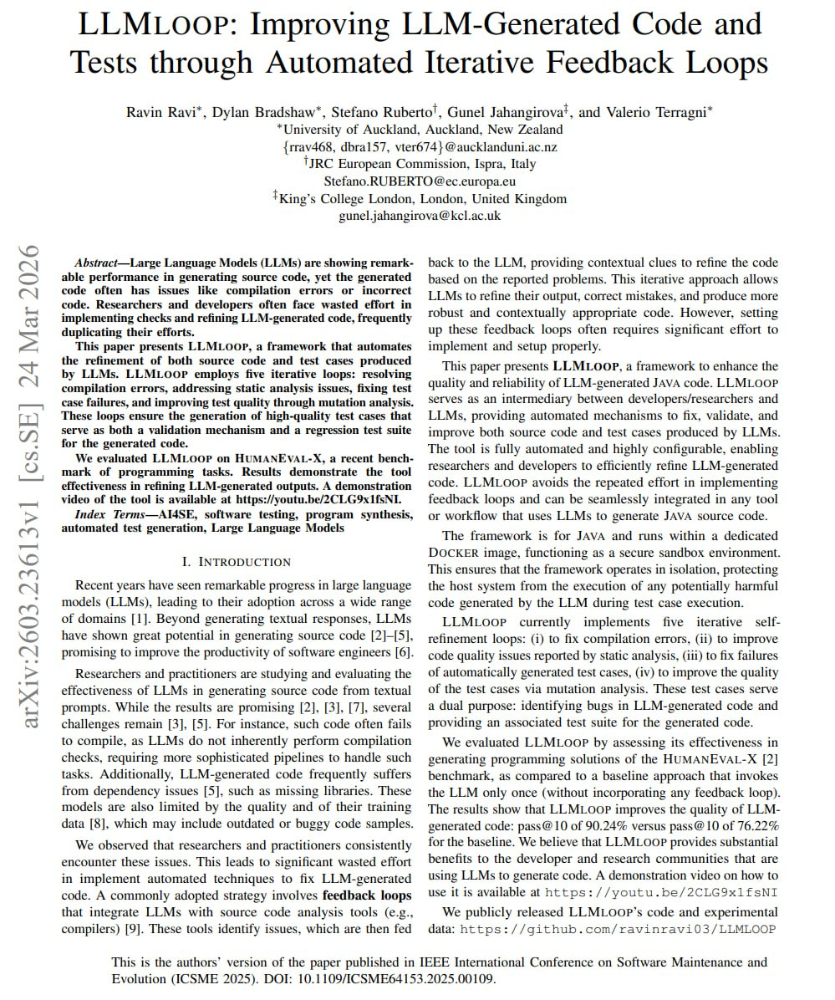

The engineers behind Claude Code just published a 5-PAGE PDF on loop engineering for LLM code.

They run an LLM through 5 loops: compile errors, static analysis, tests, until the code gets way better.

Every step is written out, so you can drop it into your own workflow immediately.

Read it, then check the article below. Worth every second.

### 🖼️ Attached Media

## 💬 Replies

### 1 @spectredxxx (spectredxxx)

*Wed Jun 24 14:10:13 +0000 2026*

@AnatoliKopadze Thanks for sharing! Here’s the link to the original post for convenience: [arxiv.org/abs/2603.23613…](https://arxiv.org/abs/2603.23613v1)

### 2 @0xMovez (Movez)

*Wed Jun 24 11:46:33 +0000 2026*

@AnatoliKopadze Damn bro, this is really a brilliant read! Thanks for sharing. Bookmarked it.

### 3 @AnatoliKopadze (Anatoli Kopadze) (Author)

*Wed Jun 24 11:47:37 +0000 2026*

@0xMovez Appreciated mate! Thanks for the idea!

### 4 @Truntr_ (Truntr)

*Wed Jun 24 11:47:04 +0000 2026*

Worth correcting: the authors are at University of Auckland, JRC Ispra, and King's College London. Not Anthropic engineers.
The paper itself is real and good. The framing borrows credibility it doesn't need - the loop thesis (compile → static → tests → refine) now lands the same way from independent academic research. That's actually the stronger signal.

### 5 @AnatoliKopadze (Anatoli Kopadze) (Author)

*Wed Jun 24 11:49:20 +0000 2026*

@Truntr\_ I did not say nothing about Anthropic

### 6 @mdowney (Mike Downey)

*Wed Jun 24 17:55:10 +0000 2026*

@AnatoliKopadze For those wanting to read the paper, which this person appears to have intentionally left out so he could use their work to benefit himself, here is the link:
[arxiv.org/abs/2603.23613](https://arxiv.org/abs/2603.23613)

### 7 @ataiiam (Atai Barkai)

*Wed Jun 24 15:17:49 +0000 2026*

@AnatoliKopadze A deeper dive into Self-Learning on each layer and all the different approaches used by Anthropic, Microsoft, Google, OpenClaw, Hermes etc.

Worth a look
[x.com/ataiiam/status…](https://x.com/ataiiam/status/2069797329809395978?s=20)

### 8 @kocer_eth (kocer)

*Wed Jun 24 11:47:35 +0000 2026*

@AnatoliKopadze this looks useful for cleaning up claude code outputs

### 9 @elenalin01 (Lin)

*Wed Jun 24 16:18:54 +0000 2026*

@AnatoliKopadze funny how everyone’s reinventing CI pipelines but calling it loop engineering now

### 10 @rewind02 (rewind)

*Wed Jun 24 11:57:10 +0000 2026*

@AnatoliKopadze tests are the real feedback

### 11 @CreaoAI (Creao AI)

*Thu Jun 25 00:46:48 +0000 2026*

@AnatoliKopadze The compile → lint → test order isn't arbitrary — it maps to how disciplined CI pipelines are structured, and the LLM benefits from the same error prioritization humans figured out the hard way. Worth lifting into any agentic coding workflow, not just Claude Code.

### 12 @phosphenq (Phosphen)

*Wed Jun 24 12:26:48 +0000 2026*

@AnatoliKopadze Where can I find the full version?

### 13 @ajs6888 (安叫兽|Bird🕊️ 🔶 BNB)

*Wed Jun 24 21:19:05 +0000 2026*

@AnatoliKopadze 这套循环不新，但细节能少踩不少坑

### 14 @HarryTandy (Harry Tandy)

*Wed Jun 24 17:46:27 +0000 2026*

@AnatoliKopadze automated loops are saving my sanity today

### 15 @noisyb0y1 (Noisy)

*Wed Jun 24 15:18:44 +0000 2026*

@AnatoliKopadze this document changed my life

### 16 @de1lymoon (Alex)

*Wed Jun 24 13:03:07 +0000 2026*

@AnatoliKopadze looping through compile, static analysis, and tests is the real method

### 17 @CollinCusce (Collin Cusce 🔺⚔️)

*Wed Jun 24 17:30:32 +0000 2026*

@AnatoliKopadze [x.com/CollinCusce/st…](https://x.com/CollinCusce/status/2069699625997492271?s=20)

### 18 @MichaelRan15 (Dr.R)

*Wed Jun 24 16:49:00 +0000 2026*

@AnatoliKopadze No authors are from @AnthropicAI

### 19 @itsthedonhashim (Hussain Hashim | Building SundayBack)

*Wed Jun 24 12:30:20 +0000 2026*

@AnatoliKopadze @AnatoliKopadze that's pretty cool. been trying to nail down my error handling with LLMs, so this might be super useful. thanks for sharing!

### 20 @whemohere (whemo)

*Wed Jun 24 12:12:06 +0000 2026*

@AnatoliKopadze I can't be bothered to read 5 pages, so I'm just going to throw them into Claude for a summary, lol

### 21 @mycomputerspot (MyComputerSpot)

*Wed Jun 24 20:06:10 +0000 2026*

@AnatoliKopadze Compile/test/static analysis loops are the sane version of agent hype. It gives the model a wall to bounce off.

### 22 @helmi (Helmi)

*Wed Jun 24 13:20:32 +0000 2026*

@AnatoliKopadze and you didn't link the paper because basically you only wanted to promote your own post right?

### 23 @XShude (随机比特)

*Wed Jun 24 14:40:54 +0000 2026*

@AnatoliKopadze I’d start by turning the acceptance check into a script. If I can’t verify it cheaply, faster agent output just makes me nervous.

### 24 @nahid_pro09 (Nahid)

*Wed Jun 24 12:15:28 +0000 2026*

@AnatoliKopadze 5 loops for code improvement is next level

### 25 @shahin43 (Shahn)

*Wed Jun 24 11:51:12 +0000 2026*

@AnatoliKopadze all you need is unlimited token credits !!

### 26 @gonlenidefi (Hunter Gon)

*Wed Jun 24 12:20:27 +0000 2026*

@AnatoliKopadze treating code review like a training loop feels obvious in hindsight

what format did they publish it in?

### 27 @pnamtx (pnam-TX)

*Wed Jun 24 19:29:10 +0000 2026*

@AnatoliKopadze Then burn all the tokens that one has no control over!

### 28 @Srijan_0007 (Srijan Poudel)

*Wed Jun 24 15:28:52 +0000 2026*

@AnatoliKopadze What engineers behind cluade code btw?

### 29 @SankiTank ($kito🐺)

*Wed Jun 24 12:29:14 +0000 2026*

@AnatoliKopadze 🤡

### 30 @Femifeks (Femi)

*Wed Jun 24 15:16:57 +0000 2026*

@AnatoliKopadze I imma check  it out

### 31 @jason_haugh (Jason Haugh)

*Wed Jun 24 16:31:43 +0000 2026*

@AnatoliKopadze Seriously thinking about writing a 50pg thesis on how to water my garden. 

Loops are not that complex people...

[x.com/jason\_haugh/st…](https://x.com/jason_haugh/status/2069416142599270535?s=20)

### 32 @radar24hvn (Radar 24h)

*Wed Jun 24 12:28:25 +0000 2026*

@AnatoliKopadze Excited to implement these loop engineering strategies in my projects.

### 33 @luckeyfaraday (Luckey Faraday)

*Wed Jun 24 18:08:13 +0000 2026*

@AnatoliKopadze Multi-stage loops with real gates (compile, static analysis, tests) beat hoping the model nails it in one shot

If anyone wants to tinker with running proper verifiable loops with orchestration and review steps, I open sourced athena-loops:
[github.com/luckeyfaraday/…](https://github.com/luckeyfaraday/athena-loops)

### 34 @AndAIyou (Luke || The HYPE Critic)

*Wed Jun 24 13:03:50 +0000 2026*

@AnatoliKopadze Unpopular opinion: if your AI code needs 5 correction loops — the problem isn’t the model. The problem is your prompt. Prove me wrong.

### 35 @Nicoqp (Nico)

*Wed Jun 24 12:33:22 +0000 2026*

@AnatoliKopadze compile, analyze, test, repeat until it passes

they just wrote out the loop most people are building wrong

