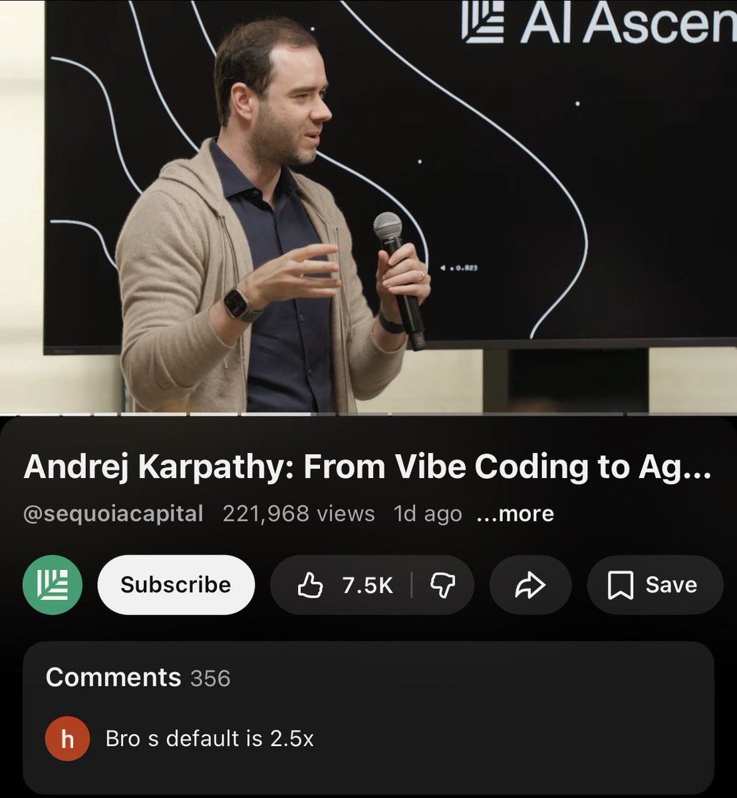
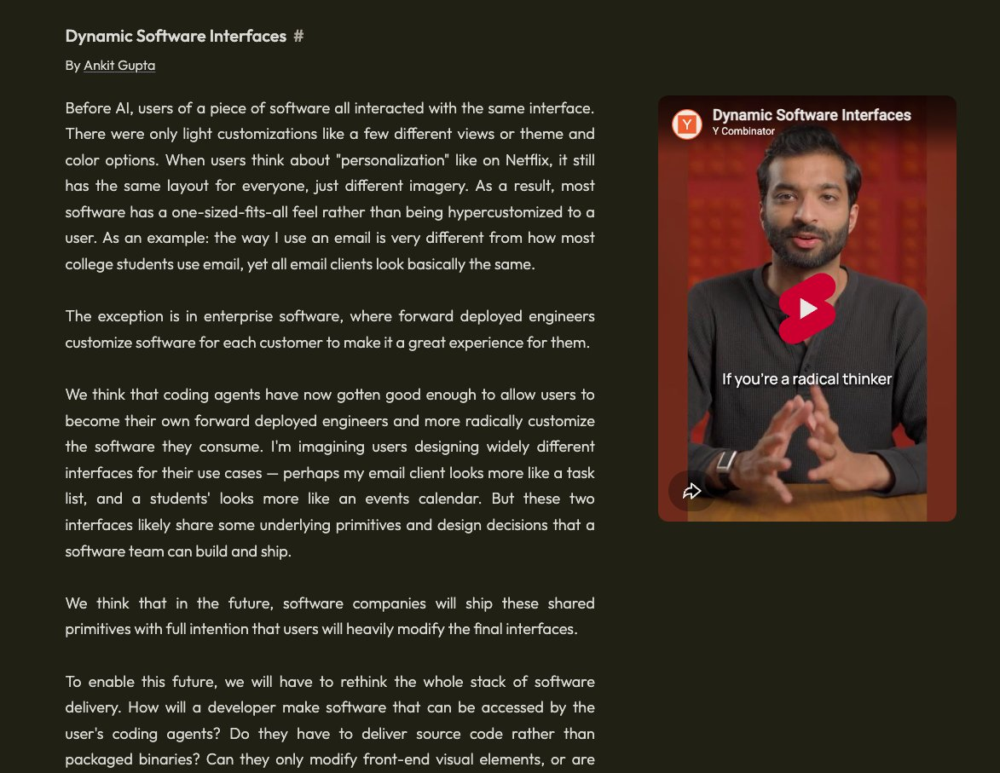
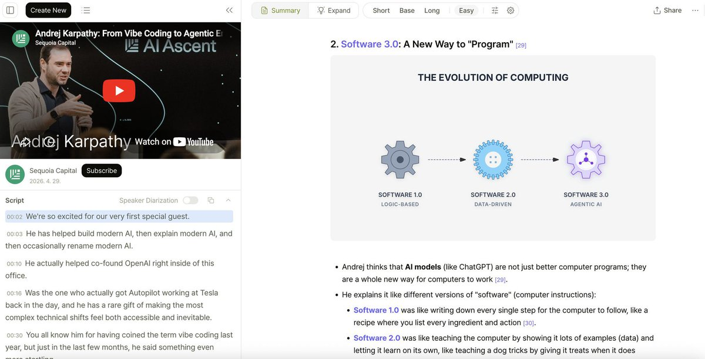
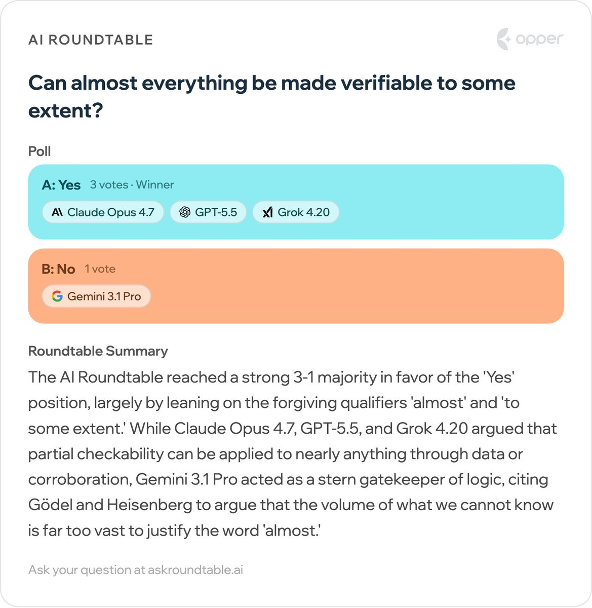

Fireside chat at Sequoia Ascent 2026 from a \~week ago. Some highlights:

The first theme I tried to push on is that LLMs are about a lot more than just speeding up what existed before (e.g. coding). Three examples of new horizons:

1\. menugen: an app that can be fully engulfed by LLMs, with no classical code needed: input an image, output an image and an LLM can natively do the thing.
2\. install .md skills instead of install .sh scripts. Why create a complex Software 1.0 bash script for e.g. installing a piece of software if you can write the installation out in words and say "just show this to your LLM".  The LLM is an advanced interpreter of English and can intelligently target installation to your setup, debug everything inline, etc.
3\. LLM knowledge bases as an example of something that was \*impossible\* with classical code because it's computation over unstructured data (knowledge) from arbitrary sources and in arbitrary formats, including simply text articles etc.

I pushed on these because in every new paradigm change, the obvious things are always in the realm of speeding up or somehow improving what existed, but here we have examples of functionality that either suddenly perhaps shouldn't even exist (1,2), or was fundamentally not possible before (3).

The second (ongoing) theme is trying to explain the pattern of jaggedness in LLMs. How it can be true that a single artifact will simultaneously 1) coherently refactor a 100,000-line code base \*and\* 2) tell you to walk to the car wash to wash your car. I previously wrote about the source of this as having to do with verifiability of a domain, here I expand on this as having to also do with economics because revenue/TAM dictates what the frontier labs choose to package into training data distributions during RL. You're either in the data distribution (on the rails of the RL circuits) and flying or you're off-roading in the jungle with a machete, in relative terms. Still not 100% satisfied with this, but it's an ongoing struggle to build an accurate model of LLM capabilities if you wish to practically take advantage of their power while avoiding their pitfalls, which brings me to...

Last theme is the agent-native economy. The decomposition of products and services into sensors, actuators and logic (split up across all of 1.0/2.0/3.0 computing paradigms), how we can make information maximally legible to LLMs, some words on the quickly emerging agentic engineering and its skill set, related hiring practices, etc., possibly even hints/dreams of fully neural computing handling the vast majority of computation with some help from (classical) CPU coprocessors.

## 💬 Replies

### 1 @heynavtoor (Nav Toor)

*Fri May 01 09:43:12 +0000 2026*

@karpathy why write a bash script when you can just explain what you want in english and let the LLM handle it

### 2 @sequoia (Sequoia Capital)

*Thu Apr 30 18:25:56 +0000 2026*

@karpathy Thank you @karpathy for a wonderful talk.
More content from AI Ascent 2026 available here: [seq.vc/goj](https://seq.vc/goj)

### 3 @PawelHuryn (Paweł Huryn)

*Thu Apr 30 21:01:10 +0000 2026*

@karpathy Adopting "agentic engineering," though it was emerging since Sep 2025: [x.com/PawelHuryn/sta…](https://x.com/PawelHuryn/status/2049921631196152307?s=20)

### 4 @oortech (OORT | The Data Cloud for Decentralized AI)

*Fri May 01 09:56:50 +0000 2026*

@karpathy The transition to an agent-native economy requires a decentralized foundation. 

OORT is building this infrastructure, ensuring agentic workflows are verifiable and data sovereignty is preserved. Scaling neural computing needs the resilience of DePIN.

### 5 @JoshuaIPark (Joshua Park)

*Thu Apr 30 17:59:48 +0000 2026*

@karpathy I was actually reading this comment on Youtube 

### 6 @whosamberella (amber shen)

*Thu Apr 30 18:30:51 +0000 2026*

@karpathy the menugen example is the tell.
the most interesting llm products won't have a pre-llm analog at all.

### 7 @inflectivAI (Inflectiv AI ⧉)

*Thu Apr 30 17:46:28 +0000 2026*

@karpathy The shift from simply speeding up old tasks to creating completely new functions is what makes this paradigm shift exciting. Moving to prompt-based installs and unstructured knowledge bases changes the way we interact with software completely.

### 8 @heyrimsha (Rimsha Bhardwaj)

*Fri May 01 07:24:20 +0000 2026*

@karpathy Love the idea of using language for installation. Makes tech so much more accessible! The future of LLMs seems full of potential.

### 9 @bulhosa (Daniel Bulhosa)

*Thu Apr 30 21:43:09 +0000 2026*

@karpathy We should borrow the concept of an operating design domain from self driving for LLMs

### 10 @mannyv_sol (Manny)

*Fri May 01 16:15:30 +0000 2026*

@karpathy For me it was stop thinking like web 3 and figure out how to think like 2 and 3

### 11 @HilaShmuel (Hila Shmuel)

*Thu Apr 30 17:33:42 +0000 2026*

@karpathy Point 3 is the entire Cabinet thesis. Classical knowledge bases were just folders cosplaying as brains - you can't grep meaning. 
[x.com/HilaShmuel/sta…](https://x.com/HilaShmuel/status/2039915543260500284?s=20)

### 12 @billtheinvestor (Bill The Investor)

*Thu Apr 30 18:51:39 +0000 2026*

@karpathy The menugen shift implies agentic workflows will redefine software architecture beyond simple interface automation.

### 13 @xikhar (Shikhar)

*Thu Apr 30 17:31:07 +0000 2026*

@karpathy Absolutely loved it.

[x.com/shikhr\_/status…](https://x.com/shikhr_/status/2049577048654663685?s=20)

### 14 @EvanKirstel (Evan Kirstel #B2B #TechFluencer)

*Sat May 09 21:03:29 +0000 2026*

@karpathy The 'agentic engineering' rename is way more honest than 'vibe coding' ever was. And if Karpathy says he feels behind, the rest of us are flying blind 😅

### 15 @iwasrobbed (Rob Phillips)

*Thu Apr 30 19:16:14 +0000 2026*

@karpathy Why is no one pushing on "moldable software"?

The entire internet should be mutable and personalized.

I'm already experimenting with this on @MoldableAI and it's clear we need to rethink cloud + dev frameworks + even local filesystems

### 16 @yoemsri (Youssef El Manssouri)

*Thu Apr 30 17:41:29 +0000 2026*

@karpathy Knowledge bases over unstructured data were always duct taped with heuristics. Now they are native to the paradigm.

### 17 @JinjingLiang (jinjingliang)

*Thu Apr 30 18:56:07 +0000 2026*

@karpathy For #1, YC also made a request for startup for dynamic interfaces 
[ycombinator.com/rfs#dynamic-so…](https://www.ycombinator.com/rfs#dynamic-software-interfaces) 

### 18 @Psigho (Junaid Yousaf Sheikh)

*Thu Apr 30 17:31:11 +0000 2026*

@karpathy Sir Andrej! You're an inspiration and a Genius.

### 19 @atris_eth (Josef (atris))

*Fri May 01 09:15:41 +0000 2026*

@karpathy 

### 20 @arrotu (JB)

*Fri May 01 10:01:41 +0000 2026*

@karpathy Agent-native economy makes one thing very loud: the closer agents get to acting on real systems, the more we need a way to know what each one actually did, on which input, in which environment. Legibility for LLMs is one half. Legibility back, after the fact, is the other.

### 21 @MacroBombastic (Macro Bombastic)

*Thu Apr 30 18:18:19 +0000 2026*

@karpathy You guys talking about agent-native economy like it's some new concept, but honestly bro its just economics, the same people who used to write code now writing prompts and calling it engineering, get over yourselves.

### 22 @nitishmutha (Nitish Mutha ⚡️)

*Fri May 01 08:53:59 +0000 2026*

The verifiability insight is the one that unlocks everything. Code has tests, compilation, CI. That feedback loop is why coding agents advanced so fast. The domains that build equivalent feedback loops next will see the same jump. Legal is the obvious one. Jaggedness is temporary.

### 23 @LilysAI_ (Lilys.ai)

*Thu Apr 30 18:03:11 +0000 2026*

@karpathy @sequoia We organized the full playbook into a readable note version: [lilys.ai/digest/9345158…](https://lilys.ai/digest/9345158/10773292?s=1&noteVersionId=7284112) 

### 24 @Jasonwang1211 (人称六叔 🔶BNB 🔶买美股上币安)

*Sun Jul 12 18:19:23 +0000 2026*

@karpathy menugen" sounds about right — naming something implies we get it, and we definitely don't get AGI yet. Fun to watch Karpathy squirm through the VC speak though.

### 25 @shuigvn (DUC)

*Thu May 07 11:44:25 +0000 2026*

@karpathy その説明を聞いて、LLMの可能性が広がる感じがするよね。自分もコーディングを自動化したことがあるけど、もっと深いレベルでLLMを使えるようになりたいな〜 :)

### 26 @duongphat99 (Đường Phát)

*Thu May 07 11:44:48 +0000 2026*

@karpathy ほんとに面白い話だよね、LLMが従来のコードを速くするだけでなく、新しいことができるようになるのはすごいなと思った。例えばメニューやインストールが言葉だけでできるっていうのは、頭を変えるレベルの変化だね。

### 27 @howhitening (toridochi)

*Mon May 11 04:47:24 +0000 2026*

@karpathy すごいですね、LLMの可能性が広がってると思います。どうやってその力を使いこなすのかが、今から楽しみです :)

### 28 @Widmdge (Kim Vault)

*Thu May 07 11:44:36 +0000 2026*

@karpathy 私もLLMの可能性に興味がありますね、特にmenugenのようなアプリは本当に新しい世界を開拓しているような気がするわ～

### 29 @duc_daily (Duck Daily 🦆)

*Tue May 26 07:01:49 +0000 2026*

@karpathy そう言えばLLMの потенシャルについて最近よく考えるけど、コードを書かなくてもできることって本当に増えてくるね。 menugenみたいなアプリも面白そうだ ^\_^

### 30 @0xZhao888 (Zhao 🥷🔶🦅)

*Sat Jun 20 18:23:15 +0000 2026*

@karpathy the jaggedness is real, we are basically just learning to navigate the spikes rn:D

### 31 @gerardsans (Gerard Sans | Axiom 🇬🇧)

*Sun May 17 22:24:30 +0000 2026*

@karpathy [x.com/gerardsans/sta…](https://x.com/gerardsans/status/2051013987660378166)

### 32 @Truunik (Truu🐻‍❄️)

*Thu Apr 30 17:32:01 +0000 2026*

@karpathy The "jagged frontier" problem is the defining bottleneck for agentic DeFi.

An LLM can refactor 100k lines of Solidity but can't tell you if a vault is about to depeg cus on-chain risk isn't in the RL distribution.

### 33 @GSkrovina (Garrett)

*Sat May 02 10:20:44 +0000 2026*

@karpathy what’s a good example of a menugen?

### 34 @nitishmutha (Nitish Mutha ⚡️)

*Wed May 06 09:01:22 +0000 2026*

@karpathy point 3 is what people underestimate most. computation over unstructured knowledge was simply impossible with classical code, not just slow. that's not an improvement, it's a new category of problem that is now solvable.

### 35 @seijadvice (seiji)

*Thu Apr 30 17:56:46 +0000 2026*

@karpathy 3 minute recap if you're short on time:

### 36 @felix94123 (Felix)

*Wed May 06 13:36:19 +0000 2026*

@karpathy Amazing talk! RE your statement about the council of LLM judges, I built a fun little tool called AI Roundtable that you can use for this :)  [opper.ai/ai-roundtable/…](https://opper.ai/ai-roundtable/questions/can-almost-everything-be-made-verifiable-to-some-extent-b1927478) 

