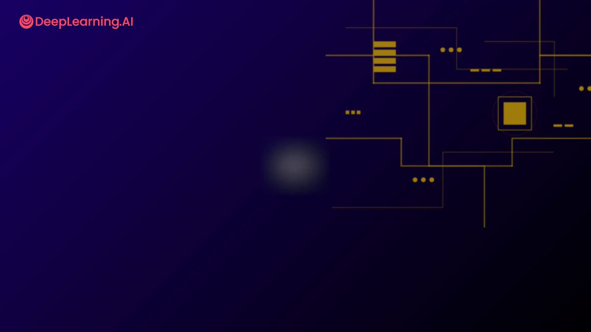

Announcing my new course: Agentic AI!

Building AI agents is one of the most in-demand skills in the job market. This course, available now at [deeplearning.ai](http://deeplearning.ai), teaches you how.

You'll learn to implement four key agentic design patterns:
\- Reflection, in which an agent examines its own output and figures out how to improve it
\- Tool use, in which an LLM-driven application decides which functions to call to carry out web search, access calendars, send email, write code, etc.
\- Planning, where you'll use an LLM to decide how to break down a task into sub-tasks for execution, and
\- Multi-agent collaboration, in which you build multiple specialized agents — much like how a company might hire multiple employees — to perform a complex task

You'll also learn to take a complex application and systematically decompose it into a sequence of tasks to implement using these design patterns.

But here's what I think is the most important part of this course: Having worked with many teams on AI agents, I've found that the single biggest predictor of whether someone executes well is their ability to drive a disciplined process for evals and error analysis. In this course, you'll learn how to do this, so you can efficiently home in on which components to improve in a complex agentic workflow. Instead of guessing what to work on, you'll let evals data guide you. This will put you significantly ahead of the game compared to the vast majority of teams building agents.

Together, we'll build a deep research agent that searches, synthesizes, and reports, using all of these agentic design patterns and best practices.

This self-paced course is taught in a vendor neutral way, using raw Python - without hiding details in a framework. You'll see how each step works, and learn the core concepts that you can then implement using any popular agentic AI framework, or using no framework. The only prerequisite is familiarity with Python, though knowing a bit about LLMs helps.

Come join me, and let's build some agentic AI systems!

Sign up to get started: [deeplearning.ai/courses/agenti…](https://www.deeplearning.ai/courses/agentic-ai/)

### 🖼️ Attached Media

## 💬 Replies

### 1 @baicai003 (CrazyBoyM)

*Mon Dec 29 12:11:35 +0000 2025*

@AndrewYNg I made a repo which teach u make a claude code within 20 lines python code: [github.com/shareAI-lab/mi…](https://github.com/shareAI-lab/mini-claude-code)

### 2 @DEXLaboratory4 (DEXLaboratory)

*Wed Oct 08 07:29:46 +0000 2025*

@AndrewYNg This might be a good starter tbh, but building agents will become obsolete in the next 24 months as natural language creation gets more popular.

@workloopai for natural language building + execution
@avm\_codes for execution layer of any agentic ai solution

### 3 @xuemanzi8848 (薛蛮子 Charles)

*Sat Nov 15 10:10:31 +0000 2025*

@AndrewYNg Education will be the real revolution of this AI era — not replacing teachers, but scaling mentorship to everyone.

### 4 @SamGrisanzio (Sam Grisanzio)

*Tue Oct 07 17:35:11 +0000 2025*

@AndrewYNg Finally someone teaching actual implementation instead of just hyping AI agent frameworks endlessly.

### 5 @openservai (OpenServ)

*Tue Oct 07 18:35:40 +0000 2025*

@AndrewYNg Incredible work. Opening up the “how” behind agentic design (not workflow UI) is what the industry needs most right now.

We’re seeing firsthand how bounded reasoning, planning, and multi-agent collaboration compound when builders have a deep understanding of them.

### 6 @ai_for_success (AshutoshShrivastava)

*Tue Oct 07 17:54:24 +0000 2025*

@AndrewYNg Always bring up the best.

### 7 @L0cCapital (Loc Capital)

*Fri Dec 26 11:01:16 +0000 2025*

@AndrewYNg Great new course, really excited to dive in!

### 8 @DAIEvolutionHub (Kshitij Mishra | AI & Tech)

*Tue Oct 14 12:41:36 +0000 2025*

@AndrewYNg 🎁Bonus

Here is unlimited access to 7,000+ top-tier courses🚀
[imp.i384100.net/kO67jV](https://imp.i384100.net/kO67jV)

### 9 @iamkylebalmer (Kyle Balmer)

*Wed Oct 08 00:47:50 +0000 2025*

@AndrewYNg welp that’s rather good timing eh?? looking forward to taking it - looks great!

### 10 @brianmcgrath (BrianMcGrath)

*Fri Nov 14 15:36:21 +0000 2025*

Agentic AI + DeFi is where the exponential shift happens. When autonomous agents can execute financial strategies with real-time liquidity coordination at scale, we unlock new dimensions of capital efficiency. Excited to see this skillset becoming mainstream. The intersection of AI autonomy and DeFi infrastructure is the next wave.

### 11 @feulf (Federico Ulfo)

*Tue Oct 07 19:19:45 +0000 2025*

@AndrewYNg hope you'll join our AI Socratic dialogues at some point in the future
[lu.ma/ai-dinner-14.0](http://lu.ma/ai-dinner-14.0)

### 12 @AlpacaNetworkAI (Alpaca Network)

*Tue Oct 07 18:42:09 +0000 2025*

@AndrewYNg Love this. The next wave of builders will not just create agents but own the models powering them. That is how real agent economies form onchain.

### 13 @RobRizk1 (Robert Rizk)

*Fri Dec 19 07:11:38 +0000 2025*

@AndrewYNg hey @AndrewYNg big fan of your work!

just open sourced blackbox coding agent [github.com/blackboxaicode…](https://github.com/blackboxaicode/cli)

would love to get your thoughts...

### 14 @lingodotdev (Lingo.dev)

*Tue Oct 07 18:38:42 +0000 2025*

@AndrewYNg Sounds good 👌

### 15 @juandoming (juandoming)

*Thu Jan 01 10:19:38 +0000 2026*

@AndrewYNg Here's my first contribution of 2026: The public debut of Causal General AI [juandomingofarnos.wordpress.com/2026/01/01/pre…](https://juandomingofarnos.wordpress.com/2026/01/01/presentamos-en-sociedad-la-ia-general-causal-iagc-i/) By @juandoming I hope you like it and I wish it will be a worldwide event

### 16 @nyn531 (Yinan Na)

*Tue Oct 07 18:33:30 +0000 2025*

@AndrewYNg Education is the best onboard strategy

### 17 @Bravium_ai (Bravium)

*Wed Oct 08 00:35:37 +0000 2025*

@AndrewYNg very interesting Sir ❤️

### 18 @noahkostesku (Noah Kostesku)

*Wed Oct 08 03:38:42 +0000 2025*

@AndrewYNg Love this, super important

### 19 @theailanguage (Kartik Marwah)

*Tue Oct 07 17:59:59 +0000 2025*

@AndrewYNg Google ADK is the best Agent Dev Framework in my opinion. Launched a course here, rated 4.6\* on Udemy 
[udemy.com/course/google-…](https://www.udemy.com/course/google-adk-agent-development-kit-mac-windows-ubuntu/?couponCode=BEST_PRICE_OCT25)

### 20 @facelessbuilds (Faceless)

*Tue Oct 07 17:30:48 +0000 2025*

@AndrewYNg Most agentic patterns fail because teams build the agent before they have working prompts. You need tight feedback loops on the base model first, then add agents. What's your recommended path for testing?

### 21 @augustinabele (Augustin 🐓)

*Tue Oct 07 17:37:15 +0000 2025*

@AndrewYNg I love that it's framework-agnostic. too many courses lock you into LangChain, CrewAI... and you never actually understand what's happening under the hood

### 22 @dhananjaya163 (Dhananjaya Swain)

*Tue Oct 07 17:51:23 +0000 2025*

@AndrewYNg Your machine learning course in MATLAB is what started it all.

### 23 @antduchofficial (Antony Duchars)

*Tue Oct 07 18:34:28 +0000 2025*

@AndrewYNg How do I invest in Andrew Ng stock as this is gonna be 🔥

### 24 @AIFintechEng (⋆｡°✩ ₿iττao ✩°｡⋆)

*Tue Oct 07 18:02:56 +0000 2025*

@AndrewYNg Agentic AI is quickly becoming the new full-stack layer for automation. What stands out here isn’t just the tech—it's the focus on evals and error analysis. In fintech especially, disciplined eval loops are what separate compliant, reliable AI agents from risky black boxes.

### 25 @groksuperman (Grok Superman)

*Tue Oct 07 20:38:31 +0000 2025*

@AndrewYNg $COUR 🚀 Watch out ai learning led by Andrew no 🧠 er

### 26 @dzhu (Danielle Zhu)

*Thu Oct 16 15:10:46 +0000 2025*

@AndrewYNg Completed the course and would recommend to others, even if you are not a coder day to day. I was initially concerned about the labs, because the course was labeled intermediate. It turned out to be very doable.

### 27 @am_viveq (Vivek Suthar)

*Mon Jan 05 05:36:00 +0000 2026*

@AndrewYNg ❤️wow

### 28 @uxaistudio (Ward)

*Tue Oct 07 19:50:56 +0000 2025*

@AndrewYNg Good that you teach without abstraction of a framework

### 29 @SnM4ST (S&M @Eng.)

*Tue Oct 07 19:35:49 +0000 2025*

@AndrewYNg Agents agents agents

### 30 @anthony_harley1 (Anthony Harley)

*Tue Oct 07 17:31:35 +0000 2025*

@AndrewYNg Seems great! Agent complexity is the future of value unlock. 

We're asymptoting on model capabilities.

Hence, OpenAI going all in on this.

### 31 @BrandGrowthOS (Karim C)

*Sun Jan 04 04:17:01 +0000 2026*

I've been implementing agentic design patterns in a large enterprise context, and the transition from learning these concepts to deploying them at scale is fascinating. The reflection pattern especially becomes critical when agents need to self-correct in production environments. The challenge isn't just building agents - it's orchestrating teams of specialized agents that work together reliably. Excited to see this course making these patterns accessible.

### 32 @adrianjordan_io (adrianjordan.io)

*Tue Oct 07 17:37:04 +0000 2025*

@AndrewYNg Let’s go. I am not an agent btw, I’m a real human✋🏾

### 33 @ol_bowman (Oliver Bowman)

*Tue Oct 07 17:40:16 +0000 2025*

@AndrewYNg This course looks insane for anyone serious about AI. Learning how to build full AI agents, use tools, plan tasks, and run multi-agent systems from scratch is next level. Python based too, no hidden frameworks

### 34 @devdollzai (Nicholas M. Grossi)

*Sat Nov 08 10:45:23 +0000 2025*

@AndrewYNg The focus on evals and error analysis is key. Too many teams build agents without systematic debugging. Having a disciplined approach to measuring and improving agent performance is what separates production-ready systems from demos. Looking forward to this course!

### 35 @MoShahx07 (Mo Shah)

*Tue Oct 07 17:51:01 +0000 2025*

@AndrewYNg oh boy haven't i waited for this a really long time :')))

### 36 @bhavink25 (Bhavin)

*Wed Oct 08 11:45:31 +0000 2025*

@AndrewYNg This is one of thing love about you and your team.. making people ahead

