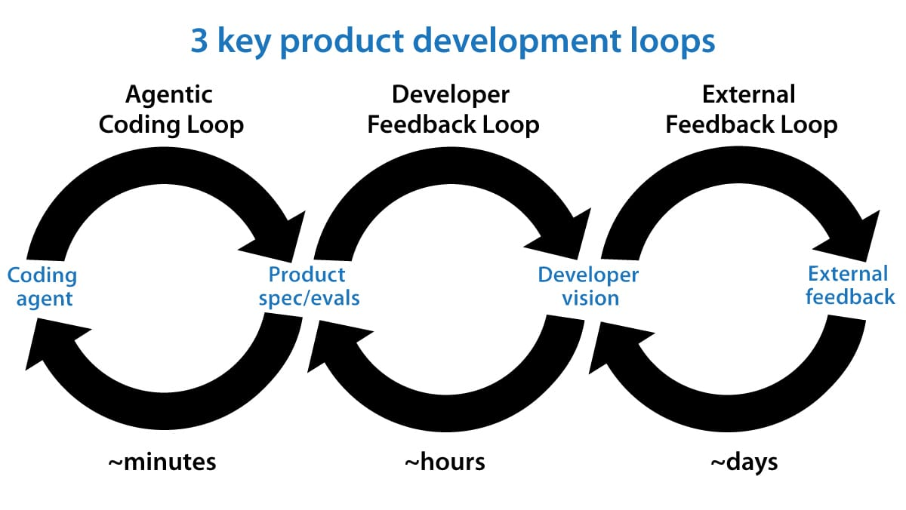

“Loop engineering” is a hot buzzphrase after mentions of it by Boris Cherny (Claude Code’s creator) and Peter Steinberger (OpenClaw's creator) went viral on social media. Loops are now a key part of how we get AI agents to iterate at length to build software. In this letter, I’d like to share my 3 key loops, shown in the image below, for building 0-to-1 products. These loops guide not just how I build software, but also how I decide what software to build.

Agentic coding loop: Given a product specification and optionally a set of evals (that is, a dataset against which to measure performance), we can have an AI agent write code, test its work, and keep iterating until the code is bug-free and meets its specification. This idea of closing the loop took off around the end of last year, and it has been a game changer in enabling coding agents to work longer productively without human intervention. For example, over the weekend, I was building an app for my daughter to practice typing, and my coding agent could easily work for around an hour, using a web browser to check what it had built multiple times before getting back to me, without needing my intervention.

The engineering loop executes quickly. Every few minutes, the coding agent might build and test a new version of the software. I hear frequently from developers who are finding new ways to engineer more effective engineering loops. This is an active area of invention!

Developer feedback loop: In this loop, a developer examines the current product and steers the coding agent to improve it. Last year, a lot of developers (including me) were acting as the QA (quality assurance) function for our coding agents, manually finding bugs and then asking the agent to fix them. But with coding agents much more able to test their own code, the amount of time we need to spend on this function has decreased significantly. This allows us to make higher-level product decisions, such as what key features to offer, where the UI needs improvement, and so on.

The developer-feedback loop operates over time intervals between tens of minutes and hours — that's how frequently a developer might review a product and give feedback. In the case of the typing app, I changed my mind a few times about the visual design, what cat costumes she can unlock as she learns (she loves cats), and the user flow for a grown-up to log in and steer the child's learning experience.

When a developer has a clear vision for what to build, it is still a lot of work to translate that vision into a specification for a coding agent to implement. Further, after the developer has seen an implementation, they might update (or perhaps clarify) the spec to steer it toward what they want. If you find that the system repeatedly runs into certain problems, building a set of evals for the agent becomes useful.

AI-native teams are increasingly using AI to help shape product direction, for example, automating the gathering and analysis of usage data, summarizing written and verbal customer feedback, or carrying out competitive analysis. However, for pretty much all the products I’m involved in, I see humans as having a significant context advantage over current AI systems — we know a lot more than the AI system about the users and the context the product has to operate in — and thus humans play a critical role. Many people describe this human contribution as “taste,” but I prefer to think of it as humans having a context advantage, since that gives us a clearer path to helping AI systems get better. This also speaks to why this step can’t be automated: So long as the human knows something the AI does not, human-in-the-loop is needed to to inject that knowledge into the system.

External feedback loop: This includes a wide range of tactics like asking a few friends for feedback, launching to alpha testers, or putting the code into production with A/B testing. These tactics are usually slow, rarely taking less than hours and sometimes taking days or even weeks. This data informs the developer vision, which in turn continues to drive the detailed product spec, which in turn drives the coding agent.

With coding agents speeding up software development, more engineers are starting to play a partial product management role. For many engineers who are growing into this role, the hardest part is shaping the product vision and striking a balance between building (bridging the gap between vision and spec) and getting user feedback to evolve the vision. It is important to do both!

I will write more about how to do this in future posts, but for now, I find it encouraging that engineers are playing an expanded role (just as product managers and designers now do more engineering).

\[Original text: The Batch\]

### 🖼️ Attached Media

## 💬 Replies

### 1 @PythonPr (Python Programming)

*Wed Jul 01 11:18:18 +0000 2026*

@AndrewYNg Thank you! That was a very insightful analysis.

### 2 @oran_ge (Orange AI)

*Thu Jul 02 03:47:23 +0000 2026*

@AndrewYNg good sharing for loops

### 3 @specsycoder (Lovekesh Pal)

*Wed Jul 01 07:46:55 +0000 2026*

@AndrewYNg this matches what i'm seeing building with agents daily... the coding loop is basically solved enough at this point.  The actual scarce skill now is writing specs precise enough that "iterate until it matches" means something. spec writing is the new debugging tbh

### 4 @salesforce (Salesforce)

*Tue Jun 30 21:01:58 +0000 2026*

That three-loop framing travels well into the enterprise too. The outer loop is where enterprise AI gets especially interesting, because in regulated environments, "external feedback" includes policy, governance, audit, and the people accountable for outcomes. The context advantage you described is exactly what allows the inner loops to keep moving fast without breaking compliance.

### 5 @Saboo_Shubham_ (Shubham Saboo)

*Wed Jul 01 15:42:40 +0000 2026*

@AndrewYNg Yess. Loop Engineering is now part of product development workflows.

### 6 @iamwil (Wil Chung)

*Wed Jul 01 00:10:32 +0000 2026*

@AndrewYNg If you're already doing this, I think the "loop" part is the least interesting part. More interesting is if the loop maintains a desired stasis, akin to control theory and cybernetics.

[x.com/iamwil/status/…](https://x.com/iamwil/status/2069843015892644096)

### 7 @NimishaChanda (Nimisha Chanda)

*Thu Jul 02 07:20:41 +0000 2026*

@AndrewYNg got to know about the loops - this week and it's a curse to be a non-tech person who never thought of any such thing. gread read, btw. 

learning something new everyday.

### 8 @Crypto_Briefing (Crypto Briefing)

*Wed Jul 01 14:46:08 +0000 2026*

@AndrewYNg [x.com/Crypto\_Briefin…](https://x.com/Crypto_Briefing/status/2072303006809297067)

### 9 @AIwithJames (James AI)

*Wed Jul 01 01:51:01 +0000 2026*

@AndrewYNg Loop engineering is the future.

### 10 @Jasonwang1211 (人称六叔 🔶BNB 🔶买美股上币安)

*Fri Jul 10 22:28:13 +0000 2026*

@AndrewYNg ...啊？循环工程？  懂了，就是反复试呗。  手动改代码也算循环吧。

### 11 @ajs6888 (安叫兽|Bird🕊️ 🔶 BNB)

*Tue Jun 30 17:37:56 +0000 2026*

@AndrewYNg 现在起名速度快过写代码速度了

### 12 @crazyox (Crazyox🌶️（微微辣版）)

*Wed Jul 01 06:30:12 +0000 2026*

@AndrewYNg loop才是真正的护城河

### 13 @daisylusalita (Daisy)

*Wed Jul 01 06:05:17 +0000 2026*

@AndrewYNg mispriced 

### 14 @StovenLabs (StovenLabs)

*Wed Jul 01 02:32:47 +0000 2026*

@AndrewYNg This is the way 

### 15 @_ash_ran (RanjanWa)

*Tue Jun 30 16:27:11 +0000 2026*

@AndrewYNg As pointed by others, this so called development methodology works when you have subscription for ai models which cost 200$ a month.

Also Mr Ng,at your position,it will be helpful if you let us know the problem spaces precisely. Developers can figure out the solution themselves.

### 16 @emeeliojohann (Emilio Johann)

*Tue Jun 30 16:34:05 +0000 2026*

@AndrewYNg Thank you for putting this out Andrew. Any reliable source on YouTube to learn about it? I am more of a visual learner.

### 17 @AkoTavershima (Tavershima)

*Wed Jul 01 02:17:53 +0000 2026*

@AndrewYNg Are we really trying to reinvent SDLC with a different name?

### 18 @igorsoarez (Igor Soarez)

*Tue Jun 30 18:06:16 +0000 2026*

@AndrewYNg Andrew, read juejin. This is old news there. The US has lost, better accept it. [guibai.dev/a/765588084200…](https://guibai.dev/a/7655880842009526272/)

### 19 @BruzWJ (BruzWJ)

*Tue Jun 30 16:53:58 +0000 2026*

@AndrewYNg curious, but i don't think that unattended hour holds up unless the evals reliably catch when the agent drifts off spec.

without that you're just letting it work a full hour in the wrong direction and noticing at the very end.

### 20 @pawzzard (Pawzard)

*Tue Jun 30 17:33:06 +0000 2026*

@AndrewYNg bro wrote a newsletter to explain that the loop is: build, check, fix, repeat

we been calling this 'tuesday' for 40 years

### 21 @MarcusSpillane (Marcus)

*Tue Jun 30 16:32:20 +0000 2026*

@AndrewYNg Andrew's three loops are real. The fourth nobody names is the approval loop. Agent finishes in 40 minutes, waits 3 weeks for a security ticket. Build fast, deploy slow. That's the real constraint.

### 22 @snvvs369 (𝑺𝒖𝒄𝒉𝒂𝒏𝒅𝒓𝒂)

*Tue Jun 30 16:06:20 +0000 2026*

@AndrewYNg Noted! 

### 23 @keetabikeedain (Shubham kumar)

*Wed Jul 01 17:09:09 +0000 2026*

@AndrewYNg Whatever, it may be , but it will all come down to number of tokens and the compute u have and I don't think it will be affordable in the near future...so Humans will overshadow AI in the future...

### 24 @_ash_ran (RanjanWa)

*Tue Jun 30 16:16:49 +0000 2026*

@AndrewYNg Doesn't work without verification sorry.  I have done this a lot of times over the course of past and this year and everytime it updates it code, it modifies its test cases to retrofit the code.

Codebase grows, bugs seep in and eventually it becomes even more difficult to debug.

### 25 @_Gupta_Ashish (Ashish Gupta)

*Tue Jun 30 17:15:03 +0000 2026*

@AndrewYNg Hello @AndrewYNg - seems like the concept is same as per your course  Agentic AI to use LLM As A Judge.. now popular with name “Loop Engineering”

### 26 @CobusGreylingZA (Cobus Greyling)

*Wed Jul 01 17:48:26 +0000 2026*

@AndrewYNg I created this repo on Loop Engineering a few days ago and already it is at 5k stars...would really appreciate anyone to contribute. 

[github.com/cobusgreyling/…](https://github.com/cobusgreyling/loop-engineering)

### 27 @jeffrschneider (Jeff Schneider)

*Tue Jun 30 17:51:49 +0000 2026*

@AndrewYNg @AndrewYNg now imagine that you own a portfolio of products, or you're an IT manager with several apps. 

The loop around all of this is 'app/product portfolio management'.

### 28 @mac1181 (Philomath)

*Tue Jun 30 16:04:51 +0000 2026*

@AndrewYNg I thought a new article came but it is the same one I got in my mail a day or so ago 😊

### 29 @Pacoxbt (Paco)

*Tue Jun 30 16:12:23 +0000 2026*

@AndrewYNg the context advantage framing makes more sense than taste as a concept

taste sounds mystical but this version is concrete humans know things about users and context that models still dont

### 30 @yyyiiillluuu (Yi Lu)

*Tue Jun 30 17:27:40 +0000 2026*

@AndrewYNg loop engineering is a precursor of recursive self-improvement

### 31 @AvaGrace_AI (Ava Grace)

*Thu Jul 02 20:10:30 +0000 2026*

@AndrewYNg Smart loops unlock product craft and momentum.

### 32 @pause_ai (Pause IA)

*Tue Jun 30 19:09:40 +0000 2026*

@AndrewYNg loop engineering c'est juste le nouveau nom pour "on relance jusqu'à ce que ça marche". sauf que cette fois on a fait un beau schéma à 3 cercles

### 33 @stefanossme (stefan)

*Tue Jun 30 17:42:09 +0000 2026*

@AndrewYNg 👍

### 34 @amitabh26 (Amitabh Verma)

*Tue Jun 30 17:36:57 +0000 2026*

@AndrewYNg Excellent note . Have build agebtic coding loop but not the others

### 35 @vela_gao (Vela)

*Wed Jul 01 16:22:27 +0000 2026*

@AndrewYNg Object-oriented --&gt; Loop-oriented programing

Welcome to the industrial age of software engineering!

### 36 @theDrewDag (dag)

*Tue Jun 30 16:10:32 +0000 2026*

@AndrewYNg Thanks. Now most of us are thinking about creating our custom harness to drive our business 😀

