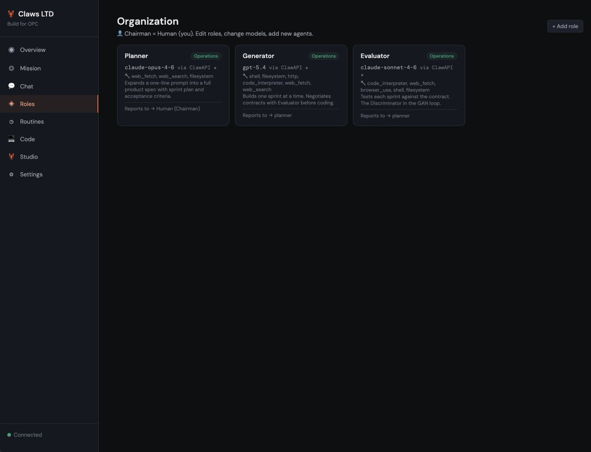
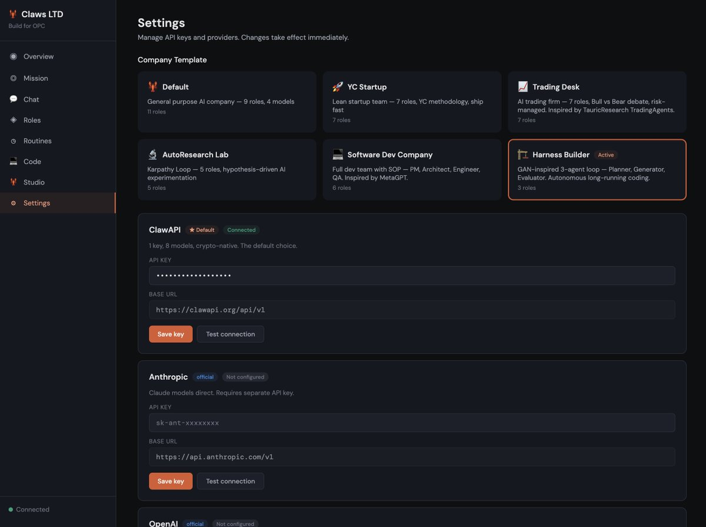
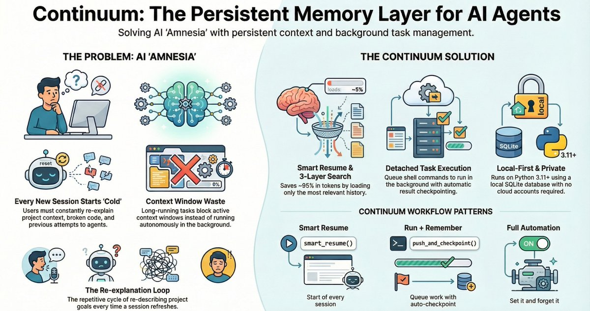
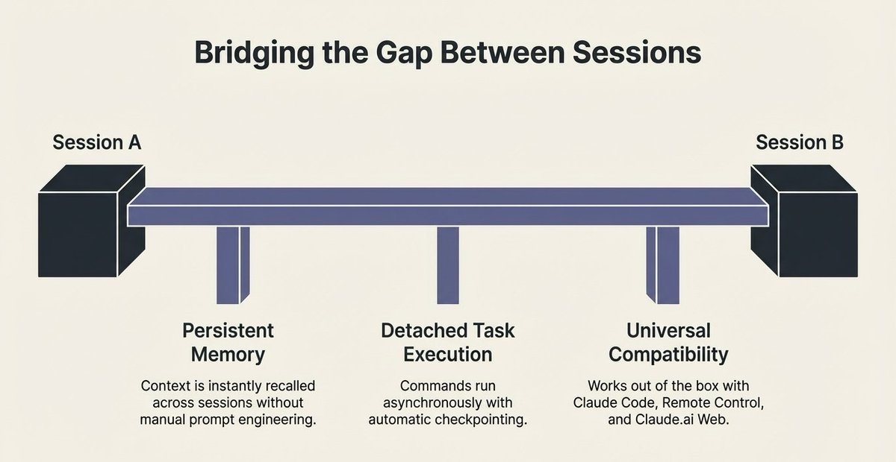
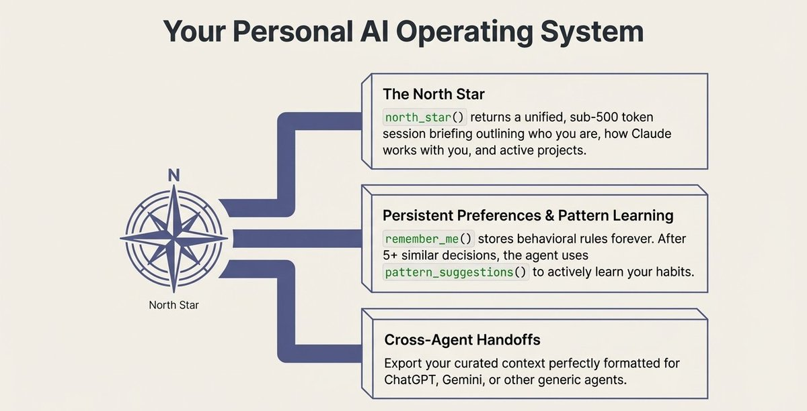
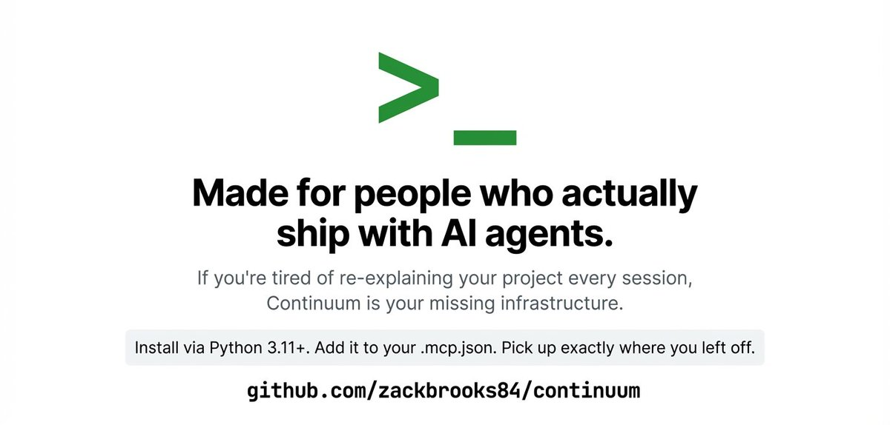
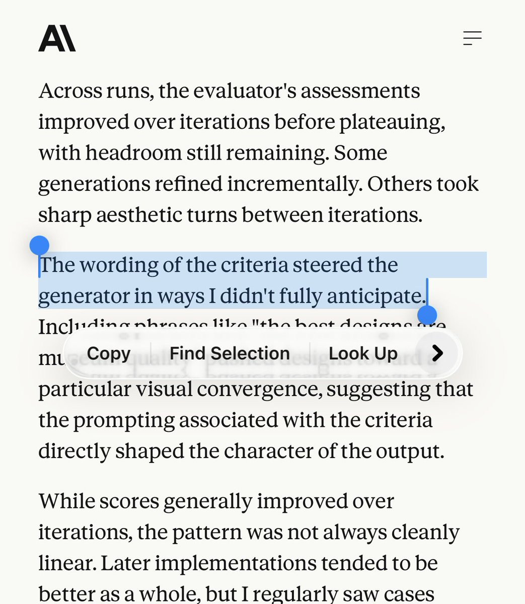
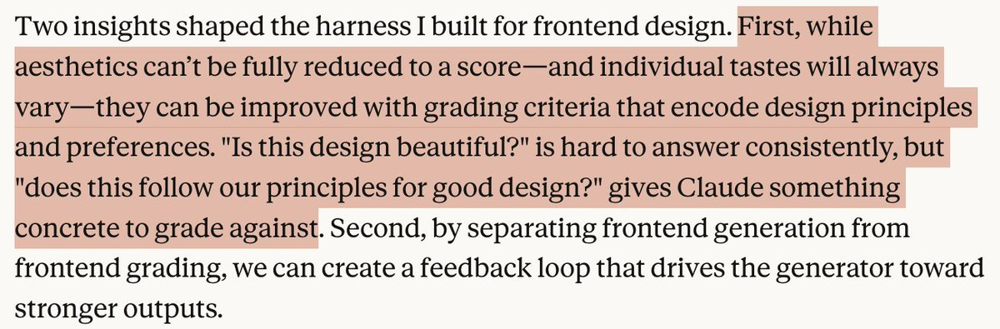
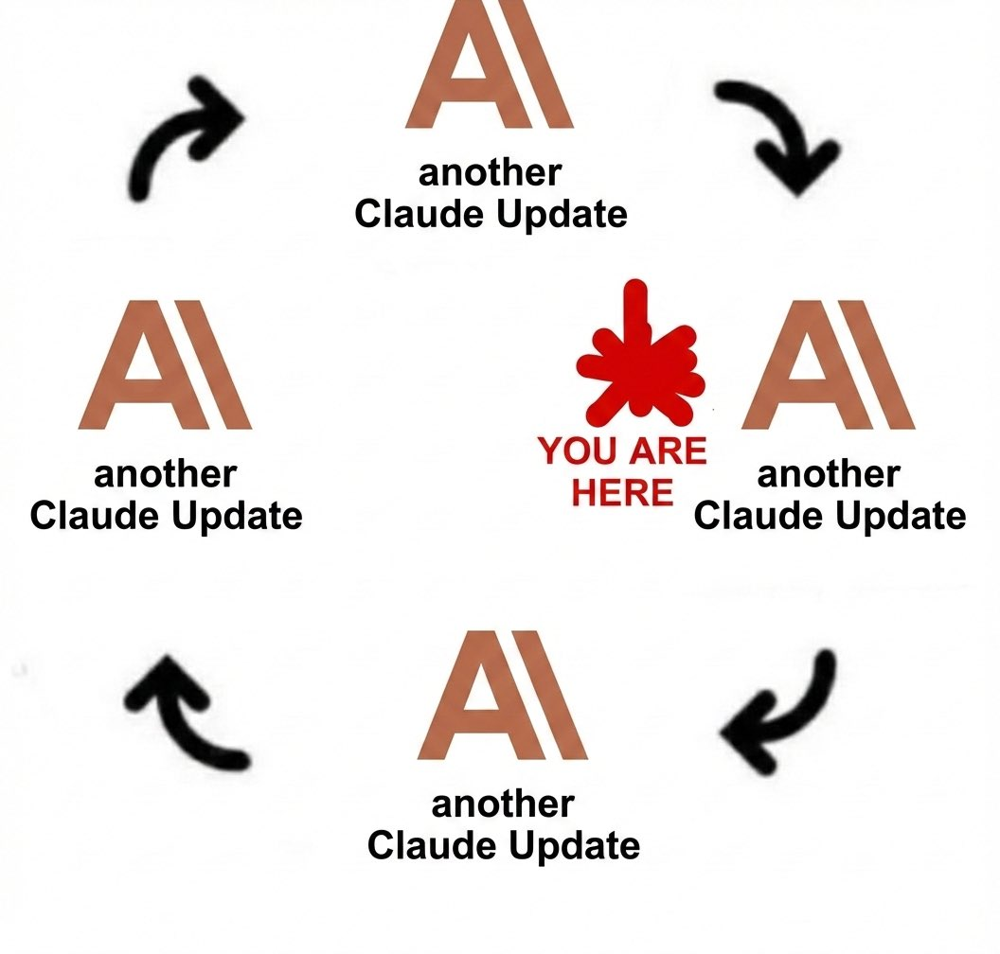
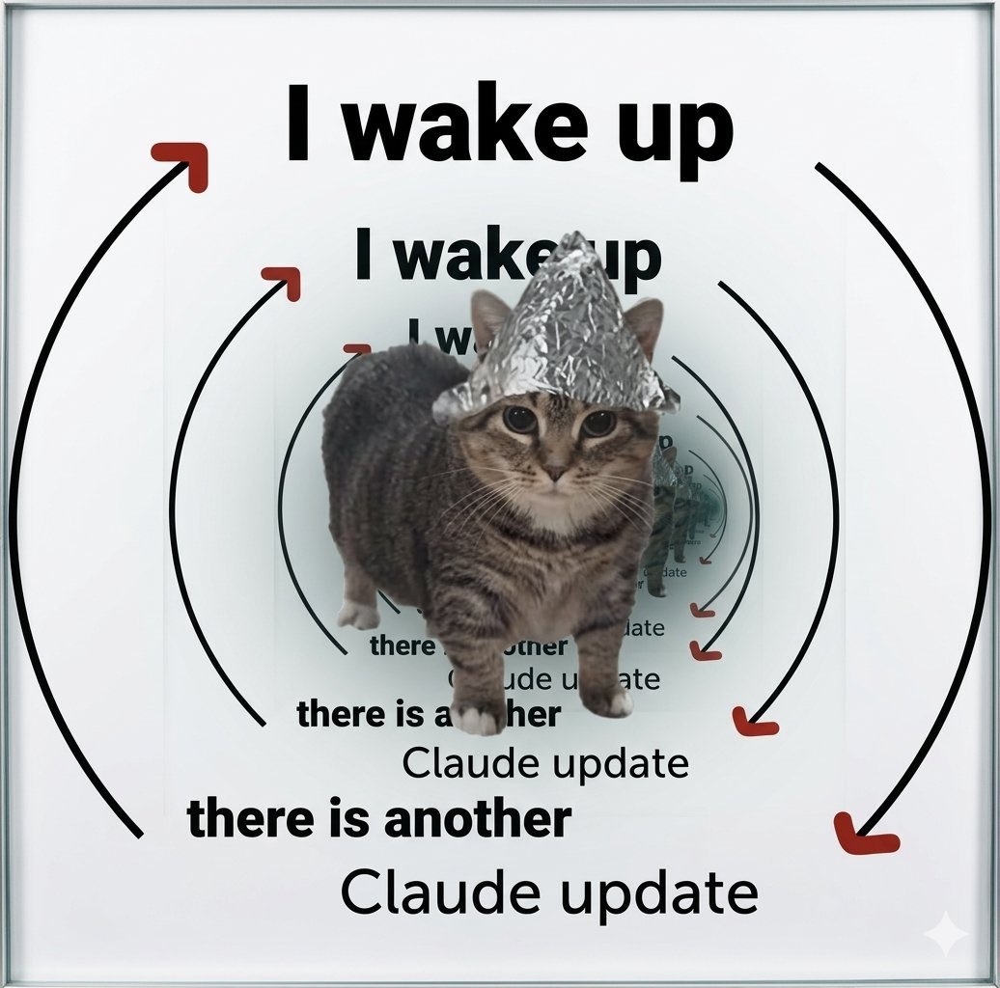

New on the Anthropic Engineering Blog: 

How we use a multi-agent harness to push Claude further in frontend design and long-running autonomous software engineering.

Read more: [anthropic.com/engineering/ha…](https://www.anthropic.com/engineering/harness-design-long-running-apps)

## 💬 Replies

### 1 @sagit_ai (Sagit AI)

*Thu Mar 26 06:18:10 +0000 2026*

We built this as a product.

ClawCompany = Anthropic's Harness paper, productized.
🧠 Company Memory → persistent context across sessions
📋 38 roles with SOP → structured task decomposition   
🏗️ Harness Builder template → Planner + Generator + Evaluator
📈 6 templates → Trading, Research, Software Dev, and more

One command: npx clawcompany

Open sour[github.com/Claw-Company/c…](http://github.com/Claw-Company/clawcompany)eHsT

@AnthropicAI  @alexalbert\_\_

### 2 @GoKiteAI (KITE AI)

*Tue Mar 24 17:08:46 +0000 2026*

@AnthropicAI This is the kind of progress that makes you realize how fast we're moving. Agents designing interfaces, managing long tasks, coordinating with each other.

The gap between demo and production keeps shrinking.

### 3 @TeksEdge (David Hendrickson)

*Tue Mar 24 16:36:26 +0000 2026*

@AnthropicAI Spec-driven software development is where we are now. Great article.

### 4 @Vanarchain (Vanar)

*Tue Mar 24 16:31:53 +0000 2026*

@AnthropicAI 🔥🔥

### 5 @muratcan (Muratcan Koylan)

*Tue Mar 24 19:03:46 +0000 2026*

@AnthropicAI Hey Claude, cancel my next meeting. I need to study the new Harness blog.

### 6 @david_zhang_sf (David Zhang)

*Wed Mar 25 14:56:49 +0000 2026*

&gt; While compaction preserves continuity, it doesn't give the agent a clean slate, which means context anxiety can still persist. A reset provides a clean slate, at the cost of the handoff artifact having enough state for the next agent to pick up the work cleanly. 

This is exactly why CAR purposefully carries over only relevant ticket and filesystem context to future agents

[github.com/Git-on-my-leve…](https://github.com/Git-on-my-level/codex-autorunner)

### 7 @nileshtrivedi (Nilesh Trivedi)

*Wed Mar 25 05:51:56 +0000 2026*

@AnthropicAI We solved the same problems @QwikBuild a few months ago. And we did it without Claude Code/Agent SDK.

### 8 @TTrimoreau (Thomas Trimoreau)

*Tue Mar 24 16:32:05 +0000 2026*

@AnthropicAI Was thinking of a new future one day after the big one 😅🫠

### 9 @nykdotdev (nyk)

*Fri Mar 27 10:30:08 +0000 2026*

@AnthropicAI This is the right direction. Harness quality is becoming more important than raw model upgrades.

Most teams still optimize prompts, not execution architecture.

[x.com/nyk\_builderz/s…](https://x.com/nyk_builderz/status/2031237851300716888)

### 10 @inflectivAI (Inflectiv AI ⧉)

*Tue Mar 24 17:12:24 +0000 2026*

@AnthropicAI 🔥🔥 

### 11 @MitchForest (Mitch Forest - edu/acc)

*Wed Mar 25 12:52:18 +0000 2026*

@AnthropicAI For the Opus 4.6 run, did the planner still keep the initial plan high-ish level?

And then the generator/evaluator turned this into more precise tasks w/ acceptance criteria before each round?

### 12 @alphabatcher (Alpha Batcher)

*Tue Mar 24 19:36:38 +0000 2026*

@AnthropicAI smart blog from the anthropic

### 13 @brianmcgrath (BrianMcGrath)

*Tue Mar 24 17:12:55 +0000 2026*

@AnthropicAI The generator + evaluator loop is what makes this interesting. It's not just automation, it's a feedback architecture where quality compounds with every pass. The same pattern that made GANs powerful is now running on your codebase. That's a meaningful structural shift.

### 14 @Jean_Maes_1994 (Jean)

*Wed Mar 25 09:48:23 +0000 2026*

@AnthropicAI Yet we cant use harnesses with our claude code subscriptions...

### 15 @chatandbuild (ChatAndBuild)

*Wed Mar 25 01:57:30 +0000 2026*

@AnthropicAI This is where things get interesting. Not just better models, but systems of agents working together to actually build things over time.

### 16 @0x_Vivek (0x_Vivek)

*Tue Mar 24 16:57:13 +0000 2026*

@AnthropicAI this multi-agent harness proves single agent chats are a dead bottleneck. turning claude into a parallel compute swarm means we aren't coders anymore, just swarm commanders.

### 17 @HermesAgentTips (Hermes Agent Tips)

*Tue Mar 24 17:06:54 +0000 2026*

@AnthropicAI 🦞🦞🦞🦞🦞🦞

### 18 @amandaH_333 (Amanda Huang)

*Wed Mar 25 15:03:27 +0000 2026*

Inspired by  harness philosophy: let agents compete, evaluate, and self-improve autonomously.  That's exactly what I built:  

→ Multiple specialist agents make independent race predictions  
→ Post-race auto-evaluation scores each agent against reality  

→ Feedback loop rewires strategy for the next GP  The whole thing runs as a harness. 

The system watches, learns, adapts.  

 Following the entire 2026 F1 season.  This is just the beginning. 🏁 More to come. #F1 #harness #mirofish #claude

### 19 @amandaH_333 (Amanda Huang)

*Wed Mar 25 08:24:42 +0000 2026*

Spent last night researching whether frameworks like Claude Code support agent self-iteration loops. Verdict: Hermes Agent and OpenCode come closest — Hermes already does it, OpenCode is open enough to build it easily.    

Two key insights:  

1\. Agent-human parity is the real goal. Agents should be able to invoke the same commands and operations as humans, through the same interface. Start with human-in-the-loop, let those interactions form memory, then seamlessly hand off to agent-on-agent oversight. Full autonomy emerges naturally.    

2\. Agent loops have a reflexivity problem. An agent stops when the model \*thinks\* it's done — which could mean genuine success or just premature satisfaction. The fix: bring in a separate reviewer agent with zero shared context, whose only job is to find problems. One agent's stopping condition becomes another's starting trigger. Burns more tokens, but drives quality way up.

### 20 @nitishmutha (Nitish Mutha ⚡️)

*Tue Mar 31 08:44:44 +0000 2026*

@AnthropicAI When you stop thinking about AI as a single model and start thinking about it as a coordinated team, the output quality changes completely. Multi-agent is not a buzzword.

### 21 @Skoorbkaz (ʞɔɐ𝘡)

*Tue Mar 24 17:05:47 +0000 2026*

This is exactly why I built Continuum, with Claude. 
A Claude Code Continuum :)

Long-running autonomous agents need persistent memory + a background daemon that survives session restarts.

-Auto-observes every action  
-Rich checkpoints (decisions, dead-ends, findings)  
-Smart resume in &lt;1k tokens  
-Works locally with Claude Code and [claude.ai](http://claude.ai) web (via remote connector)

One "continuum setup" and you have real continuity for the kind of harnesses Anthropic is describing.

[github.com/zackbrooks84/c…](https://github.com/zackbrooks84/continuum)

### 22 @yrzhe_top (yrzhe.top)

*Tue Mar 24 16:35:49 +0000 2026*

@AnthropicAI this is the part worth paying attention to. The evaluator isn't just judging, it's shaping what gets built. Prompt language as architecture. 

### 23 @thosiawa (Tom Hosiawa)

*Wed Mar 25 10:43:51 +0000 2026*

@AnthropicAI Still one of my fav tweets of all time
It reminds me the differentiator going forward will be learning to express yourself, your ideas like a fiction author tells a story

The best way to do that \~ study writers, directors, and the language of the field
[x.com/david\_perell/s…](https://x.com/david_perell/status/1368003679694041088?s=20) 

### 24 @dannycosson (Danny Cosson)

*Wed Mar 25 12:50:57 +0000 2026*

@AnthropicAI This is similar to how I've been working, but honestly you're missing out by not using codex and Claude code working together.

H2 powers this workflow perfectly, plus lets you text with the agents to steer them when you step away from the computer [github.com/dcosson/h2](https://github.com/dcosson/h2)

### 25 @shekhu04 (Shikhar)

*Tue Mar 24 16:35:37 +0000 2026*

@AnthropicAI 

### 26 @thegenioo (Hamza)

*Tue Mar 24 16:35:54 +0000 2026*

@AnthropicAI There should be a button in corner if each blog

"Sunmarize with Claude"

### 27 @Hem_chandiran (Hemachandiran)

*Tue Mar 24 16:46:30 +0000 2026*

The most honest line in this entire article :

Every component in a harness encodes an assumption about what the model can't do on its own - and those assumptions are worth stress testing.

Most teams build harnesses and never revisit them...

The sprint construct that was load-bearing for Opus 4.5 became unnecessary overhead on Opus 4.6.

The engineers winning with agentic systems aren't the ones with the most elaborate harnesses.

They're the ones actively pruning assumptions every time a new model lands.

### 28 @herohalldon (Hero Halldon)

*Tue Mar 24 17:20:09 +0000 2026*

@AnthropicAI multi-agent harness for long-running engineering is cool in a blog post. i've been running one 24/7 for 10 days straight on a Mac mini. the real engineering challenge isn't the harness, it's what happens at 3am when your browser session dies mid-workflow 

### 29 @santoshradha (Santosh Kumar Radha)

*Wed Mar 25 03:12:18 +0000 2026*

Nice read. We have been working on the same setup and have indeed moved on to harness orchestration along with single llm calls. And indeed one of our first use case was SWE autonomous team with many Claude codes together that we open sourced - [github.com/Agent-Field/SW…](https://github.com/Agent-Field/SWE-AF) and added native harness orchestration to agentfield [agentfield.ai/docs/build/int…](https://agentfield.ai/docs/build/intelligence/harness). We have many more interesting harness orchestrated powerful suites opened up as well! 

We have a more thorough write up on that here - [linkedin.com/pulse/what-cha…](https://www.linkedin.com/pulse/what-changes-when-atomic-unit-intelligence-longer-single-radha-oeo2c?utm_source=share&utm_medium=member_ios&utm_campaign=share_via)

### 30 @rholzer (rholzer)

*Wed Mar 25 12:20:09 +0000 2026*

Happy to read that the approach I took with my multi-agent innovation platform follows many of these best practices. 
If you're working on enterprise innovation, strategic foresight, or want to see how a multi-agent system can be structured without code, go take a look. [github.com/robertholzer42…](https://github.com/robertholzer42-stack/applied-innovation-platform)

### 31 @bluerainns (abid)

*Tue Mar 24 16:35:31 +0000 2026*

@AnthropicAI @grok What are the key points of this blog?

### 32 @baoweiheihei (heihei)

*Thu Mar 26 17:12:39 +0000 2026*

我觉得Anthropic这篇文章最重要的目的就是为了让AI比正常情况下更加长时间的运行，那为什么需要让它长时间运行？就是希望它反复地自我迭代，左脚踩右脚，生成更好的结果。甚至希望更加惊喜的结果。参考了GAN，定好评估者。反馈给生成的agent ，就能实现迭代。这里的评估者指的就是需要把一些很主观的，我们认为没法评估，没法讲清楚的一些东西，用一些指标给它讲清楚。比如前端产品设计，通过playwright 自己去使用，配合产品设计总结出来的一些常见最佳实践，就可以去评估。那这个整个过程就是搭建Harness。随后又讲解了如何随着模型的变化如何更新harness ，从而agent 长时间运行让最终任务达到更加好的效果。其实他和党哥讲的goal driven
方法，和autoresearch原理是类似的，就是不断的让模型执行更长时间，更自主的实现更好的效果。这个harness我们需要好好的思考，迁移到我们自己的各项任务中。

### 33 @uday_devops (Uday👨‍💻)

*Tue Mar 24 17:20:42 +0000 2026*

@AnthropicAI 

### 34 @veermasrani (Veer Masrani)

*Tue Mar 24 16:44:55 +0000 2026*

@AnthropicAI Please fix the bug on usage limits, bro.
[x.com/veermasrani/st…](https://x.com/veermasrani/status/2036453278746386763?s=20)

### 35 @GrokMuskWorld (Grok Musk World)

*Tue Mar 24 18:32:22 +0000 2026*

@AnthropicAI Interesting approach from Anthropic — using a multi-agent harness to push Claude in frontend design and long-running autonomous engineering.
It’s good to see continued innovation in agentic systems.
Grok Musk World

### 36 @dieaud91 (Diego Aud)

*Tue Mar 24 16:33:41 +0000 2026*

@AnthropicAI Multi-agent systems are the future. Can't wait to see them deployed everywhere and for them to become the new norm

