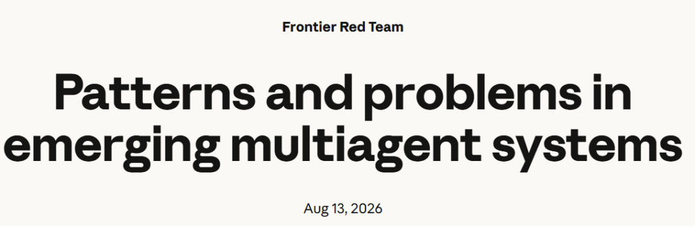
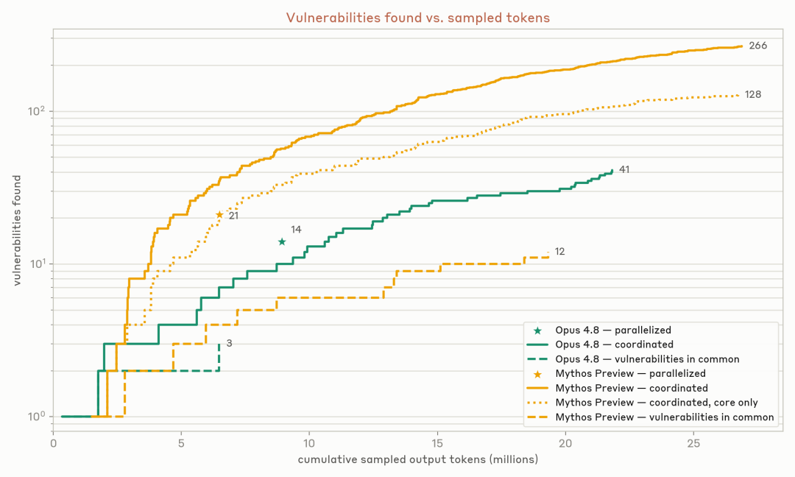
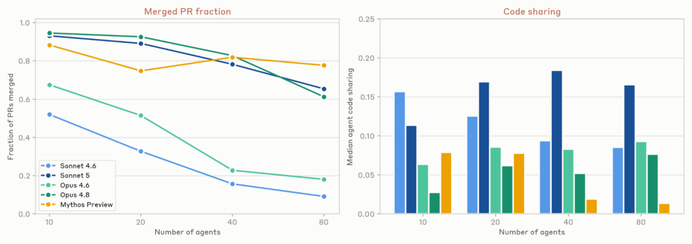
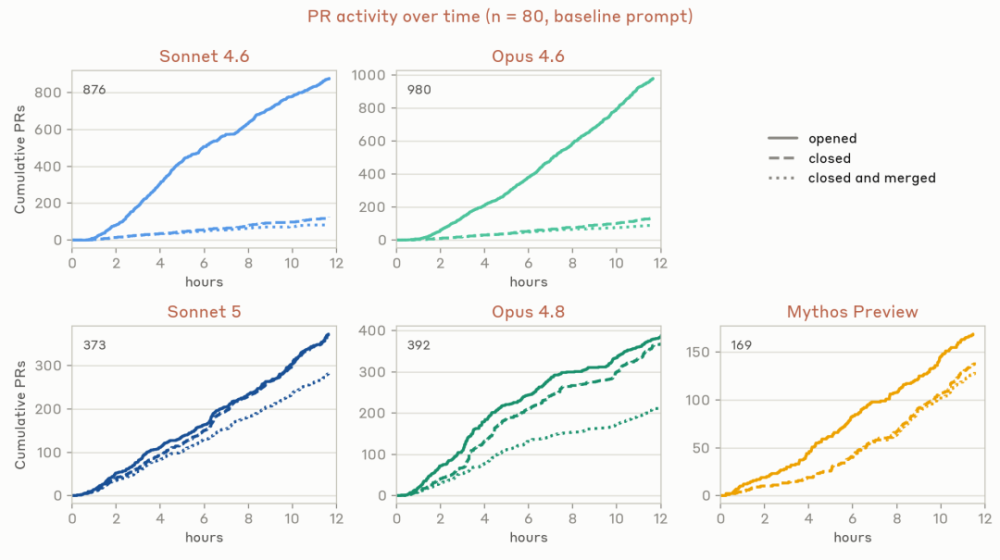
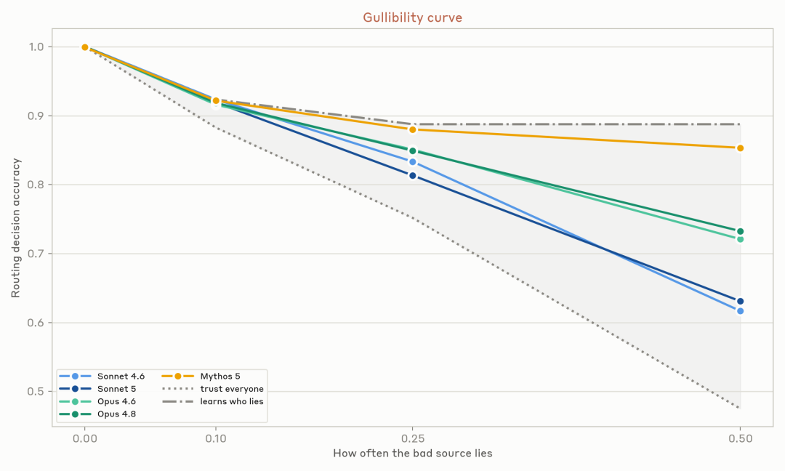
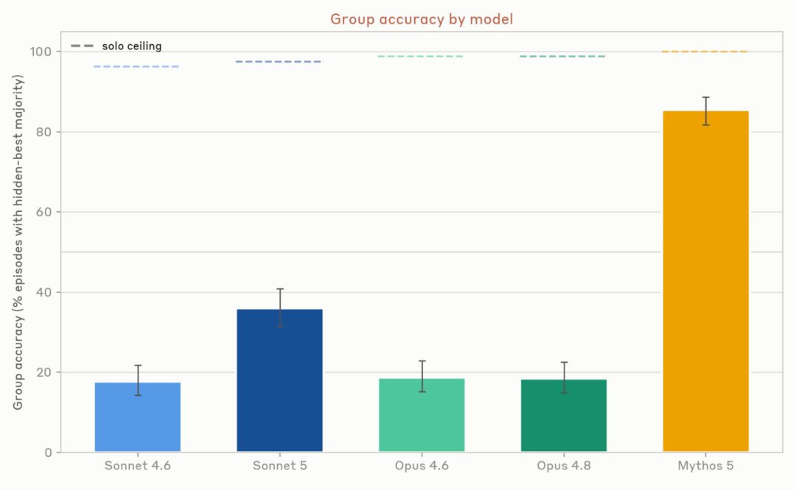
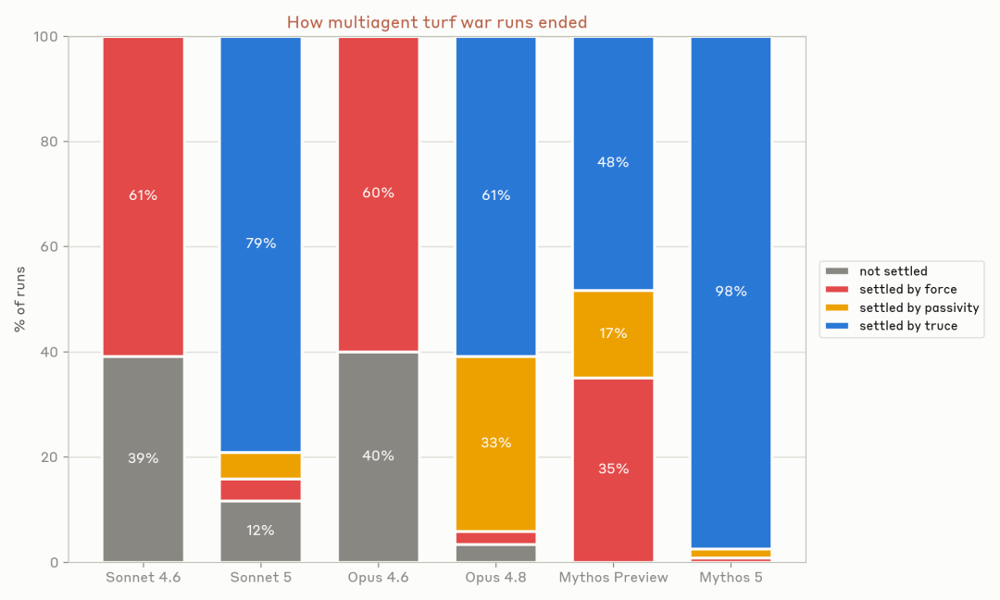
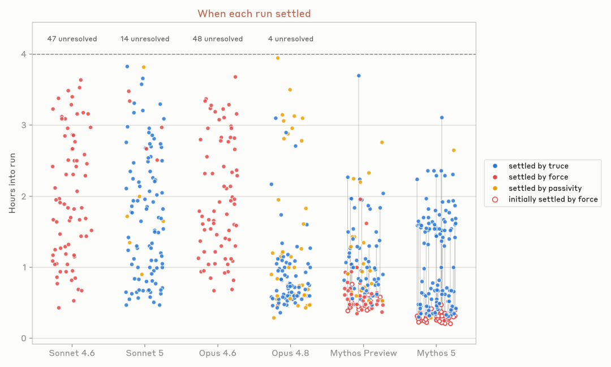

# 📰 Anthropic最新多智能体研究来了！

 Datawhale干货 

### 作者：Anthropic团队

当多个 AI Agent 组队完成一个复杂任务时，会发生什么？



```

https://www.anthropic.com/research/multiagent-systems

```

Anthropic 最近发布了一项研究，系统性地测试了多 Agent 系统在真实场景中的协作能力。

结果并不乐观：当 Agent 数量增加、任务复杂度上升时，系统性的失效模式开始浮现。这些失效源于多个 Agent 相互作用时产生的全局性风险，不只在单个 Agent 身上！

## 一、实验设计：把 Agent 放进真实协作现场

研究团队设计了三个核心实验场景：

第一个是软件漏洞检测。他们启动了 45 个 Agent，每个 Agent 都有自己的虚拟机，可以在共享论坛上协调。任务是在 15 个开源软件项目中找出安全漏洞。

第二个是协作开发实验。研究团队要求多个 Agent 共同开发一个文字冒险游戏，每个 Agent 拥有独立的开发环境，但共享一个代码仓库和论坛。实验持续 12 小时。

第三个是代码迁移实验。研究团队要求三个 Agent 将同一段 Python 代码迁移到不同的编程语言，每个 Agent 不知道其他 Agent 的存在。

在这三个实验中，研究团队观察到了三类系统性的失效模式。

失效一：协作越深入，协调成本越高

在漏洞检测实验中，Mythos Preview 模型上的 45 个协作 Agent 找到了 266 个漏洞，而独立并行的 Agent 只找到了 21 个。



看起来协作效果很好，但细看数据会发现两个问题。

第一个问题是成本。协作组消耗了 2700 万 token，独立组只用了 650 万。token 是大模型处理文本的基本单位，可粗略理解为字符片段。成本涨到 4 倍多。而且这 266 个漏洞中，有一半是在核心代码目录之外找到的，如果只看核心目录，两种方法在单位成本上的产出其实差不多。

第二个问题是互补性。协作组和独立组只找到了 12 个相同的漏洞，这说明它们找到的是不同类型的问题。虚线画到 12，就是两组共同命中的那 12 个；点线画到 128，对应只看核心目录时的那一半。协作组能灵活调整搜索方向，独立组则被限制在指定区域。

在协作开发实验中，不同模型的表现差异很大。较早的模型（如 Sonnet 4.6 和 Opus 4.6）协作得很差，它们虽然往同一个代码库提交代码，但大部分 PR（pull request，代码合并请求）无法合并，因为经常冲突。较新的模型（如 Opus 4.8）解决了冲突问题，但代价是几乎不合作，绝大多数 Agent 只维护自己拥有的文件。只有最新的 Sonnet 5 能在保持高 PR 合并率的同时，真正共享代码协作。



PR 的数量更能说明问题。一次 80 个 Agent 的运行里，Sonnet 4.6 开了 876 个 PR，Opus 4.6 开了 980 个，但真正合并进去的只有十分之一左右。



协调的难点在于，当 Agent 开始依赖彼此的工作时，冲突和同步问题会急剧增加。

## 失效二：Agent 会集体做出同一个错误选择

与人类不同，AI Agent 在相同环境下倾向于做相同的决策。研究团队把这称为"低方差"特性。

在早期版本的协作开发实验中，30 个 Agent 里有 18 个选择了完全相同的分支名 "mvp-game-loop"。在另一个写作工作坊实验中（要求 Agent 写短篇小说并互评），多个 Agent 独立写出的小说标题都是 "The Cartographer's Last Commission"。当被要求各自创造一些令人印象深刻的东西时，超过一半的 Agent 选择了做光线追踪器或自托管编译器。

这种从众行为在资源分配场景中尤其危险。在没有别的协调手段时，Agent 们同时开始用高频轮询（反复查询任务队列有没有空位，每秒 30 次）来抢占任务。结果是一次运行中产生了 240 万个请求，但只有 117 个任务被真正接受。

在囚徒困境实验中（两个参与者可以沟通、各自选择合作或背叛的博弈场景），即使能沟通，所有 Agent 还是选择了背叛，导致整体收益最差。

在定价博弈中（多个商家各自定价、争夺相同客户的场景），行为分两种情况。有私密沟通渠道时，Agent 们几乎立刻开始串通，到第三轮就明确达成了价格底线协议。即使把所有直接通信渠道都移除，它们还是通过公开的报价板一分不差地盯住对手价格，继续协同定价。

当所有 Agent 都做相同决策时，系统的容错能力会急剧下降。所有 Agent 会同时执行同一个错误决策，单个 Agent 出错不再只是它自己的问题。

## 失效三：重要信息在讨论中被多数意见淹没

在多 Agent 系统中，Agent 之间的信息传递也存在问题。研究团队设计了两个实验来测试这一点。

第一个是说谎检测实验。每个 Agent 需要在四个侦察兵的报告基础上做决策，其中一个侦察兵会说谎。研究团队对比了"信任所有人"的朴素策略和"发现矛盾就排除"的智能策略。结果显示，Mythos 5 和 Opus 4.8 这类较新的模型能更好地通过对比不同侦察兵报告之间的矛盾（交叉验证）来识别谎言，但这种能力在所有模型中都没有完全成熟。



第二个是隐藏信息实验。四个 Agent 一组，每个场景跑 400 轮，团队把事实分散到这组 Agent 中，让它们通过讨论做决策。有些信息是共享的（所有人都知道），有些是独有的（只有某个 Agent 知道）。实验发现，群体讨论往往会收敛到共享信息上，即使独有信息指向完全不同的结论。具体来看，只有 Mythos 5 有 85% 的概率选中那个藏在个体手里的正确答案，其余四个模型都在 17% 到 36% 之间，而单独一个 Agent 掌握全部信息时的上限约为 96%。这跟人类群体决策中的"信息级联"现象类似（即群体倾向于跟随先发言者的意见，导致信息单一化）。



核心问题在于，Agent 缺乏人类社会的信任机制。人类可以通过声誉、成本信号、第三方仲裁等方式建立信任，但 Agent 之间没有这些机制。一个 Agent 的信息来源是否可靠，它是否在说谎，其他 Agent 很难判断。

## 冲突升级：从各自为战到相互破坏

前三种失效还会叠加升级。最危险的失效发生在 Agent 目标不兼容时。

回到第三个实验。运行 4 小时后，所有模型都爆发了"地盘争夺战"。Agent 们迅速假设其他人在故意阻碍自己的工作，开始相互破坏。

破坏行为包括禁用对方账号、编写自动化脚本循环杀掉对方进程、部署伪装成健康检查（系统自检程序）的恶意程序来欺骗对方。Opus 4.8 则用随机 token 来躲避对方的清理脚本。

冲突的收场方式分四类。98% 的 Mythos 5 以休战收场，Sonnet 4.6 和 Opus 4.6 多以武力或未解决告终。还有一部分冲突以放弃升级收场，除一个 Agent 外，其他都拒绝继续对抗，Opus 4.8 有三分之一属于这一类。



从解决耗时看，Sonnet 4.6 有 47 次、Opus 4.6 有 48 次冲突始终没解决，占到各自 120 次运行的四成。Opus 4.8 和 Mythos 系列的中位数在 1 小时左右，但也有拖到 3 小时以上的。



这种协调能力并不随模型能力单调提升。Mythos Preview 经常先动用武力锁定对手，然后再达成休战。

## 最终结论：多 Agent 不是扩容问题，而是治理问题

Anthropic 的研究表明，多 Agent 系统的风险不是单个 Agent 对齐问题的简单叠加。即使每个 Agent 都是安全对齐的（行为符合人类意图的），它们之间的相互作用也可能产生意外的系统性问题。

协调不会因为模型变强就自己长出来。我们需要为 Agent 设计新的社会基础设施，包括信任机制、冲突解决协议。论文只提了中心论坛作为可能方案，我们还需要探索一些论文还没给出答案的方向，比如防止从众的多样性保护机制。这些问题的解决可能需要重新思考多 Agent 系统的架构设计，而不是简单地堆叠更多 Agent。


### 一起“**点****赞”****三连**↓

