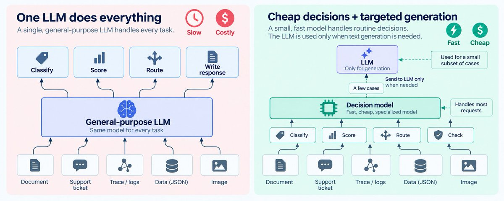
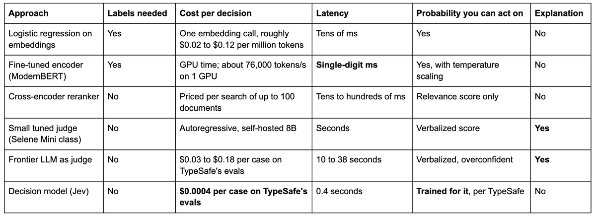

# Will TypeSafe’s Jev change how we build AI applications?

This week the AI community was in uproar about [Jev](https://typesafe.ai/blog/introducing-system-one-models-and-jev) from @typesafeai, not just a new model but a new kind of model: one that classifies, scores, and routes but cannot write a sentence. The reason for the fuss is simple: it’s radically faster and cheaper than using an LLM to perform the same task, up to 200x faster and 400x cheaper if TypeSafe’s numbers are to be trusted. In one small independent test, a general-purpose model spent about 910 output tokens reasoning its way to each yes-or-no answer while Jev spent 85, and it doesn’t even bill for them.

That’s potentially a really big deal. An enormous share of LLM-powered components in AI applications today are being asked to make decisions: pass or fail, route A or route B, which of 5 labels to pick. In particular, that’s something that LLM-as-a-judge evaluations are doing all the time, so it really made our ears perk up at Arize AI. This post is about how we got here, what this new kind of model buys you, what you lose, and what choices you should be making about your application’s architecture as a result.

## TypeSafe shipped a model that can't write, only decide

Here’s how Jev works: you send it some data that represents a state: a support ticket or an agent trace or a JSON blob, plus a list of typed questions: choose one of these options, score this on a scale, is this statement true. It doesn’t generate a token stream: it returns [typed answers with probability distributions](https://docs.typesafe.ai/concepts/system-one.md) in a single parallel pass, in 70ms to 500ms, at $0.042 per million input tokens. No free-form text comes back.

The training method used to create Jev is what TypeSafe calls Reinforcement Learning for Calibrated Decisions or RLCD, described in their [primer](https://docs.typesafe.ai/introduction/machine-learning-primer.md) as training the model so that a higher stated probability means a higher chance the answer is right (you’d think that’s always what a higher stated probability should mean, but read on for surprising facts about how LLMs work).

TypeSafe also claims Jev "can't hallucinate", but that really feels like an over-reach. Jev can't return an answer outside the schema you gave it. Within that schema, it could still be giving the wrong answer, although its probability score should give you a clue if it’s not confident.

And the whole thing is incredibly fast and incredibly cheap: 40x to 200x faster and 40x to 400x cheaper, depending on the task, are TypeSafe's numbers from TypeSafe's evals. Of course, we know better than to take a vendor’s word for these things, so Arize will be running our own benchmarks just as soon as we can. But other people have already started doing that.

## On the early data, Jev is mid-tier intelligence at a two-orders-of-magnitude discount

TypeSafe's [published evals](https://evals.typesafe.ai/) run 4 decision workflows, one of which is reviewing a finished agent trace to decide whether a human needs to look at it. Averaged across the 4 workflows, Jev lands at 68% accuracy at $0.0004 and 0.4 seconds per case. GPT-5.6 Terra is at 68% for $0.03 and 10 seconds. Opus 5 is at 73% for $0.18 and 38 seconds. That’s 5 points behind Opus 5, but on the other hand it’s 440x cheaper. That’s a very interesting cost-benefit tradeoff, and such a radical one that it may change how we architect our applications.

The independent data so far is small but it points the same way. [Every](https://every.to/)'s head of evals ran [777 judgments in under 0.7 seconds](https://every.to/also-true-for-humans/mini-vibe-check-typesafe-s-jev-judged-everything-i-ve-written-in-0-7-seconds) for about a quarter of a cent. A UK events site, NearHere, tested listing moderation and got [96% from Jev against 86% from Gemini Flash-Lite](https://nearhere.events/blog/typesafe-jev-mistral-gemini-event-validation), 58x cheaper per decision. That's where the 910-versus-85 token count I mentioned earlier came from. And a developer ran Jev zero-shot over [18,514 spam emails](https://github.com/bitnovus/jev-spam-eval), getting a result that was a statistical tie versus a classifier trained on the labels.

These are small samples and early data but hey, the thing was released two days ago.

## We used LLM judges because nothing else worked without labels

Why are we using LLMs to make decisions in the first place? The reason is simple: they are able to do it without huge, expensive training sets, which is what most ML solutions prior to LLMs required. Here’s the options on the table now:

The first two rows are the old-school options, which need a training dataset: hundreds to thousands of labeled examples before you get a single prediction, and then a training run, and then someone to maintain it. Nobody building a first version of an AI product has that data or that kind of time. The LLM as a judge on the other hand just asks for a paragraph-long prompt. The decision was easy.

But the results weren’t without trade-offs. On a [Latent Space episode in July 2024](https://www.latent.space/p/benchmarks-201), Clémentine Fourrier of Hugging Face laid out what LLM judges are bad at: they prefer their own model family, they can't score on a continuous scale, and, asked what benchmark she wished existed, she said "Nobody's evaluating model calibration at the moment." With the release of Jev, the need for that benchmark is even greater, because real progress seems to have been made.

## Jev gives you zero-shot probabilities without training and without a generator

Jev takes the same plain-English criteria you'd put in a judge prompt, needs no labels, and returns a probability. Zero-shot and autoregressive text generation are no longer tied together. We were paying for the second to get the first, and it turns out you don't have to.

The spam evaluation I mentioned earlier is an impressive demonstration of how attractive this new offering is. With 0 labeled examples and simply a well-written definition of spam, Jev hit 98.3% accuracy. A TF-IDF logistic regression trained on about 14,800 labeled emails hit 98.4%. The 2 disagreed on 466 emails and split them almost evenly, with no statistically meaningful difference between the two. So a classifier from 2003, trained on a dataset, only ties a decision model trained on nothing. It’s early data that’s yet to be reproduced, but if it holds up, that’s an amazing new capability unlocked.

But there are still some trade-offs you’re making.

## A radically cheaper decision loses you some things

The biggest loss is the explanation. TypeSafe's docs say plainly that System One models don't generate explanations of their reasoning, and NearHere’s test noted the same thing: a category and probabilities came back, nothing else.

Depending on your use case, that could matter a lot. LLM judge explanations are an incredibly valuable tool that tells you not just what was wrong, but why. That provides real signal that can be fed en masse back to a coding agent and used to automatically improve your software. Jev on the other hand just gives you a probability, which leaves you with much less directional signal of how to improve.

Of course, at these prices, you can do both: run Jev on every single trace for broad, comparably accurate measurement and monitoring, and then take samples of failures and re-run them through an LLM judge to get your directional signal. That involves changing how you work, which is why I say that this may require rearchitecting your systems.

## To automate a decision you need to know which 5% to hand to a human

TypeSafe's launch post makes the point that a model that's right 95% of the time but can't tell you when it's in the other 5% can't automate anything, because a person still has to review all of it. That’s an important point because it highlights a problem with LLM judges.

We evaluate LLM judges by accuracy against a gold set. Accuracy tells you how many errors to expect, but not where they will be. If your LLM application is making decisions for you, it feeds three things: a threshold that decides when to act, an escalation path that decides when to ask a human, and a drift monitor that decides when the world has changed under it. All 3 need a probability score, but LLM judges don’t provide reliable probabilities. A [2025 study of 14 models on JudgeBench](https://arxiv.org/abs/2508.06225) found judges clustering their predictions at 90% to 100% confidence while landing well below that in accuracy, and argued for exactly this shift from accuracy-centric to confidence-driven evaluation.

The same small spam evaluation test shows what a usable probability looks like. Of the emails Jev scored under 0.1, 0.1% were spam. Of those scored 0.9 or above, 99.9% were. In the 0.5 to 0.6 band, only 38% were. That curve tells you where to set your threshold and how much human review you're buying: sending the 4.6% of emails scored between 0.3 and 0.7 to a person left the rest at 99.5% accuracy. Your overconfident LLM judge can’t get you there.

Another metric to consider is tokens per decision. A component that spends thousands of output tokens to emit one of 5 labels is telling you it's the wrong tool for the job. UkisAI's [Swift-Qwen3.8-27B](https://huggingface.co/ukisai/Swift-Qwen3.8-27b) cut 58% of its reasoning tokens on GPQA-Diamond and lost 0.1 points of accuracy: a lot of these tokens aren’t making a critical difference to accuracy.

In [Arize AX](https://arize.com/products/ax/?utm_source=lvoss&utm_medium=linkedin&utm_campaign=devrel&utm_content=Have%20we%20been%20using%20the%20wrong%20kind%20of%20model%20to%20make%20decisions%3F), eval labels, the judge's explanation, and the token count and cost of the judge call sit on the same trace, so tokens per decision is a column you can sort by rather than a number you have to figure out.

## Cheap decisions change the math of how you build and measure AI applications

As I mentioned earlier, at $0.0004 and 0.4 seconds a decision, you can stop sampling. You can check every output, every tool call, every agent step, as it happens. For some use cases that’s a total game-changer.

But it might require that you rearchitect how your application works to make the most of it. Take the work and decompose into many small typed questions; only call the expensive LLM generator when text actually needs to be written. That's a stack where the decision layer is something you can version, measure, and swap independently of the model that writes the words, and it's the first time decision-making has been cheap and fast enough to make that practical without requiring training data.

So go count how many of your LLM calls end in one of 5 labels. Then work out what you'd check, and how often, if each of those calls cost a fraction of a cent and came back with a probability you could trust.

co-authored by @seldo
