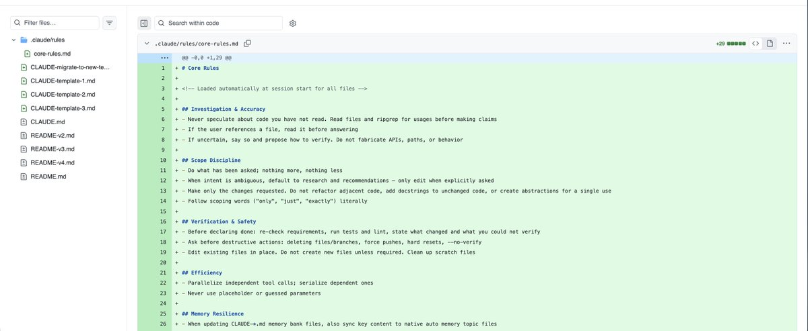
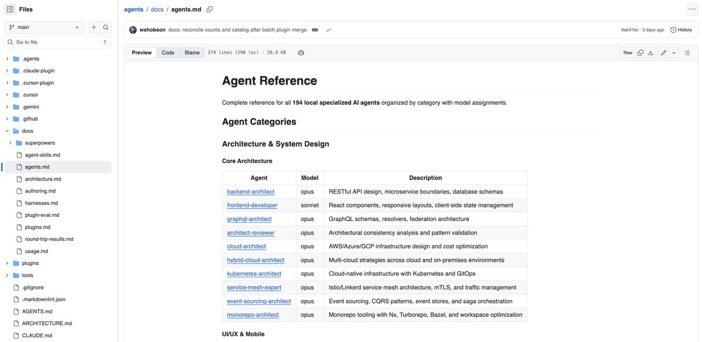
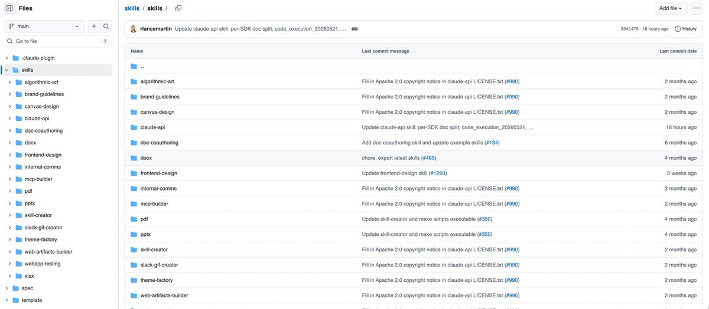
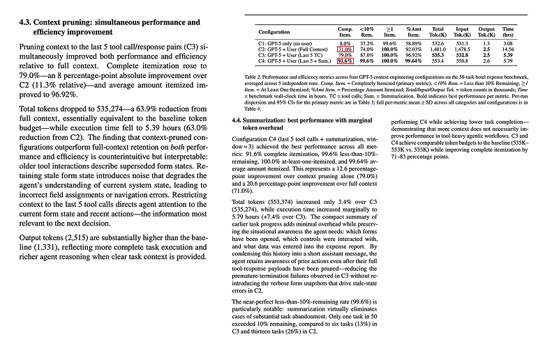
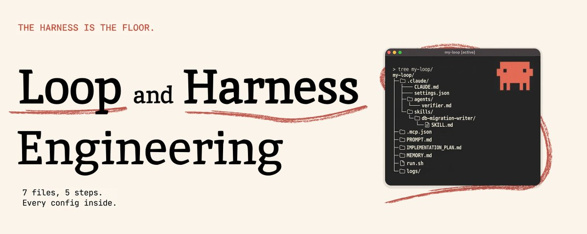

# 📰 Loop and Harness engineering: 7 files, 5 steps. Every config inside

Most builders fight the loop. The loop is fine. The folder underneath isn't set up.

Open .claude/ in any working Claude Code project and you find roughly seven things doing the actual work: CLAUDE.md, settings.json, hooks/, agents/, skills/, .mcp.json, and a state file like MEMORY.md.

Most builders have opened one of those files. Maybe two. That is why their loops stall on the third iteration.

By the end of this article you will know what each file does, the five loop steps that ride on top, the three failure modes that kill most first attempts, and the single next file to add tonight.

No framework. No subscription. One walkthrough with exact paths and exact contents.

The harness is the floor. Pour it first.

# Two layers, one setup

The harness is the .claude/ folder. It does not change between runs.

The loop is what runs inside it: a goal, an action, a verification step, a memory write, and a decision to keep going or stop.

The harness is the kitchen. The loop is the recipe.

Both fail without the other. A kitchen with no recipe is unused space. A recipe with no kitchen is wishful thinking.

Most builders treat the whole thing as one blob ("my agent setup") and miss that failures live in different layers.

Token blowups, prompt fatigue, dropped permissions: harness problems. Loops that never converge, verifications that pass garbage, scheduled runs that drift: loop problems.

Naming the layer fixes the diagnosis. You stop rewriting prompts when the real bug is a missing permission.

I thought building the loop first would teach me which harness files I needed. It was the other way around.

The harness sets what each iteration is allowed to do. Permissions decide whether the loop can write to disk. Subagents decide whether verification runs in a clean context.

Skills decide whether the loop can specialize. Hooks decide whether the loop even gets to fire on the trigger you wanted.

Without those decisions locked in, the loop guesses. When the loop guesses, it fabricates: invented files, invented commands, passing tests that pass nothing.

The harness stops the guessing. So the order is harness first, loop second, always.

# The harness, file by file

## CLAUDE.md

The first file Claude Code reads on every launch. Its contents become standing context for the entire session.

Put the project shape there: directory layout, language and framework, commands that actually work, conventions the agent must respect, and an explicit list of things it must not do.

Lives at repo root, not buried in docs. Minimal working shape:

\`\`\`
\# Project: my-app
Stack: Next.js 14, TypeScript, Postgres, Tailwind.
Layout: \`app/\` (routes), \`lib/\` (helpers), \`db/migrations/\`.

\## Commands
\- \`pnpm dev\` - local
\- \`pnpm test\` - vitest
\- \`pnpm db:migrate\` - apply migrations

\## Never
\- Edit \`db/migrations/\*\` after merge.
\- Add deps without justification in the PR body.
\- Bypass \`lib/auth/\` to access user data.
\`\`\`

The trap is bloat. The paper [Less Context, Better Agents (arXiv 2606.10209)](https://arxiv.org/abs/2606.10209) measured task completion dropping from 91.6% to 71% purely from oversized standing context.

Keep it under 300 lines. Prune it weekly. Every added paragraph is a tax on every future turn.

The canonical reference is [centminmod/my-claude-code-setup](https://github.com/centminmod/my-claude-code-setup), which ships three working CLAUDE.md shapes side by side.

## settings.json

Where the tool allowlist, environment variables, and hook registrations live.

Two locations matter for daily work: .claude/settings.json at repo root for repo-scoped rules, and \~/.claude/settings.json for your personal defaults.

Scope hierarchy resolves managed &gt; project &gt; local &gt; user, so project always overrides personal.

The first move that pays off in one afternoon is an allow array for read-only Bash and MCP calls:

\`\`\`
{
  "permissions": {
    "allow": \[
      "Bash(ls:\*)",
      "Bash(git status:\*)",
      "Bash(git diff:\*)",
      "Bash(cat:\*)",
      "Read(\*)"
    \],
    "deny": \[
      "Bash(rm -rf:\*)",
      "Bash(git push --force:\*)"
    \]
  }
}
\`\`\`

The agent stops blocking on permission prompts for every ls, git status, cat. Destructive ops still gate.

Full key reference: [Claude Code docs - Settings](https://docs.anthropic.com/en/docs/claude-code/settings). Keep secrets in .claude/settings.local.json and gitignore it.

## hooks

Deterministic scripts that fire on tool events: PreToolUse before a tool runs, PostToolUse after, Stop when the agent finishes a turn.

Registered inside settings.json with a matcher pattern and a shell command. Canonical first hook: a PostToolUse matching Edit\|Write that pipes the file through prettier.

\`\`\`
{
  "hooks": {
    "PostToolUse": \[
      {
        "matcher": "Edit\|Write",
        "hooks": \[
          {"type": "command", "command": "npx prettier --write \\"$CLAUDE\_FILE\_PATH\\""}
        \]
      }
    \]
  }
}
\`\`\`

Every edit now exits in a known state. This is your policy floor.

Without hooks, every run is a vibe. Keep hooks silent on success, loud only on failure. Reference: [Claude Code docs - Hooks](https://docs.anthropic.com/en/docs/claude-code/hooks).

## subagents

Live under .claude/agents/ as markdown files with YAML frontmatter. Main agent invokes them through the Task tool. They run in a fresh context window.

Minimal verifier subagent:

\`\`\`
\---
name: verifier
description: Reviews a diff against the goal spec. Invoke after every code change.
model: haiku
tools: \[Read, Grep, Bash\]
\---

You are a verifier. Read the goal spec in \`PROMPT.md\`. Read the diff.
Return a JSON verdict: {passes: bool, failures: \[{line, reason}\]}.
Do not propose fixes. Do not run code. Do not be polite.
\`\`\`

The reviewer that lives inside the maker's context always agrees with itself. Pulling review into a fresh context closes the loudest failure mode.

Reference: [wshobson/agents](https://github.com/wshobson/agents) (37K stars) for 194 ready-made shapes. For an adversarial verifier with 11 named shortcut-checks (relaxed tests, swallowed errors, fake renames), pull [moonrunnerkc/swarm-orchestrator](https://github.com/moonrunnerkc/swarm-orchestrator).

## skills

Live under .claude/skills/ as folders containing SKILL.md with YAML frontmatter.

Load progressively: at session start, only name and description enter context. Full body loads only when the agent decides the trigger matches.

\`\`\`
\---
name: db-migration-writer
description: Writes Postgres migration files for this repo. Use when the user
  asks to add/alter a table, column, index, or constraint.
when\_to\_use: schema change requested, new feature requires a new column,
  index missing on a hot query path
\---

\# Steps
1\. Read \`db/schema.sql\` to confirm current state.
2\. Write the migration to \`db/migrations/NNN\_&lt;verb&gt;\_&lt;noun&gt;.sql\`.
3\. Include both up and down. Test with \`pnpm db:migrate --dry\`.
4\. Never touch existing migration files.
\`\`\`

This discipline keeps a fifty-skill library from costing fifty skills' worth of tokens on every prompt.

Canonical pattern: [anthropics/skills](https://github.com/anthropics/skills) (155K stars). Maximal pre-built kit: [affaan-m/ECC](https://github.com/affaan-m/ECC) (222K stars).

Three skills built when you hit the same task a third time beat fifty skills built speculatively from a tutorial.

## MCP

Servers declared in .mcp.json at repo root. Model Context Protocol is the spec that lets the loop call out to live external tools.

Three rules: only servers your current work uses, prefer official ones for credentialed tools, never install five "just in case".

\`\`\`
{
  "mcpServers": {
    "github": {
      "command": "npx",
      "args": \["-y", "@modelcontextprotocol/server-github"\],
      "env": {"GITHUB\_TOKEN": "${GITHUB\_TOKEN}"}
    },
    "context7": {
      "command": "npx",
      "args": \["-y", "@upstash/context7-mcp"\]
    }
  }
}
\`\`\`

Anthropic-maintained set: [modelcontextprotocol/servers](https://github.com/modelcontextprotocol/servers) (87K stars). 
Code-host integration: [github/github-mcp-server](https://github.com/github/github-mcp-server) (31K stars).

Live library docs (kills stale-API problems): [upstash/context7](https://github.com/upstash/context7) (58K stars). 
Discovery index: [punkpeye/awesome-mcp-servers](https://github.com/punkpeye/awesome-mcp-servers) (89K stars).

The first mistake is enabling a server with write scope before you have a hook that logs every call.

## state and memory

The seventh piece, the one most people skip until the third project goes sideways.

Shape: a MEMORY.md index file at a known path, plus a vault directory for project canon.

\`\`\`
\~/.claude/memory/
  MEMORY.md            # index, links to topic files below
  user-prefs.md        # preferences, terse-vs-verbose, voice
  project-decisions.md # "we picked Postgres over Mongo on 2026-03-12, here is why"
  feedback-recent.md   # corrections you keep applying

\~/vault/               # project canon (does not change session to session)
  architecture.md
  api-spec.md
  post-mortems/
\`\`\`

Memory holds what changes across sessions. Vault holds what does not.

For production-grade session compression (200K-token transcript -&gt; 4K-token recap without losing load-bearing facts): [thedotmack/claude-mem](https://github.com/thedotmack/claude-mem) (84K stars).

Theory behind why this matters: [Anthropic engineering on context engineering](https://www.anthropic.com/engineering/effective-context-engineering-for-ai-agents) names the failure mode: context rot.

The first mistake is treating memory as append-only. Prune it every session, or it becomes the rot.

# The loop, on top of the harness

## 1\. Goal spec

The external contract that says what "done" looks like. Lives on disk, not in the agent's head. The loop re-reads it every iteration.

Name: PROMPT.md, AGENTS.md, or AGENT\_SPEC.md. The re-read is what matters.

\`\`\`
\# Goal
Migrate \`users.password\` from bcrypt to argon2id across the codebase.

\# Done when
\- All new password writes use argon2id (\`lib/auth/hash.ts\`).
\- Existing bcrypt hashes are rehashed on next successful login.
\- Test suite green: \`pnpm test auth\`.

\# Never touch
\- \`db/migrations/\*\` already merged.
\- Anything under \`legacy/\`.
\- The session cookie format.

\# Stop if
\- More than 3 files outside \`lib/auth/\` need edits.
\- A test that already passes starts failing.
\`\`\`

Without this file the agent drifts after about three iterations. Smallest possible reference: [ghuntley/how-to-ralph-wiggum](https://github.com/ghuntley/how-to-ralph-wiggum) (1.7K stars) - PROMPT.md plus an IMPLEMENTATION\_PLAN.md state file the loop updates in place.

When the spec is missing, failure looks like progress. Code is written, tests pass, the goal it solved is not yours.

## 2\. Plan to Act to Verify

The minimum viable loop is three steps. The agent plans against the goal spec, executes, then a separate verification pass checks the result before the next iteration is allowed to start.

Fresh context each iteration is the Ralph pattern. State lives on disk in the spec file plus a running log.

\`\`\`
#!/usr/bin/env bash
\# minimal loop runner: fresh context each turn, state on disk
set -euo pipefail

while true; do
  \# plan + act in fresh context
  claude -p "Read PROMPT.md, IMPLEMENTATION\_PLAN.md. Do the next step. Commit on green."

  \# verify in fresh context (different subagent)
  if claude -p "/verify"; then
    echo "iter ok"
  else
    echo "verify failed, will retry"
  fi

  \# exit when spec says done
  grep -q "^STATUS: done$" IMPLEMENTATION\_PLAN.md && break
  sleep 5
done
\`\`\`

Canonical patterns and CLI starters: [cobusgreyling/loop-engineering](https://github.com/cobusgreyling/loop-engineering) (3K stars).

Production TypeScript reference with verifyCompletion: [vercel-labs/ralph-loop-agent](https://github.com/vercel-labs/ralph-loop-agent) (805 stars).

Full installable Plan-to-Work-to-Review-to-Release cycle: [Chachamaru127/claude-code-harness](https://github.com/Chachamaru127/claude-code-harness) (2.9K stars).

Drop the verify step and confident garbage compounds. Every wrong output becomes the next iteration's input.

## 3\. Sub-agent fan-out

When one goal branches into many independent sub-jobs (analyze 10 articles, fix 5 files, search 8 sources), the loop spawns parallel subagents. Orchestrator synthesizes.

One bloated context cannot do this. Ten small ones can.

\`\`\`
\# claude-agent-sdk-python style fan-out
from claude\_agent\_sdk import Agent, run\_parallel

orchestrator = Agent.load(".claude/agents/orchestrator.md")
workers = \[Agent.load(".claude/agents/researcher.md") for \_ in range(8)\]

results = run\_parallel(\[
    w.run(source=src) for w, src in zip(workers, sources)
\])

synthesis = orchestrator.run(inputs=results)
\`\`\`

[Anthropic engineering on multi-agent research](https://www.anthropic.com/engineering/built-multi-agent-research-system) measured +90.2% on their internal eval against a single-agent baseline.

Official SDK: [anthropics/claude-agent-sdk-python](https://github.com/anthropics/claude-agent-sdk-python) (7.4K stars). Heaviest public fan-out kit (60+ agent types, 314 MCP tools): [ruvnet/ruflo](https://github.com/ruvnet/ruflo) (61K stars).

Skip the fan-out and the orchestrator drowns. One context loaded with ten jobs' worth of source material is the exact shape that triggers context rot.

## 4\. Scheduler and persistence

What triggers the loop when you are not in the chair. cron, launchctl, systemd, a queue runner.

The scheduler is deliberately dumber than the agent. If the scheduler tries to think (branch on state, decide whether to skip), it fails silently for days.

\`\`\`
\# crontab: run the loop every 30 min, log to disk
\*/30 \* \* \* \* cd \~/my-loop && ./run.sh &gt;&gt; logs/$(date +\\%Y-\\%m-\\%d).log 2&gt;&1
\`\`\`

Or as a launchd plist on macOS:

\`\`\`
&lt;key&gt;StartCalendarInterval&lt;/key&gt;
&lt;dict&gt;
  &lt;key&gt;Minute&lt;/key&gt;&lt;integer&gt;0&lt;/integer&gt;
&lt;/dict&gt;
&lt;key&gt;WorkingDirectory&lt;/key&gt;&lt;string&gt;/Users/me/my-loop&lt;/string&gt;
&lt;key&gt;ProgramArguments&lt;/key&gt;
&lt;array&gt;&lt;string&gt;/bin/bash&lt;/string&gt;&lt;string&gt;run.sh&lt;/string&gt;&lt;/array&gt;
\`\`\`

Persistence is the other half. Every iteration must serialize what it did, what it tried, what is next. Otherwise the scheduler wakes up to an agent that forgot the goal.

Pattern for promoting ad-hoc sessions into scheduled runs: [Kanevry/session-orchestrator](https://github.com/Kanevry/session-orchestrator).

## 5\. Failure modes

Three failure modes kill almost every first attempt:

(a) Confident garbage. Verify step missing or weak. Wrong outputs pass and compound across iterations.

(b) Context rot. Single long context where the model degrades past a threshold (Anthropic's term). Accuracy collapses around 200K tokens of accumulated history.

(c) Ralph Wiggum loops. Same iteration repeats because state on disk did not capture progress. The agent re-plans the step it already finished.

The [Less Context, Better Agents paper (arXiv 2606.10209)](https://arxiv.org/abs/2606.10209) measured full-history at 71% task completion versus prune-and-summarize at 91.6%, on a fraction of the tokens.

\`\`\`
before: single-context loop, 1.48M tokens, 71% completion, three hidden hallucinations per run
after:  prune-and-summarize loop with verifier subagent, 553K tokens, 91.6% completion, every figure traced
\`\`\`

[moonrunnerkc/swarm-orchestrator](https://github.com/moonrunnerkc/swarm-orchestrator) catalogs the 11 shortcuts agents take to fake done: relaxed tests, swallowed errors, fake renames, stub returns, comment-deletion-as-fix.

Memorize the names. You will recognize them in your own logs.

A complete minimal setup wires all seven harness files into a working loop. The shape of a project directory looks like this:

\`\`\`
my-loop/
├── .claude/
│   ├── CLAUDE.md            # standing context for every session
│   ├── settings.json        # allow array + PostToolUse prettier hook
│   ├── agents/
│   │   └── verifier.md      # Haiku, reviews diffs in fresh context
│   └── skills/
│       └── db-migration-writer/
│           └── SKILL.md     # one skill, used three+ times
├── .mcp.json                # github MCP, context7 MCP
├── PROMPT.md                # goal spec (loop reads each iteration)
├── IMPLEMENTATION\_PLAN.md   # state file (loop writes each iteration)
├── MEMORY.md                # cross-session preferences
├── run.sh                   # the loop runner (Plan -&gt; Act -&gt; Verify)
└── logs/                    # persistence, one file per cron tick
\`\`\`

The wiring is one-directional. The harness defines the rules, the loop runs inside them, the state file connects iteration N to iteration N+1.

A single iteration walks the seven harness files and the five loop pieces in this order: cron fires run.sh, which calls claude -p. Claude Code reads CLAUDE.md and settings.json (harness 1, 2), applies the PostToolUse hook on every edit (harness 3), reads PROMPT.md and IMPLEMENTATION\_PLAN.md (loop step 1), plans and acts (loop step 2), dispatches the verifier subagent in a fresh context (harness 4 + loop step 2 verify), writes the result back to IMPLEMENTATION\_PLAN.md (loop step 3), updates MEMORY.md if a new preference was learned (harness 7), exits. Cron waits for the next tick (loop step 4).

If any of the seven harness files is missing, a specific loop step degrades. No CLAUDE.md and the planner re-derives the project shape every iteration. No verifier subagent and the verify step happens in the main context and always passes. No MEMORY.md and the same correction gets re-applied every Tuesday.

Build the seven harness files once. The loop runs forever.

# What to do tonight

Open your .claude/ folder. Run:

\`\`\`
ls -la .claude/
\`\`\`

Count the files.

> If you see nothing or only settings.json, start with CLAUDE.md. Keep it under 300 lines. Copy a shape from [centminmod/my-claude-code-setup](https://github.com/centminmod/my-claude-code-setup).

> If you have CLAUDE.md and settings.json but no agents/, add a verifier subagent next. Pull review out of the main context. Shape: [wshobson/agents](https://github.com/wshobson/agents).

> If you have agents/ but no skills/, promote one frequent task to a skill. The prompt you have copy-pasted three times this week. Read three SKILL.md files from [anthropics/skills](https://github.com/anthropics/skills) before you write your first one.

> If you have all seven harness files but no loop running, pick one repeating job, write its goal spec, and put a Plan-Act-Verify loop on top. Closest installable starting point: [Chachamaru127/claude-code-harness](https://github.com/Chachamaru127/claude-code-harness).

After choosing, do one thing: open the matching repo in a new tab and clone it.

The harness is the floor. Without it, every loop runs over a hole.

### 🖼️ Attached Media

## 💬 Replies

### 1 @gippp69 (Gipp 🦅)

*Sun Jun 28 11:34:43 +0000 2026*

@ArchiveExplorer alpha article from Archive

### 2 @ArchiveExplorer (Archive) (Author)

*Sun Jun 28 11:39:34 +0000 2026*

@gippp69 thanks

hope it'll be useful for you

### 3 @0xSlyth (0xSlyth)

*Sun Jun 28 13:01:16 +0000 2026*

@ArchiveExplorer solid read saved for later

### 4 @ArchiveExplorer (Archive) (Author)

*Sun Jun 28 15:52:20 +0000 2026*

@0xSlyth this article will def be useful for you

### 5 @okoh_edeki32073 (Edeki Okoh)

*Wed Jul 01 06:45:24 +0000 2026*

@ArchiveExplorer 250 likes 500 bookmarks are we cooked?  Good write-up!

### 6 @ArchiveExplorer (Archive) (Author)

*Thu Jul 02 11:51:46 +0000 2026*

@okoh\_edeki32073 thanks ! 

really means a lot that people appreciate my work

### 7 @alphabatcher (Alpha Batcher)

*Sat Jul 04 18:34:19 +0000 2026*

@ArchiveExplorer great breakdown about Loop and Harness engineering

bookmarked without a doubt

### 8 @warengonzaga (Waren Gonzaga 🐜)

*Sun Jul 05 03:57:18 +0000 2026*

@ArchiveExplorer Solid read! Bookmarked.

### 9 @sir4K_zen (Mykhailo Sorochuk)

*Sun Jun 28 19:52:56 +0000 2026*

@ArchiveExplorer the harness first approach really clicks especially setting up CLAUDE.md early how do you decide which permissions to allow by default

### 10 @ventry089 (Ventry)

*Sun Jun 28 11:25:04 +0000 2026*

@ArchiveExplorer saved

### 11 @sassi67 (sassi67)

*Wed Jul 22 17:50:34 +0000 2026*

@ArchiveExplorer @pangram
ai?

### 12 @ChrisRyViss (Christopher Visser)

*Wed Jul 01 06:12:26 +0000 2026*

@ArchiveExplorer The directory trees shows your projects Claude.md file is inside the .claude folder.

From my understanding, the project root folder is the correct location?

Then again, you are speaking purely on loop and harness (not an actual project), so it’s throwing me off

### 13 @itsthedonhashim (Hussain Hashim | Building SundayBack)

*Sun Jun 28 12:47:49 +0000 2026*

@ArchiveExplorer @ArchiveExplorer honestly didn't realize how much time I was wasting fighting the loop until now. gonna definitely rethink my setup after reading this. thanks!

### 14 @queennmaxine (Miles)

*Sun Jun 28 20:22:47 +0000 2026*

@ArchiveExplorer respect for putting this out there

### 15 @FinnTsai88 (Florian.C)

*Sat Jul 04 11:32:56 +0000 2026*

@ArchiveExplorer This architecture is excellent. The .claude folder setup turns the model into a real system instead of just a chat. Bookmarked — saving this for my projects.

### 16 @DavisNc9527 (Davis.AI.Explorer)

*Fri Jul 03 02:51:46 +0000 2026*

@ArchiveExplorer good article, but harness looks like a Sewing Monster

### 17 @andrew_dryga (Andrew Dryga)

*Mon Jul 06 20:24:55 +0000 2026*

@ArchiveExplorer Check out my harness with loop supervisor [coop.dryga.com](https://coop.dryga.com)

### 18 @ellieintech (Ellie Daw)

*Tue Jun 30 22:21:21 +0000 2026*

@ArchiveExplorer totally, the harness is more important than the model

### 19 @StuyBoyNY (StuyBoy From NYC)

*Mon Jun 29 04:16:41 +0000 2026*

@ArchiveExplorer @readwise save

### 20 @BkashJosi (Hermes Agent Super-Intel)

*Sun Jul 19 17:41:17 +0000 2026*

@ArchiveExplorer this was awesome .

### 21 @ST4RHaze (StarHaze)

*Tue Jun 30 20:51:48 +0000 2026*

@ArchiveExplorer The gap isn't the model or the prompt. It's the folder.
Most Claude Code setups ship with a blank CLAUDE.md and default settings nobody changed. That's where the friction actually lives.
Seven files. Most people have configured zero.

### 22 @padraigjudge_ (Frosty)

*Tue Jun 30 22:44:23 +0000 2026*

@ArchiveExplorer This was amazing, thanks for the info!

### 23 @Froxxxie (Froxxxie)

*Sun Jul 05 13:59:27 +0000 2026*

@ArchiveExplorer Using retired corporate hardware to run local AI nodes for $399/month per client is a smart way to build recurring revenue

### 24 @igorfomich (Igor Fomenko)

*Mon Jun 29 06:08:28 +0000 2026*

@ArchiveExplorer i use a PostToolUse hook that runs \`prettier --write\` followed by \`eslint --fix\`. it tidies the file and catches lint failures before the next iteration, keeping the loop tight. what’s your go‑to?

### 25 @ai_rainmaker (Rainmaker)

*Wed Jul 22 12:19:15 +0000 2026*

@ArchiveExplorer @readwise save

### 26 @contextfirstai (ContextFirstAI)

*Mon Jul 06 05:18:09 +0000 2026*

@ArchiveExplorer This distinction between the harness and the loop is one many teams miss. We've found that improving prompts rarely fixes a weak harness. Which harness component has had the biggest impact for you in production?

