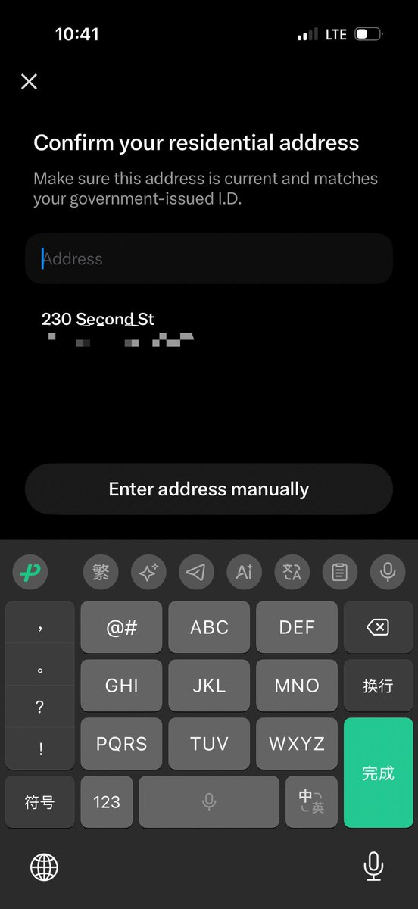

# 📰 𝕏 Money 推送到中文区啦，活期利息 6 个点，马斯克的美国版微信能否成功？（文末附开通方案）

2026年 7 月底，𝕏 Money 开始美国范围内推送；8 月 31 日起明显放量，中文区时间线上随处可见。

这不是一个简单的支付功能：马斯克在 𝕏 里装进了一家全功能"银行"，6% 的活期利息、3% 的消费返现、转账 0 手续费，工资还能提前两天到账,价码比所有银行都狠。

上一次有人这么砸钱抢存款,是十二年前 余额宝，年华6个点利息，规模冲成全球最大的货币基金。这篇文章讲清楚三件事:钱从哪儿来、这盘棋图什么、普通人怎么开通(条件与坑,见文末附录)。

## 一、产品与底座：社交 App 里长出了一家数字银行

𝕏 Money 不仅仅是一个转账功能，更像一家长在 𝕏 里的全功能数字银行，官网的自我介绍就是 “digital banking experience”（数字银行体验）。功能全景如下，均为官网 2026 年 8 月 31 日最新口径：

转账与收付

- P2P 即时转账：给任何 𝕏 用户转账，免费，完成身份验证后无限额；支持扫码、预约和定期转账；对方没开户，款项挂 14 天自动退回

- 入金渠道：ACH（免费，1 到 3 个工作日）、借记卡充值（即时）、零售网点现金充值（即时）、电汇（工作日下午 3 点前当日到账）、移动支票存款（拍照入账）

账户与收益

- 存款利息：最高 6.00% APY，日计息月付息；Premium+ 直接享受，Premium 达标后解锁，细节见第四章

- 年利息满 10 美元出具 1099-INT 税表

X Card 借记卡

- Visa 网络，开户即发虚拟卡，可申领金属实体卡，能定制显示你的 𝕏 用户名，卡面不印卡号

- 3% 现金返还，无上限，每 7 天自动入账；博彩、证券、税款等 22 类交易除外

- 全球 ATM 取现免费，第三方手续费 3 天内报销；没有外汇交易手续费

- 支持 Apple Pay 和 Google Pay；可锁卡、改 PIN、单独设消费限额

工资与支票

- 工资直存最多提前 2 天到账，内置 Pinwheel 一键换绑工资卡（Pinwheel 是常被类比为“工资流 Plaid”的薪酬数据 API，官方称其网络覆盖 1.7 万余家合作方、几乎全部美国直存发薪场景，App 内几步即可改绑或按比例分流工资）

- 创作者分成与订阅收入视同工资直存，这个设计的分量，第三、四章细讲

- 可在 App 内寄纸质支票（标准投递免费，两日达 25 美元），支持止付

安全与保障

- 强制 passkey 登录；可自定义交易限额与隐私控制；Visa Zero Liability 未授权交易保护

- 存款放在 Cross River Bank（FDIC 成员），标准保额 25 万美元；超额资金经 IntraFi 网络自动分散到合作银行，穿透保险合计最高 1000 万美元

- 7×24 小时客服，聊天机器人加真人，另有客服电话

费用几乎全免，唯一显眼的收费是 1.75% 的即时提现费，走 ACH 则免费。

对照微信支付，抄作业的痕迹很清楚：社交关系链内免费转账、扫码支付、储蓄目标空间（官网演示里的 Japan Trip、For Cybertruck 小金库）、快慢提现分层定价。但两处本地化改造更值得琢磨。

其一，它比微信支付更“银行”。微信支付本质是支付通道加零钱账户，利息从来不是武器；𝕏 Money 直接把高息存款做成首页卖点，还认真兼容了纸质支票。这个细节本身就说明，美国的支付土壤和中国有多不同。

其二，它把返现卡文化嫁接了进来。3% 无上限的借记卡返现在美国是核弹级参数，美国的主流借记卡几乎没有返现。在一个没有红包文化的市场，它选了美国用户最熟悉的激励语言。

这个形态的合规成本是三年。X Payments LLC 从 2023 年 6 月在新罕布什尔拿下第一张州级货币转移牌照开始，一张一张磕到 48 个辖区。最难的纽约在 2026 年 7 月 23 日生效获批（载于纽约金融服务局 7 月 24 日的每周银行业公报），四天之后 𝕏 Money 就全量发布，时间差说明纽约就是最后的卡点。

但 X Payments 自己始终不是银行。存款账户、发卡、FDIC 保险全部由合作银行 Cross River Bank 提供。American Banker 援引分析师的形容，把这类 BaaS 头部银行称作“军火商”（arms merchant）：把牌照和银行基础设施当弹药卖给科技公司，自己退居幕后。存款保险的设计颇为讲究：标准保额 25 万美元，经 IntraFi 网络自动分散到多家银行后，聚合上限可达 1000 万美元。注意，这是跨行分散后的聚合数，不是单一账户保额；X Payments 本身也不是投保机构。官网脚注把这些都写了，写得很小。

## 二、缘起：一场迟到 27 年的银行梦

𝕏 Money 是马斯克职业生涯里最长情的执念。1999 年他创立的 X.com 不是社交网站，而是一家网上银行，野心是把支票账户、保险、房贷全搬到线上。后来的故事众所周知：与 Confinity 合并，蜜月期间被董事会罢免，公司改名 PayPal，2002 年以 15 亿美元卖给 eBay。

他没有放下那个域名。2017 年 7 月，马斯克从 PayPal 手里买回 X.com，发推说：

> "Thanks PayPal for allowing me to buy back X.com! No plans right now, but it has great sentimental value to me."

> 感谢 PayPal 让我买回 X.com！目前没有什么计划，但它对我有重大的情感价值。

2022 年 10 月，收购交割前夕，他把底牌摊开：“Buying Twitter is an accelerant to creating X, the everything app.”（买下 Twitter 是创造万能应用 𝕏 的加速器。）对标微信是明牌，而他的原话比“西方版微信”野心大得多，那五个字其实是媒体的归纳，他本人从未说过。2023 年 10 月的内部全员会上（The Verge 拿到了会议录音），他说：

> "When I say payments, I actually mean someone's entire financial life. If it involves money. It'll be on our platform. Money or securities or whatever. So, it's not just like send $20 to my friend. I'm talking about, like, you won't need a bank account."

> 当我说支付的时候，我实际上指的是一个人的整个金融生活。只要和钱有关，它就会在我们的平台上。钱、证券，什么都算。所以这不只是“给朋友转 20 美元”，我说的是，你将不再需要银行账户。

当时他承诺 2024 年上线，实际迟到了差不多两年。迟到的原因，上一章已经说了：在美国，想碰别人的钱，你得一个州一个州地磕牌照。

## 三、商业模式：支付不为赚钱，为的是让别的业务赚钱

单看损益表，𝕏 Money 是台烧钱机器：6% 利率倒贴利差，3% 返现，P2P 免费，ATM 手续费全球报销，自己几乎不留利润空间。要理解这盘棋，得放回 𝕏 的整体处境里看：广告收入 2025 到 2026 年徘徊在每年 18 亿到 25 亿美元（多口径估计），只有 Twitter 2021 年峰值的一半；2025 年三季度单季净亏 5.77 亿美元。𝕏 缺的不是流量，是钱和粘性。

𝕏 Money 对 𝕏 的价值，按优先级大致有三层。

先是订阅飞轮。6% 利率是 Premium 订阅的钩子，免费用户根本不在利率表里，想吃利息先买订阅。订阅是 𝕏 在广告之外唯一成规模的收入线，𝕏 Money 等于给它装了增压器。下一章会算这笔账：补贴成本和订阅收入之间，存在一个精确设计过的平衡点。

再是创作者经济的资金闭环。这一层最有想象力，也最少被讨论：广告主付钱给 𝕏，𝕏 分给创作者，创作者的钱留在 𝕏 Money 里吃 6%（官网明文规定创作者分成视同工资直存），消费时刷 X Card，𝕏 再赚一道刷卡手续费；粉丝打赏和订阅创作者的钱，同样在体内循环。每个环节资金都不出体外。微信用红包织出了社交金融网络，𝕏 想用创作者的生计织同一张网，而且是更硬的一张：社交关系可以搬家，饭碗很难。

最后是留存与数据。绑了工资卡的用户不会轻易卸载 App。更值钱的是支付数据对广告的反哺：𝕏 的广告系统和所有社交平台一样，只能证明用户“看过、点过”，却看不到钱最后花没花；刷卡记录恰好是消费链路的终点，收入水平、消费品类、商户偏好，这些信号能把广告定向和转化归因抬到社交平台的天花板，而广告恰恰是 𝕏 最需要修复的业务。不过这一层官方从未明说，也不敢明说：拿银行账户数据喂广告系统，在美国会直接撞上金融隐私法规（GLBA）的高压线，Apple Card 当年反复强调交易数据不会被用于营销，就是为了绕开这里。𝕏 怎么走这条钢丝，本身就是个观察点。

风险同样清楚：三层价值全部建立在补贴撑得到飞轮转起来的假设上。𝕏 不是腾讯，没有游戏业务输血；母公司 xAI 融资的主战场是算力，不是存款补贴。

## 四、6% 这步棋：余额宝剧本的美国版，但补贴逻辑完全不同

4.1 利率的真实结构

根据官网利率页（2026 年 8 月 31 日最新口径）：

\| 档位 \| 基础 APY \| 达标后 APY \|
\|------\|----------\|-----------\|
\| X Premium（约 8 美元/月） \| 4.00% \| 6.00%（滚动 34 天内合格直存 ≥1,000 美元） \|
\| X Premium+（约 40 美元/月） \| 6.00% \| — \|
\| 免费用户 \| 不在利率表内 \| — \|

两个细节值得逐字读。其一，解锁 6% 的“合格入账”（Qualifying Deposit，8 月底条款已从“合格直存”悄悄放宽至此）既包括 ACH 工资直存，也包括 X Creator payout——创作者的原创内容奖励、广告分成与订阅收入。创作者的钱只要不提走，就自动解锁 6%，好爽啊。这正是上一章那个资金闭环的利率引擎，而且条款的每一次放宽都在把这个飞轮拧得更紧。其二，脚注原文写着：“APY and interest rate are variable and subject to change at any time.”（APY 与利率为浮动利率，可随时调整。）换句话说，6% 不是承诺，是定价，而定价随时可以改。

4.2 补贴算账：每一块钱存款都在烧钱，但烧得可能很划算

6% 有多离谱？三个参照系：美联储当前的基准利率是 3.50% 到 3.75%；FDIC 统计的全美储蓄账户平均利率是 0.38%；同期高息产品里最高的 Chime Prime，也只有 3.75%。

这里必须厘清它与余额宝的本质区别。余额宝当年的 6.76% 不是补贴，那是钱荒年代中国货币市场真实的价格，天弘只是把红利搬给散户，自己还赚管理费。𝕏 Money 的 6% 则是高出无风险利率约 240 个基点的人造利率：存款趴在 Cross River，𝕏 能拿到的批发收益率就在联邦基金利率上下，付 6% 意味着每美元存款每年倒贴约 2.4 美分。余额宝是顺水推舟，𝕏 Money 是逆水行舟。

但这笔补贴可能烧得很划算。有分析算过：一个 Premium 用户存 1,600 美元，一年生息 96 美元，恰好覆盖 Premium 全年订阅费；而 𝕏 实际付出的补贴成本约 38 美元。花 38 美元保住 96 美元的订阅收入，外加一个绑了工资卡的深度用户，任何订阅制企业都会做这笔交易。

致命的边界在于，这套算术只对小余额成立。存 10 万美元的用户一年吃走约 2,400 美元补贴，订阅费才 96 到 395 美元。目前官网没有设余额上限，这是全文最值得盯住的观察点：哪天出现“前几千美元享 6%、超出部分降档”，就是补贴退坡的第一信号。历史剧本全指向这个方向，余额宝从 6.76% 一路降到 0.88%，SoFi 和 Robinhood Gold 都跟着美联储降过。

存款利率领域的资深观察者、DepositAccounts 创始人 Ken Tumin 的判断更直白：“It's a promo rate. Over time, expect the rate to fall inline with competitors.”（这是促销利率，假以时日，预计会回落到与竞品一致的水平。）

说到底，𝕏 Money 是在用银行业的成本结构给订阅业务买增长，赌的是监管真空期足够长、补贴退坡足够体面。6% 买来的资产，也就是用户关系、存款和订阅留存，才是长期的；6% 本身不是。

## 五、竞争格局：6% 砸进了一个人人都在降息的市场

𝕏 Money 入场的时机很微妙：美联储降息周期里，所有竞品都在下调利率，它反手挂出 6%；稳定币刚被立法禁止付息，合规美元账户的收益竞争出现真空。三类对手，三种威胁度。

P2P 网络短兵相接，但城墙最厚。Venmo 活跃账户破 1 亿；Zelle 一年跑 1.2 万亿美元，背后是 2,300 多家银行和信用社。𝕏 Money 的“免费无限额”针锋相对，但要撼动的是十年网络效应。金融科技分析师 Ron Shevlin 把 Venmo 和 Cash App 的根深蒂固，列为 𝕏 Money 的核心障碍之一；IDC 支付研究总监 Aaron Press 的判断更直接：“X Money will have an uphill climb.”（𝕏 Money 会是一场上坡仗。）

高息账户被 6% 碾压，但护城河不在利率。Chime 3.75%，Marcus 3.40%，Robinhood Gold 3.35%（订阅换利率，和 𝕏 Money 模式最像），SoFi 3.10%，而且全都在跟随美联储下调，唯独 𝕏 Money 反向定价，这进一步坐实了补贴获客的判断。neobank 们真正的防线是先发的直存关系，工资卡迁移成本极高，𝕏 Money 用一键换绑正面强攻这道墙。

稳定币则被监管替 𝕏 清了场。2025 年 7 月签署的 GENIUS Act 明确禁止稳定币发行人向持有人付息，立法动机恰恰是防止存款流向代币。结果是，3,000 多亿美元市值的稳定币在合规框架内无法用收益率跟任何人竞争。𝕏 Money 的 6% 之所以独一无二，一半功劳属于这个监管真空：稳定币不能付息，银行不愿付息，而它拿着带 FDIC 保险的存款账户付 6%。不过这道真空正在被重新谈判：2026 年上半年，白宫多次召集银行业与加密行业就稳定币收益条款拉锯，5 月参议院银行委员会通过的 Clarity 法案文本给出折中方案，禁止对闲置稳定币余额付息，但允许“活动型奖励”。禁令一旦松动，𝕏 Money 在收益率上独一无二的窗口就会开始关闭。

𝕏 自己的底牌则成色存疑。平台自 2022 年私有化后不再发布审计数据，MAU 第三方估计约 5.5 亿到 5.6 亿且在缓慢收缩，付费订阅数各方估计横跨二十倍。粗略推演（假设数百万订阅用户中三分之一开通、户均存入 2,000 美元），𝕏 Money 头一两年的存款规模在几十亿美元量级；余额宝当年上线五个月就吸走了 1,000 亿元人民币（彼时约合 160 亿美元）。对照之下，它距离动摇任何人的根基都还远。

## 六、抄得动与抄不动：美国长不出微信的四道墙

作业抄得认真，但有四道墙不是产品能力能翻过去的。

第一道墙，美国没有“支付荒地”。微信支付 2013 年起飞时，填的是信用卡远未普及、现金为王的真空；2026 年的美国，银行卡人手多张，Zelle 一年 1.2 万亿，Apple Pay 装在每台 iPhone 里。𝕏 Money 提供的不是从无到有，而是从 A 到 A+。增量体验对抗存量习惯，历史上胜率不高。

第二道墙，监管碎片化不可逾越。微信支付上线时背靠财付通现成的全国性支付牌照，几乎没有额外的准入成本，监管是几年后才补上的；𝕏 Money 光拿牌照就花了三年，头上还有 FinCEN、FDIC 广告规则，以及国会随时可能重启的支付应用监管。超级应用的本质，是一个 App 装下监管上属于五个部门的业务；在美国，这五个部门是真的会各审一遍。

第三道墙，刷卡手续费的天花板。3% 返现建立在 Visa 借记卡的刷卡手续费上（行业称交换费，interchange：商户每收一笔卡付款，都要向发卡侧支付一小笔费用），这套打法与 Chime 同源，依赖 Durbin 修正案对百亿美元资产以下银行的费率豁免。商户侧，美国零售商对刷卡费的怨气已经酝酿二十年，豁免随时可能被立法盯上；规模侧，一旦发卡行资产跨过豁免线，3% 的成本结构瞬间恶化。抄来的功能可以复制，抄不来的费率结构会自己找上门。

第四道墙是 𝕏 的自选难题：信任赤字。把钱交给平台和把注意力交给平台，是两种完全不同的信任。𝕏 官网 FAQ 里有一条所有竞品都不需要写的条款：如果你的 𝕏 账号因儿童安全或“暴力与仇恨实体”政策被封禁，你将失去 Money 的访问权限，余额以邮寄支票退还（其他违规封号不影响资金功能）。𝕏 专门写这一条，说明它自己清楚用户在怕什么；但这一条的存在本身，就是“言论平台管钱包”最直白的风险披露。马斯克是 𝕏 Money 最大的流量来源，也是它最大的单点风险，这句话反过来说也成立。

## 七、结语

笔者自己的判断，短期站在乐观一侧：接下来几个月到几十个月，𝕏 Money 的用户规模和创作者分成流水大概率还会大幅增长。𝕏 Money 正在放量，Premium+ 用户的余额直接享 6% 利息，对任何手里有闲置现金的人来说，“为存款搬家而开通 Premium+”是一笔算得清的账：存到 8,000 美元，利息就覆盖了全年订阅费，再往上全是净赚。存款拉动订阅，订阅补贴利息，创作者分成又把钱留在体内生息，三个轮子互相咬合，蛋糕会越滚越大。真正的分水岭不在需求侧，而在第四章那道边界：补贴的账能撑多久。

回到余额宝。2014 年的它证明，一个 6% 能在十八个月内把 5,700 亿资金搬出银行体系；它后来的十二年证明，高息是阶段性的，监管是必然到场的，而真正留下来的，是支付宝借那波存款搬家完成的心智占领。今天余额宝只剩 0.88%，但没有人卸载支付宝。

马斯克显然在按这个剧本行动：用一个不可持续的数字，去买一个可持续的位置。X.com 那个 1999 年的银行梦绕了 27 年回到原点，面前的题和当年一模一样：不是能不能把钱搬进来，而是能不能让人相信，钱放在这里比放在银行更好。上一次，给出否定答案的是董事会；这一次，轮到市场和监管投票。

## 

## 附：𝕏 Money 开通条件、方案速查与常见的坑

谁能开通（官网 2026-08-31 最新口径）：

- 官方口径要求美国居民，年满 18 岁；

- 𝕏 账号信誉良好；每人仅限用一个 𝕏 账号开户；

- 需通过身份验证（法定姓名、SSN 或 ITIN 税号、住址，必要时上传证件和自拍）ITIN 优惠价 699元：https://e.tb.cn/h.85sscIqEiSTjug3?tk=IbrugxzLMIF  和客户说 Asa 优惠即可

- 强制设置 passkey 登录。

- 实测开通过程中需要美国流量（漫游也可以的），非 VPN 流量 👇

[Embedded Tweet: https://x.com/i/status/2037437653071835440]

开通过程中的一些坑，见下面推文

[Embedded Tweet: https://x.com/i/status/2093638333809435105]

如果微信群满了，欢迎大家进这个群交流 𝕏 Mone[y](https://abs.twimg.com/emoji/v2/svg/1f449.svg)👉  

https://discord.gg/A3BA8R4BCp

或者加我微信号   AppSaildotdev

订阅方案与对应权益：

\| 方案 \| 订阅费 \| 存款 APY \| 电汇 \|
\|------\|--------\|----------\|------\|
\| X Premium \| 约 8 美元/月（84 美元/年） \| 4.00%；滚动 34 天直存满 1,000 美元升至 6.00% \| 每年 2 笔免费，之后 20 美元/笔 \|
\| X Premium+ \| 约 40 美元/月（395 美元/年） \| 直接 6.00% \| 无限免费 \|

两档均含：P2P 免费无限额、3% 返现 X Card（虚拟卡即发，金属实体卡可申领）、全球 ATM 免费取现、工资直存提前 2 天、最高 1000 万美元 FDIC 穿透保险（经 Sweep 网络）。免费用户目前无法开通。

费用提醒：入金（ACH、借记卡、现金、支票）与 ACH 提现免费；即时提现 1.75%，最低 0.25 美元；金属卡首次补卡免费，之后 35 美元；利率为浮动利率，以 App 内实时披露为准。

常见的坑：

- 6% 是浮动利率，官网条款写明可随时调整，以 App 内实时披露为准，不要当成定存承诺；

- Premium 档想从 4% 升到 6%，必须滚动 34 天内合格入账满 1,000 美元——只认 ACH 工资直存和创作者收入，自己从银行转钱进来不算；

- 纽约居民没有任何利息，只有 3,000 美元入账送 300 美元的一次性奖励；

- 即时提现收 1.75%，不着急的话走 ACH 免费（1 到 3 个工作日）；

- 3% 返现有 22 类排除交易（博彩、证券、税款等），刷返现套利会被认定为“制造消费”，取消资格并追回已发返现；

- 每人只能用一个 𝕏 账号开户，换绑账号要先清空余额、关户重开；

- 𝕏 账号若因儿童安全或“暴力与仇恨实体”政策被封禁，Money 访问权同步失去，余额以邮寄支票退还；

- 非美国居民走 ITIN 通道虽可通过验证，但官方条款口径仍是美国居民，存在后续风控复审收紧的可能，账户里别放超过自己能接受冻结周期的资金；

- 最高 1,000 万美元 FDIC 是跨行分散后的聚合上限，单一银行标准保额 25 万美元，且 X Payments 本身不是银行。

## 💬 Replies

### 1 @msjiaozhu (MapleShaw)

*Mon Aug 31 04:26:32 +0000 2026*

@app\_sail 这种只能说是越早上船越好😍

### 2 @app_sail (Asa) (Author)

*Mon Aug 31 04:53:46 +0000 2026*

@msjiaozhu 这个应该不会关门，可能后面权益没这么好了

### 3 @wang_xiaolou (日拱一卒王小楼)

*Wed Sep 02 03:35:32 +0000 2026*

@app\_sail 美国流量（漫游也可以的），这玩意咋整的？

### 4 @app_sail (Asa) (Author)

*Wed Sep 02 03:37:37 +0000 2026*

@wang\_xiaolou 美国手机卡

### 5 @0xASir (A Sir)

*Mon Aug 31 02:19:53 +0000 2026*

@app\_sail 真牛逼，6 个点利息，能坚持多久啊

### 6 @app_sail (Asa) (Author)

*Mon Aug 31 03:25:17 +0000 2026*

@0xASir 不知道，目前成本其实不高，可以撑到规模足够大了，因为6个点需要开通Premium+，这块收入也很可观

### 7 @xingjia520 (xingjia)

*Mon Aug 31 06:44:49 +0000 2026*

@app\_sail 不知道为什么，我输入我的 itin 后出来的地址我完全不认识，不知道怎么解决了。

输入在税务局登记的正确的地址之后，就让我输入 SSM，然后就报错了 

### 8 @app_sail (Asa) (Author)

*Mon Aug 31 07:28:52 +0000 2026*

@xingjia520 这个地址应该是你自己关联的，或者代理机构给你关联的？

### 9 @Chris62771610 (Chris)

*Mon Aug 31 15:05:51 +0000 2026*

@app\_sail 先申請個itin 先

### 10 @app_sail (Asa) (Author)

*Tue Sep 01 18:09:59 +0000 2026*

@Chris62771610 必经之路

### 11 @lolzuozuo (Zorax)

*Mon Aug 31 05:27:35 +0000 2026*

@app\_sail My account also received a notification; I'll look into it tonight.

### 12 @app_sail (Asa) (Author)

*Mon Aug 31 07:30:06 +0000 2026*

@lolzuozuo good luck

### 13 @xaiwind (想风)

*Mon Aug 31 16:33:00 +0000 2026*

@app\_sail 先收藏 后续再用 哈哈哈

### 14 @app_sail (Asa) (Author)

*Mon Aug 31 16:39:45 +0000 2026*

@xaiwind 都懂  哈哈哈

### 15 @youxirenji66705 (Aureum)

*Mon Aug 31 02:39:38 +0000 2026*

@app\_sail 这是演示视频还是文档？

### 16 @app_sail (Asa) (Author)

*Mon Aug 31 03:25:48 +0000 2026*

@youxirenji66705 写的文章啊

### 17 @dedemap123 (paul)

*Mon Aug 31 06:28:09 +0000 2026*

@app\_sail @grok 中国人能不能用x money了

### 18 @pluoki (pluoki)

*Mon Aug 31 11:58:27 +0000 2026*

代价是数据和账户紧耦合：

开户需要 legal name、地址、SSN、政府 ID、自画像，并可能涉及 biometric information。X Money 的政策还允许收集你在 X 上的互动、交易对象、消息 metadata，在使用消息功能时还可能包括消息内容。政策允许将收集的信息和公开信息用于训练 ML/AI models，以实现政策所述目的。部分 service provider 还可能为自己的独立目的使用数据，包括 AI 训练。

X Money 也把社交账号与金融访问绑定在一起。某些严重的 X policy suspension 会导致 Money access 被取消，剩余资金改为邮寄支票返还。对普通用户这不是高概率事件，但它是传统独立银行账户没有的额外依赖。

### 19 @cunlegetu (板蓝根)

*Mon Aug 31 16:29:40 +0000 2026*

@app\_sail 早进场，早享受。享受的时间是有限的

### 20 @dana_tts (Dana)

*Tue Sep 01 02:56:17 +0000 2026*

@app\_sail 好文

### 21 @Aurora_Taibai (Dylan)

*Mon Aug 31 02:48:53 +0000 2026*

@app\_sail 还得是你啊😍

