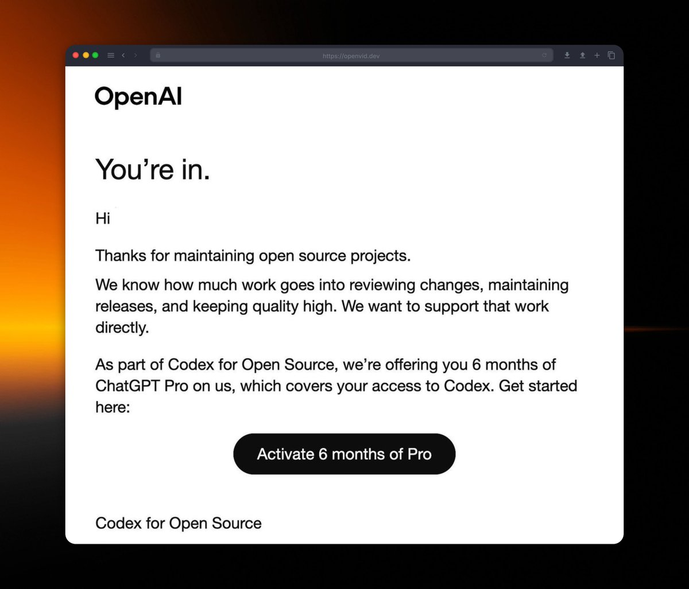
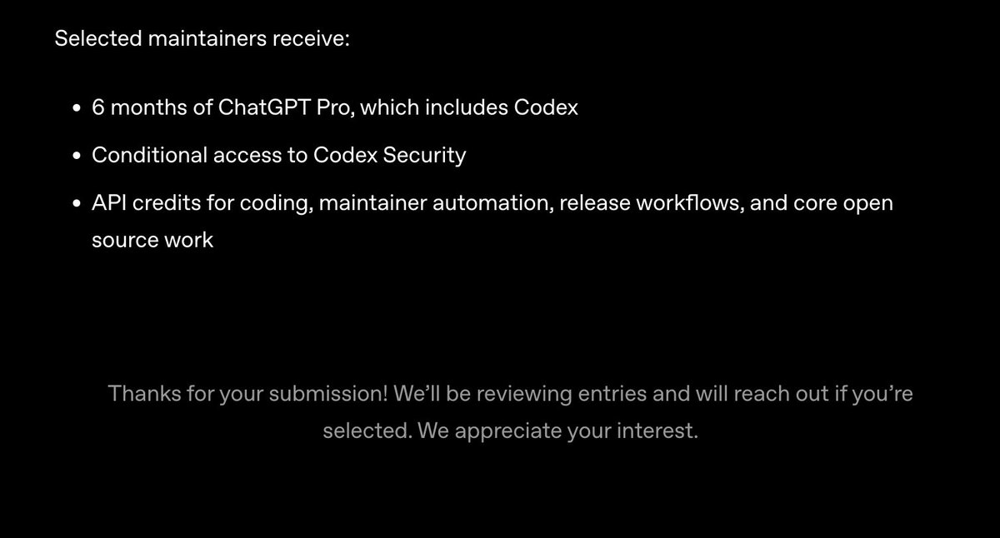

6 months of ChatGPT Pro for one evening in Claude Code. OpenAI opened a form for developers - and they approve almost everyone.

The subscription costs $200/month. $1,200 total. The form is open right now.

One requirement - an active GitHub with real projects.

&gt;&gt; No projects? Build them tonight:

Open Claude Code. Run one prompt: → "Give me top-10 vibe coding ideas for useful projects I can build fast and publish on GitHub"

One evening. 2-3 finished projects. Claude writes the README. The result looks like a month of work.

What you need for approval: → active GitHub profile → a few public repositories → some commit history → at least one genuinely useful project

A Japanese developer posted publicly: they approve everyone with an active GitHub. Not guaranteed - but the odds are real.

Worst case they say no. Best case - $1,200 free and 6 months of o3, GPT-5.5, full Codex without limits.

Form: [openai.com/form/codex-for…](http://openai.com/form/codex-for-oss)

Apply today while the form is open.

### 🖼️ Attached Media

## 💬 Replies

### 1 @Atenov_D (Atenov int.) (Author)

*Sun May 31 21:05:55 +0000 2026*

I hope you've already subscribed to my TG channel, where I regularly post updates from the world of AI and growth in X - [t.me/+rp50JBeEg4hlM…](https://t.me/+rp50JBeEg4hlMGNi)

### 2 @shmidtqq (shmidt)

*Sun May 31 17:04:40 +0000 2026*

@Atenov\_D spent $0, got approved in a week. sometimes playing the game right pays off. github really does matter

### 3 @Atenov_D (Atenov int.) (Author)

*Sun May 31 20:56:41 +0000 2026*

@shmidtqq fact

### 4 @0x_kaize (kaize)

*Mon Jun 01 14:45:07 +0000 2026*

@Atenov\_D here are the best posts, I would like to see such alpha posts in the news feed more often

### 5 @Atenov_D (Atenov int.) (Author)

*Mon Jun 01 14:51:14 +0000 2026*

@0x\_kaize Thanks! The new post is already up

### 6 @0xbobaaa (0xbobaa)

*Sun May 31 17:14:35 +0000 2026*

@Atenov\_D why use ChatGPT when there's Claude?

### 7 @Atenov_D (Atenov int.) (Author)

*Sun May 31 17:15:54 +0000 2026*

@0xbobaaa Because Claude isn't giving away $1,200 for subscriptions

### 8 @charliwtquirks (Charli)

*Mon Jun 01 12:17:34 +0000 2026*

@Atenov\_D Grand i already have a GitHub with 85 repos I’ll give this a go

### 9 @Atenov_D (Atenov int.) (Author)

*Mon Jun 01 12:31:22 +0000 2026*

@charliwtquirks Waiting for feedback!

### 10 @0xViki_eth (Vikig13.eth)

*Mon Jun 01 11:08:25 +0000 2026*

@Atenov\_D ChatGPT - top🔥

### 11 @Atenov_D (Atenov int.) (Author)

*Mon Jun 01 11:14:51 +0000 2026*

@0xViki\_eth A worthy rival for Claude

### 12 @iscdu (isa)

*Mon Jun 01 09:32:21 +0000 2026*

@Atenov\_D GPT 5.5 &gt; Opus 4.8 &gt; GPT5.3-Codex

### 13 @Atenov_D (Atenov int.) (Author)

*Mon Jun 01 09:58:08 +0000 2026*

@iscdu It depends. I've never seen anything better than Claude when it comes to working with text - I've tried a lot of things.

### 14 @KnightPredict (Knight)

*Sun May 31 17:21:51 +0000 2026*

@Atenov\_D thanks a lot bro

### 15 @vijn_crypto (vijn)

*Sun May 31 20:31:36 +0000 2026*

@Atenov\_D thanks for this info!

### 16 @DankoWeb3 (Danko)

*Mon Jun 01 02:25:11 +0000 2026*

@Atenov\_D oh 
this is actually useful
thanks bro

i’m on it today

### 17 @paonx_eth (Paone)

*Sun May 31 20:26:55 +0000 2026*

@Atenov\_D worst case they say no, best case $1,200 free

the downside on that application is 20 minutes

### 18 @gerardsans (Gerard Sans | Axiom 🇬🇧)

*Mon Jun 01 14:09:44 +0000 2026*

@Atenov\_D [x.com/gerardsans/sta…](https://x.com/gerardsans/status/2058513537815752911)

### 19 @monokern (monokern)

*Sun May 31 19:33:53 +0000 2026*

@Atenov\_D have you already received this subscription?

### 20 @AIwithJames (James AI)

*Mon Jun 01 09:51:23 +0000 2026*

@Atenov\_D If it sounds like “almost guaranteed approval for $1200 free access,” it’s worth double-checking the source before believing the hype.

### 21 @GabGarrett (Gabriel Garrett)

*Mon Jun 01 00:56:55 +0000 2026*

@Atenov\_D exploiting this is how this gets shut down. poisoning the commons, for what?

### 22 @timochka_cutie (Tim🇺🇦Шарить Шахи)

*Mon Jun 01 03:16:35 +0000 2026*

@Atenov\_D let's see 

### 23 @ProDrifterDK (ProDrifterDK)

*Mon Jun 01 15:41:36 +0000 2026*

@Atenov\_D 

### 24 @ScarletKc_ (KC)

*Mon Jun 01 01:39:04 +0000 2026*

@Atenov\_D gay

### 25 @sam_cannas (Samuele Cannas)

*Mon Jun 01 14:43:03 +0000 2026*

@Atenov\_D I love taking advantage of help offered to meaningful OSS projects that are the ones being hit by all of the supply chain and cybersec attacks just so I don't have to pay for a sub

Crypto bros will literally hop on anything holy shit

### 26 @Dharisssss (Dharis)

*Mon Jun 01 06:39:46 +0000 2026*

@Atenov\_D Pls stop the abuse

This is why we cant have good things

### 27 @LIFgenii (LifGenii Inc.)

*Sun May 31 17:30:32 +0000 2026*

@Atenov\_D An active GitHub profile is quietly becoming the new resume.

### 28 @bartender_loopy (Bartender Loopy🍸)

*Mon Jun 01 04:12:11 +0000 2026*

@Atenov\_D 죽이네연 일단 신청박고옴

### 29 @mikeyny_zw (Michael Nyamande 🇿🇼)

*Mon Jun 01 05:49:48 +0000 2026*

@Atenov\_D @iamngoni @gtchakama @SirTitusVeTech

### 30 @_vu (vu)

*Mon Jun 01 06:02:49 +0000 2026*

@Atenov\_D This is why we can’t have nice things

### 31 @itsthedonhashim (Hussain Hashim | Building SundayBack)

*Sun May 31 18:32:43 +0000 2026*

@Atenov\_D @Atenov\_D honestly, seems steep for what you get. might just stick with ChatGPT Pro at this rate 🤷‍♂️

### 32 @gpt3_eth (Frank ✈️ (📜,📜))

*Mon Jun 01 23:08:54 +0000 2026*

@Atenov\_D using claude to farm openai credits is peak meta.

### 33 @BlameEV (JBlameMe)

*Sun May 31 17:07:18 +0000 2026*

@Atenov\_D ngl that polymarket agent actually sounds useful

gotta finish a repo first so i can qualify for the free year tho

### 34 @Paper_Scarecrow (Robert Z. Nemitz)

*Mon Jun 01 12:08:20 +0000 2026*

While I love open source, I don't love the terms and agreements here:

"The applicant acknowledges that OpenAI may currently or in the future  develop, receive, review, fund, support, or work with ideas, projects,  repositories, workflows, or proposals that are similar or identical to  the applicant’s submission. Nothing in these Program Terms prevents  OpenAI from independently developing, funding, or supporting any such  similar or identical work.

The applicant further acknowledges that OpenAI assumes no obligation  of exclusivity with respect to any submission and that any decision to  select, fund, or support a project or maintainer is made in OpenAI’s  sole discretion.

Except as described in OpenAI’s privacy policy or as required by law,  applicants should not submit confidential information in connection  with the Program, and OpenAI has no duty to treat application materials  as confidential."
[developers.openai.com/codex/codex-fo…](https://developers.openai.com/codex/codex-for-oss-terms)

### 35 @DangcingAI (Dangcing Chan)

*Mon Jun 01 06:49:07 +0000 2026*

@Atenov\_D late night vibe coding is my usual thing, it really feels like magic when the flow hits. real projects need more than a quick prompt, but if it works, worth a shot.

