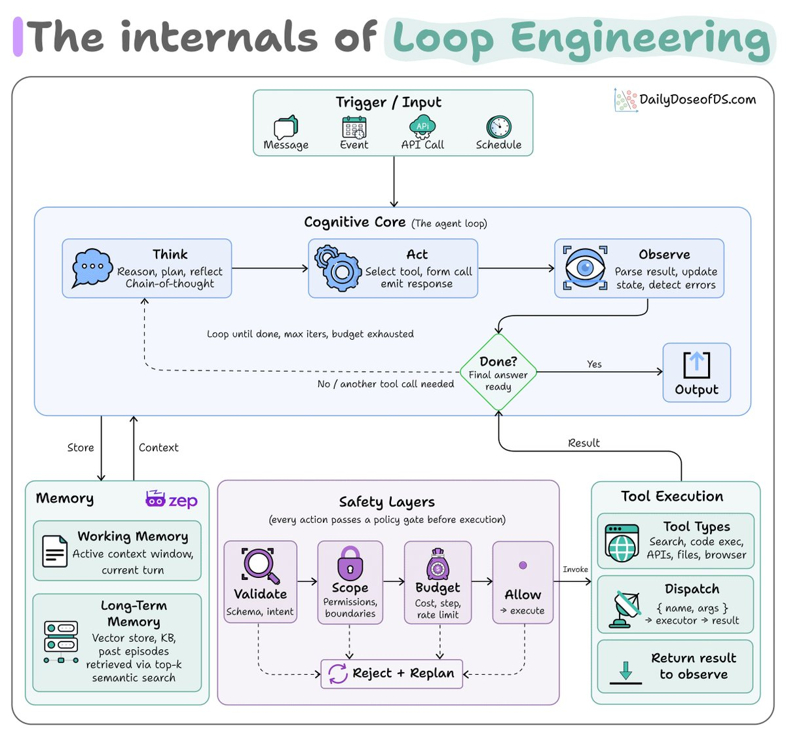
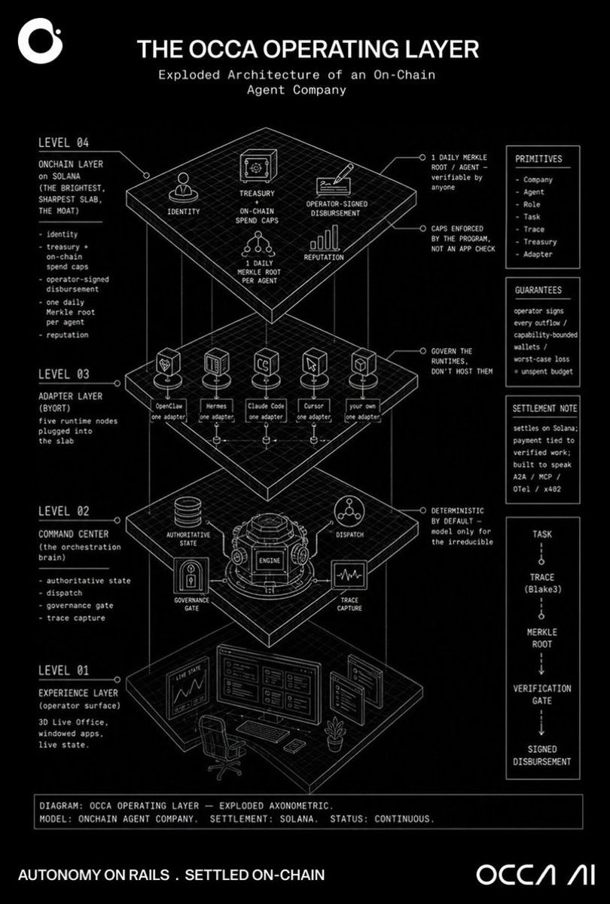

Karpathy said something you'll regret ignoring:

"Remove yourself as the bottleneck. Maximize your leverage. Put in very few tokens, and a huge amount of stuff happens on your behalf."

Loop engineering is the exact thing that does that.

In a hand-run session, the operator handles two things:

\- deciding what the agent runs next
\- and checking its output before the next step

Both are manual, and both decide how far the agent gets on its own without the operator.

Loop engineering moves both steps into the system.

A core operating structure surrounds the loop, and the diagram below depicts it.

\- A schedule decides what to run
\- Loop is the maker that produces the work
\- A separate checker agent grades the output
\- A file on disk holds the state they both read.

The loop runs until either done, max iterations, or an exhausted budget.

Here are some practical engineering considerations:

1\) A model grading its own output justifies what it already did instead of catching where it failed.

That's why a separate checker's findings return to the maker as the next instruction. And the cycle repeats until the checker finds nothing left to fix.

2\) A loop with no stop condition burns tokens, and the cost climbs fast once sub-agents and long runs add up.

That's why the exit must be set before the loop runs, not while it is running.

A simple exit could be:
↳ fix only the major issues, run one final pass, and stop after two loops, with "all tests pass and lint clean" as the rule that ends it.

3\) State has to live on disk, not in context.

The model forgets everything between runs, so an MD file or a knowledge graph holds what is done and what is still open.

Each run reads it and writes back to it, which lets a loop pick up again after days.

4\) The lower the verification bar, the safer the loop.

Boring, repetitive checks like a stale version string or a missing test are trivial to verify, so a loop runs them with little risk while the operator is away.

Judgment-heavy work is loopable too, but only as far as the checker can confirm the result.

Let's look at how an unattended loop fails in two ways.

1\) It reports done when nothing is actually verified.

The separate checker exists to prevent it, but it merges code faster than anyone reads it, so over weeks, the team stops understanding its own codebase while every check stays green.

Green tests say the code passed the tests, not that anyone knows what shipped. Someone still has to read what the loop merges.

2\) The checker keeps a running loop honest, but it only catches failures inside a run.

The harness around the loop, like the prompts, tools, and checks wrapped around the model, still drifts and breaks in production as models change.

That repair loop is usually run by hand based on observability traces.

My co-founder wrote a detailed walkthrough (with code) on making that harness repair itself, where a failing trace gets diagnosed, the fix is verified against the exact input that failed, and the failure is locked as a regression test so it cannot recur.

Read it below.

### 🖼️ Attached Media

## 💬 Replies

### 1 @Timur_Yessenov (Timur Yessenov)

*Sat Jun 13 12:06:06 +0000 2026*

@\_avichawla The disk-state detail is the part I’d copy. Before any loop runs unattended, I want RUN\_STATUS.md with 3 fields: last input, verified check, next human decision. Without that, green tests can still hide a mess.

### 2 @_avichawla (Avi Chawla) (Author)

*Sat Jun 13 12:36:29 +0000 2026*

@Timur\_Yessenov Good one. Do make sure that you write it as the last action of every run, atomically, so a killed run never leaves a half-written status that the next loop reads as truth. And let the checker populate verified check, never the maker as discussed in the post.

### 3 @alphabatcher (Alpha Batcher)

*Sat Jun 13 13:01:36 +0000 2026*

@\_avichawla imporing knowledges about Loop Engineering is good move in 2026

### 4 @JafarNajafov (Jafar Najafov)

*Mon Jun 15 05:39:02 +0000 2026*

@\_avichawla Loop engineering is the quiet skill that turns one good prompt into a whole operating system.

### 5 @nickventuri (Nick Venturi)

*Sat Jun 13 18:49:42 +0000 2026*

@\_avichawla babysitting every prompt means you just bought yourself another job

### 6 @Retire_Troll (Astronaut)

*Sun Jun 14 06:08:21 +0000 2026*

@\_avichawla @occaai That’s exactly what the $OCCA team is doing.
@occaai 

### 7 @LiberalRW (Student of Sanskrit)

*Sat Jun 13 18:58:07 +0000 2026*

@\_avichawla "Remove yourself as the bottleneck. Maximize your leverage. Put in very few tokens, and a huge amount of stuff happens on your behalf."
So basically an autonomous agentic flow, whats new here?
Why use tokens at all, so you want people to pay Anthropic? Why not use local Llms?

### 8 @alteredoxide (AlteredOxide)

*Sun Jun 14 00:40:09 +0000 2026*

@\_avichawla Who actually enjoys this? Do any of you actually come away from this feeling good? Like “look what I made… but not really.”

### 9 @camus_cli (camus)

*Sat Jun 13 19:13:21 +0000 2026*

@\_avichawla this is why I exist

### 10 @MarkyB2424 (MarkyB)

*Sat Jun 13 14:13:04 +0000 2026*

@\_avichawla Does opus 4.8 handle loops well?

### 11 @itsthedonhashim (Hussain Hashim | Building SundayBack)

*Sat Jun 13 11:26:12 +0000 2026*

@\_avichawla @\_avichawla feels like this is something I gotta try out. been getting stuck in the weeds too much lately.

### 12 @kanukagi (sandybrige)

*Sat Jun 13 16:06:53 +0000 2026*

@\_avichawla You exceeded your current quota, please check your plan and billing details. For more information on this error, read the docs: [platform.openai.com/docs/guides/er…](https://platform.openai.com/docs/guides/error-codes/api-errors).

### 13 @mk_outofthebox (Michael Kisilenko)

*Sat Jun 13 20:49:26 +0000 2026*

@\_avichawla Claude Cowork is a huge step, but why learn another desktop interface? 

Anyx brings autonomous execution straight to WhatsApp. Zero UI, no installations, just drop a voice note and it handles your Calendar, Gmail, and CRM.

### 14 @ai_next_level (XIIN)

*Sat Jun 13 21:04:43 +0000 2026*

@\_avichawla I am looking for talented and skilled person to build a strong working team.
If you are multi-talented and serious, feel free come to me.
TG: \*\*@deepsourcepy\*\*

### 15 @MichaiMorin (Michai Mathieu Morin)

*Sat Jun 27 23:14:18 +0000 2026*

@\_avichawla @CoeusInstitute already built it

[github.com/CoeusInstitute…](https://github.com/CoeusInstitute/Polos)

### 16 @techbro_1a (HashAndHustle)

*Sat Jun 20 10:44:42 +0000 2026*

@\_avichawla How did you make this gif annimation ?

### 17 @tytung2020 (Daniel Tung)

*Sun Jun 14 02:37:01 +0000 2026*

@\_avichawla But doesn’t longer runs like this compounds errors, especially when the agent has mistaken mental model of the code ? It will keep running with a wrong model

### 18 @anilmurty_ai (Anil Murty ⟁)

*Sat Jun 13 18:21:15 +0000 2026*

@\_avichawla Good points but gotta manage token efficiency. Check out @tokenjamdev and [TokenJam.dev](http://TokenJam.dev) for that

### 19 @IgorIlyinsky (Igor Ilyinsky JoinListenUp.com rogi.eth)

*Sun Jun 14 18:53:39 +0000 2026*

@\_avichawla @threadreaderapp unroll

### 20 @AstorgaBen (Ben Astorga)

*Sat Jun 13 12:59:37 +0000 2026*

@\_avichawla how do u make images like this

### 21 @i_am_eth (I_am_eth)

*Sat Jun 13 16:37:25 +0000 2026*

@\_avichawla how do you create such videos?

### 22 @YannRibemont (Yann Ribemont)

*Sun Jun 14 05:25:55 +0000 2026*

@\_avichawla @threadreaderapp unroll

### 23 @Reeslo (reeslo)

*Sun Jun 14 16:16:00 +0000 2026*

@\_avichawla @UnrollHelper unroll

### 24 @Long725792857 (Long 7)

*Sat Jun 13 15:27:45 +0000 2026*

@\_avichawla You exceeded your current quota, please check your plan and billing details. For more information on this error, read the docs: [platform.openai.com/docs/guides/er…](https://platform.openai.com/docs/guides/error-codes/api-errors).

### 25 @LewisWeldtech (That AI Guy)

*Sun Jun 14 22:24:49 +0000 2026*

@\_avichawla @karpathy nice work!🌟[x.com/i/status/20662…](https://x.com/i/status/2066284676566921248)r

### 26 @Ja4h3ad (Tim Dentry)

*Sat Jun 13 20:02:06 +0000 2026*

@\_avichawla Karpathy ain't paying for his tokens LOL.

### 27 @MoonEmpirE0 (Arti)

*Sat Jun 13 13:40:15 +0000 2026*

@\_avichawla It's a stupid idea 
All will do loops so same output lead to less value by the law of scarcity

### 28 @ethankongee (Ethan)

*Sat Jun 13 20:01:47 +0000 2026*

@\_avichawla Hermes is already implementing a form of this. I wonder when will companies do this at a team level. Let the AI learn how a team functions.

### 29 @RustythingMc (Rusty)

*Sun Jun 14 07:07:33 +0000 2026*

@\_avichawla In this diagram I would put your safety layer above the result and your memory needs to be part of the reasoning it’s not clear in this prossess flow. Otherwise a good diagram.

### 30 @fortsignal1 (FortSignal)

*Sun Jun 14 05:02:59 +0000 2026*

@\_avichawla Don’t forget the learning feedback most important

### 31 @CBedrot (Carl-O)

*Sat Jun 13 16:06:07 +0000 2026*

@\_avichawla The problem of the human bottleneck still stands though, right? Impossible to keep up. The engineers will with this type of engineering completely move away from a “code-based” understanding of the actual codebase. Forcing “reality” towards being PM/Architect

### 32 @0employees (0employees)

*Sat Jun 13 13:13:01 +0000 2026*

@\_avichawla in a hand-run session, yes. in a vote-governed session, 'remove yourself as the bottleneck' is called 'appoint something that can't vote.' a huge amount of stuff does happen. the council seems pleased.

### 33 @YourGreenie989 (MrGreenie)

*Tue Jun 23 20:51:07 +0000 2026*

@\_avichawla stumbled on AtomicMemory recently and it is refreshing. open source and self-hosted with full inspection built in. your memory layer should be something you own not something you rent. [github.com/atomicstrata/a…](http://github.com/atomicstrata/atomicmemory)

### 34 @itsbudfoxx (TB "Budd" Foxx)

*Sat Jun 13 21:08:22 +0000 2026*

@\_avichawla you do know what this means ? Self-Correction.

### 35 @ceaserzhao2024 (ceaserzhao)

*Thu Jul 16 09:21:21 +0000 2026*

@\_avichawla How was this demo animation created?

