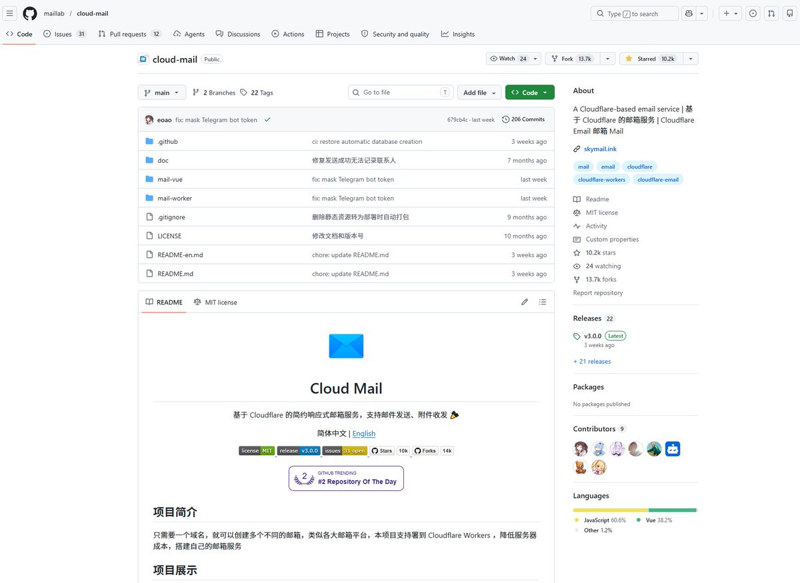

推荐一个屌爆的开源项目：Cloud Mail——[github.com/maillab/cloud-…](https://github.com/maillab/cloud-mail)

一个域名就可以实现无限的邮件的收发！！！
对！就是收和发！——不仅可以无限收邮件，还可以无限发邮件！！！

附一个我已经搭建好的教育邮箱的邮局：[mail.yelo.edu.kg](https://mail.yelo.edu.kg/)

以及顺带的官网：[yelo.edu.kg](https://www.yelo.edu.kg/)

最后送了一个邮箱注册的注册码（此注册码可以注册200个邮箱用户，先到行先得）：aWA1EWWu

玩得开心！

### 🖼️ Attached Media

## 💬 Replies

### 1 @xupaopaogm (徐跑跑)

*Sun May 31 01:26:06 +0000 2026*

@CxxVen 这个很有用，我之前搞个一年的域名邮箱现在到期了。刚好用你这个

### 2 @CxxVen (B.Z.在下张三) (Author)

*Sun May 31 02:39:24 +0000 2026*

@0xJoveXu 这个教育域名便宜，一年 20 多，可以一直续费，薅教育优惠的羊毛😂

### 3 @Jack51608536 (Jack)

*Sun May 31 16:10:11 +0000 2026*

@CxxVen 教育域名怎么注册？

### 4 @CxxVen (B.Z.在下张三) (Author)

*Mon Jun 01 09:02:38 +0000 2026*

@Jack51608536 付费咨询 199 元，私信我。

### 5 @AdrianChen916 (Hskaa)

*Sun May 31 11:33:37 +0000 2026*

@CxxVen Cloud Mail的最大价值在于把“邮件自由”从云服务商手里夺回来。单域名无限收发+开源代码，部署门槛不算高，已经有现成教育邮箱案例。建议搭配Docker部署，进一步降低运维成本，对重视数据主权的用户是极佳选择。

### 6 @CxxVen (B.Z.在下张三) (Author)

*Sun May 31 15:18:47 +0000 2026*

@AdrianChen916 是的，程序员改变世界啊

### 7 @BeeTreenew (bee tree new)

*Mon Jun 01 00:37:07 +0000 2026*

@CxxVen 佬给一个注册码

### 8 @Lemon432hz (Dolphin1980)

*Sun May 31 03:30:52 +0000 2026*

@CxxVen 求註冊碼

### 9 @CxxVen (B.Z.在下张三) (Author)

*Sun May 31 09:55:19 +0000 2026*

@Lemon432hz 私我一下，给你注册码。

### 10 @Lemon432hz (Dolphin1980)

*Sun May 31 03:24:19 +0000 2026*

@CxxVen 註冊碼用完了啊！註冊不了了

### 11 @CxxVen (B.Z.在下张三) (Author)

*Sun May 31 09:55:04 +0000 2026*

@Lemon432hz 私我一下，给你注册码。

### 12 @iswangchu (王处南男（纯手打）)

*Sun May 31 03:39:24 +0000 2026*

@CxxVen 能当做教育邮箱去薅羊毛吗

### 13 @CxxVen (B.Z.在下张三) (Author)

*Sun May 31 09:55:11 +0000 2026*

@Dawnjianghao 可以的。

### 14 @JamesDick69 (James Dick)

*Sun May 31 15:37:32 +0000 2026*

@CxxVen 你好！我想体验一下你搭建的 Cloud Mail 邮箱服务，但在注册时输入邀请码 aWA1EWWu 提示 noRegKeyCount（注册额度已满）。请问近期还会发放新的邀请码或者增加注册名额吗？非常期待能体验你的作品，谢谢！

### 15 @0xA2618 (Yang)

*Sun May 31 22:01:19 +0000 2026*

@CxxVen 教育邮箱以私信，希望大佬给我邀请码

### 16 @CxxVen (B.Z.在下张三) (Author)

*Mon Jun 01 09:15:06 +0000 2026*

@0xA2618 私信已回。

### 17 @haileykreed (不听洋洋)

*Sun May 31 07:04:05 +0000 2026*

@CxxVen 注册码用完了

### 18 @CxxVen (B.Z.在下张三) (Author)

*Sun May 31 09:57:08 +0000 2026*

@haileykreed 私我一下，给你注册码。

### 19 @ryan_acqin (acqin)

*Sun May 31 05:53:59 +0000 2026*

@CxxVen 大佬 注册码还有吗

### 20 @CxxVen (B.Z.在下张三) (Author)

*Sun May 31 09:54:54 +0000 2026*

@ryan\_acqin 私我，给你一个注册码。

### 21 @ncle99 (素质不详，遇强则强)

*Sun May 31 01:34:07 +0000 2026*

@CxxVen 注册了，关注了🤪

### 22 @CxxVen (B.Z.在下张三) (Author)

*Sun May 31 09:56:49 +0000 2026*

@ncle99 已回关，🤣🤣

### 23 @lonelycake765 (robin888)

*Sun May 31 01:22:48 +0000 2026*

@CxxVen 耶鲁大学吗

### 24 @CxxVen (B.Z.在下张三) (Author)

*Mon Jun 01 09:15:48 +0000 2026*

@lonelycake765 冒牌的耶鲁大学

### 25 @Tapnxx (Tapn)

*Mon Jun 01 02:53:42 +0000 2026*

@CxxVen 大佬，注册码用不了了

### 26 @CxxVen (B.Z.在下张三) (Author)

*Mon Jun 01 09:14:52 +0000 2026*

@Tapnxx xgsCwvc1

### 27 @0x2233 (乳阳王🔞)

*Sun May 31 03:13:39 +0000 2026*

@CxxVen 大佬激活码被用完了，我朋友也想注册，可否再发一个呢，谢谢

### 28 @CxxVen (B.Z.在下张三) (Author)

*Sun May 31 09:55:42 +0000 2026*

@0x2233 私我，给你注册码。

### 29 @weikangshe28883 (weikang shen)

*Mon Jun 01 03:53:32 +0000 2026*

@CxxVen 求一个注册码

### 30 @CxxVen (B.Z.在下张三) (Author)

*Mon Jun 01 09:06:20 +0000 2026*

@weikangshe28883 xgsCwvc1

### 31 @zsxink (Ryan Zhang)

*Sun May 31 00:36:48 +0000 2026*

@CxxVen 先注册一个，不知道后续有没有什么教育优惠可以薅

### 32 @CxxVen (B.Z.在下张三) (Author)

*Sun May 31 01:15:46 +0000 2026*

@zsxink 可以有而不用，但不能用而没有。

### 33 @small2 (Seth)

*Mon Jun 01 04:10:57 +0000 2026*

@CxxVen 请问这个跟 mailflare 有什么区别

### 34 @CxxVen (B.Z.在下张三) (Author)

*Mon Jun 01 09:14:07 +0000 2026*

@small2 没区别

