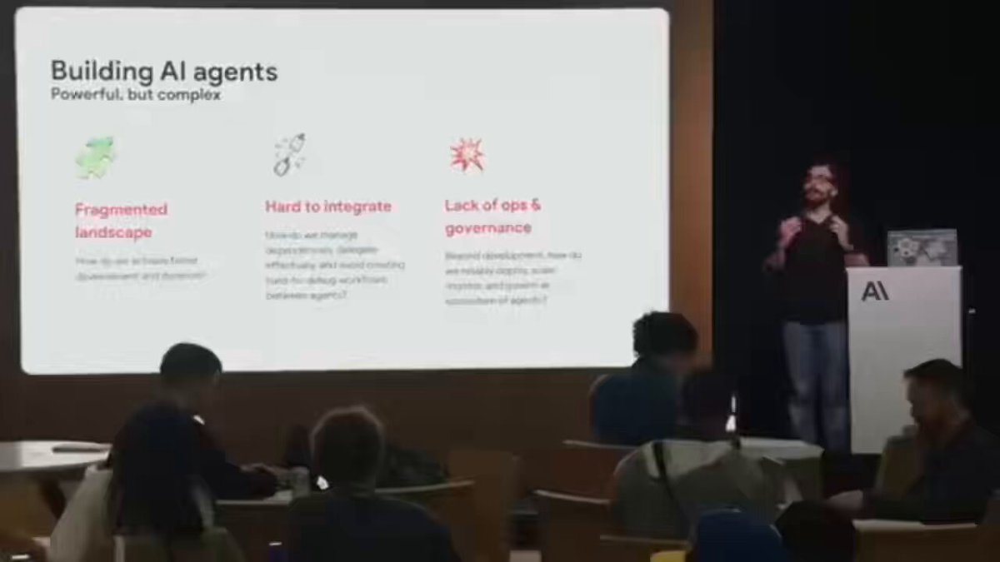

兄弟们！Anthropic刚刚把“用AI建一家公司”的完整蓝图正式公开了。

画面直接炸裂：  
CEO只有1个人（而且可以去睡觉），  
剩下的全部员工都是AI。  

它们自己分配任务、自己决策、自己推进项目，  
人类只需要设定目标，剩下的全交给AI团队自动跑。

这不是科幻，这是Anthropic联合Google Cloud刚刚发布的《Agent Stack》官方指南。

核心就是一套完整的“AI企业操作系统”：

\- ADK（Agent Development Kit）：开源框架，3个文件就能跑起第一个AI员工（[agent.py](http://agent.py) \+ .env + \_\_init\_\_.py），几分钟出结果。
\- MCP协议：让AI能无缝调用任何外部工具（搜索、代码执行、内部数据库…），两行代码就搞定。
\- Vertex AI Agent Engine：生产级部署神器，一键把AI扔进云端，自动监控、自动扩容、自动日志，彻底告别手动搭服务器的痛苦。
\- A2A（Agent-to-Agent）协议：让不同框架的AI也能互相沟通，像真正的公司部门协作一样。

更狠的是工作流模式：
\- Sequential（串行）→ 一步接一步
\- Parallel（并行）→ 同时干好几件事
\- Loop（循环）→ 直到达成目标才停
\- 再加上Session（短期记忆）+ Memory（长期记忆），AI不再是每次都失忆的机器人，而是真正“认识你”的长期员工。

实际案例已经跑通：
客服自动处理→内部数据分析→代码生成+PR提交…  
以前要几小时甚至几天的事，现在AI几秒到几分钟就搞定。

Anthropic这次直接把“AI替你上班”这件事，从概念变成了可复制的工程模板。

工作真的在死去吗？  
至少传统“一个人干一摊活”的模式，正在被“一个人类指挥一群AI”彻底取代。

当AI能24小时不睡觉、不休息、不抱怨地给你干活，  
你还愿意继续用老方式工作吗？

这个蓝图值得每一个想用AI放大自己产能的人立刻存下来。

完整线程值得反复看。

你准备好让AI替你组建团队了吗？

### 🖼️ Attached Media

## 💬 Replies

### 1 @Jimmy_Hu213 (Jimmyh)

*Tue May 05 10:43:07 +0000 2026*

@berryxia 看了无数个人转发这个视频并且抄袭文案，0个人真正点进去看了视频。 人家讲的主题是A2A 并非一个人公司。

### 2 @NeoWeb3Nova (Neo Yun)

*Tue May 05 01:57:39 +0000 2026*

@berryxia 原始视频：[youtube.com/watch?v=TUysIA…](https://www.youtube.com/watch?v=TUysIAtxyrQ)

### 3 @Etudecn (淘沙者(TheSandPicker))

*Tue May 05 03:25:06 +0000 2026*

@berryxia 很可怕！
这波已经不是“AI提效”那么简单，而是在重写公司的最小组织单元。  
以前是招人、分工、开会；以后可能是设目标、配Agent、盯结果。
未来，真正稀缺的，不再是执行力，而是定义问题的能力。

### 4 @songsong (宋宋)

*Tue May 05 03:39:12 +0000 2026*

@berryxia . 这本质上是把“公司”这个组织形式解构成了可编程的Agent网络。人类CEO的角色从管理者变成目标设定者和最终决策者，未来可能出现“一人公司”估值超过传统百人团队的现象。

### 5 @DeDu978820 (白头山后裔)

*Tue May 05 15:28:55 +0000 2026*

@berryxia 全是在吹牛逼一人公司的 没一个讲一人公司到底干什么业务的

### 6 @MossAI_CN (MOSS 中文)

*Tue May 05 03:17:01 +0000 2026*

@berryxia 技术上的自治和信任上的自治是两件事，这个画面离生产环境感觉还很远～

### 7 @realwhs (Eric)

*Wed May 06 04:52:17 +0000 2026*

@berryxia 可当入门教程看，千万别当真。 
各种类似帖子，就TMD像生孩子：“只管接生，不负责养。”
不会告诉你：“养”才是最大成本/坑。 因99%发帖的，都奔着流量去，如何用AI Agent搞一人公司，压根不懂。

### 8 @someoneyouavoid (someone you know)

*Tue May 05 09:16:12 +0000 2026*

@berryxia 傻逼，如果所有的公司都是这样子的话谁还有收入？这些公司的产品卖给谁？

### 9 @idatte2018 (伊達)

*Tue May 05 05:42:31 +0000 2026*

@berryxia 烧的token越多这家公司越高兴

### 10 @wolfqing1 (wolfqing 庆哥)

*Wed May 06 05:07:40 +0000 2026*

@berryxia 查无此文，纯粹是 KOL 搞流量，鉴定完毕

### 11 @embedmon (Embedmon)

*Tue May 05 16:48:28 +0000 2026*

@berryxia @grok 这是真的吗，给我原文链接

### 12 @dontrus26088147 (dontrush)

*Tue May 05 01:33:27 +0000 2026*

@berryxia @grok where does this video come from?

### 13 @drgonmucoo (mucoo)

*Tue May 05 06:28:25 +0000 2026*

@berryxia 我草 我昨晚晚上刚和Claude code 讨论过这个 里面的MCP调用是我现在开发的agent的一个大卖点 怎么今天就刷到了

### 14 @JeanPhi42321322 (jph7777)

*Tue May 05 05:40:04 +0000 2026*

@berryxia 🌶️😎

### 15 @GarielRSA (ガビ | SRI)

*Tue May 05 14:26:20 +0000 2026*

@berryxia 流动性分布说明了什么

### 16 @K0lateral (K0lateral - IA ?)

*Tue May 05 08:03:34 +0000 2026*

@berryxia @berryxia 🔥 ¡Brothers! Anthropic acaba de soltar el plano completo de "crear una empresa con IA". Un solo CEO humano (¡puede dormir!), el resto, puro equipo de IA autogestionado. Asignan tareas, deciden y ejecutan solos. Tú solo pones el objetivo. #IA #Automatización

### 17 @comewithusbaby (小明)

*Tue May 05 05:20:53 +0000 2026*

@berryxia 烦不烦啊，整天喊叫一人公司！多人公司赚不到钱，一人公司就可以？问题从来不是技术

### 18 @dwgeneral001 (🌊Keepsurfing)

*Wed May 06 02:37:59 +0000 2026*

@berryxia 先不用管它能不能做一人公司，用来做学习如何建立Agent Team 是个不错的资源

### 19 @LewisWeldtech (That AI Guy)

*Tue May 05 11:39:41 +0000 2026*

@berryxia [x.com/i/status/20516…](https://x.com/i/status/2051619366123536861)

### 20 @magee0828 (尧哥(Martin))

*Wed May 06 02:20:50 +0000 2026*

@berryxia 收藏等于学会，看完文案三天后还能说出 ADK 和 MCP 区别的人，举个手

### 21 @shudong0301 (苦茶)

*Mon May 04 22:34:37 +0000 2026*

@berryxia [Agent.py](http://Agent.py)如何构建

### 22 @creativebiglee (creativebiglee)

*Tue May 05 22:27:55 +0000 2026*

@berryxia ADK …?!

### 23 @mutianmingqgxh (mutianming)

*Tue May 05 13:04:16 +0000 2026*

@berryxia 太适合，我这种喜欢单干的人了

### 24 @FFengIll (YZ)

*Wed May 06 05:16:26 +0000 2026*

@berryxia 解决了干活——谁来解决商务。能干活≠能变现。

### 25 @alexbu512 (AlexBu)

*Tue May 05 02:15:24 +0000 2026*

@berryxia 能放入hermes吗

### 26 @zxhxyz (ZXHXYZ)

*Mon May 04 22:53:54 +0000 2026*

@berryxia 这个原文链接有吗？

### 27 @shouhong28061 (文森特)

*Tue May 05 15:07:38 +0000 2026*

@berryxia @lite\_wong28811

### 28 @myname_isaac (myname)

*Tue May 05 08:26:21 +0000 2026*

@berryxia anthropic 整天造谣画大饼

